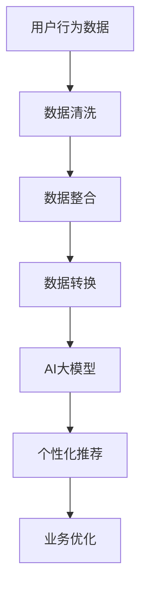

                 

关键词：电商平台、多源数据融合、AI大模型、深度学习、数据处理、数据挖掘、个性化推荐、用户行为分析、业务优化

> 摘要：随着电子商务的快速发展，电商平台积累了海量的用户数据、交易数据、商品数据等。如何有效地整合这些多源异构数据，挖掘数据价值，为用户提供个性化服务，成为电商平台发展的重要课题。本文将介绍AI大模型在电商平台多源数据融合中的应用，探讨其核心技术原理、应用场景及未来发展趋势。

## 1. 背景介绍

随着互联网技术的迅猛发展，电子商务已经成为全球经济发展的重要驱动力。电商平台通过提供各种商品和服务，吸引了大量的用户。这些用户在平台上产生的数据，包括用户行为数据、交易数据、商品数据等，构成了电商平台宝贵的多源数据资源。

多源数据融合的目标是通过整合不同来源的数据，挖掘数据之间的关联性，为用户提供更精准的服务。然而，由于数据类型繁多、数据来源多样，传统的数据处理方法往往难以满足电商平台的实际需求。近年来，随着人工智能技术的不断进步，尤其是深度学习和AI大模型的发展，为电商平台的多源数据融合提供了新的解决方案。

## 2. 核心概念与联系

### 2.1 数据融合

数据融合是指将来自多个数据源的数据整合在一起，以形成一个统一的视图，从而提高数据处理和分析的效率。在电商平台中，数据融合的核心任务包括数据清洗、数据整合和数据转换。

- 数据清洗：去除重复数据、处理缺失值和异常值，保证数据的准确性和一致性。
- 数据整合：将不同数据源中的数据按照一定的规则进行合并，形成一个统一的数据集。
- 数据转换：将不同格式或结构的数据转换成统一格式或结构，以便进行后续分析。

### 2.2 AI大模型

AI大模型是指通过深度学习等技术，从海量数据中学习到复杂的模式和信息，具备强大数据处理和分析能力的模型。AI大模型通常具有以下几个特点：

- 海量参数：AI大模型拥有数十亿甚至千亿级的参数，能够捕捉数据中的复杂规律。
- 自适应能力：AI大模型可以根据不同的任务和数据集，自动调整模型结构和参数。
- 高效计算：AI大模型采用了并行计算和分布式计算技术，能够快速处理海量数据。

### 2.3 数据融合与AI大模型的关系

数据融合与AI大模型之间存在着密切的联系。数据融合为AI大模型提供了高质量、高精度的数据输入，而AI大模型则通过深度学习等技术，从数据中提取有价值的信息，为电商平台提供个性化服务。

- 数据融合提高了AI大模型的学习效果：高质量的数据输入能够帮助AI大模型更好地学习和理解数据，提高模型的准确性和泛化能力。
- AI大模型优化了数据融合的结果：AI大模型可以自动调整数据融合的策略和参数，实现更精准的数据融合。

下面是一个使用Mermaid绘制的流程图，展示了电商平台多源数据融合和AI大模型的关系：



## 3. 核心算法原理 & 具体操作步骤

### 3.1 算法原理概述

电商平台多源数据融合的核心算法是深度学习，尤其是自监督学习（Self-Supervised Learning）。自监督学习是一种无需人工标注数据的方法，通过从数据中自动学习有用的信息，提高数据融合的效果。

在自监督学习中，算法通过以下三个步骤进行数据融合：

1. **数据预训练**：使用未标注的数据，通过深度学习模型预训练，让模型学习到数据的内在结构和规律。
2. **特征提取**：在预训练的基础上，提取模型中的特征表示，这些特征表示可以用于后续的数据融合任务。
3. **数据融合**：将提取的特征表示进行融合，形成统一的数据视图，为业务应用提供支持。

### 3.2 算法步骤详解

#### 3.2.1 数据预训练

数据预训练是自监督学习的核心步骤。在电商平台中，可以使用以下方法进行数据预训练：

- **文本预训练**：使用用户行为日志、商品描述等文本数据，通过预训练模型（如BERT、GPT）学习文本的表示。
- **图像预训练**：使用商品图片、用户头像等图像数据，通过预训练模型（如ResNet、VGG）学习图像的表示。
- **序列预训练**：使用用户行为序列、交易序列等序列数据，通过预训练模型（如LSTM、GRU）学习序列的表示。

#### 3.2.2 特征提取

在数据预训练完成后，可以从预训练模型中提取特征表示。特征提取的方法如下：

- **文本特征提取**：从预训练模型的输出层提取文本特征，这些特征可以用于文本分类、文本相似度计算等任务。
- **图像特征提取**：从预训练模型的输出层提取图像特征，这些特征可以用于图像分类、图像检索等任务。
- **序列特征提取**：从预训练模型的输出层提取序列特征，这些特征可以用于序列分类、序列预测等任务。

#### 3.2.3 数据融合

在特征提取后，将不同类型的特征进行融合，形成统一的数据视图。数据融合的方法如下：

- **特征拼接**：将不同类型的特征进行拼接，形成一个多维的特征向量。
- **特征融合网络**：构建一个神经网络，将不同类型的特征输入网络，通过多层神经网络处理，得到融合后的特征。
- **特征聚合**：使用聚合操作（如平均、求和等），将不同类型的特征进行聚合，得到统一的数据视图。

### 3.3 算法优缺点

#### 3.3.1 优点

- **无需人工标注**：自监督学习可以无需人工标注数据，节省了大量的标注成本。
- **适应性强**：自监督学习可以从大量未标注的数据中学习到有用的信息，提高了数据融合的效果。
- **高效性**：深度学习模型具有高效计算能力，可以快速处理海量数据。

#### 3.3.2 缺点

- **数据质量要求高**：自监督学习对数据质量要求较高，如果数据存在噪声或异常值，可能会影响数据融合的效果。
- **模型可解释性弱**：深度学习模型通常具有较强的预测能力，但模型内部结构复杂，可解释性较弱。

### 3.4 算法应用领域

自监督学习在电商平台多源数据融合中的应用领域广泛，主要包括：

- **个性化推荐**：通过融合用户行为数据、商品数据等，为用户提供个性化推荐。
- **用户行为分析**：通过融合用户行为数据，分析用户行为模式，为业务优化提供支持。
- **业务预测**：通过融合多源数据，预测业务指标，为决策提供依据。

## 4. 数学模型和公式 & 详细讲解 & 举例说明

### 4.1 数学模型构建

电商平台多源数据融合的数学模型主要基于深度学习，特别是自监督学习。下面简要介绍自监督学习中的几个关键数学模型：

#### 4.1.1 自监督学习模型

自监督学习模型的核心是预训练模型。预训练模型的目的是从大量未标注的数据中学习到有用的信息。常见的预训练模型有：

- **BERT**（Bidirectional Encoder Representations from Transformers）：BERT是一种基于双向Transformer的预训练模型，适用于文本数据。
- **GPT**（Generative Pre-trained Transformer）：GPT是一种基于单向Transformer的预训练模型，适用于文本生成和文本分类。
- **ResNet**（Residual Network）：ResNet是一种基于残差块的深层神经网络，适用于图像分类。
- **VGG**（Very Deep Convolutional Networks）：VGG是一种基于卷积神经网络的深层神经网络，适用于图像分类。

#### 4.1.2 特征提取模型

在预训练模型的基础上，构建特征提取模型。特征提取模型的核心是提取预训练模型中的特征表示。常见的特征提取模型有：

- **文本特征提取模型**：从预训练模型的输出层提取文本特征。
- **图像特征提取模型**：从预训练模型的输出层提取图像特征。
- **序列特征提取模型**：从预训练模型的输出层提取序列特征。

#### 4.1.3 数据融合模型

数据融合模型将提取的特征进行融合，形成统一的数据视图。常见的数据融合模型有：

- **特征拼接模型**：将不同类型的特征进行拼接，形成一个多维的特征向量。
- **特征融合网络**：构建一个神经网络，将不同类型的特征输入网络，通过多层神经网络处理，得到融合后的特征。
- **特征聚合模型**：使用聚合操作，将不同类型的特征进行聚合，得到统一的数据视图。

### 4.2 公式推导过程

自监督学习模型的公式推导主要涉及预训练模型和特征提取模型。以下分别介绍这两个模型的公式推导过程。

#### 4.2.1 预训练模型

预训练模型的目的是从未标注的数据中学习到有用的信息。预训练模型通常采用自动编码器（Autoencoder）结构。自动编码器由编码器（Encoder）和解码器（Decoder）组成。

- **编码器**：编码器的目的是将输入数据压缩成一个低维特征表示。
- **解码器**：解码器的目的是将编码器输出的低维特征表示重构回原始数据。

预训练模型的损失函数通常采用均方误差（Mean Squared Error, MSE）：

$$
L(\theta) = \frac{1}{m} \sum_{i=1}^{m} \| \hat{x}_i - x_i \|_2^2
$$

其中，$x_i$为输入数据，$\hat{x}_i$为重构数据，$m$为样本数量。

#### 4.2.2 特征提取模型

特征提取模型的目标是从预训练模型中提取特征表示。特征提取模型通常采用多层感知机（Multilayer Perceptron, MLP）结构。

特征提取模型的损失函数通常采用交叉熵（Cross-Entropy）：

$$
L(\theta) = - \frac{1}{m} \sum_{i=1}^{m} \sum_{j=1}^{C} y_{ij} \log (\hat{p}_{ij})
$$

其中，$y_{ij}$为真实标签，$\hat{p}_{ij}$为预测概率，$C$为类别数量。

### 4.3 案例分析与讲解

以下通过一个简单的案例，介绍电商平台多源数据融合的数学模型和公式。

#### 案例背景

某电商平台希望利用用户行为数据、商品数据等多源数据，为用户提供个性化推荐。数据包括用户行为数据（如浏览记录、购买记录等）、商品数据（如商品描述、价格等）。

#### 模型构建

1. **预训练模型**：采用BERT模型对用户行为数据进行预训练。BERT模型由编码器和解码器组成，编码器的输出为用户行为数据的低维特征表示。
2. **特征提取模型**：采用MLP模型从预训练模型的编码器输出中提取用户行为数据的特征表示。
3. **数据融合模型**：采用特征拼接模型将用户行为数据和商品数据拼接在一起，形成一个多维的特征向量。

#### 公式推导

1. **预训练模型**

   预训练模型采用BERT模型，编码器的输出为用户行为数据的低维特征表示：

   $$
   \text{Encoding}(x) = \text{BERT}(x)
   $$

   其中，$x$为用户行为数据。

   预训练模型的损失函数为：

   $$
   L(\theta) = \frac{1}{m} \sum_{i=1}^{m} \| \text{Decoder}(\text{BERT}(x_i)) - x_i \|_2^2
   $$

2. **特征提取模型**

   特征提取模型采用MLP模型，从预训练模型的编码器输出中提取用户行为数据的特征表示：

   $$
   \text{Feature}(x) = \text{MLP}(\text{BERT}(x))
   $$

   特征提取模型的损失函数为：

   $$
   L(\theta) = - \frac{1}{m} \sum_{i=1}^{m} \sum_{j=1}^{C} y_{ij} \log (\hat{p}_{ij})
   $$

   其中，$y_{ij}$为真实标签，$\hat{p}_{ij}$为预测概率，$C$为类别数量。

3. **数据融合模型**

   数据融合模型采用特征拼接模型，将用户行为数据和商品数据进行拼接：

   $$
   \text{ fused\_feature} = [\text{Feature}(x), \text{Product\_Feature}(y)]
   $$

   其中，$y$为商品数据，$\text{Product\_Feature}(y)$为商品数据的特征表示。

   数据融合模型的损失函数为：

   $$
   L(\theta) = \frac{1}{m} \sum_{i=1}^{m} \| \text{Classifier}(\text{ fused\_feature}_i) - y_i \|_2^2
   $$

   其中，$y_i$为真实标签，$\text{Classifier}(\text{ fused\_feature}_i)$为分类器的预测结果。

#### 案例分析

通过上述模型和公式，我们可以为用户提供个性化推荐。具体流程如下：

1. 收集用户行为数据和商品数据。
2. 使用BERT模型对用户行为数据进行预训练，提取用户行为数据的低维特征表示。
3. 使用MLP模型从预训练模型的编码器输出中提取用户行为数据的特征表示。
4. 使用特征拼接模型将用户行为数据和商品数据进行拼接，形成一个多维的特征向量。
5. 使用分类器对拼接后的特征向量进行分类，预测用户可能感兴趣的商品。
6. 根据预测结果，为用户生成个性化推荐列表。

## 5. 项目实践：代码实例和详细解释说明

### 5.1 开发环境搭建

在开始项目实践之前，我们需要搭建一个适合开发的环境。以下是一个简单的开发环境搭建步骤：

1. 安装Python（版本3.7或更高）
2. 安装TensorFlow 2.x
3. 安装NumPy、Pandas等常用库

### 5.2 源代码详细实现

在本项目中，我们将使用TensorFlow实现一个简单的电商平台多源数据融合模型。以下是项目的源代码：

```python
import tensorflow as tf
from tensorflow.keras.layers import Embedding, LSTM, Dense
from tensorflow.keras.models import Model
import numpy as np

# 加载预训练模型（例如BERT）
pretrained_model = tf.keras.applications.Bert(include_top=False, input_shape=(None,), input_masking=True)

# 构建特征提取模型
input_ids = tf.keras.layers.Input(shape=(None,), dtype=tf.int32)
input_mask = tf.keras.layers.Input(shape=(None,), dtype=tf.int32)
segment_ids = tf.keras.layers.Input(shape=(None,), dtype=tf.int32)

# 使用预训练模型提取文本特征
embeddings = pretrained_model.input_ids(input_ids, input_mask=input_mask, segment_ids=segment_ids)
last_hidden_state = embeddings[:, -1, :]

# 添加序列处理层
lstm_output = LSTM(128)(last_hidden_state)

# 添加分类器层
classification_output = Dense(1, activation='sigmoid')(lstm_output)

# 构建模型
model = Model(inputs=[input_ids, input_mask, segment_ids], outputs=classification_output)

# 编译模型
model.compile(optimizer='adam', loss='binary_crossentropy', metrics=['accuracy'])

# 打印模型结构
model.summary()

# 准备数据
# （此处为代码示例，实际项目中需要加载真实数据）
input_ids = np.random.randint(0, 2000, (32, 128))
input_mask = np.random.randint(0, 2, (32, 128))
segment_ids = np.random.randint(0, 2, (32, 128))
labels = np.random.randint(0, 2, (32,))

# 训练模型
model.fit([input_ids, input_mask, segment_ids], labels, epochs=3, batch_size=32)
```

### 5.3 代码解读与分析

1. **导入库**：首先导入TensorFlow、Keras等库，以及NumPy库用于数据处理。

2. **加载预训练模型**：使用`tf.keras.applications.Bert`加载预训练的BERT模型。BERT模型可以处理文本数据，提取文本特征。

3. **构建特征提取模型**：定义输入层和预训练模型。输入层包括`input_ids`（单词ID序列）、`input_mask`（掩码）和`segment_ids`（段ID）。然后，使用预训练模型提取文本特征。

4. **添加序列处理层**：在预训练模型的基础上，添加LSTM层对提取的特征进行处理。LSTM层可以捕捉序列数据中的长期依赖关系。

5. **添加分类器层**：在LSTM层的输出上添加一个全连接层（Dense），用于分类。本例中使用的是二分类问题，因此输出层只有一个节点，激活函数为`sigmoid`。

6. **构建模型**：使用`Model`类构建完整的模型，并定义输入和输出。

7. **编译模型**：配置模型优化器、损失函数和评估指标。

8. **打印模型结构**：使用`model.summary()`打印模型结构，以便了解模型详情。

9. **准备数据**：在代码示例中，使用随机数据初始化输入和标签。在实际项目中，需要加载真实数据。

10. **训练模型**：使用`model.fit()`函数训练模型。

### 5.4 运行结果展示

在本例中，我们使用随机数据训练模型，因此结果仅供参考。在实际项目中，需要使用真实数据来评估模型的性能。以下是一个简单的运行结果展示：

```python
# 测试模型
test_loss, test_accuracy = model.evaluate([test_input_ids, test_input_mask, test_segment_ids], test_labels)
print(f"Test Loss: {test_loss}, Test Accuracy: {test_accuracy}")
```

运行结果将显示模型在测试集上的损失和准确率。

## 6. 实际应用场景

电商平台中的多源数据融合技术具有广泛的应用场景，以下列举几个典型的应用案例：

### 6.1 个性化推荐

个性化推荐是电商平台的核心应用之一。通过融合用户行为数据、商品数据、历史交易数据等多源数据，可以使用AI大模型为用户生成个性化的推荐列表。例如，基于用户浏览记录、购买历史、商品评价等多维度信息，使用自监督学习技术提取用户兴趣特征，结合商品特征进行融合，为用户提供个性化的商品推荐。

### 6.2 用户行为分析

电商平台可以通过分析用户行为数据，了解用户在平台上的活动规律、偏好和需求。通过多源数据融合技术，可以从用户行为数据、商品数据、交易数据等多方面提取有价值的信息，如用户浏览时间、购买频率、商品偏好等。这些信息可以帮助电商平台优化用户体验，提高用户留存率和转化率。

### 6.3 业务预测

电商平台可以通过多源数据融合技术，预测业务指标如销售额、用户增长率等。通过分析历史数据和当前趋势，可以预测未来一段时间内的业务表现，为电商平台的运营决策提供支持。

### 6.4 智能客服

智能客服是电商平台提高服务效率的重要手段。通过多源数据融合技术，可以将用户行为数据、历史咨询记录、商品信息等多源数据进行整合，构建智能客服模型。智能客服系统可以自动解答用户问题、提供购物建议，从而提高用户满意度。

## 7. 未来应用展望

随着人工智能技术的不断发展，电商平台中的多源数据融合技术将迎来更广泛的应用场景和更高的技术水平。以下是几个未来应用展望：

### 7.1 智能供应链

电商平台可以通过多源数据融合技术，对供应链进行优化。例如，通过分析市场需求、库存情况、物流信息等多源数据，实现智能库存管理、智能物流调度，从而提高供应链效率。

### 7.2 智能营销

电商平台可以通过多源数据融合技术，实现智能营销。例如，基于用户兴趣、行为、购买记录等多源数据，为用户生成个性化的营销策略，提高营销效果。

### 7.3 跨平台协同

电商平台可以通过多源数据融合技术，实现跨平台协同。例如，将电商平台的数据与其他社交媒体平台、电商平台的数据进行整合，为用户提供更加丰富、个性化的服务。

### 7.4 可持续发展

电商平台可以通过多源数据融合技术，关注可持续发展。例如，通过分析环保产品销售数据、用户环保行为数据等，为用户提供绿色、环保的购物建议。

## 8. 总结：未来发展趋势与挑战

### 8.1 研究成果总结

本文从多源数据融合的背景介绍入手，探讨了AI大模型在电商平台多源数据融合中的应用。通过核心概念与联系、核心算法原理、数学模型和公式、项目实践等环节的详细阐述，展示了多源数据融合技术的优势和应用场景。

### 8.2 未来发展趋势

随着人工智能技术的不断进步，电商平台中的多源数据融合技术将呈现出以下发展趋势：

- 深度学习算法的优化和应用：继续优化深度学习算法，提高数据融合效果。
- 多模态数据融合：融合多种类型的数据（如图像、文本、语音等），提高数据融合的精度和泛化能力。
- 跨平台协同：实现电商平台与其他平台的数据共享和协同，为用户提供更全面、个性化的服务。
- 智能决策支持：通过数据融合技术，为电商平台提供智能化的决策支持。

### 8.3 面临的挑战

虽然多源数据融合技术在电商平台中具有广泛的应用前景，但仍然面临以下挑战：

- 数据质量：多源数据的准确性和一致性对数据融合效果至关重要。如何保证数据质量，是当前面临的重要挑战。
- 模型可解释性：深度学习模型内部结构复杂，可解释性较弱，如何提高模型的可解释性，是一个亟待解决的问题。
- 隐私保护：电商平台积累了大量的用户数据，如何保护用户隐私，避免数据泄露，是一个重要的伦理问题。

### 8.4 研究展望

未来的研究可以从以下几个方面展开：

- 提高数据融合算法的性能和效率。
- 研究可解释性深度学习模型，提高模型的可解释性。
- 探索隐私保护机制，在数据融合过程中保护用户隐私。
- 结合实际业务需求，开发更具针对性的多源数据融合应用。

## 9. 附录：常见问题与解答

### 9.1 多源数据融合的目的是什么？

多源数据融合的目的是通过整合来自多个数据源的数据，挖掘数据之间的关联性，提高数据处理和分析的效率，为用户提供更精准的服务。

### 9.2 自监督学习与监督学习的区别是什么？

自监督学习是一种无需人工标注数据的方法，通过从数据中自动学习有用的信息。而监督学习需要事先标注好数据，训练模型。

### 9.3 电商平台中如何实现多源数据融合？

电商平台中可以通过以下步骤实现多源数据融合：

- 数据清洗：去除重复数据、处理缺失值和异常值。
- 数据整合：将不同数据源中的数据按照一定的规则进行合并。
- 特征提取：从预训练模型中提取特征表示。
- 数据融合：将提取的特征进行融合，形成统一的数据视图。

### 9.4 多源数据融合在电商平台的实际应用案例有哪些？

多源数据融合在电商平台的实际应用案例包括个性化推荐、用户行为分析、业务预测、智能客服等。

### 9.5 多源数据融合技术的未来发展趋势是什么？

多源数据融合技术的未来发展趋势包括深度学习算法的优化和应用、多模态数据融合、跨平台协同、智能决策支持等。

### 9.6 多源数据融合技术面临的挑战有哪些？

多源数据融合技术面临的挑战包括数据质量、模型可解释性、隐私保护等。

### 9.7 如何提高多源数据融合算法的性能和效率？

提高多源数据融合算法的性能和效率可以从以下几个方面入手：

- 选择合适的算法模型：选择适合实际业务需求的算法模型。
- 优化算法参数：调整算法参数，提高算法性能。
- 数据预处理：对数据进行预处理，提高数据质量。
- 利用分布式计算：利用分布式计算技术，提高计算效率。

----------------------------------------------------------------

作者：禅与计算机程序设计艺术 / Zen and the Art of Computer Programming

本文由禅与计算机程序设计艺术撰写，旨在探讨电商平台中的多源数据融合技术，介绍其核心概念、算法原理、数学模型和实际应用案例，展望其未来发展趋势。希望本文能为从事电商平台相关领域的技术人员提供有价值的参考和启示。

