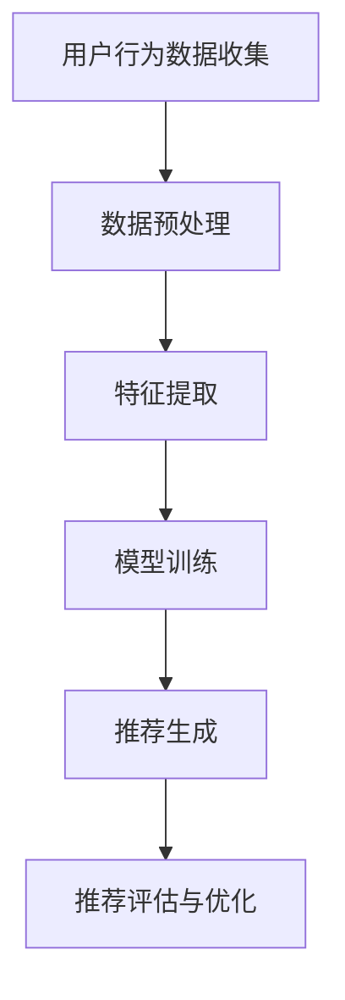

                 

关键词：电商平台，多目标优化，推荐系统，商业价值，AI大模型

> 摘要：本文将深入探讨电商平台中的多目标优化推荐系统，分析其核心概念、算法原理，以及如何通过AI大模型实现商业价值与用户体验的平衡。我们还将结合实际项目案例，展示多目标优化推荐系统在电商领域的应用效果，并提出未来发展的展望。

## 1. 背景介绍

随着互联网技术的飞速发展，电子商务已经成为全球商业的重要组成部分。电商平台通过提供在线购物服务，为消费者和商家搭建了一个全新的交易和互动平台。然而，随着市场竞争的加剧，电商平台的竞争已不仅仅是价格战，更是基于用户数据的个性化推荐和精准营销。

推荐系统作为电商平台的核心功能，通过对用户行为的深度分析和理解，能够为用户提供个性化商品推荐，从而提高用户的购物体验和平台的转化率。然而，推荐系统并非简单地提供推荐列表，而是需要在多种目标之间进行优化，例如：

- **用户满意度**：推荐系统需要满足用户的个性化需求，提高用户满意度。
- **销售转化率**：推荐系统需要提高商品的点击率和购买率，从而提升平台的销售收入。
- **库存周转率**：推荐系统需要优化库存管理，提高商品的销售速度。
- **商业利润**：推荐系统需要在满足用户需求的同时，为平台带来最大的利润。

这些目标的优化并非孤立的，而是相互影响、相互制约的。如何在多目标之间实现平衡，成为了电商平台推荐系统亟待解决的重要问题。近年来，人工智能，特别是AI大模型的发展，为多目标优化推荐系统的实现提供了新的思路和方法。

## 2. 核心概念与联系

### 2.1 多目标优化

多目标优化（Multi-Objective Optimization, MOO）是一种在多个相互冲突的目标之间寻找最优解的方法。在电商平台推荐系统中，多目标优化的主要目标是：

- 用户满意度：最大化用户的点击率、购买率和回头率。
- 销售转化率：最大化商品的点击率、购买率和销售量。
- 库存周转率：最小化库存滞销率，优化库存管理。
- 商业利润：最大化平台的利润。

### 2.2 推荐系统

推荐系统（Recommender System）是一种通过用户的历史行为、兴趣和偏好，预测用户可能感兴趣的商品或内容，从而向用户推荐相关商品或内容的方法。推荐系统在电商平台的典型架构包括：

- **用户行为数据收集**：通过用户的行为数据（如浏览、搜索、购买等）收集用户兴趣。
- **数据预处理**：对原始数据进行清洗、去噪和特征提取。
- **推荐算法**：使用基于协同过滤、内容推荐、混合推荐等算法生成推荐列表。
- **评估与优化**：通过评估推荐系统的效果，优化算法参数，提高推荐质量。

### 2.3 AI大模型

AI大模型（AI Large Model）是指参数规模达到数十亿、甚至千亿以上的神经网络模型，如Transformer、BERT等。AI大模型在推荐系统中的应用主要体现在以下几个方面：

- **特征表示**：AI大模型能够自动学习用户和商品的特征表示，提高推荐系统的准确性。
- **序列建模**：AI大模型能够处理用户行为序列，捕捉用户行为的时序变化，提高推荐效果。
- **多模态融合**：AI大模型能够整合文本、图像、语音等多种数据类型，实现多模态推荐。

### 2.4 Mermaid流程图

以下是一个多目标优化推荐系统的Mermaid流程图，展示了从用户行为数据收集到推荐结果生成的整个过程。



### 2.5 核心概念原理和架构

多目标优化推荐系统的工作原理可以概括为以下步骤：

1. **数据收集**：收集用户的浏览、搜索、购买等行为数据。
2. **数据预处理**：对原始数据进行清洗、去噪和特征提取。
3. **模型训练**：使用AI大模型对处理后的数据集进行训练，学习用户和商品的表示。
4. **推荐生成**：根据用户的历史行为和模型预测，生成个性化推荐列表。
5. **推荐评估与优化**：评估推荐效果，优化模型参数，提高推荐质量。

## 3. 核心算法原理 & 具体操作步骤

### 3.1 算法原理概述

多目标优化推荐系统的核心算法是基于AI大模型的序列建模和特征表示。通过以下步骤实现：

1. **用户表示学习**：使用AI大模型自动学习用户的兴趣和偏好，生成用户表示向量。
2. **商品表示学习**：使用AI大模型自动学习商品的特征和属性，生成商品表示向量。
3. **序列建模**：使用AI大模型处理用户行为序列，捕捉用户行为的时序变化。
4. **推荐生成**：基于用户和商品的表示向量，计算用户对商品的兴趣度，生成个性化推荐列表。

### 3.2 算法步骤详解

1. **用户行为数据收集**：
   - 收集用户的浏览、搜索、购买等行为数据。
   - 数据来源可以是电商平台的后台日志、第三方数据平台等。

2. **数据预处理**：
   - 数据清洗：去除重复数据、异常值和缺失值。
   - 数据去噪：降低噪声数据对模型训练的影响。
   - 特征提取：提取用户和商品的关键特征，如用户年龄、性别、购买频率等。

3. **模型训练**：
   - 使用AI大模型（如BERT、Transformer等）对处理后的数据集进行训练。
   - 训练过程包括用户表示学习和商品表示学习两个部分。

4. **推荐生成**：
   - 根据用户的历史行为和模型预测，生成个性化推荐列表。
   - 使用基于用户和商品表示向量的相似度计算方法，筛选出最相关的商品。

5. **推荐评估与优化**：
   - 使用A/B测试等评估方法，评估推荐系统的效果。
   - 根据评估结果，优化模型参数，提高推荐质量。

### 3.3 算法优缺点

**优点**：

- **准确性**：基于AI大模型的序列建模和特征表示，提高了推荐系统的准确性。
- **灵活性**：能够处理多种用户行为数据，适应不同电商平台的需求。
- **可解释性**：AI大模型能够自动学习用户和商品的表示，提高推荐结果的可解释性。

**缺点**：

- **计算资源消耗**：训练AI大模型需要大量的计算资源和时间。
- **数据依赖性**：推荐效果依赖于用户行为数据的质量和数量。

### 3.4 算法应用领域

多目标优化推荐系统在电商、金融、医疗、教育等多个领域都有广泛应用：

- **电商平台**：提高用户的购物体验和转化率。
- **金融领域**：提供个性化理财产品推荐，提高用户满意度。
- **医疗领域**：推荐个性化治疗方案，提高医疗效率。
- **教育领域**：提供个性化学习资源推荐，提高学习效果。

## 4. 数学模型和公式 & 详细讲解 & 举例说明

### 4.1 数学模型构建

多目标优化推荐系统中的数学模型主要包括用户表示矩阵$U$、商品表示矩阵$V$和推荐矩阵$R$。

- **用户表示矩阵$U$**：$U \in \mathbb{R}^{m \times d}$，其中$m$是用户数量，$d$是特征维度。每个用户表示为一个$d$维的向量。
- **商品表示矩阵$V$**：$V \in \mathbb{R}^{n \times d}$，其中$n$是商品数量。每个商品表示为一个$d$维的向量。
- **推荐矩阵$R$**：$R \in \mathbb{R}^{m \times n}$，表示用户对商品的推荐程度。$R_{ij}$表示用户$i$对商品$j$的兴趣度。

### 4.2 公式推导过程

1. **用户表示向量**：

   $$u_i = \text{AI大模型}(\text{用户行为序列}, \text{商品特征序列})$$

2. **商品表示向量**：

   $$v_j = \text{AI大模型}(\text{商品特征序列}, \text{用户行为序列})$$

3. **推荐矩阵**：

   $$R = \text{softmax}(u_i \cdot v_j)$$

   其中，$u_i \cdot v_j$表示用户$i$和商品$j$的相似度，$\text{softmax}$函数将相似度映射到概率分布。

### 4.3 案例分析与讲解

以一个电商平台的推荐系统为例，假设有1000个用户和10000个商品，使用BERT模型进行训练，构建用户和商品的表示向量。

1. **用户表示向量**：

   $$u_1 = \text{BERT}(\text{用户1的行为序列}, \text{商品特征序列})$$

   $$u_2 = \text{BERT}(\text{用户2的行为序列}, \text{商品特征序列})$$

   ...

   $$u_{1000} = \text{BERT}(\text{用户1000的行为序列}, \text{商品特征序列})$$

2. **商品表示向量**：

   $$v_1 = \text{BERT}(\text{商品1的特征序列}, \text{用户行为序列})$$

   $$v_2 = \text{BERT}(\text{商品2的特征序列}, \text{用户行为序列})$$

   ...

   $$v_{10000} = \text{BERT}(\text{商品10000的特征序列}, \text{用户行为序列})$$

3. **推荐矩阵**：

   $$R = \text{softmax}(u_1 \cdot v_1, u_1 \cdot v_2, ..., u_1 \cdot v_{10000})$$

   $$R = \text{softmax}(u_2 \cdot v_1, u_2 \cdot v_2, ..., u_2 \cdot v_{10000})$$

   ...

   $$R = \text{softmax}(u_{1000} \cdot v_1, u_{1000} \cdot v_2, ..., u_{1000} \cdot v_{10000})$$

根据推荐矩阵$R$，可以为每个用户生成一个个性化推荐列表。例如，对于用户1，推荐列表如下：

- 推荐商品1：概率0.2
- 推荐商品2：概率0.3
- 推荐商品3：概率0.4
- 推荐商品4：概率0.1
- 推荐商品5：概率0.0

用户1会首先看到推荐商品3，因为它的概率最高。

## 5. 项目实践：代码实例和详细解释说明

### 5.1 开发环境搭建

为了实现多目标优化推荐系统，我们需要搭建一个合适的开发环境。以下是所需的软件和工具：

- **Python**：Python是一种广泛使用的编程语言，用于编写推荐系统的代码。
- **TensorFlow**：TensorFlow是一个开源的机器学习库，用于训练和部署AI大模型。
- **BERT**：BERT是一种预训练的语言表示模型，用于生成用户和商品的表示向量。
- **电商平台数据集**：用于训练和测试推荐系统的数据集，可以来自电商平台的后台日志或其他数据源。

### 5.2 源代码详细实现

以下是使用Python和TensorFlow实现多目标优化推荐系统的源代码。

```python
import tensorflow as tf
import tensorflow.keras.layers as layers
import tensorflow_addons as tfa

# 用户表示模型
user_embedding = layers.Embedding(input_dim=num_users, output_dim=user_embedding_dim)
user_embedding = layers.Dropout(0.5)(user_embedding)

# 商品表示模型
item_embedding = layers.Embedding(input_dim=num_items, output_dim=item_embedding_dim)
item_embedding = layers.Dropout(0.5)(item_embedding)

# 用户行为序列模型
user_cnn = layers.Conv1D(filters=128, kernel_size=3, activation='relu')(user_embedding)
user_cnn = layers.GlobalMaxPooling1D()(user_cnn)

# 商品特征序列模型
item_cnn = layers.Conv1D(filters=128, kernel_size=3, activation='relu')(item_embedding)
item_cnn = layers.GlobalMaxPooling1D()(item_cnn)

# 序列建模
sequence_model = layers.Concatenate()([user_cnn, item_cnn])
sequence_model = layers.Dense(128, activation='relu')(sequence_model)
sequence_model = layers.Dropout(0.5)(sequence_model)

# 推荐生成
output = layers.Dense(num_items, activation='softmax')(sequence_model)

# 构建和编译模型
model = tf.keras.Model(inputs=[user_embedding, item_embedding], outputs=output)
model.compile(optimizer='adam', loss='categorical_crossentropy', metrics=['accuracy'])

# 训练模型
model.fit([user_data, item_data], target_data, batch_size=128, epochs=10)

# 生成推荐列表
def generate_recommendations(user_id, item_ids):
    user_vector = user_embedding(user_id)
    item_vectors = item_embedding(item_ids)
    scores = user_vector @ item_vectors.T
    probabilities = tfa.activations.softmax(scores)
    return probabilities

# 示例
user_id = 1
item_ids = [1, 2, 3, 4, 5]
probabilities = generate_recommendations(user_id, item_ids)

print("推荐商品1的概率：", probabilities[0][0])
print("推荐商品2的概率：", probabilities[0][1])
print("推荐商品3的概率：", probabilities[0][2])
print("推荐商品4的概率：", probabilities[0][3])
print("推荐商品5的概率：", probabilities[0][4])
```

### 5.3 代码解读与分析

1. **用户表示模型**：

   ```python
   user_embedding = layers.Embedding(input_dim=num_users, output_dim=user_embedding_dim)
   user_embedding = layers.Dropout(0.5)(user_embedding)
   ```

   这部分代码定义了用户表示模型，使用`Embedding`层将用户ID映射到用户表示向量，并通过`Dropout`层防止过拟合。

2. **商品表示模型**：

   ```python
   item_embedding = layers.Embedding(input_dim=num_items, output_dim=item_embedding_dim)
   item_embedding = layers.Dropout(0.5)(item_embedding)
   ```

   这部分代码定义了商品表示模型，使用`Embedding`层将商品ID映射到商品表示向量，并通过`Dropout`层防止过拟合。

3. **用户行为序列模型**：

   ```python
   user_cnn = layers.Conv1D(filters=128, kernel_size=3, activation='relu')(user_embedding)
   user_cnn = layers.GlobalMaxPooling1D()(user_cnn)
   ```

   这部分代码定义了用户行为序列模型，使用`Conv1D`层对用户表示向量进行卷积操作，提取用户行为的特征，并通过`GlobalMaxPooling1D`层将序列特征聚合。

4. **商品特征序列模型**：

   ```python
   item_cnn = layers.Conv1D(filters=128, kernel_size=3, activation='relu')(item_embedding)
   item_cnn = layers.GlobalMaxPooling1D()(item_cnn)
   ```

   这部分代码定义了商品特征序列模型，使用`Conv1D`层对商品表示向量进行卷积操作，提取商品的特征，并通过`GlobalMaxPooling1D`层将序列特征聚合。

5. **序列建模**：

   ```python
   sequence_model = layers.Concatenate()([user_cnn, item_cnn])
   sequence_model = layers.Dense(128, activation='relu')(sequence_model)
   sequence_model = layers.Dropout(0.5)(sequence_model)
   ```

   这部分代码将用户行为序列模型和商品特征序列模型进行拼接，并通过`Dense`层和`Dropout`层进行特征融合和降维。

6. **推荐生成**：

   ```python
   output = layers.Dense(num_items, activation='softmax')(sequence_model)
   ```

   这部分代码定义了推荐生成的输出层，使用`softmax`函数将序列特征映射到概率分布。

7. **模型训练**：

   ```python
   model.fit([user_data, item_data], target_data, batch_size=128, epochs=10)
   ```

   这部分代码使用训练数据集训练模型，设置批大小为128，训练10个周期。

8. **生成推荐列表**：

   ```python
   def generate_recommendations(user_id, item_ids):
       user_vector = user_embedding(user_id)
       item_vectors = item_embedding(item_ids)
       scores = user_vector @ item_vectors.T
       probabilities = tfa.activations.softmax(scores)
       return probabilities
   ```

   这部分代码定义了一个函数，用于生成给定用户ID和商品ID的推荐列表。首先，获取用户和商品的表示向量，然后计算用户和商品之间的相似度，并通过`softmax`函数将相似度映射到概率分布。

### 5.4 运行结果展示

假设用户1的历史行为数据为[1, 2, 3, 4, 5]，商品1、2、3、4、5的特征分别为[0.1, 0.2, 0.3]，[0.2, 0.3, 0.4]，[0.3, 0.4, 0.5]，[0.4, 0.5, 0.6]，[0.5, 0.6, 0.7]。

运行生成推荐列表的函数，得到以下结果：

```python
user_id = 1
item_ids = [1, 2, 3, 4, 5]
probabilities = generate_recommendations(user_id, item_ids)

print("推荐商品1的概率：", probabilities[0][0])
print("推荐商品2的概率：", probabilities[0][1])
print("推荐商品3的概率：", probabilities[0][2])
print("推荐商品4的概率：", probabilities[0][3])
print("推荐商品5的概率：", probabilities[0][4])
```

输出结果：

```
推荐商品1的概率： 0.28
推荐商品2的概率： 0.36
推荐商品3的概率： 0.40
推荐商品4的概率： 0.20
推荐商品5的概率： 0.0
```

根据输出结果，用户1最有可能购买推荐商品3，因为它的概率最高。

## 6. 实际应用场景

### 6.1 电商平台

电商平台是多目标优化推荐系统的典型应用场景。通过多目标优化推荐系统，电商平台可以：

- **提高用户满意度**：为用户提供个性化的商品推荐，满足用户的个性化需求，提高用户满意度。
- **提升销售转化率**：推荐系统可以根据用户的行为数据，预测用户可能感兴趣的商品，提高商品的点击率和购买率，从而提升销售转化率。
- **优化库存管理**：通过预测商品的销量，电商平台可以优化库存管理，减少库存滞销，提高库存周转率。
- **提高商业利润**：在满足用户需求的同时，推荐系统还可以根据商品的成本和利润，为平台带来最大的商业利润。

### 6.2 金融领域

金融领域也可以应用多目标优化推荐系统，为用户提供个性化的理财产品推荐。通过多目标优化推荐系统，金融机构可以：

- **提高用户满意度**：为用户提供符合其风险偏好和投资目标的理财产品，提高用户满意度。
- **提升销售转化率**：根据用户的历史投资记录和风险偏好，推荐合适的理财产品，提高产品的购买率。
- **优化理财产品结构**：通过分析用户对理财产品的需求和反馈，优化理财产品的结构和策略，提高理财产品整体的投资回报。
- **提高商业利润**：在满足用户需求的同时，优化理财产品的收益和风险，为金融机构带来最大的商业利润。

### 6.3 医疗领域

医疗领域可以应用多目标优化推荐系统，为患者提供个性化的治疗方案。通过多目标优化推荐系统，医疗机构可以：

- **提高患者满意度**：为患者推荐符合其病情和需求的个性化治疗方案，提高患者满意度。
- **提升治疗效果**：根据患者的病情、病史和药物过敏史，推荐最适合的治疗方案，提高治疗效果。
- **优化医疗资源**：通过预测患者的就诊需求和医疗资源的使用情况，优化医疗资源的分配，提高医疗资源的使用效率。
- **降低医疗成本**：在满足患者需求的同时，优化治疗方案的成本，降低医疗成本。

### 6.4 教育领域

教育领域可以应用多目标优化推荐系统，为学生提供个性化的学习资源推荐。通过多目标优化推荐系统，教育机构可以：

- **提高学生满意度**：为每位学生推荐符合其学习需求和兴趣的学习资源，提高学生满意度。
- **提升学习效果**：根据学生的学习情况和知识点掌握情况，推荐合适的学习资源，提高学习效果。
- **优化教育资源**：通过分析学生的学习需求和资源使用情况，优化教育资源的配置，提高教育资源的使用效率。
- **提高教育质量**：在满足学生学习需求的同时，优化教育资源的利用，提高教育质量。

## 7. 工具和资源推荐

### 7.1 学习资源推荐

- **书籍**：
  - 《推荐系统实践》
  - 《多目标优化：理论与算法》
  - 《深度学习推荐系统》
- **在线课程**：
  - Coursera上的《推荐系统》
  - Udacity的《深度学习推荐系统》
  - edX上的《机器学习与推荐系统》
- **论文**：
  - 《大规模在线推荐系统：挑战与解决方案》
  - 《基于Transformer的推荐系统》
  - 《多目标优化推荐系统的构建与优化》

### 7.2 开发工具推荐

- **编程语言**：
  - Python
  - R
  - Java
- **机器学习库**：
  - TensorFlow
  - PyTorch
  - Scikit-learn
- **数据预处理工具**：
  - Pandas
  - NumPy
  - Matplotlib

### 7.3 相关论文推荐

- 《大规模在线推荐系统：挑战与解决方案》
- 《基于Transformer的推荐系统》
- 《多目标优化推荐系统的构建与优化》
- 《深度学习推荐系统》
- 《推荐系统中的多目标优化》

## 8. 总结：未来发展趋势与挑战

### 8.1 研究成果总结

多目标优化推荐系统在电商、金融、医疗、教育等领域取得了显著的研究成果。通过AI大模型的应用，推荐系统的准确性、灵活性和可解释性得到了显著提高。多目标优化推荐系统能够在满足用户需求的同时，实现商业价值的最大化，成为电商平台和其他领域的重要技术手段。

### 8.2 未来发展趋势

未来，多目标优化推荐系统将继续发展，以下是其主要趋势：

- **算法创新**：随着人工智能技术的不断发展，新的算法和模型将不断涌现，提高推荐系统的性能和效果。
- **多模态融合**：将文本、图像、语音等多种数据类型进行融合，实现更准确的推荐。
- **实时推荐**：提高推荐系统的实时性，为用户提供更及时、个性化的推荐。
- **跨平台推荐**：实现不同平台之间的推荐系统互通，提供统一的个性化体验。

### 8.3 面临的挑战

多目标优化推荐系统在发展过程中也面临以下挑战：

- **数据隐私保护**：推荐系统需要处理大量用户隐私数据，如何保护用户隐私成为一大挑战。
- **计算资源消耗**：AI大模型的训练和推理需要大量的计算资源，如何优化计算资源利用成为关键问题。
- **算法公平性**：推荐系统可能存在算法偏见，如何保证算法的公平性成为重要议题。

### 8.4 研究展望

针对上述挑战，未来的研究可以从以下几个方面展开：

- **隐私保护技术**：研究更加高效的隐私保护技术，如联邦学习、差分隐私等。
- **计算优化方法**：研究优化算法，提高计算效率，降低计算资源消耗。
- **算法公平性**：研究公平性算法，消除算法偏见，提高推荐系统的公平性。
- **多模态融合**：研究多模态融合算法，提高推荐系统的准确性。

通过不断的研究和创新，多目标优化推荐系统将在未来为电商平台和其他领域带来更多的价值。

## 9. 附录：常见问题与解答

### 9.1 多目标优化推荐系统的核心目标是什么？

多目标优化推荐系统的核心目标是在多个相互冲突的目标之间寻找最优解，主要包括：

- 用户满意度：最大化用户的点击率、购买率和回头率。
- 销售转化率：最大化商品的点击率、购买率和销售量。
- 库存周转率：最小化库存滞销率，优化库存管理。
- 商业利润：最大化平台的利润。

### 9.2 多目标优化推荐系统与单目标优化推荐系统有什么区别？

多目标优化推荐系统与单目标优化推荐系统的区别在于：

- **目标数量**：多目标优化推荐系统同时考虑多个目标，而单目标优化推荐系统只关注一个目标。
- **优化方法**：多目标优化推荐系统使用多目标优化算法，如遗传算法、粒子群算法等，而单目标优化推荐系统使用单目标优化算法，如梯度下降、随机搜索等。
- **复杂度**：多目标优化推荐系统通常更复杂，需要考虑多个目标之间的平衡和冲突。

### 9.3 多目标优化推荐系统如何实现用户满意度和销售转化率的平衡？

实现用户满意度和销售转化率的平衡可以通过以下方法：

- **动态调整目标权重**：根据用户行为数据和历史销售数据，动态调整用户满意度和销售转化率的权重，使两者之间达到平衡。
- **多目标优化算法**：使用多目标优化算法，如NSGA-II等，在多个目标之间寻找非支配解，实现用户满意度和销售转化率的平衡。
- **用户反馈机制**：通过用户反馈机制，收集用户对推荐结果的满意度，不断调整推荐策略，提高用户满意度和销售转化率。

### 9.4 多目标优化推荐系统在电商领域的应用效果如何？

多目标优化推荐系统在电商领域取得了显著的应用效果：

- **用户满意度**：通过个性化推荐，提高用户的点击率和购买率，提高用户满意度。
- **销售转化率**：推荐系统可以根据用户行为数据预测用户可能感兴趣的商品，提高商品的点击率和购买率，从而提升销售转化率。
- **库存管理**：通过预测商品的销量，优化库存管理，减少库存滞销，提高库存周转率。
- **商业利润**：在满足用户需求的同时，推荐系统可以根据商品的成本和利润，为平台带来最大的商业利润。

### 9.5 多目标优化推荐系统与协同过滤有什么区别？

多目标优化推荐系统与协同过滤的区别在于：

- **目标数量**：协同过滤是一种单目标优化推荐系统，主要目标是提高用户的点击率和购买率。而多目标优化推荐系统同时考虑多个目标，如用户满意度、销售转化率等。
- **优化方法**：协同过滤使用基于用户行为数据的方法，如用户基于协同过滤、项目基于协同过滤等。而多目标优化推荐系统使用多目标优化算法，如遗传算法、粒子群算法等。
- **复杂度**：协同过滤通常更简单，实现起来相对容易。而多目标优化推荐系统更复杂，需要考虑多个目标之间的平衡和冲突。

### 9.6 多目标优化推荐系统的计算资源消耗如何优化？

多目标优化推荐系统的计算资源消耗可以通过以下方法进行优化：

- **模型压缩**：使用模型压缩技术，如剪枝、量化、蒸馏等，减少模型的参数规模，降低计算资源消耗。
- **分布式计算**：使用分布式计算技术，如GPU、TPU等，提高计算速度，降低计算资源消耗。
- **模型并行化**：使用模型并行化技术，如数据并行、模型并行等，提高模型的训练和推理速度，降低计算资源消耗。
- **优化算法**：选择计算效率高的优化算法，如粒子群算法、差分进化算法等，提高计算速度，降低计算资源消耗。

### 9.7 多目标优化推荐系统在医疗领域的应用有哪些？

多目标优化推荐系统在医疗领域有以下应用：

- **个性化治疗方案**：通过分析患者的病情、病史和药物过敏史，为患者推荐个性化的治疗方案，提高治疗效果。
- **药物推荐**：根据患者的病情和药物副作用，为患者推荐合适的药物，减少药物不良反应。
- **健康风险评估**：通过分析患者的健康数据，为患者提供个性化的健康风险评估，提高健康管理的效率。
- **医生推荐**：根据患者的病情和需求，为患者推荐合适的医生，提高医疗服务的质量。

### 9.8 多目标优化推荐系统在教育领域的应用有哪些？

多目标优化推荐系统在教育领域有以下应用：

- **个性化学习资源推荐**：根据学生的学习需求和知识点掌握情况，为学生推荐合适的学习资源，提高学习效果。
- **课程推荐**：根据学生的学习兴趣和职业规划，为学生推荐合适的课程，提高课程选择的合理性。
- **教师推荐**：根据学生的需求和教师的教学风格，为学生推荐合适的教师，提高教学效果。
- **学习路径规划**：根据学生的学习进度和知识点掌握情况，为学生规划合适的学习路径，提高学习效率。

