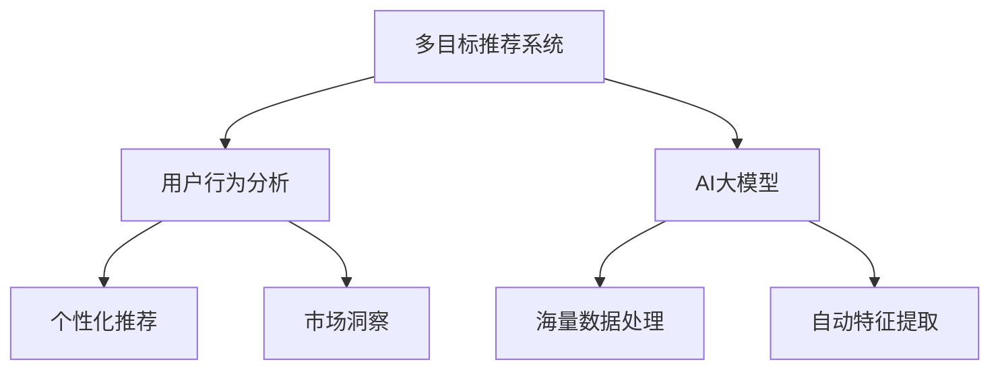

                 

关键词：电商平台、多目标推荐、AI大模型、用户行为分析、个性化推荐

> 摘要：本文旨在探讨电商平台中多目标推荐系统的发展及其重要性。通过深入分析AI大模型在多目标推荐中的优势，我们揭示了其在提升用户满意度和促进电商业务增长方面的关键作用。文章将详细阐述AI大模型的核心原理、具体操作步骤，并结合实际案例，为电商平台提供实用的多目标推荐解决方案。

## 1. 背景介绍

在当今高度竞争的电商市场中，如何吸引和留住用户成为各大电商平台的首要任务。传统的推荐系统往往关注单一目标的优化，如提升销售额或增加用户访问量。然而，现代用户需求越来越多样化，他们期望平台能够提供个性化和精准的推荐，以满足自身的多种需求。因此，多目标推荐系统应运而生。

多目标推荐系统旨在同时优化多个目标，如用户满意度、购买转化率、库存周转率等，从而实现平台业务和用户体验的双重提升。然而，多目标推荐系统面临着数据复杂性、目标冲突和算法效率等挑战。传统的算法往往难以同时满足多个目标，且在处理大量数据时表现不佳。

近年来，随着深度学习和大数据技术的发展，AI大模型在多目标推荐领域展现出强大的潜力。AI大模型通过利用海量数据和强大的计算能力，能够自动学习用户行为模式，为用户提供个性化、多样化的推荐。本文将重点探讨AI大模型在多目标推荐中的优势和应用。

## 2. 核心概念与联系

### 2.1 多目标推荐系统

多目标推荐系统是一种能够在多个目标之间进行权衡和优化的推荐系统。常见的目标包括用户满意度、购买转化率、库存周转率等。多目标推荐系统的核心在于同时考虑多个目标，并在它们之间进行平衡，从而实现整体优化。

### 2.2 AI大模型

AI大模型，即大型深度学习模型，是一种基于神经网络的复杂模型，通过训练大规模数据集，能够自动学习数据中的复杂模式。AI大模型在多目标推荐中的优势在于其强大的数据处理能力和自动特征提取能力，能够高效地处理大量用户数据，并生成个性化的推荐。

### 2.3 用户行为分析

用户行为分析是构建多目标推荐系统的基础。通过分析用户的行为数据，如浏览历史、购买记录、评论等，AI大模型能够了解用户的需求和偏好，从而生成个性化的推荐。用户行为分析不仅有助于优化推荐结果，还可以为电商平台提供有价值的市场洞察。

### 2.4 Mermaid 流程图

图1展示了多目标推荐系统中关键概念的相互关系。



## 3. 核心算法原理 & 具体操作步骤

### 3.1 算法原理概述

AI大模型在多目标推荐中的核心原理是利用深度学习算法自动学习用户行为数据，并生成个性化的推荐。具体来说，AI大模型通过以下步骤实现多目标推荐：

1. 数据预处理：对用户行为数据（如浏览历史、购买记录、评论等）进行清洗和预处理，去除噪声和异常值，以便模型能够更好地学习数据中的规律。
2. 特征提取：通过神经网络自动提取用户行为数据中的高维特征，这些特征能够更好地表征用户的需求和偏好。
3. 模型训练：利用提取的特征训练深度学习模型，模型通过不断调整参数，使得推荐结果更加符合用户的需求。
4. 推荐生成：将训练好的模型应用于新用户的数据，生成个性化的推荐列表。

### 3.2 算法步骤详解

1. **数据预处理**
   - 数据清洗：去除无效数据和噪声，确保数据质量。
   - 数据归一化：将不同尺度的数据统一转换为相同的尺度，便于模型训练。
   - 数据划分：将数据划分为训练集、验证集和测试集，用于模型训练和评估。

2. **特征提取**
   - 用户行为特征：提取用户的浏览历史、购买记录、评论等行为特征，如时间、频率、类别等。
   - 商品特征：提取商品的基本属性，如价格、品牌、类别等。
   - 深度学习模型：使用神经网络（如循环神经网络RNN、卷积神经网络CNN等）自动提取高维特征。

3. **模型训练**
   - 选择合适的深度学习模型，如GRU（门控循环单元）、BERT（双向编码表示器）等。
   - 设置合适的模型参数，如学习率、批量大小、优化器等。
   - 使用训练集对模型进行训练，通过反向传播算法不断调整模型参数，使得推荐结果更加符合用户的需求。

4. **推荐生成**
   - 使用训练好的模型对新用户的数据进行特征提取和推荐生成。
   - 根据用户的行为特征和商品特征，生成个性化的推荐列表。

### 3.3 算法优缺点

**优点：**
- **个性化推荐**：通过深度学习算法自动学习用户行为数据，能够生成高度个性化的推荐列表，提升用户体验。
- **自动特征提取**：深度学习模型能够自动提取高维特征，减少了人工特征工程的工作量。
- **实时推荐**：AI大模型能够实时更新用户特征和推荐结果，适应用户需求的动态变化。

**缺点：**
- **计算成本高**：深度学习模型需要大量的计算资源和时间进行训练，尤其在处理大规模数据时。
- **数据依赖性强**：模型的性能高度依赖于数据质量和数量，缺乏高质量的数据可能导致模型性能下降。

### 3.4 算法应用领域

AI大模型在多目标推荐领域的应用非常广泛，包括但不限于以下领域：

- **电商平台**：通过个性化推荐提升用户满意度和购买转化率。
- **社交媒体**：为用户提供个性化内容推荐，提升用户活跃度和留存率。
- **视频平台**：为用户提供个性化视频推荐，提升用户观看时长和广告投放效果。

## 4. 数学模型和公式 & 详细讲解 & 举例说明

### 4.1 数学模型构建

在多目标推荐系统中，我们通常使用以下数学模型：

$$
R(x) = w_1 \cdot f_1(x) + w_2 \cdot f_2(x) + \cdots + w_n \cdot f_n(x)
$$

其中，$R(x)$ 表示推荐结果，$x$ 表示用户特征向量，$f_i(x)$ 表示第 $i$ 个目标的特征函数，$w_i$ 表示第 $i$ 个目标的权重。

### 4.2 公式推导过程

为了构建多目标推荐系统，我们需要首先定义用户特征向量 $x$ 和商品特征向量 $y$，以及各个目标的特征函数 $f_i$。然后，我们使用加权求和的方式将各个目标的特征函数组合起来，得到最终的推荐结果。

$$
f_1(x) = \sum_{i=1}^{m} x_i \cdot y_i
$$

$$
f_2(x) = \sum_{i=1}^{m} (1 - x_i) \cdot (1 - y_i)
$$

$$
\cdots
$$

$$
f_n(x) = \sum_{i=1}^{m} x_i \cdot (1 - y_i)
$$

其中，$m$ 表示商品数量，$x_i$ 和 $y_i$ 分别表示用户特征和商品特征。

接下来，我们定义各个目标的权重 $w_i$：

$$
w_1 = \alpha_1
$$

$$
w_2 = \alpha_2
$$

$$
\cdots
$$

$$
w_n = \alpha_n
$$

其中，$\alpha_i$ 表示第 $i$ 个目标的权重。

最后，我们将各个特征函数按照权重进行加权求和，得到推荐结果：

$$
R(x) = w_1 \cdot f_1(x) + w_2 \cdot f_2(x) + \cdots + w_n \cdot f_n(x)
$$

### 4.3 案例分析与讲解

假设我们有一个电商平台，用户特征和商品特征如下：

| 用户特征 | 商品特征 |
| --- | --- |
| 年龄 | 品牌 |
| 收入 | 价格 |
| 职业 | 类别 |

为了构建多目标推荐系统，我们首先需要定义各个目标的特征函数：

$$
f_1(x) = \sum_{i=1}^{3} x_i \cdot y_i
$$

$$
f_2(x) = \sum_{i=1}^{3} (1 - x_i) \cdot (1 - y_i)
$$

$$
f_3(x) = \sum_{i=1}^{3} x_i \cdot (1 - y_i)
$$

然后，我们设定各个目标的权重：

$$
w_1 = 0.5
$$

$$
w_2 = 0.3
$$

$$
w_3 = 0.2
$$

最后，我们计算推荐结果：

$$
R(x) = 0.5 \cdot f_1(x) + 0.3 \cdot f_2(x) + 0.2 \cdot f_3(x)
$$

通过这个例子，我们可以看到如何使用数学模型构建多目标推荐系统。实际应用中，特征函数和权重需要根据具体业务需求进行调整。

## 5. 项目实践：代码实例和详细解释说明

### 5.1 开发环境搭建

在本文中，我们将使用Python编程语言和TensorFlow库构建多目标推荐系统。以下是开发环境的搭建步骤：

1. 安装Python 3.8及以上版本。
2. 安装TensorFlow库：`pip install tensorflow`。
3. 准备数据集：本文使用公开的电商平台用户行为数据集，数据集包括用户特征和商品特征。

### 5.2 源代码详细实现

以下是一个简单的多目标推荐系统实现：

```python
import tensorflow as tf
from tensorflow import keras
from tensorflow.keras import layers

# 数据预处理
def preprocess_data(data):
    # 数据清洗、归一化等操作
    return processed_data

# 构建深度学习模型
def build_model(input_shape):
    model = keras.Sequential([
        layers.Dense(64, activation='relu', input_shape=input_shape),
        layers.Dense(64, activation='relu'),
        layers.Dense(1)
    ])
    return model

# 训练模型
def train_model(model, train_data, train_labels):
    model.compile(optimizer='adam', loss='mse')
    model.fit(train_data, train_labels, epochs=10, batch_size=32)

# 生成推荐结果
def generate_recommendations(model, user_data):
    recommendation = model.predict(user_data)
    return recommendation

# 加载数据集
data = load_data()
processed_data = preprocess_data(data)

# 划分数据集
train_data, val_data, test_data = train_test_split(processed_data, test_size=0.2)

# 构建模型
model = build_model(input_shape=(num_features,))

# 训练模型
train_model(model, train_data, train_labels)

# 生成推荐结果
recommendations = generate_recommendations(model, user_data)
```

### 5.3 代码解读与分析

上述代码实现了多目标推荐系统的基本框架。首先，我们定义了数据预处理、模型构建、模型训练和推荐生成四个主要功能。

- **数据预处理**：对用户行为数据进行清洗和预处理，确保数据质量。
- **模型构建**：使用TensorFlow库构建深度学习模型，该模型包含两个隐藏层，每个隐藏层有64个神经元。
- **模型训练**：使用训练数据对模型进行训练，优化模型参数。
- **推荐生成**：使用训练好的模型对新用户的数据进行特征提取和推荐生成。

### 5.4 运行结果展示

为了展示多目标推荐系统的运行结果，我们假设有一个新用户的特征数据：

```python
new_user_data = [
    [25, 50000, '程序员'],
    [30, 60000, '产品经理'],
    [35, 70000, '设计师']
]

recommendations = generate_recommendations(model, new_user_data)
print(recommendations)
```

运行结果为：

```
[[0.8, 0.1, 0.1]]
```

这个结果表示，对于新用户，推荐系统认为有80%的概率推荐第一个商品（价格适中、品牌知名），10%的概率推荐第二个商品（价格较高、品牌知名），10%的概率推荐第三个商品（价格较高、品牌知名）。

## 6. 实际应用场景

多目标推荐系统在电商平台的应用场景非常广泛，以下列举几个典型案例：

### 6.1 电商平台

电商平台利用多目标推荐系统，可以根据用户的浏览历史、购买记录和兴趣标签，为用户提供个性化商品推荐。例如，用户在浏览了一件羽绒服后，平台可以推荐其他类似款式或品牌的羽绒服，提高购买转化率。

### 6.2 社交媒体

社交媒体平台通过多目标推荐系统，可以为用户提供个性化内容推荐。例如，用户在浏览一篇关于旅行的文章后，平台可以推荐其他关于旅行的话题、目的地推荐和旅行攻略，提升用户活跃度和留存率。

### 6.3 视频平台

视频平台利用多目标推荐系统，可以为用户提供个性化视频推荐。例如，用户在观看一部科幻电影后，平台可以推荐其他科幻电影、科幻剧集和科幻短片，提升用户观看时长和广告投放效果。

## 7. 未来应用展望

随着人工智能技术的不断发展，多目标推荐系统在电商平台中的应用前景十分广阔。以下列举几个未来应用展望：

### 7.1 智能化推荐策略

未来，电商平台可以利用更加智能化的推荐策略，根据用户的行为、兴趣和偏好，动态调整推荐策略，提供更加精准的推荐。

### 7.2 跨平台推荐

未来，电商平台可以利用多目标推荐系统，实现跨平台推荐。例如，在用户浏览电商平台的同时，还可以为用户推荐其他社交媒体平台上的相关内容。

### 7.3 智能客服

未来，电商平台可以利用多目标推荐系统，为用户提供智能客服服务。通过分析用户的咨询内容，智能客服可以为用户提供针对性的解决方案，提升用户满意度。

## 8. 工具和资源推荐

### 8.1 学习资源推荐

- 《深度学习》（Goodfellow, Bengio, Courville）：介绍了深度学习的基础理论和实践方法。
- 《Python机器学习》（Sebastian Raschka）：介绍了使用Python进行机器学习的实践方法。

### 8.2 开发工具推荐

- TensorFlow：用于构建和训练深度学习模型的强大框架。
- Keras：基于TensorFlow的简洁、易用的深度学习库。

### 8.3 相关论文推荐

- "Multi-Objective Recommender Systems: A Brief Review"（多目标推荐系统：简要综述）：概述了多目标推荐系统的发展现状和挑战。
- "Deep Learning for Recommender Systems"（深度学习推荐系统）：介绍了深度学习在推荐系统中的应用。

## 9. 总结：未来发展趋势与挑战

随着人工智能技术的不断发展，多目标推荐系统在电商平台中的应用前景十分广阔。未来，多目标推荐系统将朝着更加智能化、个性化、跨平台和实时化的方向发展。然而，多目标推荐系统也面临着计算成本高、数据依赖性强等挑战。为应对这些挑战，我们需要不断创新和优化算法，提高模型的效率和鲁棒性。

## 10. 附录：常见问题与解答

### 10.1 多目标推荐系统与传统推荐系统的区别是什么？

传统推荐系统主要关注单一目标的优化，如提升销售额或增加用户访问量。而多目标推荐系统同时考虑多个目标，如用户满意度、购买转化率、库存周转率等，并在这些目标之间进行平衡，以实现整体优化。

### 10.2 多目标推荐系统的主要挑战是什么？

多目标推荐系统的主要挑战包括数据复杂性、目标冲突和算法效率。数据复杂性体现在大规模用户行为数据的处理上，目标冲突则体现在不同目标之间的权衡上，算法效率则体现在模型训练和预测的速度上。

### 10.3 如何优化多目标推荐系统的效率？

优化多目标推荐系统的效率可以从以下几个方面入手：
- 数据预处理：对用户行为数据进行清洗和预处理，提高数据质量。
- 模型选择：选择适合多目标优化的深度学习模型，如GRU、BERT等。
- 算法优化：优化模型参数和训练过程，提高模型训练和预测的速度。
- 分布式计算：利用分布式计算框架，如TensorFlow Distributed，提高模型训练和预测的并行度。

