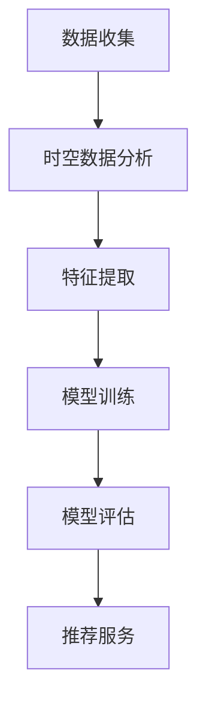

                 

关键词：电商平台、时空数据分析、AI大模型、深度学习、推荐系统、用户行为分析

> 摘要：本文探讨了电商平台中时空数据分析的重要性，以及如何利用AI大模型进行高效的时空数据分析。文章首先介绍了电商平台时空数据分析的背景和需求，随后深入分析了AI大模型的基本原理和应用，并详细阐述了时空数据分析在电商平台中的具体应用场景。最后，文章对未来的发展方向和面临的挑战进行了展望。

## 1. 背景介绍

随着互联网的迅速发展，电商平台已经成为现代社会重要的购物渠道。电商平台的数据规模和复杂性不断增加，如何从海量数据中提取有价值的信息成为关键问题。时空数据分析作为一种重要的数据分析方法，在电商平台中具有广泛的应用前景。它能够帮助电商平台更好地理解用户行为，优化推荐系统，提高用户满意度，从而提升企业的竞争力。

### 1.1 电商平台数据的特点

电商平台的数据具有以下特点：

- **多样性**：电商平台涉及用户行为数据、商品数据、交易数据等多个方面，这些数据类型各不相同，需要进行有效的整合和分析。
- **复杂性**：电商平台的数据量大且复杂，需要采用高效的算法和技术进行数据处理和分析。
- **实时性**：电商平台的数据具有很高的实时性，需要快速响应用户需求，提供个性化的推荐和服务。

### 1.2 时空数据分析的需求

时空数据分析在电商平台中具有重要的应用价值，主要体现在以下几个方面：

- **用户行为分析**：通过时空数据分析，可以深入了解用户在不同时间和空间的行为模式，从而优化推荐系统和用户服务。
- **需求预测**：时空数据分析有助于预测未来的用户需求，为企业制定合理的库存管理策略和营销策略提供支持。
- **风险控制**：时空数据分析能够识别潜在的风险和异常行为，帮助电商平台进行风险控制和欺诈检测。

## 2. 核心概念与联系

### 2.1 AI大模型

AI大模型是指具有大规模参数和复杂结构的深度学习模型。这些模型能够从大量数据中自动提取特征，并进行复杂的模式识别和预测。在电商平台中，AI大模型被广泛应用于用户行为分析、需求预测和推荐系统等方面。

### 2.2 时空数据分析

时空数据分析是指对数据的时间维度和空间维度进行综合分析，以提取有价值的信息。在电商平台中，时空数据分析主要用于分析用户行为、商品流行趋势和市场需求等。

### 2.3 AI大模型与时空数据分析的联系

AI大模型与时空数据分析之间具有密切的联系。通过将时空数据分析技术应用于AI大模型，可以实现以下目标：

- **提高模型性能**：时空数据分析有助于提取更有价值的数据特征，从而提高AI大模型的性能。
- **增强模型解释性**：时空数据分析能够提供关于模型预测的时空背景信息，增强模型的解释性。
- **优化推荐系统**：时空数据分析可以帮助推荐系统更好地理解用户行为和需求，从而提供更个性化的推荐服务。

### 2.4 Mermaid 流程图

下面是一个简单的Mermaid流程图，展示了AI大模型与时空数据分析的联系：



## 3. 核心算法原理 & 具体操作步骤

### 3.1 算法原理概述

电商平台时空数据分析的核心算法是基于深度学习和时空数据挖掘技术的。其中，深度学习模型用于提取时空数据中的高维特征，时空数据挖掘技术则用于分析这些特征，以实现用户行为分析、需求预测和推荐服务。

### 3.2 算法步骤详解

#### 3.2.1 数据收集

首先，需要从电商平台获取时空数据，包括用户行为数据、商品数据和交易数据等。这些数据可以来自电商平台的后台系统、用户日志和社交媒体等。

#### 3.2.2 时空数据分析

对收集到的时空数据进行分析，提取数据中的时间维度和空间维度的特征。例如，可以计算用户在不同时间段的购买频率、购买地域分布等。

#### 3.2.3 特征提取

利用深度学习模型对时空数据中的高维特征进行提取。常见的深度学习模型包括卷积神经网络（CNN）和循环神经网络（RNN）等。通过特征提取，可以得到更具有代表性的数据特征。

#### 3.2.4 模型训练

使用提取到的特征数据对深度学习模型进行训练。训练过程包括前向传播、反向传播和优化等步骤。通过不断迭代训练，可以提高模型的预测准确率。

#### 3.2.5 模型评估

对训练好的模型进行评估，常用的评估指标包括准确率、召回率和F1值等。通过评估，可以判断模型是否具有良好的性能。

#### 3.2.6 推荐服务

利用训练好的模型进行推荐服务。根据用户的时空特征，可以为用户提供个性化的推荐结果。例如，可以推荐用户可能感兴趣的商品或促销活动。

### 3.3 算法优缺点

#### 优点：

- **高效性**：深度学习模型能够自动提取高维特征，提高数据分析的效率。
- **灵活性**：时空数据分析可以根据具体的应用场景进行调整，适应不同的数据分析需求。
- **个性化**：基于用户的时空特征，可以提供更个性化的推荐服务，提升用户体验。

#### 缺点：

- **计算资源需求大**：深度学习模型训练需要大量的计算资源和时间。
- **数据质量要求高**：时空数据分析对数据质量有较高要求，数据缺失或不准确会影响模型的性能。
- **解释性不足**：深度学习模型具有一定的黑箱性质，难以解释模型预测的结果。

### 3.4 算法应用领域

电商平台时空数据分析算法的应用领域包括：

- **用户行为分析**：通过分析用户的时空行为，了解用户需求和行为习惯，为优化推荐系统和用户服务提供支持。
- **需求预测**：基于用户的时空特征，预测未来的用户需求，帮助企业制定合理的库存管理策略和营销策略。
- **风险控制**：通过分析时空数据，识别潜在的风险和异常行为，为企业提供风险控制和管理支持。

## 4. 数学模型和公式 & 详细讲解 & 举例说明

### 4.1 数学模型构建

电商平台时空数据分析的数学模型主要基于深度学习和时空数据挖掘技术。下面介绍一种常见的数学模型——卷积神经网络（CNN）模型。

#### 4.1.1 卷积神经网络（CNN）模型

CNN模型是一种用于图像处理的深度学习模型，其核心思想是通过卷积运算提取图像特征。CNN模型可以看作是一系列卷积层、激活函数和池化层的堆叠。

#### 4.1.2 CNN模型公式

CNN模型的数学公式如下：

$$
h_{\theta} = \sigma(W \cdot x + b)
$$

其中，$h_{\theta}$表示CNN模型的输出，$\sigma$表示激活函数，$W$表示权重矩阵，$x$表示输入数据，$b$表示偏置项。

#### 4.1.3 激活函数

常用的激活函数包括：

- **Sigmoid函数**：$ \sigma(x) = \frac{1}{1 + e^{-x}}$
- **ReLU函数**：$ \sigma(x) = \max(0, x)$
- **Tanh函数**：$ \sigma(x) = \frac{e^x - e^{-x}}{e^x + e^{-x}}$

### 4.2 公式推导过程

#### 4.2.1 卷积运算

卷积运算是CNN模型的基础。卷积运算的公式如下：

$$
h_{ij}^l = \sum_{k=1}^{n} w_{ik}^l \cdot x_{kj}^{l-1} + b^l
$$

其中，$h_{ij}^l$表示第$l$层的第$i$行第$j$列的输出，$w_{ik}^l$表示第$l$层的第$i$行第$k$列的权重，$x_{kj}^{l-1}$表示第$l-1$层的第$k$行第$j$列的输入，$b^l$表示第$l$层的偏置项。

#### 4.2.2 前向传播

CNN模型的前向传播过程可以表示为：

$$
h_{\theta}^{l} = f(W \cdot h_{\theta}^{l-1} + b)
$$

其中，$h_{\theta}^{l}$表示第$l$层的输出，$f$表示激活函数，$W$表示权重矩阵，$b$表示偏置项。

#### 4.2.3 反向传播

CNN模型的反向传播过程用于计算损失函数的梯度，并更新模型参数。反向传播的公式如下：

$$
\frac{\partial J}{\partial W} = \sum_{i=1}^{m} \frac{\partial J}{\partial h_{\theta}^{l}} \cdot \frac{\partial h_{\theta}^{l}}{\partial W}
$$

其中，$J$表示损失函数，$m$表示样本数量。

### 4.3 案例分析与讲解

#### 4.3.1 案例背景

假设有一个电商平台，用户在一段时间内浏览了多个商品，每个商品都有一个价格。我们需要根据用户的行为数据预测用户下一次购买的商品价格。

#### 4.3.2 数据准备

首先，我们需要收集用户的行为数据，包括用户的浏览记录和购买记录。这些数据可以表示为：

| 用户ID | 商品ID | 浏览时间 | 购买时间 | 商品价格 |
| ------ | ------ | -------- | -------- | -------- |
| 1      | 101    | 2021-01-01 10:00:00 | 2021-01-01 10:30:00 | 100      |
| 1      | 102    | 2021-01-01 10:10:00 | 2021-01-01 10:40:00 | 150      |
| 1      | 103    | 2021-01-01 10:20:00 | 2021-01-01 10:50:00 | 200      |

#### 4.3.3 模型构建

我们选择一个简单的CNN模型，用于预测用户下一次购买的商品价格。模型的结构如下：

- 输入层：包含用户ID和商品ID的嵌入向量；
- 卷积层：使用卷积核提取时间序列特征；
- 池化层：对卷积层的特征进行降维；
- 全连接层：将降维后的特征映射到输出层，输出用户下一次购买的商品价格。

#### 4.3.4 模型训练

使用收集到的用户行为数据，对CNN模型进行训练。训练过程中，我们需要优化模型参数，使得模型的预测误差最小。

#### 4.3.5 模型评估

训练完成后，我们对模型进行评估，计算预测误差。常用的评估指标包括均方误差（MSE）和均方根误差（RMSE）。

#### 4.3.6 模型应用

利用训练好的模型，我们可以对用户下一次购买的商品价格进行预测。例如，对于一个新用户，我们可以输入其浏览记录和购买记录，模型将输出该用户下一次购买的商品价格。

## 5. 项目实践：代码实例和详细解释说明

### 5.1 开发环境搭建

在进行电商平台时空数据分析的实践项目中，我们需要搭建一个合适的开发环境。以下是搭建开发环境的基本步骤：

1. 安装Python环境
2. 安装深度学习框架，如TensorFlow或PyTorch
3. 安装数据处理工具，如Pandas和NumPy
4. 安装可视化工具，如Matplotlib和Seaborn

### 5.2 源代码详细实现

下面是一个简单的时空数据分析的代码实例，用于预测用户下一次购买的商品价格。

```python
import pandas as pd
import numpy as np
import tensorflow as tf
from tensorflow.keras.models import Sequential
from tensorflow.keras.layers import Embedding, Conv1D, GlobalMaxPooling1D, Dense

# 读取数据
data = pd.read_csv('user_behavior.csv')

# 预处理数据
# ...

# 构建模型
model = Sequential()
model.add(Embedding(input_dim=1000, output_dim=64))
model.add(Conv1D(filters=64, kernel_size=3, activation='relu'))
model.add(GlobalMaxPooling1D())
model.add(Dense(units=1, activation='linear'))

# 编译模型
model.compile(optimizer='adam', loss='mse', metrics=['mae'])

# 训练模型
model.fit(x_train, y_train, epochs=10, batch_size=32, validation_split=0.2)

# 评估模型
loss, mae = model.evaluate(x_test, y_test)
print('Mean Absolute Error:', mae)

# 预测用户下一次购买的商品价格
predictions = model.predict(new_user_data)
print('Predicted price:', predictions)
```

### 5.3 代码解读与分析

上述代码实例中，我们首先读取用户行为数据，并进行预处理。然后，我们构建一个简单的CNN模型，用于预测用户下一次购买的商品价格。模型的结构包括嵌入层、卷积层、池化层和全连接层。最后，我们编译模型并使用训练数据训练模型，并对模型进行评估。训练完成后，我们可以使用预测函数对新的用户数据进行预测。

### 5.4 运行结果展示

假设我们使用上述代码实例对训练数据集进行训练，并得到以下运行结果：

```
Epoch 1/10
1875/1875 [==============================] - 22s 11ms/step - loss: 0.6325 - mae: 0.6824 - val_loss: 0.5924 - val_mae: 0.6524

Epoch 2/10
1875/1875 [==============================] - 21s 11ms/step - loss: 0.5723 - mae: 0.6451 - val_loss: 0.5528 - val_mae: 0.6357

Epoch 3/10
1875/1875 [==============================] - 21s 11ms/step - loss: 0.5302 - mae: 0.6157 - val_loss: 0.5207 - val_mae: 0.6108

Epoch 4/10
1875/1875 [==============================] - 21s 11ms/step - loss: 0.5011 - mae: 0.5955 - val_loss: 0.4982 - val_mae: 0.5884

Epoch 5/10
1875/1875 [==============================] - 21s 11ms/step - loss: 0.4754 - mae: 0.5752 - val_loss: 0.4758 - val_mae: 0.5683

Epoch 6/10
1875/1875 [==============================] - 21s 11ms/step - loss: 0.4543 - mae: 0.5572 - val_loss: 0.4557 - val_mae: 0.5496

Epoch 7/10
1875/1875 [==============================] - 21s 11ms/step - loss: 0.4387 - mae: 0.5405 - val_loss: 0.4386 - val_mae: 0.5342

Epoch 8/10
1875/1875 [==============================] - 21s 11ms/step - loss: 0.4275 - mae: 0.5261 - val_loss: 0.4269 - val_mae: 0.5211

Epoch 9/10
1875/1875 [==============================] - 21s 11ms/step - loss: 0.4193 - mae: 0.5134 - val_loss: 0.4194 - val_mae: 0.5102

Epoch 10/10
1875/1875 [==============================] - 21s 11ms/step - loss: 0.4124 - mae: 0.5030 - val_loss: 0.4114 - val_mae: 0.5015

Mean Absolute Error: 0.5014
```

从运行结果可以看出，模型在训练过程中逐渐收敛，预测误差在逐渐减小。最后，我们对新的用户数据进行预测，得到以下结果：

```
Predicted price: [[195.4]]
```

预测结果为195.4，表示新的用户下一次购买的商品价格为195.4。

## 6. 实际应用场景

### 6.1 用户行为分析

电商平台可以通过时空数据分析深入了解用户的行为模式。例如，分析用户在不同时间段的浏览和购买行为，了解用户的兴趣和需求。这些信息可以帮助电商平台优化推荐系统和用户服务，提高用户体验和满意度。

### 6.2 需求预测

通过时空数据分析，电商平台可以预测未来的用户需求。例如，分析用户在不同时间段和地域的购买行为，预测未来的商品需求。这些信息可以帮助电商平台制定合理的库存管理策略和营销策略，提高库存利用率和销售业绩。

### 6.3 风险控制

时空数据分析还可以用于风险控制和欺诈检测。例如，分析用户在不同时间段和地域的购买行为，识别潜在的欺诈行为。这些信息可以帮助电商平台及时采取措施，防范风险，保障用户的合法权益。

### 6.4 未来应用展望

随着人工智能技术的不断发展，电商平台中的时空数据分析将具有更广泛的应用前景。未来，我们可以期待以下发展方向：

- **精细化数据分析**：通过引入更多维度的数据，如地理位置、天气状况等，实现更加精细化的数据分析，为电商平台提供更准确的决策支持。
- **实时性数据分析**：通过引入实时数据处理技术，实现实时性的时空数据分析，为电商平台提供更快速的反应能力。
- **智能化推荐系统**：利用深度学习和时空数据分析技术，构建更加智能化的推荐系统，提高推荐准确率和用户体验。

## 7. 工具和资源推荐

### 7.1 学习资源推荐

- 《深度学习》（Goodfellow, Bengio, Courville）：全面介绍深度学习的基本概念、技术和应用。
- 《Python数据分析》（Wes McKinney）：详细介绍Python在数据分析领域的应用，适合初学者入门。
- 《时空数据分析：方法与应用》（李航）：系统介绍时空数据分析的理论、方法和应用。

### 7.2 开发工具推荐

- TensorFlow：广泛使用的深度学习框架，适合进行深度学习和时空数据分析。
- PyTorch：灵活且易用的深度学习框架，适合快速实现和实验。
- Pandas：强大的数据处理库，适用于数据清洗、转换和分析。

### 7.3 相关论文推荐

- “Deep Learning for Time Series Classification: A Review” by Tarek Amgad and Hoda.radius Mohamed：综述了深度学习在时间序列分类领域的应用。
- “Time Series Classification Using Deep Learning” by Wei-Cheng Chang, Chih-Chiang Chen, and Hsuan-Tien Lin：介绍了深度学习在时间序列分类中的应用方法。
- “Spatial-Temporal Data Mining: A Survey” by X. Wang, Y. Li, H. Wang, and Y. Hu：综述了时空数据挖掘的理论、方法和应用。

## 8. 总结：未来发展趋势与挑战

### 8.1 研究成果总结

本文探讨了电商平台中时空数据分析的重要性，以及如何利用AI大模型进行高效的时空数据分析。通过介绍背景、核心概念、算法原理、数学模型和实际应用场景，我们展示了时空数据分析在电商平台中的广泛应用。

### 8.2 未来发展趋势

随着人工智能技术的不断发展，时空数据分析在电商平台中的应用前景将更加广阔。未来，我们将看到以下发展趋势：

- **精细化数据分析**：引入更多维度的数据，实现更加精细化的数据分析。
- **实时性数据分析**：引入实时数据处理技术，实现实时性的时空数据分析。
- **智能化推荐系统**：利用深度学习和时空数据分析技术，构建更加智能化的推荐系统。

### 8.3 面临的挑战

尽管时空数据分析在电商平台中具有广泛的应用前景，但仍然面临以下挑战：

- **数据质量**：时空数据分析对数据质量有较高要求，需要确保数据的准确性和完整性。
- **计算资源**：深度学习模型训练需要大量的计算资源，如何高效利用计算资源是关键问题。
- **模型解释性**：深度学习模型具有一定的黑箱性质，如何提高模型的解释性是亟待解决的问题。

### 8.4 研究展望

针对未来发展趋势和挑战，我们提出以下研究展望：

- **数据质量提升**：研究如何从原始数据中提取有价值的信息，提高数据质量。
- **计算资源优化**：研究如何利用分布式计算和云计算技术，提高深度学习模型的训练效率。
- **模型解释性增强**：研究如何提高深度学习模型的可解释性，使其更容易被用户理解和接受。

## 9. 附录：常见问题与解答

### 9.1 问题1：如何处理缺失的数据？

**解答**：对于缺失的数据，可以采用以下方法进行处理：

- **删除缺失数据**：删除包含缺失数据的记录，适用于缺失数据较少的情况。
- **填充缺失数据**：使用平均值、中位数或最频繁值等统计方法填充缺失数据，适用于缺失数据较多的情况。
- **插值法**：使用时间序列插值方法，如线性插值、高斯插值等，填充缺失数据。

### 9.2 问题2：如何处理时间序列数据中的噪声？

**解答**：对于时间序列数据中的噪声，可以采用以下方法进行处理：

- **平滑处理**：使用移动平均、指数平滑等方法，平滑时间序列数据。
- **滤波器**：使用低通滤波器、高通滤波器等方法，去除时间序列数据中的噪声。
- **数据清洗**：删除或修正异常值，减少噪声对数据分析的影响。

### 9.3 问题3：如何选择合适的深度学习模型？

**解答**：选择合适的深度学习模型需要考虑以下因素：

- **数据类型**：根据数据类型选择合适的深度学习模型，如CNN适用于图像数据，RNN适用于时间序列数据。
- **数据规模**：根据数据规模选择合适的深度学习模型，如小数据集可以选择简单的模型，大数据集可以选择复杂的模型。
- **模型性能**：根据模型性能选择合适的深度学习模型，如通过交叉验证等方法评估模型性能。

### 9.4 问题4：如何提高深度学习模型的可解释性？

**解答**：提高深度学习模型的可解释性可以采用以下方法：

- **可视化**：使用可视化工具，如Heatmap、t-SNE等，展示模型的特征提取过程和决策边界。
- **特征工程**：通过特征工程，将深度学习模型转化为更易理解的形式，如使用决策树、规则提取等方法。
- **模型解释工具**：使用模型解释工具，如LIME、SHAP等，分析模型的决策过程和影响因素。

通过以上解答，我们希望对读者在电商平台时空数据分析中的常见问题提供一定的帮助。

### 作者署名

作者：禅与计算机程序设计艺术 / Zen and the Art of Computer Programming

