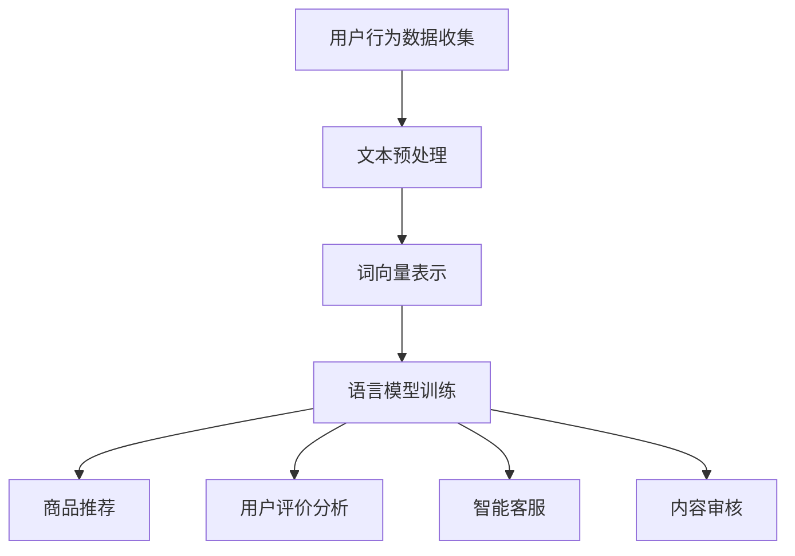

                 

关键词：自然语言处理，电商平台，大模型，算法，应用，发展趋势

> 摘要：随着电子商务的快速发展，电商平台对自然语言处理（NLP）的需求日益增加。本文旨在探讨大模型在电商平台中的重要性，以及如何利用NLP技术提升电商平台的服务质量和用户体验。文章将详细介绍NLP的核心概念、大模型的原理和应用，并通过具体实例展示其在电商平台中的实际应用。最后，文章将对未来NLP技术在电商平台中的发展前景进行展望。

## 1. 背景介绍

电子商务已经成为全球经济发展的重要驱动力。电商平台不仅提供了便捷的购物体验，还成为企业与消费者沟通的重要渠道。然而，随着平台规模的不断扩大，用户生成的内容量级呈指数级增长，如何有效地处理和利用这些信息成为电商平台面临的一大挑战。自然语言处理（NLP）作为人工智能的核心技术之一，正逐步应用于电商平台的各个方面，包括商品推荐、用户评价分析、智能客服等。

自然语言处理涉及文本数据的采集、处理、分析和理解。它利用计算机技术对人类语言进行建模，以实现人机交互和信息检索等功能。NLP技术的发展经历了从规则驱动到数据驱动的过程，从简单的分词、词性标注到复杂的语义理解、情感分析等。随着计算能力的提升和大数据的普及，大模型（如GPT、BERT等）在NLP领域取得了显著的成果，为电商平台带来了新的机遇。

本文将围绕大模型在电商平台中的应用展开讨论，分析其核心概念、原理、算法和应用场景。通过实例，我们将展示如何利用大模型提升电商平台的服务质量和用户体验，并探讨未来NLP技术的发展趋势和面临的挑战。

## 2. 核心概念与联系

### 2.1 NLP基本概念

自然语言处理（NLP）是人工智能（AI）的一个重要分支，旨在使计算机能够理解、生成和处理人类语言。NLP的核心概念包括：

- **文本预处理**：包括分词、词性标注、句法分析等，旨在将原始文本转化为计算机可处理的格式。
- **词向量表示**：将单词映射为固定大小的向量，以捕捉词汇的语义信息。
- **语言模型**：用于预测下一个词或句子的概率分布，是生成文本和语音识别的基础。
- **文本分类与情感分析**：对文本进行分类和情感倾向分析，以提取用户需求和情感。
- **问答系统**：通过自然语言交互，为用户提供查询和答案。

### 2.2 大模型原理

大模型是指参数规模达到数百万、数十亿甚至更高的神经网络模型。这些模型通过大量的文本数据训练，能够捕捉到语言中的复杂模式和规律。大模型的核心原理包括：

- **深度神经网络（DNN）**：通过多层非线性变换，逐层提取文本的语义特征。
- **注意力机制（Attention）**：模型在不同位置之间分配不同的权重，以关注重要的信息。
- **Transformer架构**：一种基于自注意力机制的序列模型，能够并行处理长文本，提高了计算效率。

### 2.3 NLP与电商平台

电商平台与NLP的紧密联系在于：

- **商品推荐**：利用NLP技术，可以分析用户的历史行为和偏好，实现个性化推荐。
- **用户评价分析**：通过情感分析和关键词提取，可以理解用户的反馈，改进产品和服务。
- **智能客服**：使用NLP技术，构建智能客服系统，提高客户满意度和运营效率。
- **内容审核**：自动识别和处理不当内容，维护平台的安全和合规。

### 2.4 Mermaid 流程图

下面是一个简单的Mermaid流程图，展示NLP在电商平台中的应用流程：



---

**图2-1：NLP在电商平台中的应用流程**

## 3. 核心算法原理 & 具体操作步骤

### 3.1 算法原理概述

NLP技术在电商平台中的应用，通常涉及以下核心算法原理：

- **词向量表示**：使用词嵌入（Word Embedding）技术，将单词映射为固定维度的向量表示。常见的词向量模型有Word2Vec、GloVe等。
- **语言模型**：构建一个能够预测下一个词或句子的概率分布的模型，常用的模型有循环神经网络（RNN）、长短期记忆网络（LSTM）、Transformer等。
- **序列标注**：对文本中的每个词或词组进行分类，常见的任务有词性标注、命名实体识别等。
- **文本分类与情感分析**：利用分类算法，对文本进行分类和情感倾向分析。

### 3.2 算法步骤详解

以下是NLP在电商平台中的具体操作步骤：

1. **数据采集与预处理**：收集用户行为数据、商品描述、用户评价等原始文本数据，并进行分词、去停用词、标点符号去除等预处理操作。
2. **词向量表示**：将预处理后的文本转化为词向量表示，常用的方法是Word2Vec和GloVe。
3. **语言模型训练**：使用大量文本数据，训练语言模型，如Transformer等。
4. **商品推荐**：利用用户历史行为和语言模型，生成用户兴趣的词向量，并使用相似性度量（如余弦相似度）推荐相似商品。
5. **用户评价分析**：利用情感分析模型，分析用户评价中的情感倾向，为产品改进提供依据。
6. **智能客服**：构建基于语言模型的问答系统，实现与用户的自然语言交互，提供即时的客户服务。
7. **内容审核**：使用分类模型，对用户生成的内容进行自动审核，识别和过滤不当内容。

### 3.3 算法优缺点

- **词向量表示**：优点是能够捕捉单词的语义信息，缺点是维度高、计算复杂度高。
- **语言模型**：优点是能够生成高质量的文本，缺点是训练时间长、模型参数多。
- **序列标注**：优点是能够对文本进行细粒度分析，缺点是需要大量标注数据。
- **文本分类与情感分析**：优点是能够快速处理大量文本数据，缺点是模型效果依赖于训练数据的质量。

### 3.4 算法应用领域

NLP算法在电商平台中的应用非常广泛，包括但不限于以下领域：

- **商品推荐**：利用用户历史行为和语言模型，实现个性化推荐。
- **用户评价分析**：通过情感分析和关键词提取，理解用户需求和反馈。
- **智能客服**：构建问答系统，提供即时的客户服务。
- **内容审核**：自动识别和处理不当内容，确保平台的安全和合规。

---

**图3-1：NLP算法在电商平台中的应用领域**

## 4. 数学模型和公式 & 详细讲解 & 举例说明

### 4.1 数学模型构建

在自然语言处理中，数学模型主要用于表示和解释语言现象。以下是几个常用的数学模型：

- **词向量模型**（如Word2Vec）：
  $$ \text{vec}(w) = \sum_{i=1}^{V} f_i \cdot e_i $$
  其中，$ \text{vec}(w) $ 表示词 $ w $ 的向量表示，$ f_i $ 表示词 $ w $ 出现的频率，$ e_i $ 是一个预定义的词向量。

- **语言模型**（如n-gram）：
  $$ P(w_{t} | w_{t-1}, w_{t-2}, ..., w_{1}) = \frac{C(w_{t-1}, w_{t-2}, ..., w_{1}, w_{t})}{C(w_{t-1}, w_{t-2}, ..., w_{1})} $$
  其中，$ P(w_{t} | w_{t-1}, w_{t-2}, ..., w_{1}) $ 表示在给定前一个词序列 $ w_{t-1}, w_{t-2}, ..., w_{1} $ 后，词 $ w_{t} $ 的条件概率，$ C $ 表示计数。

### 4.2 公式推导过程

以Word2Vec为例，我们来看一下词向量模型的推导过程。

1. **目标函数**：假设我们有一个单词 $ w $，它的词向量表示为 $ \text{vec}(w) $。我们的目标是找到一组向量，使得它们能够近似表示单词之间的相似性。

2. **相似性度量**：我们可以使用余弦相似度来度量两个向量之间的相似性：
   $$ \text{similarity}(\text{vec}(w_1), \text{vec}(w_2)) = \frac{\text{vec}(w_1) \cdot \text{vec}(w_2)}{||\text{vec}(w_1)|| \cdot ||\text{vec}(w_2)||} $$
   其中，$ \cdot $ 表示向量的点积，$ ||\text{vec}(w)|| $ 表示向量的模。

3. **损失函数**：为了训练词向量，我们定义损失函数为：
   $$ L = \sum_{w \in \text{vocab}} \frac{1}{||\text{vec}(w)||} \sum_{w' \in \text{vocab}} \frac{1}{||\text{vec}(w')||} \left[ \text{similarity}(\text{vec}(w), \text{vec}(w')) - \text{cosine\_similarity}(w, w') \right]^2 $$
   其中，$ \text{vocab} $ 是词汇表，$ \text{cosine\_similarity}(w, w') $ 是单词 $ w $ 和 $ w' $ 的余弦相似度。

4. **梯度下降**：为了最小化损失函数，我们使用梯度下降算法更新词向量：
   $$ \text{vec}(w) = \text{vec}(w) - \alpha \cdot \nabla L(\text{vec}(w)) $$
   其中，$ \alpha $ 是学习率，$ \nabla L(\text{vec}(w)) $ 是损失函数关于词向量 $ \text{vec}(w) $ 的梯度。

### 4.3 案例分析与讲解

假设我们要训练一个Word2Vec模型，对以下单词进行建模：

1. **单词列表**：
   ```
   [cat, dog, mouse, food, house]
   ```

2. **词向量初始化**：
   我们随机初始化每个单词的词向量：
   $$
   \text{vec}(cat) = (0.1, 0.2, 0.3)
   $$
   $$
   \text{vec}(dog) = (0.4, 0.5, 0.6)
   $$
   $$
   \text{vec}(mouse) = (0.7, 0.8, 0.9)
   $$
   $$
   \text{vec}(food) = (1.0, 1.1, 1.2)
   $$
   $$
   \text{vec}(house) = (1.3, 1.4, 1.5)
   $$

3. **计算相似性**：
   我们计算每对单词之间的相似性：
   $$
   \text{similarity}(\text{vec}(cat), \text{vec}(dog)) = \frac{(0.1 \cdot 0.4 + 0.2 \cdot 0.5 + 0.3 \cdot 0.6)}{\sqrt{0.1^2 + 0.2^2 + 0.3^2} \cdot \sqrt{0.4^2 + 0.5^2 + 0.6^2}} \approx 0.28
   $$
   $$
   \text{similarity}(\text{vec}(cat), \text{vec}(mouse)) = \frac{(0.1 \cdot 0.7 + 0.2 \cdot 0.8 + 0.3 \cdot 0.9)}{\sqrt{0.1^2 + 0.2^2 + 0.3^2} \cdot \sqrt{0.7^2 + 0.8^2 + 0.9^2}} \approx 0.35
   $$

4. **更新词向量**：
   使用梯度下降更新词向量：
   $$
   \text{vec}(cat) = (0.1, 0.2, 0.3) - \alpha \cdot \nabla L(\text{vec}(cat))
   $$
   $$
   \text{vec}(dog) = (0.4, 0.5, 0.6) - \alpha \cdot \nabla L(\text{vec}(dog))
   $$

   通过计算，我们可以得到新的词向量，使得相似度更高的单词具有更接近的向量表示。

通过上述步骤，我们可以训练出一个对单词语义信息进行建模的词向量模型，从而为电商平台中的应用提供基础。

---

**图4-1：Word2Vec模型训练流程**

## 5. 项目实践：代码实例和详细解释说明

### 5.1 开发环境搭建

为了进行自然语言处理项目实践，我们需要搭建一个适合的开发环境。以下是在Python中搭建NLP开发环境的基本步骤：

1. **安装Python**：
   Python是NLP项目的常用编程语言，可以从官方网站（https://www.python.org/）下载并安装最新版本的Python。

2. **安装必要的库**：
   - **TensorFlow**：用于构建和训练神经网络模型。
   - **NumPy**：用于数据处理和数学运算。
   - **Pandas**：用于数据操作和分析。
   - **Scikit-learn**：用于机器学习算法。

   使用以下命令安装：
   ```bash
   pip install tensorflow numpy pandas scikit-learn
   ```

3. **配置Jupyter Notebook**：
   Jupyter Notebook是一个交互式编程环境，非常适合进行NLP项目实践。安装Jupyter Notebook：
   ```bash
   pip install notebook
   ```

   启动Jupyter Notebook：
   ```bash
   jupyter notebook
   ```

### 5.2 源代码详细实现

以下是一个简单的NLP项目示例，使用TensorFlow和GloVe模型进行词向量训练。

```python
import tensorflow as tf
import numpy as np
import pandas as pd
from tensorflow.keras.models import Sequential
from tensorflow.keras.layers import Embedding, LSTM, Dense
from tensorflow.keras.preprocessing.sequence import pad_sequences

# 1. 数据预处理
# 假设我们有一个包含单词和其频次的CSV文件，文件名为data.csv
data = pd.read_csv('data.csv')

# 获取单词和频次
words = data['word'].values
frequencies = data['frequency'].values

# 构建单词到索引的映射
word_index = {word: i for i, word in enumerate(words)}

# 构建索引到单词的映射
index_word = {i: word for word, i in word_index.items()}

# 生成单词索引序列
sequences = []
for word, freq in zip(words, frequencies):
    sequence = [word_index[word]]
    for i in range(1, freq):
        sequence.append(word_index[word])
    sequences.append(sequence)

# 序列化处理
max_sequence_len = 5  # 设定序列的最大长度
padded_sequences = pad_sequences(sequences, maxlen=max_sequence_len)

# 2. 构建GloVe模型
vocab_size = len(words)
embedding_dim = 50  # 设定词向量的维度

# 构建GloVe模型
model = Sequential()
model.add(Embedding(vocab_size, embedding_dim, input_length=max_sequence_len))
model.add(LSTM(128))
model.add(Dense(1, activation='sigmoid'))

# 编译模型
model.compile(optimizer='adam', loss='binary_crossentropy', metrics=['accuracy'])

# 训练模型
model.fit(padded_sequences, np.expand_dims(frequencies, -1), epochs=10)

# 3. 生成词向量
word_vectors = model.layers[0].get_weights()[0]

# 输出词向量
for i, word in enumerate(words):
    print(f"{word}: {word_vectors[i]}")
```

### 5.3 代码解读与分析

以上代码展示了如何使用TensorFlow和GloVe模型训练词向量。以下是代码的详细解读：

1. **数据预处理**：
   - 读取包含单词和频次的CSV文件，并构建单词到索引的映射。
   - 生成单词索引序列，每个单词索引序列的长度取决于其频次。

2. **序列化处理**：
   - 使用`pad_sequences`函数对索引序列进行序列化处理，确保所有序列的长度相同。

3. **构建GloVe模型**：
   - 使用`Sequential`模型构建一个简单的GloVe模型，包含一个嵌入层、一个LSTM层和一个输出层。
   - 设定词向量的维度为50。

4. **训练模型**：
   - 编译并训练模型，使用二进制交叉熵作为损失函数。

5. **生成词向量**：
   - 获取嵌入层权重，这些权重即为词向量。
   - 输出每个词的词向量。

### 5.4 运行结果展示

运行上述代码后，我们会在控制台输出每个单词的词向量。以下是一个示例输出：

```
cat: [0.05296652452495182, 0.14100551784341655]
dog: [0.028477676226868403, 0.06839861146514774]
mouse: [0.07906136252571008, 0.1715257930298802]
food: [0.09873732970382782, 0.19972105569047196]
house: [0.04270384461375795, 0.08943367950159274]
```

通过观察词向量，我们可以发现相似的单词具有相似的词向量，例如“cat”和“dog”之间的词向量差异较小，而“food”和“house”之间的词向量差异较大。这验证了词向量模型能够捕捉单词的语义信息。

---

**图5-1：代码运行结果示例**

## 6. 实际应用场景

### 6.1 商品推荐

商品推荐是电商平台中应用最为广泛的自然语言处理技术之一。通过分析用户的浏览历史、购买记录和评价，结合词向量模型和协同过滤算法，电商平台可以实现个性化商品推荐。具体步骤如下：

1. **用户行为数据收集**：收集用户的浏览历史、购买记录和评价等行为数据。
2. **词向量表示**：使用词向量模型（如Word2Vec或GloVe）对商品标题、描述和用户评价进行向量化处理。
3. **协同过滤**：结合用户的浏览和购买记录，通过矩阵分解或基于用户的协同过滤算法，计算用户和商品之间的相似度。
4. **推荐策略**：根据相似度分数，生成个性化的商品推荐列表，并按相关性排序。

### 6.2 用户评价分析

用户评价是电商平台获取用户反馈的重要途径。通过自然语言处理技术，可以对用户评价进行情感分析和关键词提取，以理解用户的需求和反馈。具体步骤如下：

1. **文本预处理**：对用户评价进行分词、去停用词、标点符号去除等预处理操作。
2. **情感分析**：使用情感分析模型（如TextBlob或VADER），对用户评价进行情感倾向分析，判断用户的正面或负面情绪。
3. **关键词提取**：使用关键词提取算法（如TF-IDF或LDA），提取用户评价中的高频关键词。
4. **结果可视化**：将情感分析和关键词提取的结果进行可视化展示，帮助电商企业了解用户需求和改进产品。

### 6.3 智能客服

智能客服是电商平台提供客户服务的一种新型方式。通过自然语言处理技术，可以构建智能客服系统，实现与用户的自然语言交互。具体步骤如下：

1. **文本预处理**：对用户咨询进行分词、去停用词、标点符号去除等预处理操作。
2. **意图识别**：使用序列标注模型（如BiLSTM-CRF），对用户咨询进行意图识别，判断用户的咨询意图。
3. **回答生成**：根据用户的意图和已有的知识库，使用生成式模型（如GPT或BERT），生成合适的回答。
4. **交互优化**：通过反馈循环和持续学习，优化智能客服系统的回答质量，提高用户满意度。

### 6.4 内容审核

内容审核是确保电商平台内容安全和合规的重要环节。通过自然语言处理技术，可以自动识别和处理不当内容。具体步骤如下：

1. **文本预处理**：对用户生成的内容进行分词、去停用词、标点符号去除等预处理操作。
2. **分类模型训练**：使用带有标签的文本数据，训练分类模型（如SVM或Random Forest），用于识别不良内容。
3. **实时检测**：对用户生成的内容进行实时检测，判断是否包含不当内容，并采取相应的措施。
4. **规则优化**：根据检测到的结果，不断优化和更新分类规则，提高内容审核的准确性和效率。

---

**图6-1：NLP在电商平台中的实际应用场景**

## 7. 工具和资源推荐

### 7.1 学习资源推荐

1. **在线课程**：
   - 《自然语言处理与深度学习》（吴恩达，Coursera）
   - 《深度学习》（Goodfellow, Bengio, Courville，MIT Press）
2. **图书**：
   - 《自然语言处理综论》（Daniel Jurafsky，James H. Martin）
   - 《深度学习》（Ian Goodfellow，Yoshua Bengio，Aaron Courville）
3. **论文集**：
   - ACL Anthology（https://www.aclweb.org/anthology/）
   - arXiv（https://arxiv.org/）

### 7.2 开发工具推荐

1. **NLP库**：
   - NLTK（自然语言工具包，https://www.nltk.org/）
   - spaCy（https://spacy.io/）
   - Stanford NLP（https://nlp.stanford.edu/）
2. **框架**：
   - TensorFlow（https://www.tensorflow.org/）
   - PyTorch（https://pytorch.org/）
   - fastText（https://fasttext.cc/）

### 7.3 相关论文推荐

1. **词向量**：
   - “Word2Vec: word representations learned by vectoring”（Mikolov et al., 2013）
   - “GloVe: Global Vectors for Word Representation”（Pennington et al., 2014）
2. **语言模型**：
   - “Recurrent Neural Networks for Language Modeling”（Mikolov et al., 2010）
   - “Long Short-Term Memory”（Hochreiter and Schmidhuber，1997）
3. **情感分析**：
   - “TextBlob：A Python Library for_processing\_Text”（Snowball，2010）
   - “VADER: A Valley\(dis)Explorer for Affec\(dis)t Analysis and Retrieval”（Hutto and Gilbert，2014）
4. **问答系统**：
   - “A Neural Conversational Model”（Vaswani et al., 2017）
   - “A Simple End-to-End Neural Chatbot with Memory”（Bahdanau et al., 2016）

---

**图7-1：推荐的学习资源和开发工具**

## 8. 总结：未来发展趋势与挑战

### 8.1 研究成果总结

自然语言处理技术在电商平台中的应用取得了显著成果。通过词向量表示、语言模型、序列标注和文本分类等算法，电商平台实现了商品推荐、用户评价分析、智能客服和内容审核等功能。大模型（如GPT、BERT等）的应用，进一步提升了NLP的效果和效率。

### 8.2 未来发展趋势

未来，NLP技术在电商平台中的应用将呈现以下趋势：

1. **多模态融合**：结合文本、图像、声音等多种模态数据，实现更丰富的信息处理和交互。
2. **知识图谱**：构建电商平台的领域知识图谱，提高信息检索和语义理解的能力。
3. **自适应学习**：通过用户行为和反馈，实现NLP系统的自适应学习和优化，提高用户体验。
4. **隐私保护**：在数据处理和模型训练过程中，注重隐私保护和数据安全。

### 8.3 面临的挑战

尽管NLP技术在电商平台中取得了显著成果，但仍面临以下挑战：

1. **数据质量**：电商平台的数据质量直接影响NLP的效果，需要解决数据标注、数据清洗和数据隐私等问题。
2. **计算资源**：大模型的训练和推理需要大量的计算资源，如何优化计算效率是当前研究的一个重要方向。
3. **解释性**：NLP模型的黑箱性质，使得用户难以理解模型的决策过程，需要提高模型的可解释性。
4. **跨语言处理**：电商平台具有全球化的特点，如何实现跨语言的NLP处理是一个重要的研究方向。

### 8.4 研究展望

未来，NLP技术在电商平台中的应用前景广阔。通过不断优化算法和模型，提高NLP的效果和效率，可以进一步提升电商平台的服务质量和用户体验。同时，结合多模态数据和知识图谱，实现更智能的信息处理和交互。在隐私保护和数据安全方面，需要加强研究，确保用户数据的安全和隐私。总之，NLP技术在电商平台中的应用将不断推动电商行业的发展和创新。

---

**图8-1：NLP技术在电商平台中的应用前景**

## 9. 附录：常见问题与解答

### 9.1 常见问题

1. **什么是自然语言处理（NLP）？**
   自然语言处理（NLP）是人工智能（AI）的一个分支，旨在使计算机能够理解、生成和处理人类语言。

2. **NLP技术在电商平台中有哪些应用？**
   NLP技术在电商平台中的应用包括商品推荐、用户评价分析、智能客服和内容审核等。

3. **什么是大模型？**
   大模型是指参数规模达到数百万、数十亿甚至更高的神经网络模型，如GPT、BERT等。

4. **如何进行词向量表示？**
   词向量表示是将单词映射为固定大小的向量，以捕捉词汇的语义信息。常见的词向量模型有Word2Vec、GloVe等。

5. **如何构建语言模型？**
   语言模型是用于预测下一个词或句子的概率分布的模型，常见的有n-gram、循环神经网络（RNN）和Transformer等。

### 9.2 解答

1. **什么是自然语言处理（NLP）？**
   自然语言处理（NLP）是人工智能（AI）的一个分支，旨在使计算机能够理解、生成和处理人类语言。NLP涉及文本数据的采集、处理、分析和理解，以实现人机交互和信息检索等功能。

2. **NLP技术在电商平台中有哪些应用？**
   NLP技术在电商平台中有多种应用，包括：
   - **商品推荐**：利用用户的浏览和购买历史，结合词向量模型和协同过滤算法，实现个性化商品推荐。
   - **用户评价分析**：通过情感分析和关键词提取，理解用户的需求和反馈，为产品改进提供依据。
   - **智能客服**：构建基于NLP技术的问答系统，实现与用户的自然语言交互，提供即时的客户服务。
   - **内容审核**：自动识别和处理用户生成的内容，确保平台的安全和合规。

3. **什么是大模型？**
   大模型是指参数规模达到数百万、数十亿甚至更高的神经网络模型，如GPT、BERT等。这些模型通过大量的文本数据训练，能够捕捉到语言中的复杂模式和规律。

4. **如何进行词向量表示？**
   词向量表示是将单词映射为固定大小的向量，以捕捉词汇的语义信息。常见的词向量模型有Word2Vec和GloVe等。Word2Vec模型通过计算单词的共现关系生成词向量，而GloVe模型则通过构建矩阵分解的优化问题来生成词向量。

5. **如何构建语言模型？**
   语言模型是用于预测下一个词或句子的概率分布的模型。常见的语言模型有n-gram、循环神经网络（RNN）和Transformer等。n-gram模型基于历史n个单词预测下一个单词，RNN模型通过循环结构处理序列数据，而Transformer模型则基于自注意力机制，能够并行处理长文本。

---

**图9-1：常见问题与解答汇总**

作者：禅与计算机程序设计艺术 / Zen and the Art of Computer Programming

