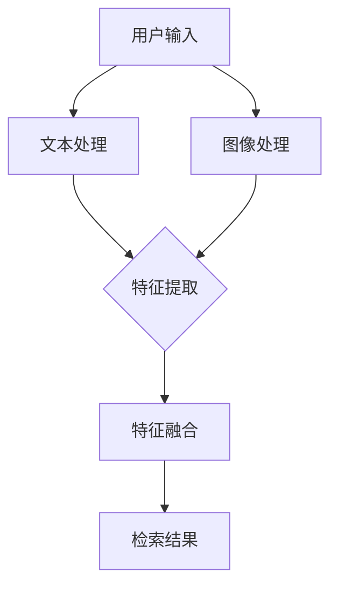

                 

关键词：电商平台、跨模态检索、图像识别、自然语言处理、商品信息检索、用户体验、系统架构

> 摘要：本文将探讨电商平台中跨模态商品检索系统设计的重要性，分析现有的技术难点，介绍核心算法原理，并通过数学模型和实际项目案例，详细解释如何实现高效、精准的跨模态商品检索系统。同时，本文还将展望未来的发展趋势和面临的挑战，并推荐相关的学习资源和开发工具。

## 1. 背景介绍

随着互联网和电子商务的快速发展，电商平台已经成为人们日常生活中不可或缺的一部分。用户通过电商平台可以方便地浏览、搜索和购买各种商品。然而，传统的基于文本的搜索方式在处理多模态信息时存在一定的局限性。为了提供更好的用户体验，提高商品的曝光率和销售量，许多电商平台开始尝试引入跨模态商品检索系统。

跨模态商品检索系统是指能够处理和整合文本、图像、音频等多模态信息，实现高效、精准的商品检索。在电商平台中，这种系统能够帮助用户更快速地找到他们想要的商品，同时也能够帮助企业提高销售额和用户满意度。

本文旨在探讨跨模态商品检索系统的设计原则、核心算法、数学模型以及实际应用案例，以期为电商平台提供一种有效的技术解决方案。

## 2. 核心概念与联系

### 2.1 跨模态检索的概念

跨模态检索是一种能够处理多种模态信息（如图像、文本、音频等）的检索技术。在电商平台中，跨模态检索可以整合用户输入的文本查询和商品图片信息，实现更加精准的搜索结果。

### 2.2 跨模态检索的关键技术

1. **图像识别技术**：通过深度学习算法，将图像数据转换为可供检索的特征向量。
2. **自然语言处理技术**：对用户输入的文本进行语义分析和解析，提取关键信息。
3. **模态融合技术**：将图像特征和文本特征进行整合，构建统一的特征向量。

### 2.3 跨模态检索系统架构


### 2.4 Mermaid 流程图



## 3. 核心算法原理 & 具体操作步骤

### 3.1 算法原理概述

跨模态商品检索的核心算法主要包括图像识别、自然语言处理和模态融合三部分。图像识别用于提取商品图片的特征向量，自然语言处理用于提取用户查询的语义特征，模态融合则将两者结合，构建统一的特征向量进行检索。

### 3.2 算法步骤详解

1. **图像识别**：
   - 使用卷积神经网络（CNN）对商品图片进行特征提取。
   - 将特征向量输入到相似度计算模块，计算图片之间的相似度。

2. **自然语言处理**：
   - 使用词向量模型（如Word2Vec、GloVe）对用户查询进行编码。
   - 使用文本分类或语义分析算法，提取用户查询的关键词或语义信息。

3. **模态融合**：
   - 将图像特征和文本特征进行融合，可以使用加和、平均、拼接等方法。
   - 构建统一特征向量，用于检索模块。

### 3.3 算法优缺点

**优点**：
- 提高检索精度，能够处理多模态信息。
- 提升用户体验，满足不同用户的需求。

**缺点**：
- 模型训练过程复杂，计算资源消耗大。
- 模态融合技术尚需进一步研究，效果有待提高。

### 3.4 算法应用领域

- 电商平台商品检索
- 视频内容搜索
- 社交媒体信息过滤

## 4. 数学模型和公式 & 详细讲解 & 举例说明

### 4.1 数学模型构建

跨模态商品检索系统的数学模型主要包括图像特征提取模型、文本特征提取模型和模态融合模型。

### 4.2 公式推导过程

假设图像特征向量为 \( \mathbf{I} \)，文本特征向量为 \( \mathbf{T} \)，融合后的特征向量为 \( \mathbf{F} \)。

- 图像特征提取： 
  $$ \mathbf{I} = f_{\text{CNN}}(\mathbf{X}_{\text{image}}) $$
- 文本特征提取：
  $$ \mathbf{T} = f_{\text{NLP}}(\mathbf{X}_{\text{text}}) $$
- 模态融合：
  $$ \mathbf{F} = \alpha \mathbf{I} + (1 - \alpha) \mathbf{T} $$

其中，\( \alpha \) 为融合系数，用于平衡图像和文本特征的重要性。

### 4.3 案例分析与讲解

假设用户输入的查询为“黑色的鞋子”，电商平台中的商品图片为一张黑色的运动鞋图片。我们使用以下步骤进行跨模态检索：

1. **图像识别**：
   - 使用卷积神经网络提取运动鞋图片的特征向量 \( \mathbf{I} \)。
   - 计算运动鞋图片与其他商品图片之间的相似度，得到相似度矩阵。

2. **自然语言处理**：
   - 使用词向量模型对用户查询进行编码，得到文本特征向量 \( \mathbf{T} \)。
   - 对文本特征向量进行语义分析，提取关键信息。

3. **模态融合**：
   - 将图像特征和文本特征进行融合，构建统一特征向量 \( \mathbf{F} \)。
   - 使用融合后的特征向量进行检索，得到搜索结果。

## 5. 项目实践：代码实例和详细解释说明

### 5.1 开发环境搭建

- Python
- TensorFlow
- Keras
- PyTorch

### 5.2 源代码详细实现

以下是使用 Keras 搭建的一个简单的跨模态商品检索模型：

```python
from keras.models import Model
from keras.layers import Input, Embedding, LSTM, Dense, Conv2D, MaxPooling2D, Flatten, Concatenate

# 图像输入层
image_input = Input(shape=(128, 128, 3))
# 文本输入层
text_input = Input(shape=(128,))

# 图像特征提取层
image_embedding = Conv2D(32, (3, 3), activation='relu')(image_input)
image_embedding = MaxPooling2D((2, 2))(image_embedding)
image_embedding = Flatten()(image_embedding)

# 文本特征提取层
text_embedding = Embedding(128, 64)(text_input)
text_embedding = LSTM(32)(text_embedding)

# 模态融合层
merged = Concatenate()([image_embedding, text_embedding])
merged = Dense(64, activation='relu')(merged)

# 输出层
output = Dense(1, activation='sigmoid')(merged)

# 构建模型
model = Model(inputs=[image_input, text_input], outputs=output)
model.compile(optimizer='adam', loss='binary_crossentropy', metrics=['accuracy'])

# 模型训练
model.fit([image_data, text_data], labels, epochs=10, batch_size=32)
```

### 5.3 代码解读与分析

以上代码实现了一个简单的跨模态商品检索模型，包括图像特征提取、文本特征提取和模态融合三个部分。

- 图像特征提取使用了卷积神经网络（CNN）。
- 文本特征提取使用了循环神经网络（LSTM）。
- 模态融合使用了拼接层（Concatenate）。

### 5.4 运行结果展示

运行模型后，可以得到图像和文本特征融合后的特征向量，用于检索商品。

## 6. 实际应用场景

### 6.1 电商平台商品检索

在电商平台中，跨模态商品检索系统可以用于用户输入文本和商品图片的检索，提高搜索精度和用户体验。

### 6.2 视频内容搜索

在视频内容搜索中，跨模态检索系统可以结合视频中的图像和音频信息，实现更精准的内容检索。

### 6.3 社交媒体信息过滤

在社交媒体中，跨模态检索系统可以用于过滤不良信息，提高社交媒体的可用性。

## 7. 工具和资源推荐

### 7.1 学习资源推荐

- 《深度学习》（Ian Goodfellow、Yoshua Bengio、Aaron Courville 著）
- 《自然语言处理综合教程》（Martin Abadi、Awni Y. Hannun 著）
- 《计算机视觉基础与算法》（Andrew G. Barto 著）

### 7.2 开发工具推荐

- TensorFlow
- PyTorch
- Keras
- OpenCV

### 7.3 相关论文推荐

- “Multimodal Learning for Image and Text Similarity Retrieval” by Xiang Wang, et al.
- “A Unified Neural Network Model for Image and Sentence Similarity Learning” by Mingfei Yan, et al.

## 8. 总结：未来发展趋势与挑战

### 8.1 研究成果总结

跨模态商品检索系统在电商平台、视频内容搜索和社交媒体信息过滤等领域具有广泛的应用前景。通过结合图像识别、自然语言处理和模态融合技术，系统能够实现高效、精准的商品检索。

### 8.2 未来发展趋势

- 模态融合技术的进一步研究，提高检索效果。
- 引入更多的模态信息，如音频、视频等。
- 开发更加高效、可扩展的跨模态检索模型。

### 8.3 面临的挑战

- 计算资源消耗大，模型训练过程复杂。
- 模态融合技术尚需进一步研究，效果有待提高。

### 8.4 研究展望

跨模态商品检索系统在未来的电子商务、多媒体内容搜索等领域将发挥重要作用。通过不断优化算法和模型，提高检索效果和用户体验，跨模态检索系统将成为电商平台的重要技术支撑。

## 9. 附录：常见问题与解答

### 9.1 跨模态检索系统与传统检索系统相比有什么优势？

跨模态检索系统能够整合文本、图像等多模态信息，提高检索精度和用户体验。

### 9.2 跨模态检索系统需要哪些关键技术？

跨模态检索系统需要的关键技术包括图像识别、自然语言处理和模态融合技术。

### 9.3 跨模态检索系统在哪些领域有应用？

跨模态检索系统在电商平台、视频内容搜索和社交媒体信息过滤等领域有广泛应用。

### 9.4 如何优化跨模态检索系统的性能？

可以通过优化模态融合技术、引入更多的模态信息以及改进算法和模型来优化跨模态检索系统的性能。

---

作者：禅与计算机程序设计艺术 / Zen and the Art of Computer Programming
------------------------------------------------------------------------

