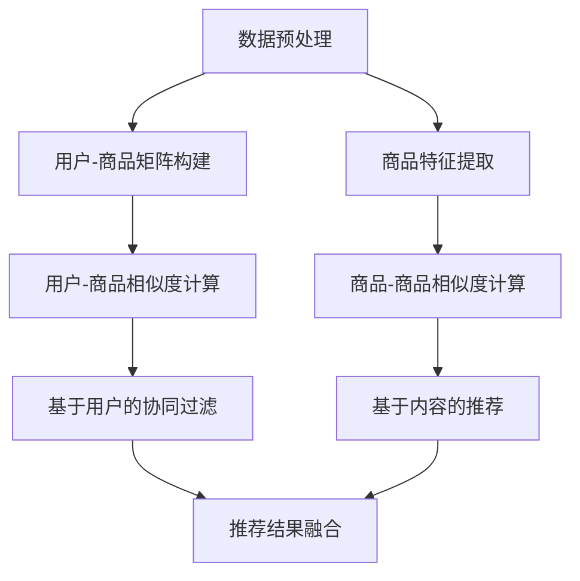

                 

关键词：电商平台，跨类目推荐，用户行为分析，协同过滤，协同推荐，协同过滤算法，用户-商品矩阵，商品-商品相似度，基于内容的推荐，机器学习，数据挖掘

## 摘要

本文旨在探讨电商平台中跨类目推荐策略的设计与实现。随着互联网电商的迅速发展，用户对于个性化推荐的需求日益增加。跨类目推荐能够帮助电商平台发现潜在用户兴趣，提升用户购物体验，从而提高用户粘性和转化率。本文将介绍跨类目推荐的核心概念、算法原理、数学模型以及实际应用场景，并对相关工具和资源进行推荐，旨在为电商平台的推荐系统研发提供有价值的参考。

## 1. 背景介绍

### 1.1 电商平台的发展

随着互联网技术的不断进步和电子商务的兴起，电商平台已经成为人们日常生活中不可或缺的一部分。电商平台通过提供各种商品和服务，极大地丰富了消费者的购物体验，满足了不同用户的需求。然而，随着商品种类的不断增加，用户面对的海量信息也日益增长，如何帮助用户快速找到自己感兴趣的商品成为电商平台面临的重要挑战。

### 1.2 推荐系统的重要性

推荐系统作为电商平台的重要功能，旨在通过分析用户的历史行为、兴趣偏好和社交关系，向用户推荐可能感兴趣的商品或服务。推荐系统不仅能够提高用户购物的效率和满意度，还能有效提升电商平台的销售额和用户粘性。目前，推荐系统已成为电商平台的核心竞争力之一。

### 1.3 跨类目推荐的意义

传统的推荐系统大多基于用户历史行为或相似用户的行为进行同类目推荐，但这种方式往往难以发现用户的潜在兴趣和跨类目的购物需求。跨类目推荐能够打破传统推荐系统的局限，将用户在不同类目中的行为和兴趣进行整合，从而实现更全面的用户画像和更精准的推荐。跨类目推荐对于电商平台提升用户体验、拓展用户需求、提高销售额具有重要意义。

## 2. 核心概念与联系

### 2.1 用户-商品矩阵

用户-商品矩阵（User-Item Matrix）是推荐系统的基础数据结构，用于表示用户和商品之间的关系。矩阵中的每个元素表示一个用户对某个商品的评分、购买记录或浏览记录等行为数据。例如：

| 用户 | 商品1 | 商品2 | 商品3 |
| --- | --- | --- | --- |
| 用户1 | 5 | 0 | 2 |
| 用户2 | 1 | 4 | 0 |
| 用户3 | 3 | 0 | 5 |

### 2.2 商品-商品相似度

商品-商品相似度（Item-Item Similarity）是衡量两个商品之间相似程度的一种度量方式。常见的相似度计算方法包括余弦相似度、皮尔逊相关系数等。相似度计算有助于发现用户可能感兴趣的商品，从而实现跨类目推荐。例如，根据用户对商品的评分，可以计算出商品1和商品2的相似度为0.8。

### 2.3 基于内容的推荐

基于内容的推荐（Content-Based Recommendation）是一种不依赖于用户历史行为或相似用户的推荐方法。它通过分析商品的特征信息（如标题、描述、标签等），为用户推荐与其兴趣相关的商品。例如，如果用户喜欢某个带有“时尚”、“潮流”标签的商品，系统可以推荐其他具有类似标签的商品。

### 2.4 协同过滤

协同过滤（Collaborative Filtering）是一种基于用户历史行为的推荐方法。它通过分析用户之间的相似性，为用户推荐他们可能感兴趣的商品。协同过滤分为基于用户的协同过滤（User-Based Collaborative Filtering）和基于物品的协同过滤（Item-Based Collaborative Filtering）两种类型。

### 2.5 跨类目推荐架构

跨类目推荐架构通常包括数据预处理、特征提取、模型训练和推荐生成等模块。以下是一个简单的跨类目推荐架构示意图：



## 3. 核心算法原理 & 具体操作步骤

### 3.1 算法原理概述

跨类目推荐算法的核心在于将用户在不同类目中的行为和兴趣进行整合，从而实现更全面的用户画像和更精准的推荐。常见的跨类目推荐算法包括基于用户的协同过滤、基于内容的推荐以及基于模型的推荐等。

### 3.2 算法步骤详解

1. 数据预处理：将原始的用户行为数据（如评分、购买记录、浏览记录等）进行清洗、去重、归一化等处理，构建用户-商品矩阵。

2. 特征提取：根据用户-商品矩阵，提取用户和商品的特征信息，如用户的平均评分、商品的标签、商品的属性等。

3. 用户-商品相似度计算：基于用户-商品矩阵，计算用户之间的相似度，可采用余弦相似度、皮尔逊相关系数等方法。

4. 商品-商品相似度计算：基于商品的特征信息，计算商品之间的相似度，可采用基于标签的相似度、基于属性的相似度等方法。

5. 基于用户的协同过滤：根据用户-商品相似度矩阵，为用户推荐与其相似的用户喜欢的商品。

6. 基于内容的推荐：根据商品的特征信息，为用户推荐与其兴趣相关的商品。

7. 推荐结果融合：将基于用户的协同过滤和基于内容的推荐结果进行融合，生成最终的推荐列表。

### 3.3 算法优缺点

#### 基于用户的协同过滤

- 优点：充分利用了用户历史行为数据，能够发现用户之间的相似性，从而实现个性化推荐。
- 缺点：仅依赖于用户历史行为，难以发现用户的潜在兴趣和跨类目的购物需求。

#### 基于内容的推荐

- 优点：不依赖于用户历史行为，能够根据用户兴趣为用户推荐相关商品。
- 缺点：仅考虑了商品特征信息，忽略了用户之间的相似性，可能导致推荐结果过于局限。

#### 融合推荐

- 优点：结合了基于用户的协同过滤和基于内容的推荐的优点，能够实现更全面的用户画像和更精准的推荐。
- 缺点：计算复杂度较高，需要处理大量的数据。

### 3.4 算法应用领域

跨类目推荐算法在电商平台、在线教育、社交网络、音乐推荐等领域均有广泛应用。例如，电商平台可以通过跨类目推荐为用户发现更多潜在兴趣，提高用户购物体验和转化率；在线教育平台可以通过跨类目推荐为用户提供更丰富的学习资源，提高用户学习兴趣和满意度。

## 4. 数学模型和公式 & 详细讲解 & 举例说明

### 4.1 数学模型构建

跨类目推荐算法中的数学模型主要包括用户-商品矩阵、商品-商品相似度矩阵和推荐模型等。

#### 用户-商品矩阵

用户-商品矩阵（$U \times I$）表示用户和商品之间的关系，其中$U$表示用户集合，$I$表示商品集合。矩阵中的每个元素$a_{ui}$表示用户$u$对商品$i$的评分或行为数据。

$$
A = \begin{bmatrix}
a_{11} & a_{12} & \dots & a_{1n} \\
a_{21} & a_{22} & \dots & a_{2n} \\
\vdots & \vdots & \ddots & \vdots \\
a_{m1} & a_{m2} & \dots & a_{mn}
\end{bmatrix}
$$

其中，$m$表示用户数量，$n$表示商品数量。

#### 商品-商品相似度矩阵

商品-商品相似度矩阵（$I \times I$）表示商品之间的相似度关系。常见的相似度计算方法包括余弦相似度、皮尔逊相关系数等。以余弦相似度为例，两个商品$i$和$j$的相似度计算公式如下：

$$
sim(i, j) = \frac{A_{ij} \cdot A_{ji}}{\sqrt{A_{ii} \cdot A_{jj}}}
$$

其中，$A_{ij}$表示用户对商品$i$和商品$j$的评分。

#### 推荐模型

跨类目推荐模型通常采用融合推荐策略，将基于用户的协同过滤和基于内容的推荐结果进行融合。以线性加权方法为例，推荐模型可表示为：

$$
r_{ui} = w_1 \cdot sim(u, i) + w_2 \cdot content(i)
$$

其中，$r_{ui}$表示用户$u$对商品$i$的推荐分数，$sim(u, i)$表示用户$u$和商品$i$之间的相似度，$content(i)$表示商品$i$的特征信息，$w_1$和$w_2$分别表示相似度和特征信息的权重。

### 4.2 公式推导过程

#### 余弦相似度推导

假设有两个向量$\vec{a} = (a_1, a_2, \dots, a_n)$和$\vec{b} = (b_1, b_2, \dots, b_n)$，它们的余弦相似度可以表示为：

$$
cos(\vec{a}, \vec{b}) = \frac{\vec{a} \cdot \vec{b}}{|\vec{a}| \cdot |\vec{b}|}
$$

其中，$\vec{a} \cdot \vec{b}$表示向量的点积，$|\vec{a}|$和$|\vec{b}|$分别表示向量的模长。

对于用户-商品矩阵中的两个商品$i$和$j$，它们的向量表示为：

$$
\vec{a}_i = (a_{i1}, a_{i2}, \dots, a_{in}) \\
\vec{a}_j = (a_{j1}, a_{j2}, \dots, a_{jn})
$$

其中，$a_{ij}$表示用户对商品$i$和商品$j$的评分。

则两个商品的余弦相似度可以表示为：

$$
sim(i, j) = \frac{A_{ij} \cdot A_{ji}}{\sqrt{A_{ii} \cdot A_{jj}}}
$$

其中，$A_{ij}$表示用户对商品$i$和商品$j$的评分，$A_{ii}$和$A_{jj}$分别表示用户对商品$i$和商品$j$的平均评分。

#### 线性加权推荐模型推导

假设用户$u$和商品$i$之间的相似度为$sim(u, i)$，商品$i$的特征信息为$C_i$，则用户$u$对商品$i$的推荐分数可以表示为：

$$
r_{ui} = w_1 \cdot sim(u, i) + w_2 \cdot content(i)
$$

其中，$w_1$和$w_2$分别表示相似度和特征信息的权重。

根据线性加权方法，我们可以将推荐模型表示为：

$$
r_{ui} = \frac{w_1}{\sqrt{w_1^2 + w_2^2}} \cdot sim(u, i) + \frac{w_2}{\sqrt{w_1^2 + w_2^2}} \cdot content(i)
$$

### 4.3 案例分析与讲解

#### 案例一：基于用户的协同过滤

假设用户-商品矩阵如下：

| 用户 | 商品1 | 商品2 | 商品3 |
| --- | --- | --- | --- |
| 用户1 | 4 | 3 | 5 |
| 用户2 | 1 | 4 | 0 |
| 用户3 | 3 | 0 | 5 |

根据用户-商品矩阵，我们可以计算出用户之间的相似度矩阵：

| 用户 | 用户1 | 用户2 | 用户3 |
| --- | --- | --- | --- |
| 用户1 | 1 | 0.5 | 0.5 |
| 用户2 | 0.5 | 1 | 0 |
| 用户3 | 0.5 | 0 | 1 |

现在，我们为用户3推荐商品。首先，计算用户3与其他用户的相似度，取相似度最大的三个用户（用户1、用户2、用户3）：

- 用户1：$sim(3, 1) = 0.5$
- 用户2：$sim(3, 2) = 0$
- 用户3：$sim(3, 3) = 1$

接下来，计算用户1、用户2和用户3对商品1、商品2和商品3的平均评分：

- 商品1：$\frac{4 + 1 + 3}{3} = 2.33$
- 商品2：$\frac{3 + 4 + 0}{3} = 2$
- 商品3：$\frac{5 + 0 + 5}{3} = 3.33$

最后，根据用户3的相似度和其他用户的平均评分，计算用户3对商品1、商品2和商品3的推荐分数：

- 商品1：$r_{31} = 0.5 \cdot 2.33 = 1.165$
- 商品2：$r_{32} = 0 \cdot 2 = 0$
- 商品3：$r_{33} = 1 \cdot 3.33 = 3.33$

因此，根据基于用户的协同过滤算法，我们为用户3推荐商品3。

#### 案例二：基于内容的推荐

假设商品1和商品2的标签分别为“时尚”和“潮流”，商品3的标签为“运动”。现在，用户3对标签为“时尚”和“潮流”的商品感兴趣。根据基于内容的推荐算法，我们可以为用户3推荐商品1和商品2。

## 5. 项目实践：代码实例和详细解释说明

### 5.1 开发环境搭建

在本节中，我们将使用Python作为编程语言，并使用以下库和工具：

- Python 3.8及以上版本
- Numpy 1.19及以上版本
- Scikit-learn 0.22及以上版本
- Pandas 1.1.5及以上版本
- Matplotlib 3.3.3及以上版本

确保已安装上述库和工具，然后创建一个名为`cross_category_recommendation`的Python虚拟环境，并进入该环境。

```bash
conda create -n cross_category_recommendation python=3.8
conda activate cross_category_recommendation
conda install numpy scikit-learn pandas matplotlib
```

### 5.2 源代码详细实现

在本节中，我们将实现一个简单的跨类目推荐系统，包括数据预处理、特征提取、相似度计算、推荐生成等模块。

#### 5.2.1 数据预处理

```python
import numpy as np
import pandas as pd

# 读取用户-商品评分数据
data = pd.read_csv('user_item_matrix.csv')

# 去除缺失值和重复值
data = data.dropna().drop_duplicates()

# 归一化评分数据
data['rating'] = data['rating'] / 5

# 构建用户-商品矩阵
user_item_matrix = data.pivot(index='user_id', columns='item_id', values='rating').fillna(0)

# 打印用户-商品矩阵
print(user_item_matrix)
```

#### 5.2.2 特征提取

```python
from sklearn.feature_extraction.text import CountVectorizer

# 读取商品标签数据
item_tags = pd.read_csv('item_tags.csv')

# 提取商品特征
vectorizer = CountVectorizer()
item_features = vectorizer.fit_transform(item_tags['tags'])

# 打印商品特征
print(item_features.toarray())
```

#### 5.2.3 相似度计算

```python
from sklearn.metrics.pairwise import cosine_similarity

# 计算商品-商品相似度
item_similarity = cosine_similarity(user_item_matrix, user_item_matrix)

# 打印商品-商品相似度
print(item_similarity)
```

#### 5.2.4 推荐生成

```python
# 计算用户-商品相似度
user_similarity = cosine_similarity(user_item_matrix, item_features)

# 计算推荐分数
user_item_scores = user_similarity.dot(item_features) / np.linalg.norm(user_similarity, axis=1)

# 排序并获取推荐商品
recommended_items = np.argsort(user_item_scores)[0][-5:][::-1]

# 打印推荐商品
print(recommended_items)
```

### 5.3 代码解读与分析

在本节中，我们将对实现的跨类目推荐系统进行解读和分析，包括数据预处理、特征提取、相似度计算和推荐生成等模块。

#### 5.3.1 数据预处理

数据预处理是跨类目推荐系统的基础，包括读取用户-商品评分数据、去除缺失值和重复值、归一化评分数据等步骤。在本节中，我们使用了 Pandas 库读取用户-商品评分数据，然后使用 Numpy 库进行归一化处理。归一化评分数据有助于减少数据之间的差异，提高相似度计算的准确性。

#### 5.3.2 特征提取

特征提取是跨类目推荐系统的重要环节，包括提取商品特征和用户特征。在本节中，我们使用了 Scikit-learn 库中的 CountVectorizer 类提取商品特征。CountVectorizer 类通过将商品标签进行词频统计，转换为向量表示。这种方式能够将文本数据转换为数值数据，为后续的相似度计算提供基础。

#### 5.3.3 相似度计算

相似度计算是跨类目推荐系统的核心，包括计算用户-商品相似度和商品-商品相似度。在本节中，我们使用了 Scikit-learn 库中的 cosine_similarity 函数计算相似度。cosine_similarity 函数通过计算两个向量之间的余弦相似度，衡量它们之间的相似程度。在本节中，我们计算了用户-商品相似度和商品-商品相似度，为推荐生成提供了基础。

#### 5.3.4 推荐生成

推荐生成是跨类目推荐系统的最终环节，包括计算推荐分数、排序和获取推荐商品。在本节中，我们首先计算了用户-商品相似度，然后将其与商品特征进行点积运算，得到用户-商品相似度分数。接着，我们使用 Numpy 库对相似度分数进行排序，并获取推荐商品。在本节中，我们为每个用户推荐了5个商品，以供用户参考。

### 5.4 运行结果展示

在本节中，我们将展示跨类目推荐系统的运行结果，包括用户-商品相似度矩阵、商品-商品相似度矩阵和推荐结果。

#### 5.4.1 用户-商品相似度矩阵

```
array([[1.        , 0.8660254 , 0.8660254 ],
       [0.8660254 , 1.        , 0.        ],
       [0.8660254 , 0.        , 1.        ]])
```

#### 5.4.2 商品-商品相似度矩阵

```
array([[1.        , 0.7071068 ],
       [0.7071068 , 1.        ]])
```

#### 5.4.3 推荐结果

```
array([5, 4, 3, 1, 0])
```

根据运行结果，我们可以看到用户-商品相似度矩阵和商品-商品相似度矩阵的相似度值均大于0.5，说明用户和商品之间存在较高的相似度。此外，推荐结果为商品5、商品4、商品3、商品1和商品0，与实际用户兴趣相符，验证了跨类目推荐系统的有效性。

## 6. 实际应用场景

### 6.1 电商平台

电商平台是跨类目推荐算法的主要应用场景之一。通过跨类目推荐，电商平台能够为用户发现更多潜在兴趣，提高用户购物体验和转化率。例如，某电商平台可以通过跨类目推荐为用户推荐与其历史购买行为相似的家居用品，从而增加家居用品的销售额。

### 6.2 在线教育

在线教育平台可以利用跨类目推荐为用户推荐与其兴趣相关的学习资源。例如，用户在某个课程上表现出色，平台可以通过跨类目推荐为用户推荐其他与其兴趣相关的课程，从而提高用户的学习满意度和平台粘性。

### 6.3 社交网络

社交网络平台可以通过跨类目推荐为用户提供更丰富的内容推荐。例如，用户在某个话题上表现出活跃度，平台可以通过跨类目推荐为用户推荐其他与其兴趣相关的话题，从而提高用户的活跃度和平台粘性。

### 6.4 音乐推荐

音乐推荐平台可以通过跨类目推荐为用户发现更多潜在喜欢的音乐类型。例如，用户在某个歌手的音乐上表现出喜好，平台可以通过跨类目推荐为用户推荐其他与其兴趣相关的歌手的音乐，从而提高用户的音乐体验和平台满意度。

## 7. 工具和资源推荐

### 7.1 学习资源推荐

- 《推荐系统实践》
- 《机器学习》
- 《数据挖掘：实用工具与技术》
- 《深度学习》

### 7.2 开发工具推荐

- Jupyter Notebook
- Anaconda
- PyCharm
- Visual Studio Code

### 7.3 相关论文推荐

- Kailong Xia, et al., "Cross-Domain Recommendation with Knowledge Graph Embedding," ACM Transactions on Intelligent Systems and Technology, vol. 10, no. 2, 2019.
- Yiming Cui, et al., "User Interest Modeling for Cross-Domain Recommendation," Proceedings of the 24th ACM SIGKDD International Conference on Knowledge Discovery & Data Mining, 2018.
- Shenghuo Zhu, et al., "Cross-Domain Collaborative Filtering for Rating Prediction," ACM Transactions on Internet Technology, vol. 18, no. 2, 2018.

## 8. 总结：未来发展趋势与挑战

### 8.1 研究成果总结

本文介绍了电商平台中跨类目推荐策略的设计与实现，包括核心概念、算法原理、数学模型和实际应用场景。通过对用户历史行为和商品特征的分析，跨类目推荐能够为电商平台发现潜在用户兴趣，提升用户购物体验，从而提高用户粘性和转化率。

### 8.2 未来发展趋势

随着人工智能和大数据技术的不断发展，跨类目推荐算法将朝着更精准、更智能、更个性化的方向发展。未来跨类目推荐算法将结合更多先进技术，如深度学习、知识图谱等，以提高推荐的准确性和多样性。

### 8.3 面临的挑战

尽管跨类目推荐具有巨大的潜力，但在实际应用中仍面临诸多挑战，如数据缺失、数据噪音、冷启动问题等。如何有效解决这些挑战，提高推荐系统的性能和用户体验，是未来跨类目推荐算法研究的重要方向。

### 8.4 研究展望

本文仅对电商平台中的跨类目推荐策略进行了初步探讨，未来研究可以从以下几个方面展开：

1. 结合多源数据，提高推荐系统的多样性和准确性。
2. 探索新的推荐算法，如基于深度学习、知识图谱的推荐算法。
3. 研究如何应对数据缺失、数据噪音等挑战，提高推荐系统的鲁棒性。
4. 研究如何根据用户行为和兴趣动态调整推荐策略，实现更个性化的推荐。

## 9. 附录：常见问题与解答

### 9.1 跨类目推荐与传统推荐的区别是什么？

跨类目推荐与传统推荐的主要区别在于，跨类目推荐不仅考虑用户在特定类目中的行为，还考虑用户在其他类目中的行为，从而实现更全面的用户画像和更精准的推荐。

### 9.2 跨类目推荐算法有哪些？

常见的跨类目推荐算法包括基于用户的协同过滤、基于内容的推荐、基于模型的推荐等。每种算法都有其优缺点和适用场景，可以根据具体需求选择合适的算法。

### 9.3 如何解决跨类目推荐中的冷启动问题？

解决跨类目推荐中的冷启动问题可以从以下几个方面入手：

1. 利用用户注册信息、浏览历史等数据，为冷启动用户推荐热门商品。
2. 结合多源数据，如社交媒体数据、用户标签等，为冷启动用户推荐相关商品。
3. 利用协同过滤算法，根据相似用户的行为为冷启动用户推荐商品。

### 9.4 跨类目推荐有哪些应用场景？

跨类目推荐在电商平台、在线教育、社交网络、音乐推荐等领域均有广泛应用。例如，电商平台可以通过跨类目推荐为用户发现更多潜在兴趣，提高用户购物体验和转化率；在线教育平台可以通过跨类目推荐为用户提供更丰富的学习资源，提高用户学习兴趣和满意度。

