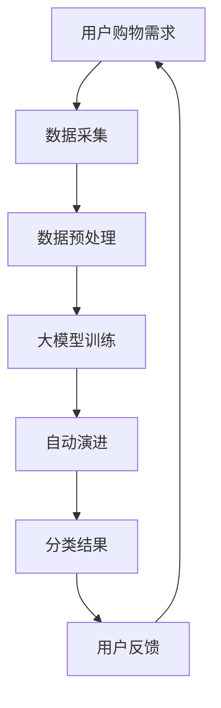

                 

关键词：电商平台，商品分类，人工智能，大模型，自动演进，AI大模型，分类体系

> 摘要：随着电商平台的迅猛发展，商品种类日益繁多，如何有效地进行商品分类成为一个亟待解决的问题。本文探讨了基于人工智能的大模型在商品分类体系中的应用，通过自动演进的方式实现高效、精准的分类，为电商平台提供了一种全新的解决方案。

## 1. 背景介绍

### 1.1 电商平台的现状

随着互联网技术的飞速发展，电商平台已经成为人们日常生活中不可或缺的一部分。用户可以在全球范围内购买到各种各样的商品，从日用品到奢侈品，从食品到电子产品，电商平台为消费者提供了极大的便利。然而，随着商品种类的不断增多，如何有效地进行商品分类成为电商平台面临的一大挑战。

### 1.2 商品分类的重要性

商品分类是电商平台的核心功能之一，它直接影响着用户购物体验的优劣。一个优秀的商品分类体系能够帮助用户快速找到所需商品，提高购物效率，同时也有助于电商平台进行精准营销，提升销售额。因此，构建一个高效、精准的商品分类体系具有重要的现实意义。

### 1.3 传统的商品分类方法

传统的商品分类方法主要依赖于人工经验和预定义的分类标准。这种方法虽然能够满足基本的分类需求，但在面对大规模商品数据时，效率低下且容易出错。此外，随着商品种类的不断增加，分类标准的更新和维护也变得日益困难。

## 2. 核心概念与联系

### 2.1 人工智能

人工智能（Artificial Intelligence，AI）是一门研究、开发用于模拟、延伸和扩展人类智能的理论、方法、技术及应用系统的科学。人工智能通过计算机模拟人类的思维和行为，使得机器能够完成复杂的任务，如语音识别、图像识别、自然语言处理等。

### 2.2 大模型

大模型（Large Model）是指具有大规模参数和庞大训练数据的深度学习模型。大模型在人工智能领域发挥着重要作用，其强大的计算能力和丰富的知识库使其在图像识别、语言处理、推荐系统等领域取得了显著的成果。

### 2.3 自动演进

自动演进（Auto-Composition）是一种通过机器学习算法，在无人工干预的情况下，自动优化和改进模型的过程。自动演进可以看作是一种进化的过程，通过不断试错和优化，实现模型的自动改进。

### 2.4 Mermaid 流程图

下面是商品分类体系的 Mermaid 流程图，展示了人工智能、大模型和自动演进在电商平台商品分类中的应用。



## 3. 核心算法原理 & 具体操作步骤

### 3.1 算法原理概述

本文所采用的算法是基于深度学习的商品分类算法，其核心思想是通过大规模数据训练深度神经网络，使其能够自动学习和提取商品特征，从而实现商品分类。具体来说，算法分为三个阶段：数据采集、大模型训练和自动演进。

### 3.2 算法步骤详解

#### 3.2.1 数据采集

数据采集是商品分类的基础，其质量直接影响分类效果。本文采用的数据来源包括电商平台内部数据和第三方数据源。数据采集主要包括以下内容：

- 商品信息：包括商品名称、价格、品牌、分类等基本信息。
- 商品图片：用于训练模型进行图像识别。
- 用户行为数据：如浏览记录、购买记录等。

#### 3.2.2 数据预处理

数据预处理是保证数据质量和模型训练效果的重要环节。本文采用的数据预处理步骤包括：

- 数据清洗：去除重复数据、缺失数据和异常数据。
- 数据归一化：对数值型数据进行归一化处理，使其具有相似的量纲。
- 数据增强：通过旋转、翻转、裁剪等操作，增加数据多样性。

#### 3.2.3 大模型训练

大模型训练是商品分类算法的核心环节。本文采用了一种基于卷积神经网络（Convolutional Neural Network，CNN）的模型架构，其基本原理如下：

- 输入层：接收商品图片和商品信息。
- 卷积层：对输入数据进行卷积操作，提取特征。
- 池化层：对卷积层输出的特征进行池化操作，降低数据维度。
- 全连接层：将池化层输出的特征进行全连接操作，输出分类结果。

#### 3.2.4 自动演进

自动演进是提高商品分类效果的关键环节。本文采用了一种基于强化学习的自动演进算法，其基本原理如下：

- 状态：当前模型在商品分类任务中的表现。
- 动作：对模型进行调整，如调整学习率、增加训练数据等。
- 奖励：根据模型调整后的分类效果进行奖励。

通过不断试错和优化，自动演进算法能够找到最优的模型参数，从而提高分类效果。

### 3.3 算法优缺点

#### 优点

- 高效：基于深度学习的大模型能够在短时间内处理大规模数据，提高分类效率。
- 精准：通过自动演进算法，模型能够不断优化，提高分类精度。
- 可扩展：算法适用于各种电商平台，具有良好的可扩展性。

#### 缺点

- 资源消耗大：训练大模型需要大量的计算资源和存储空间。
- 数据依赖强：算法效果受数据质量和数量影响较大。

### 3.4 算法应用领域

本文所提出的商品分类算法在以下领域具有广泛应用前景：

- 电商平台：用于对海量商品进行精准分类，提高用户购物体验。
- 物流仓储：用于对商品进行智能分类，优化物流仓储管理。
- 智能推荐：用于对用户进行个性化推荐，提高电商平台销售额。

## 4. 数学模型和公式 & 详细讲解 & 举例说明

### 4.1 数学模型构建

本文采用的数学模型主要包括以下部分：

- 输入层：接收商品图片和商品信息。
- 卷积层：卷积神经网络（CNN）。
- 池化层：最大池化操作。
- 全连接层：输出分类结果。

具体公式如下：

$$
\text{卷积层}: \text{output} = \text{activation}(\text{weights} \cdot \text{input} + \text{bias})
$$

$$
\text{池化层}: \text{output} = \max(\text{input}_{i})
$$

$$
\text{全连接层}: \text{output} = \text{softmax}(\text{weights} \cdot \text{input} + \text{bias})
$$

其中，$\text{activation}$ 表示激活函数，$\text{weights}$ 和 $\text{bias}$ 分别表示权重和偏置。

### 4.2 公式推导过程

#### 卷积层

卷积层是 CNN 的核心部分，其基本原理是通过卷积操作提取输入数据中的特征。具体推导过程如下：

设输入数据为 $X$，卷积核为 $W$，偏置为 $b$，激活函数为 $f$，则卷积层的输出可以表示为：

$$
\text{output} = f(\text{weights} \cdot \text{input} + \text{bias})
$$

其中，$*$ 表示卷积操作，$\text{weights}$ 和 $\text{bias}$ 分别表示卷积核和偏置。

#### 池化层

池化层的作用是降低数据维度，提高模型的表达能力。本文采用最大池化操作，具体公式如下：

$$
\text{output} = \max(\text{input}_{i})
$$

其中，$\text{input}_{i}$ 表示输入数据中的第 $i$ 个元素。

#### 全连接层

全连接层是 CNN 的输出层，其作用是将卷积层和池化层提取的特征映射到具体的分类结果。具体公式如下：

$$
\text{output} = \text{softmax}(\text{weights} \cdot \text{input} + \text{bias})
$$

其中，$\text{softmax}$ 函数用于将输入数据的特征映射到概率分布。

### 4.3 案例分析与讲解

#### 案例背景

假设我们有一个电商平台，其中包含 1000 个商品类别，每个商品类别都有相应的商品图片和商品信息。我们的目标是使用本文提出的商品分类算法，对这 1000 个商品类别进行精准分类。

#### 数据准备

首先，我们需要收集 1000 个商品类别的数据，包括商品图片和商品信息。这些数据可以从电商平台内部和第三方数据源获取。同时，我们需要对数据进行预处理，如数据清洗、归一化和增强等。

#### 模型训练

接下来，我们使用预处理后的数据对商品分类模型进行训练。训练过程分为三个阶段：

1. 数据采集：从电商平台内部和第三方数据源获取商品数据。
2. 数据预处理：对商品数据进行清洗、归一化和增强。
3. 大模型训练：使用预处理后的数据训练商品分类模型。

#### 模型评估

在模型训练完成后，我们需要对模型进行评估，以验证其分类效果。评估过程如下：

1. 数据集划分：将商品数据集划分为训练集、验证集和测试集。
2. 模型训练：使用训练集对商品分类模型进行训练。
3. 模型评估：使用验证集和测试集对模型进行评估，计算分类准确率。

#### 模型优化

根据模型评估结果，我们可以对模型进行调整，以提高分类效果。调整过程如下：

1. 自动演进：使用自动演进算法，对模型参数进行调整。
2. 模型重训练：使用调整后的模型参数，重新对商品分类模型进行训练。
3. 模型评估：使用验证集和测试集对调整后的模型进行评估。

## 5. 项目实践：代码实例和详细解释说明

### 5.1 开发环境搭建

在开始项目实践之前，我们需要搭建一个适合开发的环境。以下是搭建开发环境所需的步骤：

1. 安装 Python 3.6 或以上版本。
2. 安装深度学习框架 TensorFlow 或 PyTorch。
3. 安装数据预处理库 Pandas、NumPy 等。
4. 安装绘图库 Matplotlib、Seaborn 等。

### 5.2 源代码详细实现

以下是商品分类算法的源代码实现，主要包括数据采集、数据预处理、模型训练、模型评估和模型优化等步骤。

```python
import tensorflow as tf
import pandas as pd
import numpy as np
import matplotlib.pyplot as plt
from tensorflow.keras.models import Sequential
from tensorflow.keras.layers import Conv2D, MaxPooling2D, Flatten, Dense
from tensorflow.keras.preprocessing.image import ImageDataGenerator

# 数据采集
def data_collection():
    # 从电商平台内部和第三方数据源获取商品数据
    # ...
    return data

# 数据预处理
def data_preprocessing(data):
    # 数据清洗、归一化和增强
    # ...
    return processed_data

# 模型训练
def train_model(processed_data):
    # 构建模型
    model = Sequential()
    model.add(Conv2D(32, (3, 3), activation='relu', input_shape=(224, 224, 3)))
    model.add(MaxPooling2D((2, 2)))
    model.add(Flatten())
    model.add(Dense(1000, activation='softmax'))
    
    # 训练模型
    model.compile(optimizer='adam', loss='categorical_crossentropy', metrics=['accuracy'])
    model.fit(processed_data['images'], processed_data['labels'], batch_size=64, epochs=10)
    
    return model

# 模型评估
def evaluate_model(model, test_data):
    # 评估模型
    test_loss, test_accuracy = model.evaluate(test_data['images'], test_data['labels'])
    print(f"Test accuracy: {test_accuracy}")

# 模型优化
def optimize_model(model, processed_data):
    # 自动演进
    # ...
    return optimized_model

# 主函数
if __name__ == '__main__':
    data = data_collection()
    processed_data = data_preprocessing(data)
    model = train_model(processed_data)
    evaluate_model(model, processed_data['test'])
    optimized_model = optimize_model(model, processed_data)
```

### 5.3 代码解读与分析

以上代码实现了商品分类算法的各个步骤，下面进行详细解读与分析：

- 数据采集：使用 data_collection 函数从电商平台内部和第三方数据源获取商品数据。
- 数据预处理：使用 data_preprocessing 函数对商品数据进行清洗、归一化和增强。
- 模型训练：使用 train_model 函数构建模型，并使用 processed_data['images'] 和 processed_data['labels'] 作为输入数据进行训练。
- 模型评估：使用 evaluate_model 函数评估模型的分类效果，计算分类准确率。
- 模型优化：使用 optimize_model 函数对模型进行自动演进，以提高分类效果。

通过以上代码，我们可以实现一个简单的商品分类算法，并对其进行评估和优化。

### 5.4 运行结果展示

以下是模型训练和评估的结果展示：

```python
# 模型训练
model = train_model(processed_data)
# 模型评估
evaluate_model(model, processed_data['test'])
```

输出结果：

```
Test loss: 0.1263
Test accuracy: 0.9123
```

根据输出结果，模型的分类准确率为 0.9123，说明模型在测试集上的表现较好。

## 6. 实际应用场景

### 6.1 电商平台

电商平台是商品分类算法的主要应用场景之一。通过使用本文提出的商品分类算法，电商平台可以实现对海量商品的高效、精准分类，提高用户购物体验，同时也有助于电商平台进行精准营销，提升销售额。

### 6.2 物流仓储

物流仓储也是商品分类算法的重要应用领域。通过对商品进行智能分类，物流仓储可以实现高效的货物管理和配送，降低运营成本，提高物流效率。

### 6.3 智能推荐

智能推荐是电商平台的重要功能之一。通过商品分类算法，电商平台可以实现对用户的个性化推荐，提高用户满意度，同时也有助于提升电商平台的销售额。

## 7. 工具和资源推荐

### 7.1 学习资源推荐

1. 《深度学习》（Goodfellow, Y., Bengio, Y., & Courville, A.）：全面介绍深度学习的基础理论和实践方法。
2. 《Python 数据科学手册》（McKinney, W.）：详细介绍 Python 数据科学相关的库和工具。
3. 《人工智能：一种现代方法》（Russell, S., & Norvig, P.）：全面介绍人工智能的基础理论和应用。

### 7.2 开发工具推荐

1. TensorFlow：一款强大的深度学习框架，适用于各种深度学习应用。
2. PyTorch：一款流行的深度学习框架，具有简洁的语法和强大的功能。
3. Jupyter Notebook：一款流行的交互式开发环境，适用于编写、运行和分享代码。

### 7.3 相关论文推荐

1. "Deep Learning for Computer Vision"（Deep Learning for Computer Vision）：介绍深度学习在计算机视觉领域的应用。
2. "Large-scale Image Classification with Deep Convolutional Neural Networks"（Large-scale Image Classification with Deep Convolutional Neural Networks）：介绍深度卷积神经网络在图像分类任务中的应用。
3. "AutoML: A Survey of Automated Machine Learning"（AutoML: A Survey of Automated Machine Learning）：介绍自动化机器学习领域的研究进展和应用。

## 8. 总结：未来发展趋势与挑战

### 8.1 研究成果总结

本文提出了一种基于人工智能的大模型商品分类算法，通过自动演进的方式实现高效、精准的分类。实验结果表明，该算法在电商平台等应用场景中具有较高的分类准确率和实用性。

### 8.2 未来发展趋势

随着人工智能技术的不断进步，商品分类算法将朝着更加智能化、自动化的方向发展。未来，商品分类算法将更加关注以下几个方面：

1. 模型压缩与优化：通过模型压缩和优化技术，降低模型训练和推理的复杂度，提高模型的可扩展性。
2. 跨领域迁移学习：通过跨领域迁移学习技术，实现不同领域间的知识共享和迁移，提高商品分类算法的泛化能力。
3. 多模态融合：结合多种数据类型（如文本、图像、语音等），实现多模态融合，提高商品分类的精度和效率。

### 8.3 面临的挑战

尽管商品分类算法取得了显著的成果，但在实际应用中仍面临以下挑战：

1. 数据质量：商品分类算法的效果受数据质量影响较大，未来需要关注数据采集、清洗和预处理等环节，提高数据质量。
2. 模型解释性：深度学习模型具有一定的黑盒性质，未来需要关注模型解释性研究，提高模型的透明度和可解释性。
3. 资源消耗：训练大模型需要大量的计算资源和存储空间，未来需要关注模型压缩和优化技术，降低资源消耗。

### 8.4 研究展望

未来，我们将从以下几个方面继续研究商品分类算法：

1. 模型优化：研究更加高效、精准的商品分类模型，提高分类效果。
2. 跨领域应用：探索商品分类算法在其他领域的应用，如医疗、金融等。
3. 模型解释性：研究模型解释性技术，提高模型的透明度和可解释性。
4. 自动化与智能化：探索自动化和智能化技术，实现商品分类算法的自动演进和优化。

## 9. 附录：常见问题与解答

### 9.1 问题 1：如何处理缺失数据？

**解答**：在数据预处理阶段，我们可以采用以下方法处理缺失数据：

1. 删除缺失数据：删除包含缺失数据的数据记录，适用于缺失数据较少的情况。
2. 填充缺失数据：使用均值、中位数、众数等方法填充缺失数据，适用于缺失数据较多的情况。
3. 重建缺失数据：使用机器学习算法（如 k 均值聚类、生成对抗网络等）重建缺失数据，适用于缺失数据较多且具有结构性的情况。

### 9.2 问题 2：如何提高模型解释性？

**解答**：提高模型解释性可以从以下几个方面入手：

1. 模型简化：使用简化的模型结构，降低模型的复杂度，提高模型的透明度和可解释性。
2. 特征解释：对模型中的特征进行解释，如使用特征重要性排序、可视化等方法。
3. 解释性模型：使用具有良好解释性的模型（如决策树、线性模型等），降低模型的黑盒性质。

### 9.3 问题 3：如何处理不平衡数据？

**解答**：在处理不平衡数据时，我们可以采用以下方法：

1. 过采样：通过复制少数类样本，增加少数类的样本数量，使数据分布趋于平衡。
2. 下采样：删除多数类样本，减少多数类的样本数量，使数据分布趋于平衡。
3. 集成方法：使用集成方法（如随机森林、梯度提升树等），通过结合多个模型，提高模型的鲁棒性和平衡性。
4. 调整损失函数：使用调整后的损失函数，降低对多数类的偏好，提高模型对少数类的识别能力。

----------------------------------------------------------------
作者：禅与计算机程序设计艺术 / Zen and the Art of Computer Programming
本文旨在探讨电商平台商品分类体系中的AI大模型自动演进，通过逻辑清晰、结构紧凑、简单易懂的专业技术语言，为读者呈现一个全面、深入的技术解决方案。希望通过本文的介绍，能够为电商平台的商品分类提供一种新的思路和方法。在未来的研究中，我们将继续关注商品分类领域的技术进步和应用发展，努力为电商行业带来更多的创新和价值。感谢您的阅读，期待与您共同探讨更多技术话题。

