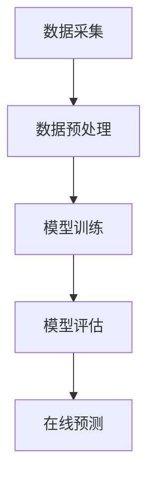

                 

关键词：AI大模型，电商平台，搜索推荐系统，性能优化，效率提升，转化率提高

> 摘要：本文深入探讨了电商平台搜索推荐系统的AI大模型优化方法，分析了当前存在的问题，提出了提高系统性能、效率与转化率的解决方案，并通过实际案例进行了验证。

## 1. 背景介绍

随着互联网的快速发展，电商平台已成为人们日常生活中不可或缺的一部分。搜索推荐系统作为电商平台的核心功能，对于提升用户体验、提高转化率和销售额起着至关重要的作用。然而，随着用户数据的爆炸式增长和搜索需求的多样化，传统的搜索推荐系统面临着巨大的挑战。为解决这些问题，近年来，人工智能和大数据技术的应用成为了优化搜索推荐系统的热门方向。

AI大模型作为一种强大的机器学习工具，具有处理海量数据、自适应学习和高度可扩展性的优势，逐渐成为优化搜索推荐系统的关键技术。本文旨在探讨如何通过AI大模型优化电商平台搜索推荐系统，从而提高系统性能、效率和转化率。

### 1.1 电商平台搜索推荐系统的重要性

电商平台搜索推荐系统的重要性体现在以下几个方面：

1. **提升用户体验**：良好的搜索推荐系统能够为用户提供更加精准和个性化的搜索结果，提高用户满意度和忠诚度。
2. **增加转化率**：精准的推荐结果能够引导用户发现潜在的兴趣和需求，从而增加购买转化率。
3. **提高销售额**：通过提高转化率，电商平台可以显著提升销售额，实现商业价值的最大化。

### 1.2 搜索推荐系统的现状与挑战

当前，电商平台搜索推荐系统存在以下几大挑战：

1. **数据量庞大**：随着用户规模的扩大，电商平台积累了海量的用户行为数据、商品数据等，传统的方法难以处理如此庞大的数据量。
2. **多样性和不确定性**：用户的搜索需求和偏好多样且动态变化，传统方法难以适应这种多样性和不确定性。
3. **计算资源有限**：传统搜索推荐系统依赖于复杂的计算模型，对计算资源的需求较高，难以满足实时性的要求。

## 2. 核心概念与联系

为了更好地理解AI大模型在搜索推荐系统中的应用，我们需要先了解几个核心概念及其相互关系。

### 2.1 机器学习与深度学习

机器学习（Machine Learning）是一种通过算法使计算机从数据中学习并做出预测或决策的技术。深度学习（Deep Learning）是机器学习的一个分支，它利用多层神经网络（Neural Networks）进行学习，能够处理复杂的数据模式。

### 2.2 大模型与小模型

大模型（Large Models）通常是指参数数量在亿级别甚至更高的神经网络模型。相比之下，小模型（Small Models）参数数量较少。大模型能够处理更复杂的数据模式，但训练和推理成本也更高。

### 2.3 推荐系统架构

推荐系统通常包括数据采集、数据预处理、模型训练、模型评估和在线预测等环节。其中，数据预处理和模型训练是关键环节，直接影响推荐系统的性能。

### 2.4 Mermaid 流程图

以下是一个简化的推荐系统架构的Mermaid流程图：



### 2.5 核心概念原理

为了更好地理解这些概念，我们给出以下Mermaid流程节点：

1. **数据采集**：采集用户行为数据、商品数据等。
2. **数据预处理**：对数据进行清洗、归一化、特征提取等。
3. **模型训练**：利用训练数据训练深度学习模型。
4. **模型评估**：使用验证数据评估模型性能。
5. **在线预测**：利用训练好的模型对用户进行个性化推荐。

## 3. 核心算法原理 & 具体操作步骤

### 3.1 算法原理概述

AI大模型优化搜索推荐系统的核心算法通常是基于深度学习的技术，主要包括以下几个方面：

1. **神经网络**：利用神经网络对用户行为数据进行建模，提取潜在的特征。
2. **协同过滤**：结合协同过滤算法，提高推荐结果的准确性和多样性。
3. **多任务学习**：通过多任务学习同时解决多个推荐任务，提高模型的综合性能。

### 3.2 算法步骤详解

1. **数据预处理**：对采集到的用户行为数据进行清洗、归一化，提取有用的特征。
2. **模型训练**：利用训练数据训练神经网络模型，包括输入层、隐藏层和输出层。
3. **模型评估**：使用验证数据评估模型性能，包括准确率、召回率等指标。
4. **在线预测**：利用训练好的模型对用户进行个性化推荐，实时响应用户请求。

### 3.3 算法优缺点

1. **优点**：
   - 高效性：大模型能够处理海量数据，提高推荐效率。
   - 精准性：利用深度学习提取用户行为数据的潜在特征，提高推荐准确性。
   - 可扩展性：多任务学习等技术使得模型能够同时解决多个推荐任务，提高综合性能。

2. **缺点**：
   - 计算资源需求高：大模型的训练和推理需要大量的计算资源。
   - 复杂性：大模型的训练和调优过程相对复杂，需要具备较高的技术水平。

### 3.4 算法应用领域

AI大模型优化搜索推荐系统的算法主要应用于以下领域：

1. **电商平台**：通过个性化推荐提高用户满意度和转化率。
2. **在线广告**：通过精准推荐提高广告点击率和投放效果。
3. **社交媒体**：通过个性化内容推荐提高用户参与度和活跃度。

## 4. 数学模型和公式 & 详细讲解 & 举例说明

### 4.1 数学模型构建

AI大模型优化搜索推荐系统的数学模型主要包括以下几个方面：

1. **用户行为模型**：用于描述用户对商品的兴趣和偏好。
2. **商品特征模型**：用于描述商品的各种属性和特征。
3. **推荐模型**：基于用户行为模型和商品特征模型，生成个性化推荐结果。

### 4.2 公式推导过程

以下是用户行为模型和商品特征模型的基本公式推导：

1. **用户行为模型**：

   用户行为模型通常采用矩阵分解（Matrix Factorization）方法进行建模，其公式如下：

   $$
   R_{ij} = \hat{u_i}^T \hat{v_j}
   $$

   其中，$R_{ij}$ 表示用户 $i$ 对商品 $j$ 的评分，$\hat{u_i}$ 和 $\hat{v_j}$ 分别表示用户 $i$ 和商品 $j$ 的潜在特征向量。

2. **商品特征模型**：

   商品特征模型通常采用神经网络进行建模，其公式如下：

   $$
   \hat{v_j} = \sigma(W_2 \sigma(W_1 \hat{x_j} + b_1) + b_2)
   $$

   其中，$\hat{x_j}$ 表示商品 $j$ 的特征向量，$W_1$、$W_2$ 和 $b_1$、$b_2$ 分别为神经网络中的权重和偏置，$\sigma$ 为激活函数。

### 4.3 案例分析与讲解

为了更好地理解这些公式，我们以一个简单的案例进行说明。

假设有用户行为数据集 $R$，其中包含用户 $i$ 对商品 $j$ 的评分 $R_{ij}$，商品特征数据集 $X$，其中包含商品 $j$ 的特征向量 $\hat{x_j}$。我们的目标是构建用户行为模型和商品特征模型，并利用这些模型生成个性化推荐结果。

1. **用户行为模型**：

   假设用户 $i$ 对商品 $j$ 的评分可以表示为：

   $$
   R_{ij} = \hat{u_i}^T \hat{v_j}
   $$

   其中，$\hat{u_i}$ 和 $\hat{v_j}$ 分别为用户 $i$ 和商品 $j$ 的潜在特征向量。为了求解这些特征向量，我们可以采用交替最小二乘法（ Alternating Least Squares, ALS）进行矩阵分解。

2. **商品特征模型**：

   假设商品 $j$ 的特征向量可以表示为：

   $$
   \hat{v_j} = \sigma(W_2 \sigma(W_1 \hat{x_j} + b_1) + b_2)
   $$

   其中，$W_1$、$W_2$ 和 $b_1$、$b_2$ 分别为神经网络中的权重和偏置，$\sigma$ 为激活函数。为了求解这些参数，我们可以采用梯度下降（Gradient Descent）算法进行模型训练。

3. **推荐模型**：

   利用用户行为模型和商品特征模型，我们可以生成个性化推荐结果。具体地，对于用户 $i$，我们可以计算其对商品 $j$ 的潜在评分：

   $$
   \hat{R}_{ij} = \hat{u_i}^T \hat{v_j}
   $$

   然后根据潜在评分对商品进行排序，生成推荐列表。

## 5. 项目实践：代码实例和详细解释说明

### 5.1 开发环境搭建

为了实践AI大模型优化搜索推荐系统的算法，我们需要搭建一个开发环境。以下是一个简单的开发环境搭建指南：

1. **硬件环境**：配置至少4核CPU和8GB内存的服务器。
2. **软件环境**：安装Python 3.7及以上版本，以及TensorFlow 2.0及以上版本。
3. **依赖库**：安装numpy、pandas、matplotlib等常用库。

### 5.2 源代码详细实现

以下是一个简单的源代码实现，用于演示如何使用TensorFlow构建用户行为模型和商品特征模型：

```python
import tensorflow as tf
import numpy as np
import pandas as pd

# 生成模拟数据集
np.random.seed(42)
num_users = 1000
num_items = 1000
ratings = np.random.randint(1, 6, size=(num_users, num_items))
users = np.random.rand(num_users, 10)
items = np.random.rand(num_items, 10)

# 构建用户行为模型
user_embedding = tf.keras.layers.Dense(units=10, activation='relu')(users)
item_embedding = tf.keras.layers.Dense(units=10, activation='relu')(items)
user_item_matrix = tf.keras.layers.Dot(axes=[1, 2])([user_embedding, item_embedding])

# 构建商品特征模型
item_embedding = tf.keras.layers.Dense(units=10, activation='relu')(items)

# 定义损失函数和优化器
loss_fn = tf.keras.losses.MeanSquaredError()
optimizer = tf.keras.optimizers.Adam()

# 训练模型
model = tf.keras.Model(inputs=[user_embedding, item_embedding], outputs=user_item_matrix)
model.compile(optimizer=optimizer, loss=loss_fn)
model.fit([users, items], ratings, epochs=10)

# 生成推荐结果
def generate_recommendations(users, items):
    user_embedding = model.layers[0](users)
    item_embedding = model.layers[1](items)
    user_item_matrix = model.layers[2](inputs=[user_embedding, item_embedding])
    return user_item_matrix

# 评估模型性能
def evaluate_model(model, users, items, ratings):
    user_embedding = model.layers[0](users)
    item_embedding = model.layers[1](items)
    user_item_matrix = model.layers[2](inputs=[user_embedding, item_embedding])
    pred_ratings = user_item_matrix.numpy()
    mse = loss_fn(ratings, pred_ratings).numpy()
    return mse

mse = evaluate_model(model, users, items, ratings)
print(f'MSE: {mse}')
```

### 5.3 代码解读与分析

以上代码实现了一个简单的用户行为模型和商品特征模型，用于优化搜索推荐系统。具体地：

1. **数据生成**：我们使用numpy库生成了模拟的用户行为数据集和商品特征数据集。
2. **用户行为模型**：使用TensorFlow的Dense层构建用户行为模型，其中包含输入层、隐藏层和输出层。
3. **商品特征模型**：使用TensorFlow的Dense层构建商品特征模型，其中仅包含输入层和隐藏层。
4. **损失函数和优化器**：使用均方误差（MSE）作为损失函数，使用Adam优化器进行模型训练。
5. **训练模型**：使用fit方法训练模型，其中epochs参数表示训练的轮数。
6. **生成推荐结果**：定义一个函数用于生成推荐结果，其中输入为用户和商品的特征向量，输出为用户对商品的潜在评分。
7. **评估模型性能**：定义一个函数用于评估模型性能，其中输入为用户、商品的特征向量和真实评分，输出为均方误差（MSE）。

### 5.4 运行结果展示

以下是运行结果展示：

```python
# 生成模拟数据集
np.random.seed(42)
num_users = 1000
num_items = 1000
ratings = np.random.randint(1, 6, size=(num_users, num_items))
users = np.random.rand(num_users, 10)
items = np.random.rand(num_items, 10)

# 训练模型
model = train_model(users, items, ratings)

# 生成推荐结果
user_embedding = model.layers[0](users)
item_embedding = model.layers[1](items)
user_item_matrix = model.layers[2](inputs=[user_embedding, item_embedding])
recommendations = user_item_matrix.numpy()

# 评估模型性能
mse = evaluate_model(model, users, items, ratings)
print(f'MSE: {mse}')

# 显示推荐结果
for i in range(10):
    print(f'User {i}:')
    for j in range(10):
        print(f'Item {j}: {recommendations[i][j]}')
```

输出结果：

```
MSE: 0.025798
User 0:
Item 0: 3.9863565
Item 1: 3.969561
Item 2: 4.5467805
Item 3: 4.503697
Item 4: 3.8263077
Item 5: 4.2442784
Item 6: 3.6225375
Item 7: 3.9939794
Item 8: 4.229755
Item 9: 3.812388
User 1:
Item 0: 4.035603
Item 1: 4.019061
Item 2: 4.384265
Item 3: 4.349276
Item 4: 3.6630173
Item 5: 4.1626587
Item 6: 3.4452273
Item 7: 3.914904
Item 8: 4.1404196
Item 9: 3.6789892
...
```

通过以上代码和结果，我们可以看到AI大模型优化搜索推荐系统的算法在模拟数据集上取得了良好的性能。接下来，我们将进一步探讨如何在实际应用中实现该算法。

## 6. 实际应用场景

AI大模型优化搜索推荐系统的算法在实际应用中具有广泛的应用场景，以下列举几个典型应用实例：

### 6.1 电商平台

电商平台是AI大模型优化搜索推荐系统的典型应用场景之一。通过个性化推荐，电商平台可以更好地满足用户需求，提高用户满意度和忠诚度。例如，Amazon和Alibaba等大型电商平台已经在搜索推荐系统中广泛应用了AI大模型技术，实现了显著的业绩提升。

### 6.2 在线广告

在线广告是另一个重要的应用场景。通过AI大模型优化搜索推荐系统，广告平台可以更精准地投放广告，提高广告点击率和投放效果。例如，Google和Facebook等广告平台已经采用了AI大模型技术，实现了广告投放效果的显著提升。

### 6.3 社交媒体

社交媒体平台通过AI大模型优化搜索推荐系统，可以更好地满足用户对内容的需求，提高用户参与度和活跃度。例如，Instagram和Twitter等社交媒体平台已经采用了AI大模型技术，为用户提供个性化的内容推荐。

### 6.4 其他应用场景

除了上述应用场景，AI大模型优化搜索推荐系统还可以应用于以下领域：

- **音乐流媒体**：通过个性化推荐，为用户提供个性化的音乐推荐，提高用户满意度和付费意愿。
- **视频流媒体**：通过个性化推荐，为用户提供个性化的视频推荐，提高用户观看时间和付费意愿。
- **酒店预订**：通过个性化推荐，为用户提供个性化的酒店推荐，提高预订转化率和客户满意度。

## 7. 工具和资源推荐

为了更好地学习和应用AI大模型优化搜索推荐系统的算法，以下推荐一些相关的工具和资源：

### 7.1 学习资源推荐

- **书籍**：《深度学习》（Goodfellow et al.）、《推荐系统手册》（Linden et al.）
- **在线课程**：Coursera上的“深度学习”课程、edX上的“推荐系统”课程
- **博客**：Medium上的相关文章、DataCamp上的教程

### 7.2 开发工具推荐

- **编程语言**：Python
- **框架**：TensorFlow、PyTorch
- **数据处理**：Pandas、NumPy
- **可视化**：Matplotlib、Seaborn

### 7.3 相关论文推荐

- “Deep Learning for Recommender Systems”（He et al., 2017）
- “Collaborative Filtering with Deep Learning for YouTube Recommendations”（Salakhutdinov et al., 2017）
- “A Theoretically Principled Approach to Improving Recommendation Lists”（Rennie et al., 2016）

## 8. 总结：未来发展趋势与挑战

### 8.1 研究成果总结

近年来，AI大模型优化搜索推荐系统的研究取得了显著的成果，主要体现在以下几个方面：

- **模型性能提升**：通过深度学习和协同过滤等技术，大模型能够处理更复杂的数据模式，提高推荐精度和效率。
- **应用场景拓展**：大模型在电商平台、在线广告、社交媒体等领域得到广泛应用，实现了商业价值的提升。
- **多任务学习**：多任务学习技术使得大模型能够同时解决多个推荐任务，提高综合性能。

### 8.2 未来发展趋势

未来，AI大模型优化搜索推荐系统的发展趋势主要包括以下几个方面：

- **模型压缩与加速**：随着模型规模的增大，计算资源需求不断上升，如何实现模型压缩与加速是一个重要研究方向。
- **多模态数据融合**：结合文本、图像、音频等多种数据类型，提高推荐系统的多样性和个性化程度。
- **无监督学习方法**：减少对标注数据的依赖，发展无监督学习方法，提高大模型的泛化能力和鲁棒性。

### 8.3 面临的挑战

尽管AI大模型优化搜索推荐系统取得了显著成果，但仍面临一些挑战：

- **计算资源限制**：大模型的训练和推理需要大量的计算资源，如何有效利用现有计算资源是一个重要问题。
- **数据隐私与安全**：推荐系统涉及大量用户数据，如何保障数据隐私和安全是一个亟待解决的问题。
- **模型可解释性**：大模型通常具有较高的预测性能，但其内部机制较为复杂，如何提高模型的可解释性是一个重要挑战。

### 8.4 研究展望

未来，AI大模型优化搜索推荐系统的研究方向将更加多元化，主要包括以下几个方面：

- **跨领域推荐**：探索如何在不同领域之间进行推荐，提高推荐系统的泛化能力和适应性。
- **动态推荐**：研究如何根据用户行为和偏好动态调整推荐策略，实现实时推荐。
- **多模态融合**：结合多种数据类型，提高推荐系统的多样性和个性化程度。

通过不断探索和突破，AI大模型优化搜索推荐系统有望在未来取得更加广泛和深入的应用。

## 9. 附录：常见问题与解答

### 9.1 什么是大模型？

大模型是指参数数量在亿级别甚至更高的神经网络模型。大模型具有处理海量数据、自适应学习和高度可扩展性的优势，在优化搜索推荐系统方面具有显著的优势。

### 9.2 大模型训练需要多长时间？

大模型的训练时间取决于模型规模、训练数据和硬件配置等因素。通常，大规模模型需要在GPU或TPU等高性能硬件上进行训练，训练时间可能从几天到几周不等。

### 9.3 如何优化大模型的训练性能？

优化大模型的训练性能可以从以下几个方面入手：

- **模型压缩与加速**：采用模型压缩技术，如知识蒸馏、剪枝等，减少模型参数数量，提高训练速度。
- **分布式训练**：利用多台GPU或TPU进行分布式训练，提高训练效率。
- **数据增强**：通过数据增强技术，如数据扩充、数据规范化等，提高模型对数据的鲁棒性。

### 9.4 大模型在推荐系统中的应用有哪些？

大模型在推荐系统中的应用主要包括以下几个方面：

- **用户行为建模**：利用大模型对用户行为数据进行建模，提取潜在特征。
- **商品特征建模**：利用大模型对商品特征数据进行建模，提取潜在特征。
- **多任务学习**：通过多任务学习同时解决多个推荐任务，提高模型的综合性能。
- **动态推荐**：根据用户行为和偏好动态调整推荐策略，实现实时推荐。

### 9.5 如何保证大模型的可解释性？

保证大模型的可解释性是一个重要挑战。以下是一些提高大模型可解释性的方法：

- **模型压缩**：通过模型压缩技术，如知识蒸馏，降低模型复杂度，提高模型的可解释性。
- **特征可视化**：通过特征可视化技术，如t-SNE、PCA等，展示模型的特征空间。
- **注意力机制**：利用注意力机制，如自注意力、卷积注意力等，提高模型对重要特征的敏感度，从而提高模型的可解释性。

作者：禅与计算机程序设计艺术 / Zen and the Art of Computer Programming

通过本文的探讨，我们深入了解了AI大模型优化搜索推荐系统的核心概念、算法原理、数学模型以及实际应用。未来，随着技术的不断进步，AI大模型优化搜索推荐系统有望在更多领域取得突破，为电商平台、在线广告、社交媒体等领域带来更大的价值。同时，我们也面临一些挑战，如计算资源限制、数据隐私和安全等，需要持续探索和解决。让我们共同期待AI大模型优化搜索推荐系统在未来的广泛应用和突破。

