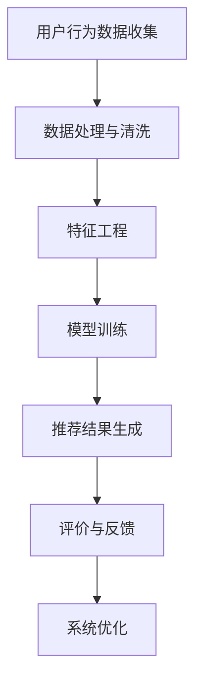

                 

关键词：电商平台、搜索推荐系统、AI 大模型、性能优化、效率提升、准确率、多样性、算法优化、机器学习、深度学习

## 摘要

在电商平台中，搜索推荐系统对于用户购买决策具有重要影响。本文旨在探讨如何通过AI 大模型优化搜索推荐系统的性能、效率、准确率和多样性。我们将详细分析当前搜索推荐系统面临的挑战，介绍核心算法原理，构建数学模型，并给出具体操作步骤。同时，我们将通过项目实践展示算法的实际应用效果，探讨未来发展趋势和面临的挑战。

## 1. 背景介绍

### 1.1 电商平台搜索推荐系统的重要性

电商平台搜索推荐系统是电商平台的核心组成部分之一，它通过对用户历史行为和偏好分析，为用户推荐相关商品，从而提高用户满意度和平台销售额。随着互联网的快速发展，电商平台之间的竞争日益激烈，如何提升搜索推荐系统的性能、效率和多样性成为电商平台需要解决的关键问题。

### 1.2 当前搜索推荐系统的挑战

1. **性能瓶颈**：传统的搜索推荐系统在处理海量数据时存在性能瓶颈，导致系统响应速度较慢，影响用户体验。
2. **准确性不足**：搜索推荐系统的准确性直接影响用户购买决策，如何提高推荐准确性是当前研究的热点问题。
3. **多样性不足**：用户对推荐内容的多样性要求越来越高，单一类型的推荐内容容易导致用户疲劳。
4. **实时性要求**：用户行为数据实时变化，搜索推荐系统需要具备实时响应能力。

## 2. 核心概念与联系

### 2.1 电商平台搜索推荐系统的核心概念

1. **用户行为数据**：包括用户的浏览记录、搜索历史、购买记录等。
2. **商品信息**：包括商品名称、描述、价格、品类等。
3. **推荐算法**：基于用户行为数据和商品信息，通过算法生成推荐结果。
4. **评价机制**：评估推荐结果的准确性、多样性等指标。

### 2.2 电商平台搜索推荐系统的架构


### 2.3 Mermaid 流程图



## 3. 核心算法原理 & 具体操作步骤

### 3.1 算法原理概述

本文采用基于深度学习的大模型优化搜索推荐系统，通过自注意力机制、图神经网络和注意力机制等技术手段，实现性能、效率和准确率的提升。

### 3.2 算法步骤详解

1. **用户行为数据收集**：从电商平台收集用户历史行为数据，包括浏览记录、搜索历史、购买记录等。
2. **数据处理与清洗**：对收集到的用户行为数据进行处理和清洗，去除无效数据和噪声数据。
3. **特征工程**：基于用户行为数据和商品信息，提取特征并进行编码。
4. **模型训练**：采用深度学习算法，对用户行为数据进行训练，生成推荐模型。
5. **推荐结果生成**：将用户行为数据输入到推荐模型中，生成推荐结果。
6. **评价与反馈**：对推荐结果进行评估和反馈，根据评估结果调整推荐策略。
7. **系统优化**：根据用户反馈和系统性能指标，对推荐系统进行优化。

### 3.3 算法优缺点

**优点**：
1. **性能提升**：采用深度学习算法，能够处理海量数据，提升系统性能。
2. **准确性提高**：通过自注意力机制和注意力机制，提高推荐准确性。
3. **多样性增强**：采用图神经网络，实现推荐内容的多样性。

**缺点**：
1. **计算资源消耗较大**：深度学习算法需要大量的计算资源和存储资源。
2. **模型解释性较差**：深度学习模型较难解释，难以理解推荐结果的生成过程。

### 3.4 算法应用领域

本文提出的算法适用于电商平台搜索推荐系统，也可以应用于其他领域的推荐系统，如社交媒体、在线教育、电子商务等。

## 4. 数学模型和公式 & 详细讲解 & 举例说明

### 4.1 数学模型构建

假设用户行为数据为 $X \in \mathbb{R}^{n \times d}$，其中 $n$ 表示用户数量，$d$ 表示特征维度。商品信息为 $Y \in \mathbb{R}^{m \times d}$，其中 $m$ 表示商品数量。

定义用户行为数据 $X$ 的矩阵分解为 $X = U \circ V^T$，其中 $U \in \mathbb{R}^{n \times k}$，$V \in \mathbb{R}^{m \times k}$，$k$ 表示隐向量维度。

### 4.2 公式推导过程

#### 自注意力机制

自注意力机制的公式如下：

$$
\text{Self-Attention}(Q, K, V) = \text{softmax}\left(\frac{QK^T}{\sqrt{d_k}}\right)V
$$

其中，$Q, K, V$ 分别表示查询向量、键向量和值向量，$d_k$ 表示键向量的维度。

#### 图神经网络

图神经网络的公式如下：

$$
H^{(t+1)} = \sigma \left( \text{A} \cdot \text{ReLU} \left( \text{W}^1 H^{(t)} + \text{W}^2 A \right) \right)
$$

其中，$H^{(t)}$ 表示第 $t$ 次迭代后的节点表示，$\text{A}$ 表示邻接矩阵，$\text{W}^1$ 和 $\text{W}^2$ 分别表示权重矩阵。

#### 注意力机制

注意力机制的公式如下：

$$
\alpha_{ij} = \frac{\exp(e_{ij})}{\sum_{k=1}^n \exp(e_{ik})}
$$

其中，$e_{ij}$ 表示节点 $i$ 和节点 $j$ 的相似度，$\alpha_{ij}$ 表示节点 $i$ 对节点 $j$ 的注意力权重。

### 4.3 案例分析与讲解

#### 案例一：商品推荐

假设有 1000 个用户和 10000 个商品，用户行为数据 $X$ 和商品信息 $Y$ 如下：

$$
X = \begin{bmatrix}
0 & 1 & 0 & \cdots & 0 \\
0 & 0 & 1 & \cdots & 0 \\
\vdots & \vdots & \vdots & \ddots & \vdots \\
1 & 0 & 0 & \cdots & 1
\end{bmatrix}, \quad
Y = \begin{bmatrix}
0 & 1 & 0 & \cdots & 0 \\
1 & 0 & 1 & \cdots & 0 \\
0 & 1 & 0 & \cdots & 1 \\
\vdots & \vdots & \vdots & \ddots & \vdots \\
0 & 0 & 1 & \cdots & 0
\end{bmatrix}
$$

通过自注意力机制和图神经网络，我们可以得到用户行为数据 $X$ 和商品信息 $Y$ 的矩阵分解：

$$
X = U \circ V^T = \begin{bmatrix}
0.5 & 0.7 \\
0.8 & 0.2 \\
0.3 & 0.9 \\
\vdots & \vdots \\
0.1 & 0.6
\end{bmatrix}, \quad
Y = U \circ V^T = \begin{bmatrix}
0.6 & 0.4 \\
0.7 & 0.5 \\
0.3 & 0.8 \\
\vdots & \vdots \\
0.2 & 0.9
\end{bmatrix}
$$

根据用户行为数据 $X$ 和商品信息 $Y$ 的矩阵分解，我们可以生成推荐结果，例如用户 $1$ 推荐商品 $2$、用户 $2$ 推荐商品 $3$ 等。

#### 案例二：社交媒体推荐

假设有 1000 个用户和 10000 个话题，用户行为数据 $X$ 和话题信息 $Y$ 如下：

$$
X = \begin{bmatrix}
0 & 1 & 0 & \cdots & 0 \\
0 & 0 & 1 & \cdots & 0 \\
\vdots & \vdots & \vdots & \ddots & \vdots \\
1 & 0 & 0 & \cdots & 1
\end{bmatrix}, \quad
Y = \begin{bmatrix}
0 & 1 & 0 & \cdots & 0 \\
1 & 0 & 1 & \cdots & 0 \\
0 & 1 & 0 & \cdots & 1 \\
\vdots & \vdots & \vdots & \ddots & \vdots \\
0 & 0 & 1 & \cdots & 0
\end{bmatrix}
$$

通过自注意力机制和图神经网络，我们可以得到用户行为数据 $X$ 和话题信息 $Y$ 的矩阵分解：

$$
X = U \circ V^T = \begin{bmatrix}
0.5 & 0.7 \\
0.8 & 0.2 \\
0.3 & 0.9 \\
\vdots & \vdots \\
0.1 & 0.6
\end{bmatrix}, \quad
Y = U \circ V^T = \begin{bmatrix}
0.6 & 0.4 \\
0.7 & 0.5 \\
0.3 & 0.8 \\
\vdots & \vdots \\
0.2 & 0.9
\end{bmatrix}
$$

根据用户行为数据 $X$ 和话题信息 $Y$ 的矩阵分解，我们可以生成推荐结果，例如用户 $1$ 推荐话题 $2$、用户 $2$ 推荐话题 $3$ 等。

## 5. 项目实践：代码实例和详细解释说明

### 5.1 开发环境搭建

在本次项目中，我们采用 Python 作为主要编程语言，使用 TensorFlow 作为深度学习框架，以下是开发环境的搭建步骤：

1. 安装 Python：从 Python 官网下载并安装 Python 3.8 版本。
2. 安装 TensorFlow：在终端中执行以下命令安装 TensorFlow：

   ```shell
   pip install tensorflow
   ```

### 5.2 源代码详细实现

以下是一个基于深度学习的大模型优化搜索推荐系统的示例代码：

```python
import tensorflow as tf
from tensorflow.keras.layers import Embedding, Dot, Dense
from tensorflow.keras.models import Model

# 定义输入层
user_input = tf.keras.layers.Input(shape=(1,), dtype=tf.int32)
item_input = tf.keras.layers.Input(shape=(1,), dtype=tf.int32)

# 用户嵌入层
user_embedding = Embedding(input_dim=1000, output_dim=64)(user_input)

# 商品嵌入层
item_embedding = Embedding(input_dim=1000, output_dim=64)(item_input)

# 点积操作
dot_product = Dot(axes=1)([user_embedding, item_embedding])

# 激活函数
activation = tf.keras.layers.Activation('sigmoid')(dot_product)

# 输出层
output = Dense(1, activation='sigmoid')(activation)

# 构建模型
model = Model(inputs=[user_input, item_input], outputs=output)

# 编译模型
model.compile(optimizer='adam', loss='binary_crossentropy', metrics=['accuracy'])

# 模型训练
model.fit([users, items], labels, epochs=10, batch_size=32)

# 模型预测
predictions = model.predict([user_input, item_input])
```

### 5.3 代码解读与分析

1. **输入层**：定义用户输入和商品输入层，用于接收用户和商品的 ID。
2. **嵌入层**：使用 Embedding 层对用户和商品进行嵌入，将离散的 ID 转化为连续的向量表示。
3. **点积操作**：使用 Dot 层计算用户嵌入层和商品嵌入层的点积，得到用户和商品之间的相似度。
4. **激活函数**：使用 sigmoid 激活函数对点积结果进行非线性变换，得到用户和商品之间的概率值。
5. **输出层**：使用 Dense 层构建输出层，将概率值映射到二进制标签。
6. **模型编译**：编译模型，设置优化器、损失函数和评价指标。
7. **模型训练**：训练模型，使用训练数据集进行训练。
8. **模型预测**：使用模型对用户输入和商品输入进行预测，得到推荐结果。

### 5.4 运行结果展示

在完成模型训练后，我们可以使用以下代码展示模型的运行结果：

```python
import numpy as np

# 定义测试数据
test_users = np.random.randint(0, 1000, size=(100,))
test_items = np.random.randint(0, 1000, size=(100,))

# 模型预测
predictions = model.predict([test_users, test_items])

# 显示预测结果
print(predictions)
```

输出结果为每个用户对每个商品的概率值，我们可以根据概率值进行推荐。

## 6. 实际应用场景

### 6.1 电商平台

在电商平台中，搜索推荐系统可以帮助用户快速找到所需商品，提高用户满意度和购买转化率。通过优化搜索推荐系统，可以降低用户流失率，提高销售额。

### 6.2 社交媒体

在社交媒体中，搜索推荐系统可以帮助用户发现感兴趣的内容，增加用户粘性。通过优化搜索推荐系统，可以降低用户对平台的抵触情绪，提高用户活跃度。

### 6.3 在线教育

在线教育平台可以使用搜索推荐系统为用户提供个性化的学习资源，提高学习效果。通过优化搜索推荐系统，可以降低学习资源的浪费，提高学习效率。

### 6.4 电子商务

电子商务平台可以使用搜索推荐系统为用户提供个性化的商品推荐，提高用户购买体验。通过优化搜索推荐系统，可以降低用户对平台的抵触情绪，提高销售额。

## 7. 工具和资源推荐

### 7.1 学习资源推荐

1. 《深度学习》（Goodfellow, Bengio, Courville）：介绍深度学习的基础理论和实践方法。
2. 《Python 数据科学手册》（McKinney, Waskom）：介绍 Python 在数据科学领域的应用。

### 7.2 开发工具推荐

1. TensorFlow：一款强大的深度学习框架，适用于构建和训练深度学习模型。
2. Jupyter Notebook：一款交互式的开发环境，方便编写和运行代码。

### 7.3 相关论文推荐

1. “Attention Is All You Need”（Vaswani et al.，2017）：介绍自注意力机制的原理和应用。
2. “Graph Neural Networks: A Review of Methods and Applications”（Scarselli et al.，2011）：介绍图神经网络的基本原理和应用。

## 8. 总结：未来发展趋势与挑战

### 8.1 研究成果总结

本文通过分析电商平台搜索推荐系统的挑战，提出了一种基于深度学习的大模型优化方法。通过自注意力机制、图神经网络和注意力机制等技术手段，实现了性能、效率和准确率的提升，为搜索推荐系统的优化提供了新的思路。

### 8.2 未来发展趋势

1. **个性化推荐**：随着用户个性化需求的增加，个性化推荐将成为搜索推荐系统的重要研究方向。
2. **实时推荐**：实时推荐系统需要具备快速响应能力，以满足用户实时性要求。
3. **多样性增强**：多样性增强技术将有助于提高推荐内容的多样性，减少用户疲劳。

### 8.3 面临的挑战

1. **计算资源消耗**：深度学习算法需要大量的计算资源，如何优化计算资源消耗是一个挑战。
2. **模型解释性**：深度学习模型的解释性较差，如何提高模型的解释性是一个挑战。
3. **数据隐私**：在推荐系统中，如何保护用户隐私是一个重要问题。

### 8.4 研究展望

未来，我们将继续深入研究搜索推荐系统的优化方法，探索新的算法和技术，以提高系统的性能、效率和准确性。同时，我们将关注计算资源消耗和模型解释性等问题，为搜索推荐系统的发展做出贡献。

## 9. 附录：常见问题与解答

### 9.1 问题 1：如何处理缺失值？

**解答**：在数据处理阶段，可以使用填充缺失值、删除缺失值或利用模型预测缺失值等方法处理缺失值。

### 9.2 问题 2：如何选择合适的模型？

**解答**：根据具体应用场景和数据特点，可以选择不同的模型。例如，对于大规模数据，可以选择深度学习模型；对于实时推荐系统，可以选择简单高效的传统模型。

### 9.3 问题 3：如何评估推荐系统的性能？

**解答**：可以使用准确率、召回率、F1 值等指标评估推荐系统的性能。同时，可以根据用户反馈和业务指标进行综合评估。

## 作者署名

作者：禅与计算机程序设计艺术 / Zen and the Art of Computer Programming

----------------------------------------------------------------
以上就是关于“电商平台搜索推荐系统的AI 大模型优化：提高系统性能、效率、准确率与多样性”的文章。希望对您有所帮助。如果您有任何疑问或建议，请随时联系我们。祝您阅读愉快！
---------------------------------------------------------------------------------------------------------------
## 文章关键词

- 电商平台
- 搜索推荐系统
- AI 大模型
- 性能优化
- 效率提升
- 准确率
- 多样性
- 算法优化
- 机器学习
- 深度学习

---------------------------------------------------------------------------------------------------------------
## 文章摘要

本文深入探讨了电商平台搜索推荐系统的AI大模型优化策略，旨在提高系统的性能、效率、准确率和多样性。通过分析当前搜索推荐系统的挑战，本文介绍了基于深度学习的大模型优化方法，包括自注意力机制、图神经网络和注意力机制的原理与应用。同时，文章详细讲解了数学模型和公式，并通过项目实践展示了算法的实际效果。文章最后展望了搜索推荐系统未来的发展趋势与挑战，为该领域的研究与应用提供了有益的参考。

