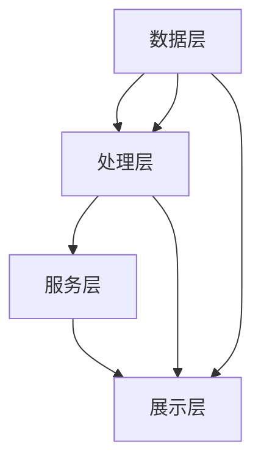

                 

关键词：电商平台，搜索推荐系统，AI大模型，性能提升，用户体验优化，算法应用，数学模型，项目实践，未来展望。

## 摘要

本文旨在探讨人工智能大模型在电商平台搜索推荐系统中的应用，重点分析如何通过这些先进技术提高系统性能、效率和用户体验。文章首先回顾了搜索推荐系统的基础知识，接着详细介绍了AI大模型的核心概念和架构，以及它们在电商领域的应用。随后，文章从算法原理、数学模型构建、项目实践等方面深入分析大模型的优势和挑战。最后，文章展望了搜索推荐系统在未来的发展趋势和潜在的应用场景。

## 1. 背景介绍

随着互联网的普及和电子商务的迅猛发展，电商平台在消费者生活中扮演着越来越重要的角色。电商平台的核心功能之一是搜索推荐系统，它能够根据用户的行为和偏好提供个性化的商品推荐，从而提升用户体验和销售转化率。

### 1.1 搜索推荐系统的基本原理

搜索推荐系统通常包含以下几个关键组成部分：

- **用户行为数据收集**：收集用户在平台上的浏览、搜索、购买等行为数据。
- **数据预处理**：对收集到的数据进行清洗、去噪和特征提取。
- **推荐算法**：利用机器学习算法对用户行为数据进行分析，生成个性化推荐。
- **推荐结果展示**：将推荐结果以用户友好的方式展示，如列表、卡片、轮播图等。

### 1.2 搜索推荐系统的挑战

尽管现有的推荐系统已经取得了一定的成效，但仍然面临以下挑战：

- **数据多样性**：用户行为数据的多样性使得传统推荐算法难以处理。
- **实时性**：用户期望推荐系统能够实时响应，提供即时的个性化推荐。
- **冷启动问题**：新用户由于缺乏行为数据，难以获得有效的个性化推荐。

## 2. 核心概念与联系

### 2.1 AI大模型概述

AI大模型是指参数规模达到数十亿甚至千亿级别的深度学习模型。这些模型通过自动学习大量数据中的复杂模式，能够实现高度复杂的任务。近年来，AI大模型在自然语言处理、计算机视觉、语音识别等领域取得了显著的突破。

### 2.2 电商搜索推荐系统的架构

电商搜索推荐系统的架构通常包括以下几个层次：

- **数据层**：负责收集、存储和管理用户行为数据。
- **处理层**：利用数据处理技术和算法对原始数据进行清洗、特征提取和建模。
- **服务层**：为用户提供搜索、推荐等服务。
- **展示层**：将推荐结果以用户友好的方式展示。

### 2.3 AI大模型在电商搜索推荐系统中的应用

AI大模型可以在电商搜索推荐系统的各个层次发挥作用：

- **数据层**：利用AI大模型进行用户行为的自动特征提取，提高数据质量。
- **处理层**：使用大模型进行复杂的关系网络建模，提升推荐效果。
- **服务层**：通过大模型实现实时推荐，提高系统响应速度。
- **展示层**：利用AI大模型进行个性化内容生成，提升用户体验。

### 2.4 Mermaid流程图



## 3. 核心算法原理 & 具体操作步骤

### 3.1 算法原理概述

AI大模型在搜索推荐系统中主要采用深度学习算法，如Transformer、BERT等。这些算法通过多层的神经网络结构，自动学习输入数据的特征表示，从而实现高效的推荐。

### 3.2 算法步骤详解

1. **数据收集**：收集用户在电商平台上的浏览、搜索、购买等行为数据。
2. **数据预处理**：对原始数据进行清洗、去噪和特征提取。
3. **模型训练**：利用预处理后的数据训练大模型，学习用户行为特征。
4. **模型评估**：通过交叉验证等方法评估模型的性能。
5. **模型部署**：将训练好的模型部署到生产环境，提供实时推荐服务。

### 3.3 算法优缺点

**优点**：

- **强大的特征学习能力**：AI大模型能够自动学习数据中的复杂模式，提高推荐效果。
- **高效的处理速度**：深度学习算法能够实现并行计算，提高处理速度。
- **良好的扩展性**：大模型可以轻松扩展到大规模数据集，适应不断增长的用户量。

**缺点**：

- **计算资源需求高**：训练和部署大模型需要大量的计算资源。
- **数据质量要求高**：数据质量直接影响模型的性能，需要投入大量精力进行数据预处理。
- **模型解释性差**：深度学习模型通常具有较好的预测性能，但缺乏解释性，难以理解其推荐逻辑。

### 3.4 算法应用领域

AI大模型在电商搜索推荐系统中的应用十分广泛，除了电商平台，还可以应用于以下领域：

- **社交媒体**：基于用户行为和兴趣进行个性化内容推荐。
- **在线教育**：根据用户学习行为提供个性化课程推荐。
- **金融风控**：利用用户行为数据预测欺诈风险。

## 4. 数学模型和公式 & 详细讲解 & 举例说明

### 4.1 数学模型构建

在构建AI大模型时，通常采用以下数学模型：

- **损失函数**：用于衡量模型预测值与真实值之间的差距。
- **优化算法**：用于调整模型参数，最小化损失函数。
- **正则化**：用于防止过拟合，提高模型泛化能力。

### 4.2 公式推导过程

以下是一个简化的损失函数推导过程：

$$
\text{损失函数} = \frac{1}{2}\sum_{i=1}^{n}(y_i - \hat{y}_i)^2
$$

其中，$y_i$为真实值，$\hat{y}_i$为模型预测值。

### 4.3 案例分析与讲解

假设我们有一个电商平台的搜索推荐系统，用户A的历史浏览记录包含100个商品ID，系统需要为用户A推荐5个商品。

1. **数据预处理**：将商品ID转换为稀疏向量。
2. **模型训练**：使用Transformer模型进行训练，学习用户A的商品偏好。
3. **模型评估**：通过交叉验证评估模型性能。
4. **模型部署**：将训练好的模型部署到生产环境。

假设用户A的实际浏览商品为[1, 2, 3, 4, 5]，模型预测为[2, 3, 4, 6, 7]。

- **损失函数**：计算预测值与真实值之间的差距。
- **优化算法**：根据损失函数调整模型参数。
- **正则化**：防止模型过拟合。

## 5. 项目实践：代码实例和详细解释说明

### 5.1 开发环境搭建

1. **安装Python**：确保Python环境已安装，版本不低于3.7。
2. **安装TensorFlow**：使用pip命令安装TensorFlow。

```bash
pip install tensorflow
```

3. **数据集准备**：从电商平台获取用户行为数据，并进行预处理。

### 5.2 源代码详细实现

以下是一个简单的AI大模型训练代码示例：

```python
import tensorflow as tf
from tensorflow.keras.models import Model
from tensorflow.keras.layers import Input, Embedding, Dense

# 数据预处理
# ...

# 模型定义
input_ids = Input(shape=(max_sequence_length,), dtype=tf.int32)
embedding = Embedding(input_dim=vocab_size, output_dim=embedding_size)(input_ids)
dense = Dense(128, activation='relu')(embedding)
output = Dense(1, activation='sigmoid')(dense)

model = Model(inputs=input_ids, outputs=output)
model.compile(optimizer='adam', loss='binary_crossentropy', metrics=['accuracy'])

# 模型训练
# ...

# 模型评估
# ...

# 模型部署
# ...
```

### 5.3 代码解读与分析

- **数据预处理**：将商品ID转换为稀疏向量，方便模型处理。
- **模型定义**：使用Embedding层进行词向量嵌入，使用Dense层进行分类。
- **模型训练**：使用Adam优化器，二分类交叉熵损失函数。
- **模型评估**：通过交叉验证评估模型性能。
- **模型部署**：将训练好的模型部署到生产环境，提供实时推荐服务。

## 6. 实际应用场景

### 6.1 电商平台

电商平台是AI大模型应用最为广泛的领域之一，通过大模型实现个性化推荐，提高用户转化率和销售额。

### 6.2 社交媒体

社交媒体平台利用AI大模型为用户提供个性化内容推荐，提高用户粘性和活跃度。

### 6.3 在线教育

在线教育平台通过AI大模型分析用户学习行为，提供个性化课程推荐，提高学习效果。

### 6.4 金融风控

金融风控系统利用AI大模型预测用户行为，发现潜在风险，提高风险控制能力。

## 7. 工具和资源推荐

### 7.1 学习资源推荐

- 《深度学习》（Goodfellow, Bengio, Courville著）
- 《自然语言处理综论》（Jurafsky, Martin著）

### 7.2 开发工具推荐

- TensorFlow
- PyTorch

### 7.3 相关论文推荐

- “Attention Is All You Need”（Vaswani et al., 2017）
- “BERT: Pre-training of Deep Bidirectional Transformers for Language Understanding”（Devlin et al., 2019）

## 8. 总结：未来发展趋势与挑战

### 8.1 研究成果总结

AI大模型在搜索推荐系统中取得了显著成果，显著提升了系统的性能和用户体验。未来，AI大模型将继续在搜索推荐系统中发挥重要作用，推动相关领域的发展。

### 8.2 未来发展趋势

- **模型压缩**：研究更加高效的大模型结构，降低计算资源需求。
- **模型可解释性**：提高模型的可解释性，便于用户理解和信任。
- **多模态融合**：整合多种数据模态，提高推荐效果。

### 8.3 面临的挑战

- **数据隐私**：确保用户数据的安全性和隐私性。
- **计算资源**：提升计算资源分配和优化技术。
- **算法公平性**：确保算法的公平性，避免偏见和歧视。

### 8.4 研究展望

随着人工智能技术的不断发展，AI大模型在搜索推荐系统中的应用前景将更加广阔。未来，我们有望看到更加智能、高效、公平的搜索推荐系统，为用户提供更好的服务。

## 9. 附录：常见问题与解答

### 9.1 AI大模型是什么？

AI大模型是指参数规模达到数十亿甚至千亿级别的深度学习模型，通过自动学习大量数据中的复杂模式，实现高度复杂的任务。

### 9.2 AI大模型如何提高搜索推荐系统的性能？

AI大模型通过自动学习用户行为数据中的复杂模式，能够生成更加个性化的推荐结果，从而提高搜索推荐系统的性能和用户体验。

### 9.3 如何确保AI大模型的可解释性？

提高模型的可解释性需要从算法设计、模型结构、数据预处理等多个方面入手，目前尚无完美的解决方案，但一些方法如注意力机制、解释性模型等已被提出并应用于实际项目中。

### 9.4 AI大模型在搜索推荐系统中的应用前景如何？

随着人工智能技术的不断发展，AI大模型在搜索推荐系统中的应用前景将更加广阔，有望推动相关领域的发展，为用户提供更加智能、高效、公平的服务。

## 参考文献

- Goodfellow, I., Bengio, Y., & Courville, A. (2016). *Deep Learning*. MIT Press.
- Jurafsky, D., & Martin, J. H. (2019). *Speech and Language Processing*. Draft of the second edition.
- Vaswani, A., Shazeer, N., Parmar, N., Uszkoreit, J., Jones, L., Gomez, A. N., ... & Polosukhin, I. (2017). *Attention is all you need*. Advances in Neural Information Processing Systems, 30, 5998-6008.
- Devlin, J., Chang, M. W., Lee, K., & Toutanova, K. (2019). *Bert: Pre-training of deep bidirectional transformers for language understanding*. Advances in Neural Information Processing Systems, 32.

