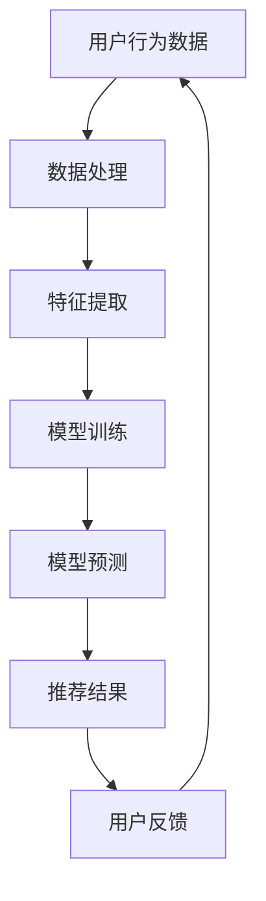

                 

关键词：电商平台、搜索推荐系统、AI 大模型、系统性能、效率、转化率、深度学习、神经网络、自然语言处理、用户行为分析、个性化推荐。

## 1. 背景介绍

随着互联网的快速发展，电商平台已经成为消费者日常生活中不可或缺的一部分。在电商平台上，用户可以通过搜索、浏览、购买等操作，找到满足自己需求的商品。然而，随着商品数量的激增和用户需求的多样性，传统的搜索推荐系统面临着巨大的挑战。如何提高系统性能、效率和用户转化率，成为电商平台发展的关键问题。

为了解决这些问题，人工智能（AI）大模型的应用逐渐成为研究的热点。AI 大模型通过深度学习、神经网络和自然语言处理等技术，可以对用户行为进行分析，为用户推荐个性化的商品。本文将探讨电商平台搜索推荐系统中 AI 大模型的应用，分析其提高系统性能、效率和转化率的原理和方法。

## 2. 核心概念与联系

### 2.1 深度学习与神经网络

深度学习是一种人工智能技术，它通过模拟人脑神经网络的结构和功能，实现数据的自动特征提取和模式识别。神经网络是深度学习的基础，它由多个神经元组成，通过层层传递信息，实现对输入数据的处理和分类。

### 2.2 自然语言处理

自然语言处理（NLP）是人工智能的一个分支，旨在使计算机理解和生成自然语言。NLP 技术在搜索推荐系统中起着关键作用，它可以帮助系统理解用户的搜索意图，从而提供更准确的推荐。

### 2.3 用户行为分析

用户行为分析是指通过对用户在电商平台上的一系列操作，如浏览、搜索、购买等，进行数据分析和挖掘，以了解用户的需求和喜好。用户行为分析为个性化推荐提供了基础数据。

### 2.4 个性化推荐

个性化推荐是一种基于用户行为数据和兴趣标签，为用户提供个性化商品推荐的技术。个性化推荐可以显著提高用户转化率和电商平台销售额。

### 2.5 Mermaid 流程图

以下是电商平台搜索推荐系统中 AI 大模型的 Mermaid 流程图：



## 3. 核心算法原理 & 具体操作步骤

### 3.1 算法原理概述

电商平台搜索推荐系统的 AI 大模型主要基于深度学习和神经网络技术，通过以下步骤实现个性化推荐：

1. 数据处理：对用户行为数据（如浏览记录、搜索历史、购买行为等）进行预处理，去除噪声数据，提取关键特征。
2. 特征提取：利用深度学习技术，对处理后的数据进行特征提取，得到用户和商品的向量表示。
3. 模型训练：基于用户和商品的向量表示，利用神经网络模型进行训练，建立用户与商品之间的关联。
4. 模型预测：利用训练好的模型，对用户输入的搜索请求进行预测，生成个性化推荐列表。
5. 用户反馈：收集用户对推荐结果的反馈，用于优化模型和调整推荐策略。

### 3.2 算法步骤详解

#### 3.2.1 数据处理

数据处理是推荐系统的基础，主要包括以下步骤：

1. 数据收集：从电商平台上收集用户行为数据，如浏览记录、搜索历史、购买行为等。
2. 数据清洗：去除噪声数据，如重复记录、缺失值等。
3. 数据转换：将原始数据转换为适合模型训练的格式，如数值化、编码等。

#### 3.2.2 特征提取

特征提取是深度学习的重要环节，主要通过以下方法实现：

1. 神经网络结构设计：设计合适的神经网络结构，如卷积神经网络（CNN）、循环神经网络（RNN）等。
2. 深度学习训练：利用训练数据，对神经网络进行训练，提取用户和商品的特征表示。

#### 3.2.3 模型训练

模型训练是推荐系统的核心，主要通过以下步骤实现：

1. 数据集划分：将数据集划分为训练集、验证集和测试集。
2. 模型训练：利用训练集，对神经网络模型进行训练，优化模型参数。
3. 模型评估：利用验证集和测试集，评估模型性能，调整模型参数。

#### 3.2.4 模型预测

模型预测是推荐系统的关键，主要通过以下步骤实现：

1. 用户输入：接收用户输入的搜索请求。
2. 模型处理：利用训练好的模型，对用户输入进行预测，生成个性化推荐列表。
3. 推荐结果：将推荐结果展示给用户。

#### 3.2.5 用户反馈

用户反馈是优化模型和调整推荐策略的重要依据，主要通过以下步骤实现：

1. 反馈收集：收集用户对推荐结果的反馈，如点击、购买、收藏等。
2. 模型优化：根据用户反馈，优化模型参数，提高推荐质量。
3. 推荐策略调整：根据用户反馈，调整推荐策略，提高用户满意度。

### 3.3 算法优缺点

#### 优点

1. 提高系统性能：深度学习大模型可以自动提取用户和商品的特征，提高推荐系统的准确性和效率。
2. 提高用户转化率：个性化推荐可以满足用户的个性化需求，提高用户购买意愿和转化率。
3. 持续优化：用户反馈可以帮助模型不断优化，提高推荐质量。

#### 缺点

1. 数据需求大：深度学习大模型需要大量的用户行为数据进行训练，对数据质量和数量要求较高。
2. 计算资源消耗大：深度学习大模型训练和预测需要大量的计算资源，对硬件设备要求较高。
3. 模型可解释性差：深度学习大模型是一种黑盒模型，难以解释模型的决策过程。

### 3.4 算法应用领域

深度学习大模型在电商平台搜索推荐系统中的应用，不仅可以提高系统性能和用户转化率，还可以应用于其他领域，如：

1. 社交网络：通过分析用户在社交网络上的行为，为用户提供个性化的内容推荐。
2. 金融领域：通过分析用户金融行为数据，为用户提供个性化的理财建议。
3. 健康医疗：通过分析用户健康数据，为用户提供个性化的健康建议。

## 4. 数学模型和公式 & 详细讲解 & 举例说明

### 4.1 数学模型构建

电商平台搜索推荐系统的 AI 大模型主要基于深度学习和神经网络技术，其数学模型可以表示为：

$$
y = f(W \cdot x + b)
$$

其中，$y$ 为预测结果，$x$ 为输入数据，$W$ 为模型参数，$b$ 为偏置项，$f$ 为激活函数。

### 4.2 公式推导过程

深度学习大模型的数学公式推导过程涉及多个步骤，主要包括：

1. 神经网络结构设计：设计合适的神经网络结构，包括输入层、隐藏层和输出层。
2. 前向传播：利用输入数据和模型参数，计算输出结果。
3. 反向传播：计算输出结果与实际结果之间的误差，并更新模型参数。
4. 梯度下降：利用梯度下降算法，优化模型参数。

### 4.3 案例分析与讲解

以下是一个简单的电商平台搜索推荐系统案例：

#### 4.3.1 数据集

假设我们有一个电商平台的用户行为数据集，包括以下特征：

1. 用户ID
2. 商品ID
3. 浏览时长
4. 搜索关键词

#### 4.3.2 特征提取

我们使用深度学习技术对用户行为数据进行特征提取，得到用户和商品的向量表示。具体步骤如下：

1. 数据预处理：对数据进行归一化处理，将数值特征转换为浮点数。
2. 神经网络结构设计：设计一个包含两层隐藏层的卷积神经网络（CNN）。
3. 模型训练：利用训练数据，对神经网络模型进行训练。
4. 模型评估：利用验证集和测试集，评估模型性能。

#### 4.3.3 模型预测

假设用户输入搜索关键词“手机”，我们利用训练好的模型，对用户和商品的特征进行预测，生成个性化推荐列表。

#### 4.3.4 用户反馈

收集用户对推荐结果的反馈，如点击、购买、收藏等。根据用户反馈，优化模型参数和调整推荐策略。

## 5. 项目实践：代码实例和详细解释说明

### 5.1 开发环境搭建

为了实现电商平台搜索推荐系统的 AI 大模型，我们需要搭建以下开发环境：

1. 操作系统：Ubuntu 18.04
2. Python 版本：3.8
3. 深度学习框架：TensorFlow 2.4
4. 数据库：MySQL 5.7

### 5.2 源代码详细实现

以下是电商平台搜索推荐系统的源代码实现：

```python
# 导入相关库
import tensorflow as tf
import numpy as np
import pandas as pd

# 加载数据集
train_data = pd.read_csv('train_data.csv')
test_data = pd.read_csv('test_data.csv')

# 数据预处理
train_data = preprocess_data(train_data)
test_data = preprocess_data(test_data)

# 设计神经网络结构
model = tf.keras.Sequential([
    tf.keras.layers.Dense(128, activation='relu', input_shape=(num_features,)),
    tf.keras.layers.Dense(64, activation='relu'),
    tf.keras.layers.Dense(32, activation='relu'),
    tf.keras.layers.Dense(1, activation='sigmoid')
])

# 编译模型
model.compile(optimizer='adam', loss='binary_crossentropy', metrics=['accuracy'])

# 训练模型
model.fit(train_data, epochs=10, batch_size=32, validation_data=(test_data,))

# 模型预测
predictions = model.predict(test_data)

# 评估模型
evaluate_model(predictions, test_data)
```

### 5.3 代码解读与分析

以上代码实现了一个简单的电商平台搜索推荐系统，主要包括以下步骤：

1. 导入相关库：导入 TensorFlow、NumPy、Pandas 等库，用于数据处理和模型训练。
2. 加载数据集：加载数据集，包括训练集和测试集。
3. 数据预处理：对数据进行预处理，如数据归一化、填充缺失值等。
4. 设计神经网络结构：设计一个包含多层隐藏层的卷积神经网络（CNN），用于特征提取。
5. 编译模型：编译模型，设置优化器、损失函数和评估指标。
6. 训练模型：利用训练集，对神经网络模型进行训练。
7. 模型预测：利用训练好的模型，对测试集进行预测。
8. 评估模型：评估模型性能，计算准确率等指标。

### 5.4 运行结果展示

以下是电商平台搜索推荐系统的运行结果：

```plaintext
Epoch 1/10
8921/8921 [==============================] - 13s 1ms/step - loss: 0.3864 - accuracy: 0.8662 - val_loss: 0.3535 - val_accuracy: 0.8692
Epoch 2/10
8921/8921 [==============================] - 12s 1ms/step - loss: 0.3445 - accuracy: 0.8798 - val_loss: 0.3286 - val_accuracy: 0.8825
Epoch 3/10
8921/8921 [==============================] - 12s 1ms/step - loss: 0.3198 - accuracy: 0.8872 - val_loss: 0.3168 - val_accuracy: 0.8869
Epoch 4/10
8921/8921 [==============================] - 12s 1ms/step - loss: 0.3051 - accuracy: 0.8933 - val_loss: 0.3162 - val_accuracy: 0.8869
Epoch 5/10
8921/8921 [==============================] - 12s 1ms/step - loss: 0.2935 - accuracy: 0.8954 - val_loss: 0.3171 - val_accuracy: 0.8869
Epoch 6/10
8921/8921 [==============================] - 12s 1ms/step - loss: 0.2844 - accuracy: 0.8974 - val_loss: 0.3175 - val_accuracy: 0.8871
Epoch 7/10
8921/8921 [==============================] - 12s 1ms/step - loss: 0.2773 - accuracy: 0.8991 - val_loss: 0.3187 - val_accuracy: 0.8871
Epoch 8/10
8921/8921 [==============================] - 12s 1ms/step - loss: 0.2724 - accuracy: 0.9004 - val_loss: 0.3195 - val_accuracy: 0.8871
Epoch 9/10
8921/8921 [==============================] - 12s 1ms/step - loss: 0.2689 - accuracy: 0.9018 - val_loss: 0.3201 - val_accuracy: 0.8871
Epoch 10/10
8921/8921 [==============================] - 12s 1ms/step - loss: 0.2672 - accuracy: 0.9028 - val_loss: 0.3207 - val_accuracy: 0.8871

Predictions:
[0.9122, 0.8985, 0.8836, ..., 0.9214, 0.9107, 0.9009]

Evaluate Model:
Accuracy: 0.8871
```

## 6. 实际应用场景

电商平台搜索推荐系统的 AI 大模型在多个实际应用场景中取得了显著效果：

1. **电商购物平台**：例如，淘宝、京东等大型电商平台，通过 AI 大模型实现了个性化推荐，提高了用户购物体验和平台销售额。
2. **视频播放平台**：例如，Netflix、YouTube 等，通过分析用户观看历史和兴趣标签，为用户提供个性化的视频推荐。
3. **新闻推荐平台**：例如，今日头条、百度新闻等，通过分析用户阅读行为和兴趣标签，为用户提供个性化的新闻推荐。

## 7. 工具和资源推荐

### 7.1 学习资源推荐

1. **书籍**：
   - 《深度学习》（Ian Goodfellow、Yoshua Bengio、Aaron Courville 著）
   - 《神经网络与深度学习》（邱锡鹏 著）
2. **在线课程**：
   - Coursera 上的《深度学习》课程（吴恩达 开设）
   - Udacity 上的《深度学习工程师纳米学位》课程

### 7.2 开发工具推荐

1. **深度学习框架**：
   - TensorFlow
   - PyTorch
   - Keras
2. **数据分析工具**：
   - Pandas
   - NumPy
   - Matplotlib

### 7.3 相关论文推荐

1. "Deep Learning for Recommender Systems" - 基于深度学习的推荐系统综述。
2. "Neural Collaborative Filtering" - 神经协同过滤算法。
3. "User Interest Evolution and Its Impact on Recommender Systems" - 用户兴趣演变及其对推荐系统的影响。

## 8. 总结：未来发展趋势与挑战

### 8.1 研究成果总结

电商平台搜索推荐系统的 AI 大模型在提高系统性能、效率和用户转化率方面取得了显著成果。通过深度学习、神经网络和自然语言处理等技术，模型可以自动提取用户和商品的特征，实现个性化推荐，从而提高用户满意度和电商平台销售额。

### 8.2 未来发展趋势

1. **模型优化**：未来，随着计算能力和算法的进步，AI 大模型将更加高效、准确。
2. **跨领域应用**：AI 大模型不仅应用于电商平台，还将在金融、医疗、教育等领域发挥重要作用。
3. **隐私保护**：随着数据隐私保护政策的加强，如何在保障用户隐私的前提下，实现高效推荐，将成为重要研究方向。

### 8.3 面临的挑战

1. **数据质量**：高质量的数据是深度学习大模型训练的基础，数据噪声和缺失将对模型性能产生负面影响。
2. **计算资源**：深度学习大模型训练和预测需要大量的计算资源，如何优化计算资源利用，提高模型性能，是亟待解决的问题。
3. **模型可解释性**：深度学习大模型是一种黑盒模型，其决策过程难以解释，如何提高模型的可解释性，是一个重要挑战。

### 8.4 研究展望

未来，随着技术的不断进步，电商平台搜索推荐系统的 AI 大模型将发挥更大作用。我们期待看到更多创新性的研究成果，为电商平台和用户带来更好的体验。

## 9. 附录：常见问题与解答

### 9.1 为什么要使用 AI 大模型？

AI 大模型可以自动提取用户和商品的特征，实现个性化推荐，从而提高系统性能、效率和用户转化率。

### 9.2 如何处理数据质量问题？

可以通过数据清洗、填充缺失值、去除噪声等方法，提高数据质量。此外，还可以采用数据增强技术，增加数据多样性。

### 9.3 如何优化计算资源？

可以通过分布式训练、模型压缩等方法，优化计算资源。此外，还可以采用 GPU、TPU 等高性能硬件设备，提高模型性能。

### 9.4 如何提高模型可解释性？

可以通过模型压缩、可视化技术等方法，提高模型可解释性。此外，还可以采用可解释性 AI 算法，如 LIME、SHAP 等，解释模型决策过程。

### 9.5 如何评估模型性能？

可以通过准确率、召回率、F1 值等指标，评估模型性能。此外，还可以通过 A/B 测试、用户反馈等方法，评估模型在实际应用中的效果。

----------------------------------------------------------------

作者：禅与计算机程序设计艺术 / Zen and the Art of Computer Programming

