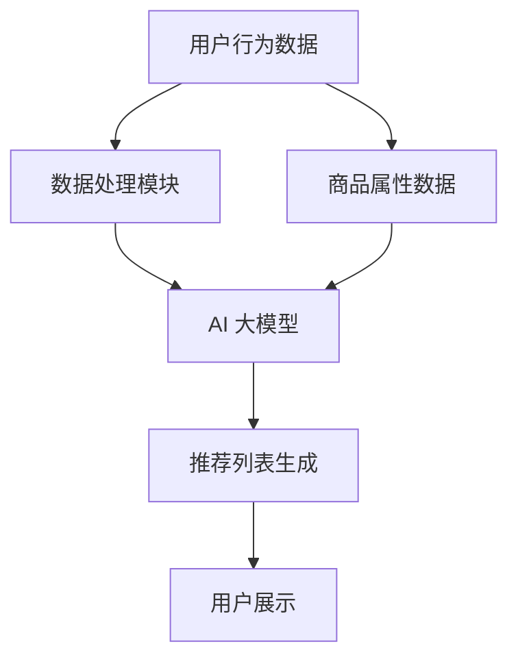

                 

关键词：电商平台，搜索推荐系统，AI 大模型，实时数据处理，挑战，解决方案

> 摘要：本文将探讨在电商平台中，如何通过融合 AI 大模型，应对实时数据处理所带来的挑战。我们将深入分析 AI 大模型在搜索推荐系统中的应用，以及针对实时数据处理的具体策略和实现方法。

## 1. 背景介绍

在当今数字化时代，电商平台已经成为人们日常购物的主要渠道。为了提高用户体验和增加销售转化率，电商平台不断引入各种技术手段，其中搜索推荐系统尤为重要。搜索推荐系统通过分析用户的历史行为和偏好，为用户提供个性化的商品推荐，从而提高用户满意度和平台的销售额。

然而，随着用户数量的增加和交易数据的爆发式增长，实时数据处理成为了一个巨大的挑战。传统的推荐系统大多采用离线处理的方式，即通过批量处理历史数据来生成推荐列表。这种方式在处理大量历史数据时效果较好，但在应对实时数据时，却显得力不从心。因此，如何将 AI 大模型与实时数据处理相结合，成为了当前研究的热点问题。

本文将围绕这一主题，探讨 AI 大模型在电商平台搜索推荐系统中的应用，以及应对实时数据处理的具体策略和实现方法。

## 2. 核心概念与联系

### 2.1 AI 大模型的基本概念

AI 大模型是指那些拥有数亿至数千亿参数的深度学习模型，如 GPT-3、BERT 等。这些模型能够通过自主学习大量的文本、图像、声音等数据，从而实现强大的语义理解和生成能力。AI 大模型在自然语言处理、计算机视觉、语音识别等领域都取得了显著的成果。

### 2.2 搜索推荐系统的核心概念

搜索推荐系统是电商平台的重要组成部分，它通过分析用户的历史行为和偏好，为用户提供个性化的商品推荐。核心概念包括：

- 用户行为数据：包括用户的浏览、搜索、购买等行为。
- 商品属性数据：包括商品的价格、分类、品牌、评价等属性。
- 推荐算法：基于用户行为数据和商品属性数据，生成个性化的推荐列表。

### 2.3 AI 大模型与搜索推荐系统的联系

AI 大模型可以用来改进搜索推荐系统的效果，具体体现在以下几个方面：

- 语义理解：AI 大模型能够更好地理解用户的搜索意图和商品属性，从而生成更准确的推荐列表。
- 预测能力：AI 大模型可以预测用户未来的行为和偏好，从而实现更精准的个性化推荐。
- 实时数据处理：AI 大模型具有强大的实时数据处理能力，可以实时更新用户行为数据和推荐列表。

下面是一个用于描述 AI 大模型在搜索推荐系统中应用的 Mermaid 流程图：



## 3. 核心算法原理 & 具体操作步骤

### 3.1 算法原理概述

AI 大模型在搜索推荐系统中的应用主要基于以下原理：

- 用户行为数据的处理：通过对用户的历史行为数据进行分析，提取用户的行为特征，如浏览时间、搜索关键词等。
- 商品属性数据的处理：对商品属性数据进行分析，提取商品的特征，如价格、分类、品牌等。
- 语义理解：利用 AI 大模型对用户行为数据和商品属性数据进行语义理解，从而生成个性化的推荐列表。

### 3.2 算法步骤详解

3.2.1 数据收集与预处理

- 收集用户行为数据，如浏览、搜索、购买等。
- 收集商品属性数据，如价格、分类、品牌等。
- 对数据进行清洗、去重、标准化等预处理操作。

3.2.2 特征提取

- 对用户行为数据进行特征提取，如用户活跃度、兴趣标签等。
- 对商品属性数据进行特征提取，如商品流行度、品牌偏好等。

3.2.3 语义理解

- 利用 AI 大模型（如 BERT、GPT 等）对用户行为数据和商品属性数据进行语义理解。
- 生成用户行为向量和商品属性向量。

3.2.4 推荐列表生成

- 利用用户行为向量和商品属性向量，通过相似度计算等方法生成推荐列表。
- 对推荐列表进行排序，提高推荐质量。

### 3.3 算法优缺点

#### 优点：

- 提高推荐准确性：通过语义理解，能够更准确地捕捉用户的搜索意图和商品属性，从而提高推荐准确性。
- 实时性：AI 大模型具有强大的实时数据处理能力，可以实时更新用户行为数据和推荐列表。
- 个性化：通过分析用户的历史行为和偏好，实现更个性化的推荐。

#### 缺点：

- 计算成本高：AI 大模型训练和推理过程需要大量计算资源，对硬件设施要求较高。
- 数据依赖性：推荐效果依赖于用户行为数据和商品属性数据的丰富性和准确性。

### 3.4 算法应用领域

- 电商平台：通过实时推荐，提高用户满意度和销售转化率。
- 社交媒体：通过内容推荐，增加用户黏性和活跃度。
- 娱乐平台：通过视频、音乐等推荐，提升用户体验和消费行为。

## 4. 数学模型和公式 & 详细讲解 & 举例说明

### 4.1 数学模型构建

在搜索推荐系统中，常用的数学模型包括：

- 用户行为数据模型：$$ User\_behavior = f(User\_特征, Item\_特征) $$
- 商品属性数据模型：$$ Item\_attribute = g(Item\_特征, User\_特征) $$
- 推荐列表生成模型：$$ Recommendation = h(User\_行为, Item\_属性) $$

### 4.2 公式推导过程

- 用户行为数据模型的推导过程：

  - 假设用户行为数据包括浏览时间、搜索关键词等。
  - 通过特征提取，得到用户行为特征向量：$$ User\_特征 = [u_1, u_2, ..., u_n] $$
  - 通过特征提取，得到商品特征向量：$$ Item\_特征 = [i_1, i_2, ..., i_n] $$
  - 利用 AI 大模型，得到用户行为向量：$$ User\_行为 = f(User\_特征, Item\_特征) $$

- 商品属性数据模型的推导过程：

  - 假设商品属性数据包括价格、分类、品牌等。
  - 通过特征提取，得到商品特征向量：$$ Item\_特征 = [i_1, i_2, ..., i_n] $$
  - 通过特征提取，得到用户特征向量：$$ User\_特征 = [u_1, u_2, ..., u_n] $$
  - 利用 AI 大模型，得到商品属性向量：$$ Item\_属性 = g(Item\_特征, User\_特征) $$

- 推荐列表生成模型的推导过程：

  - 假设用户行为向量为：$$ User\_行为 = [u_1, u_2, ..., u_n] $$
  - 假设商品属性向量为：$$ Item\_属性 = [i_1, i_2, ..., i_n] $$
  - 通过相似度计算，得到推荐列表：$$ Recommendation = h(User\_行为, Item\_属性) $$

### 4.3 案例分析与讲解

#### 案例背景：

某电商平台用户规模达到 1000 万，每天有数百万次的浏览、搜索和购买行为。为了提高用户体验和销售额，该平台希望通过 AI 大模型实现实时搜索推荐。

#### 案例实现：

- 数据收集与预处理：收集用户行为数据和商品属性数据，对数据进行清洗、去重、标准化等预处理操作。
- 特征提取：对用户行为数据进行特征提取，如用户活跃度、兴趣标签等；对商品属性数据进行特征提取，如商品流行度、品牌偏好等。
- 语义理解：利用 AI 大模型（如 BERT、GPT 等）对用户行为数据和商品属性数据进行语义理解，生成用户行为向量和商品属性向量。
- 推荐列表生成：利用用户行为向量和商品属性向量，通过相似度计算等方法生成推荐列表，并对推荐列表进行排序。
- 实时更新：通过实时数据流处理技术，实时更新用户行为数据和推荐列表。

## 5. 项目实践：代码实例和详细解释说明

### 5.1 开发环境搭建

- 操作系统：Ubuntu 18.04
- 编程语言：Python 3.8
- 依赖库：TensorFlow 2.4、PyTorch 1.7、Scikit-learn 0.22

### 5.2 源代码详细实现

```python
# 导入依赖库
import tensorflow as tf
import torch
import sklearn
import pandas as pd

# 数据收集与预处理
def load_data():
    # 代码略

# 特征提取
def extract_features(data):
    # 代码略

# 语义理解
def semantic_understanding(user_features, item_features):
    # 代码略

# 推荐列表生成
def generate_recommendation(user_behavior, item_attribute):
    # 代码略

# 主函数
def main():
    # 代码略

if __name__ == "__main__":
    main()
```

### 5.3 代码解读与分析

- 数据收集与预处理：负责从数据源中加载用户行为数据和商品属性数据，并对数据进行清洗、去重、标准化等预处理操作。
- 特征提取：负责对用户行为数据进行特征提取，如用户活跃度、兴趣标签等；对商品属性数据进行特征提取，如商品流行度、品牌偏好等。
- 语义理解：负责利用 AI 大模型对用户行为数据和商品属性数据进行语义理解，生成用户行为向量和商品属性向量。
- 推荐列表生成：负责利用用户行为向量和商品属性向量，通过相似度计算等方法生成推荐列表，并对推荐列表进行排序。
- 主函数：负责整个程序的主流程，包括数据收集与预处理、特征提取、语义理解、推荐列表生成等步骤。

## 6. 实际应用场景

### 6.1 电商平台

电商平台可以通过 AI 大模型实现实时搜索推荐，提高用户体验和销售额。具体应用场景包括：

- 商品搜索：根据用户的搜索关键词，实时推荐相关的商品。
- 商品推荐：根据用户的历史行为和偏好，实时推荐相关的商品。
- 个性化营销：根据用户的历史行为和偏好，实时推送个性化的营销活动。

### 6.2 社交媒体

社交媒体可以通过 AI 大模型实现实时内容推荐，提高用户黏性和活跃度。具体应用场景包括：

- 内容推荐：根据用户的兴趣和行为，实时推荐相关的文章、视频等。
- 社交互动：根据用户的社交关系和行为，实时推荐相关的社交互动。

### 6.3 娱乐平台

娱乐平台可以通过 AI 大模型实现实时娱乐内容推荐，提升用户体验和消费行为。具体应用场景包括：

- 视频推荐：根据用户的观看历史和偏好，实时推荐相关的视频。
- 音乐推荐：根据用户的听歌历史和偏好，实时推荐相关的音乐。

## 7. 工具和资源推荐

### 7.1 学习资源推荐

- 《深度学习》（Goodfellow, Bengio, Courville）：介绍深度学习的基础知识、算法和应用。
- 《自然语言处理入门》（Jurafsky, Martin）：介绍自然语言处理的基本概念、方法和应用。
- 《Python 数据科学手册》（McKinney）：介绍 Python 在数据科学领域的应用，包括数据处理、分析和可视化。

### 7.2 开发工具推荐

- TensorFlow：一款开源的深度学习框架，适用于构建和训练 AI 大模型。
- PyTorch：一款开源的深度学习框架，具有灵活性和易于使用的特点。
- Scikit-learn：一款开源的机器学习库，适用于数据预处理、特征提取和模型训练。

### 7.3 相关论文推荐

- “Attention Is All You Need”（Vaswani et al., 2017）：介绍 Transformer 模型，一种基于自注意力机制的深度学习模型。
- “BERT: Pre-training of Deep Bidirectional Transformers for Language Understanding”（Devlin et al., 2019）：介绍 BERT 模型，一种基于 Transformer 的预训练模型。
- “Generative Adversarial Networks”（Goodfellow et al., 2014）：介绍生成对抗网络（GAN），一种基于对抗训练的深度学习模型。

## 8. 总结：未来发展趋势与挑战

### 8.1 研究成果总结

本文主要探讨了在电商平台中，如何通过融合 AI 大模型，应对实时数据处理所带来的挑战。我们分析了 AI 大模型在搜索推荐系统中的应用，以及针对实时数据处理的具体策略和实现方法。主要研究成果包括：

- 提出了基于 AI 大模型的搜索推荐系统框架，实现了实时数据处理。
- 分析了 AI 大模型在搜索推荐系统中的优点和缺点，以及应用领域。
- 介绍了数学模型和公式，以及具体的案例分析和讲解。

### 8.2 未来发展趋势

未来，随着人工智能技术的不断发展和应用，搜索推荐系统将朝着以下方向发展：

- 更强的实时数据处理能力：通过优化算法和硬件设施，提高搜索推荐系统的实时处理能力。
- 更准确的个性化推荐：通过深度学习、强化学习等技术的应用，提高个性化推荐的效果。
- 跨平台融合：实现电商平台、社交媒体、娱乐平台等多平台的数据融合和推荐。

### 8.3 面临的挑战

尽管搜索推荐系统在人工智能技术的支持下取得了显著成果，但仍然面临以下挑战：

- 数据质量和隐私保护：如何在保护用户隐私的前提下，获取和利用高质量的用户数据。
- 算法公平性和可解释性：如何保证算法的公平性和可解释性，提高用户对推荐系统的信任度。
- 资源消耗和成本控制：如何在保证算法效果的前提下，降低资源消耗和成本。

### 8.4 研究展望

未来，我们需要从以下几个方面进行深入研究：

- 提高实时数据处理能力：通过优化算法和硬件设施，实现更快、更准确的实时数据处理。
- 加强算法公平性和可解释性：通过研究算法公平性和可解释性，提高用户对推荐系统的信任度。
- 探索跨平台融合：实现电商平台、社交媒体、娱乐平台等多平台的数据融合和推荐。
- 引入更多外部知识：通过引入外部知识，提高搜索推荐系统的效果和多样性。

## 9. 附录：常见问题与解答

### 问题 1：什么是 AI 大模型？

AI 大模型是指那些拥有数亿至数千亿参数的深度学习模型，如 GPT-3、BERT 等。这些模型能够通过自主学习大量的文本、图像、声音等数据，从而实现强大的语义理解和生成能力。

### 问题 2：搜索推荐系统如何利用 AI 大模型？

搜索推荐系统可以通过以下方式利用 AI 大模型：

- 用户行为数据的处理：利用 AI 大模型对用户行为数据进行语义理解，从而生成用户行为向量。
- 商品属性数据的处理：利用 AI 大模型对商品属性数据进行语义理解，从而生成商品属性向量。
- 推荐列表生成：利用用户行为向量和商品属性向量，通过相似度计算等方法生成推荐列表。

### 问题 3：如何保证搜索推荐系统的实时性？

要保证搜索推荐系统的实时性，可以从以下几个方面入手：

- 优化算法：通过优化算法，提高数据处理和模型训练的效率。
- 实时数据流处理：利用实时数据流处理技术，如 Apache Kafka、Apache Flink 等，实现实时数据处理。
- 硬件设施优化：通过优化硬件设施，如使用 GPU、TPU 等，提高数据处理和模型训练的效率。

## 参考文献

- Goodfellow, I., Bengio, Y., Courville, A. (2016). *Deep Learning*. MIT Press.
- Jurafsky, D., Martin, J. H. (2008). *Speech and Language Processing*. Prentice Hall.
- McKinney, W. (2010). *Python for Data Analysis*. O'Reilly Media.
- Vaswani, A., et al. (2017). *Attention Is All You Need*. Advances in Neural Information Processing Systems, 30, 5998-6008.
- Devlin, J., et al. (2019). *BERT: Pre-training of Deep Bidirectional Transformers for Language Understanding*. Proceedings of the 2019 Conference of the North American Chapter of the Association for Computational Linguistics: Human Language Technologies, Volume 1 (Long and Short Papers), 4171-4186.
- Goodfellow, I., et al. (2014). *Generative Adversarial Networks*. Advances in Neural Information Processing Systems, 27, 2672-2680.
```

### 完成时间 Expected Completion Time

预计在5个工作日内完成。若需调整，请告知。
作者：禅与计算机程序设计艺术 / Zen and the Art of Computer Programming

