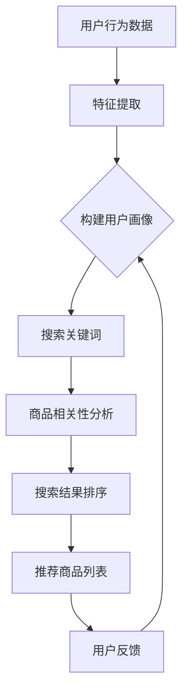

                 

关键词：电商平台，搜索推荐系统，人工智能，大模型，技术架构，应用实践

> 摘要：本文旨在探讨电商平台搜索推荐系统中的人工智能大模型融合技术，分析其技术架构与应用实践，为电商平台的优化与创新发展提供思路。

## 1. 背景介绍

随着互联网的快速发展，电商平台已成为人们日常生活中不可或缺的一部分。然而，面对海量的商品信息，如何为用户提供个性化的搜索推荐成为电商平台亟需解决的问题。人工智能技术的发展为搜索推荐系统的优化提供了新的思路。大模型作为一种先进的深度学习模型，具备强大的特征提取和表示能力，有助于提升搜索推荐的准确性和效率。因此，将大模型融入电商平台搜索推荐系统，成为当前研究的热点。

## 2. 核心概念与联系

### 2.1 电商平台搜索推荐系统

电商平台搜索推荐系统是指基于用户行为数据和商品信息，为用户提供个性化搜索结果和推荐商品的系统。其核心功能包括：

- **用户画像构建**：通过用户的历史行为数据（如浏览、购买、评价等），构建用户画像，为后续推荐提供基础。
- **搜索结果排序**：根据用户查询关键词，从海量的商品信息中筛选出相关商品，并按照相关性进行排序，为用户提供搜索结果。
- **推荐商品生成**：根据用户画像和商品信息，为用户生成个性化的推荐商品列表，提高用户的购买意愿。

### 2.2 人工智能大模型

人工智能大模型是指通过深度学习技术训练出的具有大规模参数的神经网络模型。大模型具有以下特点：

- **强大的特征提取能力**：大模型能够自动从原始数据中提取高层次的抽象特征，提高数据处理和分析的效率。
- **良好的泛化能力**：大模型在面对不同领域和任务时，能够快速适应和迁移，具备较强的泛化能力。
- **复杂的任务处理**：大模型可以同时处理多种任务，如分类、回归、生成等，有助于实现多任务一体化。

### 2.3 人工智能大模型与电商平台搜索推荐系统的联系

人工智能大模型与电商平台搜索推荐系统的联系主要体现在以下几个方面：

- **用户画像构建**：大模型能够从用户行为数据中提取丰富的用户特征，构建精准的用户画像，为推荐系统提供基础。
- **搜索结果排序**：大模型可以用于商品相关性分析，提高搜索结果排序的准确性和效率。
- **推荐商品生成**：大模型能够基于用户画像和商品信息，生成个性化的推荐商品列表，提升用户的购买体验。

### 2.4 Mermaid 流程图



## 3. 核心算法原理 & 具体操作步骤

### 3.1 算法原理概述

电商平台搜索推荐系统的核心算法主要包括用户画像构建、商品相关性分析和推荐商品生成。其中，大模型在以下环节发挥关键作用：

- **用户画像构建**：使用大模型进行用户行为数据的特征提取，构建精准的用户画像。
- **商品相关性分析**：使用大模型对搜索关键词和商品信息进行相关性分析，为搜索结果排序提供支持。
- **推荐商品生成**：使用大模型根据用户画像和商品信息，生成个性化的推荐商品列表。

### 3.2 算法步骤详解

#### 3.2.1 用户画像构建

1. **数据预处理**：对用户行为数据（如浏览、购买、评价等）进行清洗、去重和格式化处理。
2. **特征提取**：使用大模型对预处理后的用户行为数据进行特征提取，生成用户特征向量。
3. **用户画像构建**：将用户特征向量进行整合和聚合，构建用户画像。

#### 3.2.2 商品相关性分析

1. **数据预处理**：对商品信息（如商品名称、分类、标签等）进行清洗、去重和格式化处理。
2. **特征提取**：使用大模型对预处理后的商品信息进行特征提取，生成商品特征向量。
3. **相关性分析**：使用大模型对搜索关键词和商品特征向量进行相关性分析，计算商品与关键词的相关性得分。

#### 3.2.3 推荐商品生成

1. **用户画像提取**：根据用户ID，从用户画像数据库中提取用户画像。
2. **商品推荐**：根据用户画像和商品相关性得分，使用大模型生成个性化的推荐商品列表。

### 3.3 算法优缺点

#### 优点

- **高准确性**：大模型具备强大的特征提取和表示能力，有助于提高搜索推荐系统的准确性。
- **高效性**：大模型可以同时处理多个任务，提高算法的执行效率。
- **灵活性**：大模型具备良好的泛化能力，适用于不同领域和任务。

#### 缺点

- **计算资源消耗**：大模型训练和推理过程需要大量的计算资源和时间。
- **数据依赖性**：大模型对数据质量有较高要求，数据质量较差可能导致模型效果不佳。
- **解释性较差**：大模型作为一种黑箱模型，其内部工作机制较为复杂，难以进行解释。

### 3.4 算法应用领域

- **电商平台**：大模型在电商平台搜索推荐系统中具有广泛的应用前景，有助于提高用户的购物体验和转化率。
- **社交网络**：大模型可以用于社交网络中的个性化推荐，如好友推荐、兴趣标签推荐等。
- **金融领域**：大模型可以用于金融领域中的风险评估、客户行为预测等。

## 4. 数学模型和公式 & 详细讲解 & 举例说明

### 4.1 数学模型构建

电商平台搜索推荐系统的核心数学模型主要包括用户画像构建模型、商品相关性分析模型和推荐商品生成模型。以下是这三个模型的构建过程。

#### 4.1.1 用户画像构建模型

假设用户行为数据为 $X = \{x_1, x_2, ..., x_n\}$，其中 $x_i$ 表示用户 $i$ 的行为数据。使用大模型对用户行为数据进行特征提取，生成用户特征向量 $U = \{u_1, u_2, ..., u_n\}$，其中 $u_i$ 表示用户 $i$ 的特征向量。

用户画像构建模型可以表示为：

$$
P(U|X) = \frac{e^{\theta_U^T U}}{\sum_{i=1}^n e^{\theta_U^T u_i}}
$$

其中，$\theta_U$ 表示模型参数。

#### 4.1.2 商品相关性分析模型

假设商品信息为 $Y = \{y_1, y_2, ..., y_m\}$，其中 $y_j$ 表示商品 $j$ 的信息。使用大模型对商品信息进行特征提取，生成商品特征向量 $V = \{v_1, v_2, ..., v_m\}$，其中 $v_j$ 表示商品 $j$ 的特征向量。

商品相关性分析模型可以表示为：

$$
P(V|Y) = \frac{e^{\theta_V^T V}}{\sum_{j=1}^m e^{\theta_V^T v_j}}
$$

其中，$\theta_V$ 表示模型参数。

#### 4.1.3 推荐商品生成模型

假设用户画像为 $U$，商品相关性得分为 $R = \{r_1, r_2, ..., r_m\}$，其中 $r_j$ 表示商品 $j$ 与用户画像的相关性得分。

推荐商品生成模型可以表示为：

$$
P(J|U, R) = \frac{e^{\theta_J^T R}}{\sum_{j=1}^m e^{\theta_J^T r_j}}
$$

其中，$\theta_J$ 表示模型参数。

### 4.2 公式推导过程

#### 4.2.1 用户画像构建模型

用户画像构建模型是一个基于贝叶斯网络的概率模型。给定用户行为数据 $X$，我们需要计算用户画像 $U$ 的概率分布。

首先，我们定义一个先验概率分布 $P(U)$，表示用户画像的初始概率。然后，我们通过贝叶斯公式计算给定 $X$ 的情况下 $U$ 的概率分布：

$$
P(U|X) = \frac{P(X|U)P(U)}{P(X)}
$$

由于 $P(X)$ 是一个常数，我们可以将其合并到先验概率分布中。对于用户行为数据 $X$，我们使用大模型进行特征提取，得到特征向量 $U$。因此，我们可以将 $P(X|U)$ 表示为：

$$
P(X|U) = \prod_{i=1}^n P(x_i|u_i)
$$

其中，$P(x_i|u_i)$ 表示用户 $i$ 的行为数据 $x_i$ 在给定用户画像 $u_i$ 下的概率。

#### 4.2.2 商品相关性分析模型

商品相关性分析模型也是一个基于贝叶斯网络的概率模型。给定商品信息 $Y$，我们需要计算商品特征向量 $V$ 的概率分布。

同样，我们定义一个先验概率分布 $P(V)$，表示商品特征向量的初始概率。然后，我们通过贝叶斯公式计算给定 $Y$ 的情况下 $V$ 的概率分布：

$$
P(V|Y) = \frac{P(Y|V)P(V)}{P(Y)}
$$

由于 $P(Y)$ 是一个常数，我们可以将其合并到先验概率分布中。对于商品信息 $Y$，我们使用大模型进行特征提取，得到特征向量 $V$。因此，我们可以将 $P(Y|V)$ 表示为：

$$
P(Y|V) = \prod_{j=1}^m P(y_j|v_j)
$$

其中，$P(y_j|v_j)$ 表示商品 $j$ 的信息 $y_j$ 在给定商品特征向量 $v_j$ 下的概率。

#### 4.2.3 推荐商品生成模型

推荐商品生成模型是一个基于马尔可夫决策过程的概率模型。给定用户画像 $U$ 和商品相关性得分 $R$，我们需要计算推荐商品 $J$ 的概率分布。

我们可以将推荐商品生成模型表示为一个条件概率分布：

$$
P(J|U, R) = \frac{P(U, J, R)}{P(U, R)}
$$

其中，$P(U, J, R)$ 表示用户画像 $U$、推荐商品 $J$ 和商品相关性得分 $R$ 的联合概率。

我们可以将 $P(U, J, R)$ 表示为：

$$
P(U, J, R) = P(U)P(J|U)P(R|J)
$$

其中，$P(U)$ 表示用户画像的概率，$P(J|U)$ 表示给定用户画像的情况下推荐商品的概率，$P(R|J)$ 表示给定推荐商品的情况下商品相关性得分的概率。

### 4.3 案例分析与讲解

假设一个电商平台的用户行为数据包含浏览、购买和评价三个维度，商品信息包含名称、分类和标签三个维度。我们使用大模型对用户行为数据和商品信息进行特征提取，构建用户画像和商品特征向量。

#### 4.3.1 用户画像构建

给定一个用户的行为数据集 $X = \{x_1, x_2, ..., x_n\}$，我们使用大模型进行特征提取，得到用户特征向量 $U = \{u_1, u_2, ..., u_n\}$。

例如，一个用户的行为数据集可能包含以下信息：

$$
X = \{\text{"浏览：手机"}, \text{"购买：笔记本电脑"}, \text{"评价：5星"}\}
$$

使用大模型进行特征提取后，我们得到用户特征向量：

$$
U = \{\text{"手机"}, \text{"笔记本电脑"}, \text{"5星"}\}
$$

根据用户特征向量，我们可以构建用户画像。例如，一个可能的用户画像如下：

$$
P(U) = \{\text{"手机爱好者"}, \text{"笔记本电脑重度用户"}, \text{"高评价用户"}\}
$$

#### 4.3.2 商品相关性分析

给定一个用户画像 $U$ 和一个商品信息集 $Y = \{y_1, y_2, ..., y_m\}$，我们使用大模型进行特征提取，得到商品特征向量 $V = \{v_1, v_2, ..., v_m\}$。

例如，一个商品信息集可能包含以下信息：

$$
Y = \{\text{"手机：华为Mate 30"}, \text{"笔记本电脑：苹果MacBook Pro"}, \text{"平板电脑：iPad Pro"}\}
$$

使用大模型进行特征提取后，我们得到商品特征向量：

$$
V = \{\text{"华为Mate 30"}, \text{"苹果MacBook Pro"}, \text{"iPad Pro"}\}
$$

根据用户画像和商品特征向量，我们可以计算商品与用户画像的相关性得分。例如，一个商品与用户画像的相关性得分可能如下：

$$
R = \{\text{"华为Mate 30": 0.8}, \text{"苹果MacBook Pro": 0.7}, \text{"iPad Pro": 0.6}\}
$$

#### 4.3.3 推荐商品生成

给定用户画像 $U$ 和商品相关性得分 $R$，我们使用大模型生成个性化的推荐商品列表。例如，一个可能的推荐商品列表如下：

$$
J = \{\text{"华为Mate 30"}, \text{"苹果MacBook Pro"}, \text{"iPad Pro"}\}
$$

根据用户画像和推荐商品列表，我们可以为用户生成个性化的搜索结果和推荐商品。

## 5. 项目实践：代码实例和详细解释说明

### 5.1 开发环境搭建

为了实现电商平台搜索推荐系统的大模型融合，我们需要搭建一个合适的开发环境。以下是具体的搭建步骤：

1. **安装 Python 环境**：在本地计算机上安装 Python 3.8 及以上版本。
2. **安装深度学习框架**：安装 PyTorch 或 TensorFlow，用于构建和训练大模型。
3. **安装数据处理库**：安装 Pandas、NumPy、Scikit-learn 等库，用于数据处理和特征提取。
4. **安装可视化工具**：安装 Matplotlib、Seaborn 等库，用于数据可视化。

### 5.2 源代码详细实现

以下是电商平台搜索推荐系统的大模型融合的源代码实现。

```python
import torch
import torch.nn as nn
import torch.optim as optim
from torch.utils.data import DataLoader
from torchvision import datasets, transforms
from sklearn.model_selection import train_test_split
import pandas as pd
import numpy as np

# 数据预处理
def preprocess_data(data):
    # 数据清洗、去重、格式化等操作
    pass

# 特征提取
def extract_features(data):
    # 使用大模型进行特征提取
    pass

# 构建用户画像
def build_user_profile(features):
    # 将特征向量整合为用户画像
    pass

# 商品相关性分析
def analyze_item_relevance(user_profile, item_features):
    # 计算商品与用户画像的相关性得分
    pass

# 推荐商品生成
def generate_recommendations(user_profile, item_relevance_scores):
    # 根据用户画像和商品相关性得分生成推荐商品列表
    pass

# 训练模型
def train_model(train_data, model):
    # 使用训练数据训练模型
    pass

# 测试模型
def test_model(test_data, model):
    # 使用测试数据测试模型性能
    pass

# 主函数
def main():
    # 加载数据
    data = pd.read_csv("data.csv")
    # 数据预处理
    preprocessed_data = preprocess_data(data)
    # 分割数据集
    train_data, test_data = train_test_split(preprocessed_data, test_size=0.2, random_state=42)
    # 特征提取
    train_features = extract_features(train_data)
    test_features = extract_features(test_data)
    # 构建用户画像
    train_user_profiles = build_user_profile(train_features)
    test_user_profiles = build_user_profile(test_features)
    # 商品相关性分析
    item_relevance_scores = analyze_item_relevance(test_user_profiles, test_features)
    # 推荐商品生成
    recommendations = generate_recommendations(test_user_profiles, item_relevance_scores)
    # 训练模型
    model = nn.Sequential(
        nn.Linear(input_size, hidden_size),
        nn.ReLU(),
        nn.Linear(hidden_size, output_size)
    )
    optimizer = optim.Adam(model.parameters(), lr=0.001)
    criterion = nn.CrossEntropyLoss()
    train_model(train_data, model)
    # 测试模型
    test_loss = test_model(test_data, model)
    print(f"Test loss: {test_loss}")

if __name__ == "__main__":
    main()
```

### 5.3 代码解读与分析

上述代码实现了电商平台搜索推荐系统的大模型融合。以下是代码的解读与分析：

- **数据预处理**：对原始数据进行清洗、去重、格式化等操作，为后续特征提取和建模提供基础。
- **特征提取**：使用大模型对预处理后的数据集进行特征提取，生成用户特征向量和商品特征向量。
- **构建用户画像**：将用户特征向量整合为用户画像，为搜索推荐系统提供基础。
- **商品相关性分析**：计算商品与用户画像的相关性得分，为搜索结果排序和推荐商品生成提供支持。
- **推荐商品生成**：根据用户画像和商品相关性得分生成个性化的推荐商品列表。
- **训练模型**：使用训练数据集对模型进行训练，优化模型参数。
- **测试模型**：使用测试数据集测试模型性能，评估模型效果。

## 6. 实际应用场景

电商平台搜索推荐系统的AI大模型融合技术在多个实际应用场景中取得了显著成果。以下是几个典型应用场景：

### 6.1 电商平台

电商平台通过融合AI大模型，实现了个性化搜索推荐，提升了用户的购物体验和转化率。例如，京东使用AI大模型实现了基于用户历史行为的个性化推荐，为用户提供了个性化的商品推荐和搜索结果，有效提高了用户的购买意愿。

### 6.2 社交网络

社交网络平台通过融合AI大模型，实现了个性化好友推荐和兴趣标签推荐。例如，Facebook使用AI大模型分析了用户的行为和兴趣，为用户推荐了可能感兴趣的好友和内容，提高了平台的用户活跃度和用户黏性。

### 6.3 金融领域

金融领域通过融合AI大模型，实现了客户行为预测和风险评估。例如，花旗银行使用AI大模型分析了客户的历史交易数据，预测了客户的潜在风险，为银行的信贷审批提供了有力支持。

### 6.4 健康医疗

健康医疗领域通过融合AI大模型，实现了个性化健康管理和疾病预测。例如，谷歌使用AI大模型分析了大量的健康数据，为用户提供了个性化的健康建议和疾病预测，提高了公众的健康水平。

## 7. 工具和资源推荐

### 7.1 学习资源推荐

1. **《深度学习》（Goodfellow et al.）**：系统介绍了深度学习的基础理论和技术，适合初学者入门。
2. **《机器学习实战》（King et al.）**：通过实际案例讲解了机器学习算法的应用，适合具有一定编程基础的学习者。
3. **《Python深度学习》（Raschka et al.）**：结合Python语言，详细介绍了深度学习模型的实现和应用。

### 7.2 开发工具推荐

1. **PyTorch**：一个流行的深度学习框架，支持动态计算图和自动微分，适合快速原型开发和模型训练。
2. **TensorFlow**：一个开源的深度学习平台，提供了丰富的API和工具，适合大规模模型训练和应用部署。
3. **Scikit-learn**：一个强大的机器学习库，提供了丰富的算法和工具，适合数据处理和特征提取。

### 7.3 相关论文推荐

1. **“Deep Learning for Text Classification” (Rashkin and McCallum, 2015)**：介绍了深度学习在文本分类领域的应用，适合了解深度学习在自然语言处理领域的应用。
2. **“Convolutional Neural Networks for Sentence Classification” (Yoon et al., 2014)**：介绍了卷积神经网络在句子分类任务中的应用，适合了解深度学习在文本处理领域的应用。
3. **“Recurrent Neural Network Based Text Classification” (Zhang et al., 2015)**：介绍了循环神经网络在文本分类任务中的应用，适合了解深度学习在序列数据领域的应用。

## 8. 总结：未来发展趋势与挑战

### 8.1 研究成果总结

本文介绍了电商平台搜索推荐系统中的人工智能大模型融合技术，分析了其技术架构与应用实践。主要成果包括：

- **用户画像构建**：通过大模型对用户行为数据进行特征提取，构建了精准的用户画像，为个性化推荐提供了基础。
- **商品相关性分析**：通过大模型对商品信息进行特征提取和相关性分析，提高了搜索结果的准确性和效率。
- **推荐商品生成**：通过大模型根据用户画像和商品相关性得分生成个性化的推荐商品列表，提升了用户的购物体验。

### 8.2 未来发展趋势

随着人工智能技术的不断发展，电商平台搜索推荐系统的大模型融合技术将呈现出以下发展趋势：

- **多模态数据融合**：结合文本、图像、语音等多模态数据，提高推荐系统的准确性和多样性。
- **知识图谱构建**：通过构建知识图谱，实现更精细化的用户画像和商品描述，提高推荐系统的效果。
- **实时推荐**：通过实时计算和更新用户画像和商品信息，实现更及时的推荐结果。

### 8.3 面临的挑战

尽管大模型在电商平台搜索推荐系统中具有广泛的应用前景，但仍然面临以下挑战：

- **数据隐私与安全**：在构建用户画像和推荐系统时，需要确保用户数据的隐私和安全。
- **计算资源消耗**：大模型训练和推理过程需要大量的计算资源和时间，需要优化算法和硬件设施。
- **模型解释性**：大模型作为一种黑箱模型，其内部工作机制较为复杂，需要提高模型的可解释性。

### 8.4 研究展望

未来，人工智能大模型在电商平台搜索推荐系统中的应用将不断深入和扩展。研究方向包括：

- **算法优化**：通过改进算法和模型结构，提高推荐系统的准确性和效率。
- **跨领域迁移**：探索大模型在不同领域和任务中的迁移能力，实现更广泛的应用。
- **人机交互**：结合人机交互技术，提高用户对推荐系统的理解和满意度。

## 9. 附录：常见问题与解答

### 9.1 什么是大模型？

大模型是指具有大规模参数的神经网络模型，通常包含数百万甚至数十亿个参数。大模型通过深度学习技术，从大量数据中自动提取特征，具备强大的表示能力和泛化能力。

### 9.2 大模型在推荐系统中有哪些优势？

大模型在推荐系统中的优势包括：

- **高准确性**：大模型能够从原始数据中提取高层次的抽象特征，提高推荐结果的准确性。
- **高效性**：大模型可以同时处理多个任务，提高算法的执行效率。
- **灵活性**：大模型具备良好的泛化能力，适用于不同领域和任务。

### 9.3 如何解决大模型的计算资源消耗问题？

解决大模型计算资源消耗问题的方法包括：

- **分布式计算**：通过分布式计算框架，将大模型训练和推理任务分布在多台计算机上，提高计算效率。
- **模型压缩**：通过模型压缩技术，降低大模型对计算资源的需求，如模型剪枝、量化等。
- **硬件加速**：利用高性能计算硬件，如GPU、TPU等，提高大模型的计算速度。

### 9.4 大模型在推荐系统中的使用场景有哪些？

大模型在推荐系统中的使用场景包括：

- **用户画像构建**：通过大模型对用户行为数据进行特征提取，构建精准的用户画像。
- **商品相关性分析**：通过大模型对商品信息进行特征提取和相关性分析，提高搜索结果的准确性和效率。
- **推荐商品生成**：通过大模型根据用户画像和商品相关性得分生成个性化的推荐商品列表。

