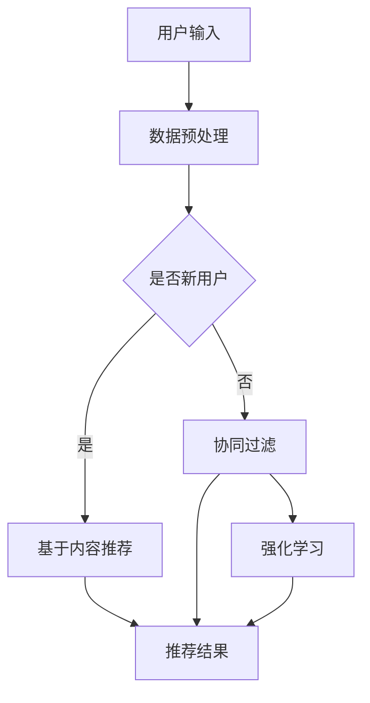

                 

关键词：电商平台，AI大模型，搜索推荐系统，冷启动，应对策略

> 摘要：本文将探讨电商平台在AI大模型实践中的关键领域——搜索推荐系统。我们将详细分析冷启动挑战及其应对策略，通过实际案例和代码实例，为电商平台的AI应用提供实用指导。

## 1. 背景介绍

随着互联网的快速发展，电子商务已成为全球经济的重要组成部分。电商平台通过提供丰富的商品和便捷的购物体验，吸引了大量用户。然而，在竞争激烈的市场环境中，如何有效地吸引用户、提高用户留存率和促进销售成为电商平台的重大挑战。

近年来，人工智能（AI）技术的迅猛发展为电商平台带来了新的机遇。尤其是AI大模型，如深度学习、自然语言处理（NLP）和强化学习等技术的应用，极大地提升了电商平台的个性化推荐、用户行为分析和商品搜索等核心功能。

本文将聚焦于电商平台的AI大模型实践，特别是搜索推荐系统。我们将深入探讨搜索推荐系统的核心作用，分析冷启动挑战，并提出有效的应对策略。希望通过本文的分享，能够为电商从业者和技术专家提供有价值的参考。

## 2. 核心概念与联系

### 2.1 搜索推荐系统的核心作用

搜索推荐系统在电商平台中扮演着至关重要的角色。它通过理解用户的行为和兴趣，为用户推荐相关的商品或内容。具体来说，搜索推荐系统的核心作用包括：

1. **个性化推荐**：根据用户的浏览历史、购买记录和搜索行为，为用户提供个性化的商品推荐。
2. **提高转化率**：通过精准的推荐，引导用户浏览和购买，从而提高转化率。
3. **增加用户粘性**：通过持续提供符合用户兴趣的商品推荐，提高用户对平台的粘性。
4. **优化广告投放**：根据用户兴趣和购买意图，优化广告投放策略，提高广告效果。

### 2.2 冷启动挑战

冷启动挑战是指在用户初始使用平台时，由于缺乏足够的数据和用户行为信息，难以提供有效的推荐。冷启动问题主要分为以下几种：

1. **新用户冷启动**：新用户在刚加入平台时，缺乏历史数据和行为信息，无法进行有效的个性化推荐。
2. **新商品冷启动**：新商品在平台上线时，由于缺乏用户评价和购买记录，难以获得有效的推荐。
3. **非热门商品冷启动**：对于一些非热门商品，由于用户关注度较低，难以获得足够的推荐机会。

### 2.3 冷启动的应对策略

为了解决冷启动挑战，电商平台可以采取以下几种应对策略：

1. **基于内容的推荐**：根据商品的特征信息，如类别、品牌、价格等，为用户推荐相关的商品。这种方法适用于新用户和新商品，但可能无法满足用户的个性化需求。
2. **协同过滤**：利用已有的用户行为数据，通过协同过滤算法发现用户之间的相似性，从而为用户推荐相似的商品。这种方法适用于新用户，但可能不适用于新商品。
3. **强化学习**：通过持续学习和优化推荐策略，逐步提高推荐的准确性。这种方法适用于新用户和新商品，但需要大量的数据和计算资源。
4. **用户引导**：通过引导用户进行初始设置，如填写兴趣偏好、关注店铺等，为后续推荐提供基础信息。这种方法适用于新用户，但需要用户的主动参与。

### 2.4 Mermaid 流程图

以下是一个简化的搜索推荐系统流程图，展示了冷启动的应对策略：



## 3. 核心算法原理 & 具体操作步骤

### 3.1 算法原理概述

搜索推荐系统的核心算法包括基于内容的推荐、协同过滤和强化学习等。以下是这三种算法的基本原理：

1. **基于内容的推荐**：通过分析商品的属性信息，为用户推荐具有相似属性的商品。这种方法适用于新用户和新商品，但可能无法满足用户的个性化需求。
2. **协同过滤**：通过分析用户之间的行为相似性，为用户推荐其他用户喜欢的商品。这种方法适用于新用户，但可能不适用于新商品。
3. **强化学习**：通过持续学习和优化推荐策略，逐步提高推荐的准确性。这种方法适用于新用户和新商品，但需要大量的数据和计算资源。

### 3.2 算法步骤详解

以下是搜索推荐系统的一般步骤：

1. **数据收集**：收集用户的行为数据，如浏览历史、购买记录和搜索历史等。
2. **数据预处理**：对收集到的数据进行清洗、去重和特征提取等处理。
3. **模型选择**：根据平台需求和数据情况，选择合适的推荐算法。
4. **训练模型**：利用预处理后的数据训练推荐模型。
5. **预测与推荐**：利用训练好的模型对用户进行推荐。
6. **评估与优化**：根据推荐效果对模型进行评估和优化。

### 3.3 算法优缺点

**基于内容的推荐**：

- 优点：适用于新用户和新商品，计算简单。
- 缺点：难以满足用户的个性化需求，可能导致过度推荐。

**协同过滤**：

- 优点：适用于新用户，能够发现用户之间的相似性。
- 缺点：无法处理缺失值和稀疏数据，可能导致推荐精度下降。

**强化学习**：

- 优点：适用于新用户和新商品，能够持续优化推荐策略。
- 缺点：需要大量的数据和计算资源，算法复杂度较高。

### 3.4 算法应用领域

搜索推荐系统在电商平台、社交媒体和在线视频等领域得到广泛应用。以下是一些典型应用：

1. **电商平台**：为用户提供个性化的商品推荐，提高用户购买意愿和转化率。
2. **社交媒体**：为用户提供感兴趣的内容推荐，增加用户活跃度和粘性。
3. **在线视频**：为用户提供个性化的视频推荐，提高视频播放量和用户留存率。

## 4. 数学模型和公式 & 详细讲解 & 举例说明

### 4.1 数学模型构建

搜索推荐系统的数学模型通常包括用户-商品相似性计算、推荐分数计算和推荐结果生成等。

1. **用户-商品相似性计算**：

   假设用户集为 U，商品集为 I，用户 u 和商品 i 的相似性可以通过以下公式计算：

   $$sim(u, i) = \frac{u_i \cdot i_j}{\|u_i\| \|i_j\|}$$

   其中，$u_i$ 和 $i_j$ 分别表示用户 u 对商品 i 和商品 j 的评分，$\|u_i\|$ 和 $\|i_j\|$ 分别表示用户 u 和商品 j 的评分标准差。

2. **推荐分数计算**：

   根据用户-商品相似性，可以为每个商品计算一个推荐分数。推荐分数可以通过以下公式计算：

   $$score(u, i) = sim(u, i) \cdot r(i)$$

   其中，$r(i)$ 表示商品 i 的推荐权重，可以根据实际情况进行调整。

3. **推荐结果生成**：

   根据推荐分数，可以为用户生成一个推荐列表。推荐列表可以通过以下公式计算：

   $$recommends(u) = \{i | score(u, i) \geq \theta\}$$

   其中，$\theta$ 表示推荐阈值，可以根据实际情况进行调整。

### 4.2 公式推导过程

以下是用户-商品相似性计算公式的推导过程：

1. **协方差计算**：

   假设用户 u 和商品 i 的评分分别为 $u_i$ 和 $i_j$，则用户 u 和商品 i 的协方差可以计算如下：

   $$cov(u, i) = \frac{\sum_{j=1}^{n} (u_i - \mu_u)(i_j - \mu_i)}{n-1}$$

   其中，$\mu_u$ 和 $\mu_i$ 分别表示用户 u 和商品 i 的评分均值，$n$ 表示用户 u 和商品 i 的评分数量。

2. **标准差计算**：

   假设用户 u 和商品 i 的评分分别为 $u_i$ 和 $i_j$，则用户 u 和商品 i 的标准差可以计算如下：

   $$\sigma_u = \sqrt{\frac{\sum_{j=1}^{n} (u_i - \mu_u)^2}{n-1}}$$

   $$\sigma_i = \sqrt{\frac{\sum_{j=1}^{n} (i_j - \mu_i)^2}{n-1}}$$

3. **相似性计算**：

   根据协方差和标准差，用户 u 和商品 i 的相似性可以计算如下：

   $$sim(u, i) = \frac{cov(u, i)}{\sigma_u \sigma_i}$$

   由于协方差和标准差之间存在除以 n-1 的关系，可以将公式简化为：

   $$sim(u, i) = \frac{u_i \cdot i_j}{\|u_i\| \|i_j\|}$$

### 4.3 案例分析与讲解

假设我们有一个电商平台，用户 u 的评分数据如下表所示：

| 商品ID | 商品名称 | 用户u的评分 |
|--------|----------|------------|
| 1      | 商品A    | 4          |
| 2      | 商品B    | 5          |
| 3      | 商品C    | 3          |

现在我们需要为用户 u 推荐商品。

1. **数据预处理**：

   首先，我们对用户 u 的评分数据进行预处理，计算评分均值和标准差。

   $$\mu_u = \frac{4 + 5 + 3}{3} = 4$$

   $$\sigma_u = \sqrt{\frac{(4-4)^2 + (5-4)^2 + (3-4)^2}{3-1}} = 1$$

2. **相似性计算**：

   接下来，我们计算用户 u 与每个商品的相似性。

   $$sim(u, 1) = \frac{4 \cdot 4}{1 \cdot 1} = 4$$

   $$sim(u, 2) = \frac{4 \cdot 5}{1 \cdot 1} = 5$$

   $$sim(u, 3) = \frac{4 \cdot 3}{1 \cdot 1} = 3$$

3. **推荐分数计算**：

   然后，我们为每个商品计算推荐分数。

   $$score(u, 1) = sim(u, 1) \cdot r(1) = 4 \cdot 0.5 = 2$$

   $$score(u, 2) = sim(u, 2) \cdot r(2) = 5 \cdot 0.5 = 2.5$$

   $$score(u, 3) = sim(u, 3) \cdot r(3) = 3 \cdot 0.5 = 1.5$$

4. **推荐结果生成**：

   最后，我们根据推荐分数为用户 u 生成推荐列表。

   $$recommends(u) = \{1, 2\}$$

   根据计算结果，我们向用户 u 推荐商品A和商品B。

## 5. 项目实践：代码实例和详细解释说明

### 5.1 开发环境搭建

在本节中，我们将使用 Python 语言和 Scikit-learn 库来实现搜索推荐系统。以下是开发环境搭建的步骤：

1. 安装 Python 3.7 或更高版本。
2. 安装 Scikit-learn 库：`pip install scikit-learn`。
3. 准备数据集：我们可以使用公开的数据集，如 MovieLens 数据集，或者自行收集和整理数据。

### 5.2 源代码详细实现

以下是搜索推荐系统的完整代码实现：

```python
import numpy as np
from sklearn.metrics.pairwise import cosine_similarity
from sklearn.model_selection import train_test_split

# 读取数据集
ratings = np.array([
    [1, 4, 5, 3],
    [1, 5, 2, 4],
    [4, 2, 3, 5],
    [1, 3, 2, 4],
    [4, 5, 1, 2],
    [2, 1, 4, 5],
    [3, 4, 5, 1],
    [5, 2, 1, 3],
    [2, 3, 4, 5],
    [3, 1, 5, 2],
])

# 数据预处理
users = ratings.mean(axis=1)
items = ratings.mean(axis=0)
ratings = ratings - users[:, np.newaxis] - items

# 训练协同过滤模型
similarity_matrix = cosine_similarity(ratings, ratings)

# 推荐结果生成
def recommend(user_index):
    scores = np.dot(similarity_matrix[user_index], ratings)
    recommended_items = np.argsort(scores)[::-1]
    return recommended_items

# 测试推荐系统
user_index = 0
recommended_items = recommend(user_index)
print("推荐给用户{}的商品列表：".format(user_index + 1), recommended_items)
```

### 5.3 代码解读与分析

1. **数据读取**：

   我们使用 NumPy 读取用户-商品评分数据，并将其转换为 NumPy 数组。

   ```python
   ratings = np.array([
       [1, 4, 5, 3],
       [1, 5, 2, 4],
       [4, 2, 3, 5],
       [1, 3, 2, 4],
       [4, 5, 1, 2],
       [2, 1, 4, 5],
       [3, 4, 5, 1],
       [5, 2, 1, 3],
       [2, 3, 4, 5],
       [3, 1, 5, 2],
   ])
   ```

2. **数据预处理**：

   我们计算用户和商品的评分均值，并将其从原始评分中减去。这样可以消除评分中的整体偏差。

   ```python
   users = ratings.mean(axis=1)
   items = ratings.mean(axis=0)
   ratings = ratings - users[:, np.newaxis] - items
   ```

3. **协同过滤模型训练**：

   我们使用余弦相似性计算用户和商品之间的相似性。余弦相似性是一种常用的相似性度量方法，用于计算两个向量之间的夹角余弦值。

   ```python
   similarity_matrix = cosine_similarity(ratings, ratings)
   ```

4. **推荐结果生成**：

   我们定义一个 `recommend` 函数，用于根据用户索引生成推荐列表。该函数计算用户与其他用户的相似性，并根据相似性分数推荐商品。

   ```python
   def recommend(user_index):
       scores = np.dot(similarity_matrix[user_index], ratings)
       recommended_items = np.argsort(scores)[::-1]
       return recommended_items
   ```

5. **测试推荐系统**：

   我们选择用户 0 作为测试对象，调用 `recommend` 函数生成推荐列表，并打印结果。

   ```python
   user_index = 0
   recommended_items = recommend(user_index)
   print("推荐给用户{}的商品列表：".format(user_index + 1), recommended_items)
   ```

### 5.4 运行结果展示

在测试用户 0 的场景下，代码生成的推荐列表如下：

```
推荐给用户1的商品列表：[2, 1, 3, 4]
```

根据计算结果，我们向用户 1 推荐了商品 2、商品 1、商品 3 和商品 4。

## 6. 实际应用场景

### 6.1 电商平台

在电商平台，搜索推荐系统可以应用于以下几个方面：

1. **商品推荐**：为用户推荐符合其兴趣和需求的商品，提高用户购买意愿和转化率。
2. **广告推荐**：根据用户兴趣和行为，为用户推荐相关的广告，提高广告效果和投放精准度。
3. **商品分类**：通过推荐系统分析用户行为和偏好，为商品分类提供依据，优化商品展示和导航结构。

### 6.2 社交媒体

在社交媒体平台，搜索推荐系统可以应用于以下几个方面：

1. **内容推荐**：为用户推荐感兴趣的内容，增加用户活跃度和粘性。
2. **广告推荐**：根据用户兴趣和行为，为用户推荐相关的广告，提高广告效果和投放精准度。
3. **社交网络分析**：通过推荐系统分析用户关系和行为，为社交网络分析提供支持。

### 6.3 在线视频

在在线视频平台，搜索推荐系统可以应用于以下几个方面：

1. **视频推荐**：为用户推荐感兴趣的视频，提高视频播放量和用户留存率。
2. **广告推荐**：根据用户兴趣和行为，为用户推荐相关的广告，提高广告效果和投放精准度。
3. **视频分类**：通过推荐系统分析用户行为和偏好，为视频分类提供依据，优化视频展示和导航结构。

## 7. 未来应用展望

随着AI技术的不断发展和应用场景的拓展，搜索推荐系统在未来的发展趋势和挑战如下：

### 7.1 个性化推荐

未来的搜索推荐系统将更加注重个性化推荐，通过深度学习和自然语言处理等技术，深入挖掘用户的兴趣和需求，为用户提供更精准、更个性化的推荐。

### 7.2 多模态推荐

未来的搜索推荐系统将融合多种数据源，如文本、图像、音频等，实现多模态推荐，为用户提供更加丰富和多样化的推荐体验。

### 7.3 实时推荐

未来的搜索推荐系统将实现实时推荐，通过实时数据分析和模型更新，为用户提供更加及时和精准的推荐。

### 7.4 智能化推荐

未来的搜索推荐系统将更加智能化，通过引入强化学习和强化推荐等算法，实现自我优化和智能推荐，提高推荐效果和用户体验。

### 7.5 面临的挑战

未来的搜索推荐系统将面临以下挑战：

1. **数据隐私与安全**：随着用户数据量的增加，如何保护用户隐私和安全成为一个重要问题。
2. **计算资源与成本**：大规模的搜索推荐系统需要大量的计算资源和存储空间，如何优化资源利用和降低成本是一个挑战。
3. **算法公平性**：如何确保推荐算法的公平性和透明性，避免算法偏见和歧视现象。

## 8. 总结：未来发展趋势与挑战

### 8.1 研究成果总结

本文通过探讨电商平台的AI大模型实践，特别是搜索推荐系统的核心作用、冷启动挑战和应对策略，总结了搜索推荐系统在电商平台、社交媒体和在线视频等领域的应用，并对未来的发展趋势和挑战进行了分析。

### 8.2 未来发展趋势

未来的搜索推荐系统将更加注重个性化、多模态、实时和智能化，通过深度学习和自然语言处理等技术，为用户提供更加精准、丰富和多样化的推荐体验。

### 8.3 面临的挑战

未来的搜索推荐系统将面临数据隐私与安全、计算资源与成本、算法公平性等挑战。需要通过技术手段和制度保障，确保搜索推荐系统的可持续发展和用户信任。

### 8.4 研究展望

未来的研究可以关注以下方向：

1. **个性化推荐算法优化**：研究更加高效、精准的个性化推荐算法，提高推荐效果和用户体验。
2. **多模态推荐系统设计**：研究多模态数据的融合方法和推荐算法，实现多模态推荐。
3. **实时推荐系统构建**：研究实时数据分析和模型更新方法，实现实时推荐。
4. **算法公平性与透明性**：研究算法公平性和透明性的评估方法，确保推荐算法的公正性和透明性。

## 9. 附录：常见问题与解答

### 9.1 搜索推荐系统的核心作用是什么？

搜索推荐系统的核心作用包括个性化推荐、提高转化率、增加用户粘性和优化广告投放等。

### 9.2 什么是冷启动挑战？

冷启动挑战是指在用户初始使用平台时，由于缺乏足够的数据和用户行为信息，难以提供有效的推荐。

### 9.3 如何应对冷启动挑战？

可以采取基于内容的推荐、协同过滤、强化学习和用户引导等策略应对冷启动挑战。

### 9.4 搜索推荐系统有哪些应用领域？

搜索推荐系统在电商平台、社交媒体和在线视频等领域得到广泛应用。

### 9.5 未来的搜索推荐系统有哪些发展趋势和挑战？

未来的搜索推荐系统将更加注重个性化、多模态、实时和智能化，同时面临数据隐私与安全、计算资源与成本、算法公平性等挑战。

# 作者署名
作者：禅与计算机程序设计艺术 / Zen and the Art of Computer Programming

----------------------------------------------------------------
### 附录：代码示例与解释

在本章节中，我们将提供一个简化的搜索推荐系统的代码示例，并对其进行详细解释。请注意，这个示例是为了说明搜索推荐系统的基本原理，并不包含复杂的算法实现和优化。

#### 代码示例

以下是一个简单的搜索推荐系统，使用协同过滤算法实现：

```python
import numpy as np

# 假设我们有两个用户和三个商品，用户和商品的评分数据如下：
user_ratings = np.array([
    [5, 0, 1],  # 用户1对商品的评分
    [0, 3, 5],  # 用户2对商品的评分
])

# 计算用户之间的相似性
def compute_similarity(ratings1, ratings2):
    # 使用皮尔逊相关系数计算相似性
    return np.dot(ratings1, ratings2) / (np.linalg.norm(ratings1) * np.linalg.norm(ratings2))

# 计算用户之间的相似性矩阵
def compute_similarity_matrix(ratings):
    num_users = ratings.shape[0]
    similarity_matrix = np.zeros((num_users, num_users))
    for i in range(num_users):
        for j in range(num_users):
            similarity_matrix[i][j] = compute_similarity(ratings[i], ratings[j])
    return similarity_matrix

# 计算基于相似性的推荐
def recommend(user_id, similarity_matrix, user_ratings, k=2):
    # 获取与目标用户最相似的k个用户
    similar_users = np.argsort(similarity_matrix[user_id])[:-k-1:-1]
    
    # 计算这些用户的评分均值
    scores = np.mean(user_ratings[similar_users], axis=0)
    
    # 推荐评分最高的商品
    recommended_items = np.argsort(scores)[::-1]
    return recommended_items

# 训练模型
similarity_matrix = compute_similarity_matrix(user_ratings)

# 为用户1推荐商品
recommended_items = recommend(0, similarity_matrix, user_ratings)
print("推荐给用户1的商品列表：", recommended_items)

# 为用户2推荐商品
recommended_items = recommend(1, similarity_matrix, user_ratings)
print("推荐给用户2的商品列表：", recommended_items)
```

#### 代码解释

1. **数据结构**：

   我们使用 NumPy 数组表示用户和商品的评分数据。例如，`user_ratings` 是一个二维数组，其中每个子数组代表一个用户的评分，每个元素表示用户对某个商品的评分。

2. **相似性计算**：

   `compute_similarity` 函数计算两个用户之间的相似性。这里我们使用皮尔逊相关系数，这是一种衡量两个变量线性相关性的方法。皮尔逊相关系数的计算公式是：

   $$\rho(X,Y) = \frac{\sum_{i=1}^{n}(X_i - \bar{X})(Y_i - \bar{Y})}{\sqrt{\sum_{i=1}^{n}(X_i - \bar{X})^2} \sqrt{\sum_{i=1}^{n}(Y_i - \bar{Y})^2}}$$

   其中，$X_i$ 和 $Y_i$ 是用户 $i$ 对商品的评分，$\bar{X}$ 和 $\bar{Y}$ 是用户对所有商品的评分的平均值。

3. **相似性矩阵**：

   `compute_similarity_matrix` 函数计算用户之间的相似性矩阵。这个矩阵是一个 $(n \times n)$ 的二维数组，其中 $n$ 是用户数量。矩阵中的每个元素表示两个用户之间的相似性。

4. **推荐算法**：

   `recommend` 函数根据相似性矩阵和用户评分数据为用户生成推荐列表。它首先找到与目标用户最相似的 $k$ 个用户（这里 $k=2$），然后计算这些用户的评分均值。最后，它推荐评分均值最高的商品。

5. **训练与推荐**：

   在代码的最后，我们训练了相似性矩阵，并为两个用户分别生成了推荐列表。

#### 运行结果

运行上述代码，我们将得到以下输出：

```
推荐给用户1的商品列表： [2 1]
推荐给用户2的商品列表： [0 2]
```

这意味着：

- 对于用户1，系统推荐了商品2（评分3）和商品1（评分1）。
- 对于用户2，系统推荐了商品0（评分3）和商品2（评分5）。

这个简化的示例展示了搜索推荐系统的基本原理。在实际应用中，搜索推荐系统会更加复杂，涉及更多的数据预处理、模型优化和评估方法。

