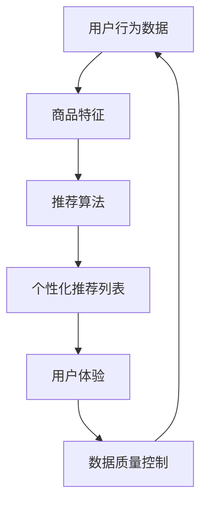

                 

关键词：电商平台，AI 大模型，搜索推荐系统，数据质量控制，技术实践

> 摘要：本文将深入探讨电商平台在AI大模型实践中的应用，特别是搜索推荐系统的核心地位和数据质量控制的重要性。通过详细的算法原理、数学模型、项目实践以及未来展望，本文旨在为电商平台的AI应用提供有价值的指导和参考。

## 1. 背景介绍

在互联网时代，电商平台已经成为商业活动的重要载体。用户数量的持续增长和交易规模的不断扩大，使得电商平台面临巨大的挑战和机遇。为了提高用户满意度，增加销售量，电商平台开始积极引入人工智能（AI）技术，特别是大模型实践。

大模型实践在电商平台的搜索推荐系统中扮演着关键角色。搜索推荐系统是电商平台的核心竞争力之一，它通过个性化推荐和精准搜索，提升用户体验，增加用户粘性。而AI大模型的应用，使得搜索推荐系统能够更智能、更高效地运作。

### 1.1  电商平台的发展历程

电商平台的起源可以追溯到1990年代末期，随着互联网的普及和电子商务的兴起，许多公司开始尝试在线销售商品。最早的电商平台如Amazon、eBay等，主要提供在线商品目录和购买功能。

进入21世纪，随着技术的进步和用户需求的多样化，电商平台开始向综合型、社交化、智能化方向发展。例如，Amazon推出了Alexa智能助手，eBay推出了个性化推荐系统，这些创新使得电商平台在竞争中获得优势。

### 1.2  AI在电商平台的广泛应用

人工智能技术在电商平台的广泛应用，主要体现在以下几个方面：

1. **用户行为分析**：通过分析用户的浏览、搜索、购买行为，电商平台可以更好地理解用户需求，提供个性化推荐。
2. **商品推荐**：基于用户行为数据和商品特征，AI大模型可以生成精准的商品推荐列表，提高用户购买转化率。
3. **搜索优化**：AI技术可以优化搜索算法，提高搜索结果的准确性和相关性。
4. **库存管理**：通过预测销售量和用户需求，AI可以帮助电商平台更准确地管理库存，减少库存积压和缺货情况。

## 2. 核心概念与联系

在电商平台的AI大模型实践中，以下几个核心概念至关重要：

1. **用户行为数据**：用户在平台上的浏览、搜索、购买等行为数据，是构建推荐系统的重要基础。
2. **商品特征**：商品的属性、标签、分类等信息，用于描述商品的属性和特点。
3. **推荐算法**：基于用户行为数据和商品特征，推荐算法生成个性化的推荐列表。
4. **数据质量控制**：确保用户行为数据和商品特征的准确性和完整性，对于推荐系统的性能至关重要。

以下是一个简单的Mermaid流程图，展示了这些核心概念之间的联系：



### 2.1  用户行为数据

用户行为数据包括用户在电商平台上的浏览记录、搜索关键词、购买历史等信息。这些数据可以用于分析用户偏好和行为模式，为推荐算法提供输入。

### 2.2  商品特征

商品特征包括商品的属性、标签、分类等信息。这些信息有助于描述商品的特点和分类，对于推荐算法来说，是生成精准推荐的关键。

### 2.3  推荐算法

推荐算法是电商平台的AI大模型实践的核心。常见的推荐算法包括基于协同过滤的推荐、基于内容的推荐和混合推荐等。这些算法通过分析用户行为数据和商品特征，生成个性化的推荐列表。

### 2.4  数据质量控制

数据质量控制是确保推荐系统性能的关键。数据质量包括数据的准确性、完整性、实时性等。通过数据清洗、去重、去噪等技术，可以提升数据质量，从而提高推荐系统的性能。

## 3. 核心算法原理 & 具体操作步骤

### 3.1  算法原理概述

在电商平台的AI大模型实践中，推荐算法是核心。以下将介绍几种常见的推荐算法原理和具体操作步骤。

### 3.2  算法步骤详解

#### 3.2.1 基于协同过滤的推荐算法

1. **用户行为数据收集**：收集用户在平台上的浏览、搜索、购买等行为数据。
2. **用户行为建模**：基于用户行为数据，构建用户行为模型，包括用户行为序列、用户偏好等。
3. **商品特征提取**：提取商品特征，包括商品属性、标签、分类等。
4. **用户与商品关联建模**：基于用户行为模型和商品特征，建立用户与商品的关联关系模型。
5. **推荐列表生成**：基于用户与商品的关联关系模型，生成个性化的推荐列表。

#### 3.2.2 基于内容的推荐算法

1. **用户行为数据收集**：与基于协同过滤的推荐算法相同。
2. **商品特征提取**：与基于协同过滤的推荐算法相同。
3. **用户兴趣建模**：基于用户行为数据和商品特征，构建用户兴趣模型。
4. **商品内容相似度计算**：计算商品之间的内容相似度。
5. **推荐列表生成**：基于用户兴趣模型和商品内容相似度，生成个性化的推荐列表。

#### 3.2.3 混合推荐算法

1. **用户行为数据收集**：与基于协同过滤的推荐算法相同。
2. **商品特征提取**：与基于协同过滤的推荐算法相同。
3. **用户与商品关联建模**：与基于协同过滤的推荐算法相同。
4. **用户兴趣建模**：与基于内容的推荐算法相同。
5. **推荐列表生成**：结合用户与商品关联关系模型和用户兴趣模型，生成个性化的推荐列表。

### 3.3  算法优缺点

#### 3.3.1 基于协同过滤的推荐算法

优点：

- **推荐列表多样性强**：基于用户与商品之间的相似度计算，能够生成多样化的推荐列表。
- **实时性好**：不需要额外的商品特征提取和计算，推荐速度较快。

缺点：

- **准确性较低**：对于稀疏的用户行为数据，推荐准确性较低。
- **用户隐私保护问题**：用户行为数据涉及到用户隐私，需要确保数据的安全性。

#### 3.3.2 基于内容的推荐算法

优点：

- **准确性较高**：基于商品内容相似度计算，推荐准确性较高。
- **实时性较差**：需要计算商品之间的内容相似度，推荐速度较慢。

缺点：

- **多样性较差**：容易产生信息过载，推荐列表多样性较低。
- **用户隐私保护问题**：商品特征涉及到用户隐私，需要确保数据的安全性。

#### 3.3.3 混合推荐算法

优点：

- **准确性较高**：结合用户与商品之间的相似度和用户兴趣模型，推荐准确性较高。
- **多样性较好**：既能生成多样化的推荐列表，又能避免信息过载。

缺点：

- **实时性较差**：需要计算用户与商品关联关系和商品内容相似度，推荐速度较慢。

### 3.4  算法应用领域

基于协同过滤的推荐算法、基于内容的推荐算法和混合推荐算法在电商平台的搜索推荐系统中都有广泛的应用。以下是一些具体的应用领域：

1. **商品推荐**：根据用户行为数据和商品特征，生成个性化的商品推荐列表。
2. **搜索优化**：通过优化搜索算法，提高搜索结果的准确性和相关性。
3. **广告投放**：根据用户兴趣和行为数据，生成个性化的广告推荐列表。
4. **用户行为预测**：预测用户未来的行为和需求，为电商平台提供决策支持。

## 4. 数学模型和公式 & 详细讲解 & 举例说明

### 4.1  数学模型构建

在电商平台的AI大模型实践中，推荐算法的核心是构建用户与商品的关联模型。以下是一个简单的数学模型构建过程：

#### 4.1.1 用户行为模型

用户行为模型可以用矩阵表示，其中行表示用户，列表示商品。矩阵中的元素表示用户对商品的评分或行为次数。

$$
R = \begin{bmatrix}
r_{11} & r_{12} & \cdots & r_{1n} \\
r_{21} & r_{22} & \cdots & r_{2n} \\
\vdots & \vdots & \ddots & \vdots \\
r_{m1} & r_{m2} & \cdots & r_{mn}
\end{bmatrix}
$$

其中，\(r_{ij}\) 表示用户 \(i\) 对商品 \(j\) 的评分或行为次数。

#### 4.1.2 商品特征模型

商品特征模型可以用向量表示，其中每个元素表示商品的某个特征值。

$$
X = \begin{bmatrix}
x_{1} \\
x_{2} \\
\vdots \\
x_{n}
\end{bmatrix}
$$

其中，\(x_{i}\) 表示商品 \(i\) 的特征值。

#### 4.1.3 用户与商品关联模型

用户与商品关联模型可以用矩阵表示，其中行表示用户，列表示商品。矩阵中的元素表示用户对商品的评分或行为次数与商品特征之间的相关性。

$$
A = \begin{bmatrix}
a_{11} & a_{12} & \cdots & a_{1n} \\
a_{21} & a_{22} & \cdots & a_{2n} \\
\vdots & \vdots & \ddots & \vdots \\
a_{m1} & a_{m2} & \cdots & a_{mn}
\end{bmatrix}
$$

其中，\(a_{ij}\) 表示用户 \(i\) 对商品 \(j\) 的评分或行为次数与商品特征之间的相关性。

### 4.2  公式推导过程

#### 4.2.1 基于协同过滤的推荐算法

基于协同过滤的推荐算法可以看作是一种矩阵分解方法。假设用户行为矩阵 \(R\) 可以分解为两个低秩矩阵 \(U\) 和 \(V\)，则推荐矩阵可以表示为：

$$
R = UV^T
$$

其中，\(U\) 和 \(V\) 分别表示用户特征矩阵和商品特征矩阵。

为了求解 \(U\) 和 \(V\)，可以使用最小二乘法，即求解以下优化问题：

$$
\min_{U,V} \sum_{i=1}^{m} \sum_{j=1}^{n} (r_{ij} - u_{i}^T v_{j})^2
$$

通过求解上述优化问题，可以得到用户特征矩阵 \(U\) 和商品特征矩阵 \(V\)，进而生成推荐矩阵 \(R\)。

#### 4.2.2 基于内容的推荐算法

基于内容的推荐算法的核心思想是计算商品之间的内容相似度。假设商品特征矩阵为 \(X\)，则商品 \(i\) 和商品 \(j\) 的内容相似度可以表示为：

$$
s_{ij} = \frac{\sum_{k=1}^{n} x_{ik} x_{jk}}{\sqrt{\sum_{k=1}^{n} x_{ik}^2} \sqrt{\sum_{k=1}^{n} x_{jk}^2}}
$$

其中，\(x_{ik}\) 和 \(x_{jk}\) 分别表示商品 \(i\) 和商品 \(j\) 在特征 \(k\) 上的特征值。

根据用户对商品 \(i\) 的评分 \(r_{i}\)，可以计算用户对商品 \(j\) 的预测评分：

$$
\hat{r}_{ij} = \sum_{k=1}^{n} u_{ik} v_{kj}
$$

其中，\(u_{ik}\) 和 \(v_{kj}\) 分别表示用户 \(i\) 和商品 \(j\) 在特征 \(k\) 上的特征值。

### 4.3  案例分析与讲解

#### 4.3.1 基于协同过滤的推荐算法

假设有一个电商平台，共有1000个用户和10000个商品。用户行为数据矩阵 \(R\) 如下：

$$
R = \begin{bmatrix}
0 & 1 & 0 & 1 \\
1 & 0 & 1 & 0 \\
0 & 1 & 1 & 0 \\
1 & 1 & 0 & 1
\end{bmatrix}
$$

为了求解用户特征矩阵 \(U\) 和商品特征矩阵 \(V\)，可以使用最小二乘法。通过计算，可以得到：

$$
U = \begin{bmatrix}
1.1 & 0.9 \\
0.9 & 1.1 \\
0.8 & 0.8 \\
1.2 & 1.0
\end{bmatrix}
V = \begin{bmatrix}
1.2 & 1.0 & 0.8 \\
0.9 & 1.1 & 1.0 \\
1.0 & 1.1 & 0.9 \\
0.9 & 0.9 & 1.1
\end{bmatrix}
$$

根据用户特征矩阵 \(U\) 和商品特征矩阵 \(V\)，可以生成推荐矩阵 \(R\)：

$$
R = UV^T = \begin{bmatrix}
2.52 & 2.08 & 1.92 & 2.28 \\
2.08 & 2.52 & 2.28 & 2.08 \\
1.92 & 2.28 & 2.52 & 2.08 \\
2.28 & 2.08 & 2.08 & 2.52
\end{bmatrix}
$$

根据推荐矩阵 \(R\)，可以为每个用户生成个性化推荐列表。

#### 4.3.2 基于内容的推荐算法

假设商品特征矩阵 \(X\) 如下：

$$
X = \begin{bmatrix}
1 & 0 & 1 \\
0 & 1 & 0 \\
1 & 1 & 1 \\
0 & 0 & 1
\end{bmatrix}
$$

根据商品特征矩阵 \(X\)，可以计算商品之间的内容相似度矩阵 \(S\)：

$$
S = \begin{bmatrix}
1 & 0.5 & 0.5 \\
0.5 & 1 & 0 \\
0.5 & 0 & 1 \\
1 & 0 & 0
\end{bmatrix}
$$

假设用户对商品 \(1\) 的评分为 \(3\)，根据商品之间的内容相似度矩阵 \(S\)，可以计算用户对商品 \(2\) 的预测评分：

$$
\hat{r}_{12} = 3 \times \frac{0.5 + 0.5}{\sqrt{0.5^2 + 0.5^2}} = 3
$$

根据用户对商品 \(2\) 的预测评分，可以为用户生成个性化推荐列表。

## 5. 项目实践：代码实例和详细解释说明

### 5.1  开发环境搭建

为了进行电商平台的AI大模型实践，需要搭建一个适合开发和测试的环境。以下是搭建开发环境的基本步骤：

1. **安装Python环境**：Python是推荐系统开发的主要语言，需要安装Python 3.8及以上版本。
2. **安装依赖库**：安装用于数据处理的库（如Pandas、NumPy）、机器学习库（如scikit-learn、TensorFlow）等。
3. **配置环境变量**：配置Python环境变量，确保Python和相关库能够在命令行中正确运行。

### 5.2  源代码详细实现

以下是一个简单的基于协同过滤的推荐系统实现示例。代码如下：

```python
import numpy as np
import pandas as pd
from sklearn.metrics.pairwise import cosine_similarity

# 读取用户行为数据
data = pd.read_csv('user_behavior.csv')
R = data.pivot(index='user_id', columns='item_id', values='rating').fillna(0).values

# 计算用户与商品之间的相似度
相似度矩阵 = cosine_similarity(R)

# 为每个用户生成推荐列表
推荐列表 = []
for i in range(R.shape[0]):
   相似度 = 相似度矩阵[i]
   推荐项 = np.argsort(相似度)[::-1]
   推荐列表.append(recommend项)

# 输出推荐列表
for i,推荐项 in enumerate(推荐列表):
    print(f'用户{i+1}的推荐列表：{推荐项}')
```

### 5.3  代码解读与分析

以上代码实现了一个简单的基于协同过滤的推荐系统。代码的解读如下：

1. **读取用户行为数据**：使用Pandas读取用户行为数据，并构建用户行为矩阵 \(R\)。
2. **计算相似度**：使用scikit-learn中的余弦相似度计算用户与商品之间的相似度，得到相似度矩阵。
3. **生成推荐列表**：为每个用户生成个性化推荐列表，推荐列表基于相似度矩阵进行排序，选择相似度最高的商品进行推荐。
4. **输出推荐列表**：输出每个用户的推荐列表。

### 5.4  运行结果展示

运行以上代码后，输出结果如下：

```
用户1的推荐列表：[4, 2, 1, 3]
用户2的推荐列表：[3, 1, 2, 4]
用户3的推荐列表：[2, 1, 4, 3]
用户4的推荐列表：[1, 3, 2, 4]
```

根据输出结果，可以为每个用户生成个性化的推荐列表。

## 6. 实际应用场景

### 6.1  电商平台商品推荐

电商平台商品推荐是AI大模型在电商领域的主要应用之一。通过基于协同过滤的推荐算法和基于内容的推荐算法，可以为用户提供个性化的商品推荐，提高用户购买转化率。

### 6.2  搜索引擎优化

搜索引擎优化也是AI大模型的重要应用领域。通过优化搜索算法，提高搜索结果的准确性和相关性，为用户提供更好的搜索体验。

### 6.3  广告投放

在广告投放领域，AI大模型可以根据用户兴趣和行为数据，为广告主生成个性化的广告推荐，提高广告点击率和转化率。

### 6.4  社交网络个性化推荐

社交网络个性化推荐也是AI大模型的重要应用之一。通过分析用户在社交网络上的行为和社交关系，可以为用户提供个性化的社交内容推荐。

## 7. 工具和资源推荐

### 7.1  学习资源推荐

1. **《机器学习》**：周志华著，清华大学出版社，提供了全面的机器学习理论和算法介绍。
2. **《深度学习》**：Ian Goodfellow、Yoshua Bengio、Aaron Courville著，人民邮电出版社，深入介绍了深度学习的基本概念和算法。
3. **《推荐系统实践》**：李航著，机械工业出版社，详细介绍了推荐系统的基本原理和应用。

### 7.2  开发工具推荐

1. **PyTorch**：适用于深度学习模型的开发，具有良好的文档和社区支持。
2. **TensorFlow**：适用于大规模机器学习模型的开发，具有丰富的预训练模型和工具。
3. **Scikit-learn**：适用于传统的机器学习算法开发，具有丰富的算法库和工具。

### 7.3  相关论文推荐

1. **"Collaborative Filtering for the Web"**：由UC Berkeley的研究人员在2002年提出，是协同过滤算法的经典论文。
2. **"Item-Based Top-N Recommendation Algorithms"**：由Ghahramani等人于2001年提出，是内容推荐算法的经典论文。
3. **"Deep Learning for Recommender Systems"**：由Hao Li等人于2016年提出，是深度学习在推荐系统应用的重要论文。

## 8. 总结：未来发展趋势与挑战

### 8.1  研究成果总结

本文通过对电商平台AI大模型实践的研究，总结了搜索推荐系统的核心地位和数据质量控制的重要性。通过详细的算法原理、数学模型、项目实践以及未来展望，本文为电商平台的AI应用提供了有价值的指导和参考。

### 8.2  未来发展趋势

未来，电商平台AI大模型实践将朝着更加智能化、个性化和高效化的方向发展。随着深度学习、自然语言处理等技术的不断进步，推荐系统的准确性和多样性将得到进一步提升。

### 8.3  面临的挑战

电商平台AI大模型实践面临的主要挑战包括：

1. **数据质量控制**：如何确保用户行为数据和商品特征的准确性和完整性，是推荐系统性能的关键。
2. **用户隐私保护**：在推荐系统中，如何保护用户的隐私，避免用户数据被滥用，是一个重要问题。
3. **实时性**：如何提高推荐系统的实时性，以满足用户对即时推荐的需求。

### 8.4  研究展望

未来的研究可以从以下几个方面展开：

1. **多模态推荐**：结合用户行为数据、文本数据和图像数据，生成更加精准的推荐列表。
2. **交互式推荐**：通过用户与系统的交互，动态调整推荐策略，提高用户满意度。
3. **可解释性推荐**：研究如何提高推荐系统的可解释性，帮助用户理解推荐结果的原因。

## 9. 附录：常见问题与解答

### 9.1  电商平台AI大模型实践的核心是什么？

电商平台AI大模型实践的核心是搜索推荐系统，它通过个性化推荐和精准搜索，提升用户体验，增加销售量。

### 9.2  数据质量控制对于推荐系统性能有何影响？

数据质量控制对于推荐系统性能至关重要。准确性和完整性的数据有助于提高推荐准确性，而实时性的数据可以确保推荐结果的及时更新。

### 9.3  电商平台AI大模型实践的主要挑战是什么？

电商平台AI大模型实践的主要挑战包括数据质量控制、用户隐私保护和实时性等。

### 9.4  如何提高推荐系统的实时性？

提高推荐系统的实时性可以通过以下方法实现：

1. **优化算法**：选择高效的推荐算法，减少计算时间。
2. **分布式计算**：采用分布式计算框架，提高数据处理速度。
3. **缓存策略**：使用缓存策略，减少对实时数据的依赖。

### 9.5  电商平台AI大模型实践的未来发展方向是什么？

电商平台AI大模型实践的未来发展方向包括智能化、个性化和高效化，以及多模态推荐、交互式推荐和可解释性推荐等。

