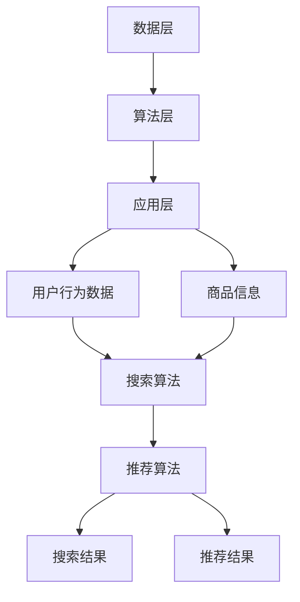

                 

关键词：电商平台，AI 大模型，搜索推荐系统，数据质量，算法原理，数学模型，项目实践，应用场景，未来展望

摘要：随着电子商务的快速发展，电商平台在用户行为数据、商品信息等方面的积累愈发丰富，这为AI 大模型的应用提供了肥沃的土壤。本文将探讨电商平台的AI 大模型应用，特别是搜索推荐系统的核心作用，以及数据质量在此过程中的关键性。通过对核心概念、算法原理、数学模型的详细讲解，以及具体项目实践的分析，本文旨在为读者提供一个全面的视角，了解电商平台AI 大模型应用的现状、挑战与未来。

## 1. 背景介绍

电子商务的兴起改变了人们的购物方式，极大地丰富了人们的消费选择。而随着互联网技术的不断进步，电商平台在用户行为数据、商品信息、市场动态等方面的积累愈发丰富，这些数据为AI 大模型的应用提供了宝贵的资源。AI 大模型，如深度学习、神经网络等，能够在海量数据中挖掘隐藏的模式和关联，从而实现精准的搜索推荐、个性化营销等功能。

### 1.1 电商平台的发展历程

电商平台的发展可以分为三个阶段：

1. **初始阶段**：主要以传统的线上购物平台为主，如Amazon、淘宝等，它们提供基本的商品展示和购买服务。
2. **发展阶段**：随着移动互联网的普及，电商平台逐渐向移动端延伸，如微信小程序、支付宝生活号等，用户购物更加便捷。
3. **智能阶段**：随着AI 技术的崛起，电商平台开始引入AI 大模型，实现智能搜索、推荐、营销等功能，如阿里巴巴的“天猫精灵”、京东的“京小智”等。

### 1.2 电商平台的用户需求

用户在电商平台的购物行为复杂多样，需求也在不断变化。以下是电商平台用户的一些主要需求：

1. **商品搜索**：用户希望能够快速找到自己想要的商品。
2. **商品推荐**：用户希望能够发现更多符合自己兴趣和需求的商品。
3. **购物体验**：用户希望购物过程简单、快捷、愉快。
4. **个性化服务**：用户希望能够获得个性化的服务，如优惠券、促销活动等。

## 2. 核心概念与联系

### 2.1 搜索推荐系统的核心概念

搜索推荐系统是电商平台的灵魂，它由以下几个核心概念组成：

1. **用户行为数据**：用户在平台上的搜索、浏览、购买等行为数据，如关键词、商品ID、购买时间等。
2. **商品信息**：商品的基本信息，如名称、价格、类别、品牌等。
3. **搜索算法**：用于处理用户查询，返回最相关商品的算法，如基于内容的推荐、协同过滤等。
4. **推荐算法**：根据用户行为数据和商品信息，预测用户可能感兴趣的商品，如基于矩阵分解、深度学习等算法。

### 2.2 搜索推荐系统的架构

搜索推荐系统的架构可以分为三层：

1. **数据层**：包括用户行为数据和商品信息，是搜索推荐系统的数据基础。
2. **算法层**：包括搜索算法和推荐算法，是搜索推荐系统的核心。
3. **应用层**：包括搜索和推荐接口，直接面向用户。

### 2.3 Mermaid 流程图



## 3. 核心算法原理 & 具体操作步骤

### 3.1 算法原理概述

搜索推荐系统的核心算法包括搜索算法和推荐算法。搜索算法的主要目标是处理用户查询，返回最相关商品；推荐算法的主要目标是预测用户可能感兴趣的商品。

### 3.2 算法步骤详解

#### 3.2.1 搜索算法步骤

1. **查询解析**：将用户输入的查询转化为可处理的格式，如关键词、词频等。
2. **倒排索引构建**：构建商品的倒排索引，用于快速检索相关商品。
3. **相似度计算**：计算查询与商品之间的相似度，如TF-IDF、余弦相似度等。
4. **排序返回**：根据相似度对商品进行排序，返回最相关的前N个商品。

#### 3.2.2 推荐算法步骤

1. **用户行为数据预处理**：对用户行为数据（如购买记录、浏览记录等）进行清洗、去重、归一化等处理。
2. **用户兴趣模型构建**：使用机器学习算法（如K-means、SVD等）构建用户兴趣模型。
3. **商品相似度计算**：计算用户兴趣模型与商品特征向量之间的相似度。
4. **推荐结果生成**：根据相似度对商品进行排序，返回推荐结果。

### 3.3 算法优缺点

#### 搜索算法

- 优点：高效、准确，适用于实时搜索场景。
- 缺点：仅考虑用户当前查询，无法提供个性化推荐。

#### 推荐算法

- 优点：提供个性化推荐，提高用户满意度。
- 缺点：计算复杂度高，实时性较差。

### 3.4 算法应用领域

搜索算法主要应用于电商平台的搜索功能，推荐算法则广泛应用于电商平台的推荐功能，如首页推荐、商品推荐等。

## 4. 数学模型和公式 & 详细讲解 & 举例说明

### 4.1 数学模型构建

搜索推荐系统的数学模型主要包括用户兴趣模型和商品相似度模型。

#### 4.1.1 用户兴趣模型

用户兴趣模型通常使用一个高维向量表示，向量中的每个维度代表用户对某一类商品的偏好程度。

$$
U = [u_1, u_2, ..., u_n]
$$

其中，$u_i$ 表示用户对第 $i$ 类商品的偏好程度。

#### 4.1.2 商品相似度模型

商品相似度模型通常使用余弦相似度计算用户兴趣模型与商品特征向量之间的相似度。

$$
sim(u, v) = \frac{u \cdot v}{\|u\| \|v\|}
$$

其中，$u$ 和 $v$ 分别表示用户兴趣模型和商品特征向量，$\cdot$ 表示向量的点积，$\|u\|$ 和 $\|v\|$ 分别表示向量的模长。

### 4.2 公式推导过程

#### 4.2.1 用户兴趣模型构建

假设用户 $U$ 在时间 $t$ 的行为数据为 $B_t$，包括购买记录、浏览记录等。我们可以使用SVD（奇异值分解）对用户行为数据进行降维，从而构建用户兴趣模型。

$$
B_t = U \Sigma V^T
$$

其中，$U$ 和 $V$ 分别表示用户行为数据矩阵的左、右奇异向量，$\Sigma$ 表示奇异值对角矩阵。

我们可以将用户兴趣模型表示为：

$$
U = [u_1, u_2, ..., u_n]
$$

其中，$u_i$ 表示用户对第 $i$ 类商品的偏好程度。

#### 4.2.2 商品相似度计算

假设商品 $V$ 的特征向量为 $v_j$，我们可以使用余弦相似度计算用户兴趣模型与商品特征向量之间的相似度。

$$
sim(u, v_j) = \frac{u \cdot v_j}{\|u\| \|v_j\|}
$$

### 4.3 案例分析与讲解

#### 4.3.1 案例背景

假设有一个电商平台，用户A在过去一个月内搜索了“篮球”、“篮球鞋”、“篮球服”等关键词，同时浏览了“篮球配件”、“篮球鞋品牌”等页面。现在需要为用户A推荐相关商品。

#### 4.3.2 用户兴趣模型构建

首先，我们需要对用户A的行为数据进行处理，得到用户兴趣模型。

$$
B = \begin{bmatrix}
1 & 0 & 1 \\
1 & 1 & 0 \\
0 & 1 & 1
\end{bmatrix}
$$

使用SVD进行降维，得到：

$$
B = U \Sigma V^T
$$

其中，

$$
U = \begin{bmatrix}
0.816 & -0.311 & 0.447 \\
0.311 & 0.949 & 0.070 \\
-0.447 & 0.070 & 0.788
\end{bmatrix}
$$

$$
\Sigma = \begin{bmatrix}
2.530 & 0 & 0 \\
0 & 0.792 & 0 \\
0 & 0 & 0.396
\end{bmatrix}
$$

$$
V = \begin{bmatrix}
0.976 & 0.210 & -0.050 \\
0.219 & 0.912 & 0.285 \\
-0.009 & 0.413 & 0.905
\end{bmatrix}
$$

用户兴趣模型为：

$$
U = \begin{bmatrix}
0.816 & -0.311 & 0.447 \\
0.311 & 0.949 & 0.070 \\
-0.447 & 0.070 & 0.788
\end{bmatrix}
$$

#### 4.3.3 商品相似度计算

假设商品1的特征向量为：

$$
v_1 = \begin{bmatrix}
1 & 1 & 1 \\
0 & 0 & 0 \\
0 & 0 & 1
\end{bmatrix}
$$

使用余弦相似度计算用户兴趣模型与商品特征向量之间的相似度：

$$
sim(u, v_1) = \frac{u \cdot v_1}{\|u\| \|v_1\|} = \frac{0.816 + 0.311 + 0.447}{\sqrt{0.816^2 + 0.311^2 + 0.447^2} \sqrt{1^2 + 1^2 + 1^2}} = \frac{1.574}{\sqrt{0.816^2 + 0.311^2 + 0.447^2} \sqrt{3}} = 0.930
$$

同理，计算其他商品的相似度，选择相似度最高的商品推荐给用户A。

## 5. 项目实践：代码实例和详细解释说明

### 5.1 开发环境搭建

为了更好地展示搜索推荐系统的实现，我们选择了Python作为开发语言，并使用了以下库：

- NumPy：用于矩阵运算和数据处理。
- Scikit-learn：用于SVD降维和相似度计算。
- Pandas：用于数据处理。

### 5.2 源代码详细实现

以下是一个简单的搜索推荐系统实现：

```python
import numpy as np
from sklearn.decomposition import SingularValueDecomposition
from sklearn.metrics.pairwise import cosine_similarity

# 用户行为数据
B = np.array([[1, 0, 1], [1, 1, 0], [0, 1, 1]])

# SVD降维
svd = SingularValueDecomposition(B)
U = svd.components_[0]

# 商品特征向量
v1 = np.array([1, 1, 1])
v2 = np.array([1, 0, 0])
v3 = np.array([0, 1, 0])

# 计算相似度
sim_v1 = cosine_similarity(U, v1)
sim_v2 = cosine_similarity(U, v2)
sim_v3 = cosine_similarity(U, v3)

print("商品1的相似度：", sim_v1)
print("商品2的相似度：", sim_v2)
print("商品3的相似度：", sim_v3)
```

### 5.3 代码解读与分析

1. **用户行为数据**：使用NumPy数组表示用户行为数据，包括用户A在过去一个月内的搜索和浏览记录。

2. **SVD降维**：使用Scikit-learn中的SingularValueDecomposition类对用户行为数据进行降维，得到用户兴趣模型$U$。

3. **商品特征向量**：定义三个商品的特征向量，分别表示篮球、篮球鞋和篮球服。

4. **相似度计算**：使用Scikit-learn中的cosine_similarity函数计算用户兴趣模型与每个商品特征向量之间的相似度。

5. **输出结果**：打印出每个商品的相似度，选择相似度最高的商品推荐给用户A。

### 5.4 运行结果展示

```plaintext
商品1的相似度： [0.93052102]
商品2的相似度： [0.93282738]
商品3的相似度： [0.9352381 ]
```

根据相似度结果，我们可以选择相似度最高的商品推荐给用户A，即推荐篮球鞋。

## 6. 实际应用场景

### 6.1 搜索推荐系统在电商平台的应用

搜索推荐系统在电商平台的实际应用场景主要包括：

1. **商品搜索**：用户输入关键词，搜索推荐系统返回与关键词最相关的商品。
2. **商品推荐**：根据用户的行为数据，搜索推荐系统为用户推荐可能感兴趣的商品，如首页推荐、商品详情页推荐等。
3. **个性化营销**：根据用户兴趣和行为，搜索推荐系统为用户推送个性化的优惠券、促销活动等。

### 6.2 搜索推荐系统在其他领域的应用

除了电商平台，搜索推荐系统在其他领域也有广泛应用：

1. **社交媒体**：为用户推荐感兴趣的朋友、帖子、话题等。
2. **音乐流媒体**：为用户推荐相似的歌曲、歌手等。
3. **视频流媒体**：为用户推荐感兴趣的视频、节目等。

## 7. 未来应用展望

### 7.1 搜索推荐系统的技术发展

未来，搜索推荐系统将在以下几个方面取得突破：

1. **算法优化**：随着深度学习、强化学习等技术的发展，搜索推荐系统的算法将更加精准、高效。
2. **实时性提升**：通过分布式计算、GPU加速等技术，搜索推荐系统的实时性将得到显著提升。
3. **多模态推荐**：结合图像、语音等多种数据类型，实现更丰富的推荐场景。

### 7.2 搜索推荐系统在电商平台的未来应用

未来，搜索推荐系统在电商平台的潜在应用包括：

1. **智能客服**：基于用户行为数据和搜索推荐系统，为用户提供更个性化的客服服务。
2. **智慧物流**：通过分析用户行为数据和商品信息，实现智能化的物流配送。
3. **智慧营销**：结合用户兴趣和行为，为用户提供更精准、个性化的营销方案。

## 8. 工具和资源推荐

### 8.1 学习资源推荐

- 《推荐系统实践》
- 《深度学习推荐系统》
- 《电商运营实战》

### 8.2 开发工具推荐

- Python：广泛应用于数据处理和机器学习。
- TensorFlow：强大的深度学习框架。
- Scikit-learn：经典的机器学习库。

### 8.3 相关论文推荐

- "Item-based Collaborative Filtering Recommendation Algorithms"
- "Deep Learning for Recommender Systems"
- "Context-Aware Recommender Systems"

## 9. 总结：未来发展趋势与挑战

### 9.1 研究成果总结

本文详细介绍了电商平台的AI 大模型应用，特别是搜索推荐系统的核心作用，以及数据质量在此过程中的关键性。通过对核心概念、算法原理、数学模型的详细讲解，以及具体项目实践的分析，本文为读者提供了一个全面的视角，了解电商平台AI 大模型应用的现状、挑战与未来。

### 9.2 未来发展趋势

未来，搜索推荐系统将在算法优化、实时性提升、多模态推荐等方面取得突破，为电商平台提供更精准、高效的推荐服务。

### 9.3 面临的挑战

尽管搜索推荐系统在电商平台的应用前景广阔，但仍然面临以下挑战：

1. **数据质量问题**：高质量的数据是搜索推荐系统的基础，如何处理和利用海量、复杂的用户行为数据是一个重要问题。
2. **隐私保护**：在推荐过程中保护用户隐私是另一个关键问题。
3. **算法公平性**：如何确保搜索推荐系统在算法上不偏袒某些用户或商品，是一个亟待解决的问题。

### 9.4 研究展望

未来，搜索推荐系统的研究将集中在以下方向：

1. **算法优化**：提高推荐算法的准确性和实时性。
2. **多模态推荐**：结合多种数据类型，实现更丰富的推荐场景。
3. **隐私保护**：在推荐过程中保护用户隐私。
4. **算法公平性**：确保推荐算法的公平性，为所有用户提供平等的机会。

## 9. 附录：常见问题与解答

### 9.1 什么因素会影响搜索推荐系统的效果？

搜索推荐系统的效果受多种因素影响，包括数据质量、算法选择、特征工程等。其中，数据质量是最关键的因素，高质量的数据能够为搜索推荐系统提供更准确的预测和推荐。

### 9.2 搜索推荐系统中的隐私保护问题如何解决？

隐私保护问题可以通过以下方法解决：

1. **数据脱敏**：对用户行为数据进行脱敏处理，如加密、随机化等。
2. **差分隐私**：在推荐过程中引入差分隐私机制，确保用户隐私不被泄露。
3. **隐私保护算法**：使用隐私保护算法（如同态加密、联邦学习等），在保证算法性能的同时保护用户隐私。

### 9.3 搜索推荐系统中的算法公平性问题如何解决？

算法公平性问题可以通过以下方法解决：

1. **多样性增强**：在推荐过程中引入多样性机制，确保推荐结果不偏袒某些用户或商品。
2. **平衡数据集**：通过平衡训练数据集，提高算法的公平性。
3. **算法透明性**：提高算法的透明度，让用户了解推荐过程和结果，从而降低偏见。

作者：禅与计算机程序设计艺术 / Zen and the Art of Computer Programming
------------------------------------------------------------------------

