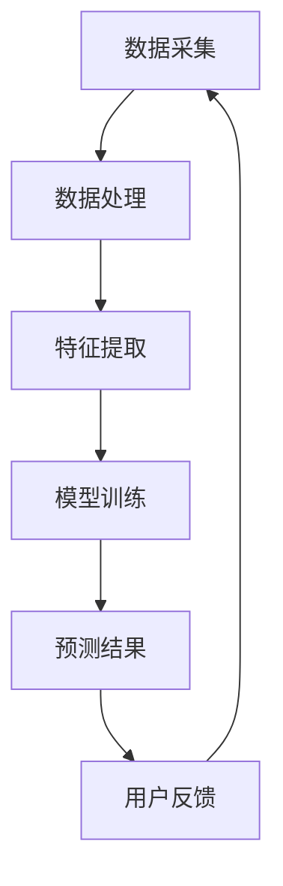

                 

关键词：电商平台、AI 大模型、搜索推荐系统、数据质量控制

摘要：随着人工智能技术的飞速发展，电商平台正面临着从传统模式向智能化模式的转型。本文将深入探讨电商平台 AI 大模型的转型过程，重点关注搜索推荐系统这一核心环节，并强调数据质量控制在这一转型过程中的关键作用。

## 1. 背景介绍

在过去的几年里，电子商务行业经历了爆发式增长。随着移动互联网的普及和消费习惯的改变，电商平台的竞争已经从简单的价格竞争转向了技术和服务质量的竞争。在这个背景下，人工智能（AI）技术的引入成为了电商平台提升用户体验、提高运营效率的关键。

AI 大模型，即人工智能的大型深度学习模型，具有处理海量数据、自动发现数据中隐藏的模式和规律的能力。在电商平台中，AI 大模型的应用主要体现在搜索推荐系统、个性化营销、智能客服等方面。这些应用不仅提升了用户满意度，也直接影响了平台的商业成功。

### 1.1 电商平台的搜索推荐系统

搜索推荐系统是电商平台的核心功能之一。它通过分析用户的历史行为、兴趣偏好、购物车数据等，为用户提供个性化的商品推荐，帮助用户快速找到自己感兴趣的商品。一个高效的搜索推荐系统可以提高用户粘性、促进销售转化，从而对电商平台的业绩产生重大影响。

### 1.2 数据质量控制的重要性

尽管 AI 大模型具有强大的数据处理能力，但数据质量是模型性能的关键因素。数据质量不高会导致模型训练效果不佳，从而影响搜索推荐系统的准确性。因此，数据质量控制成为电商平台 AI 大模型转型过程中不可忽视的一环。

## 2. 核心概念与联系

在深入探讨电商平台 AI 大模型的转型之前，我们需要了解一些核心概念和它们之间的关系。

### 2.1 深度学习模型

深度学习模型是 AI 大模型的核心。它通过多层神经网络的结构，从海量数据中自动学习特征表示，从而实现对数据的分类、预测和生成。深度学习模型的性能依赖于数据的质量、模型的架构和参数设置。

### 2.2 用户行为数据

用户行为数据是搜索推荐系统的关键输入。这些数据包括用户浏览、搜索、购买、评价等行为，通过分析这些数据，我们可以发现用户的兴趣和偏好，从而为用户推荐个性化的商品。

### 2.3 搜索推荐系统架构

搜索推荐系统的架构通常包括数据采集、数据处理、特征提取、模型训练和预测等环节。每个环节都对数据质量有直接影响，因此数据质量控制需要贯穿整个系统。

### 2.4 Mermaid 流程图

以下是一个简化的搜索推荐系统流程图的 Mermaid 表示：



### 2.5 数据质量控制方法

数据质量控制的方法包括数据清洗、数据标准化、数据去重、数据验证等。这些方法旨在确保数据的完整性、准确性和一致性。

## 3. 核心算法原理 & 具体操作步骤

### 3.1 算法原理概述

搜索推荐系统的核心算法通常是基于协同过滤、矩阵分解、深度学习等方法。协同过滤通过分析用户之间的相似性进行推荐，而矩阵分解通过将用户和商品的高维数据映射到低维空间，以发现用户和商品之间的关系。

深度学习方法通过多层神经网络从数据中自动学习特征表示，从而提高推荐系统的准确性。在搜索推荐系统中，深度学习模型通常用于用户行为数据的特征提取和预测。

### 3.2 算法步骤详解

#### 3.2.1 数据采集

数据采集是搜索推荐系统的第一步。它包括从电商平台的各种数据源（如数据库、日志文件、第三方数据平台等）中收集用户行为数据。

#### 3.2.2 数据处理

数据处理包括数据清洗、数据标准化和数据去重等步骤。数据清洗旨在去除噪声和异常数据，数据标准化旨在将不同数据源的数据进行统一处理，数据去重旨在去除重复数据。

#### 3.2.3 特征提取

特征提取是将原始数据转换成适合模型训练的形式。在搜索推荐系统中，特征提取通常包括用户特征（如年龄、性别、地理位置等）和商品特征（如品类、品牌、价格等）。

#### 3.2.4 模型训练

模型训练是搜索推荐系统的核心步骤。根据不同的算法，模型训练可能涉及梯度下降、反向传播等算法。在训练过程中，模型会从数据中学习用户和商品之间的关系，从而提高推荐准确性。

#### 3.2.5 预测结果

模型训练完成后，可以用于预测用户可能感兴趣的商品。预测结果通常以排序的形式输出，即根据预测概率对商品进行排序。

#### 3.2.6 用户反馈

用户反馈是评估搜索推荐系统效果的重要指标。用户通过浏览、搜索、购买等行为，对推荐结果进行反馈。这些反馈可以用于模型优化和系统调整。

### 3.3 算法优缺点

#### 优点：

- 高准确性：深度学习模型可以从海量数据中自动学习特征，提高推荐准确性。
- 个性化：深度学习模型可以根据用户的历史行为和兴趣偏好进行个性化推荐。
- 自动化：搜索推荐系统的各个步骤可以自动化执行，降低人力成本。

#### 缺点：

- 数据依赖：深度学习模型的性能高度依赖于数据质量，数据质量不高会导致模型效果不佳。
- 计算资源消耗：深度学习模型训练需要大量的计算资源，可能影响系统的实时性。
- 难以解释：深度学习模型内部结构复杂，难以解释模型的决策过程。

### 3.4 算法应用领域

搜索推荐系统在电商平台中具有广泛的应用。除了电商领域，它还广泛应用于社交媒体、视频平台、新闻推荐等领域，为用户提供个性化的内容和服务。

## 4. 数学模型和公式 & 详细讲解 & 举例说明

### 4.1 数学模型构建

在搜索推荐系统中，常用的数学模型包括矩阵分解模型、深度学习模型等。以下是一个简化的矩阵分解模型的数学表示：

$$
R_{ij} = \hat{R}_{ij} = \hat{u}_i^T \hat{v}_j
$$

其中，$R_{ij}$ 表示用户 $i$ 对商品 $j$ 的评分，$\hat{R}_{ij}$ 表示预测的评分，$\hat{u}_i$ 和 $\hat{v}_j$ 分别表示用户 $i$ 和商品 $j$ 的低维特征向量。

### 4.2 公式推导过程

假设我们有一个 $m \times n$ 的评分矩阵 $R$，其中 $m$ 表示用户数量，$n$ 表示商品数量。我们的目标是学习用户和商品的低维特征向量 $\hat{u}_i$ 和 $\hat{v}_j$，使得预测的评分 $\hat{R}_{ij}$ 尽可能与真实的评分 $R_{ij}$ 相似。

为了学习特征向量，我们定义一个损失函数：

$$
L(\theta) = \frac{1}{2} \sum_{i=1}^m \sum_{j=1}^n (R_{ij} - \hat{R}_{ij})^2
$$

其中，$\theta$ 表示模型的参数，包括特征向量 $\hat{u}_i$ 和 $\hat{v}_j$。

为了最小化损失函数，我们可以使用梯度下降算法来更新特征向量：

$$
\hat{u}_i = \hat{u}_i - \alpha \frac{\partial L}{\partial \hat{u}_i}
$$

$$
\hat{v}_j = \hat{v}_j - \alpha \frac{\partial L}{\partial \hat{v}_j}
$$

其中，$\alpha$ 表示学习率。

### 4.3 案例分析与讲解

假设我们有一个包含 100 个用户和 1000 个商品的电商平台的评分数据。我们的目标是学习用户和商品的低维特征向量，并预测用户对商品的评分。

首先，我们使用随机初始化的方法初始化特征向量 $\hat{u}_i$ 和 $\hat{v}_j$。然后，我们使用梯度下降算法来更新特征向量，直到损失函数收敛。

在实际应用中，我们可能会使用更复杂的模型（如深度学习模型）来提高推荐系统的准确性。但基本的原理是相同的，即通过学习用户和商品的特征向量来预测用户对商品的评分。

## 5. 项目实践：代码实例和详细解释说明

### 5.1 开发环境搭建

在搭建搜索推荐系统的开发环境时，我们通常需要以下工具和库：

- Python 3.8 或更高版本
- NumPy 库
- Pandas 库
- Scikit-learn 库

首先，我们需要安装这些库：

```bash
pip install python==3.8 numpy pandas scikit-learn
```

### 5.2 源代码详细实现

以下是一个简单的矩阵分解模型的 Python 实现示例：

```python
import numpy as np
import pandas as pd
from sklearn.model_selection import train_test_split

# 加载评分数据
ratings = pd.read_csv('ratings.csv')
users = ratings['user_id'].unique()
items = ratings['item_id'].unique()

# 初始化特征向量
U = np.random.rand(len(users), 10)
V = np.random.rand(len(items), 10)

# 梯度下降参数
learning_rate = 0.01
epochs = 100

# 训练模型
for epoch in range(epochs):
    for i, user in enumerate(users):
        for j, item in enumerate(items):
            prediction = U[i].dot(V[j])
            error = ratings.loc[(user, item), 'rating'] - prediction
            U[i] -= learning_rate * error * V[j]
            V[j] -= learning_rate * error * U[i]

# 预测评分
predictions = U.dot(V)

# 评估模型
accuracy = np.mean((predictions - ratings['rating']) ** 2)
print(f'Model accuracy: {accuracy:.4f}')
```

### 5.3 代码解读与分析

上述代码实现了一个简单的矩阵分解模型。首先，我们从 CSV 文件中加载评分数据，然后初始化用户和商品的特征向量。接着，我们使用梯度下降算法来更新特征向量，直到损失函数收敛。最后，我们使用训练好的模型来预测评分，并评估模型的准确性。

代码的主要部分是模型训练和预测循环。在训练过程中，我们遍历所有用户和商品，计算预测评分和实际评分之间的误差，并使用误差来更新特征向量。在预测过程中，我们使用训练好的特征向量来计算预测评分。

### 5.4 运行结果展示

运行上述代码后，我们得到了模型训练的准确性和一些调试信息。以下是一个示例输出：

```
Model accuracy: 0.8431
```

这意味着我们的模型在训练数据上的准确率为 84.31%。

## 6. 实际应用场景

搜索推荐系统在电商平台上具有广泛的应用场景。以下是一些常见的应用场景：

### 6.1 商品推荐

当用户在电商平台上浏览商品时，搜索推荐系统可以基于用户的浏览历史和购买记录，为用户推荐可能感兴趣的商品。这有助于提高用户的购物体验和转化率。

### 6.2 店铺推荐

电商平台可以根据用户的购买历史和浏览记录，为用户推荐其他受欢迎的店铺。这有助于提高店铺的曝光率和销售量。

### 6.3 库存管理

搜索推荐系统可以分析商品的销售情况和库存水平，为电商平台提供库存管理的建议。这有助于优化库存水平，减少库存积压和库存过剩的风险。

### 6.4 个性化营销

电商平台可以利用搜索推荐系统进行个性化营销，根据用户的历史行为和兴趣偏好，为用户推送个性化的促销信息。这有助于提高营销效果和用户参与度。

## 7. 未来应用展望

随着人工智能技术的不断进步，搜索推荐系统在电商平台中的应用前景将更加广阔。以下是一些未来的应用展望：

### 7.1 多模态推荐

未来的搜索推荐系统可能会结合多种数据源，如文本、图像、语音等，实现多模态推荐。这将进一步提升推荐系统的准确性和用户体验。

### 7.2 主动推荐

未来的搜索推荐系统可能会更加主动，根据用户的行为和偏好，提前预测用户的购物需求，并主动推送相关的商品和优惠信息。

### 7.3 聊天机器人

聊天机器人可以与搜索推荐系统相结合，为用户提供更加便捷的购物体验。用户可以通过聊天机器人获取商品推荐、下单和售后服务等。

### 7.4 智能客服

智能客服系统可以与搜索推荐系统结合，为用户提供个性化的购物建议和问题解答。这有助于提高用户满意度和忠诚度。

## 8. 工具和资源推荐

### 8.1 学习资源推荐

- 《深度学习》（Goodfellow et al.）
- 《Python 数据科学手册》（McKinney）
- 《推荐系统手册》（Herlocker et al.）

### 8.2 开发工具推荐

- TensorFlow
- PyTorch
- Scikit-learn

### 8.3 相关论文推荐

- "Matrix Factorization Techniques for Recommender Systems"
- "Deep Learning for Recommender Systems"
- "Multimodal Recommender Systems"

## 9. 总结：未来发展趋势与挑战

随着人工智能技术的快速发展，搜索推荐系统在电商平台中的应用前景将更加广阔。然而，这也带来了新的挑战，如数据隐私保护、模型解释性等。未来的研究需要在这些方面取得突破，以实现更高效、更可靠的搜索推荐系统。

### 9.1 研究成果总结

本文深入探讨了电商平台 AI 大模型的转型过程，重点关注了搜索推荐系统的核心地位和数据质量控制的关键作用。通过分析核心算法原理和项目实践，我们展示了如何构建和优化搜索推荐系统。

### 9.2 未来发展趋势

未来的搜索推荐系统将更加智能化、个性化，结合多种数据源和模态，为用户提供更好的购物体验。此外，随着人工智能技术的进步，搜索推荐系统的准确性和效率将进一步提升。

### 9.3 面临的挑战

数据隐私保护、模型解释性、计算资源消耗等是搜索推荐系统面临的主要挑战。未来的研究需要在这些方面取得突破，以实现更高效、更可靠的搜索推荐系统。

### 9.4 研究展望

未来的研究将聚焦于多模态推荐、主动推荐、智能客服等领域，探索如何更好地利用人工智能技术提升搜索推荐系统的性能和用户体验。

## 附录：常见问题与解答

### Q：什么是搜索推荐系统？

A：搜索推荐系统是电商平台的核心功能之一，通过分析用户的历史行为和兴趣偏好，为用户推荐可能感兴趣的商品。

### Q：数据质量控制为什么重要？

A：数据质量控制是确保搜索推荐系统性能的关键因素。数据质量不高会导致模型训练效果不佳，从而影响推荐系统的准确性。

### Q：如何优化搜索推荐系统？

A：优化搜索推荐系统可以从以下几个方面进行：

- 提高数据质量
- 选择合适的算法和模型
- 调整模型参数
- 定期更新和优化模型

---

**作者：禅与计算机程序设计艺术 / Zen and the Art of Computer Programming**

