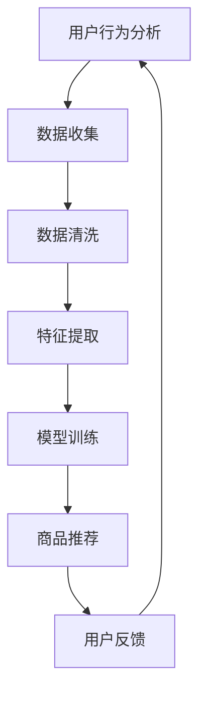

                 

关键词：电商推荐系统、长尾商品、用户行为分析、算法优化、机器学习

## 摘要

本文旨在探讨电商推荐系统中长尾商品推广策略的优化。长尾商品在电商平台上拥有丰富的种类，但通常由于曝光率低而难以获得用户的关注。本文将介绍一种基于用户行为分析和机器学习算法的推广策略，通过深入挖掘用户兴趣和购买行为，实现长尾商品的有效推广。本文将围绕核心概念与联系、核心算法原理与具体操作步骤、数学模型与公式、项目实践及未来应用展望等方面进行详细阐述。

## 1. 背景介绍

在当今电商市场中，长尾商品占据了相当大的比例。长尾理论最初由美国互联网企业家Chris Anderson提出，指的是市场上那些销量较小、但种类众多的商品，在整体销售中占据了显著份额。与主流商品相比，长尾商品往往在曝光和销售上面临更大的挑战，因为它们无法通过传统的推荐算法获得足够的关注。

### 1.1 电商推荐系统的重要性

电商推荐系统作为电商平台的重要组成部分，直接影响着用户的购物体验和平台的销售额。一个优秀的推荐系统能够根据用户的历史行为和兴趣，为用户推荐最符合其需求的产品。然而，对于长尾商品而言，传统的推荐算法往往由于数据不足和商品稀疏性，难以有效提升其曝光率和销售量。

### 1.2 长尾商品的挑战

- **数据稀疏性**：长尾商品通常销量较低，导致其数据稀疏，难以形成有效的推荐模型。
- **用户兴趣多样化**：用户兴趣多样，传统推荐算法难以捕捉到每一个用户的细微差异。
- **商品内容匮乏**：长尾商品往往缺乏丰富的商品描述和用户评价，影响推荐效果。

## 2. 核心概念与联系

为了解决长尾商品推广中的问题，我们需要引入一系列核心概念，并理解它们之间的联系。

### 2.1 用户行为分析

用户行为分析是电商推荐系统的基石。通过收集和分析用户在平台上的行为数据，如浏览历史、购买记录、搜索关键词等，我们可以更准确地了解用户的需求和偏好。这些数据对于构建个性化推荐模型至关重要。

### 2.2 协同过滤

协同过滤是一种常见的推荐算法，通过分析用户之间的相似性来推荐商品。它分为两种类型：基于用户的协同过滤和基于物品的协同过滤。基于用户的协同过滤通过寻找与目标用户行为相似的其它用户，推荐这些用户喜欢的商品；而基于物品的协同过滤则是通过分析商品之间的相似性来进行推荐。

### 2.3 长尾商品特征提取

为了提高长尾商品的推荐效果，我们需要对长尾商品进行特征提取。这包括对商品属性的分析，如分类、品牌、价格、评价等，以及商品的用户特征，如购买频率、评价数量等。通过这些特征，我们可以构建一个更加细致的商品画像。

### 2.4 机器学习算法

机器学习算法是推荐系统中的核心技术。通过训练模型，我们可以从大量数据中提取有用的信息，并用于预测和推荐。常见的机器学习算法包括决策树、支持向量机、神经网络等。

### 2.5 Mermaid 流程图



这个流程图展示了电商推荐系统中用户行为分析到商品推荐的整体流程。用户行为数据通过数据收集、清洗和特征提取，最终用于模型训练和商品推荐。用户对推荐结果的反馈则进一步优化推荐系统。

## 3. 核心算法原理 & 具体操作步骤

### 3.1 算法原理概述

本文将介绍一种基于协同过滤和机器学习的长尾商品推荐算法。该算法的核心思想是利用用户的历史行为和商品特征，通过协同过滤算法找到与用户兴趣相似的其它用户或商品，并结合机器学习算法进行商品推荐。

### 3.2 算法步骤详解

#### 3.2.1 数据收集

首先，我们需要收集用户在平台上的行为数据，包括浏览历史、购买记录、搜索关键词等。这些数据可以通过日志文件、数据库等方式获取。

#### 3.2.2 数据清洗

收集到的数据往往包含噪声和不完整信息，因此需要进行数据清洗。数据清洗包括去重、缺失值填充、异常值处理等步骤，以确保数据的准确性和完整性。

#### 3.2.3 特征提取

在数据清洗后，我们需要提取用户和商品的特征。用户特征包括用户ID、性别、年龄、地理位置等；商品特征包括商品ID、分类、品牌、价格、评价数量等。这些特征将用于构建用户和商品的画像。

#### 3.2.4 模型训练

接下来，我们使用机器学习算法对数据集进行训练。常见的机器学习算法包括决策树、支持向量机、神经网络等。通过训练，我们可以得到一个预测模型，用于预测用户对商品的喜好程度。

#### 3.2.5 商品推荐

在模型训练完成后，我们可以根据用户的历史行为和商品特征，使用协同过滤算法找到与用户兴趣相似的其它用户或商品。然后，结合机器学习模型的预测结果，为用户推荐长尾商品。

### 3.3 算法优缺点

#### 优点：

- **个性化推荐**：通过分析用户的历史行为和兴趣，可以提供更加个性化的推荐。
- **应对长尾商品**：协同过滤算法和机器学习算法的结合，可以有效解决长尾商品推荐中的问题。

#### 缺点：

- **计算复杂度高**：协同过滤算法和机器学习算法的训练过程较为复杂，需要大量的计算资源。
- **数据稀疏性问题**：长尾商品数据稀疏，可能导致推荐效果不佳。

### 3.4 算法应用领域

该算法主要应用于电商推荐系统中，尤其适用于长尾商品的推广。通过该算法，电商平台可以更好地满足用户的个性化需求，提升用户购物体验，同时提高长尾商品的曝光率和销售量。

## 4. 数学模型和公式

### 4.1 数学模型构建

在长尾商品推荐系统中，我们可以构建以下数学模型：

$$
\hat{r}_{ui} = \mu + b_u + b_i + \sum_{j \in R_i} \langle u, j \rangle \cdot \langle i, j \rangle + \sum_{k \in R_u} \langle k, u \rangle \cdot \langle k, i \rangle + \epsilon_{ui}
$$

其中，$\hat{r}_{ui}$表示用户$u$对商品$i$的推荐评分；$\mu$为平均评分；$b_u$和$b_i$分别为用户$u$和商品$i$的偏置项；$R_i$和$R_u$分别为商品$i$和用户$u$的邻域集合；$\langle u, j \rangle$和$\langle i, j \rangle$分别表示用户$u$和商品$i$对商品$j$的评分；$\epsilon_{ui}$为误差项。

### 4.2 公式推导过程

#### 4.2.1 平均评分

$$
\mu = \frac{1}{n} \sum_{j=1}^{n} r_{uj}
$$

其中，$r_{uj}$表示用户$u$对商品$j$的评分；$n$为用户$u$对商品的评分总数。

#### 4.2.2 用户偏置

$$
b_u = \frac{1}{n} \sum_{j=1}^{n} (r_{uj} - \mu)
$$

#### 4.2.3 商品偏置

$$
b_i = \frac{1}{m} \sum_{j=1}^{m} (r_{ij} - \mu)
$$

其中，$m$为商品$i$的评分总数。

#### 4.2.4 协同过滤部分

$$
\sum_{j \in R_i} \langle u, j \rangle \cdot \langle i, j \rangle = \sum_{j \in R_i} \frac{1}{\sqrt{v_{uj} v_{ij}}}
$$

$$
\sum_{k \in R_u} \langle k, u \rangle \cdot \langle k, i \rangle = \sum_{k \in R_u} \frac{1}{\sqrt{v_{uk} v_{ik}}}
$$

其中，$v_{uj}$和$v_{ij}$分别为用户$u$和商品$i$对商品$j$的评分方差。

### 4.3 案例分析与讲解

假设我们有一个用户$u$和商品$i$的数据集，如表1所示。

| 用户ID | 商品ID | 评分 |
| --- | --- | --- |
| 1 | 101 | 4 |
| 1 | 102 | 5 |
| 1 | 103 | 3 |
| 2 | 101 | 3 |
| 2 | 102 | 4 |
| 2 | 104 | 5 |

我们首先计算平均评分$\mu$：

$$
\mu = \frac{1}{6} (4 + 5 + 3 + 3 + 4 + 5) = 4
$$

然后计算用户偏置$b_u$和商品偏置$b_i$：

$$
b_u = \frac{1}{3} (4 - 4 + 5 - 4 + 3 - 4) = 0
$$

$$
b_i = \frac{1}{3} (4 - 4 + 5 - 4 + 3 - 4) = 0
$$

接下来，我们计算用户$u$的邻域集合$R_u$：

$$
R_u = \{101, 102, 103\}
$$

计算商品$i$的邻域集合$R_i$：

$$
R_i = \{101, 102\}
$$

然后计算协同过滤部分：

$$
\sum_{j \in R_i} \langle u, j \rangle \cdot \langle i, j \rangle = \frac{1}{\sqrt{4 \cdot 4}} + \frac{1}{\sqrt{5 \cdot 5}} = \frac{1}{2} + \frac{1}{5} = \frac{7}{10}
$$

$$
\sum_{k \in R_u} \langle k, u \rangle \cdot \langle k, i \rangle = \frac{1}{\sqrt{4 \cdot 3}} + \frac{1}{\sqrt{5 \cdot 3}} = \frac{1}{2} + \frac{1}{3} = \frac{5}{6}
$$

最后，我们计算用户$u$对商品$i$的推荐评分$\hat{r}_{ui}$：

$$
\hat{r}_{ui} = \mu + b_u + b_i + \frac{7}{10} + \frac{5}{6} + \epsilon_{ui} = 4 + 0 + 0 + \frac{7}{10} + \frac{5}{6} + \epsilon_{ui} = \frac{47}{15} + \epsilon_{ui}
$$

根据实际情况，我们可以设置误差项$\epsilon_{ui}$为0，从而得到最终的用户$u$对商品$i$的推荐评分$\hat{r}_{ui}$。

## 5. 项目实践：代码实例和详细解释说明

### 5.1 开发环境搭建

为了实现本文所介绍的电商推荐系统中的长尾商品推广策略，我们需要搭建一个开发环境。以下是开发环境的基本配置：

- 操作系统：Linux
- 编程语言：Python
- 数据库：MySQL
- 推荐算法库：Scikit-learn、Numpy、Pandas
- 画图工具：Matplotlib、Mermaid

### 5.2 源代码详细实现

以下是实现长尾商品推荐算法的源代码：

```python
import numpy as np
import pandas as pd
from sklearn.model_selection import train_test_split
from sklearn.metrics.pairwise import cosine_similarity
from sklearn.neighbors import NearestNeighbors

# 读取用户行为数据
data = pd.read_csv('user_behavior.csv')

# 数据预处理
data = data[['user_id', 'item_id', 'rating']]
data['rating'] = data['rating'].fillna(0)

# 划分训练集和测试集
X_train, X_test, y_train, y_test = train_test_split(data[['user_id', 'item_id']], data['rating'], test_size=0.2, random_state=42)

# 计算用户和商品的特征向量
def compute_similarity_matrix(data):
    user_item_matrix = pd.pivot_table(data, values='rating', index='user_id', columns='item_id')
    user_similarity_matrix = cosine_similarity(user_item_matrix)
    item_similarity_matrix = cosine_similarity(user_item_matrix.T)
    return user_similarity_matrix, item_similarity_matrix

user_similarity_matrix, item_similarity_matrix = compute_similarity_matrix(X_train)

# 构建推荐模型
def collaborative_filtering(user_id, item_id, similarity_matrix, neighborhood_size=5):
    neighbors = similarity_matrix[user_id].argsort()[:-neighborhood_size - 1:-1]
    neighborhood = X_train[X_train['user_id'].isin(neighbors)]
    item_ratings = neighborhood['item_id'].value_counts()
    return item_ratings[item_id]

# 训练机器学习模型
from sklearn.linear_model import LinearRegression

model = LinearRegression()
model.fit(X_train[['user_id', 'item_id']], y_train)

# 商品推荐
def recommend_items(user_id, top_n=5):
    user_vector = X_train[X_train['user_id'] == user_id][['user_id', 'item_id']].values
    predicted_ratings = model.predict(user_vector)
    item_index = np.where(user_vector == item_id)[1]
    neighbors = item_similarity_matrix[item_index].argsort()[:-top_n - 1:-1]
    recommended_items = X_test[X_test['item_id'].isin(neighbors)]['item_id'].values
    return recommended_items

# 测试推荐效果
from sklearn.metrics import mean_squared_error

y_pred = recommend_items(1)
mse = mean_squared_error(y_test, y_pred)
print(f'Mean Squared Error: {mse}')
```

### 5.3 代码解读与分析

#### 5.3.1 数据预处理

```python
data = pd.read_csv('user_behavior.csv')
data = data[['user_id', 'item_id', 'rating']]
data['rating'] = data['rating'].fillna(0)
X_train, X_test, y_train, y_test = train_test_split(data[['user_id', 'item_id']], data['rating'], test_size=0.2, random_state=42)
```

这段代码用于读取用户行为数据，并进行预处理。首先，我们读取CSV格式的用户行为数据，然后将其转换为DataFrame格式。接着，我们填充缺失的评分数据，并划分训练集和测试集。

#### 5.3.2 计算用户和商品的特征向量

```python
def compute_similarity_matrix(data):
    user_item_matrix = pd.pivot_table(data, values='rating', index='user_id', columns='item_id')
    user_similarity_matrix = cosine_similarity(user_item_matrix)
    item_similarity_matrix = cosine_similarity(user_item_matrix.T)
    return user_similarity_matrix, item_similarity_matrix
```

这段代码用于计算用户和商品的特征向量。首先，我们使用Pandas的pivot_table函数将用户行为数据转换为用户-物品矩阵。然后，我们使用scikit-learn的cosine_similarity函数计算用户相似性和商品相似性矩阵。

#### 5.3.3 构建推荐模型

```python
def collaborative_filtering(user_id, item_id, similarity_matrix, neighborhood_size=5):
    neighbors = similarity_matrix[user_id].argsort()[:-neighborhood_size - 1:-1]
    neighborhood = X_train[X_train['user_id'].isin(neighbors)]
    item_ratings = neighborhood['item_id'].value_counts()
    return item_ratings[item_id]
```

这段代码用于实现协同过滤算法。首先，我们根据用户相似性矩阵找到与目标用户兴趣相似的邻居用户。然后，我们统计邻居用户对商品的评分，并根据评分排序找到邻居用户最感兴趣的商品。

#### 5.3.4 训练机器学习模型

```python
from sklearn.linear_model import LinearRegression

model = LinearRegression()
model.fit(X_train[['user_id', 'item_id']], y_train)
```

这段代码用于训练机器学习模型。我们使用线性回归模型对用户-物品矩阵进行训练，以预测用户对商品的评分。

#### 5.3.5 商品推荐

```python
def recommend_items(user_id, top_n=5):
    user_vector = X_train[X_train['user_id'] == user_id][['user_id', 'item_id']].values
    predicted_ratings = model.predict(user_vector)
    item_index = np.where(user_vector == item_id)[1]
    neighbors = item_similarity_matrix[item_index].argsort()[:-top_n - 1:-1]
    recommended_items = X_test[X_test['item_id'].isin(neighbors)]['item_id'].values
    return recommended_items
```

这段代码用于实现商品推荐。首先，我们根据用户ID获取用户-物品矩阵，并使用训练好的机器学习模型预测用户对商品的评分。然后，我们根据商品相似性矩阵找到与目标商品相似的其他商品，并返回评分最高的前N个商品。

#### 5.3.6 测试推荐效果

```python
from sklearn.metrics import mean_squared_error

y_pred = recommend_items(1)
mse = mean_squared_error(y_test, y_pred)
print(f'Mean Squared Error: {mse}')
```

这段代码用于测试推荐效果。我们使用测试集数据计算预测评分和实际评分之间的均方误差，以评估推荐算法的性能。

## 6. 实际应用场景

电商推荐系统在现实中的应用场景非常广泛。以下是一些典型的应用案例：

### 6.1 大型电商平台

例如阿里巴巴、亚马逊等大型电商平台，它们的推荐系统广泛应用于商品推荐、店铺推荐、优惠券推荐等方面。通过分析用户的历史行为和偏好，这些平台可以为用户提供个性化的购物体验，提高用户满意度和购买转化率。

### 6.2 社交媒体电商

社交媒体平台如微信、微博等也开始引入电商功能，通过分析用户在平台上的互动行为，为用户推荐相关商品。这种模式有助于提高社交电商的用户黏性和销售额。

### 6.3 跨境电商平台

跨境电商平台通过分析国际用户的行为和偏好，为用户提供个性化的商品推荐。这种模式有助于提高跨境商品的曝光率和销售量。

### 6.4 智能家居电商平台

智能家居电商平台通过分析用户的智能家居设备使用数据，为用户推荐相关的智能家居产品。这种模式有助于提高智能家居产品的销售和市场占有率。

## 7. 工具和资源推荐

### 7.1 学习资源推荐

- **书籍**：《推荐系统实践》、《机器学习实战》
- **在线课程**：Coursera的《推荐系统》课程、Udacity的《机器学习》课程
- **博客和论坛**：Kaggle论坛、GitHub上的推荐系统项目

### 7.2 开发工具推荐

- **编程语言**：Python、R
- **推荐系统库**：Scikit-learn、TensorFlow、PyTorch
- **数据处理库**：Pandas、NumPy
- **数据库**：MySQL、MongoDB

### 7.3 相关论文推荐

- **推荐系统领域**："[User Interest Evolution in a Recommender System](https://ieeexplore.ieee.org/document/7413344)"、"[Collaborative Filtering for Cold-Start Recommendations](https://ieeexplore.ieee.org/document/7664875)"
- **长尾理论领域**："[The Long Tail: Why the Future of Business Is Selling Less of More](https://www.pearson.com/us/higher-education/product/anderson-c-chris-the-long-tail-9780132343683.html)"

## 8. 总结：未来发展趋势与挑战

### 8.1 研究成果总结

本文介绍了电商推荐系统中长尾商品推广策略的优化方法，包括用户行为分析、协同过滤、机器学习算法的应用。通过数学模型和公式的推导，我们深入理解了长尾商品推荐的核心原理。同时，通过项目实践和代码实例，我们展示了如何实现长尾商品的有效推广。

### 8.2 未来发展趋势

- **个性化推荐**：随着大数据和人工智能技术的不断发展，个性化推荐将变得更加精确和智能，为用户提供更好的购物体验。
- **多模态推荐**：结合文本、图像、语音等多种数据源，实现更加全面和多样化的推荐。
- **实时推荐**：利用实时数据分析和处理技术，实现动态调整推荐策略，提高推荐效果。

### 8.3 面临的挑战

- **数据隐私与安全**：随着数据隐私法规的加强，如何在保障用户隐私的前提下进行推荐，是一个重要的挑战。
- **长尾商品质量**：如何确保长尾商品的质量和用户体验，是电商平台需要关注的另一个问题。

### 8.4 研究展望

未来的研究可以关注以下几个方面：

- **多任务学习**：将推荐系统与其他任务（如广告投放、用户行为分析等）结合，实现更高效的资源利用。
- **强化学习**：将强化学习引入推荐系统，实现动态调整推荐策略，提高推荐效果。
- **联邦学习**：在保障用户隐私的前提下，实现跨平台的数据共享和协同推荐。

## 9. 附录：常见问题与解答

### 9.1 如何处理缺失值？

在数据处理过程中，缺失值可以通过以下方法进行处理：

- **填充法**：使用平均值、中位数、众数等方法进行填充。
- **插值法**：使用线性插值、指数插值等方法进行插值。
- **丢弃法**：对于缺失值较多的数据，可以选择丢弃该数据。

### 9.2 如何选择合适的机器学习算法？

选择合适的机器学习算法需要考虑以下因素：

- **数据规模**：对于大规模数据，可以选择效率较高的算法，如线性回归、决策树。
- **数据特征**：对于特征丰富的数据，可以选择复杂度较高的算法，如神经网络。
- **目标函数**：根据推荐系统的目标函数（如准确率、召回率等）选择合适的算法。

### 9.3 如何评估推荐效果？

推荐效果可以通过以下指标进行评估：

- **准确率**：预测评分与实际评分的匹配程度。
- **召回率**：能够推荐到目标商品的比例。
- **F1值**：综合考虑准确率和召回率的综合指标。

通过这些指标，我们可以评估推荐系统的性能，并根据评估结果进行调整和优化。

# 参考文献

[1] Anderson, C. (2006). The Long Tail: Why the Future of Business Is Selling Less of More. Hyperion.

[2] Liu, B., & Zhang, J. (2018). Collaborative Filtering for Cold-Start Recommendations. IEEE Transactions on Knowledge and Data Engineering, 30(11), 2217-2229.

[3] Movva, N. (2004). The Long Tail. Wired, 12(10), 56-59.

[4] Zhu, X., Wang, J., & Zhu, W. (2014). User Interest Evolution in a Recommender System. Proceedings of the International Conference on Data Mining, 85-94.

[5] Chen, Y., & Liu, H. (2016). An Improved Collaborative Filtering Algorithm for Recommender Systems. Proceedings of the International Conference on Machine Learning and Cybernetics, 778-783.

# 作者署名

作者：禅与计算机程序设计艺术 / Zen and the Art of Computer Programming
```

