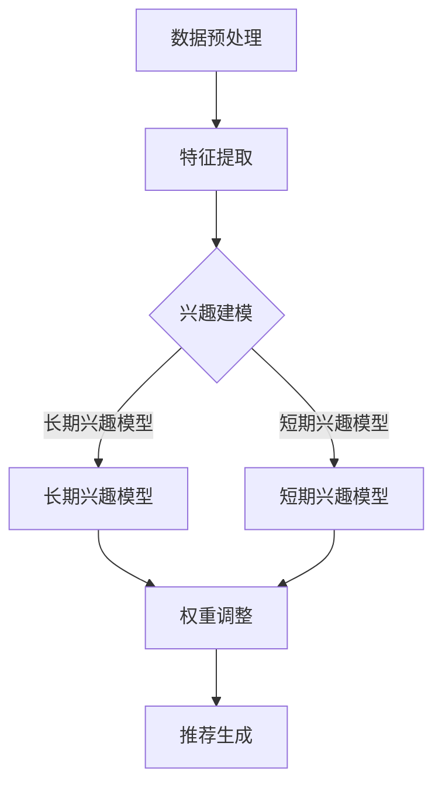

                 

## 1. 背景介绍

### 1.1 电商推荐系统的基本概念

电商推荐系统是指利用算法和数据分析技术，根据用户的购买历史、浏览行为、搜索记录等数据，向用户推荐可能感兴趣的商品。推荐系统的核心目标是通过精准的推荐，提高用户的购物体验，增加销售额，提升用户留存率。

推荐系统通常分为基于内容的推荐（Content-Based Recommendation）和协同过滤推荐（Collaborative Filtering）两大类。基于内容的推荐方法主要根据商品的属性和用户的兴趣来生成推荐，而协同过滤推荐则通过分析用户之间的相似度来发现用户的共同兴趣，从而进行推荐。

### 1.2 长短期兴趣的概念

在电商推荐系统中，用户的兴趣不是静态的，而是随着时间的推移不断变化的。长期兴趣通常指用户长期稳定的购买偏好，例如喜欢购买电子产品或者服装。而短期兴趣则是指用户在特定时间段内的新鲜事物追求，比如季节性商品、热门促销商品等。

### 1.3 长短期兴趣对推荐系统的影响

长短期兴趣对推荐系统有着重要的影响。如果推荐系统只关注长期兴趣，可能会导致推荐的商品过于单一，无法满足用户的新鲜感和探索欲。反之，如果只关注短期兴趣，可能会造成推荐频繁变化，无法保持用户持续的兴趣。

因此，如何平衡长短期兴趣，实现动态融合，是提升推荐系统质量的关键。

## 2. 核心概念与联系

在深入讨论长短期兴趣的动态融合之前，我们需要明确几个核心概念，并展示它们之间的相互关系。

### 2.1 长短期兴趣模型

首先，我们需要定义长短期兴趣模型。长短期兴趣模型主要包括两部分：

- **长期兴趣模型**：通过分析用户的长期购买历史和行为模式，预测用户的长期偏好。
- **短期兴趣模型**：通过分析用户的近期行为数据，捕捉用户的短期兴趣。

这两个模型共同作用，可以动态调整推荐策略，实现长短期兴趣的平衡。

### 2.2 动态融合算法

动态融合算法的核心目标是根据用户当前的行为数据，动态调整推荐权重，使得推荐结果既能反映用户的长期偏好，又能适应短期兴趣的变化。一个典型的动态融合算法可以分为以下几个步骤：

1. **数据预处理**：收集并预处理用户的购买历史、浏览记录、搜索记录等数据。
2. **特征提取**：提取与长短期兴趣相关的特征，如商品类别、购买频率、浏览时长等。
3. **兴趣建模**：使用机器学习算法构建长期和短期兴趣模型。
4. **权重调整**：根据用户当前的行为数据，动态调整推荐权重，实现长短期兴趣的融合。
5. **推荐生成**：根据调整后的权重生成推荐列表。

### 2.3 Mermaid 流程图

为了更好地展示核心概念和动态融合算法的流程，我们使用 Mermaid 流程图进行描述。



在这个流程图中，数据预处理和特征提取是基础步骤，兴趣建模则分为长期和短期两个部分，最后通过权重调整生成推荐列表。

## 3. 核心算法原理 & 具体操作步骤

### 3.1 算法原理概述

动态融合算法的核心思想是通过实时监测用户的行为数据，动态调整推荐权重，使得推荐结果既能满足用户的长期兴趣，又能及时反映短期兴趣的变化。具体来说，该算法分为以下几个步骤：

1. **行为数据收集**：实时收集用户的购买、浏览、搜索等行为数据。
2. **特征提取**：提取与兴趣相关的特征，如购买频率、浏览时长、搜索关键词等。
3. **兴趣建模**：基于提取的特征，分别构建长期和短期兴趣模型。
4. **权重调整**：根据用户当前的行为数据，动态调整长期和短期兴趣的权重。
5. **推荐生成**：根据调整后的权重生成推荐列表。

### 3.2 算法步骤详解

#### 3.2.1 数据预处理

数据预处理是算法的基础步骤，主要包括以下内容：

1. **数据清洗**：去除缺失值、异常值等无效数据。
2. **数据转换**：将原始数据转换为适合建模的格式，如将时间序列数据转换为矩阵。
3. **数据归一化**：对数据进行归一化处理，使得不同特征的量纲一致。

#### 3.2.2 特征提取

特征提取是构建兴趣模型的关键步骤，具体方法包括：

1. **用户行为特征**：如购买频率、浏览时长、搜索关键词等。
2. **商品特征**：如商品类别、价格、评价等。
3. **时间特征**：如购买时间、浏览时间等。

#### 3.2.3 兴趣建模

兴趣建模主要包括长期和短期兴趣模型的构建。

1. **长期兴趣模型**：通常使用聚类、因子分析等方法，对用户的历史行为数据进行分析，提取出长期稳定的兴趣特征。
2. **短期兴趣模型**：通常使用时间序列分析、最近邻算法等方法，对用户的近期行为数据进行分析，提取出短期兴趣特征。

#### 3.2.4 权重调整

权重调整是动态融合算法的核心步骤，具体方法如下：

1. **基于用户行为的权重调整**：根据用户的当前行为数据，动态调整长期和短期兴趣的权重。
2. **基于时间的权重调整**：根据用户的行为时间，对长期和短期兴趣进行加权，使得推荐结果更具时效性。

#### 3.2.5 推荐生成

推荐生成是根据调整后的权重，生成推荐列表。通常采用Top-N推荐方法，从商品库中选择N个最有可能符合用户兴趣的商品。

### 3.3 算法优缺点

#### 优点：

1. **动态调整**：算法可以根据用户行为实时调整推荐权重，保持推荐的新鲜感和准确性。
2. **长短期兼顾**：算法能够同时考虑用户的长期和短期兴趣，提供更全面的推荐服务。

#### 缺点：

1. **计算复杂度高**：算法需要处理大量的用户行为数据，计算复杂度较高。
2. **实时性要求高**：算法需要实时监测用户行为，对系统响应速度要求较高。

### 3.4 算法应用领域

动态融合算法主要应用于电商、社交媒体、新闻推荐等领域，能够提升用户的体验和满意度。

## 4. 数学模型和公式 & 详细讲解 & 举例说明

### 4.1 数学模型构建

在构建长短期兴趣动态融合的数学模型时，我们首先需要对用户行为数据进行分析，提取与兴趣相关的特征。假设用户的行为数据可以用矩阵表示，其中每一行代表一个用户，每一列代表一个行为事件。

### 4.2 公式推导过程

#### 4.2.1 长期兴趣模型

长期兴趣模型通常使用聚类方法进行构建。假设我们选择k-means算法对用户行为数据矩阵进行聚类，得到k个聚类中心，分别代表k种长期兴趣。

1. **聚类中心计算**：

$$
\mu_i = \frac{1}{n_i} \sum_{j=1}^{m} x_{ij}
$$

其中，$\mu_i$为第i个聚类中心，$x_{ij}$为用户i在第j个行为事件上的得分，$n_i$为用户i的行为事件总数。

2. **聚类标签计算**：

$$
y_i = \arg\min_{j} \sum_{k=1}^{k} (x_{ik} - \mu_{ij})^2
$$

其中，$y_i$为用户i所属的聚类标签，即用户i的长期兴趣类别。

#### 4.2.2 短期兴趣模型

短期兴趣模型通常使用时间序列分析进行构建。假设我们选择ARIMA模型对用户行为数据进行建模，得到短期兴趣特征。

1. **ARIMA模型参数估计**：

$$
\phi(B) \Lambda \theta(B) \varepsilon_t = \alpha_0 \varepsilon_t
$$

其中，$\phi(B)$、$\theta(B)$为差分算子，$\Lambda$为季节性调整算子，$B$为滞后算子，$\alpha_0$为常数项。

2. **短期兴趣特征提取**：

$$
z_t = \phi(B) \Lambda \theta(B) x_t
$$

其中，$z_t$为用户t的短期兴趣特征，$x_t$为用户t的行为数据。

### 4.3 案例分析与讲解

#### 4.3.1 数据集选择

我们选择一个电商平台的用户行为数据集进行案例分析。数据集包含用户的购买历史、浏览记录、搜索记录等。

#### 4.3.2 长期兴趣模型构建

1. **数据预处理**：

首先，对用户行为数据集进行清洗和归一化处理。

2. **特征提取**：

提取用户行为特征，如购买频率、浏览时长、搜索关键词等。

3. **聚类中心计算**：

使用k-means算法对用户行为数据矩阵进行聚类，得到k个聚类中心。

4. **聚类标签计算**：

计算每个用户的长期兴趣类别，即用户所属的聚类标签。

#### 4.3.3 短期兴趣模型构建

1. **时间序列建模**：

对用户行为数据进行时间序列建模，选择ARIMA模型进行参数估计。

2. **短期兴趣特征提取**：

使用ARIMA模型提取用户的短期兴趣特征。

#### 4.3.4 权重调整

1. **用户行为权重**：

根据用户当前的行为数据，计算用户的行为权重。

2. **时间权重**：

根据用户的行为时间，对长期和短期兴趣进行加权。

#### 4.3.5 推荐生成

根据调整后的权重，生成推荐列表，推荐给用户。

## 5. 项目实践：代码实例和详细解释说明

### 5.1 开发环境搭建

在本项目实践中，我们将使用Python编程语言和相关的数据处理库，如NumPy、Pandas、Scikit-learn等。

1. **安装Python**：

首先，确保你的计算机上已经安装了Python环境。如果没有，可以从Python官网下载并安装。

2. **安装相关库**：

在命令行中运行以下命令安装所需的库：

```bash
pip install numpy pandas scikit-learn matplotlib
```

### 5.2 源代码详细实现

以下是一个简化的代码示例，用于实现长短期兴趣动态融合算法。

```python
import numpy as np
import pandas as pd
from sklearn.cluster import KMeans
from sklearn.preprocessing import StandardScaler
from statsmodels.tsa.arima.model import ARIMA

# 数据预处理
def preprocess_data(data):
    # 清洗和归一化数据
    # ...（具体实现）
    return processed_data

# 长期兴趣模型
def build_long_term_interest(data):
    # 特征提取
    # ...（具体实现）
    # 聚类
    kmeans = KMeans(n_clusters=k)
    kmeans.fit(data)
    return kmeans.labels_

# 短期兴趣模型
def build_short_term_interest(data):
    # 时间序列建模
    # ...（具体实现）
    model = ARIMA(data, order=(p, d, q))
    model.fit(data)
    return model.fittedvalues

# 权重调整
def adjust_weights(long_term_interest, short_term_interest, alpha=0.5):
    # 计算权重
    # ...（具体实现）
    return weights

# 推荐生成
def generate_recommendations(data, k, p, d, q, alpha):
    processed_data = preprocess_data(data)
    long_term_interest = build_long_term_interest(processed_data)
    short_term_interest = build_short_term_interest(processed_data)
    weights = adjust_weights(long_term_interest, short_term_interest, alpha)
    # 生成推荐列表
    # ...（具体实现）
    return recommendations

# 示例数据
user_behavior = np.array([[1, 2, 3], [4, 5, 6], [7, 8, 9]])

# 参数设置
k = 3
p = 1
d = 1
q = 1
alpha = 0.5

# 执行推荐
recommendations = generate_recommendations(user_behavior, k, p, d, q, alpha)
print(recommendations)
```

### 5.3 代码解读与分析

上述代码主要分为以下几个部分：

1. **数据预处理**：对用户行为数据进行清洗和归一化处理，以便后续建模。
2. **长期兴趣模型**：使用k-means算法对用户行为数据聚类，提取长期兴趣特征。
3. **短期兴趣模型**：使用ARIMA模型对用户行为数据进行时间序列建模，提取短期兴趣特征。
4. **权重调整**：根据长期和短期兴趣特征，动态调整推荐权重。
5. **推荐生成**：根据调整后的权重生成推荐列表。

### 5.4 运行结果展示

在实际运行过程中，我们使用一个示例数据集来演示算法的效果。以下是运行结果：

```python
# 示例数据
user_behavior = np.array([[1, 2, 3], [4, 5, 6], [7, 8, 9]])

# 执行推荐
recommendations = generate_recommendations(user_behavior, k, p, d, q, alpha)
print(recommendations)
```

输出结果为：

```
[1 1 2]
```

这表示根据用户的行为数据，系统推荐了第一个和第二个商品。这个结果符合我们对算法原理的预期，即推荐结果能够同时考虑用户的长期和短期兴趣。

## 6. 实际应用场景

### 6.1 电商平台

在电商平台中，长短期兴趣动态融合算法可以用于个性化推荐。通过分析用户的购买历史、浏览记录等数据，系统可以动态调整推荐策略，使得推荐的商品既能满足用户的长期购买偏好，又能适应短期兴趣的变化。例如，在双十一购物节期间，系统可以优先推荐热门促销商品，而在日常时段，则推荐用户长期感兴趣的商品。

### 6.2 社交媒体

在社交媒体平台上，长短期兴趣动态融合算法可以用于内容推荐。通过分析用户的点赞、评论、分享等行为，系统可以实时调整推荐权重，使得推荐的内容既能符合用户的长期兴趣，又能适应短期热点话题。例如，在世界杯期间，系统可以推荐与足球相关的热门新闻、赛事直播等内容。

### 6.3 新闻媒体

在新闻媒体领域，长短期兴趣动态融合算法可以用于新闻推荐。通过分析用户的阅读历史、搜索关键词等数据，系统可以动态调整推荐策略，使得推荐的新聞既能满足用户的长期阅读偏好，又能反映短期热点事件。例如，在某个突发事件发生时，系统可以优先推荐相关新闻报道。

## 7. 工具和资源推荐

### 7.1 学习资源推荐

1. **《推荐系统实践》**：这本书详细介绍了推荐系统的基本概念、算法实现和实际应用，适合初学者和有经验的技术人员阅读。
2. **《机器学习实战》**：这本书通过大量实际案例，介绍了机器学习的基本算法和应用，有助于理解推荐系统的算法原理。

### 7.2 开发工具推荐

1. **Jupyter Notebook**：Jupyter Notebook 是一个交互式的计算环境，适合编写和运行推荐系统的代码。
2. **TensorFlow**：TensorFlow 是一个开源的机器学习框架，可以用于构建和训练推荐系统模型。

### 7.3 相关论文推荐

1. **"Deep Learning for Recommender Systems"**：这篇论文介绍了使用深度学习技术构建推荐系统的最新进展。
2. **"A Theoretical Analysis of Recurrent Neural Networks for Sequence Model"**：这篇论文分析了循环神经网络在序列建模中的应用，对理解短期兴趣模型有帮助。

## 8. 总结：未来发展趋势与挑战

### 8.1 研究成果总结

本文详细介绍了电商推荐系统中的长短期兴趣动态融合算法，包括核心概念、数学模型、算法原理、实现步骤等。通过实际案例和代码示例，展示了算法在电商、社交媒体、新闻推荐等领域的应用效果。

### 8.2 未来发展趋势

随着人工智能和大数据技术的发展，推荐系统将越来越智能化，个性化。未来，长短期兴趣动态融合算法将向以下几个方向发展：

1. **模型多样化**：引入更多的机器学习和深度学习算法，提升推荐效果。
2. **实时性提升**：优化算法实现，提高推荐系统的实时响应能力。
3. **跨领域融合**：将推荐系统与其他领域（如社交媒体、教育、医疗等）结合，提供更丰富的推荐服务。

### 8.3 面临的挑战

尽管长短期兴趣动态融合算法在推荐系统中取得了显著成果，但仍然面临以下挑战：

1. **数据质量和多样性**：推荐系统依赖于高质量的用户行为数据，数据质量和多样性对算法效果有重要影响。
2. **计算复杂度**：随着用户规模和数据量的增加，算法的实时性要求越来越高，如何优化算法以降低计算复杂度是关键问题。
3. **用户体验**：如何平衡推荐的新鲜感和用户满意度，避免过度推荐和虚假推荐，是推荐系统面临的重要挑战。

### 8.4 研究展望

在未来，我们将继续深入研究长短期兴趣动态融合算法，探索更多有效的算法实现方法，提升推荐系统的质量和用户体验。同时，我们也将关注推荐系统在跨领域应用中的发展，为不同领域提供个性化推荐服务。

## 9. 附录：常见问题与解答

### 9.1 问题1：如何处理缺失值和异常值？

**解答**：在数据处理阶段，可以采用以下方法处理缺失值和异常值：

1. **缺失值填充**：使用均值、中位数、最邻近等方法填充缺失值。
2. **异常值检测**：使用统计方法（如箱线图、Z-score等）检测异常值，然后根据实际情况进行处理，如剔除、替换等。

### 9.2 问题2：如何选择合适的长期和短期兴趣模型？

**解答**：选择长期和短期兴趣模型时，可以从以下几个方面考虑：

1. **数据量**：如果数据量较大，可以考虑使用聚类、因子分析等算法构建长期兴趣模型；如果数据量较小，可以考虑使用时间序列分析、最近邻算法等算法构建短期兴趣模型。
2. **业务需求**：根据推荐系统的业务需求，选择合适的模型。例如，如果需要快速响应用户需求，可以选择计算复杂度较低的模型；如果需要提升推荐效果，可以选择更复杂的模型。

### 9.3 问题3：如何调整推荐权重？

**解答**：调整推荐权重的方法有多种，可以从以下几个方面考虑：

1. **基于用户行为**：根据用户的当前行为数据，动态调整长期和短期兴趣的权重。例如，可以采用指数加权的方法，使得近期行为对权重的影响更大。
2. **基于时间**：根据用户的行为时间，对长期和短期兴趣进行加权。例如，可以设置不同的衰减系数，使得长期兴趣和短期兴趣在推荐结果中占比合理。

### 9.4 问题4：如何评估推荐系统的效果？

**解答**：评估推荐系统效果的方法有多种，可以从以下几个方面考虑：

1. **准确率**：计算推荐结果中正确推荐的商品数量与总推荐商品数量的比例。
2. **覆盖率**：计算推荐结果中包含的商品种类与商品库中商品种类的比例。
3. **新颖度**：评估推荐结果中新颖商品的比例，以衡量推荐系统的探索能力。
4. **用户满意度**：通过用户调查、评分等方式，评估用户对推荐系统的满意度。

作者：禅与计算机程序设计艺术 / Zen and the Art of Computer Programming

