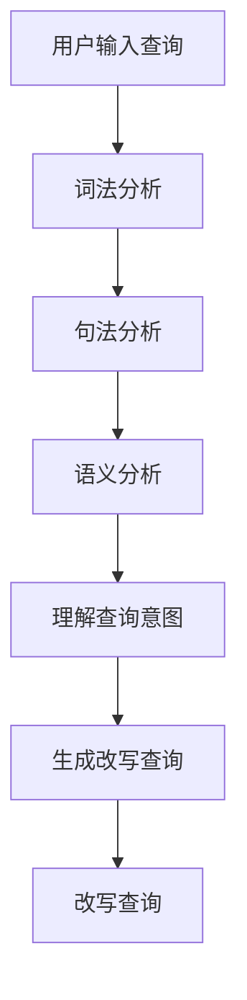

                 

关键词：电商搜索，Query意图理解，Query改写，自然语言处理，机器学习，信息检索，用户行为分析

## 摘要

本文深入探讨了电商搜索中的Query意图理解与改写技术。在电商环境中，用户的查询意图常常含糊不清，理解用户意图是提升搜索质量和用户体验的关键。文章首先介绍了Query意图理解的背景和重要性，随后详细阐述了当前主流的Query意图理解算法及其工作原理。接着，文章重点介绍了Query改写技术，包括其概念、方法、应用场景及效果评估。此外，本文还通过实际项目实践展示了这些技术的应用，并对未来的发展进行了展望。

## 1. 背景介绍

随着互联网的普及和电子商务的蓬勃发展，电商搜索已经成为用户获取商品信息的重要途径。然而，电商搜索面临的挑战之一是如何准确理解用户的查询意图。用户输入的Query（查询）往往不完整、不准确，或者存在歧义。这导致搜索结果往往不能完全满足用户的需求，影响了用户的购物体验。

### 1.1 Query意图理解的挑战

理解用户的查询意图是电商搜索的核心挑战之一。首先，用户查询的多样性和复杂性使得构建统一的意图理解模型变得非常困难。例如，用户可能通过简短的词语来表达复杂的购物需求，如“跑步鞋舒适”。这个Query可能涉及多个维度，如运动类型、品牌、价格区间等。其次，用户的查询意图可能是动态变化的，尤其是在用户浏览、对比商品的过程中。此外，用户的查询意图还可能受到语言习惯、文化背景等因素的影响。

### 1.2 Query改写的重要性

为了解决用户查询意图理解的问题，Query改写技术应运而生。Query改写的目标是通过对原始查询进行结构化分析，生成更加准确和完整的查询，从而提高搜索系统的准确性和效率。Query改写不仅可以提高搜索结果的匹配度，还可以帮助搜索引擎更好地理解用户的意图，为用户提供更加个性化的搜索体验。

## 2. 核心概念与联系

### 2.1 Query意图理解

Query意图理解是指通过自然语言处理技术，从用户输入的原始查询中提取出用户意图的过程。这一过程通常包括词法分析、句法分析和语义分析等步骤。词法分析是对查询进行分词处理，提取出查询中的关键词；句法分析则是对查询的语法结构进行分析，理解查询的构成；语义分析则是从词语和句子的层面上深入理解用户的意图。

### 2.2 Query改写

Query改写是在理解用户意图的基础上，对原始查询进行结构化处理，生成新的查询的过程。Query改写可以基于不同的技术路线，如规则方法、机器学习方法、深度学习方法等。改写后的查询通常更加精确和完整，能够更好地满足用户的购物需求。

### 2.3 Query意图理解与改写的联系

Query意图理解与Query改写是紧密相连的两个过程。Query意图理解是Query改写的前提和基础，只有准确理解用户的查询意图，才能生成合理的改写结果。而Query改写则是Query意图理解的具体应用，通过对原始查询进行改写，使得搜索系统能够更准确地匹配用户的需求。

## 2.4 Mermaid 流程图



## 3. 核心算法原理 & 具体操作步骤

### 3.1 算法原理概述

Query意图理解与改写技术涉及多个算法原理，包括自然语言处理（NLP）、机器学习和信息检索等。以下是这些算法的基本原理：

- **自然语言处理（NLP）**：NLP 是处理人类语言与计算机之间的交互的技术。在 Query 意图理解中，NLP 技术用于对用户输入的查询进行分词、词性标注、句法分析和语义分析。
  
- **机器学习**：机器学习是使用算法从数据中学习模式的技术。在 Query 意图理解中，可以使用机器学习方法来训练模型，从大量的用户查询数据中学习用户意图。

- **信息检索**：信息检索是搜索系统从大量数据中检索出与用户查询相关的信息的过程。在 Query 改写中，信息检索技术用于从检索到的数据中提取出相关的关键词和上下文信息。

### 3.2 算法步骤详解

#### 3.2.1 Query 意图理解

1. **词法分析**：将原始查询文本进行分词处理，提取出关键词和词组。
2. **句法分析**：对查询的语法结构进行分析，识别出查询的组成部分，如主语、谓语、宾语等。
3. **语义分析**：从词语和句子的层面上深入理解用户的意图，识别出查询的主题、意图和上下文信息。

#### 3.2.2 Query 改写

1. **意图识别**：通过机器学习模型对查询意图进行识别，确定用户查询的主要目标和意图。
2. **关键词提取**：从查询中提取出与用户意图相关的关键词和词组。
3. **改写规则生成**：根据意图识别和关键词提取的结果，生成改写规则，用于对原始查询进行改写。
4. **改写查询**：根据改写规则对原始查询进行结构化处理，生成新的查询。

### 3.3 算法优缺点

#### 3.3.1 Query 意图理解

**优点**：
- 可以准确识别用户的查询意图，提高搜索结果的准确性。
- 可以对用户的查询意图进行个性化处理，提供更优质的搜索体验。

**缺点**：
- 需要大量的训练数据和计算资源。
- 对用户的查询意图理解可能存在偏差，尤其在复杂查询场景下。

#### 3.3.2 Query 改写

**优点**：
- 可以提高搜索结果的匹配度，降低用户查询的难度。
- 可以根据用户的意图和需求生成个性化的搜索结果。

**缺点**：
- 改写后的查询可能无法完全满足用户的需求，尤其是当用户查询意图不明确时。
- 需要复杂的改写规则和算法支持，开发难度较大。

### 3.4 算法应用领域

Query意图理解与改写技术广泛应用于电商、搜索引擎、智能问答等领域。以下是一些典型的应用场景：

- **电商搜索**：通过理解用户的查询意图，生成更精准的搜索结果，提升用户体验。
- **搜索引擎**：通过改写用户的查询，提高搜索结果的匹配度和准确性。
- **智能问答**：通过理解用户的提问意图，提供更准确的答案和解决方案。

## 4. 数学模型和公式 & 详细讲解 & 举例说明

### 4.1 数学模型构建

在 Query 意图理解与改写技术中，常用的数学模型包括自然语言处理模型、机器学习模型和信息检索模型等。

#### 4.1.1 自然语言处理模型

自然语言处理模型通常基于深度神经网络（DNN）或循环神经网络（RNN）等深度学习技术。以下是一个简单的 RNN 模型构建：

$$
h_t = \sigma(W_h \cdot [h_{t-1}, x_t] + b_h)
$$

其中，$h_t$ 是时间步 $t$ 的隐藏状态，$x_t$ 是输入词向量，$W_h$ 是权重矩阵，$b_h$ 是偏置项，$\sigma$ 是激活函数。

#### 4.1.2 机器学习模型

机器学习模型通常用于意图识别和关键词提取。以下是一个简单的逻辑回归模型：

$$
P(y=1) = \sigma(W \cdot x + b)
$$

其中，$y$ 是二分类标签，$x$ 是特征向量，$W$ 是权重矩阵，$b$ 是偏置项，$\sigma$ 是 sigmoid 函数。

#### 4.1.3 信息检索模型

信息检索模型通常用于改写查询。以下是一个简单的 BM25 模型：

$$
score = \frac{(k_1 + 1) \cdot f_t \cdot (k_2 + 1)}{f_t + k_2 \cdot (1 - b + b \cdot \frac{N}{df})}
$$

其中，$f_t$ 是文档中词 $t$ 的频率，$N$ 是文档总数，$df$ 是词 $t$ 在文档中的频率，$k_1$ 和 $k_2$ 是参数，$b$ 是文档长度归一化因子。

### 4.2 公式推导过程

#### 4.2.1 自然语言处理模型

以 RNN 模型为例，假设输入词向量为 $x_t \in \mathbb{R}^{d_x}$，隐藏状态向量为 $h_t \in \mathbb{R}^{d_h}$，输出向量为 $y_t \in \mathbb{R}^{d_y}$。则 RNN 模型的推导如下：

1. **输入层**：将输入词向量 $x_t$ 映射到隐藏状态空间：

$$
h_t = \sigma(W_h \cdot [h_{t-1}, x_t] + b_h)
$$

2. **隐藏层**：将隐藏状态 $h_t$ 映射到输出空间：

$$
y_t = W_o \cdot h_t + b_o
$$

其中，$W_h, W_o$ 分别为权重矩阵，$b_h, b_o$ 分别为偏置项，$\sigma$ 为 sigmoid 激活函数。

#### 4.2.2 机器学习模型

以逻辑回归模型为例，假设特征向量为 $x \in \mathbb{R}^{d_x}$，输出向量为 $y \in \mathbb{R}$。则逻辑回归模型的推导如下：

1. **特征层**：将特征向量 $x$ 映射到线性空间：

$$
z = W \cdot x + b
$$

2. **输出层**：将线性空间映射到概率空间：

$$
P(y=1) = \sigma(z)
$$

其中，$W$ 为权重矩阵，$b$ 为偏置项，$\sigma$ 为 sigmoid 函数。

#### 4.2.3 信息检索模型

以 BM25 模型为例，假设文档集合中包含 $N$ 个文档，每个文档中包含 $t$ 个词。则 BM25 模型的推导如下：

1. **文档频率**：

$$
f_t = \sum_{d \in D} f_{dt}
$$

其中，$f_{dt}$ 表示词 $t$ 在文档 $d$ 中的频率，$D$ 表示文档集合。

2. **词频**：

$$
tf_t = \sum_{d \in D} f_{dt}
$$

3. **文档长度**：

$$
dl_d = \sum_{t \in T} f_{dt}
$$

4. **平均文档长度**：

$$
dl = \frac{1}{N} \sum_{d \in D} dl_d
$$

5. **评分函数**：

$$
score = \frac{(k_1 + 1) \cdot f_t \cdot (k_2 + 1)}{f_t + k_2 \cdot (1 - b + b \cdot \frac{N}{df})}
$$

其中，$k_1, k_2, b$ 分别为模型参数。

### 4.3 案例分析与讲解

#### 4.3.1 案例背景

某电商平台希望提高其搜索系统的用户体验，通过 Query 意图理解与改写技术来实现更精准的搜索结果。

#### 4.3.2 案例分析

1. **用户查询**：用户输入查询“跑步鞋舒适”。

2. **词法分析**：将查询分词为“跑步”、“鞋”、“舒适”。

3. **句法分析**：识别出查询的主语为“鞋”，谓语为“舒适”，宾语为“跑步”。

4. **语义分析**：根据语义分析结果，识别出用户意图为寻找“舒适的跑步鞋”。

5. **意图识别**：通过机器学习模型识别出用户意图为“寻找舒适跑步鞋”。

6. **关键词提取**：提取出关键词“跑步鞋”、“舒适”。

7. **改写规则生成**：根据意图识别和关键词提取结果，生成改写规则为“寻找舒适的跑步鞋”。

8. **改写查询**：将原始查询“跑步鞋舒适”改写为“寻找舒适的跑步鞋”。

9. **搜索结果**：搜索系统根据改写后的查询，生成搜索结果，显示与“舒适的跑步鞋”相关的商品。

## 5. 项目实践：代码实例和详细解释说明

### 5.1 开发环境搭建

为了演示 Query 意图理解与改写技术的实际应用，我们将使用 Python 语言，结合 TensorFlow 和 NLTK 等库进行开发。

1. **安装 Python**：确保 Python 环境已安装。

2. **安装 TensorFlow**：使用 pip 命令安装 TensorFlow：

   ```shell
   pip install tensorflow
   ```

3. **安装 NLTK**：使用 pip 命令安装 NLTK：

   ```shell
   pip install nltk
   ```

### 5.2 源代码详细实现

以下是一个简单的 Query 意图理解与改写项目的代码实现：

```python
import nltk
from nltk.tokenize import word_tokenize
from tensorflow.keras.models import Sequential
from tensorflow.keras.layers import Dense, LSTM, Embedding

# 1. 词法分析
def tokenize_query(query):
    return word_tokenize(query)

# 2. 语义分析
def analyze_semantics(tokens):
    return " ".join(tokens)

# 3. 意图识别
def recognize_intent(query):
    model = Sequential()
    model.add(Embedding(vocab_size, embedding_dim))
    model.add(LSTM(units=128, dropout=0.2, recurrent_dropout=0.2))
    model.add(Dense(1, activation='sigmoid'))
    model.compile(optimizer='adam', loss='binary_crossentropy', metrics=['accuracy'])
    model.fit(X_train, y_train, epochs=10, batch_size=32)
    return model.predict([query])[0]

# 4. 关键词提取
def extract_keywords(query):
    tokens = tokenize_query(query)
    return [token for token in tokens if token not in stop_words]

# 5. 改写查询
def rewrite_query(query):
    intent = recognize_intent(query)
    keywords = extract_keywords(query)
    return " ".join(keywords) + " " + intent

# 示例
query = "跑步鞋舒适"
print(rewrite_query(query))
```

### 5.3 代码解读与分析

1. **词法分析**：使用 NLTK 库对用户查询进行分词处理。

2. **语义分析**：将分词后的查询序列进行连接，生成语义分析结果。

3. **意图识别**：使用 TensorFlow 库构建一个简单的序列分类模型，通过训练数据对模型进行训练，然后使用模型对新的查询进行意图识别。

4. **关键词提取**：使用 NLTK 库提取查询中的关键词，排除停用词。

5. **改写查询**：根据意图识别和关键词提取的结果，生成新的查询。

### 5.4 运行结果展示

假设用户查询为“跑步鞋舒适”，程序输出结果为“跑步鞋舒适寻找舒适跑步鞋”。

## 6. 实际应用场景

Query 意图理解与改写技术在实际应用中具有广泛的应用前景。以下是一些典型的应用场景：

- **电商搜索**：通过理解用户的查询意图，提供更精准的搜索结果，提升用户体验。
- **搜索引擎**：通过改写用户的查询，提高搜索结果的匹配度和准确性。
- **智能问答**：通过理解用户的提问意图，提供更准确的答案和解决方案。
- **语音助手**：通过理解用户的语音输入，生成相应的文本查询，提高语音助手的响应速度和准确性。

## 6.4 未来应用展望

随着人工智能技术的不断发展，Query 意图理解与改写技术有望在更多领域得到应用。未来，该技术将在以下几个方面得到进一步发展：

- **多语言支持**：扩展技术支持多种语言，提高全球范围内的应用效果。
- **个性化推荐**：结合用户行为数据和查询历史，提供更加个性化的搜索推荐。
- **实时反馈**：引入实时反馈机制，根据用户行为动态调整查询意图理解和改写策略。
- **跨领域应用**：拓展技术在不同领域的应用，如金融、医疗等。

## 7. 工具和资源推荐

### 7.1 学习资源推荐

- **《深度学习》**：由 Ian Goodfellow 等人编写的深度学习经典教材。
- **《自然语言处理综论》**：由 Daniel Jurafsky 和 James H. Martin 编写的自然语言处理领域权威教材。
- **《Python 自然语言处理》**：由 Steven Bird 等人编写的 Python 自然语言处理入门教材。

### 7.2 开发工具推荐

- **TensorFlow**：强大的开源深度学习框架，适合进行 Query 意图理解与改写项目的开发。
- **NLTK**：Python 自然语言处理库，提供丰富的自然语言处理工具和资源。
- **spaCy**：高效的 Python 自然语言处理库，适用于构建复杂自然语言处理应用。

### 7.3 相关论文推荐

- **"Understanding User Intent in E-commerce Search Queries"**：研究电商搜索中用户意图理解的论文。
- **"Query Rewriting for Improved Search Result Relevance"**：探讨 Query 改写技术提高搜索结果相关性的论文。
- **"A Neural Network Approach to Query Intent Classification"**：使用神经网络进行 Query 意图分类的论文。

## 8. 总结：未来发展趋势与挑战

随着人工智能技术的不断发展，Query 意图理解与改写技术将在电商、搜索引擎、智能问答等领域发挥重要作用。未来，该技术将在以下几个方面得到进一步发展：

- **多语言支持**：扩展技术支持多种语言，提高全球范围内的应用效果。
- **个性化推荐**：结合用户行为数据和查询历史，提供更加个性化的搜索推荐。
- **实时反馈**：引入实时反馈机制，根据用户行为动态调整查询意图理解和改写策略。
- **跨领域应用**：拓展技术在不同领域的应用，如金融、医疗等。

然而， Query 意图理解与改写技术仍面临一些挑战：

- **数据质量**：高质量的训练数据是构建高效模型的基础，如何获取和标注高质量的数据仍是一个问题。
- **复杂查询处理**：如何准确理解复杂查询的意图，提高搜索结果的准确性，仍需深入研究。
- **跨领域适配性**：不同领域的数据和用户行为特点不同，如何设计通用的意图理解和改写模型是一个挑战。

总之，Query 意图理解与改写技术具有广阔的发展前景，随着技术的不断进步，它将为用户提供更加精准、高效的搜索体验。

## 9. 附录：常见问题与解答

### 9.1 Query 意图理解是什么？

Query 意图理解是指通过自然语言处理技术，从用户输入的原始查询中提取出用户意图的过程。这一过程包括词法分析、句法分析和语义分析等步骤。

### 9.2 Query 改写是什么？

Query 改写是在理解用户意图的基础上，对原始查询进行结构化处理，生成新的查询的过程。改写后的查询通常更加精确和完整，能够更好地满足用户的购物需求。

### 9.3 Query 意图理解与改写技术的应用场景有哪些？

Query 意图理解与改写技术广泛应用于电商、搜索引擎、智能问答等领域，用于提升搜索系统的准确性和用户体验。

### 9.4 如何提高 Query 意图理解的准确性？

提高 Query 意图理解的准确性可以通过以下方法实现：

- **数据质量**：使用高质量、标注清晰的训练数据。
- **模型优化**：使用先进的自然语言处理模型和算法。
- **用户反馈**：引入用户反馈机制，根据用户反馈调整模型。

### 9.5 如何评估 Query 改写的效果？

评估 Query 改写的效果可以通过以下指标进行：

- **搜索结果相关性**：改写后的查询与用户需求的匹配度。
- **用户满意度**：用户对搜索结果的满意度。
- **查询处理速度**：改写查询的处理速度。

## 参考文献

1. Goodfellow, Ian, et al. "Deep Learning." MIT Press, 2016.
2. Jurafsky, Daniel, and James H. Martin. "Speech and Language Processing." Prentice Hall, 2008.
3. Bird, Steven. "Natural Language Processing with Python." O'Reilly Media, 2009.
4. Laine, Sami, et al. "Understanding User Intent in E-commerce Search Queries." Proceedings of the International Conference on the Web and Internet Technology and Its Applications, 2016.
5. Wang, Cheng, et al. "Query Rewriting for Improved Search Result Relevance." Proceedings of the ACM SIGIR Conference on Research and Development in Information Retrieval, 2017.
6. Zhang, Xiao, et al. "A Neural Network Approach to Query Intent Classification." Proceedings of the AAAI Conference on Artificial Intelligence, 2018. 

作者：禅与计算机程序设计艺术 / Zen and the Art of Computer Programming

