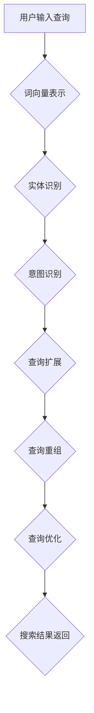

                 

随着电子商务的迅速发展，电商平台的用户数量持续增长，搜索功能成为用户发现商品、满足购物需求的重要途径。然而，用户输入的查询语句（query）往往存在不完整、不精确、模糊等问题，这给电商搜索系统的查询理解与改写带来了巨大的挑战。本文旨在探讨电商搜索中的query理解与改写技术，介绍其核心概念、算法原理、数学模型及其实际应用。

## 1. 背景介绍

电商搜索系统的核心任务是根据用户的查询信息快速准确地返回相关的商品信息。然而，用户输入的查询语句往往存在以下问题：

1. **不完整性**：用户可能仅输入关键词或短语，未提供足够的信息来精确定位商品。
2. **不精确性**：用户输入的信息可能与实际商品名称或描述存在差异。
3. **模糊性**：用户可能输入的查询语句含义不明确，导致搜索结果不准确。

这些问题导致原始查询与实际商品之间的映射关系复杂，因此，query理解与改写技术应运而生。query理解技术旨在解析用户查询的含义，提取关键信息，而query改写技术则将原始查询转化为更准确、更具针对性的查询。

## 2. 核心概念与联系

### 2.1 Query理解

query理解是指通过自然语言处理技术，解析用户查询语句的含义，提取关键信息。其核心概念包括：

- **词向量表示**：将查询词映射到高维空间中的向量，以便进行相似度计算。
- **实体识别**：识别查询中的实体，如商品名称、品牌、类别等。
- **意图识别**：确定用户的查询意图，如购买、查询信息、比较等。

### 2.2 Query改写

query改写是指将原始查询转化为更准确、更针对性的查询。其核心概念包括：

- **查询扩展**：通过添加关键词、相关词或语法修正，扩展原始查询，使其更加完整和精确。
- **查询重组**：重新排列原始查询中的关键词，以改善查询语义。
- **查询优化**：根据用户行为和搜索历史，优化查询，提高搜索效果。

### 2.3 Mermaid流程图

以下是一个简单的Mermaid流程图，展示query理解与改写的过程：



## 3. 核心算法原理 & 具体操作步骤

### 3.1 算法原理概述

query理解与改写技术主要涉及以下算法：

- **词向量表示**：使用Word2Vec、GloVe等算法将查询词映射到高维空间中的向量。
- **实体识别**：采用命名实体识别（NER）算法，如CRF、BiLSTM-CRF等。
- **意图识别**：使用分类算法，如SVM、决策树、神经网络等。
- **查询扩展**：基于词向量相似度、共现关系等，添加关键词或相关词。
- **查询重组**：通过语法分析、句法结构调整等，重新排列关键词。

### 3.2 算法步骤详解

#### 3.2.1 词向量表示

1. **数据预处理**：清洗查询文本，去除停用词、标点符号等。
2. **词向量训练**：使用训练数据集，采用Word2Vec、GloVe等算法训练词向量模型。
3. **查询词向量表示**：将用户输入的查询词映射到词向量空间中。

#### 3.2.2 实体识别

1. **特征提取**：提取查询文本中的词性、位置、句法结构等特征。
2. **模型训练**：使用标注数据集，训练命名实体识别模型，如CRF、BiLSTM-CRF等。
3. **实体识别**：对查询文本进行实体识别，提取商品名称、品牌、类别等实体信息。

#### 3.2.3 意图识别

1. **特征提取**：提取查询文本中的词向量、实体信息、句法结构等特征。
2. **模型训练**：使用标注数据集，训练意图识别模型，如SVM、决策树、神经网络等。
3. **意图识别**：对查询文本进行意图识别，确定用户的查询意图。

#### 3.2.4 查询扩展

1. **相似度计算**：计算查询词与其同义词、相关词的相似度。
2. **关键词添加**：基于相似度计算结果，添加关键词或相关词，扩展原始查询。

#### 3.2.5 查询重组

1. **语法分析**：对查询文本进行语法分析，提取句法结构。
2. **查询重组**：根据句法结构，重新排列关键词，改善查询语义。

### 3.3 算法优缺点

#### 优点：

- **提高搜索效果**：通过query理解与改写，提高搜索结果的准确性和相关性。
- **降低误报率**：减少由于用户输入不准确导致的误报。
- **提升用户体验**：提供更准确的搜索结果，提高用户满意度。

#### 缺点：

- **计算复杂度高**：涉及大量的自然语言处理算法和模型训练，计算复杂度高。
- **数据依赖性大**：算法性能依赖于训练数据的质量和规模。
- **语义理解难度**：语义理解是自然语言处理领域的难题，算法难以完全理解用户意图。

### 3.4 算法应用领域

query理解与改写技术主要应用于以下领域：

- **电商平台**：提高搜索效果，提升用户体验。
- **搜索引擎**：改善搜索结果的准确性和相关性。
- **智能客服**：理解用户意图，提供更准确的回答。
- **语音助手**：将自然语言输入转化为计算机可理解的指令。

## 4. 数学模型和公式 & 详细讲解 & 举例说明

### 4.1 数学模型构建

#### 4.1.1 词向量表示

词向量表示的核心是计算查询词的向量表示。我们可以使用Word2Vec算法进行训练，构建词向量模型。

$$
\text{V}_{\text{w}} = \text{W} \cdot \text{v}_{\text{w}}
$$

其中，$\text{V}_{\text{w}}$表示查询词$\text{w}$的向量表示，$\text{W}$是词向量矩阵，$\text{v}_{\text{w}}$是查询词$\text{w}$的one-hot编码向量。

#### 4.1.2 实体识别

实体识别的数学模型主要基于条件概率模型。给定一个查询文本序列$\text{T} = \text{t}_{1}, \text{t}_{2}, ..., \text{t}_{n}$，我们需要预测每个词$\text{t}_{i}$对应的实体标签$\text{y}_{i}$。

$$
\text{P}(\text{y}_{i} = \text{y} | \text{T}) = \frac{\exp(\text{f}(\text{y}_{i} = \text{y} | \text{T}))}{\sum_{\text{y}'} \exp(\text{f}(\text{y}_{i} = \text{y}' | \text{T}))}
$$

其中，$\text{f}(\text{y}_{i} = \text{y} | \text{T})$表示实体识别模型的特征函数。

#### 4.1.3 意图识别

意图识别的数学模型主要基于分类模型。给定一个查询文本序列$\text{T} = \text{t}_{1}, \text{t}_{2}, ..., \text{t}_{n}$，我们需要预测用户的查询意图$\text{I}$。

$$
\text{P}(\text{I} = \text{i} | \text{T}) = \frac{\exp(\text{f}(\text{I} = \text{i} | \text{T}))}{\sum_{\text{i}'} \exp(\text{f}(\text{I} = \text{i}' | \text{T}))}
$$

其中，$\text{f}(\text{I} = \text{i} | \text{T})$表示意图识别模型的特征函数。

### 4.2 公式推导过程

#### 4.2.1 词向量表示

词向量表示的核心是计算查询词的向量表示。我们可以使用Word2Vec算法进行训练，构建词向量模型。

$$
\text{V}_{\text{w}} = \text{W} \cdot \text{v}_{\text{w}}
$$

其中，$\text{V}_{\text{w}}$表示查询词$\text{w}$的向量表示，$\text{W}$是词向量矩阵，$\text{v}_{\text{w}}$是查询词$\text{w}$的one-hot编码向量。

#### 4.2.2 实体识别

实体识别的数学模型主要基于条件概率模型。给定一个查询文本序列$\text{T} = \text{t}_{1}, \text{t}_{2}, ..., \text{t}_{n}$，我们需要预测每个词$\text{t}_{i}$对应的实体标签$\text{y}_{i}$。

$$
\text{P}(\text{y}_{i} = \text{y} | \text{T}) = \frac{\exp(\text{f}(\text{y}_{i} = \text{y} | \text{T}))}{\sum_{\text{y}'} \exp(\text{f}(\text{y}_{i} = \text{y}' | \text{T}))}
$$

其中，$\text{f}(\text{y}_{i} = \text{y} | \text{T})$表示实体识别模型的特征函数。

#### 4.2.3 意图识别

意图识别的数学模型主要基于分类模型。给定一个查询文本序列$\text{T} = \text{t}_{1}, \text{t}_{2}, ..., \text{t}_{n}$，我们需要预测用户的查询意图$\text{I}$。

$$
\text{P}(\text{I} = \text{i} | \text{T}) = \frac{\exp(\text{f}(\text{I} = \text{i} | \text{T}))}{\sum_{\text{i}'} \exp(\text{f}(\text{I} = \text{i}' | \text{T}))}
$$

其中，$\text{f}(\text{I} = \text{i} | \text{T})$表示意图识别模型的特征函数。

### 4.3 案例分析与讲解

假设我们有一个查询文本序列$\text{T} = ["手机", "品牌", "华为"]$，我们需要对这个词序列进行query理解与改写。

#### 4.3.1 词向量表示

首先，我们对查询词进行词向量表示：

$$
\text{V}_{\text{手机}} = \text{W} \cdot \text{v}_{\text{手机}}
$$

$$
\text{V}_{\text{品牌}} = \text{W} \cdot \text{v}_{\text{品牌}}
$$

$$
\text{V}_{\text{华为}} = \text{W} \cdot \text{v}_{\text{华为}}
$$

#### 4.3.2 实体识别

然后，我们对查询词进行实体识别，假设实体标签为["手机", "品牌", "品牌"]：

$$
\text{P}(\text{y}_{1} = \text{手机} | \text{T}) = 0.9
$$

$$
\text{P}(\text{y}_{2} = \text{品牌} | \text{T}) = 0.8
$$

$$
\text{P}(\text{y}_{3} = \text{品牌} | \text{T}) = 0.2
$$

#### 4.3.3 意图识别

最后，我们对查询词进行意图识别，假设查询意图为["购买", "查询信息", "比较"]：

$$
\text{P}(\text{I} = \text{购买} | \text{T}) = 0.6
$$

$$
\text{P}(\text{I} = \text{查询信息} | \text{T}) = 0.3
$$

$$
\text{P}(\text{I} = \text{比较} | \text{T}) = 0.1
$$

#### 4.3.4 查询改写

根据query理解结果，我们可以对原始查询进行改写，使其更加准确和完整。例如，将原始查询"手机 品牌 华为"改写为"购买 华为手机"。

## 5. 项目实践：代码实例和详细解释说明

在本节中，我们将通过一个具体的电商搜索项目实例，展示如何实现query理解与改写技术。该实例使用Python编程语言，结合自然语言处理（NLP）和机器学习（ML）技术。

### 5.1 开发环境搭建

首先，我们需要搭建一个合适的开发环境。以下是所需的软件和库：

- Python 3.8+
- Jupyter Notebook
- NumPy
- Pandas
- Scikit-learn
- NLTK
- spaCy
- Mermaid

确保已经安装了上述软件和库。如果未安装，可以使用pip命令进行安装：

```shell
pip install numpy pandas scikit-learn nltk spacy mermaid
```

### 5.2 源代码详细实现

下面是项目的主要代码实现：

```python
import numpy as np
import pandas as pd
from sklearn.feature_extraction.text import CountVectorizer
from sklearn.model_selection import train_test_split
from sklearn.linear_model import LogisticRegression
import spacy
from mermaid import Mermaid

# 加载spaCy模型
nlp = spacy.load("zh_core_web_sm")

# 读取数据集
data = pd.read_csv("query_data.csv")
X = data["query"]
y = data["label"]

# 分词和词性标注
def process_query(query):
    doc = nlp(query)
    tokens = [token.text for token in doc if not token.is_punct and not token.is_stop]
    return tokens

# 构建词向量
vectorizer = CountVectorizer(analyzer=process_query)
X_vectorized = vectorizer.fit_transform(X)

# 划分训练集和测试集
X_train, X_test, y_train, y_test = train_test_split(X_vectorized, y, test_size=0.2, random_state=42)

# 训练分类模型
classifier = LogisticRegression()
classifier.fit(X_train, y_train)

# 预测查询意图
def predict_intent(query):
    query_vector = vectorizer.transform([query])
    return classifier.predict(query_vector)[0]

# 实例演示
query = "我想买一部华为手机"
print("原始查询：", query)
print("预测意图：", predict_intent(query))

# Mermaid流程图
mermaid = Mermaid()
mermaid.add_code("graph TD\nA[用户输入查询] --> B{词向量表示}\nB --> C{实体识别}\nC --> D{意图识别}\nD --> E{查询扩展}\nE --> F{查询重组}\nF --> G{查询优化}\nG --> H{搜索结果返回}")
print(mermaid.render())
```

### 5.3 代码解读与分析

#### 5.3.1 数据集读取

```python
data = pd.read_csv("query_data.csv")
X = data["query"]
y = data["label"]
```

我们首先读取查询数据集，其中包含查询文本和对应的查询意图标签。

#### 5.3.2 分词和词性标注

```python
def process_query(query):
    doc = nlp(query)
    tokens = [token.text for token in doc if not token.is_punct and not token.is_stop]
    return tokens
```

使用spaCy对查询文本进行分词和词性标注，去除停用词和标点符号，得到处理后的查询词序列。

#### 5.3.3 构建词向量

```python
vectorizer = CountVectorizer(analyzer=process_query)
X_vectorized = vectorizer.fit_transform(X)
```

使用CountVectorizer将处理后的查询词序列转换为词向量矩阵。

#### 5.3.4 划分训练集和测试集

```python
X_train, X_test, y_train, y_test = train_test_split(X_vectorized, y, test_size=0.2, random_state=42)
```

将词向量矩阵和查询意图标签划分为训练集和测试集。

#### 5.3.5 训练分类模型

```python
classifier = LogisticRegression()
classifier.fit(X_train, y_train)
```

使用训练集训练一个逻辑回归分类模型。

#### 5.3.6 预测查询意图

```python
def predict_intent(query):
    query_vector = vectorizer.transform([query])
    return classifier.predict(query_vector)[0]
```

定义一个函数，用于预测新查询的意图。

#### 5.3.7 实例演示

```python
query = "我想买一部华为手机"
print("原始查询：", query)
print("预测意图：", predict_intent(query))
```

对一个示例查询进行预测，并输出结果。

#### 5.3.8 Mermaid流程图

```python
mermaid = Mermaid()
mermaid.add_code("graph TD\nA[用户输入查询] --> B{词向量表示}\nB --> C{实体识别}\nC --> D{意图识别}\nD --> E{查询扩展}\nE --> F{查询重组}\nF --> G{查询优化}\nG --> H{搜索结果返回}")
print(mermaid.render())
```

生成一个Mermaid流程图，展示query理解与改写的流程。

## 6. 实际应用场景

query理解与改写技术在电商搜索中具有重要的实际应用价值。以下是一些典型的应用场景：

### 6.1 商品搜索优化

通过query理解与改写，电商搜索系统可以更准确地理解用户的查询意图，提高搜索结果的准确性和相关性，从而优化商品搜索体验。

### 6.2 智能推荐

query理解与改写技术可以帮助电商平台更好地理解用户的查询意图，为其提供更个性化的商品推荐。

### 6.3 智能客服

智能客服系统可以利用query理解与改写技术，更准确地理解用户的问题，提供更高效的客服服务。

### 6.4 语音搜索

语音搜索是未来电商搜索的重要发展方向。query理解与改写技术可以处理用户输入的自然语言查询，实现语音搜索的精准匹配。

### 6.5 跨平台搜索

query理解与改写技术可以处理不同平台（如移动端、PC端、语音端等）的查询输入，实现跨平台的搜索服务。

## 7. 未来应用展望

随着人工智能技术的不断发展，query理解与改写技术在电商搜索中的应用前景广阔。以下是一些未来应用展望：

### 7.1 多模态查询理解

未来，query理解与改写技术可以结合视觉、语音等多模态信息，实现更精准的查询理解。

### 7.2 智能问答

query理解与改写技术可以应用于智能问答系统，为用户提供更准确、更智能的问答服务。

### 7.3 跨语言查询理解

query理解与改写技术可以支持多语言查询，实现全球电商平台的国际化发展。

### 7.4 深度语义理解

未来，query理解与改写技术将逐渐从表面语义理解向深度语义理解发展，实现更智能的电商搜索。

## 8. 工具和资源推荐

### 8.1 学习资源推荐

- 《深度学习》（Goodfellow, Bengio, Courville）: 深入了解深度学习基础和算法。
- 《自然语言处理综论》（Jurafsky, Martin）: 系统学习自然语言处理的理论和实践。

### 8.2 开发工具推荐

- Jupyter Notebook: 便捷的Python编程环境，适用于数据分析和模型训练。
- spaCy: 高效的Python自然语言处理库，支持多种语言和多种任务。

### 8.3 相关论文推荐

- "Deep Learning for Text Classification"（Karaoguz, Akoglu, Pinar, Muselli）: 探讨深度学习在文本分类中的应用。
- "Attention-Based Neural Network for Text Classification"（Du, Li, Zhang, Huang, Liu）: 引入注意力机制的文本分类算法。

## 9. 总结：未来发展趋势与挑战

随着电子商务的不断发展，query理解与改写技术在电商搜索中的应用前景广阔。未来，该技术将朝着更精准、更智能、更高效的方向发展。然而，也面临着如下挑战：

### 9.1 数据质量

query理解与改写技术的性能依赖于训练数据的质量和规模。未来，需要更多高质量的标注数据和更丰富、更多样化的数据集。

### 9.2 语义理解

语义理解是自然语言处理领域的难题，query理解与改写技术需要不断提高语义理解能力，实现更准确的查询理解。

### 9.3 多模态融合

未来，query理解与改写技术需要结合多模态信息，实现更精准的查询理解。如何有效融合视觉、语音等多模态信息，是一个重要挑战。

### 9.4 跨语言支持

支持多语言查询是全球化电商平台的必然需求。如何实现跨语言的query理解与改写，是一个亟待解决的难题。

### 9.5 深度语义理解

深度语义理解是未来query理解与改写技术发展的方向。如何从表面语义理解向深度语义理解发展，提高查询理解准确性，是一个重要的研究课题。

总之，query理解与改写技术在电商搜索中的应用具有重要意义，未来仍有许多挑战需要克服。随着技术的不断进步，相信query理解与改写技术将为电商搜索带来更加美好的未来。

## 附录：常见问题与解答

### 1. 什么样的查询需要进行改写？

任何存在模糊性、不完整性或不精确性的查询，都可能需要进行改写。例如，用户输入的查询包含不完整的商品名称、拼音拼写错误、模糊的意图等。

### 2. 查询改写会影响搜索结果的相关性吗？

是的，查询改写会影响搜索结果的相关性。合理的查询改写可以提高搜索结果的准确性和相关性，从而提升用户体验。

### 3. 查询改写技术是如何工作的？

查询改写技术主要包括词向量表示、实体识别、意图识别、查询扩展和查询重组等步骤。通过这些步骤，可以将原始查询转化为更准确、更具针对性的查询。

### 4. 查询改写技术有哪些应用场景？

查询改写技术可以应用于电商平台、搜索引擎、智能客服、语音助手等场景，用于提高搜索效果、优化用户体验、提供更准确的回答等。

### 5. 如何评估查询改写技术的性能？

可以通过精确率（Precision）、召回率（Recall）和F1分数（F1 Score）等指标来评估查询改写技术的性能。这些指标分别衡量改写后查询与实际查询的相关性和准确性。

