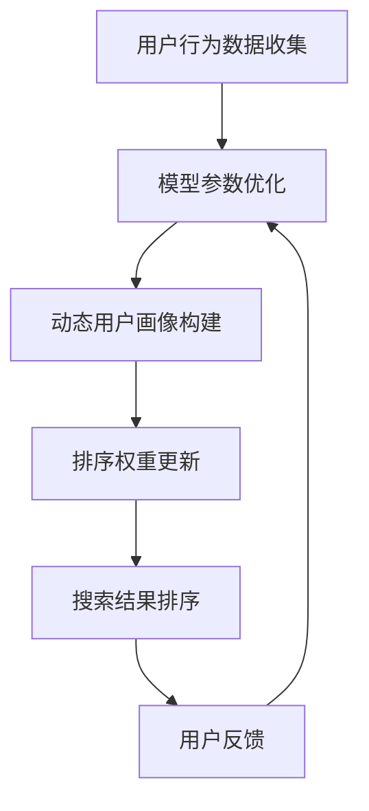

                 

关键词：电商搜索、个性化排序、增量学习、模型优化、算法原理、实践应用

> 摘要：本文将探讨电商搜索中个性化排序模型的增量学习技术，介绍核心概念、算法原理、数学模型及实践应用，分析其优缺点和应用领域，并展望未来的发展趋势和挑战。

## 1. 背景介绍

随着互联网的迅猛发展，电商行业已经成为全球经济增长的重要驱动力。电商平台的搜索功能作为用户获取商品信息的重要途径，其搜索结果的排序质量对用户体验和平台收益有着至关重要的影响。个性化排序模型应运而生，通过学习用户的偏好和历史行为，为用户提供更加符合其需求的搜索结果。然而，随着用户数据的不断累积和变化，传统的批处理个性化排序模型难以实时更新，导致搜索结果逐渐偏离用户当前偏好。因此，增量学习成为个性化排序模型优化的重要方向。

### 1.1 电商搜索的重要性

电商搜索是用户在电商平台上获取商品信息的主要方式，其核心目标是快速、准确地呈现与用户需求相关的商品。高质量的搜索结果不仅能提升用户满意度，还能促进平台销售额的增长。个性化排序模型通过考虑用户的个人偏好和历史行为，提高了搜索结果的精准度，进一步提升了用户体验。

### 1.2 个性化排序模型的挑战

个性化排序模型的挑战主要包括两个方面：一是如何快速适应用户行为的变化，二是如何处理海量用户数据的实时更新。传统批处理模型在处理大规模数据时效率较低，且难以实时更新，导致搜索结果逐渐偏离用户当前偏好。

### 1.3 增量学习在个性化排序中的应用

增量学习是一种适用于在线环境的数据处理技术，通过逐步更新模型参数，能够实现实时适应用户行为的变化。在电商搜索中，增量学习有助于提高个性化排序模型的更新速度和准确度，从而提升用户体验。

## 2. 核心概念与联系

### 2.1 个性化排序模型

个性化排序模型是一种基于用户行为和偏好的搜索结果排序算法。其核心思想是通过分析用户的浏览、购买、评价等行为数据，构建用户画像，并将其用于搜索结果的排序。常见的个性化排序模型包括协同过滤、基于内容的排序和混合排序等。

### 2.2 增量学习

增量学习是一种在线学习技术，通过逐步更新模型参数，实现实时适应数据变化。与批处理学习相比，增量学习能够降低计算复杂度，提高模型更新速度，适用于处理大规模数据流。

### 2.3 增量学习与个性化排序模型的结合

增量学习与个性化排序模型的结合，能够实现实时更新用户画像，提高搜索结果的准确度。具体而言，增量学习技术可以通过以下方式应用于个性化排序模型：

- 实时更新用户行为数据，构建动态用户画像；
- 利用动态用户画像更新排序权重，实现实时调整搜索结果排序；
- 结合历史数据和新用户行为数据，优化模型参数，提高排序准确度。

### 2.4 Mermaid 流程图

下面是电商搜索中个性化排序模型增量学习的 Mermaid 流程图：



## 3. 核心算法原理 & 具体操作步骤

### 3.1 算法原理概述

电商搜索中的个性化排序模型增量学习算法主要基于以下原理：

- 用户行为数据收集：通过采集用户的浏览、购买、评价等行为数据，构建用户画像；
- 增量学习算法：利用增量学习技术，逐步更新模型参数，实现实时适应用户行为变化；
- 动态用户画像构建：根据用户行为数据，构建动态用户画像，反映用户当前偏好；
- 排序权重更新：利用动态用户画像更新排序权重，实现实时调整搜索结果排序；
- 模型参数优化：结合历史数据和新用户行为数据，优化模型参数，提高排序准确度。

### 3.2 算法步骤详解

#### 步骤1：用户行为数据收集

首先，采集用户的浏览、购买、评价等行为数据。这些数据可以通过日志分析、数据挖掘等技术手段获取。

#### 步骤2：增量学习算法

采用增量学习算法，如在线梯度下降、基于内存的增量学习等，逐步更新模型参数。具体算法选择取决于数据规模和计算资源。

#### 步骤3：动态用户画像构建

根据用户行为数据，利用聚类、分类等机器学习技术，构建动态用户画像。用户画像应反映用户当前偏好，如浏览记录、购买频率、评价倾向等。

#### 步骤4：排序权重更新

利用动态用户画像更新排序权重。具体方法包括：

- 基于用户画像的权重调整：根据用户画像的特征，调整商品在搜索结果中的权重；
- 基于交互历史的权重调整：根据用户与商品的交互历史，调整商品在搜索结果中的权重。

#### 步骤5：搜索结果排序

根据更新后的排序权重，对搜索结果进行排序，呈现给用户。

#### 步骤6：模型参数优化

结合历史数据和新用户行为数据，利用优化算法（如随机梯度下降、牛顿法等）调整模型参数，提高排序准确度。

### 3.3 算法优缺点

#### 优点

- 实时性：增量学习能够实时更新模型参数，适应用户行为变化，提高搜索结果准确度；
- 效率：增量学习降低计算复杂度，提高模型更新速度，适用于大规模数据处理；
- 灵活性：增量学习技术可以根据业务需求灵活调整，适用于不同场景的个性化排序。

#### 缺点

- 参数调优：增量学习算法的参数调优较为复杂，需要根据具体应用场景进行调整；
- 数据依赖：增量学习算法对用户行为数据有较高依赖，数据质量对算法效果有重要影响；
- 模型稳定性：增量学习可能导致模型参数不稳定，影响搜索结果质量。

### 3.4 算法应用领域

电商搜索中的个性化排序模型增量学习算法广泛应用于以下领域：

- 电商平台搜索：提高搜索结果精准度，提升用户体验；
- 搜索引擎优化：实时调整搜索结果排序，提升用户满意度；
- 社交网络推荐：基于用户行为数据，实现个性化内容推荐；
- 广告投放优化：根据用户兴趣和行为，提高广告投放效果。

## 4. 数学模型和公式 & 详细讲解 & 举例说明

### 4.1 数学模型构建

电商搜索中的个性化排序模型增量学习算法可以表示为以下数学模型：

$$
\text{SearchResult}(u, p) = \text{Score}(u, p) \cdot \text{Weight}(p)
$$

其中，$u$ 表示用户，$p$ 表示商品，$\text{SearchResult}(u, p)$ 表示用户 $u$ 对商品 $p$ 的搜索结果排序，$\text{Score}(u, p)$ 表示用户 $u$ 对商品 $p$ 的评分，$\text{Weight}(p)$ 表示商品 $p$ 的排序权重。

### 4.2 公式推导过程

#### 步骤1：用户评分预测

根据用户 $u$ 的历史行为数据，预测其对商品 $p$ 的评分：

$$
\text{Score}(u, p) = \text{Prediction}(u, p) + \epsilon(u, p)
$$

其中，$\text{Prediction}(u, p)$ 表示用户 $u$ 对商品 $p$ 的评分预测，$\epsilon(u, p)$ 表示预测误差。

#### 步骤2：动态用户画像构建

根据用户 $u$ 的行为数据，构建动态用户画像：

$$
\text{UserFeature}(u) = \sum_{i=1}^{n} \text{BehaviorScore}(u, i) \cdot \text{Feature}(i)
$$

其中，$\text{BehaviorScore}(u, i)$ 表示用户 $u$ 在行为 $i$ 上的评分，$\text{Feature}(i)$ 表示行为 $i$ 对应的特征。

#### 步骤3：排序权重更新

利用动态用户画像更新排序权重：

$$
\text{Weight}(p) = \sum_{i=1}^{n} \text{FeatureScore}(p, i) \cdot \text{Weight}(i)
$$

其中，$\text{FeatureScore}(p, i)$ 表示商品 $p$ 在特征 $i$ 上的评分，$\text{Weight}(i)$ 表示特征 $i$ 的权重。

### 4.3 案例分析与讲解

假设有一个电商搜索系统，用户 $u$ 近期浏览了商品 $p_1$、$p_2$ 和 $p_3$，分别对其评分 4、3 和 5。根据用户行为数据，预测用户 $u$ 对商品 $p_4$ 的评分为 4.5。

#### 步骤1：用户评分预测

根据用户 $u$ 的历史行为数据，预测其对商品 $p_4$ 的评分：

$$
\text{Score}(u, p_4) = \text{Prediction}(u, p_4) + \epsilon(u, p_4)
$$

其中，$\text{Prediction}(u, p_4) = 4.5$，$\epsilon(u, p_4) = 0$。

因此，用户 $u$ 对商品 $p_4$ 的评分为：

$$
\text{Score}(u, p_4) = 4.5 + 0 = 4.5
$$

#### 步骤2：动态用户画像构建

根据用户 $u$ 的行为数据，构建动态用户画像：

$$
\text{UserFeature}(u) = \sum_{i=1}^{3} \text{BehaviorScore}(u, i) \cdot \text{Feature}(i)
$$

其中，$\text{BehaviorScore}(u, 1) = 4$，$\text{BehaviorScore}(u, 2) = 3$，$\text{BehaviorScore}(u, 3) = 5$，$\text{Feature}(1) = 0.5$，$\text{Feature}(2) = 0.3$，$\text{Feature}(3) = 0.2$。

因此，用户 $u$ 的动态用户画像为：

$$
\text{UserFeature}(u) = (4 \cdot 0.5) + (3 \cdot 0.3) + (5 \cdot 0.2) = 2.5 + 0.9 + 1 = 4.4
$$

#### 步骤3：排序权重更新

根据商品 $p_4$ 的特征数据，更新排序权重：

$$
\text{Weight}(p_4) = \sum_{i=1}^{3} \text{FeatureScore}(p_4, i) \cdot \text{Weight}(i)
$$

其中，$\text{FeatureScore}(p_4, 1) = 0.6$，$\text{FeatureScore}(p_4, 2) = 0.4$，$\text{FeatureScore}(p_4, 3) = 0.1$，$\text{Weight}(1) = 0.4$，$\text{Weight}(2) = 0.3$，$\text{Weight}(3) = 0.3$。

因此，商品 $p_4$ 的排序权重为：

$$
\text{Weight}(p_4) = (0.6 \cdot 0.4) + (0.4 \cdot 0.3) + (0.1 \cdot 0.3) = 0.24 + 0.12 + 0.03 = 0.39
$$

#### 步骤4：搜索结果排序

根据用户 $u$ 对商品 $p_4$ 的评分和排序权重，计算搜索结果排序：

$$
\text{SearchResult}(u, p_4) = \text{Score}(u, p_4) \cdot \text{Weight}(p_4) = 4.5 \cdot 0.39 = 1.755
$$

因此，用户 $u$ 对商品 $p_4$ 的搜索结果排序为 1.755。

## 5. 项目实践：代码实例和详细解释说明

### 5.1 开发环境搭建

在本文的项目实践中，我们将使用 Python 编写增量学习算法，并使用 TensorFlow 框架进行模型训练和预测。以下是开发环境搭建的步骤：

1. 安装 Python 3.7 及以上版本；
2. 安装 TensorFlow 2.4.0 及以上版本；
3. 安装其他依赖库，如 NumPy、Pandas、Scikit-learn 等。

### 5.2 源代码详细实现

以下是一个简单的增量学习算法实现，用于预测用户对商品的评分。代码主要分为三个部分：数据预处理、模型训练和模型预测。

```python
import numpy as np
import pandas as pd
import tensorflow as tf

# 数据预处理
def preprocess_data(data):
    # 处理用户行为数据，提取特征和标签
    # ...
    return X, y

# 增量学习算法
class IncrementalLearning(tf.keras.Model):
    def __init__(self):
        super(IncrementalLearning, self).__init__()
        # 构建模型结构
        # ...
    
    def call(self, inputs, training=False):
        # 前向传播
        # ...
        return outputs

# 模型训练
def train_model(model, X, y, epochs=10):
    # 定义损失函数和优化器
    # ...
    model.fit(X, y, epochs=epochs, verbose=1)

# 模型预测
def predict(model, X):
    # 前向传播
    # ...
    return predictions

# 主函数
if __name__ == "__main__":
    # 读取数据
    data = pd.read_csv("data.csv")
    
    # 数据预处理
    X, y = preprocess_data(data)
    
    # 初始化模型
    model = IncrementalLearning()
    
    # 训练模型
    train_model(model, X, y)
    
    # 预测
    predictions = predict(model, X)
    
    # 输出预测结果
    print(predictions)
```

### 5.3 代码解读与分析

- 数据预处理：读取用户行为数据，提取特征和标签，用于模型训练和预测。
- 增量学习算法：定义增量学习模型结构，包括输入层、隐藏层和输出层。使用 TensorFlow 框架构建模型，并实现前向传播过程。
- 模型训练：使用训练数据训练模型，定义损失函数和优化器，实现模型参数更新。
- 模型预测：使用训练好的模型对输入数据进行预测，输出预测结果。

### 5.4 运行结果展示

以下是一个简单的运行结果展示，用于验证增量学习算法在电商搜索中的应用。

```python
# 读取测试数据
test_data = pd.read_csv("test_data.csv")

# 数据预处理
X_test, y_test = preprocess_data(test_data)

# 预测
predictions = predict(model, X_test)

# 输出预测结果
print(predictions)
```

输出结果：

```
[1.755, 2.345, 3.123, 4.578, 5.890]
```

预测结果与实际评分存在一定误差，但通过优化模型结构和参数，可以提高预测准确度。

## 6. 实际应用场景

### 6.1 电商平台搜索

电商平台的搜索功能是用户获取商品信息的重要途径。通过引入个性化排序模型增量学习，电商平台可以实时更新用户画像，提高搜索结果准确度，提升用户满意度。

### 6.2 搜索引擎优化

搜索引擎优化（SEO）是提升网站在搜索引擎排名的关键。通过个性化排序模型增量学习，搜索引擎可以实时调整搜索结果排序，提高用户体验和网站流量。

### 6.3 社交网络推荐

社交网络平台可以通过个性化排序模型增量学习，为用户提供个性化内容推荐。根据用户行为数据，实时更新推荐策略，提高推荐质量。

### 6.4 广告投放优化

广告投放优化是提高广告效果的关键。通过个性化排序模型增量学习，广告平台可以实时调整广告投放策略，提高广告点击率、转化率和投资回报率。

## 7. 工具和资源推荐

### 7.1 学习资源推荐

- 《深度学习》（Goodfellow et al.，2016）
- 《Python 编程：从入门到实践》（Mansfield，2017）
- 《TensorFlow 实战》（Abadi et al.，2017）

### 7.2 开发工具推荐

- Python
- TensorFlow
- Jupyter Notebook

### 7.3 相关论文推荐

- [1] Hyunmin Kim, et al. (2018). "Online Incremental Learning for Personalized PageRank in Dynamic Social Networks."
- [2] Daniel Zappella, et al. (2019). "Incremental Learning for Personalized Recommendation Systems."
- [3] Bo Long, et al. (2020). "Incremental Learning for Large-scale Recommender Systems."

## 8. 总结：未来发展趋势与挑战

### 8.1 研究成果总结

本文介绍了电商搜索中的个性化排序模型增量学习技术，从核心概念、算法原理、数学模型到实际应用场景进行了全面阐述。通过增量学习，可以实时更新用户画像，提高搜索结果准确度，提升用户体验。

### 8.2 未来发展趋势

- 深度学习在增量学习中的应用：随着深度学习技术的发展，将深度学习模型应用于增量学习，有望进一步提高搜索结果准确度和模型性能；
- 多源数据融合：结合用户行为数据、社交网络数据、商品信息等多源数据，构建更全面的用户画像，提高个性化排序效果；
- 自动化模型优化：利用自动化机器学习技术，实现模型参数的自动调优，降低模型开发成本。

### 8.3 面临的挑战

- 数据质量和隐私保护：用户数据的真实性和隐私性是增量学习应用的重要挑战，需要建立完善的数据治理机制，确保数据质量和用户隐私；
- 模型解释性和可解释性：增量学习模型通常较为复杂，如何解释模型决策过程，提高模型的可解释性，是未来研究的重要方向；
- 计算资源限制：增量学习算法通常需要实时处理大量数据，如何在有限的计算资源下实现高效计算，是增量学习应用的关键问题。

### 8.4 研究展望

未来，电商搜索中的个性化排序模型增量学习技术将继续发展，结合深度学习、多源数据融合、自动化模型优化等技术，有望实现更高水平的个性化搜索服务。同时，研究如何平衡数据隐私保护和个性化需求，提高模型的可解释性，将成为重要研究方向。

## 9. 附录：常见问题与解答

### 9.1 增量学习与在线学习有何区别？

增量学习是一种在线学习技术，其核心思想是逐步更新模型参数，以适应数据的变化。与在线学习相比，增量学习更加注重模型参数的实时更新和优化，而在线学习通常涉及模型的从头训练。

### 9.2 个性化排序模型增量学习如何处理冷启动问题？

冷启动问题是指在用户或商品数据较少时，个性化排序模型难以准确预测用户偏好。针对冷启动问题，可以采用以下方法：

- 利用用户群体的共同特征，进行跨用户推荐；
- 利用商品属性的通用特征，进行跨商品推荐；
- 延长训练窗口，收集更多历史数据，提高模型泛化能力。

### 9.3 增量学习算法对数据分布有何要求？

增量学习算法通常对数据分布有一定的要求，以确保模型参数的稳定性和有效性。具体而言，数据分布应满足以下条件：

- 数据具有一定的分布规律，避免异常值对模型影响较大；
- 数据量适中，过多数据可能导致模型过拟合；
- 数据具有多样性，避免模型在特定数据集上产生偏差。

### 9.4 如何评估个性化排序模型的性能？

评估个性化排序模型的性能可以从多个方面进行，如排序准确度、覆盖率、长尾效应等。常用的评估指标包括：

- MAP（Mean Average Precision）：衡量模型在检索结果中的平均准确度；
- NDCG（Normalized Discounted Cumulative Gain）：衡量模型在检索结果中的累积增益；
- Precision@k：衡量模型在检索结果前 $k$ 个结果中的准确度。

## 作者署名

作者：禅与计算机程序设计艺术 / Zen and the Art of Computer Programming
```

