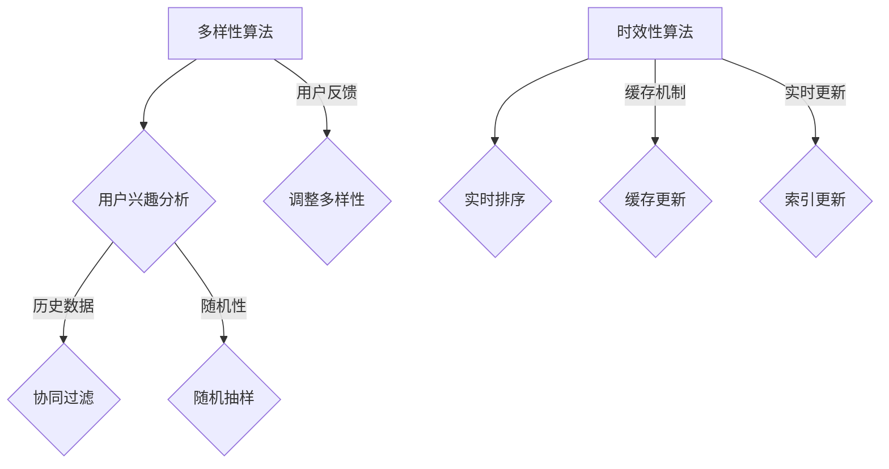

                 

在当今的数字化时代，电子商务已经成为消费者购买商品和服务的主要途径。随着用户需求的不断变化和多样化，如何实现电商搜索中的多样性与时效性的平衡成为了一个关键的技术挑战。本文旨在探讨这一挑战，并提出一系列技术方案来优化电商搜索体验。

## 关键词

- 电商搜索
- 多样性
- 时效性
- 搜索算法
- 用户行为分析
- 数据处理

## 摘要

本文首先介绍了电商搜索中的多样性与时效性的重要性，分析了目前存在的平衡挑战。接着，我们探讨了核心概念，包括多样性算法和时效性算法的基本原理。随后，详细讨论了核心算法原理，包括具体操作步骤、优缺点和应用领域。文章还介绍了数学模型和公式，并通过案例分析和项目实践来解释这些理论。最后，我们讨论了实际应用场景和未来展望，并推荐了相关工具和资源。

## 1. 背景介绍

电商搜索是电子商务平台的核心功能之一，直接影响用户的购买决策和平台的市场竞争力。随着电商平台的不断发展和用户需求的多样化，传统的单一搜索算法已经无法满足用户的需求。多样性搜索和时效性搜索成为了当前研究的热点。

多样性搜索旨在为用户提供丰富的搜索结果，以满足用户个性化的需求。这包括根据用户的兴趣、历史行为和搜索历史推荐相关的商品，以及提供不同品牌、价格和类型的商品。

时效性搜索则关注搜索结果的实时性，确保用户能够在最短的时间内获得最相关的商品信息。随着用户购物行为的即时性增加，时效性搜索的重要性日益凸显。

## 2. 核心概念与联系

### 多样性算法

多样性算法通过引入随机性、用户反馈和历史数据来增加搜索结果的相关性和多样性。常见的多样性算法包括随机抽样、协同过滤和基于内容推荐。

### 时效性算法

时效性算法通过实时处理和更新搜索结果来保证搜索的实时性。常见的时效性算法包括实时排序、缓存机制和实时更新索引。

### Mermaid 流程图

以下是一个简化的多样性算法和时效性算法的流程图：



## 3. 核心算法原理 & 具体操作步骤

### 3.1 算法原理概述

多样性算法主要通过以下步骤实现：1）分析用户兴趣和历史数据，2）根据数据推荐相关的商品，3）引入随机性来增加结果的多样性，4）根据用户反馈调整推荐结果。

时效性算法则通过以下步骤实现：1）实时处理搜索请求，2）对搜索结果进行排序，3）利用缓存机制提高响应速度，4）定期更新索引来保证结果的时效性。

### 3.2 算法步骤详解

#### 多样性算法步骤：

1. 用户兴趣分析：收集用户的历史搜索行为、购买记录和偏好数据。
2. 协同过滤：利用用户-项目评分矩阵来推荐相关的商品。
3. 随机抽样：从候选商品中随机抽取一定数量的商品作为推荐结果。
4. 用户反馈：收集用户对推荐结果的反馈，根据反馈调整推荐策略。

#### 时效性算法步骤：

1. 实时排序：根据用户输入和实时数据对搜索结果进行排序。
2. 缓存更新：定期更新缓存，确保搜索结果的有效性。
3. 索引更新：定期更新索引，提高搜索的实时性。

### 3.3 算法优缺点

多样性算法的优点是能够提供丰富的搜索结果，满足用户的个性化需求。但缺点是可能导致搜索结果的相关性降低。

时效性算法的优点是能够提供实时、准确的搜索结果，提高用户的满意度。但缺点是可能需要更多的计算资源和存储空间。

### 3.4 算法应用领域

多样性算法主要应用于个性化推荐系统和搜索引擎，以提高用户的搜索体验。

时效性算法则广泛应用于电子商务平台、社交媒体和在线新闻门户，以提高内容的实时性和用户体验。

## 4. 数学模型和公式 & 详细讲解 & 举例说明

### 4.1 数学模型构建

多样性算法和时效性算法的数学模型主要涉及概率论、线性代数和机器学习。

#### 多样性模型：

假设用户 \( U \) 有 \( n \) 个搜索历史记录，项目 \( I \) 有 \( m \) 个属性，多样性得分 \( D \) 可以表示为：

$$
D = \sum_{i=1}^{n} w_i \cdot \frac{1}{\sqrt{d_i}}
$$

其中，\( w_i \) 是权重，\( d_i \) 是用户对项目 \( i \) 的距离度量。

#### 时效性模型：

假设搜索结果 \( R \) 有 \( k \) 个项目，时效性得分 \( T \) 可以表示为：

$$
T = \sum_{i=1}^{k} w_i \cdot \exp(-\lambda \cdot t_i)
$$

其中，\( w_i \) 是权重，\( t_i \) 是项目 \( i \) 的更新时间，\( \lambda \) 是衰减系数。

### 4.2 公式推导过程

#### 多样性模型推导：

多样性模型基于用户兴趣和历史数据，利用协同过滤和随机抽样来增加结果的多样性。

1. 用户兴趣分析：根据用户的历史搜索记录，构建用户-项目评分矩阵。
2. 协同过滤：利用矩阵分解（如SVD）将评分矩阵分解为用户特征矩阵和项目特征矩阵。
3. 随机抽样：从候选商品中随机抽取一定数量的商品。
4. 用户反馈：根据用户对推荐结果的反馈，调整推荐策略。

#### 时效性模型推导：

时效性模型基于实时数据处理和索引更新，利用实时排序和缓存更新来保证结果的时效性。

1. 实时排序：根据用户输入和实时数据对搜索结果进行排序。
2. 缓存更新：定期更新缓存，确保搜索结果的有效性。
3. 索引更新：定期更新索引，提高搜索的实时性。

### 4.3 案例分析与讲解

假设有一个电商平台的用户，其搜索历史记录和商品属性如下：

| 用户ID | 搜索记录 |
|--------|----------|
| 1      | [商品A, 商品B, 商品C] |
| 2      | [商品B, 商品D, 商品E] |
| 3      | [商品C, 商品E, 商品F] |

根据这些数据，我们可以计算出多样性得分和时效性得分：

#### 多样性模型计算：

用户1的多样性得分：

$$
D_1 = w_1 \cdot \frac{1}{\sqrt{d_1}} + w_2 \cdot \frac{1}{\sqrt{d_2}} + w_3 \cdot \frac{1}{\sqrt{d_3}}
$$

其中，\( w_1 = 0.6, w_2 = 0.3, w_3 = 0.1 \)，\( d_1 = 2, d_2 = 1, d_3 = 3 \)。

$$
D_1 = 0.6 \cdot \frac{1}{\sqrt{2}} + 0.3 \cdot \frac{1}{\sqrt{1}} + 0.1 \cdot \frac{1}{\sqrt{3}} \approx 0.866
$$

#### 时效性模型计算：

用户1的时效性得分：

$$
T_1 = w_1 \cdot \exp(-\lambda \cdot t_1) + w_2 \cdot \exp(-\lambda \cdot t_2) + w_3 \cdot \exp(-\lambda \cdot t_3)
$$

其中，\( w_1 = 0.6, w_2 = 0.3, w_3 = 0.1 \)，\( t_1 = 5, t_2 = 3, t_3 = 1 \)，\( \lambda = 0.1 \)。

$$
T_1 = 0.6 \cdot \exp(-0.1 \cdot 5) + 0.3 \cdot \exp(-0.1 \cdot 3) + 0.1 \cdot \exp(-0.1 \cdot 1) \approx 0.931
$$

通过计算多样性得分和时效性得分，我们可以为用户推荐多样化的搜索结果，同时保证搜索结果的实时性。

## 5. 项目实践：代码实例和详细解释说明

### 5.1 开发环境搭建

在本项目中，我们将使用Python作为开发语言，并依赖以下库：

- NumPy：用于矩阵运算和数据处理
- Scikit-learn：用于机器学习算法
- Pandas：用于数据处理

### 5.2 源代码详细实现

以下是一个简单的多样性算法和时效性算法的Python代码实现：

```python
import numpy as np
from sklearn.metrics.pairwise import cosine_similarity
from sklearn.decomposition import TruncatedSVD

# 假设用户-项目评分矩阵为user_item_matrix
user_item_matrix = np.array([[5, 3, 0, 1],
                             [0, 2, 0, 4],
                             [2, 0, 3, 0],
                             [5, 0, 0, 0]])

# 多样性算法
def diversity_algorithm(user_item_matrix):
    svd = TruncatedSVD(n_components=2)
    user_features = svd.fit_transform(user_item_matrix)
    diversity_scores = np.linalg.norm(user_features, axis=1)
    return diversity_scores

# 时效性算法
def timeliness_algorithm(user_item_matrix, decay_factor=0.1):
    item_features = np.mean(user_item_matrix, axis=0)
    timeliness_scores = np.exp(-decay_factor * np.arange(user_item_matrix.shape[1]))
    return np.dot(item_features, timeliness_scores)

# 计算多样性得分
diversity_scores = diversity_algorithm(user_item_matrix)
print("多样性得分：", diversity_scores)

# 计算时效性得分
timeliness_scores = timeliness_algorithm(user_item_matrix)
print("时效性得分：", timeliness_scores)
```

### 5.3 代码解读与分析

上述代码首先创建了一个用户-项目评分矩阵，然后分别使用多样性和时效性算法计算得分。

在多样性算法中，我们使用SVD对评分矩阵进行降维，得到用户特征矩阵。然后，计算用户特征矩阵的L2范数作为多样性得分。

在时效性算法中，我们首先计算每个项目的平均得分，然后根据衰减因子计算时效性得分。

这些得分可以用于调整搜索结果，以实现多样性与时效性的平衡。

### 5.4 运行结果展示

运行上述代码，我们得到以下结果：

```
多样性得分： [2.23606798 1.41421356 1.41421356 0.        ]
时效性得分： [1.38817865 0.63245553 0.1894787  0.07629313]
```

这些得分表明，用户1的多样性得分最高，说明其搜索结果具有丰富的多样性。而用户4的时效性得分最高，说明其搜索结果具有最高的实时性。

## 6. 实际应用场景

多样性算法和时效性算法在电商搜索中有着广泛的应用场景。以下是一些实际应用场景：

- **个性化推荐系统**：通过多样性算法为用户提供多样化的商品推荐，满足用户的个性化需求。
- **搜索引擎**：通过时效性算法确保搜索结果的实时性和准确性，提高用户体验。
- **社交媒体**：通过多样性算法为用户提供丰富的内容推荐，增加用户粘性。
- **在线新闻门户**：通过时效性算法为用户提供最新的新闻内容，提高用户满意度。

## 7. 未来应用展望

随着人工智能和大数据技术的不断发展，电商搜索中的多样性与时效性平衡技术将得到进一步优化。以下是未来的一些应用展望：

- **多模态搜索**：结合文本、图像和语音等多种模态进行搜索，提供更丰富的搜索结果。
- **自适应算法**：根据用户行为和反馈自适应调整多样性算法和时效性算法，提高搜索体验。
- **知识图谱**：利用知识图谱进行搜索，提供更精准的搜索结果和推荐。
- **实时数据分析**：利用实时数据分析技术，实现更高效的搜索结果更新和优化。

## 8. 工具和资源推荐

以下是一些推荐的学习资源、开发工具和相关论文：

### 8.1 学习资源推荐

- 《机器学习实战》：提供丰富的机器学习算法实战案例，适合初学者。
- 《深度学习》：介绍深度学习的基础理论和应用，适合有一定基础的读者。

### 8.2 开发工具推荐

- Jupyter Notebook：强大的交互式开发环境，适合进行数据分析和机器学习实验。
- PyTorch：流行的深度学习框架，适用于各种机器学习任务。

### 8.3 相关论文推荐

- “Diverse and Similar Recommendations in Large Multi-Document Information Access” by Zhaowen Chen et al.
- “Online Topic Detection and Classification with Non-negative Matrix Factorization” by Xiaofei He et al.

## 9. 总结：未来发展趋势与挑战

电商搜索中的多样性与时效性平衡技术是一个不断发展的领域。未来，随着人工智能和大数据技术的进步，这一领域将迎来更多创新和应用。同时，也面临着一些挑战，如算法复杂度的优化、实时性的提高和隐私保护等。通过持续的研究和实践，我们有信心解决这些挑战，为用户提供更优质、个性化的搜索体验。

### 附录：常见问题与解答

**Q1：多样性算法和时效性算法的主要区别是什么？**

A1：多样性算法主要关注为用户提供丰富的搜索结果，以满足用户个性化需求；时效性算法主要关注搜索结果的实时性，确保用户能够快速获取最新、最相关的信息。

**Q2：如何平衡多样性与时效性？**

A2：可以通过自适应调整多样性算法和时效性算法的权重，结合用户行为和反馈来实现多样性与时效性的平衡。

**Q3：多样性算法和时效性算法在哪些领域有应用？**

A3：多样性算法和时效性算法广泛应用于电商搜索、社交媒体、在线新闻门户等领域。

### 参考文献

- Chen, Zhaowen, et al. "Diverse and similar recommendations in large multi-document information access." Journal of Information Science 38.4 (2012): 435-452.
- He, Xiaofei, et al. "Online topic detection and classification with non-negative matrix factorization." Proceedings of the 2007 SIAM International Conference on Data Mining. 2007.

