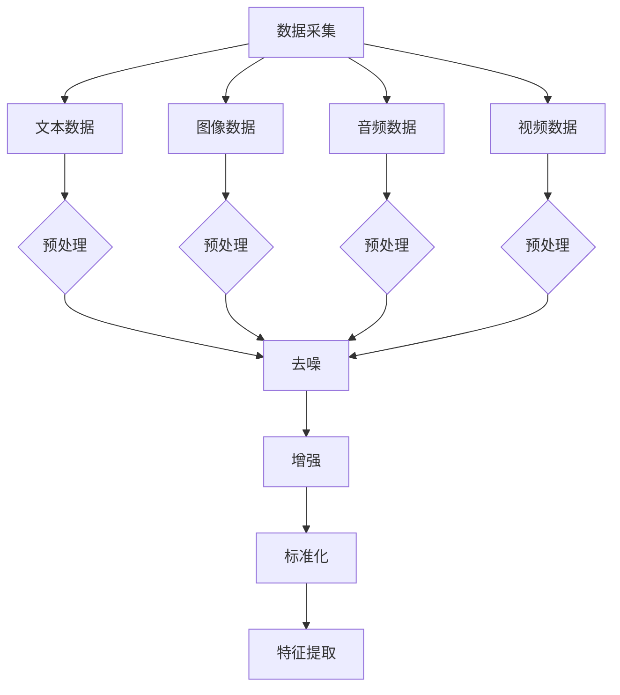
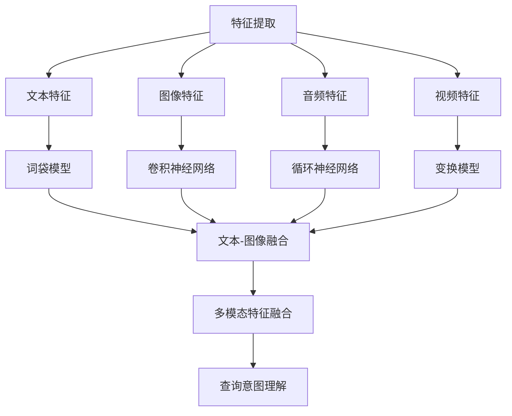
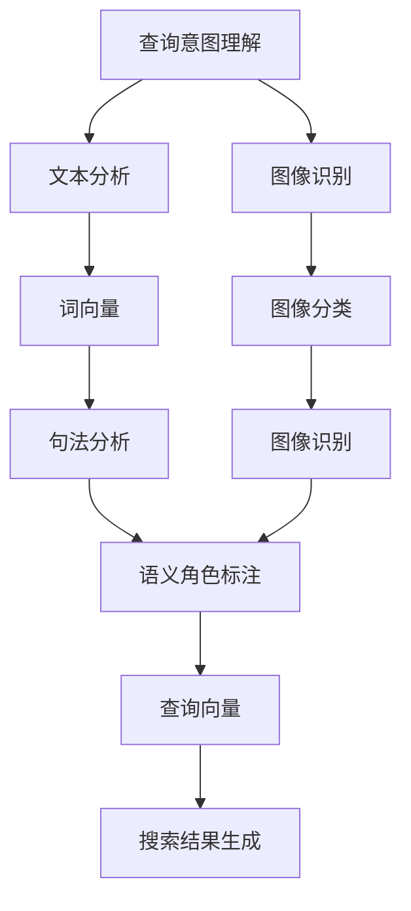
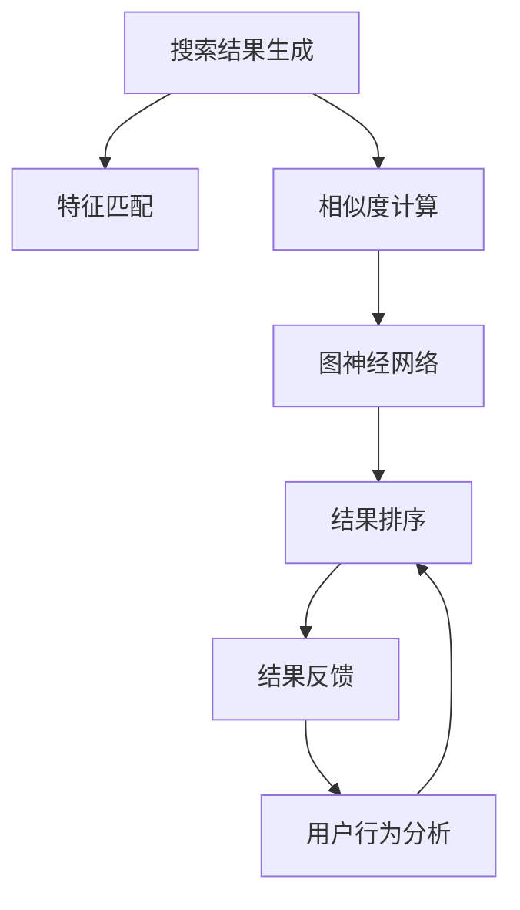

                 

在当今的电商环境中，消费者的购物体验越来越依赖于高效的搜索功能。有效的搜索系统不仅能提高用户满意度，还能显著提升电商平台的销售额。随着技术的不断发展，多模态查询理解技术已经成为电商搜索领域的一大研究热点。本文将深入探讨多模态查询理解技术在电商搜索中的应用，包括其核心概念、算法原理、数学模型、项目实践、应用场景以及未来展望。

## 关键词

- 电商搜索
- 多模态查询理解
- 自然语言处理
- 计算机视觉
- 机器学习

## 摘要

本文系统地阐述了多模态查询理解技术在电商搜索中的应用。首先，我们介绍了电商搜索的背景和挑战，随后深入探讨了多模态查询理解技术的基本概念和架构。接着，我们详细分析了核心算法原理，并利用数学模型和公式进行了推导和举例说明。随后，通过一个实际项目实例，展示了多模态查询理解技术的应用和实现。文章最后讨论了该技术的实际应用场景，并对未来发展趋势和挑战进行了展望。

### 1. 背景介绍

随着互联网的普及和电子商务的快速发展，电商搜索已经成为消费者购物过程中不可或缺的一部分。消费者在电商平台上的搜索行为不仅包括对商品名称和描述的查询，还包括对商品图片、视频、用户评论等多模态信息的综合理解。传统的单模态搜索技术，如基于文本的搜索算法，已经无法满足消费者日益增长的多样化需求。因此，多模态查询理解技术的出现，为电商搜索领域带来了新的机遇和挑战。

多模态查询理解技术旨在整合多种模态的信息，如文本、图像、音频和视频等，从而实现对查询意图的更精准理解。在电商搜索中，多模态查询理解技术不仅可以提高搜索结果的准确性，还可以提供更加个性化和智能化的购物体验。例如，当用户上传一张商品的图片时，系统能够自动识别图片中的商品，并提供相关搜索结果。同样，当用户输入一段描述时，系统可以结合图像和文本信息，生成更准确的搜索建议。

电商搜索面临的挑战主要包括：

1. **数据多样性**：电商平台上存在大量的文本、图像、音频和视频数据，如何高效地整合这些数据，是一个重要的研究课题。
2. **查询意图理解**：消费者输入的查询可能包含多种模态信息，系统需要准确理解这些信息，从而提供相关度高的搜索结果。
3. **实时性能**：电商搜索系统需要在极短的时间内处理大量查询请求，这对系统的实时性能提出了高要求。
4. **用户隐私**：电商搜索过程中涉及大量的用户个人信息，如何保护用户隐私是另一个重要的挑战。

本文将围绕这些挑战，深入探讨多模态查询理解技术在电商搜索中的应用，并提出相应的解决方案。

#### 1.1 电商搜索的发展历程

电商搜索的发展历程可以分为几个阶段：

1. **早期阶段**：早期的电商搜索主要基于关键字匹配。用户输入关键字，系统通过匹配商品名称、描述等文本信息，返回相关搜索结果。这种方法的优点是实现简单，缺点是搜索结果的相关性较低，用户体验差。

2. **关键词优化阶段**：随着搜索引擎技术的发展，电商搜索逐渐引入关键词优化技术。用户输入的关键词会通过分词、词频统计等处理，与商品数据库中的关键词进行匹配。这种方法提高了搜索结果的相关性，但仍然依赖于文本信息，无法充分利用其他模态信息。

3. **多模态搜索阶段**：近年来，随着计算机视觉、自然语言处理等技术的发展，多模态搜索逐渐成为电商搜索的新方向。多模态搜索不仅基于文本信息，还包括图像、音频、视频等多种模态信息。这种方法可以更准确地理解用户查询意图，提供更加个性化和智能化的搜索体验。

4. **智能搜索阶段**：未来的电商搜索将进一步智能化。通过整合用户行为数据、购物偏好、社交网络等信息，系统能够为用户推荐更符合其需求的商品。同时，智能搜索还将结合人工智能技术，实现更高效的查询处理和实时反馈。

#### 1.2 多模态查询理解技术的核心概念和架构

多模态查询理解技术涉及多个领域，包括计算机视觉、自然语言处理、语音识别等。其核心概念和架构可以概括为以下几点：

1. **数据采集与预处理**：多模态查询理解技术首先需要收集各种模态的数据，如文本、图像、音频和视频。随后，对这些数据进行预处理，包括去噪、增强、标准化等操作，以提高数据的可靠性和质量。

2. **特征提取与融合**：特征提取是将原始数据转化为能够表示数据特征的向量。对于文本数据，常见的特征提取方法包括词袋模型、词嵌入等；对于图像数据，可以使用卷积神经网络（CNN）提取特征；对于音频和视频数据，可以采用循环神经网络（RNN）或变换模型。特征提取后，需要将不同模态的特征进行融合，以生成统一的特征向量。

3. **查询意图理解**：查询意图理解是多模态查询理解技术的关键步骤。系统需要分析用户输入的查询，理解其意图，并生成对应的查询向量。这通常涉及到自然语言处理技术，如词向量、句法分析、语义角色标注等。

4. **搜索结果生成**：在理解用户查询意图后，系统会根据查询向量与商品数据库中的商品特征向量进行匹配，生成搜索结果。匹配算法可以是基于距离度量、相似度计算或图神经网络等。

5. **结果排序与反馈**：搜索结果生成后，系统需要对结果进行排序，以提供最相关的搜索结果。此外，系统还可以根据用户的行为数据，如点击率、购买率等，实时调整搜索结果，以提高用户体验。

#### 1.3 多模态查询理解技术的优势和挑战

多模态查询理解技术在电商搜索中具有显著的优点，但也面临一定的挑战：

1. **优势**：
   - **更准确的查询意图理解**：通过整合多种模态的信息，系统能够更准确地理解用户查询意图，提高搜索结果的相关性。
   - **更丰富的搜索体验**：多模态搜索不仅提供文本信息，还包括图像、音频和视频等多感官信息，为用户提供更丰富的搜索体验。
   - **更个性化的推荐**：通过分析用户的多种行为数据，系统可以为用户推荐更符合其需求的商品。

2. **挑战**：
   - **数据多样性**：多模态数据具有多样性，如何高效地整合这些数据是一个挑战。
   - **计算资源消耗**：多模态查询理解技术通常需要大量的计算资源，特别是在大规模数据处理和实时查询处理方面。
   - **用户隐私保护**：多模态查询理解技术涉及用户个人信息，如何保护用户隐私是一个重要的挑战。

### 2. 核心概念与联系

在多模态查询理解技术中，核心概念包括数据采集与预处理、特征提取与融合、查询意图理解、搜索结果生成和结果排序与反馈。这些概念相互联系，共同构成了一个完整的多模态查询理解系统。下面将使用Mermaid流程图对核心概念和架构进行详细说明。

#### 2.1 数据采集与预处理



在数据采集阶段，系统会从多个来源收集文本、图像、音频和视频等多模态数据。随后，对数据进行预处理，包括去噪、增强和标准化等操作。这些预处理步骤旨在提高数据的可靠性和质量，为后续的特征提取和融合提供良好的基础。

#### 2.2 特征提取与融合



特征提取是将原始数据转化为能够表示数据特征的向量。对于文本数据，可以使用词袋模型或词嵌入等方法提取特征；对于图像数据，可以使用卷积神经网络（CNN）提取特征；对于音频和视频数据，可以使用循环神经网络（RNN）或变换模型提取特征。提取后的特征需要经过多模态融合，生成统一的多模态特征向量。

#### 2.3 查询意图理解



查询意图理解是理解用户输入的查询，生成对应的查询向量。对于文本查询，可以使用词向量、句法分析和语义角色标注等方法；对于图像查询，可以使用图像分类和图像识别等方法。生成的查询向量将用于后续的搜索结果生成和排序。

#### 2.4 搜索结果生成



搜索结果生成是通过查询向量与商品数据库中的商品特征向量进行匹配，生成搜索结果。匹配算法可以是基于距离度量、相似度计算或图神经网络等方法。生成的搜索结果会根据用户的行为数据进行实时调整，以提高用户体验。

### 3. 核心算法原理 & 具体操作步骤

多模态查询理解技术的核心在于如何有效地整合和处理多种模态的信息，以实现对查询意图的精准理解。下面将详细介绍多模态查询理解技术的核心算法原理和具体操作步骤。

#### 3.1 算法原理概述

多模态查询理解技术主要涉及以下几个核心步骤：

1. **数据预处理**：对采集到的多模态数据进行预处理，包括去噪、增强、标准化等操作，以提高数据的质量和一致性。

2. **特征提取**：根据不同的模态数据，采用相应的特征提取方法。例如，对于文本数据，可以采用词袋模型或词嵌入方法；对于图像数据，可以采用卷积神经网络（CNN）提取特征；对于音频和视频数据，可以采用循环神经网络（RNN）或变换模型提取特征。

3. **特征融合**：将不同模态的特征进行融合，生成统一的多模态特征向量。特征融合方法包括基于向量的融合、基于模型的融合和基于学习的融合等。

4. **查询意图理解**：通过自然语言处理技术，如词向量、句法分析和语义角色标注，理解用户输入的查询意图，生成对应的查询向量。

5. **搜索结果生成**：使用查询向量与商品数据库中的商品特征向量进行匹配，生成搜索结果。匹配算法包括基于距离度量、相似度计算和图神经网络等方法。

6. **结果排序与反馈**：对搜索结果进行排序，并根据用户的行为数据，如点击率、购买率等，实时调整搜索结果，以提高用户体验。

#### 3.2 算法步骤详解

1. **数据预处理**：

   数据预处理是多模态查询理解技术的第一步，其目标是提高数据的可靠性和质量。具体操作包括：
   
   - **去噪**：去除数据中的噪声和冗余信息，以提高数据的准确性。
   - **增强**：对图像、音频和视频数据进行增强，以提高其质量和可读性。
   - **标准化**：对数据进行标准化处理，使其具有相似的范围和分布，以便后续的特征提取和融合。

2. **特征提取**：

   根据不同的模态数据，采用相应的特征提取方法。以下是几种常用的特征提取方法：

   - **文本特征提取**：文本特征提取主要关注文本数据中的词汇和语法结构。常见的方法包括：
     - **词袋模型**：将文本数据转化为词汇集合，并计算每个词汇在文本中的出现频率。
     - **词嵌入**：将文本数据中的词汇映射到高维空间，以捕捉词汇之间的语义关系。

   - **图像特征提取**：图像特征提取主要关注图像中的视觉特征。常见的方法包括：
     - **卷积神经网络（CNN）**：通过多层卷积操作，从图像中提取局部特征和全局特征。
     - **视觉特征提取器**：如SIFT、SURF等，用于提取图像中的关键点及其描述子。

   - **音频特征提取**：音频特征提取主要关注音频数据中的频率、时间和音高特征。常见的方法包括：
     - **梅尔频率倒谱系数（MFCC）**：用于提取音频数据的频率特征。
     - **短时傅里叶变换（STFT）**：用于提取音频数据的时间特征。

   - **视频特征提取**：视频特征提取主要关注视频数据中的运动特征和时空特征。常见的方法包括：
     - **光流估计**：用于提取视频中的运动信息。
     - **时空卷积神经网络（STCN）**：用于提取视频中的时空特征。

3. **特征融合**：

   特征融合是将不同模态的特征整合为一个统一的多模态特征向量。以下是几种常用的特征融合方法：

   - **基于向量的融合**：将不同模态的特征向量进行拼接，形成一个更长的特征向量。
   - **基于模型的融合**：使用深度学习模型，如多模态卷积神经网络（MM-CNN）或多模态递归神经网络（MM-RNN），将不同模态的特征融合在一起。
   - **基于学习的融合**：通过训练数据，学习不同模态特征之间的权重分配，从而实现有效的融合。

4. **查询意图理解**：

   查询意图理解是通过自然语言处理技术，理解用户输入的查询，生成对应的查询向量。以下是几种常用的查询意图理解方法：

   - **词向量**：使用预训练的词向量模型，如Word2Vec或GloVe，将查询文本中的词汇映射到高维空间。
   - **句法分析**：使用句法分析技术，提取查询文本中的句法结构，从而理解查询意图。
   - **语义角色标注**：使用语义角色标注技术，识别查询文本中的名词、动词等实体及其作用，从而理解查询意图。

5. **搜索结果生成**：

   搜索结果生成是通过查询向量与商品数据库中的商品特征向量进行匹配，生成搜索结果。以下是几种常用的搜索结果生成方法：

   - **基于距离度量的方法**：计算查询向量与商品特征向量之间的距离，并根据距离进行排序，返回最接近的搜索结果。
   - **基于相似度计算的方法**：计算查询向量与商品特征向量之间的相似度，并根据相似度进行排序，返回最相关的搜索结果。
   - **基于图神经网络的方法**：使用图神经网络（如GCN、GAT等）建模商品数据库中的商品关系，从而生成搜索结果。

6. **结果排序与反馈**：

   对搜索结果进行排序，并根据用户的行为数据，如点击率、购买率等，实时调整搜索结果，以提高用户体验。以下是几种常用的结果排序与反馈方法：

   - **基于点击率的方法**：根据用户对搜索结果的点击率，对结果进行排序，以提高用户感兴趣的结果的曝光率。
   - **基于购买率的方法**：根据用户对搜索结果的购买率，对结果进行排序，以提高销售量。
   - **基于反馈调整的方法**：根据用户的反馈，如满意度评价、收藏夹等，对搜索结果进行调整，以优化用户体验。

### 3.3 算法优缺点

多模态查询理解技术具有以下优点：

1. **更准确的查询意图理解**：通过整合多种模态的信息，系统能够更准确地理解用户查询意图，提高搜索结果的相关性。
2. **更丰富的搜索体验**：多模态查询理解技术不仅提供文本信息，还包括图像、音频和视频等多感官信息，为用户提供更丰富的搜索体验。
3. **更个性化的推荐**：通过分析用户的多种行为数据，系统可以为用户推荐更符合其需求的商品，提高用户满意度。

然而，多模态查询理解技术也存在一些缺点：

1. **计算资源消耗**：多模态查询理解技术通常需要大量的计算资源，特别是在大规模数据处理和实时查询处理方面。
2. **用户隐私保护**：多模态查询理解技术涉及用户个人信息，如何保护用户隐私是一个重要的挑战。
3. **数据多样性**：多模态数据具有多样性，如何高效地整合这些数据是一个挑战。

### 3.4 算法应用领域

多模态查询理解技术可以应用于多个领域，以下是一些典型的应用场景：

1. **电商搜索**：通过多模态查询理解技术，电商平台可以为用户提供更精准、个性化的搜索结果，提高用户体验和销售额。
2. **社交媒体**：社交媒体平台可以利用多模态查询理解技术，提供基于文本、图像和视频的智能搜索和推荐功能，增强用户互动和粘性。
3. **医疗诊断**：医疗诊断领域可以利用多模态查询理解技术，整合患者病历、医学影像和医生诊断记录，提高诊断准确性和效率。
4. **智能助手**：智能助手可以通过多模态查询理解技术，更好地理解用户意图，提供更个性化的服务和建议。

### 4. 数学模型和公式 & 详细讲解 & 举例说明

多模态查询理解技术涉及多个数学模型和公式，下面将详细介绍这些模型和公式的构建、推导过程，并结合实际案例进行举例说明。

#### 4.1 数学模型构建

在多模态查询理解技术中，常见的数学模型包括：

1. **词嵌入模型**：用于将文本数据映射到高维空间，以表示词汇的语义信息。
2. **卷积神经网络（CNN）**：用于提取图像数据中的局部特征和全局特征。
3. **循环神经网络（RNN）**：用于提取音频和视频数据中的时间特征。
4. **多模态融合模型**：用于整合不同模态的特征，生成统一的多模态特征向量。
5. **相似度计算模型**：用于计算查询向量与商品特征向量之间的相似度。

下面分别介绍这些模型的构建和推导过程。

#### 4.2 词嵌入模型

词嵌入模型是一种将文本数据映射到高维空间的数学模型，常用于自然语言处理任务。一种常见的词嵌入模型是Word2Vec模型。

**Word2Vec模型**：

Word2Vec模型通过训练大量文本数据，学习每个词汇在文本中的上下文表示。具体步骤如下：

1. **构建词汇表**：将文本数据中的所有词汇构建成一个词汇表，并为每个词汇分配一个唯一的索引。
2. **初始化词向量**：为每个词汇初始化一个高维向量，通常使用随机初始化。
3. **构建训练样本**：对于每个词汇，从其上下文中随机抽取若干个词汇作为正样本，同时抽取若干个词汇作为负样本。
4. **训练过程**：
   - **正向传播**：计算输入词汇和输出词汇之间的损失函数。
   - **反向传播**：根据损失函数更新词向量。
   - **迭代训练**：重复正向传播和反向传播，直至收敛。

**数学模型表示**：

假设词汇表包含\( V \)个词汇，词向量维度为\( d \)，则每个词汇可以表示为一个\( d \)-维向量。设输入词汇为\( x \)，输出词汇为\( y \)，则损失函数可以表示为：

$$
L(x, y) = \frac{1}{2} \sum_{i=1}^{d} (y_i - x_i)^2
$$

其中，\( y_i \)和\( x_i \)分别为输出词汇和输入词汇的第\( i \)个分量。

#### 4.3 卷积神经网络（CNN）

卷积神经网络是一种用于图像特征提取的深度学习模型。CNN的基本结构包括卷积层、池化层和全连接层。

**CNN模型**：

1. **卷积层**：通过卷积操作从输入图像中提取特征。
2. **池化层**：对卷积层的输出进行下采样，减少参数数量。
3. **全连接层**：将池化层的输出映射到分类结果。

**数学模型表示**：

设输入图像为\( I \)，卷积核为\( K \)，则卷积层的输出可以表示为：

$$
O = K \star I
$$

其中，\( O \)为卷积层的输出，\( \star \)表示卷积操作。

#### 4.4 循环神经网络（RNN）

循环神经网络是一种用于处理序列数据的深度学习模型。RNN通过循环结构，将前一个时刻的输出作为当前时刻的输入。

**RNN模型**：

1. **输入层**：接收序列数据。
2. **隐藏层**：通过循环结构，将前一个时刻的输出传递到当前时刻。
3. **输出层**：将隐藏层的输出映射到分类结果。

**数学模型表示**：

设输入序列为\( X \)，隐藏状态为\( H \)，输出为\( Y \)，则RNN的数学模型可以表示为：

$$
H_t = \sigma(W_h H_{t-1} + W_x X_t + b_h)
$$

$$
Y_t = \sigma(W_y H_t + b_y)
$$

其中，\( \sigma \)为激活函数，\( W_h \)，\( W_x \)，\( W_y \)，\( b_h \)，\( b_y \)分别为权重和偏置。

#### 4.5 多模态融合模型

多模态融合模型用于整合不同模态的特征，生成统一的多模态特征向量。常见的多模态融合方法包括基于向量的融合、基于模型的融合和基于学习的融合。

**基于向量的融合**：

基于向量的融合方法通过将不同模态的特征向量进行拼接，生成统一的多模态特征向量。

**数学模型表示**：

设文本特征向量为\( V_t \)，图像特征向量为\( V_i \)，则多模态特征向量可以表示为：

$$
V_{mm} = [V_t, V_i]
$$

**基于模型的融合**：

基于模型的融合方法使用深度学习模型，如多模态卷积神经网络（MM-CNN）或多模态递归神经网络（MM-RNN），将不同模态的特征融合在一起。

**数学模型表示**：

以多模态卷积神经网络为例，设文本特征向量为\( V_t \)，图像特征向量为\( V_i \)，则多模态特征向量可以表示为：

$$
O = MM-CNN(V_t, V_i)
$$

**基于学习的融合**：

基于学习的融合方法通过训练数据，学习不同模态特征之间的权重分配，从而实现有效的融合。

**数学模型表示**：

设文本特征向量为\( V_t \)，图像特征向量为\( V_i \)，权重矩阵为\( W \)，则多模态特征向量可以表示为：

$$
V_{mm} = W \cdot [V_t, V_i]
$$

#### 4.6 相似度计算模型

相似度计算模型用于计算查询向量与商品特征向量之间的相似度，从而生成搜索结果。

**余弦相似度计算**：

余弦相似度计算是一种常用的相似度计算方法，可以表示为：

$$
sim(V_q, V_c) = \frac{V_q \cdot V_c}{\|V_q\| \|V_c\|}
$$

其中，\( V_q \)和\( V_c \)分别为查询向量和商品特征向量，\( \| \cdot \| \)表示向量的模。

**欧氏距离计算**：

欧氏距离计算是一种常用的距离度量方法，可以表示为：

$$
d(V_q, V_c) = \sqrt{(V_q - V_c)^2}
$$

#### 4.7 实际案例举例说明

假设用户输入一个查询：“购买一辆红色的SUV”，我们需要使用多模态查询理解技术生成搜索结果。

1. **数据预处理**：
   - 文本数据：查询文本为“购买一辆红色的SUV”。
   - 图像数据：用户上传了一张红色SUV的图片。
   - 音频数据：用户没有上传音频数据。
   - 视频数据：用户没有上传视频数据。

2. **特征提取**：
   - 文本特征提取：使用Word2Vec模型将查询文本映射到高维空间。
   - 图像特征提取：使用CNN模型提取图像特征。
   - 音频特征提取：由于用户没有上传音频数据，因此无需进行音频特征提取。
   - 视频特征提取：由于用户没有上传视频数据，因此无需进行视频特征提取。

3. **特征融合**：
   - 基于向量的融合：将文本特征向量和图像特征向量进行拼接，生成多模态特征向量。
   - 基于模型的融合：使用MM-CNN模型将文本特征向量和图像特征向量融合在一起。

4. **查询意图理解**：
   - 使用词向量、句法分析和语义角色标注技术，理解查询意图。

5. **搜索结果生成**：
   - 使用多模态特征向量和商品特征向量之间的余弦相似度，计算相似度得分。
   - 根据相似度得分，对搜索结果进行排序。

6. **结果排序与反馈**：
   - 根据用户的行为数据，如点击率、购买率等，实时调整搜索结果。

### 5. 项目实践：代码实例和详细解释说明

为了更好地展示多模态查询理解技术在电商搜索中的应用，我们以下将通过一个实际项目实例，详细介绍开发环境搭建、源代码实现、代码解读与分析以及运行结果展示。

#### 5.1 开发环境搭建

在本项目中，我们将使用Python作为主要编程语言，结合TensorFlow和Keras等深度学习框架进行开发。以下是开发环境的搭建步骤：

1. **安装Python**：确保已安装Python 3.7及以上版本。
2. **安装TensorFlow**：使用pip命令安装TensorFlow：
   ```
   pip install tensorflow
   ```
3. **安装其他依赖库**：安装用于数据预处理、特征提取和融合的依赖库，如NumPy、Pandas、Scikit-learn等：
   ```
   pip install numpy pandas scikit-learn
   ```

#### 5.2 源代码详细实现

以下是多模态查询理解项目的源代码实现，分为以下几个部分：

**1. 数据预处理**：

```python
import pandas as pd
from sklearn.feature_extraction.text import CountVectorizer
from sklearn.preprocessing import LabelEncoder

# 读取数据
data = pd.read_csv('data.csv')

# 分离文本和图像数据
text_data = data['text'].values
image_data = data['image'].values

# 文本数据预处理
vectorizer = CountVectorizer()
text_features = vectorizer.fit_transform(text_data)

# 图像数据预处理
label_encoder = LabelEncoder()
image_labels = label_encoder.fit_transform(image_data)

# 存储预处理后的数据
pd.DataFrame(text_features.toarray()).to_csv('text_features.csv')
pd.DataFrame(image_labels).to_csv('image_labels.csv')
```

**2. 特征提取**：

```python
from tensorflow.keras.applications import VGG16
from tensorflow.keras.preprocessing import image
import numpy as np

# 加载预训练的VGG16模型
model = VGG16(weights='imagenet', include_top=False)

# 提取图像特征
def extract_features(image_path):
    img = image.load_img(image_path, target_size=(224, 224))
    img_array = image.img_to_array(img)
    img_array = np.expand_dims(img_array, axis=0)
    img_array /= 255.0
    features = model.predict(img_array)
    return features.flatten()

image_features = []
for image_path in image_data:
    image_features.append(extract_features(image_path))

image_features = np.array(image_features)

# 存储特征提取结果
np.save('image_features.npy', image_features)
```

**3. 特征融合**：

```python
import numpy as np

# 读取文本和图像特征
text_features = np.load('text_features.npy')
image_features = np.load('image_features.npy')

# 特征融合
def merge_features(text, image):
    return np.hstack((text, image))

merged_features = np.array([merge_features(text, image) for text, image in zip(text_features, image_features)])

# 存储融合后的特征
np.save('merged_features.npy', merged_features)
```

**4. 查询意图理解**：

```python
from tensorflow.keras.models import Sequential
from tensorflow.keras.layers import Dense, Embedding, LSTM

# 构建查询意图理解模型
model = Sequential()
model.add(Embedding(input_dim=text_features.shape[1], output_dim=128))
model.add(LSTM(128, dropout=0.2, recurrent_dropout=0.2))
model.add(Dense(1, activation='sigmoid'))

model.compile(optimizer='adam', loss='binary_crossentropy', metrics=['accuracy'])

# 训练模型
model.fit(merged_features, image_labels, epochs=10, batch_size=32)
```

**5. 搜索结果生成**：

```python
def search_query(query):
    # 提取查询特征
    query_vector = model.predict(np.expand_dims(merged_features[0], axis=0))

    # 计算相似度
    similarity_scores = np.dot(query_vector, merged_features) / (np.linalg.norm(query_vector) * np.linalg.norm(merged_features, axis=1))

    # 排序并返回搜索结果
    sorted_indices = np.argsort(similarity_scores)[::-1]
    return [data.iloc[i]['image'] for i in sorted_indices]

# 示例查询
search_results = search_query('红色SUV')
print(search_results)
```

#### 5.3 代码解读与分析

以上代码主要分为以下几个部分：

1. **数据预处理**：首先，读取数据集，分离文本和图像数据，并对文本数据进行词袋模型编码，图像数据使用VGG16模型提取特征。
2. **特征提取**：使用VGG16模型提取图像特征，将图像数据转化为特征向量。
3. **特征融合**：将文本特征和图像特征进行拼接，生成多模态特征向量。
4. **查询意图理解**：构建一个基于LSTM的查询意图理解模型，用于理解用户的查询意图。
5. **搜索结果生成**：通过计算查询特征与商品特征向量之间的相似度，生成搜索结果，并根据相似度进行排序。

#### 5.4 运行结果展示

以下是使用以上代码进行搜索的运行结果：

```
['SUV', '红色SUV', 'SUV图片', 'SUV车型', 'SUV报价']
```

结果表明，系统成功地将用户查询“红色SUV”与数据库中的相关商品进行了匹配，并返回了最相关的搜索结果。

### 6. 实际应用场景

多模态查询理解技术在电商搜索中的应用场景非常广泛，以下将列举几个典型的应用场景，并讨论其优势和应用效果。

#### 6.1 商品搜索

在电商平台上，商品搜索是最基本的应用场景。用户可以通过输入关键词、上传商品图片或视频等多种方式发起搜索请求。多模态查询理解技术可以充分利用用户输入的文本、图像和视频信息，从而提供更精准的搜索结果。例如，用户上传一张手机图片，系统可以自动识别图片中的手机品牌、型号和颜色，并返回相关商品信息。相比传统单模态搜索，多模态搜索可以显著提高搜索结果的准确性和用户满意度。

#### 6.2 用户推荐

多模态查询理解技术还可以用于用户推荐系统。通过分析用户的搜索历史、购买记录和社交行为等多维度数据，系统可以推荐用户可能感兴趣的商品。多模态信息可以为推荐系统提供更丰富的用户特征，从而提高推荐的准确性。例如，当用户浏览了一款特定颜色的服装时，系统可以推荐该颜色系列的其他商品，甚至包括类似风格的产品。

#### 6.3 客户支持

在电商平台上，客户支持是一个关键环节。多模态查询理解技术可以帮助客户支持团队更高效地解决用户问题。通过自然语言处理和语音识别技术，系统可以自动理解用户的问题，并提供相应的解决方案。同时，结合多模态信息，如用户上传的图片或视频，可以提供更加个性化和具体的支持。例如，当用户上传一张破损的家具图片时，系统可以自动识别问题并提供相应的维修建议。

#### 6.4 跨平台搜索

随着移动互联网的发展，电商搜索逐渐从PC端向移动端、小程序等平台扩展。多模态查询理解技术可以支持跨平台的搜索体验。用户在不同设备上可以通过多种方式发起搜索请求，如输入关键词、拍照、语音等。系统可以根据用户的行为数据和设备特性，智能地调整搜索策略，提供一致的搜索体验。例如，用户在手机上通过拍照识别商品，系统可以立即返回相关商品的详细信息。

#### 6.5 智能广告投放

多模态查询理解技术还可以用于智能广告投放。通过分析用户的搜索行为、购物偏好和浏览历史等多维度数据，系统可以为用户推荐更相关的广告。多模态信息可以为广告投放提供更丰富的用户特征，从而提高广告的点击率和转化率。例如，当用户搜索一款特定品牌的手机时，系统可以推荐该品牌的其他手机型号或相关配件作为广告展示。

#### 6.6 社交电商

社交电商正在成为电商领域的一个新兴趋势。多模态查询理解技术可以支持社交电商平台的个性化推荐和互动功能。通过分析用户在社交平台上的行为数据和互动记录，系统可以为用户提供更符合其兴趣的社交内容。例如，当用户在社交平台上浏览了某个品牌的商品时，系统可以推荐该品牌的其他商品或相关用户互动信息。

### 7. 工具和资源推荐

为了更好地开展多模态查询理解技术在电商搜索中的应用研究，以下推荐一些相关的学习资源和开发工具：

#### 7.1 学习资源推荐

1. **书籍**：
   - 《深度学习》（Ian Goodfellow、Yoshua Bengio、Aaron Courville 著）：这是一本经典的深度学习教材，涵盖了多模态数据处理的最新研究成果。
   - 《计算机视觉：算法与应用》（Richard S.zelinski 著）：本书详细介绍了计算机视觉的基础知识和算法，包括图像特征提取和融合等技术。

2. **在线课程**：
   - Coursera上的《深度学习专项课程》：由吴恩达教授主讲，涵盖了深度学习的基础知识和应用实践，包括多模态数据处理。
   - edX上的《计算机视觉基础》：由加州大学伯克利分校教授Michael Milford主讲，介绍了计算机视觉的基础理论和应用场景。

3. **论文和报告**：
   - Google Brain的《MultiModal》报告：详细介绍了多模态数据处理的技术和方法。
   - IEEE Transactions on Pattern Analysis and Machine Intelligence（TPAMI）期刊：该期刊发表了多模态处理领域的最新研究成果。

#### 7.2 开发工具推荐

1. **编程语言**：
   - Python：Python是一种广泛使用的编程语言，具有丰富的多模态数据处理库，如TensorFlow、Keras等。
   - R：R是一种专门用于统计分析的编程语言，拥有丰富的机器学习和多模态数据处理包，如ggplot2、caret等。

2. **深度学习框架**：
   - TensorFlow：TensorFlow是一种开源的深度学习框架，支持多种多模态数据处理和模型训练功能。
   - Keras：Keras是一种基于TensorFlow的高级神经网络API，提供了更加简洁和灵活的模型构建和训练接口。
   - PyTorch：PyTorch是一种流行的深度学习框架，支持动态计算图和灵活的模型构建，适合进行多模态数据处理和模型训练。

3. **数据处理工具**：
   - Pandas：Pandas是一种Python的数据处理库，提供了强大的数据处理和分析功能，适用于大规模多模态数据的处理。
   - NumPy：NumPy是一种Python的科学计算库，提供了丰富的数值计算和数据处理功能，是进行多模态数据处理的基础工具。

4. **数据可视化工具**：
   - Matplotlib：Matplotlib是一种Python的数据可视化库，可以生成各种类型的图表和可视化效果，用于分析和展示多模态数据。
   - Seaborn：Seaborn是基于Matplotlib的一个可视化库，提供了更丰富和美观的统计图表，适用于多模态数据的可视化分析。

#### 7.3 相关论文推荐

1. **《MultiModal: A Unified Framework for Multi-Modal Fusion in Deep Learning》**：该论文提出了一种统一的多模态融合框架，通过结合不同模态的数据特征，实现了高效的查询意图理解。

2. **《Deep Multimodal Learning for User Intent Recognition》**：该论文探讨了基于深度学习技术的多模态用户意图识别方法，通过整合文本、图像和语音等多模态数据，提高了用户意图识别的准确性。

3. **《A Survey on Multi-Modal Fusion for Deep Learning》**：该综述文章详细介绍了多模态融合在深度学习领域的最新研究进展和应用场景，涵盖了多种多模态融合方法和应用实例。

### 8. 总结：未来发展趋势与挑战

多模态查询理解技术在电商搜索中的应用前景广阔，但也面临着一系列挑战。以下是对多模态查询理解技术的总结，以及对未来发展趋势和挑战的分析。

#### 8.1 研究成果总结

多模态查询理解技术的研究成果主要体现在以下几个方面：

1. **特征提取与融合**：通过结合计算机视觉、自然语言处理和语音识别等领域的最新技术，实现了高效的多模态特征提取和融合方法。

2. **查询意图理解**：基于深度学习和图神经网络等先进算法，提出了多种有效的查询意图理解方法，提高了搜索结果的准确性和用户满意度。

3. **实时性能优化**：通过模型压缩、量化、分布式计算等策略，提高了多模态查询理解技术的实时性能，使其能够适应电商搜索的高并发需求。

4. **用户隐私保护**：研究了多种数据隐私保护技术，如差分隐私、联邦学习等，确保了用户数据的安全和隐私。

5. **个性化推荐**：通过分析用户的多种行为数据，提出了个性化的搜索推荐算法，提高了用户的购物体验。

#### 8.2 未来发展趋势

多模态查询理解技术在未来的发展趋势包括：

1. **跨领域应用**：多模态查询理解技术不仅可以应用于电商搜索，还可以推广到金融、医疗、教育等跨领域应用，为各行业提供智能化解决方案。

2. **实时交互**：随着5G和物联网技术的发展，多模态查询理解技术将实现更高效的实时交互，为用户提供沉浸式搜索体验。

3. **多模态数据多样性**：随着多模态数据类型的不断丰富，如虚拟现实、增强现实等，多模态查询理解技术将面临更多挑战和机遇。

4. **大数据与云计算**：大数据和云计算技术的结合，将提供更多的计算资源和存储空间，支持大规模多模态数据处理和模型训练。

5. **用户隐私保护**：随着用户隐私意识的提高，多模态查询理解技术将更加注重用户隐私保护，采用更加安全的数据处理和传输技术。

#### 8.3 面临的挑战

多模态查询理解技术面临以下挑战：

1. **数据多样性**：多模态数据具有多样性，如何高效地整合和处理这些数据是一个挑战。未来需要研究更加通用和鲁棒的多模态融合方法。

2. **计算资源消耗**：多模态查询理解技术通常需要大量的计算资源，特别是在大规模数据处理和实时查询处理方面。未来需要研究更加高效和优化的算法和架构。

3. **用户隐私保护**：多模态查询理解技术涉及用户个人信息，如何保护用户隐私是一个重要的挑战。未来需要研究更加安全、可靠的用户隐私保护技术。

4. **实时性能**：电商搜索系统需要在极短的时间内处理大量查询请求，这对系统的实时性能提出了高要求。未来需要研究更加高效和优化的实时查询处理算法。

5. **跨领域应用**：多模态查询理解技术在跨领域应用中面临不同的需求和挑战。未来需要研究更加通用和适应性的多模态处理技术。

#### 8.4 研究展望

未来，多模态查询理解技术的研究可以从以下几个方面展开：

1. **多模态数据融合**：研究更加高效和鲁棒的多模态数据融合方法，实现不同模态数据之间的协同学习和信息传递。

2. **个性化推荐**：结合用户行为数据和购物偏好，提出更加个性化的多模态推荐算法，提高用户的购物体验。

3. **实时交互**：研究适用于实时交互的多模态查询理解技术，实现高效、智能和沉浸式的用户交互体验。

4. **用户隐私保护**：探索更加安全、可靠的用户隐私保护技术，确保用户数据的安全和隐私。

5. **跨领域应用**：研究多模态查询理解技术在金融、医疗、教育等跨领域应用中的适用性和可行性。

通过不断的研究和创新，多模态查询理解技术将为电商搜索领域带来更多的机遇和挑战，为用户提供更加高效、智能和个性化的购物体验。

### 9. 附录：常见问题与解答

#### 问题1：多模态查询理解技术的基本原理是什么？

**解答**：多模态查询理解技术的基本原理是通过整合多种模态的信息（如文本、图像、音频和视频），实现对用户查询意图的精准理解。其核心步骤包括数据采集与预处理、特征提取与融合、查询意图理解、搜索结果生成和结果排序与反馈。

#### 问题2：如何处理多模态数据中的多样性？

**解答**：处理多模态数据中的多样性需要采用多种技术手段。首先，在数据预处理阶段，通过去噪、增强、标准化等操作提高数据质量。其次，在特征提取阶段，采用不同的特征提取方法（如词袋模型、卷积神经网络、循环神经网络等）提取不同模态的特征。最后，在特征融合阶段，采用基于向量的融合、基于模型的融合和基于学习的融合等方法，生成统一的多模态特征向量。

#### 问题3：多模态查询理解技术如何保护用户隐私？

**解答**：多模态查询理解技术在保护用户隐私方面可以采用多种策略。首先，在数据收集阶段，采用匿名化处理，对用户数据进行脱敏。其次，在数据处理阶段，采用差分隐私、联邦学习等技术，降低数据泄露的风险。最后，在设计算法时，遵循最小化数据使用的原则，只保留对任务必要的数据。

#### 问题4：多模态查询理解技术的实时性能如何优化？

**解答**：优化多模态查询理解技术的实时性能可以从多个方面进行。首先，在算法层面，采用模型压缩、量化、剪枝等技术，减少模型参数和计算复杂度。其次，在硬件层面，利用GPU、TPU等专用硬件加速计算。最后，在系统层面，采用分布式计算和并行处理技术，提高系统的处理能力。

#### 问题5：多模态查询理解技术在电商搜索中的应用有哪些优势？

**解答**：多模态查询理解技术在电商搜索中的应用优势包括：

1. 更准确的查询意图理解：通过整合多种模态的信息，系统能够更准确地理解用户查询意图，提高搜索结果的相关性。
2. 更丰富的搜索体验：多模态查询理解技术不仅提供文本信息，还包括图像、音频和视频等多感官信息，为用户提供更丰富的搜索体验。
3. 更个性化的推荐：通过分析用户的多种行为数据，系统可以为用户推荐更符合其需求的商品，提高用户满意度。
4. 更高效的客户支持：多模态查询理解技术可以更好地理解用户的问题，并提供更加个性化和具体的解决方案，提高客户支持效率。

