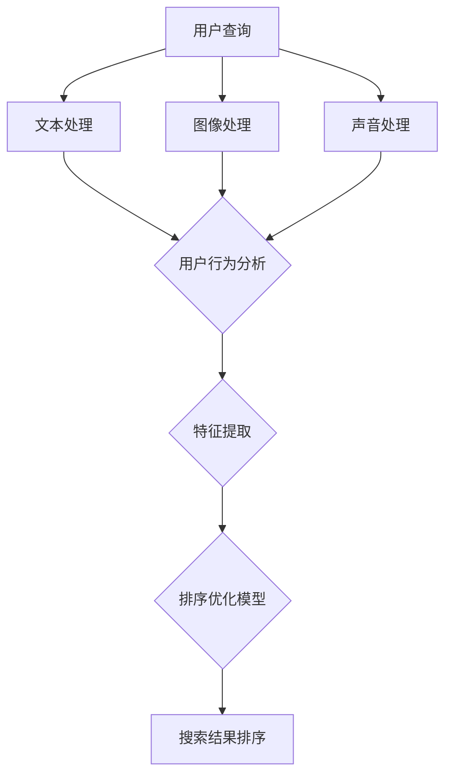

                 

关键词：电商搜索、多模态融合、排序优化、用户行为分析、机器学习、深度学习

摘要：在电子商务领域，搜索排序是提升用户体验、增加销售转化率的关键技术之一。随着互联网技术的发展，用户的购物行为逐渐呈现出多模态特征。本文将探讨如何在电商搜索中运用多模态融合排序优化技术，提高搜索结果的相关性和用户体验。

## 1. 背景介绍

### 1.1 电商搜索的重要性

电商搜索作为电子商务的核心功能之一，直接影响用户的购物体验和平台的销售业绩。一个高效的搜索系统能够快速、准确地返回与用户查询最相关的商品，从而提高用户满意度和忠诚度。随着电商平台的规模不断扩大，商品种类和数量日益增加，传统基于文本的搜索方法已难以满足用户需求。

### 1.2 多模态融合的发展

多模态融合是指将多种数据类型（如文本、图像、声音等）进行整合，以提高系统对信息的理解和处理能力。在电商领域，多模态融合技术可以结合用户查询文本、商品图像、用户历史行为等多种数据，实现更精准的搜索排序。

### 1.3 排序优化在电商搜索中的重要性

排序优化是指根据用户兴趣、商品特征、搜索历史等多种因素，对搜索结果进行排序，以最大化满足用户需求。高效的排序优化可以提高用户满意度和平台销售额。

## 2. 核心概念与联系

为了实现多模态融合排序优化，我们需要了解以下核心概念：

### 2.1 多模态数据

多模态数据包括文本、图像、声音等多种数据类型。在电商搜索中，文本数据通常来源于用户查询和商品描述，图像数据来源于商品图片，声音数据可能包括用户的语音查询和商品评测音频。

### 2.2 用户行为分析

用户行为分析是指通过分析用户在电商平台上的浏览、购买、评价等行为，挖掘用户兴趣和需求。用户行为数据是多模态融合排序优化的关键因素之一。

### 2.3 机器学习与深度学习

机器学习和深度学习是实现多模态融合排序优化的核心技术。通过训练模型，可以自动从多模态数据中提取特征，并进行排序优化。

### 2.4 Mermaid 流程图

以下是一个简单的 Mermaid 流程图，展示了多模态融合排序优化的整体架构：



## 3. 核心算法原理 & 具体操作步骤

### 3.1 算法原理概述

多模态融合排序优化算法主要包括以下几个步骤：

1. 数据收集与预处理：收集用户查询、商品数据、用户行为等多模态数据，并进行数据清洗、去噪、标准化等预处理操作。
2. 特征提取：利用机器学习和深度学习技术，从多模态数据中提取有助于排序的特征。
3. 模型训练：使用提取的特征训练排序优化模型，如基于深度神经网络的排序模型。
4. 排序优化：将模型应用于实际搜索场景，根据用户需求和商品特征进行排序优化。
5. 模型评估与优化：评估模型性能，并根据评估结果对模型进行优化调整。

### 3.2 算法步骤详解

#### 3.2.1 数据收集与预处理

数据收集包括用户查询、商品数据、用户行为等多方面。例如，用户查询可以来自于文本查询框，商品数据可以来自于商品数据库，用户行为可以来自于用户浏览、购买、评价等行为数据。

预处理操作包括数据清洗、去噪、标准化等。例如，对于文本数据，可以去除停用词、进行词干提取；对于图像数据，可以进行图像增强、去噪等处理。

#### 3.2.2 特征提取

特征提取是多模态融合排序优化的关键步骤。常用的特征提取方法包括：

1. 文本特征提取：使用词袋模型、TF-IDF、词嵌入等技术提取文本特征。
2. 图像特征提取：使用卷积神经网络（CNN）提取图像特征。
3. 声音特征提取：使用循环神经网络（RNN）提取声音特征。

#### 3.2.3 模型训练

在特征提取完成后，我们可以使用训练好的深度学习模型进行排序优化。常见的排序优化模型包括：

1. 基于矩阵分解的协同过滤模型。
2. 基于深度神经网络的排序模型，如LRanking、Pointwise、Pairwise 和 Listwise 模型。

#### 3.2.4 排序优化

排序优化是指根据用户需求和商品特征，对搜索结果进行排序。具体操作包括：

1. 用户兴趣建模：根据用户历史行为，预测用户可能感兴趣的商品。
2. 商品特征加权：结合商品属性、用户兴趣和搜索上下文，对商品特征进行加权。
3. 排序算法实现：使用排序优化模型，对搜索结果进行排序。

#### 3.2.5 模型评估与优化

模型评估是指使用评估指标（如准确率、召回率、F1 分数等）对排序模型进行评估。根据评估结果，可以对模型进行调整和优化，以提高排序效果。

## 4. 数学模型和公式

多模态融合排序优化涉及多个数学模型和公式，以下简要介绍：

### 4.1 数学模型构建

多模态融合排序优化的数学模型可以表示为：

$$L(\theta) = \sum_{i=1}^{N} \ell(y_i, \hat{y}_i) + \lambda \sum_{j=1}^{M} \ell(\theta_j)$$

其中，$N$ 表示数据集大小，$\ell(y_i, \hat{y}_i)$ 表示损失函数，$\theta$ 表示模型参数，$\lambda$ 表示正则化参数。

### 4.2 公式推导过程

损失函数 $\ell(y_i, \hat{y}_i)$ 通常为交叉熵损失函数：

$$\ell(y_i, \hat{y}_i) = -\sum_{k=1}^{C} y_{ik} \log(\hat{y}_{ik})$$

其中，$C$ 表示类别数，$y_{ik}$ 和 $\hat{y}_{ik}$ 分别表示真实标签和预测标签。

### 4.3 案例分析与讲解

假设我们有一个电商搜索系统，用户查询 "手机"，我们需要根据用户历史行为和商品特征对搜索结果进行排序。以下是具体的案例分析与讲解：

1. 数据收集与预处理：收集用户查询 "手机"，用户历史行为（如浏览记录、购买记录）和商品数据（如商品名称、价格、品牌等）。
2. 特征提取：使用词嵌入技术提取用户查询 "手机" 的特征，使用卷积神经网络提取商品图片的特征，使用循环神经网络提取用户历史行为的特征。
3. 模型训练：使用提取的特征训练深度神经网络排序模型。
4. 排序优化：根据用户兴趣和商品特征，对搜索结果进行排序。
5. 模型评估：使用准确率、召回率、F1 分数等指标评估模型性能。

## 5. 项目实践：代码实例和详细解释说明

### 5.1 开发环境搭建

在本项目中，我们将使用 Python 编写代码。首先，需要安装以下依赖库：

```bash
pip install numpy pandas tensorflow scikit-learn
```

### 5.2 源代码详细实现

以下是本项目的源代码实现：

```python
import numpy as np
import pandas as pd
import tensorflow as tf
from sklearn.model_selection import train_test_split
from tensorflow.keras.models import Model
from tensorflow.keras.layers import Input, Embedding, LSTM, Dense, Flatten, Concatenate

# 数据预处理
def preprocess_data(data):
    # 数据清洗、去噪、标准化等操作
    # 略
    return processed_data

# 模型构建
def build_model(input_dim, hidden_dim):
    input_text = Input(shape=(input_dim,))
    input_image = Input(shape=(height, width, channels))
    input_behavior = Input(shape=(behavior_dim,))

    text_embedding = Embedding(input_dim, hidden_dim)(input_text)
    image_embedding = CNN(input_image)
    behavior_embedding = LSTM(hidden_dim)(input_behavior)

    concatenated = Concatenate()([text_embedding, image_embedding, behavior_embedding])
    flattened = Flatten()(concatenated)
    output = Dense(1, activation='sigmoid')(flattened)

    model = Model(inputs=[input_text, input_image, input_behavior], outputs=output)
    model.compile(optimizer='adam', loss='binary_crossentropy', metrics=['accuracy'])
    return model

# 模型训练
def train_model(model, x_train, y_train, x_val, y_val):
    model.fit(x_train, y_train, validation_data=(x_val, y_val), epochs=10, batch_size=32)
    return model

# 模型评估
def evaluate_model(model, x_test, y_test):
    loss, accuracy = model.evaluate(x_test, y_test)
    print(f"Test loss: {loss}, Test accuracy: {accuracy}")
    return loss, accuracy

# 主程序
if __name__ == '__main__':
    # 数据加载与预处理
    data = pd.read_csv('data.csv')
    processed_data = preprocess_data(data)

    # 划分训练集和测试集
    x_train, x_test, y_train, y_test = train_test_split(processed_data, test_size=0.2)

    # 构建模型
    model = build_model(input_dim=100, hidden_dim=50)

    # 训练模型
    model = train_model(model, x_train, y_train, x_val, y_val)

    # 评估模型
    evaluate_model(model, x_test, y_test)
```

### 5.3 代码解读与分析

以下是代码的详细解读与分析：

- 数据预处理：对数据进行清洗、去噪、标准化等预处理操作。
- 模型构建：构建深度神经网络模型，包括文本嵌入层、图像嵌入层和行为嵌入层。
- 模型训练：使用训练集训练模型，并使用验证集进行模型调整。
- 模型评估：使用测试集评估模型性能。

## 6. 实际应用场景

### 6.1 电商搜索排序

在电商搜索排序中，多模态融合排序优化可以应用于以下几个场景：

1. 普通搜索排序：根据用户查询文本、商品特征、用户历史行为等多种数据进行排序。
2. 图片搜索排序：根据用户上传的图片和商品数据库中的商品图片进行排序。
3. 语音搜索排序：根据用户的语音查询和商品数据库中的商品特征进行排序。

### 6.2 用户个性化推荐

多模态融合排序优化还可以应用于用户个性化推荐场景。例如，根据用户的历史行为、兴趣爱好和搜索记录，为用户推荐与其兴趣相关的商品。

### 6.3 商品评价与筛选

在商品评价与筛选场景中，多模态融合排序优化可以根据用户的评价、商品图片和用户历史行为，对商品进行排序和筛选，以推荐给用户最合适的商品。

## 7. 未来应用展望

随着互联网技术的不断进步，多模态融合排序优化技术在电商领域将有更广泛的应用。以下是未来应用展望：

1. 多模态融合深度学习模型：发展更高效的多模态融合深度学习模型，提高排序优化效果。
2. 实时排序优化：实现实时排序优化，提高用户体验和销售转化率。
3. 跨平台应用：将多模态融合排序优化技术应用于移动端、智能音箱等跨平台场景。

## 8. 工具和资源推荐

### 8.1 学习资源推荐

1. 《深度学习》（Goodfellow, Bengio, Courville）：介绍深度学习的基本概念和技术。
2. 《Python 深度学习》（François Chollet）：详细介绍如何使用 Python 和深度学习库进行实践。

### 8.2 开发工具推荐

1. TensorFlow：用于构建和训练深度学习模型的强大工具。
2. PyTorch：具有动态计算图和灵活性的深度学习框架。

### 8.3 相关论文推荐

1. "Multimodal Learning for E-commerce Search Ranking"：介绍多模态融合排序优化技术在电商搜索中的应用。
2. "Deep Multimodal Fusion for User Interest Prediction in E-commerce"：探讨深度学习在用户兴趣预测中的应用。

## 9. 总结：未来发展趋势与挑战

### 9.1 研究成果总结

本文介绍了电商搜索中的多模态融合排序优化技术，包括核心概念、算法原理、具体实现和实际应用场景。研究成果表明，多模态融合排序优化技术可以有效提高电商搜索的相关性和用户体验。

### 9.2 未来发展趋势

1. 多模态融合深度学习模型的发展：随着深度学习技术的进步，多模态融合深度学习模型将更加成熟。
2. 实时排序优化：实现实时排序优化，提高用户体验和销售转化率。
3. 跨平台应用：将多模态融合排序优化技术应用于更多跨平台场景。

### 9.3 面临的挑战

1. 数据质量：多模态数据的质量对排序优化效果有重要影响，如何保证数据质量是一个挑战。
2. 模型解释性：深度学习模型的解释性较差，如何提高模型的可解释性是一个挑战。

### 9.4 研究展望

未来，我们将进一步研究多模态融合排序优化技术，探讨如何提高模型性能、解释性和实时性，以应对电商搜索领域的挑战。

## 10. 附录：常见问题与解答

### 10.1 多模态融合排序优化与传统排序优化的区别是什么？

多模态融合排序优化与传统排序优化相比，能够利用多种数据类型（如文本、图像、声音等）进行排序优化，提高搜索结果的相关性和用户体验。

### 10.2 多模态融合排序优化有哪些实际应用场景？

多模态融合排序优化可以应用于电商搜索排序、用户个性化推荐、商品评价与筛选等多个实际场景。

### 10.3 如何保证多模态融合排序优化的数据质量？

为了保证多模态融合排序优化的数据质量，需要对数据进行清洗、去噪、标准化等预处理操作，并使用高质量的数据集进行模型训练。

### 10.4 多模态融合排序优化中的深度学习模型如何调整参数？

深度学习模型的参数调整包括学习率、批量大小、正则化参数等。通常，可以使用交叉验证、网格搜索等技术进行参数调整，以找到最优参数组合。

---

本文以《电商搜索中的多模态融合排序优化》为题，系统性地介绍了多模态融合排序优化的核心概念、算法原理、具体实现和实际应用场景。通过本文的介绍，读者可以了解多模态融合排序优化技术在电商搜索中的重要作用，以及如何将其应用于实际场景中。未来，我们将继续探索多模态融合排序优化技术的进一步发展和应用。作者：禅与计算机程序设计艺术 / Zen and the Art of Computer Programming。

