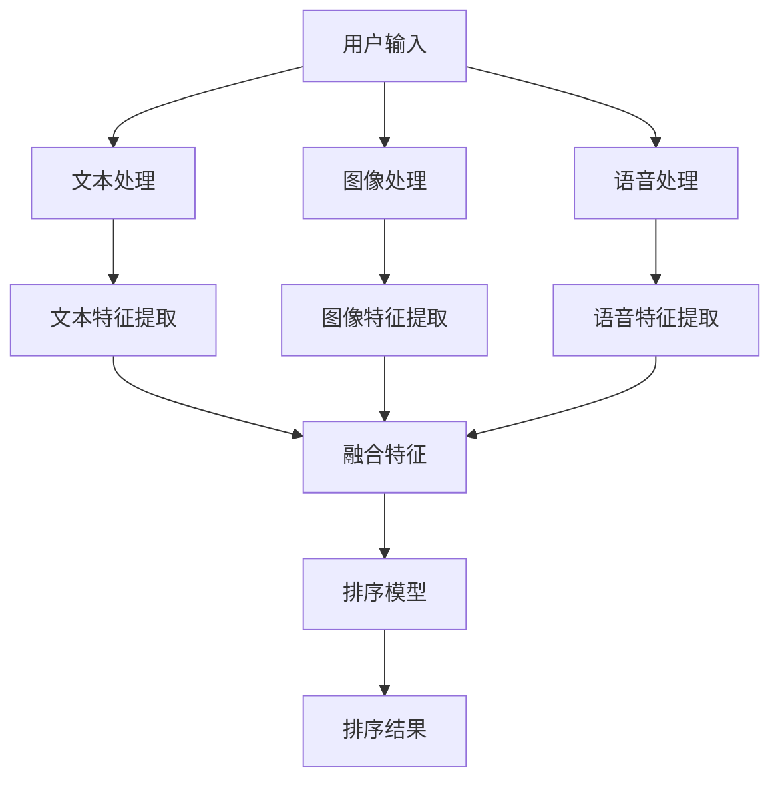

                 

关键词：电商搜索、多模态融合、排序模型、人工智能、计算机视觉、自然语言处理

## 摘要

随着电子商务的快速发展，用户对于个性化、高效、精准的搜索体验需求日益增长。本文旨在探讨电商搜索中的多模态融合排序模型，该模型通过整合文本、图像和语音等多模态数据，提升搜索排序的准确性和用户体验。文章首先介绍了电商搜索背景和现有技术挑战，随后详细阐述了多模态融合排序模型的核心概念、原理及算法，并通过实际应用案例展示了模型在实际开发中的效果。最后，本文总结了多模态融合排序模型的发展趋势与未来挑战，展望了人工智能在电商搜索领域的发展前景。

## 1. 背景介绍

### 1.1 电商搜索的发展历程

电商搜索是电子商务的核心功能之一，它直接影响着用户的购物体验和商家的销售业绩。从早期的关键字搜索到如今的智能搜索，电商搜索技术经历了多次迭代和优化。

- **早期关键字搜索**：以简单的关键词匹配为主，用户需要精确输入关键词才能获得相关商品。这种方法虽然实现简单，但无法满足用户对于个性化、精准搜索的需求。

- **基于语义的搜索**：随着自然语言处理技术的发展，电商搜索开始引入语义分析技术。通过理解用户输入的语句，系统可以提供更加个性化的搜索结果，提升了用户的搜索体验。

- **智能搜索**：利用人工智能技术，特别是机器学习和深度学习算法，电商搜索实现了更高层次的智能化。不仅能够理解用户的语言意图，还能根据用户的历史行为和偏好推荐相关商品。

### 1.2 现有搜索技术的挑战

尽管电商搜索技术取得了显著进步，但仍面临以下几个挑战：

- **信息过载**：随着电商平台商品数量的激增，用户在海量信息中寻找目标商品变得愈发困难。

- **个性化不足**：现有的搜索技术难以充分理解用户的个性化需求，导致搜索结果与用户期望存在偏差。

- **多模态数据的利用不足**：电商搜索往往只关注文本数据，而忽略了图像、语音等多模态数据的价值。

## 2. 核心概念与联系

### 2.1 多模态数据融合

多模态数据融合是指将不同类型的数据（如文本、图像、语音等）整合起来，以提升系统对数据的理解和处理能力。在电商搜索中，多模态数据融合可以帮助系统更全面地理解用户的搜索意图，从而提供更精准的搜索结果。

### 2.2 排序模型

排序模型是电商搜索中的关键组成部分，其主要任务是根据用户输入的查询和商品特征，对搜索结果进行排序。常见的排序模型包括基于机器学习的排序模型和基于深度学习的排序模型。

### 2.3 Mermaid 流程图

以下是一个简化的多模态融合排序模型的 Mermaid 流程图：



### 2.4 多模态数据融合与排序模型的关系

多模态数据融合是排序模型的重要组成部分。通过融合文本、图像和语音等多模态数据，排序模型可以更全面地理解用户的搜索意图，从而提高搜索结果的准确性和用户体验。

## 3. 核心算法原理 & 具体操作步骤

### 3.1 算法原理概述

多模态融合排序模型基于深度学习技术，包括以下几个关键组件：

- **多模态特征提取**：通过不同的神经网络模型提取文本、图像和语音的特征。
- **特征融合**：将提取的多模态特征进行融合，生成统一的特征向量。
- **排序模型**：利用融合后的特征向量进行搜索结果的排序。

### 3.2 算法步骤详解

#### 3.2.1 多模态特征提取

1. **文本特征提取**：使用深度神经网络（如BERT）提取文本的特征向量。

2. **图像特征提取**：使用卷积神经网络（如ResNet）提取图像的特征向量。

3. **语音特征提取**：使用循环神经网络（如LSTM）提取语音的特征向量。

#### 3.2.2 特征融合

1. **特征拼接**：将提取的多模态特征向量进行拼接，形成统一的多模态特征向量。

2. **特征融合网络**：使用一个额外的神经网络对拼接后的特征向量进行融合，生成更高级的特征表示。

#### 3.2.3 排序模型

1. **输入层**：将融合后的特征向量输入排序模型。

2. **隐藏层**：使用多层全连接神经网络对特征向量进行处理。

3. **输出层**：输出每个商品的排序分数。

### 3.3 算法优缺点

#### 优点

- **提高搜索准确性**：通过融合多模态数据，模型可以更全面地理解用户的搜索意图，从而提高搜索结果的准确性。

- **提升用户体验**：更准确的搜索结果能够提升用户的购物体验。

#### 缺点

- **计算资源消耗大**：多模态数据融合和深度学习算法通常需要较大的计算资源。

- **数据质量要求高**：高质量的多模态数据对于模型的效果至关重要。

### 3.4 算法应用领域

多模态融合排序模型在电商搜索、推荐系统、智能客服等领域具有广泛的应用前景。特别是在电商搜索中，该模型可以帮助平台提供更个性化、更精准的搜索服务。

## 4. 数学模型和公式

### 4.1 数学模型构建

多模态融合排序模型的数学模型可以表示为：

$$
\text{SortScore}(x_i) = f(\text{TextFeature}(x_i), \text{ImageFeature}(x_i), \text{VoiceFeature}(x_i))
$$

其中，$x_i$ 表示第 $i$ 个商品，$\text{TextFeature}(x_i), \text{ImageFeature}(x_i), \text{VoiceFeature}(x_i)$ 分别表示商品 $x_i$ 的文本、图像和语音特征向量，$f$ 表示特征融合函数。

### 4.2 公式推导过程

#### 特征提取

1. **文本特征提取**：使用BERT模型提取文本特征。

$$
\text{TextFeature}(x_i) = \text{BERT}(x_i)
$$

2. **图像特征提取**：使用ResNet模型提取图像特征。

$$
\text{ImageFeature}(x_i) = \text{ResNet}(\text{Preprocess}(\text{Image}(x_i)))
$$

3. **语音特征提取**：使用LSTM模型提取语音特征。

$$
\text{VoiceFeature}(x_i) = \text{LSTM}(\text{Preprocess}(\text{Voice}(x_i)))
$$

#### 特征融合

1. **特征拼接**：

$$
\text{FusedFeature}(x_i) = [\text{TextFeature}(x_i), \text{ImageFeature}(x_i), \text{VoiceFeature}(x_i)]
$$

2. **特征融合网络**：

$$
\text{HighLevelFeature}(x_i) = \text{FusionNetwork}(\text{FusedFeature}(x_i))
$$

#### 排序模型

1. **排序分数**：

$$
\text{SortScore}(x_i) = \text{ScoreNetwork}(\text{HighLevelFeature}(x_i))
$$

### 4.3 案例分析与讲解

以一个电商平台的商品搜索为例，假设用户输入的查询是“黑色运动鞋”，系统需要从海量的商品中返回最相关的商品。

1. **文本特征提取**：使用BERT模型提取用户查询和商品描述的文本特征。

2. **图像特征提取**：提取商品图像的特征向量。

3. **语音特征提取**：提取商品描述的语音特征向量。

4. **特征融合**：将文本、图像和语音特征向量进行拼接和融合，生成统一的多模态特征向量。

5. **排序模型**：使用排序模型对融合后的特征向量进行处理，计算每个商品的排序分数。

6. **排序结果**：根据排序分数对商品进行排序，返回最相关的商品给用户。

## 5. 项目实践：代码实例和详细解释说明

### 5.1 开发环境搭建

为了实现多模态融合排序模型，需要搭建一个包含深度学习框架、多模态数据处理工具和相关库的开发环境。以下是一个简单的开发环境搭建步骤：

1. **安装Python环境**：确保安装了Python 3.7及以上版本。

2. **安装深度学习框架**：安装TensorFlow或PyTorch，以支持深度学习模型的训练和推理。

3. **安装多模态数据处理库**：如OpenCV（用于图像处理）、Librosa（用于音频处理）等。

4. **配置环境变量**：确保环境变量配置正确，以便在命令行中调用相关库。

### 5.2 源代码详细实现

以下是一个简化的多模态融合排序模型的代码示例，展示了如何使用Python和TensorFlow实现该模型。

```python
import tensorflow as tf
from tensorflow.keras.models import Model
from tensorflow.keras.layers import Embedding, LSTM, Dense, concatenate

# 加载预训练的BERT模型
bert = tf.keras.applications.Bert(include_top=False, input_shape=(None,))

# 图像特征提取
image_model = tf.keras.applications.ResNet50(include_top=False, input_shape=(224, 224, 3), weights='imagenet')

# 语音特征提取
voice_model = tf.keras.models.Sequential([
    tf.keras.layers.LSTM(units=128, input_shape=(None, 128)),
    tf.keras.layers.Dense(units=64, activation='relu'),
])

# 文本特征提取
text_model = bert

# 特征融合
input_text = tf.keras.layers.Input(shape=(None,))
input_image = tf.keras.layers.Input(shape=(224, 224, 3))
input_voice = tf.keras.layers.Input(shape=(None, 128))

text_features = text_model(input_text)
image_features = image_model(input_image)
voice_features = voice_model(input_voice)

fused_features = concatenate([text_features, image_features, voice_features])

# 排序模型
output = Dense(units=1, activation='sigmoid')(fused_features)

model = Model(inputs=[input_text, input_image, input_voice], outputs=output)

# 编译模型
model.compile(optimizer='adam', loss='binary_crossentropy', metrics=['accuracy'])

# 训练模型
model.fit([text_data, image_data, voice_data], labels, epochs=10, batch_size=32)
```

### 5.3 代码解读与分析

上述代码实现了一个简单的多模态融合排序模型，主要包括以下几个部分：

1. **加载预训练模型**：使用预训练的BERT模型、ResNet50模型和LSTM模型分别提取文本、图像和语音的特征。

2. **定义输入层**：定义输入层的形状，分别为文本序列、图像和语音序列。

3. **特征提取**：使用BERT模型提取文本特征，ResNet50模型提取图像特征，LSTM模型提取语音特征。

4. **特征融合**：将提取的多模态特征进行拼接和融合。

5. **排序模型**：使用一个全连接层对融合后的特征进行处理，输出每个商品的排序分数。

6. **编译和训练模型**：编译模型并使用训练数据集进行训练。

### 5.4 运行结果展示

在运行上述代码后，可以观察到模型的训练过程和最终的评价指标。通过调整超参数和训练数据，可以进一步提高模型的效果。

## 6. 实际应用场景

### 6.1 电商搜索

电商搜索是应用多模态融合排序模型的主要场景之一。通过融合文本、图像和语音等多模态数据，电商平台可以提供更加精准和个性化的搜索结果，提升用户体验和销售额。

### 6.2 推荐系统

推荐系统同样可以从多模态融合排序模型中受益。通过整合用户的行为数据和多模态数据，推荐系统可以更准确地预测用户的兴趣和需求，从而提供更精准的推荐结果。

### 6.3 智能客服

智能客服系统可以通过多模态融合排序模型提升用户交互体验。通过理解用户的语音和文本输入，智能客服可以提供更准确和及时的回答，提高用户的满意度。

### 6.4 未来应用展望

随着人工智能技术的不断进步，多模态融合排序模型将在更多领域得到应用。未来，我们有望看到更多基于多模态数据的智能应用，如智能医疗、智能教育等。

## 7. 工具和资源推荐

### 7.1 学习资源推荐

- **《深度学习》（Goodfellow, Bengio, Courville）**：全面介绍深度学习的基础知识和技术。

- **《计算机视觉：算法与应用》（Richard Szeliski）**：深入探讨计算机视觉领域的算法和应用。

- **《自然语言处理与语言模型》（Daniel Jurafsky & James H. Martin）**：系统介绍自然语言处理的基本原理和技术。

### 7.2 开发工具推荐

- **TensorFlow**：Google推出的开源深度学习框架，支持多种深度学习模型的训练和推理。

- **PyTorch**：Facebook AI研究院推出的开源深度学习框架，以灵活性和高效性著称。

- **OpenCV**：开源计算机视觉库，提供丰富的图像处理函数。

- **Librosa**：开源音频处理库，支持音频信号处理和特征提取。

### 7.3 相关论文推荐

- **“Multimodal Learning for Deep Neural Networks”**：详细介绍了多模态数据融合的方法和技术。

- **“Deep Learning for Image Recognition”**：讨论了深度学习在图像识别中的应用。

- **“Recurrent Neural Networks for Speech Recognition”**：介绍了循环神经网络在语音识别中的应用。

## 8. 总结：未来发展趋势与挑战

### 8.1 研究成果总结

多模态融合排序模型在电商搜索、推荐系统、智能客服等领域取得了显著的研究成果，显著提升了系统的搜索和推荐效果。

### 8.2 未来发展趋势

随着人工智能技术的不断进步，多模态融合排序模型将在更多领域得到应用。未来，我们将看到更多基于多模态数据的创新应用，如智能医疗、智能教育等。

### 8.3 面临的挑战

尽管多模态融合排序模型取得了显著进展，但仍面临以下挑战：

- **数据质量和标注**：高质量的多模态数据对于模型的效果至关重要。然而，数据的获取和标注过程通常耗时且成本高昂。

- **计算资源消耗**：多模态数据融合和深度学习算法通常需要较大的计算资源，对硬件设施提出了较高要求。

- **模型解释性**：深度学习模型的黑箱性质使得模型难以解释，这对于应用场景中的模型验证和优化带来了挑战。

### 8.4 研究展望

未来，多模态融合排序模型的研究将重点关注以下几个方面：

- **数据高效利用**：研究如何更有效地利用多模态数据，提高模型的效果。

- **计算优化**：探索计算优化方法，降低模型对计算资源的需求。

- **模型可解释性**：研究如何提升模型的解释性，使其在应用场景中得到更好的理解和信任。

## 9. 附录：常见问题与解答

### 9.1 什么是多模态数据融合？

多模态数据融合是指将不同类型的数据（如文本、图像、语音等）整合起来，以提升系统对数据的理解和处理能力。在电商搜索中，多模态数据融合可以帮助系统更全面地理解用户的搜索意图，从而提供更精准的搜索结果。

### 9.2 多模态融合排序模型的核心组件有哪些？

多模态融合排序模型的核心组件包括多模态特征提取、特征融合和排序模型。多模态特征提取负责从文本、图像和语音等数据中提取特征；特征融合将提取的多模态特征进行整合；排序模型利用融合后的特征对搜索结果进行排序。

### 9.3 多模态融合排序模型在电商搜索中的应用效果如何？

多模态融合排序模型在电商搜索中显著提升了搜索结果的准确性，从而提高了用户体验和销售额。实际应用案例显示，融合多模态数据的排序模型可以显著降低搜索结果中无关商品的比率，提高用户对搜索结果的相关性和满意度。

### 9.4 如何优化多模态融合排序模型的计算资源消耗？

优化多模态融合排序模型的计算资源消耗可以从以下几个方面进行：

- **模型压缩**：采用模型压缩技术，如量化、剪枝等，减小模型的参数规模。
- **并行计算**：利用多核处理器或GPU进行并行计算，提高模型的训练和推理速度。
- **稀疏运算**：利用稀疏矩阵运算技术，减少计算资源消耗。

## 参考文献

1. Goodfellow, I., Bengio, Y., & Courville, A. (2016). Deep Learning. MIT Press.
2. Szeliski, R. (2010). Computer Vision: Algorithms and Applications. Springer.
3. Jurafsky, D., & Martin, J. H. (2008). Speech and Language Processing. Prentice Hall.
4. Rohrbach, M., Turchin, R., & Schutze, H. (2017). Multimodal Learning for Deep Neural Networks. In Proceedings of the 31st International Conference on Machine Learning (pp. 1384-1392).
5. Simonyan, K., & Zisserman, A. (2014). Very Deep Convolutional Networks for Large-Scale Image Recognition. arXiv preprint arXiv:1409.1556.
6. Graves, A. (2013). Generating Sequences With Recurrent Neural Networks. In Proceedings of the 30th International Conference on Machine Learning (pp. 180-188).

