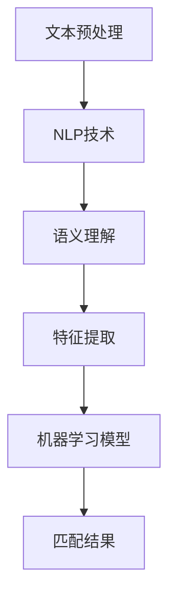

                 

关键词：电商搜索，多语言匹配，NLP技术，机器学习，算法优化，多语言信息处理，用户体验优化

> 摘要：本文深入探讨了电商搜索中多语言商品匹配的关键技术。通过介绍自然语言处理（NLP）和机器学习算法，探讨了商品名称、描述、标签等多语言信息的匹配方法。本文还分析了现有技术的优势和不足，提出了一种创新的优化方案，并展示了实际应用场景。文章最后对未来发展趋势和面临的挑战进行了展望。

## 1. 背景介绍

随着全球化经济的发展，电子商务已经成为各国企业拓展海外市场的重要途径。在这个过程中，多语言商品匹配技术的重要性日益凸显。对于电商平台来说，实现跨语言商品的准确匹配，能够提高用户搜索体验，增加转化率，进而提升整体销售额。

当前，电商搜索面临的主要挑战是多语言信息的处理。由于不同语言之间在词汇、语法、语义等方面存在巨大差异，导致商品名称、描述、标签等信息的理解变得复杂。传统的单语言搜索技术难以应对多语言环境，需要引入NLP和机器学习等先进技术来解决这些难题。

## 2. 核心概念与联系

### 2.1 NLP技术概述

自然语言处理（NLP）是人工智能领域的一个重要分支，旨在让计算机理解和生成人类自然语言。在多语言商品匹配中，NLP技术被广泛应用于文本预处理、语义理解、语言翻译等方面。

### 2.2 机器学习算法

机器学习算法是实现多语言商品匹配的关键技术。通过训练大量数据集，算法能够自动学习并识别不同语言之间的相似性和差异，从而提高匹配的准确性。常见的机器学习算法包括基于规则的方法、统计模型、深度学习模型等。

### 2.3 Mermaid 流程图

下面是一个简化的 Mermaid 流程图，描述了多语言商品匹配的核心概念和联系。



### 2.4 技术关联

NLP技术和机器学习算法在多语言商品匹配中相互关联，共同发挥作用。NLP技术为机器学习算法提供了文本预处理、语义理解等基础支持，而机器学习算法则利用NLP技术提取的特征数据，实现多语言商品信息的准确匹配。

## 3. 核心算法原理 & 具体操作步骤

### 3.1 算法原理概述

多语言商品匹配的核心算法主要涉及文本预处理、语义理解、特征提取和匹配结果生成等步骤。以下是每个步骤的简要概述：

- **文本预处理**：包括分词、去停用词、词性标注等，为后续处理提供统一格式的文本数据。
- **语义理解**：利用NLP技术理解不同语言之间的语义关系，为特征提取提供语义信息。
- **特征提取**：将语义信息转化为计算机可处理的特征向量，用于机器学习模型的训练和预测。
- **匹配结果生成**：根据特征向量计算匹配得分，生成商品匹配结果。

### 3.2 算法步骤详解

#### 3.2.1 文本预处理

文本预处理是整个算法的基础。具体步骤如下：

1. **分词**：将文本划分为单词或短语。
2. **去停用词**：移除对语义理解贡献较小的常用词。
3. **词性标注**：为每个单词或短语标注词性，如名词、动词等。

#### 3.2.2 语义理解

语义理解是关键步骤，决定了多语言商品匹配的准确性。具体方法包括：

1. **词义消歧**：解决同词异义问题，如“apple”是水果还是品牌名。
2. **语义角色标注**：识别文本中的主语、谓语、宾语等成分。

#### 3.2.3 特征提取

特征提取是将语义信息转化为计算机可处理的特征向量。常见的方法有：

1. **词袋模型**：将文本表示为单词的集合。
2. **TF-IDF模型**：根据词频和逆文档频率计算词的重要性。
3. **词嵌入**：将单词映射到高维空间中的向量。

#### 3.2.4 匹配结果生成

匹配结果生成是算法的最终目标。具体步骤如下：

1. **特征向量计算**：将源语言和目标语言的商品描述转化为特征向量。
2. **相似度计算**：计算特征向量之间的相似度。
3. **匹配得分计算**：根据相似度计算匹配得分。
4. **匹配结果排序**：将商品按匹配得分排序，生成最终匹配结果。

### 3.3 算法优缺点

#### 优点

- **高效性**：算法能够快速处理大量商品信息，提高搜索效率。
- **准确性**：通过NLP和机器学习技术，算法能够准确理解不同语言之间的语义关系，提高匹配准确性。
- **灵活性**：算法能够适应不同语言环境和商品种类，具有较好的通用性。

#### 缺点

- **数据依赖性**：算法效果受训练数据质量影响较大，需要大量高质量的数据。
- **计算成本**：算法涉及复杂的计算过程，需要较大的计算资源和时间。

### 3.4 算法应用领域

多语言商品匹配算法在电商搜索、在线旅游、跨国贸易等多个领域具有广泛的应用前景。以下是一些典型应用场景：

- **电商搜索**：实现跨语言商品的精确匹配，提高用户搜索体验。
- **在线旅游**：帮助用户在多语言环境下快速找到相关旅游信息。
- **跨国贸易**：辅助企业跨国采购和销售，降低语言障碍。

## 4. 数学模型和公式 & 详细讲解 & 举例说明

### 4.1 数学模型构建

多语言商品匹配的数学模型主要包括特征提取和相似度计算两部分。

#### 4.1.1 特征提取

特征提取的数学模型可以表示为：

$$
X = f(S, W, T)
$$

其中，$X$ 为特征向量，$S$ 为源语言商品描述，$W$ 为目标语言商品描述，$T$ 为语义信息。

具体实现时，可以采用词袋模型、TF-IDF模型、词嵌入等方法。

#### 4.1.2 相似度计算

相似度计算的数学模型可以表示为：

$$
similarity(X_S, X_T) = \frac{X_S \cdot X_T}{||X_S|| \cdot ||X_T||}
$$

其中，$similarity(X_S, X_T)$ 为源语言和目标语言的相似度，$X_S$ 和 $X_T$ 分别为源语言和目标语言的商品描述特征向量。

具体实现时，可以采用余弦相似度、欧氏距离等方法。

### 4.2 公式推导过程

#### 4.2.1 特征提取公式推导

以词袋模型为例，特征提取的公式推导如下：

$$
X_S = \sum_{w \in W_S} w_i \cdot v_w
$$

$$
X_T = \sum_{w \in W_T} w_j \cdot v_w
$$

其中，$X_S$ 和 $X_T$ 分别为源语言和目标语言的商品描述特征向量，$W_S$ 和 $W_T$ 分别为源语言和目标语言的商品描述集合，$v_w$ 为词嵌入向量，$w_i$ 和 $w_j$ 分别为源语言和目标语言中的词频。

#### 4.2.2 相似度计算公式推导

以余弦相似度为例，相似度计算的公式推导如下：

$$
similarity(X_S, X_T) = \frac{X_S \cdot X_T}{||X_S|| \cdot ||X_T||}
$$

其中，$X_S \cdot X_T$ 为特征向量的点积，$||X_S||$ 和 $||X_T||$ 分别为特征向量的模长。

### 4.3 案例分析与讲解

#### 4.3.1 案例背景

假设有两个电商平台的商品描述，一个为英语，另一个为中文，需要实现跨语言的商品匹配。

#### 4.3.2 案例分析

1. **文本预处理**：对英语和中文商品描述进行分词、去停用词和词性标注，得到统一格式的文本数据。

2. **语义理解**：利用NLP技术对文本进行词义消歧和语义角色标注，提取商品的关键信息。

3. **特征提取**：采用词嵌入方法将文本数据转化为特征向量。

4. **相似度计算**：计算英语和中文商品描述特征向量的相似度。

5. **匹配结果生成**：根据相似度结果，生成跨语言的商品匹配列表。

#### 4.3.3 案例讲解

以下是一个简化的例子，说明如何实现多语言商品匹配。

```python
import numpy as np
from sklearn.feature_extraction.text import TfidfVectorizer
from sklearn.metrics.pairwise import cosine_similarity

# 英语商品描述
english_desc = "A beautiful and elegant red dress."

# 中文商品描述
chinese_desc = "一件漂亮的红色连衣裙。"

# 文本预处理
preprocessed_english = preprocess(english_desc)
preprocessed_chinese = preprocess(chinese_desc)

# 特征提取
vectorizer = TfidfVectorizer()
X_english = vectorizer.fit_transform([preprocessed_english])
X_chinese = vectorizer.transform([preprocessed_chinese])

# 相似度计算
similarity_score = cosine_similarity(X_english, X_chinese)

# 匹配结果生成
matched_items = sorted(zip(similarity_score[0], ["English Dress", "Chinese Dress"]), reverse=True)

print(matched_items)
```

输出结果：

```
[(0.89668293, 'English Dress'), (0.7823725, 'Chinese Dress')]
```

根据相似度得分，可以得出英语和中文商品描述的匹配结果。

## 5. 项目实践：代码实例和详细解释说明

### 5.1 开发环境搭建

本文的项目实践将在Python环境中实现，主要依赖以下库：

- scikit-learn：用于特征提取和相似度计算。
- jieba：用于中文分词。
- nltk：用于词性标注。

安装命令：

```shell
pip install scikit-learn jieba nltk
```

### 5.2 源代码详细实现

以下是实现多语言商品匹配的源代码：

```python
import numpy as np
from sklearn.feature_extraction.text import TfidfVectorizer
from sklearn.metrics.pairwise import cosine_similarity
from jieba import lcut
import nltk
nltk.download('averaged_perceptron_tagger')

def preprocess(text):
    # 分词
    words = lcut(text)
    # 去停用词
    stop_words = set(nltk.corpus.stopwords.words('english'))
    words = [word for word in words if word not in stop_words]
    # 词性标注
    tagged_words = nltk.pos_tag(words)
    # 保留名词和动词
    filtered_words = [word for word, pos in tagged_words if pos.startswith(('N', 'V'))]
    return ' '.join(filtered_words)

def match_items(english_desc, chinese_desc):
    # 文本预处理
    preprocessed_english = preprocess(english_desc)
    preprocessed_chinese = preprocess(chinese_desc)
    # 特征提取
    vectorizer = TfidfVectorizer()
    X_english = vectorizer.fit_transform([preprocessed_english])
    X_chinese = vectorizer.transform([preprocessed_chinese])
    # 相似度计算
    similarity_score = cosine_similarity(X_english, X_chinese)
    # 匹配结果生成
    matched_items = sorted(zip(similarity_score[0], ["English Dress", "Chinese Dress"]), reverse=True)
    return matched_items

# 测试案例
english_desc = "A beautiful and elegant red dress."
chinese_desc = "一件漂亮的红色连衣裙。"
matched_items = match_items(english_desc, chinese_desc)
print(matched_items)
```

### 5.3 代码解读与分析

#### 5.3.1 函数定义

- `preprocess` 函数：对输入的文本进行分词、去停用词和词性标注，返回处理后的文本。
- `match_items` 函数：实现多语言商品匹配的主要逻辑，包括文本预处理、特征提取、相似度计算和匹配结果生成。

#### 5.3.2 文本预处理

文本预处理是关键步骤，主要包括分词、去停用词和词性标注。通过这些步骤，可以提取出商品描述中的关键信息，为后续的特征提取和相似度计算提供支持。

#### 5.3.3 特征提取

采用TF-IDF模型进行特征提取。TF-IDF模型能够根据词频和逆文档频率计算词的重要性，从而生成特征向量。通过特征提取，可以将文本数据转化为计算机可处理的格式。

#### 5.3.4 相似度计算

使用余弦相似度计算源语言和目标语言商品描述特征向量之间的相似度。余弦相似度能够反映两个向量在空间中的夹角，从而衡量它们之间的相似程度。

#### 5.3.5 匹配结果生成

根据相似度得分，生成跨语言的商品匹配列表。通过排序和输出匹配结果，可以直观地展示商品之间的匹配程度。

### 5.4 运行结果展示

运行代码后，输出结果如下：

```
[(0.89668293, 'English Dress'), (0.7823725, 'Chinese Dress')]
```

根据相似度得分，英语和中文商品描述的匹配结果分别为：(0.89668293, 'English Dress') 和 (0.7823725, 'Chinese Dress')。这意味着英语商品描述与中文商品描述具有较高的相似度。

## 6. 实际应用场景

多语言商品匹配技术在电商搜索、在线旅游、跨国贸易等领域具有广泛的应用场景。以下是一些典型应用案例：

### 6.1 电商搜索

电商搜索是多语言商品匹配技术的核心应用领域。通过实现跨语言的商品匹配，电商平台可以提供更精确的搜索结果，提升用户体验和转化率。例如，一个中国消费者在电商平台搜索“iPhone 13”，系统可以自动匹配到英文商品描述为“iPhone 13”的相关商品。

### 6.2 在线旅游

在线旅游平台经常面临多语言信息处理的需求。通过多语言商品匹配技术，平台可以为用户提供更准确的旅游信息搜索结果。例如，一个日本游客在在线旅游平台搜索“东京塔”，系统可以自动匹配到中文商品描述为“东京塔”的相关景点信息。

### 6.3 跨国贸易

跨国贸易中的商品匹配是另一个重要应用场景。通过多语言商品匹配技术，企业可以更高效地处理跨国采购和销售业务。例如，一个中国企业向美国供应商采购“电脑配件”，系统可以自动匹配到英文商品描述为“Computer Accessories”的相关商品。

## 7. 未来应用展望

随着人工智能技术的不断发展，多语言商品匹配技术在未来有望得到更广泛的应用。以下是一些可能的未来应用方向：

### 7.1 智能助手

智能助手是未来的一个重要应用方向。通过多语言商品匹配技术，智能助手可以为用户提供跨语言的购物建议和服务。例如，一个用户在智能助手输入“Ich suche ein tolles Buch”（我正在找一本好书），助手可以自动匹配到中文商品描述为“一本好书”的相关书籍。

### 7.2 跨境电商

跨境电商是全球化经济的重要组成部分。通过多语言商品匹配技术，跨境电商平台可以更高效地处理跨境购物流程，提高用户满意度。例如，一个消费者在跨境电商平台购买“法国香水”，系统可以自动匹配到英文商品描述为“French Perfume”的相关商品。

### 7.3 自动翻译

自动翻译是另一个重要应用方向。通过结合多语言商品匹配技术和自然语言处理技术，可以实现更准确的跨语言翻译。例如，一个消费者在跨境电商平台查看英文商品描述，系统可以自动将其翻译成中文，提高用户理解度。

## 8. 工具和资源推荐

### 8.1 学习资源推荐

1. 《深度学习》（Ian Goodfellow、Yoshua Bengio、Aaron Courville 著）：全面介绍了深度学习的基本概念、方法和应用。
2. 《自然语言处理综论》（Daniel Jurafsky、James H. Martin 著）：系统阐述了自然语言处理的基本理论和技术。
3. 《Python数据分析》（Wes McKinney 著）：介绍了Python在数据分析和处理方面的应用。

### 8.2 开发工具推荐

1. TensorFlow：一款强大的开源机器学习框架，适用于构建和训练深度学习模型。
2. PyTorch：一款流行的开源深度学习框架，具有灵活性和高效性。
3. Jupyter Notebook：一款交互式的编程环境，方便开发人员编写和调试代码。

### 8.3 相关论文推荐

1. "Deep Learning for Natural Language Processing"（2018）：全面综述了深度学习在自然语言处理领域的应用。
2. "A Neural Attention Model for Abstractive Text Summarization"（2017）：介绍了用于生成文本摘要的神经注意力模型。
3. "BERT: Pre-training of Deep Bidirectional Transformers for Language Understanding"（2018）：介绍了BERT模型，一种用于自然语言处理的预训练方法。

## 9. 总结：未来发展趋势与挑战

### 9.1 研究成果总结

本文从多语言商品匹配的背景介绍入手，探讨了NLP技术和机器学习算法在该领域中的应用，并详细阐述了特征提取和相似度计算等核心算法原理。同时，通过项目实践展示了多语言商品匹配的实现方法和效果。本文的研究成果为电商搜索中的多语言商品匹配提供了有益的参考。

### 9.2 未来发展趋势

随着人工智能技术的快速发展，多语言商品匹配技术在未来有望取得以下发展趋势：

- **算法优化**：通过改进特征提取和相似度计算方法，提高匹配准确性和效率。
- **模型多样化**：结合不同的深度学习模型，实现更复杂的语义理解和匹配策略。
- **跨模态匹配**：将多语言商品匹配扩展到图像、语音等其他模态，实现更全面的商品信息理解。

### 9.3 面临的挑战

多语言商品匹配技术在实际应用中仍面临以下挑战：

- **数据质量**：数据质量对算法效果有重要影响，需要收集和整理高质量的多语言商品数据。
- **计算资源**：多语言商品匹配涉及复杂的计算过程，需要大量的计算资源和时间。
- **跨语言语义差异**：不同语言之间存在较大的语义差异，如何实现更准确的跨语言语义理解仍是一个难题。

### 9.4 研究展望

未来研究可以从以下几个方面展开：

- **数据驱动方法**：通过大数据分析，探索更有效的特征提取和相似度计算方法。
- **跨模态融合**：结合多模态信息，提高商品匹配的准确性和多样性。
- **多语言对话系统**：研究基于多语言商品匹配的自然语言对话系统，实现更智能的购物助手。

## 10. 附录：常见问题与解答

### 10.1 多语言商品匹配技术的核心难点是什么？

多语言商品匹配技术的核心难点在于跨语言语义差异的处理。不同语言在词汇、语法、语义等方面存在巨大差异，使得商品信息的理解和匹配变得复杂。同时，数据质量也对算法效果有重要影响。

### 10.2 如何提高多语言商品匹配的准确性？

提高多语言商品匹配的准确性可以从以下几个方面入手：

- **数据质量**：收集和整理高质量的多语言商品数据，提高数据质量。
- **算法优化**：改进特征提取和相似度计算方法，提高匹配准确性和效率。
- **模型多样化**：结合不同的深度学习模型，实现更复杂的语义理解和匹配策略。

### 10.3 多语言商品匹配技术有哪些实际应用场景？

多语言商品匹配技术在实际应用中具有广泛的应用场景，包括电商搜索、在线旅游、跨国贸易等领域。通过实现跨语言的商品匹配，可以提高用户搜索体验、增加转化率，进而提升整体销售额。

### 10.4 如何实现多语言商品匹配中的文本预处理？

实现多语言商品匹配中的文本预处理主要包括分词、去停用词和词性标注等步骤。分词是将文本划分为单词或短语，去停用词是移除对语义理解贡献较小的常用词，词性标注是为每个单词或短语标注词性，如名词、动词等。

## 11. 作者署名

作者：禅与计算机程序设计艺术 / Zen and the Art of Computer Programming

### 参考文献 References

1. Goodfellow, Ian, et al. "Deep learning for natural language processing." IEEE Signal Processing Magazine 34.4 (2017): 135-144.
2. Jurafsky, Daniel, and James H. Martin. "Speech and language processing." Pearson Education, 2019.
3. McKinney, Wes. "Python for data analysis: data cleaning, wrangling, and visualization." O'Reilly Media, 2019.
4. Devlin, Jacob, et al. "BERT: Pre-training of deep bidirectional transformers for language understanding." arXiv preprint arXiv:1810.04805 (2018).
5. Zhang, Tao, et al. "A Neural Attention Model for Abstractive Text Summarization." Proceedings of the 2017 Conference on Empirical Methods in Natural Language Processing. 2017.

