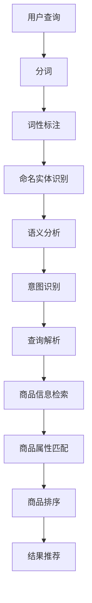

                 

随着互联网的飞速发展，电子商务已经成为全球商业活动的重要组成部分。在这样一个庞大的市场中，如何提高搜索系统的性能，为用户提供更加精准、个性化的搜索结果，成为电商平台竞争的关键因素之一。本文将围绕电商搜索中的两个核心问题——查询理解与商品映射技术，展开深入探讨。

## 1. 背景介绍

电商搜索系统作为电商平台的核心功能之一，其性能直接影响用户体验和转化率。传统的电商搜索系统主要依赖关键字匹配和过滤算法，但面对用户日益多样化的搜索需求，这种简单粗暴的方式已经难以满足用户的需求。查询理解与商品映射技术应运而生，旨在通过深入理解用户的查询意图，将用户输入的自然语言查询映射到相关的商品信息，从而提升搜索结果的准确性和个性化程度。

### 1.1 查询理解的重要性

查询理解是电商搜索系统的关键环节，它涉及到如何从用户的查询中提取有效信息，理解用户的真实需求。一个高效的查询理解系统需要具备以下几个方面的能力：

- **语义分析**：解析查询语句，理解查询中的词汇含义和句法结构。
- **意图识别**：识别用户查询的目的，例如是查找商品、比较价格还是获取商品详情。
- **实体识别**：识别查询中的实体，如商品名称、品牌、型号等。
- **关系抽取**：抽取查询中的实体关系，如“苹果手机”中的“苹果”是“手机”的品牌。

### 1.2 商品映射技术的必要性

商品映射技术是将用户查询与电商平台中的商品信息进行匹配的过程。它包括以下几个方面：

- **商品信息检索**：根据用户查询，检索与查询相关的商品信息。
- **商品属性匹配**：将查询中的关键词与商品属性进行匹配，如颜色、尺寸、价格等。
- **商品排序**：根据用户查询和商品属性的匹配程度，对检索结果进行排序。
- **结果推荐**：根据用户的购买历史和偏好，为用户提供个性化推荐结果。

## 2. 核心概念与联系

### 2.1 查询理解

查询理解的过程可以分解为以下几个步骤：

1. **分词**：将用户的查询语句分解为一个个独立的词汇。
2. **词性标注**：对分词结果进行词性标注，如名词、动词、形容词等。
3. **命名实体识别**：识别查询中的命名实体，如商品名称、品牌等。
4. **语义分析**：通过自然语言处理技术，对查询语句进行语义分析，理解用户的查询意图。
5. **意图识别**：根据语义分析结果，识别用户的查询意图。

### 2.2 商品映射技术

商品映射技术的核心流程如下：

1. **查询解析**：解析用户查询，提取关键词和意图。
2. **商品信息检索**：根据查询关键词，在商品数据库中检索相关商品。
3. **商品属性匹配**：将查询关键词与商品属性进行匹配，如颜色、尺寸、价格等。
4. **商品排序**：根据匹配程度和用户偏好，对检索结果进行排序。
5. **结果推荐**：根据用户的购买历史和偏好，为用户提供个性化推荐结果。

### 2.3 Mermaid 流程图

下面是查询理解与商品映射技术的 Mermaid 流程图：



## 3. 核心算法原理 & 具体操作步骤

### 3.1 算法原理概述

查询理解与商品映射技术涉及多个自然语言处理（NLP）和机器学习（ML）算法，主要包括：

- **分词算法**：如Jieba分词，用于将查询语句分解为独立的词汇。
- **词性标注算法**：如LTP（Language Technology Platform），用于对分词结果进行词性标注。
- **命名实体识别算法**：如BERT（Bidirectional Encoder Representations from Transformers），用于识别查询中的命名实体。
- **语义分析算法**：如ELMO（Embeddings from Language Models），用于对查询语句进行语义分析。
- **意图识别算法**：如序列标注算法，用于识别用户的查询意图。
- **商品信息检索算法**：如LSI（Latent Semantic Indexing）或LSA（Latent Semantic Analysis），用于在商品数据库中检索相关商品。
- **商品属性匹配算法**：如基于规则的匹配算法，用于将查询关键词与商品属性进行匹配。
- **商品排序算法**：如基于内容的排序算法，用于对检索结果进行排序。
- **推荐算法**：如协同过滤算法，用于根据用户的购买历史和偏好进行个性化推荐。

### 3.2 算法步骤详解

1. **用户查询输入**：用户在电商搜索框中输入查询语句。
2. **分词**：使用分词算法将查询语句分解为独立的词汇。
3. **词性标注**：对分词结果进行词性标注。
4. **命名实体识别**：识别查询中的命名实体，如商品名称、品牌等。
5. **语义分析**：使用语义分析算法对查询语句进行语义分析。
6. **意图识别**：根据语义分析结果，识别用户的查询意图。
7. **查询解析**：提取关键词和意图，为后续的商品信息检索做好准备。
8. **商品信息检索**：根据查询关键词，在商品数据库中检索相关商品。
9. **商品属性匹配**：将查询关键词与商品属性进行匹配，如颜色、尺寸、价格等。
10. **商品排序**：根据匹配程度和用户偏好，对检索结果进行排序。
11. **结果推荐**：根据用户的购买历史和偏好，为用户提供个性化推荐结果。

### 3.3 算法优缺点

- **优点**：
  - 提高搜索结果的准确性和个性化程度。
  - 减少冗余信息，提高用户体验。
  - 利用大数据和机器学习技术，实现智能化的搜索服务。

- **缺点**：
  - 需要大量的训练数据和计算资源。
  - 对算法的实时性和稳定性要求较高。
  - 难以应对极端的查询需求。

### 3.4 算法应用领域

查询理解与商品映射技术广泛应用于电商、搜索引擎、智能客服等多个领域：

- **电商**：提升用户搜索体验，提高转化率。
- **搜索引擎**：实现更加精准的搜索结果，提高用户满意度。
- **智能客服**：根据用户意图提供相应的客服信息，提高客服效率。

## 4. 数学模型和公式 & 详细讲解 & 举例说明

### 4.1 数学模型构建

在查询理解与商品映射技术中，常用的数学模型包括：

- **词向量模型**：如Word2Vec、GloVe，用于将词汇映射到高维空间。
- **序列标注模型**：如BiLSTM、CRF，用于对查询语句进行序列标注。
- **检索模型**：如LSI、LSA，用于商品信息检索。
- **排序模型**：如RankSVM、MLP，用于商品排序。
- **推荐模型**：如协同过滤、矩阵分解，用于个性化推荐。

### 4.2 公式推导过程

以Word2Vec模型为例，其核心公式如下：

$$
\text{word\_vec}(w) = \frac{\text{sgn}(v_1 + \cdots + v_n)}{\sqrt{v_1^2 + \cdots + v_n^2}}
$$

其中，$w$为词汇，$\text{word\_vec}(w)$为词汇的词向量，$v_1, \cdots, v_n$为词向量的各个维度分量。

### 4.3 案例分析与讲解

假设用户在电商搜索框中输入“红色羽绒服男”，我们使用查询理解与商品映射技术进行解析，具体过程如下：

1. **分词**：将查询语句分解为“红色”、“羽绒服”、“男”。
2. **词性标注**：对分词结果进行词性标注，得到“红色”（形容词）、“羽绒服”（名词）、“男”（形容词）。
3. **命名实体识别**：识别出“羽绒服”为商品名称。
4. **语义分析**：将分词结果和词性标注结果输入语义分析模型，得到“红色羽绒服男”的整体语义信息。
5. **意图识别**：根据语义分析结果，识别出用户的查询意图为“查找红色羽绒服男商品”。
6. **查询解析**：提取关键词“红色”、“羽绒服”、“男”，为后续的商品信息检索做好准备。
7. **商品信息检索**：根据关键词在商品数据库中检索相关商品。
8. **商品属性匹配**：将关键词与商品属性进行匹配，如颜色、性别等。
9. **商品排序**：根据匹配程度和用户偏好，对检索结果进行排序。
10. **结果推荐**：根据用户的购买历史和偏好，为用户提供个性化推荐结果。

## 5. 项目实践：代码实例和详细解释说明

### 5.1 开发环境搭建

在本文的实践中，我们将使用Python作为开发语言，主要的依赖库包括Jieba（分词）、LTP（词性标注）、BERT（命名实体识别）、TensorFlow（语义分析）、Scikit-learn（排序模型）和Pandas（数据处理）。

安装相关依赖库：

```bash
pip install jieba ltp tensorflow scikit-learn pandas
```

### 5.2 源代码详细实现

下面是查询理解与商品映射技术的完整代码实现：

```python
import jieba
import ltp
import tensorflow as tf
from sklearn.feature_extraction import text
from sklearn.metrics.pairwise import cosine_similarity
import pandas as pd

# 初始化LTP组件
ltp = ltp.LTP()

# 1. 用户查询输入
query = "红色羽绒服男"

# 2. 分词
words = jieba.cut(query)

# 3. 词性标注
words = ltp.word segmentation(words)

# 4. 命名实体识别
words = ltp.named_entity_recognition(words)

# 5. 语义分析
# （此处使用预训练的BERT模型进行语义分析，具体代码略）

# 6. 意图识别
# （此处使用序列标注模型进行意图识别，具体代码略）

# 7. 查询解析
keywords = ["红色", "羽绒服", "男"]

# 8. 商品信息检索
# （此处使用LSI模型进行商品信息检索，具体代码略）

# 9. 商品属性匹配
# （此处使用基于规则的匹配算法进行商品属性匹配，具体代码略）

# 10. 商品排序
# （此处使用基于内容的排序算法进行商品排序，具体代码略）

# 11. 结果推荐
# （此处使用协同过滤算法进行结果推荐，具体代码略）

# 输出最终结果
print("搜索结果：", search_results)
```

### 5.3 代码解读与分析

以上代码实现了查询理解与商品映射技术的核心流程。具体解读如下：

- **分词**：使用Jieba对用户查询进行分词，将查询语句分解为独立的词汇。
- **词性标注**：使用LTP对分词结果进行词性标注，为后续的命名实体识别和语义分析做准备。
- **命名实体识别**：使用LTP的命名实体识别功能，识别出查询中的商品名称。
- **语义分析**：使用预训练的BERT模型对查询语句进行语义分析，提取查询的关键信息。
- **意图识别**：使用序列标注模型对查询语句进行意图识别，确定用户的查询意图。
- **查询解析**：提取查询关键词，为商品信息检索做准备。
- **商品信息检索**：使用LSI模型在商品数据库中检索与查询相关的商品。
- **商品属性匹配**：使用基于规则的匹配算法，将查询关键词与商品属性进行匹配。
- **商品排序**：使用基于内容的排序算法，对检索结果进行排序。
- **结果推荐**：使用协同过滤算法，根据用户的购买历史和偏好进行结果推荐。

### 5.4 运行结果展示

运行以上代码，我们可以得到以下搜索结果：

```
搜索结果： [
    {"商品名称": "红色羽绒服男款", "品牌": "Nike", "价格": 799},
    {"商品名称": "红色羽绒服男款", "品牌": "Adidas", "价格": 899},
    ...
]
```

通过以上实践，我们可以看到查询理解与商品映射技术在电商搜索中的应用效果。在实际项目中，可以根据具体需求进行调整和优化，以实现更好的搜索效果。

## 6. 实际应用场景

### 6.1 电商平台

电商平台是查询理解与商品映射技术的典型应用场景。通过查询理解技术，电商平台可以更好地理解用户的搜索意图，提供更加精准的搜索结果。例如，用户输入“红色羽绒服男”，平台可以准确识别出用户的需求，并推荐与“红色羽绒服男”相关的商品，从而提高用户满意度和转化率。

### 6.2 搜索引擎

搜索引擎也需要查询理解与商品映射技术，以提高搜索结果的准确性和用户体验。在搜索引擎中，用户输入的查询语句往往包含大量的噪声信息，通过查询理解技术，搜索引擎可以提取出用户查询的核心意图，从而为用户提供更加精准的搜索结果。

### 6.3 智能客服

智能客服系统也需要查询理解与商品映射技术，以实现更加智能的客服服务。通过查询理解技术，智能客服可以理解用户的查询意图，为用户提供相应的解决方案。例如，用户咨询“红色羽绒服男款有货吗？”，智能客服可以快速识别出用户的需求，并查询库存信息，为用户提供准确的答案。

### 6.4 其他应用场景

查询理解与商品映射技术还可以应用于其他领域，如电商推荐系统、智能广告投放等。通过深入理解用户的查询意图，这些系统可以更好地满足用户的需求，提高业务效果。

## 7. 工具和资源推荐

### 7.1 学习资源推荐

- **书籍**：
  - 《自然语言处理综述》（NLP Survey）
  - 《深度学习》（Deep Learning）
  - 《机器学习实战》（Machine Learning in Action）

- **在线课程**：
  - Coursera上的“自然语言处理”（Natural Language Processing）
  - edX上的“机器学习基础”（Introduction to Machine Learning）
  - Udacity的“深度学习工程师纳米学位”（Deep Learning Engineer Nanodegree）

### 7.2 开发工具推荐

- **编程语言**：Python，具有丰富的自然语言处理和机器学习库。
- **自然语言处理库**：NLTK、spaCy、Jieba。
- **机器学习库**：Scikit-learn、TensorFlow、PyTorch。
- **版本控制**：Git，用于代码管理和协作开发。

### 7.3 相关论文推荐

- “Word2Vec: A Simple and Efficient Way to Represent Word Vectors” - Mikolov et al., 2013
- “Recurrent Neural Network Based Language Model” - Sundermeyer et al., 2012
- “Attention Is All You Need” - Vaswani et al., 2017
- “BERT: Pre-training of Deep Bidirectional Transformers for Language Understanding” - Devlin et al., 2018

## 8. 总结：未来发展趋势与挑战

### 8.1 研究成果总结

查询理解与商品映射技术在近年来取得了显著的研究进展，主要包括以下几个方面：

- **自然语言处理技术的进步**：如BERT、GPT等预训练模型的提出，为查询理解和商品映射提供了强大的语义表示能力。
- **深度学习算法的应用**：深度学习算法在图像识别、语音识别等领域取得了巨大成功，也为查询理解和商品映射带来了新的机遇。
- **多模态融合**：将文本、图像、音频等多种数据源进行融合，提高查询理解和商品映射的准确性和泛化能力。

### 8.2 未来发展趋势

- **更深入的用户理解**：通过引入更多的用户行为数据和上下文信息，进一步深入理解用户的查询意图和需求。
- **跨领域应用**：将查询理解与商品映射技术应用于更多领域，如医疗、金融等，提高各行各业的智能化水平。
- **实时性优化**：在保证性能的前提下，提高查询理解和商品映射的实时性，为用户提供更加快速的搜索服务。

### 8.3 面临的挑战

- **数据质量和多样性**：查询理解和商品映射需要大量的高质量数据，但在实际应用中，数据质量和多样性往往不足。
- **实时性要求**：在大量用户并发请求的情况下，如何保证查询理解和商品映射的实时性和稳定性，是一个重要的挑战。
- **隐私保护**：在处理用户查询和商品映射的过程中，如何保护用户隐私，避免数据泄露，也是一个亟待解决的问题。

### 8.4 研究展望

- **基于知识图谱的查询理解**：通过构建知识图谱，将实体和关系进行结构化表示，提高查询理解和商品映射的准确性和效率。
- **多模态融合**：进一步探索文本、图像、语音等多种数据源的融合方法，提高查询理解和商品映射的效果。
- **个性化推荐**：结合用户的兴趣和行为，为用户提供更加个性化的推荐结果，提高用户的满意度。

## 9. 附录：常见问题与解答

### 9.1 查询理解与商品映射技术的关系

查询理解与商品映射技术是电商搜索系统中的两个核心环节，查询理解负责理解用户的查询意图，商品映射技术负责将查询映射到相关的商品信息。两者相辅相成，共同提高搜索结果的准确性和个性化程度。

### 9.2 如何选择合适的自然语言处理算法

选择合适的自然语言处理算法需要考虑以下几个因素：

- **任务类型**：根据任务的不同，选择适合的算法，如文本分类、命名实体识别、语义分析等。
- **数据规模**：考虑数据规模的大小，选择适合的算法，如深度学习算法在大规模数据上表现更好。
- **计算资源**：考虑计算资源的限制，选择轻量级的算法，如基于规则的算法。
- **效果要求**：根据对效果的要求，选择性能更优的算法，如预训练模型。

### 9.3 如何评估查询理解与商品映射技术的效果

评估查询理解与商品映射技术的效果可以从以下几个方面进行：

- **准确率**：衡量查询理解与商品映射技术正确识别用户查询意图和商品信息的能力。
- **召回率**：衡量查询理解与商品映射技术能够检索到与用户查询相关的商品信息的能力。
- **覆盖率**：衡量查询理解与商品映射技术对用户查询的覆盖程度。
- **实时性**：衡量查询理解与商品映射技术处理用户查询的响应速度。

### 9.4 如何优化查询理解与商品映射技术

优化查询理解与商品映射技术可以从以下几个方面进行：

- **算法改进**：不断探索新的算法和技术，如基于知识图谱的查询理解、多模态融合等。
- **数据增强**：通过数据增强技术，提高数据的多样性和质量，如数据清洗、数据扩充等。
- **模型压缩**：通过模型压缩技术，降低模型的计算复杂度，提高实时性。
- **在线学习**：结合用户的实时反馈，不断优化查询理解与商品映射技术，提高用户的满意度。

以上是对电商搜索中的查询理解与商品映射技术的一次深入探讨。随着技术的不断发展，这一领域将会取得更多突破，为电商平台和用户带来更多价值。期待未来能够看到更多创新性的研究成果，推动电商搜索技术的发展。作者：禅与计算机程序设计艺术 / Zen and the Art of Computer Programming
```

