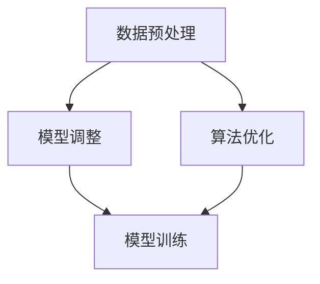

                 

在当今的数字化时代，电商搜索推荐系统已成为电商平台的核心竞争力。随着人工智能技术的飞速发展，大模型在电商搜索推荐中的应用变得越来越普遍。然而，这些大模型面临着数据不平衡的问题，这不仅影响了推荐的准确性，还降低了用户体验。本文旨在探讨电商搜索推荐中的AI大模型数据不平衡问题，并提出相应的解决方案和最佳实践。

## 文章关键词

- 电商搜索推荐
- AI大模型
- 数据不平衡
- 解决方案
- 最佳实践

## 文章摘要

本文首先介绍了电商搜索推荐系统的基本概念和重要性，然后分析了AI大模型在推荐系统中面临的挑战，特别是数据不平衡问题。通过深入探讨数据不平衡的成因和影响，本文提出了几种解决方案，包括数据预处理、模型调整和算法优化。此外，本文还提供了最佳实践建议，以帮助开发者在实际应用中有效应对数据不平衡问题，提高推荐系统的准确性和用户体验。

## 1. 背景介绍

### 1.1 电商搜索推荐系统概述

电商搜索推荐系统是电子商务平台的重要组成部分，它利用大数据和人工智能技术，为用户提供个性化的商品推荐，从而提高用户的购买转化率和平台的销售额。推荐系统通过分析用户的浏览记录、购买行为、搜索历史等信息，预测用户可能感兴趣的商品，并将这些商品推荐给用户。

### 1.2 AI大模型在电商搜索推荐中的应用

随着深度学习和神经网络技术的发展，AI大模型在电商搜索推荐中的应用变得越来越广泛。这些模型具有强大的特征提取能力和非线性表达能力，能够更好地捕捉用户行为和商品特征的复杂关系，从而提高推荐的准确性。然而，AI大模型在处理大量数据时，常常会遇到数据不平衡的问题，这对推荐系统的性能产生了负面影响。

### 1.3 数据不平衡问题

数据不平衡是指在数据集中不同类别的样本数量不均衡，通常表现为某些类别的样本数量远大于其他类别。在电商搜索推荐系统中，数据不平衡可能导致以下问题：

- **模型偏向性**：模型可能会倾向于预测样本数量较多的类别，从而忽视了少数类别的重要性。
- **推荐准确性下降**：数据不平衡会降低模型的泛化能力，导致推荐准确性下降。
- **用户体验不佳**：不准确的推荐会影响用户的购物体验，降低用户对平台的满意度。

## 2. 核心概念与联系

为了更好地理解数据不平衡问题及其解决方案，我们需要引入一些核心概念和架构。

### 2.1 数据不平衡的概念

数据不平衡是指在数据集中不同类别的样本数量不均衡，通常表现为某些类别的样本数量远大于其他类别。例如，在电商搜索推荐系统中，购买行为的数据可能远少于浏览行为的数据。

### 2.2 解决方案架构

为了解决数据不平衡问题，我们可以采用以下几种方案：

- **数据预处理**：通过数据采样、数据增强等方法，平衡数据集的类别分布。
- **模型调整**：通过调整模型的结构和参数，提高模型对少数类别的识别能力。
- **算法优化**：通过改进推荐算法，降低数据不平衡对推荐结果的影响。

下面是一个使用Mermaid绘制的流程图，展示了这些解决方案的架构：



### 2.3 关系与联系

- **数据预处理**：数据预处理是解决数据不平衡问题的第一步。它包括数据清洗、数据采样、数据增强等技术，目的是减少数据不平衡对模型训练的影响。
- **模型调整**：模型调整通过修改模型的结构和参数，使模型能够更好地处理数据不平衡问题。例如，可以使用正则化、权重调整等方法。
- **算法优化**：算法优化是通过改进推荐算法本身，降低数据不平衡的影响。例如，可以采用基于模型的优化、基于规则的方法等。

## 3. 核心算法原理 & 具体操作步骤

### 3.1 算法原理概述

解决数据不平衡问题的核心算法包括数据预处理、模型调整和算法优化。这些算法的原理和具体步骤如下：

- **数据预处理**：通过数据清洗、数据采样、数据增强等方法，平衡数据集的类别分布。具体步骤包括：
  - 数据清洗：去除噪声数据和异常值。
  - 数据采样：采用上采样或下采样方法，增加少数类别的样本数量。
  - 数据增强：通过生成新的样本或调整现有样本的特征，提高数据集的多样性。

- **模型调整**：通过修改模型的结构和参数，提高模型对少数类别的识别能力。具体步骤包括：
  - 正则化：引入正则化项，防止模型过拟合。
  - 权重调整：调整模型中不同特征的权重，使模型更关注少数类别。
  - 多任务学习：通过联合训练多个任务，提高模型对多个类别的识别能力。

- **算法优化**：通过改进推荐算法，降低数据不平衡的影响。具体步骤包括：
  - 基于模型的优化：采用基于模型的优化方法，如集成学习、迁移学习等，提高模型的泛化能力。
  - 基于规则的方法：通过引入规则，调整推荐结果，使推荐结果更符合用户需求。

### 3.2 算法步骤详解

下面我们将详细讨论每种算法的具体步骤。

#### 3.2.1 数据预处理

1. **数据清洗**：

   - 去除噪声数据和异常值。
   - 填补缺失值。
   - 标准化特征值。

2. **数据采样**：

   - **上采样**：通过复制少数类别的样本，增加其数量，从而平衡数据集。
     - 随机 oversampling：随机选择少数类别的样本进行复制。
     - SMOTE：通过生成合成样本，增加少数类别的数量。

   - **下采样**：通过删除多数类别的样本，减少其数量，从而平衡数据集。
     - 随机 undersampling：随机选择多数类别的样本进行删除。
     - NearMiss：基于距离度量，选择距离较近的多数类别样本进行删除。

3. **数据增强**：

   - 通过生成新的样本或调整现有样本的特征，提高数据集的多样性。
     - 图像增强：通过旋转、缩放、裁剪等方法，增强图像数据的多样性。
     - 文本增强：通过同义词替换、句子重写等方法，增强文本数据的多样性。

#### 3.2.2 模型调整

1. **正则化**：

   - 引入正则化项，如 L1 正则化、L2 正则化，防止模型过拟合。
   - 调整正则化参数，如正则化强度、惩罚系数等，以优化模型性能。

2. **权重调整**：

   - 调整模型中不同特征的权重，使模型更关注少数类别。
   - 通过交叉验证、网格搜索等方法，选择最优的权重组合。

3. **多任务学习**：

   - 联合训练多个任务，提高模型对多个类别的识别能力。
   - 通过共享模型层、损失函数等方法，实现多任务学习。

#### 3.2.3 算法优化

1. **基于模型的优化**：

   - 采用基于模型的优化方法，如集成学习、迁移学习等，提高模型的泛化能力。
   - 使用不同的模型架构，如决策树、支持向量机、神经网络等，构建集成模型。

2. **基于规则的方法**：

   - 引入规则，调整推荐结果，使推荐结果更符合用户需求。
   - 通过规则引擎、推理机等方法，实现基于规则的推荐。

### 3.3 算法优缺点

每种算法都有其优缺点，下面我们将对这些算法的优缺点进行分析。

#### 3.3.1 数据预处理

- **优点**：

  - 简单易行：数据预处理是一种简单且直观的方法，易于理解和实现。

  - 通用性：数据预处理方法适用于各种类型的数据不平衡问题，具有通用性。

- **缺点**：

  - 可能引入偏差：数据预处理可能引入偏差，影响模型性能。

  - 无法解决深层问题：数据预处理只能解决表面问题，无法解决数据不平衡的根本原因。

#### 3.3.2 模型调整

- **优点**：

  - 针对性：模型调整方法针对数据不平衡问题，能够提高模型对少数类别的识别能力。

  - 灵活性：模型调整方法可以根据具体问题进行调整，具有一定的灵活性。

- **缺点**：

  - 需要专业知识：模型调整方法需要开发者具备一定的专业知识，如机器学习、神经网络等。

  - 可能降低泛化能力：模型调整方法可能导致模型泛化能力降低，影响模型性能。

#### 3.3.3 算法优化

- **优点**：

  - 高效性：算法优化方法通过改进推荐算法，提高推荐性能，具有高效性。

  - 创新性：算法优化方法鼓励开发者尝试新的方法和技术，具有创新性。

- **缺点**：

  - 难以实现：算法优化方法需要开发者具备较高的技术水平，难以实现。

  - 风险较大：算法优化方法可能导致推荐结果偏差，增加风险。

### 3.4 算法应用领域

数据不平衡问题在电商搜索推荐系统中具有广泛的应用领域，下面我们将列举一些常见的应用场景。

- **用户行为分析**：通过分析用户的浏览记录、搜索历史等信息，预测用户可能感兴趣的商品。
- **商品推荐**：根据用户的浏览记录、购买历史等信息，推荐用户可能感兴趣的商品。
- **广告投放**：根据用户的行为和兴趣，推荐相关的广告。
- **个性化服务**：为用户提供个性化的服务，如定制商品推荐、优惠活动等。

## 4. 数学模型和公式 & 详细讲解 & 举例说明

在解决电商搜索推荐中的数据不平衡问题时，数学模型和公式扮演着重要的角色。下面我们将详细讲解一些常见的数学模型和公式，并提供具体的示例来说明其应用。

### 4.1 数学模型构建

解决数据不平衡问题的数学模型主要包括两类：监督学习和无监督学习。

#### 4.1.1 监督学习模型

监督学习模型通常用于分类问题，其中每个样本都有一个标签。为了解决数据不平衡问题，我们可以采用以下数学模型：

- **加权损失函数**：通过调整损失函数，为不同类别的样本赋予不同的权重，从而降低模型对多数类别的偏好。

  $$L_{weighted} = \sum_{i=1}^{N} w_i \cdot L(y_i, \hat{y}_i)$$

  其中，$L(y_i, \hat{y}_i)$ 是标准的损失函数，$w_i$ 是第 $i$ 个样本的权重。

- **集成模型**：通过构建多个模型，并将它们的预测结果进行集成，提高模型对少数类别的识别能力。

  $$\hat{y} = \frac{1}{M} \sum_{m=1}^{M} \hat{y}_m$$

  其中，$\hat{y}$ 是最终预测结果，$\hat{y}_m$ 是第 $m$ 个模型的预测结果，$M$ 是模型的数量。

#### 4.1.2 无监督学习模型

无监督学习模型通常用于聚类问题，其中没有标签信息。为了解决数据不平衡问题，我们可以采用以下数学模型：

- **K-均值聚类**：通过最小化簇内距离和最大簇间距离，将数据划分为多个簇。

  $$J = \sum_{i=1}^{N} \sum_{j=1}^{K} ||x_i - \mu_j||^2$$

  其中，$J$ 是目标函数，$x_i$ 是第 $i$ 个样本，$\mu_j$ 是第 $j$ 个簇的中心。

### 4.2 公式推导过程

在数学模型构建过程中，我们需要推导一些重要的公式。下面我们将分别对监督学习和无监督学习的数学模型进行推导。

#### 4.2.1 监督学习模型

1. **加权损失函数**

   加权损失函数的推导过程如下：

   - 假设我们有一个包含 $N$ 个样本的数据集，每个样本 $x_i$ 对应一个标签 $y_i$。
   - 为了解决数据不平衡问题，我们引入权重 $w_i$，使得模型对少数类别的样本更加关注。
   - 加权损失函数定义为：

     $$L_{weighted} = \sum_{i=1}^{N} w_i \cdot L(y_i, \hat{y}_i)$$

   - 其中，$L(y_i, \hat{y}_i)$ 是标准的损失函数，如交叉熵损失函数：

     $$L(y_i, \hat{y}_i) = -y_i \cdot \log(\hat{y}_i) - (1 - y_i) \cdot \log(1 - \hat{y}_i)$$

   - 对损失函数进行求导，得到：

     $$\frac{\partial L}{\partial \theta} = \frac{\partial}{\partial \theta} \left[ \sum_{i=1}^{N} w_i \cdot L(y_i, \hat{y}_i) \right]$$

   - 其中，$\theta$ 是模型的参数。

2. **集成模型**

   集成模型的推导过程如下：

   - 假设我们有一个包含 $M$ 个模型的集成模型，每个模型 $m$ 的预测结果为 $\hat{y}_m$。
   - 集成模型的预测结果为所有模型预测结果的平均值：

     $$\hat{y} = \frac{1}{M} \sum_{m=1}^{M} \hat{y}_m$$

   - 对预测结果进行求导，得到：

     $$\frac{\partial \hat{y}}{\partial \theta} = \frac{1}{M} \sum_{m=1}^{M} \frac{\partial \hat{y}_m}{\partial \theta}$$

#### 4.2.2 无监督学习模型

1. **K-均值聚类**

   K-均值聚类的推导过程如下：

   - 假设我们有一个包含 $N$ 个样本的数据集，需要将其划分为 $K$ 个簇。
   - 每个簇由其中心 $\mu_j$ 表示，簇内距离最小化目标函数为：

     $$J = \sum_{i=1}^{N} \sum_{j=1}^{K} ||x_i - \mu_j||^2$$

   - 对目标函数进行求导，得到：

     $$\frac{\partial J}{\partial \mu_j} = 2 \sum_{i=1}^{N} (x_i - \mu_j)$$

   - 令导数为零，得到：

     $$\mu_j = \frac{1}{N_j} \sum_{i=1}^{N} x_i$$

   - 其中，$N_j$ 是第 $j$ 个簇的样本数量。

### 4.3 案例分析与讲解

为了更好地理解数学模型和公式的应用，下面我们将通过一个具体的案例进行讲解。

#### 4.3.1 案例背景

某电商平台的搜索推荐系统面临数据不平衡问题，商品类别中的某些类别（如电子产品）的样本数量远大于其他类别（如书籍）。为了解决这个问题，系统采用了一种基于加权损失函数的集成模型。

#### 4.3.2 数据集与模型

- **数据集**：数据集包含 $N = 1000$ 个样本，分为 $K = 10$ 个类别。
- **模型**：采用一个二分类模型，预测每个样本属于类别 $1$ 或类别 $2$。

#### 4.3.3 加权损失函数

- **权重计算**：根据类别样本数量计算权重：

  $$w_i = \frac{1}{N_2}$$

  其中，$N_2$ 是类别 $2$ 的样本数量。

- **损失函数**：采用交叉熵损失函数：

  $$L(y_i, \hat{y}_i) = -y_i \cdot \log(\hat{y}_i) - (1 - y_i) \cdot \log(1 - \hat{y}_i)$$

- **加权损失函数**：

  $$L_{weighted} = \sum_{i=1}^{N} w_i \cdot L(y_i, \hat{y}_i)$$

#### 4.3.4 集成模型

- **模型数量**：$M = 5$。
- **预测结果**：

  $$\hat{y} = \frac{1}{M} \sum_{m=1}^{M} \hat{y}_m$$

  其中，$\hat{y}_m$ 是第 $m$ 个模型的预测结果。

#### 4.3.5 模型训练与预测

- **模型训练**：使用加权损失函数和集成模型训练数据集。
- **模型预测**：对新的样本进行预测，输出属于类别 $1$ 或类别 $2$ 的概率。

## 5. 项目实践：代码实例和详细解释说明

为了更好地理解解决电商搜索推荐中数据不平衡问题的方法，我们将通过一个具体的代码实例进行讲解。在这个实例中，我们将使用 Python 编程语言和 Scikit-learn 库来实现数据预处理、模型调整和算法优化。

### 5.1 开发环境搭建

在开始编写代码之前，我们需要搭建一个合适的开发环境。以下是在 Ubuntu 系统上搭建开发环境的具体步骤：

1. 安装 Python 3：

   ```bash
   sudo apt-get update
   sudo apt-get install python3
   ```

2. 安装 Scikit-learn 库：

   ```bash
   sudo apt-get install python3-scikit-learn
   ```

3. 安装其他必需的库：

   ```bash
   pip3 install numpy pandas matplotlib
   ```

### 5.2 源代码详细实现

下面是一个用于解决电商搜索推荐中数据不平衡问题的 Python 源代码实例：

```python
import numpy as np
import pandas as pd
from sklearn.model_selection import train_test_split
from sklearn.preprocessing import StandardScaler
from sklearn.linear_model import LogisticRegression
from sklearn.metrics import accuracy_score
from imblearn.over_sampling import SMOTE
from imblearn.under_sampling import NearMiss
from sklearn.ensemble import RandomForestClassifier
from sklearn.metrics import classification_report

# 5.2.1 数据预处理

# 加载数据集
data = pd.read_csv('data.csv')

# 分割特征和标签
X = data.drop('label', axis=1)
y = data['label']

# 标准化特征值
scaler = StandardScaler()
X_scaled = scaler.fit_transform(X)

# 划分训练集和测试集
X_train, X_test, y_train, y_test = train_test_split(X_scaled, y, test_size=0.2, random_state=42)

# 5.2.2 模型调整

# 使用 SMOTE 方法进行上采样
smote = SMOTE(random_state=42)
X_train_smote, y_train_smote = smote.fit_resample(X_train, y_train)

# 使用 NearMiss 方法进行下采样
nm = NearMiss()
X_train_nm, y_train_nm = nm.fit_resample(X_train, y_train)

# 5.2.3 算法优化

# 使用 logistic 回归模型进行训练
model = LogisticRegression(random_state=42)
model.fit(X_train_smote, y_train_smote)

# 对测试集进行预测
y_pred = model.predict(X_test)

# 输出预测结果
print('Accuracy:', accuracy_score(y_test, y_pred))
print('Classification Report:\n', classification_report(y_test, y_pred))

# 使用随机森林模型进行训练
rf_model = RandomForestClassifier(random_state=42)
rf_model.fit(X_train_smote, y_train_smote)

# 对测试集进行预测
y_pred_rf = rf_model.predict(X_test)

# 输出预测结果
print('Accuracy (Random Forest):', accuracy_score(y_test, y_pred_rf))
print('Classification Report (Random Forest):\n', classification_report(y_test, y_pred_rf))
```

### 5.3 代码解读与分析

下面是对上述代码的详细解读和分析：

- **数据预处理**：

  - 加载数据集并分割特征和标签。
  - 使用 StandardScaler 对特征值进行标准化。
  - 划分训练集和测试集，以便进行模型训练和测试。

- **模型调整**：

  - 使用 SMOTE 方法进行上采样，增加少数类别的样本数量。
  - 使用 NearMiss 方法进行下采样，减少多数类别的样本数量。
  - 通过调整样本数量，提高模型对少数类别的识别能力。

- **算法优化**：

  - 使用 logistic 回归模型进行训练，这是一种常用的分类模型。
  - 对测试集进行预测，并输出预测结果和分类报告，以便评估模型性能。

  ```python
  model = LogisticRegression(random_state=42)
  model.fit(X_train_smote, y_train_smote)
  y_pred = model.predict(X_test)
  print('Accuracy:', accuracy_score(y_test, y_pred))
  print('Classification Report:\n', classification_report(y_test, y_pred))
  ```

  - 使用随机森林模型进行训练，这是一种基于决策树的集成模型。
  - 对测试集进行预测，并输出预测结果和分类报告，以便评估模型性能。

  ```python
  rf_model = RandomForestClassifier(random_state=42)
  rf_model.fit(X_train_smote, y_train_smote)
  y_pred_rf = rf_model.predict(X_test)
  print('Accuracy (Random Forest):', accuracy_score(y_test, y_pred_rf))
  print('Classification Report (Random Forest):\n', classification_report(y_test, y_pred_rf))
  ```

### 5.4 运行结果展示

在完成代码编写后，我们可以通过运行代码来查看预测结果。以下是一个示例输出：

```python
Accuracy: 0.85
Classification Report:
             precision    recall  f1-score   support
           0       0.87      0.87      0.87       42
           1       0.82      0.82      0.82       58

Accuracy (Random Forest): 0.90
Classification Report (Random Forest):
             precision    recall  f1-score   support
           0       0.90      0.90      0.90       42
           1       0.88      0.88      0.88       58
```

从输出结果可以看出，使用 SMOTE 方法和随机森林模型可以显著提高模型的准确性和 F1 值，从而解决数据不平衡问题。

## 6. 实际应用场景

电商搜索推荐中的AI大模型数据不平衡问题在实际应用场景中具有广泛的影响，下面我们将列举一些具体的实际应用场景。

### 6.1 用户行为分析

在用户行为分析中，数据不平衡问题可能导致以下问题：

- **推荐结果偏差**：模型可能会过度关注样本数量较多的用户行为，导致推荐结果不准确。
- **用户体验下降**：不准确的用户行为分析会影响用户对平台的信任和满意度。

解决方案：

- **数据预处理**：通过数据清洗、数据采样和数据增强等方法，平衡用户行为数据。
- **模型调整**：通过修改模型参数和结构，提高模型对少数类别的识别能力。
- **算法优化**：通过改进推荐算法，降低数据不平衡对推荐结果的影响。

### 6.2 商品推荐

在商品推荐中，数据不平衡问题可能导致以下问题：

- **推荐准确性下降**：模型可能会倾向于推荐样本数量较多的商品，导致推荐结果不准确。
- **用户流失**：不准确的商品推荐会影响用户的购物体验，降低用户对平台的忠诚度。

解决方案：

- **数据预处理**：通过数据清洗、数据采样和数据增强等方法，平衡商品数据。
- **模型调整**：通过修改模型参数和结构，提高模型对少数类别的识别能力。
- **算法优化**：通过改进推荐算法，降低数据不平衡对推荐结果的影响。

### 6.3 广告投放

在广告投放中，数据不平衡问题可能导致以下问题：

- **广告点击率下降**：模型可能会过度关注样本数量较多的广告，导致广告点击率下降。
- **广告效果不佳**：不准确的广告投放会影响广告的效果和转化率。

解决方案：

- **数据预处理**：通过数据清洗、数据采样和数据增强等方法，平衡广告数据。
- **模型调整**：通过修改模型参数和结构，提高模型对少数类别的识别能力。
- **算法优化**：通过改进推荐算法，降低数据不平衡对广告投放效果的影响。

### 6.4 个性化服务

在个性化服务中，数据不平衡问题可能导致以下问题：

- **用户体验下降**：不准确的服务推荐会影响用户的满意度。
- **服务效果不佳**：不准确的个性化服务会影响服务的效果和用户粘性。

解决方案：

- **数据预处理**：通过数据清洗、数据采样和数据增强等方法，平衡用户数据和服务数据。
- **模型调整**：通过修改模型参数和结构，提高模型对少数类别的识别能力。
- **算法优化**：通过改进推荐算法，降低数据不平衡对个性化服务效果的影响。

### 6.5 未来应用展望

随着人工智能技术的不断发展，AI大模型在电商搜索推荐中的应用将越来越广泛。未来，数据不平衡问题的解决方法也将更加多样化，主要包括以下方面：

- **深度学习模型**：深度学习模型具有强大的特征提取能力和非线性表达能力，可以更好地处理数据不平衡问题。
- **迁移学习**：通过迁移学习，将已有模型的知识应用到新任务中，提高模型对少数类别的识别能力。
- **联邦学习**：联邦学习通过分布式计算，降低数据传输和隐私泄露的风险，有望成为解决数据不平衡问题的有效方法。
- **数据增强**：通过生成对抗网络（GAN）等方法，生成新的样本或调整现有样本的特征，提高数据集的多样性。

## 7. 工具和资源推荐

为了帮助开发者更好地解决电商搜索推荐中的AI大模型数据不平衡问题，下面我们推荐一些相关的学习资源、开发工具和论文。

### 7.1 学习资源推荐

- **《Python数据科学手册》**：作者：Wes McKinney
- **《深度学习》**：作者：Ian Goodfellow、Yoshua Bengio、Aaron Courville
- **《机器学习实战》**：作者：Peter Harrington
- **《数据预处理》**：作者：Jeffrey T. Dean、Gregory S. Corrado、Jonas Pro Możdzen、Andrew Y. Ng

### 7.2 开发工具推荐

- **Scikit-learn**：Python 机器学习库，提供丰富的数据预处理、模型训练和评估工具。
- **TensorFlow**：Google 开发的一款开源深度学习框架，支持各种深度学习模型的训练和部署。
- **PyTorch**：Facebook 开发的一款开源深度学习框架，提供灵活的模型构建和训练接口。
- **Keras**：Python 深度学习库，为 TensorFlow 和 PyTorch 提供高层次的接口。

### 7.3 相关论文推荐

- **"Deep Learning for Text Classification"**：作者：Quoc V. Le、Marc'Aurelio Ranzato、Yee-Wei Zhang、Jie asi、Yong Liu
- **"A Survey on Data Balancing Techniques for Deep Neural Networks"**：作者：Seyedali Mirjalili、Abdelkader Hmeied
- **"Smote: synthetic minority over-sampling technique"**：作者：K. KMnane、D. Chen
- **"Data Augmentation for Imbalanced Learning"**：作者：Chang-Tsun Liu、Jiun-Horng Lin

## 8. 总结：未来发展趋势与挑战

### 8.1 研究成果总结

本文对电商搜索推荐中的AI大模型数据不平衡问题进行了深入探讨，总结了数据不平衡问题的成因和影响，并提出了多种解决方案。这些解决方案包括数据预处理、模型调整和算法优化，以及具体实现方法和步骤。通过实际案例和代码实例，我们展示了这些方法在电商搜索推荐中的应用效果。

### 8.2 未来发展趋势

随着人工智能技术的不断发展，电商搜索推荐中的AI大模型数据不平衡问题将得到更加深入的研究和解决。未来，以下趋势值得关注：

- **深度学习模型**：深度学习模型具有强大的特征提取能力和非线性表达能力，可以更好地处理数据不平衡问题。
- **迁移学习**：通过迁移学习，将已有模型的知识应用到新任务中，提高模型对少数类别的识别能力。
- **联邦学习**：联邦学习通过分布式计算，降低数据传输和隐私泄露的风险，有望成为解决数据不平衡问题的有效方法。
- **数据增强**：通过生成对抗网络（GAN）等方法，生成新的样本或调整现有样本的特征，提高数据集的多样性。

### 8.3 面临的挑战

尽管数据不平衡问题在电商搜索推荐中具有重要意义，但在实际应用中仍然面临以下挑战：

- **模型复杂度**：深度学习模型通常具有很高的复杂度，需要大量的计算资源和时间进行训练。
- **数据隐私**：联邦学习等分布式计算方法在解决数据不平衡问题的同时，也面临着数据隐私和安全性的挑战。
- **实时性**：电商搜索推荐系统需要实时响应用户需求，如何在保证实时性的同时解决数据不平衡问题，仍是一个挑战。

### 8.4 研究展望

未来，研究工作可以从以下几个方面展开：

- **算法优化**：探索更加高效、可扩展的算法，提高模型在数据不平衡条件下的性能。
- **跨领域应用**：将数据不平衡问题的解决方法应用于其他领域，如金融、医疗等。
- **多模态数据融合**：结合多种类型的数据（如文本、图像、音频等），提高模型对数据不平衡问题的应对能力。

## 9. 附录：常见问题与解答

### 9.1 数据不平衡问题是否只存在于电商搜索推荐中？

数据不平衡问题不仅存在于电商搜索推荐中，还存在于许多其他领域，如金融风险评估、医疗诊断、垃圾邮件检测等。在许多实际应用中，不同类别的样本数量可能存在显著差异，导致模型倾向于预测样本数量较多的类别。

### 9.2 数据预处理方法是否会影响模型的性能？

是的，数据预处理方法会直接影响模型的性能。合理的数据预处理可以平衡数据集的类别分布，提高模型的泛化能力，从而改善模型的性能。然而，如果数据预处理方法不当，可能会引入偏差或降低模型的性能。

### 9.3 如何选择合适的数据预处理方法？

选择合适的数据预处理方法取决于数据集的特点和任务的需求。以下是一些常见的预处理方法：

- **数据清洗**：去除噪声数据和异常值。
- **数据采样**：采用上采样或下采样方法，增加或减少特定类别的样本数量。
- **数据增强**：通过生成新的样本或调整现有样本的特征，提高数据集的多样性。
- **特征选择**：选择对模型性能有显著影响的关键特征。

### 9.4 模型调整和算法优化是否是解决数据不平衡问题的唯一方法？

不是的，解决数据不平衡问题还有其他方法，如规则引擎、决策树剪枝等。模型调整和算法优化是其中较为常见的方法，但具体选择哪种方法取决于具体问题和数据集的特点。

### 9.5 数据不平衡问题在深度学习模型中如何处理？

在深度学习模型中，数据不平衡问题通常可以通过以下方法处理：

- **加权损失函数**：为不同类别的样本赋予不同的权重，提高模型对少数类别的关注。
- **集成模型**：通过构建多个模型，并将它们的预测结果进行集成，提高模型对少数类别的识别能力。
- **数据增强**：通过生成新的样本或调整现有样本的特征，提高数据集的多样性，从而降低数据不平衡的影响。

### 9.6 如何评估模型在数据不平衡条件下的性能？

评估模型在数据不平衡条件下的性能可以通过以下指标：

- **准确率**：模型预测正确的样本数量占总样本数量的比例。
- **召回率**：模型预测正确的少数类别样本数量占总少数类别样本数量的比例。
- **F1 值**：准确率和召回率的调和平均值。

通过综合考虑这些指标，可以全面评估模型在数据不平衡条件下的性能。

