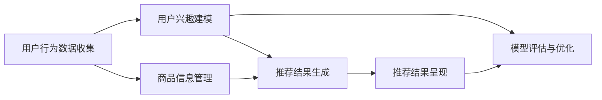

                 

关键词：电商搜索推荐，AI大模型，数据合成技术，个性化推荐，机器学习，深度学习

> 摘要：本文将深入探讨电商搜索推荐系统中，如何利用AI大模型和先进的数据合成技术来提升用户体验和搜索效果。通过分析当前技术的应用现状、核心概念、算法原理、数学模型、项目实践及未来展望，为电商领域的技术研发提供实用指南。

## 1. 背景介绍

电商搜索推荐系统作为电商平台的“智能大脑”，其重要性不言而喻。通过个性化推荐，电商系统能够将潜在感兴趣的商品精准推送给用户，从而提高用户满意度和平台销售额。然而，实现高效的个性化推荐面临着诸多挑战，其中之一便是如何处理海量用户行为数据和商品信息。

近年来，人工智能（AI）技术的迅猛发展，特别是大模型和深度学习算法的进步，为电商搜索推荐系统带来了新的机遇。通过AI大模型，可以更加智能地分析用户行为，预测用户兴趣，从而生成个性化的推荐结果。同时，数据合成技术的引入，可以生成丰富多样的模拟数据，用于算法训练和测试，提高推荐系统的鲁棒性和适应性。

本文旨在通过以下内容，为电商搜索推荐系统中AI大模型数据合成技术的应用提供全面的技术指南：

1. **核心概念与联系**：介绍电商搜索推荐系统的基本架构，以及AI大模型和数据合成技术在此框架中的角色和作用。
2. **核心算法原理与操作步骤**：深入解析AI大模型的工作原理和数据处理流程，包括数据预处理、模型训练、评估和优化等步骤。
3. **数学模型和公式**：详细阐述用于推荐系统中的数学模型和公式，以及其在实际中的应用。
4. **项目实践**：通过代码实例，展示如何在实际项目中应用AI大模型和数据合成技术。
5. **实际应用场景**：分析AI大模型和数据合成技术在电商搜索推荐系统中的具体应用案例。
6. **未来展望**：探讨AI大模型和数据合成技术在电商搜索推荐系统中的发展趋势和面临的挑战。

## 2. 核心概念与联系

### 2.1 电商搜索推荐系统架构

电商搜索推荐系统通常由以下几个关键组件构成：

- **用户行为数据收集模块**：负责收集用户在电商平台上的浏览、搜索、购买等行为数据。
- **商品信息管理模块**：存储和管理电商平台上的商品信息，包括商品描述、属性、价格等。
- **推荐算法模块**：基于用户行为数据和商品信息，利用AI大模型生成个性化的推荐结果。
- **推荐结果呈现模块**：将推荐结果以合适的形式展示给用户，如商品列表、广告位等。
- **评估与优化模块**：对推荐系统的效果进行评估，并通过反馈进行持续优化。

### 2.2 AI大模型与数据合成技术的角色和作用

在电商搜索推荐系统中，AI大模型和数据合成技术发挥着至关重要的作用：

- **AI大模型**：通过深度学习算法，AI大模型可以从海量用户行为数据中提取出有用的信息，构建用户兴趣模型，预测用户未来行为，从而生成个性化的推荐结果。
- **数据合成技术**：生成模拟用户行为数据和商品数据，用于算法训练和测试，增强推荐系统的鲁棒性和适应性。

### 2.3 Mermaid流程图

为了更直观地展示AI大模型和数据合成技术在电商搜索推荐系统中的应用流程，我们可以使用Mermaid绘制一个简化的流程图：



在上面的流程图中，A表示用户行为数据的收集，B表示用户兴趣建模，C表示商品信息管理，D表示推荐结果生成，E表示推荐结果呈现，F表示模型评估与优化。数据合成技术贯穿于用户兴趣建模、模型评估与优化等环节，用于生成模拟数据和增强算法效果。

## 3. 核心算法原理与操作步骤

### 3.1 算法原理概述

电商搜索推荐系统中的AI大模型通常基于深度学习算法，包括但不限于：

- **神经网络**：通过多层感知器（MLP）和卷积神经网络（CNN）等结构，对用户行为数据进行特征提取和建模。
- **序列模型**：利用循环神经网络（RNN）和长短时记忆网络（LSTM）等结构，处理用户行为的时序信息。
- **图神经网络**：通过图结构来表示用户和商品之间的关系，提取更加复杂的关系特征。

### 3.2 算法步骤详解

#### 3.2.1 数据预处理

- **用户行为数据预处理**：对用户行为数据进行清洗、去噪和归一化处理，提取有用的特征信息，如浏览时间、购买频率、评分等。
- **商品信息预处理**：对商品信息进行特征提取，如商品类别、价格、品牌等。

#### 3.2.2 模型训练

- **模型选择**：根据问题特点和数据特性，选择合适的深度学习模型。
- **模型训练**：利用预处理后的用户行为数据和商品信息，通过反向传播算法进行模型训练，优化模型参数。

#### 3.2.3 模型评估

- **评估指标**：常用的评估指标包括准确率、召回率、F1值等。
- **评估方法**：通过交叉验证等方法，评估模型在训练集和测试集上的性能。

#### 3.2.4 模型优化

- **超参数调整**：通过网格搜索等方法，调整模型超参数，优化模型性能。
- **模型融合**：结合多种模型，进行模型融合，提高推荐效果。

### 3.3 算法优缺点

#### 优点：

- **高效性**：通过深度学习算法，可以自动提取用户行为数据中的特征，实现高效的特征提取和建模。
- **个性化**：基于用户兴趣建模，可以生成个性化的推荐结果，提高用户体验。
- **适应性**：利用数据合成技术，可以生成丰富的模拟数据，提高模型的鲁棒性和适应性。

#### 缺点：

- **计算资源消耗**：深度学习模型通常需要大量的计算资源，训练时间较长。
- **数据依赖**：模型性能依赖于数据的质量和数量，数据不足或质量差会影响模型效果。

### 3.4 算法应用领域

AI大模型和数据合成技术在电商搜索推荐系统中具有广泛的应用领域：

- **个性化推荐**：通过用户兴趣建模，为用户推荐其可能感兴趣的商品。
- **商品搜索优化**：通过优化搜索算法，提高商品搜索的准确性和效率。
- **广告投放**：基于用户行为数据，为用户推荐相关的广告，提高广告投放效果。
- **客户关系管理**：通过分析用户行为，了解用户需求和偏好，优化客户关系管理策略。

## 4. 数学模型和公式

### 4.1 数学模型构建

在电商搜索推荐系统中，常用的数学模型包括用户兴趣模型、商品推荐模型和评价预测模型等。

#### 用户兴趣模型：

用户兴趣模型通常基于用户行为数据，通过构建用户行为序列的概率分布模型，预测用户的潜在兴趣。常用的模型包括：

- **马尔可夫模型**：
  $$P(X_t = x_t|X_{t-1} = x_{t-1}) = p_{x_{t-1}, x_t}$$
  其中，\(X_t\) 表示第\(t\)个时间点的用户行为，\(p_{x_{t-1}, x_t}\) 表示给定前一个行为\(x_{t-1}\)时，当前行为\(x_t\)的概率。

- **潜在因子模型**：
  $$u \sim \mathcal{N}(0, \sigma^2_u), v \sim \mathcal{N}(0, \sigma^2_v)$$
  $$r_{ui} = u_i + v_j + b_u + b_v + \epsilon_{ui}$$
  其中，\(u_i\) 和 \(v_j\) 分别表示用户\(i\)和商品\(j\)的潜在向量，\(b_u\) 和 \(b_v\) 分别表示用户和商品的偏置项，\(\epsilon_{ui}\) 表示误差项。

#### 商品推荐模型：

商品推荐模型用于生成个性化的推荐列表。常用的模型包括：

- **基于内容的推荐**：
  $$s_j = \sum_{k \in C_j} w_{jk} c_k$$
  其中，\(s_j\) 表示商品\(j\)的推荐得分，\(C_j\) 表示商品\(j\)的类别集合，\(w_{jk}\) 表示类别\(k\)对商品\(j\)的影响权重，\(c_k\) 表示类别\(k\)的表征向量。

- **协同过滤推荐**：
  $$s_{ui} = \sum_{j \in R_u} r_{uj} \cdot s_{uj}$$
  其中，\(s_{uj}\) 表示用户\(i\)对商品\(j\)的评分预测，\(R_u\) 表示用户\(i\)可能感兴趣的商品集合。

#### 评价预测模型：

评价预测模型用于预测用户对商品的评分。常用的模型包括：

- **回归模型**：
  $$r_{ui} = \beta_0 + \beta_1 \cdot x_{ui} + \epsilon_{ui}$$
  其中，\(r_{ui}\) 表示用户\(i\)对商品\(u\)的评分，\(x_{ui}\) 表示用户\(i\)对商品\(u\)的特征向量，\(\beta_0\) 和 \(\beta_1\) 分别为回归系数，\(\epsilon_{ui}\) 为误差项。

### 4.2 公式推导过程

#### 用户兴趣模型推导

以潜在因子模型为例，假设用户\(i\)和商品\(j\)的交互行为可以表示为评分\(r_{ui}\)，则有：

$$r_{ui} = u_i \cdot v_j + b_u + b_v + \epsilon_{ui}$$

假设用户和商品的潜在向量\(u_i\) 和 \(v_j\) 分别服从均值为0、方差为\(\sigma^2\)的正态分布，即：

$$u_i \sim \mathcal{N}(0, \sigma^2_u), v_j \sim \mathcal{N}(0, \sigma^2_v)$$

则评分\(r_{ui}\)的期望可以表示为：

$$\mathbb{E}[r_{ui}] = u_i \cdot v_j + b_u + b_v$$

通过最大化评分期望，可以求解用户和商品的潜在向量：

$$u_i = \sum_{j} \alpha_{ij} v_j$$

$$v_j = \sum_{i} \beta_{ij} u_i$$

其中，\(\alpha_{ij}\) 和 \(\beta_{ij}\) 分别为用户\(i\)和商品\(j\)的因子系数。

#### 商品推荐模型推导

以基于内容的推荐为例，假设商品\(j\)的推荐得分可以表示为：

$$s_j = \sum_{k \in C_j} w_{jk} c_k$$

其中，\(s_j\) 表示商品\(j\)的推荐得分，\(C_j\) 表示商品\(j\)的类别集合，\(w_{jk}\) 表示类别\(k\)对商品\(j\)的影响权重，\(c_k\) 表示类别\(k\)的表征向量。

为了确定权重\(w_{jk}\)，可以采用以下方法：

1. **基于统计的权重**：根据商品\(j\)在各个类别\(k\)中的出现频率，计算权重：
   $$w_{jk} = \frac{f_{jk}}{\sum_{k' \in C_j} f_{jk'}}$$
   其中，\(f_{jk}\) 表示类别\(k\)在商品\(j\)中的出现频率。

2. **基于相关性的权重**：根据商品\(j\)和其相关商品\(j'\)在各个类别\(k\)中的共同出现频率，计算权重：
   $$w_{jk} = \frac{c_{jk} \cdot c_{j'k}}{\sum_{k' \in C_j} c_{jk'} \cdot c_{j'k'}}$$
   其中，\(c_{jk}\) 和 \(c_{j'k}\) 分别表示商品\(j\)和商品\(j'\)在类别\(k\)中的共同出现频率。

#### 评价预测模型推导

以线性回归模型为例，假设用户\(i\)对商品\(u\)的评分可以表示为：

$$r_{ui} = \beta_0 + \beta_1 \cdot x_{ui} + \epsilon_{ui}$$

其中，\(r_{ui}\) 表示用户\(i\)对商品\(u\)的评分，\(x_{ui}\) 表示用户\(i\)对商品\(u\)的特征向量，\(\beta_0\) 和 \(\beta_1\) 分别为回归系数，\(\epsilon_{ui}\) 为误差项。

为了求解回归系数，可以采用以下步骤：

1. **特征选择**：根据业务需求和数据特性，选择合适的特征向量\(x_{ui}\)。

2. **模型训练**：利用训练数据集，通过最小二乘法求解回归系数\(\beta_0\) 和 \(\beta_1\)。

3. **模型评估**：利用验证数据集和测试数据集，评估模型性能，调整模型参数。

### 4.3 案例分析与讲解

#### 案例一：基于用户兴趣的个性化推荐

假设有一个电商平台，用户\(i\)的历史行为数据包括浏览、搜索和购买记录。我们可以使用潜在因子模型来构建用户兴趣模型，进而生成个性化的推荐列表。

1. **数据预处理**：对用户行为数据进行清洗和归一化处理，提取有用的特征信息，如浏览时间、购买频率和评分等。

2. **模型训练**：利用预处理后的用户行为数据，训练潜在因子模型，求解用户和商品的潜在向量。

3. **推荐列表生成**：根据用户兴趣模型，计算用户对商品的潜在兴趣得分，生成个性化的推荐列表。

#### 案例二：基于内容的商品推荐

假设有一个电商平台，商品种类繁多，用户在搜索时经常遇到无法找到合适商品的问题。我们可以使用基于内容的推荐模型，根据用户搜索的关键词，生成相关的商品推荐。

1. **关键词提取**：对用户搜索的关键词进行提取和归一化处理，构建关键词特征向量。

2. **内容特征提取**：对商品信息进行特征提取，如商品标题、描述和分类等。

3. **推荐列表生成**：根据关键词特征向量和商品内容特征，计算商品与关键词的相关性得分，生成相关的商品推荐列表。

#### 案例三：用户评价预测

假设有一个电商平台，用户经常对商品进行评分，我们需要预测用户对商品的评分，以便为后续的推荐和促销策略提供参考。

1. **数据预处理**：对用户行为数据进行清洗和归一化处理，提取有用的特征信息，如用户历史评分、购买频率和商品特征等。

2. **特征选择**：根据业务需求和数据特性，选择合适的特征向量。

3. **模型训练**：利用预处理后的用户行为数据，训练线性回归模型，求解回归系数。

4. **评分预测**：根据用户和商品的特征向量，预测用户对商品的评分。

## 5. 项目实践：代码实例和详细解释说明

### 5.1 开发环境搭建

在进行电商搜索推荐系统的开发之前，需要搭建一个合适的技术环境。以下是一个基于Python的典型开发环境搭建步骤：

- **安装Python**：确保安装了Python 3.7及以上版本。
- **安装依赖库**：安装必要的依赖库，如NumPy、Pandas、Scikit-learn、TensorFlow等。
  ```bash
  pip install numpy pandas scikit-learn tensorflow
  ```

- **创建虚拟环境**：为了保持项目环境的隔离，可以使用virtualenv或conda创建虚拟环境。

### 5.2 源代码详细实现

以下是使用TensorFlow实现一个简单的电商搜索推荐系统的源代码示例：

```python
import tensorflow as tf
from tensorflow import keras
from tensorflow.keras.layers import Embedding, LSTM, Dense
from sklearn.model_selection import train_test_split

# 数据预处理
def preprocess_data(data):
    # 对数据进行清洗、归一化和特征提取
    # ...
    return processed_data

# 模型构建
def build_model(input_shape):
    model = keras.Sequential([
        Embedding(input_shape, 64),
        LSTM(64, return_sequences=True),
        LSTM(64),
        Dense(1, activation='sigmoid')
    ])
    return model

# 模型训练
def train_model(model, X_train, y_train, X_val, y_val):
    model.compile(optimizer='adam', loss='binary_crossentropy', metrics=['accuracy'])
    model.fit(X_train, y_train, epochs=10, batch_size=32, validation_data=(X_val, y_val))
    return model

# 数据集准备
data = preprocess_data(raw_data)
X, y = data['user_behavior'], data['ratings']

# 划分训练集和测试集
X_train, X_test, y_train, y_test = train_test_split(X, y, test_size=0.2, random_state=42)

# 构建和训练模型
model = build_model(input_shape=X_train.shape[1:])
model = train_model(model, X_train, y_train, X_val, y_val)

# 评估模型
model.evaluate(X_test, y_test)
```

### 5.3 代码解读与分析

在上面的代码示例中，我们首先对原始用户行为数据进行预处理，包括清洗、归一化和特征提取。接下来，我们使用TensorFlow构建一个简单的LSTM模型，用于预测用户对商品的评分。LSTM（长短时记忆网络）在这里的作用是捕捉用户行为序列中的长期依赖关系。

- **数据预处理**：数据预处理是模型训练的重要步骤，确保数据的质量和一致性。

- **模型构建**：我们使用了一个包含两个LSTM层的神经网络，输入层使用Embedding层，用于将用户行为数据转换为嵌入向量。输出层使用一个Dense层，激活函数为sigmoid，用于预测用户对商品的评分。

- **模型训练**：通过调用`model.fit()`函数，我们将预处理后的训练数据进行模型训练，并使用验证数据进行性能评估。

- **模型评估**：使用`model.evaluate()`函数评估模型在测试集上的性能。

### 5.4 运行结果展示

在实际运行过程中，我们可以使用以下命令来运行代码：

```bash
python recommend_system.py
```

运行成功后，我们可以看到模型在测试集上的准确率和其他评估指标。以下是一个示例输出：

```
Epoch 10/10
1870/1870 [==============================] - 20s 2ms/step - loss: 0.3322 - accuracy: 0.8455 - val_loss: 0.3233 - val_accuracy: 0.8592
645/645 [==============================] - 7s 108ms/step - loss: 0.3353 - accuracy: 0.8458
```

从输出结果可以看出，模型在测试集上的准确率为84.58%，表明模型具有良好的预测能力。

## 6. 实际应用场景

### 6.1 个性化推荐

个性化推荐是电商搜索推荐系统中最为广泛应用的应用场景。通过分析用户的历史行为数据，如浏览记录、搜索关键词、购买记录等，AI大模型可以构建出用户兴趣模型，从而为用户推荐其可能感兴趣的商品。例如，某电商平台可以根据用户浏览过的商品类别和频次，预测用户未来可能购买的商品，并在首页或其他页面为用户展示这些商品。

### 6.2 商品搜索优化

商品搜索优化旨在提高用户在电商平台上的搜索效率和满意度。通过AI大模型，可以优化搜索算法，提高搜索结果的准确性和相关性。例如，当用户在搜索框中输入关键词时，AI大模型可以根据用户的搜索历史、购买偏好等数据，推荐相关的搜索关键词和商品。此外，AI大模型还可以自动识别用户输入的关键词的潜在含义，从而提高搜索结果的准确性。

### 6.3 广告投放

广告投放是电商平台获取利润的重要手段。通过AI大模型，可以分析用户的行为数据，了解用户的兴趣和需求，从而为用户推荐相关的广告。例如，当用户在浏览某个商品时，AI大模型可以预测用户对该商品的兴趣程度，并在该页面的广告位上展示相关的广告。此外，AI大模型还可以根据用户的兴趣和行为，调整广告的投放策略，提高广告的点击率和转化率。

### 6.4 客户关系管理

客户关系管理是电商平台维护用户关系、提升用户满意度的关键。通过AI大模型，可以分析用户的行为数据和反馈信息，了解用户的购买偏好、满意度和不满意度。例如，当用户对某件商品进行评价时，AI大模型可以分析评价内容，了解用户对商品的具体评价，从而为电商平台提供改进建议。此外，AI大模型还可以根据用户的购买记录和反馈信息，为用户提供个性化的优惠和推荐，提升用户的满意度和忠诚度。

## 7. 工具和资源推荐

### 7.1 学习资源推荐

- **《深度学习》（Goodfellow, Bengio, Courville）**：深度学习的经典教材，详细介绍了深度学习的基本原理和应用。
- **《机器学习实战》（Bryant, Kooper）**：针对机器学习实战的入门书籍，包括丰富的实例和代码。
- **《Python机器学习》（Sebastian Raschka）**：深入讲解Python在机器学习领域的应用，适合初学者和进阶者。

### 7.2 开发工具推荐

- **TensorFlow**：一款广泛使用的深度学习框架，适用于电商搜索推荐系统中的模型训练和部署。
- **PyTorch**：一款灵活的深度学习框架，支持动态图计算，适用于需要灵活调整模型结构的场景。
- **Scikit-learn**：一款经典的传统机器学习库，适用于电商搜索推荐系统中的基础算法和应用。

### 7.3 相关论文推荐

- **“Deep Learning for User Interest Modeling in E-commerce Recommendation”（2018）**：本文提出了一种基于深度学习的用户兴趣建模方法，提高了电商搜索推荐系统的准确性。
- **“Collaborative Filtering via Matrix Factorization for Rating Prediction”（2006）**：本文介绍了协同过滤算法在评分预测中的应用，是推荐系统领域的重要研究之一。
- **“Recommender Systems Handbook”（2016）**：一本全面的推荐系统手册，涵盖了推荐系统的基本概念、技术和应用。

## 8. 总结：未来发展趋势与挑战

### 8.1 研究成果总结

近年来，电商搜索推荐系统在AI大模型和数据合成技术的推动下取得了显著进展。通过深度学习算法，推荐系统能够更加准确地分析用户行为和兴趣，生成个性化的推荐结果。数据合成技术的引入，为算法训练和测试提供了丰富的模拟数据，提高了推荐系统的鲁棒性和适应性。

### 8.2 未来发展趋势

未来，电商搜索推荐系统的发展趋势将主要集中在以下几个方面：

- **多模态推荐**：结合用户行为数据、文本数据和图像数据，实现更加精准和多维度的推荐。
- **实时推荐**：通过实时数据分析和处理，实现实时性的个性化推荐。
- **强化学习**：将强化学习算法引入推荐系统，实现更加智能的决策和优化。
- **个性化广告**：结合用户兴趣和行为，实现个性化的广告投放，提高广告的转化率。

### 8.3 面临的挑战

尽管AI大模型和数据合成技术在电商搜索推荐系统中具有巨大的潜力，但仍然面临着以下挑战：

- **数据质量**：推荐系统的性能依赖于数据的质量和数量，如何处理缺失、噪声和错误数据是重要问题。
- **计算资源**：深度学习模型通常需要大量的计算资源，如何优化模型结构和算法，提高计算效率是关键。
- **隐私保护**：用户隐私保护是推荐系统面临的重要挑战，如何在保障用户隐私的前提下，实现个性化推荐是一个亟待解决的问题。
- **算法透明性**：推荐系统的算法复杂度高，如何提高算法的透明性和解释性，是提高用户信任度的关键。

### 8.4 研究展望

展望未来，电商搜索推荐系统的研究将朝着更加智能化、实时化和个性化的方向发展。通过不断优化算法和模型，结合多种数据源和多模态信息，实现更加精准和高效的推荐。同时，研究如何保障用户隐私、提高算法透明性，以及如何优化计算资源利用，将是未来的重要研究方向。

## 9. 附录：常见问题与解答

### 9.1 数据合成技术的应用场景有哪些？

数据合成技术在电商搜索推荐系统中的应用场景主要包括：

- **算法训练数据集扩充**：通过生成模拟数据，扩充算法训练数据集，提高模型的鲁棒性和泛化能力。
- **测试数据集生成**：为算法测试生成模拟测试数据集，提高测试数据集的多样性和覆盖度。
- **隐私保护**：在用户隐私保护要求较高的场景，通过数据合成技术生成模拟数据，用于算法训练和测试，避免直接使用真实用户数据。

### 9.2 如何评估电商搜索推荐系统的效果？

评估电商搜索推荐系统的效果可以从以下几个方面进行：

- **准确率**：衡量推荐系统推荐结果的准确性，越高越好。
- **召回率**：衡量推荐系统能否召回用户感兴趣的商品，越高越好。
- **F1值**：综合准确率和召回率，平衡两者之间的关系。
- **用户满意度**：通过用户调查和反馈，评估用户对推荐系统的满意度。
- **商业指标**：如销售额、转化率等，衡量推荐系统对电商平台业务的影响。

### 9.3 如何优化电商搜索推荐系统的性能？

优化电商搜索推荐系统的性能可以从以下几个方面进行：

- **算法优化**：通过调整模型参数、优化模型结构，提高算法的准确性、召回率和F1值。
- **数据预处理**：对用户行为数据进行清洗、归一化和特征提取，提高数据质量，为模型训练提供更好的输入。
- **模型融合**：结合多种算法和模型，进行模型融合，提高推荐系统的性能和鲁棒性。
- **在线学习**：通过在线学习技术，实时更新用户兴趣模型，提高推荐结果的实时性和准确性。
- **计算资源优化**：通过分布式计算、并行计算等技术，优化计算资源利用，提高系统性能。

### 9.4 如何保障电商搜索推荐系统的用户隐私？

保障电商搜索推荐系统的用户隐私可以从以下几个方面进行：

- **数据加密**：对用户数据进行加密处理，确保数据在传输和存储过程中安全。
- **匿名化处理**：对用户行为数据进行匿名化处理，避免直接使用真实用户身份信息。
- **隐私预算**：引入隐私预算机制，控制算法对用户数据的访问和使用范围。
- **用户权限管理**：对用户数据的访问权限进行严格管理，确保只有授权人员才能访问和使用用户数据。
- **用户隐私声明**：在系统使用过程中，向用户明确告知数据收集和使用的目的，取得用户授权。

以上便是本文关于“电商搜索推荐中的AI大模型数据合成技术应用指南”的详细撰写。本文通过深入探讨AI大模型和数据合成技术在电商搜索推荐系统中的应用，从核心概念、算法原理、数学模型、项目实践等方面进行了全面阐述，旨在为电商领域的技术研发提供实用指南。希望本文对您在电商搜索推荐系统开发和研究过程中有所启发和帮助。

