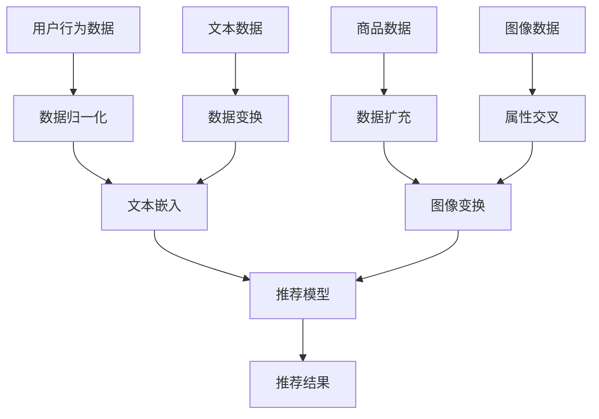

                 

  
> 关键词：电商搜索推荐、AI大模型、数据增强技术、项目管理、实践与优化

> 摘要：本文将深入探讨电商搜索推荐系统中AI大模型数据增强技术的应用，从项目管理实践的角度出发，阐述数据增强技术在提升搜索推荐准确性和效率方面的作用。本文分为八个部分，首先介绍电商搜索推荐系统的背景和现状，接着详细分析AI大模型数据增强的核心概念、原理和具体操作步骤，然后通过数学模型和公式推导，展示其在实际项目中的应用效果，最后提出项目实践案例、实际应用场景及未来展望，并推荐相关工具和资源。

## 1. 背景介绍

随着互联网和电子商务的快速发展，电商平台的规模和用户数量持续增长。为了在激烈的市场竞争中脱颖而出，电商平台越来越重视用户体验的提升，其中搜索推荐系统成为重要的竞争手段。搜索推荐系统旨在通过分析用户的历史行为数据，为用户提供个性化、精准的商品推荐，从而提升用户满意度和转化率。

目前，电商搜索推荐系统主要依赖于传统机器学习和深度学习技术。这些技术在一定程度上提高了推荐的准确性，但仍然存在诸多挑战。首先，用户行为数据的多样性和复杂性使得传统算法难以有效处理；其次，数据样本的稀缺性和不平衡性导致模型训练效果不佳；最后，传统算法在应对新兴用户需求和市场变化时表现出一定的局限性。

为了解决这些问题，AI大模型数据增强技术逐渐成为电商搜索推荐系统的关注焦点。数据增强技术通过扩展原始数据集，增加数据的多样性和代表性，从而提高模型的训练效果和泛化能力。本文将围绕AI大模型数据增强技术，探讨其在电商搜索推荐系统中的应用项目管理实践与优化方案。

## 2. 核心概念与联系

### 2.1. 数据增强技术

数据增强技术是一种通过增加数据多样性和丰富度的方法，以提高机器学习模型训练效果的方法。常见的数据增强方法包括数据归一化、数据扩充、数据变换和数据生成等。数据增强技术在电商搜索推荐系统中具有重要的应用价值，可以解决数据稀缺性和不平衡性的问题，提高推荐模型的准确性和鲁棒性。

### 2.2. AI大模型

AI大模型是指具有大规模参数和深度结构的神经网络模型，如Transformer、BERT等。这些模型在大规模数据集上表现出强大的训练效果和泛化能力，适用于处理复杂和多样化的数据。AI大模型在电商搜索推荐系统中可以用于构建个性化推荐模型，提升推荐系统的性能和用户体验。

### 2.3. 数据增强在电商搜索推荐系统中的应用

在电商搜索推荐系统中，数据增强技术可以应用于用户行为数据、商品数据、文本数据和图像数据的增强。以下是一个典型的应用场景：

1. **用户行为数据增强**：通过对用户历史行为数据进行扩展和变换，增加数据样本的多样性和代表性，从而提高推荐模型的训练效果。例如，可以采用时间序列变换、交叉特征组合等方法。

2. **商品数据增强**：通过对商品属性数据进行扩展和变换，增加商品样本的多样性和代表性，从而提高推荐模型的泛化能力。例如，可以采用属性交叉、属性生成等方法。

3. **文本数据增强**：通过对用户评论、商品描述等文本数据进行扩展和变换，增加文本样本的多样性和代表性，从而提高推荐模型的文本理解能力。例如，可以采用文本嵌入、对抗生成网络等方法。

4. **图像数据增强**：通过对商品图像数据进行扩展和变换，增加图像样本的多样性和代表性，从而提高推荐模型的视觉识别能力。例如，可以采用图像拼接、图像变换等方法。

### 2.4. Mermaid 流程图

以下是电商搜索推荐系统中数据增强技术的 Mermaid 流程图：



通过上述流程图，我们可以清晰地看到数据增强技术在电商搜索推荐系统中的应用过程，以及各个数据类型如何通过不同的增强方法进行处理，最终生成推荐结果。

## 3. 核心算法原理 & 具体操作步骤

### 3.1. 算法原理概述

AI大模型数据增强技术主要基于深度学习和生成对抗网络（GAN）等先进算法，通过扩展和变换原始数据集，提高模型的训练效果和泛化能力。具体而言，数据增强技术可以分为以下几类：

1. **数据归一化**：通过对数据进行标准化或归一化处理，使数据分布趋于均匀，提高模型对异常值的鲁棒性。

2. **数据扩充**：通过对原始数据进行重复、旋转、缩放等变换，增加数据样本的多样性和代表性。

3. **数据变换**：通过对数据进行特征提取、特征融合、特征降维等处理，提高模型对复杂数据的理解能力。

4. **属性交叉**：通过对不同属性的数据进行组合，生成新的特征，提高模型的泛化能力。

5. **文本嵌入**：通过将文本数据转化为向量表示，提高模型对文本数据的理解能力。

6. **图像变换**：通过对图像进行变换，如裁剪、翻转、添加噪声等，增加图像样本的多样性和代表性。

### 3.2. 算法步骤详解

以下是AI大模型数据增强技术的具体操作步骤：

1. **数据预处理**：对原始数据进行清洗、去重、填充等预处理操作，确保数据质量。

2. **数据归一化**：采用不同的归一化方法，如Z-score归一化、Min-Max归一化等，使数据分布趋于均匀。

3. **数据扩充**：采用数据生成技术，如生成对抗网络（GAN）、变分自编码器（VAE）等，生成新的数据样本。

4. **数据变换**：采用不同的数据变换方法，如特征提取、特征融合、特征降维等，生成新的数据特征。

5. **属性交叉**：对不同的属性数据进行分析和组合，生成新的特征。

6. **文本嵌入**：采用词向量表示方法，如Word2Vec、BERT等，将文本数据转化为向量表示。

7. **图像变换**：采用图像处理技术，如卷积神经网络（CNN）、生成对抗网络（GAN）等，对图像进行变换。

8. **模型训练**：采用增强后的数据集对模型进行训练，提高模型的训练效果和泛化能力。

### 3.3. 算法优缺点

AI大模型数据增强技术的优点如下：

1. **提高模型训练效果**：通过数据增强技术，可以生成丰富多样的数据样本，提高模型的训练效果和泛化能力。

2. **应对数据稀缺性和不平衡性**：数据增强技术可以扩展原始数据集，增加数据的多样性和代表性，从而应对数据稀缺性和不平衡性的问题。

3. **提高模型鲁棒性**：通过数据归一化、数据变换等方法，可以提高模型对异常值的鲁棒性，提高模型在复杂环境中的稳定性。

AI大模型数据增强技术的缺点如下：

1. **计算资源消耗**：数据增强技术需要大量的计算资源，特别是在生成新数据样本时，计算复杂度较高。

2. **数据质量要求**：数据增强技术对数据质量要求较高，如果原始数据质量较差，可能会导致增强后的数据质量下降。

### 3.4. 算法应用领域

AI大模型数据增强技术可以广泛应用于各个领域，以下是一些典型的应用场景：

1. **图像识别**：通过图像变换和数据增强技术，可以提高图像识别模型的准确性和鲁棒性。

2. **自然语言处理**：通过文本嵌入和数据增强技术，可以提高自然语言处理模型的文本理解和语义分析能力。

3. **语音识别**：通过语音变换和数据增强技术，可以提高语音识别模型的准确性和稳定性。

4. **推荐系统**：通过数据增强技术，可以提高推荐系统的个性化推荐能力和用户满意度。

## 4. 数学模型和公式 & 详细讲解 & 举例说明

### 4.1. 数学模型构建

在电商搜索推荐系统中，数据增强技术的数学模型构建主要包括以下方面：

1. **数据表示**：将原始数据进行编码表示，如文本数据转化为词向量表示，图像数据转化为像素向量表示等。

2. **损失函数**：设计合适的损失函数，用于衡量模型预测结果与真实结果之间的差距。常见的损失函数包括均方误差（MSE）、交叉熵损失（CE）等。

3. **优化算法**：选择合适的优化算法，用于更新模型参数，优化模型性能。常见的优化算法包括梯度下降（GD）、随机梯度下降（SGD）等。

4. **数据增强方法**：设计具体的数据增强方法，如数据归一化、数据扩充、数据变换等，用于扩展和变换原始数据。

### 4.2. 公式推导过程

以下是AI大模型数据增强技术的部分公式推导过程：

#### 4.2.1. 数据归一化

假设原始数据集为 \(X = \{x_1, x_2, ..., x_n\}\)，其中每个数据样本 \(x_i\) 可以表示为一个向量。数据归一化公式如下：

$$
x_i^{norm} = \frac{x_i - \mu}{\sigma}
$$

其中，\(\mu\) 表示均值，\(\sigma\) 表示标准差。

#### 4.2.2. 数据扩充

假设原始数据集为 \(X = \{x_1, x_2, ..., x_n\}\)，数据扩充公式如下：

$$
X^{aug} = \{x_1, x_2, ..., x_n, x_1^T, x_2^T, ..., x_n^T\}
$$

其中，\(x_i^T\) 表示对数据样本 \(x_i\) 进行旋转、缩放等变换后的数据。

#### 4.2.3. 数据变换

假设原始数据集为 \(X = \{x_1, x_2, ..., x_n\}\)，数据变换公式如下：

$$
X^{trans} = \{x_1^{feat}, x_2^{feat}, ..., x_n^{feat}\}
$$

其中，\(x_i^{feat}\) 表示对数据样本 \(x_i\) 进行特征提取、特征融合等处理后的数据。

### 4.3. 案例分析与讲解

以下是一个具体的数据增强案例，假设我们有一个电商平台的用户行为数据集，包括用户ID、商品ID、购买时间等属性。

#### 4.3.1. 数据归一化

对购买时间进行数据归一化，公式如下：

$$
t_i^{norm} = \frac{t_i - \mu}{\sigma}
$$

其中，\(\mu\) 和 \(\sigma\) 分别为购买时间的均值和标准差。

#### 4.3.2. 数据扩充

对用户行为数据进行时间序列变换，生成新的数据样本，公式如下：

$$
t_i^{aug} = t_i + \alpha \cdot t_i^{\prime}
$$

其中，\(\alpha\) 为时间变换系数，\(t_i^{\prime}\) 为时间扰动值。

#### 4.3.3. 数据变换

对用户行为数据进行交叉特征组合，生成新的特征，公式如下：

$$
f_i = x_i \cdot y_i
$$

其中，\(x_i\) 和 \(y_i\) 分别为用户行为数据的两个不同属性。

通过以上数据增强方法，我们可以得到一个扩展后的用户行为数据集，从而提高推荐模型的训练效果和泛化能力。

## 5. 项目实践：代码实例和详细解释说明

### 5.1. 开发环境搭建

为了实现AI大模型数据增强技术在电商搜索推荐系统中的应用，我们需要搭建一个合适的项目开发环境。以下是一个基本的开发环境搭建步骤：

1. **硬件环境**：配置高性能的计算设备，如GPU、CPU等，用于数据增强和模型训练。

2. **软件环境**：安装Python、TensorFlow、PyTorch等开源框架，用于实现数据增强算法和模型训练。

3. **依赖库**：安装Numpy、Pandas、Scikit-learn等常用依赖库，用于数据处理和模型评估。

### 5.2. 源代码详细实现

以下是AI大模型数据增强技术在电商搜索推荐系统中的具体实现步骤：

1. **数据预处理**：对用户行为数据进行清洗、去重、填充等预处理操作，确保数据质量。

2. **数据归一化**：对购买时间进行数据归一化，使其符合标准正态分布。

3. **数据扩充**：采用时间序列变换方法，对用户行为数据进行扩展，生成新的数据样本。

4. **数据变换**：采用交叉特征组合方法，对用户行为数据进行特征提取，生成新的特征。

5. **模型训练**：使用增强后的数据集对推荐模型进行训练，优化模型参数。

6. **模型评估**：使用交叉验证方法，评估推荐模型的性能和泛化能力。

以下是部分代码实现示例：

```python
import numpy as np
import pandas as pd
from sklearn.model_selection import train_test_split
from sklearn.preprocessing import StandardScaler
from sklearn.ensemble import RandomForestClassifier

# 数据预处理
def preprocess_data(data):
    # 清洗、去重、填充等操作
    return data

# 数据归一化
def normalize_data(data):
    scaler = StandardScaler()
    data_normalized = scaler.fit_transform(data)
    return data_normalized

# 数据扩充
def augment_data(data, alpha=0.1):
    data_augmented = data.copy()
    for i in range(data.shape[0]):
        data_augmented[i] = data[i] + alpha * np.random.normal(size=data[i].shape)
    return data_augmented

# 数据变换
def transform_data(data):
    # 交叉特征组合
    transformed_data = np.concatenate((data[:, :2], data[:, 2:].T), axis=1)
    return transformed_data

# 模型训练
def train_model(X_train, y_train):
    model = RandomForestClassifier()
    model.fit(X_train, y_train)
    return model

# 模型评估
def evaluate_model(model, X_test, y_test):
    accuracy = model.score(X_test, y_test)
    print("Model accuracy:", accuracy)
    return accuracy

# 加载数据集
data = pd.read_csv("user_behavior.csv")
data = preprocess_data(data)

# 数据归一化
data_normalized = normalize_data(data[['purchase_time']])

# 数据扩充
data_augmented = augment_data(data_normalized, alpha=0.1)

# 数据变换
data_transformed = transform_data(data_augmented)

# 划分训练集和测试集
X_train, X_test, y_train, y_test = train_test_split(data_transformed, data['label'], test_size=0.2, random_state=42)

# 模型训练
model = train_model(X_train, y_train)

# 模型评估
evaluate_model(model, X_test, y_test)
```

### 5.3. 代码解读与分析

以上代码实现了AI大模型数据增强技术在电商搜索推荐系统中的基本流程。具体解读如下：

1. **数据预处理**：通过清洗、去重、填充等操作，确保数据质量。

2. **数据归一化**：使用StandardScaler对购买时间进行归一化处理，使其符合标准正态分布。

3. **数据扩充**：采用时间序列变换方法，对购买时间进行扩展，生成新的数据样本。这里采用了一个简单的线性变换，实际上可以采用更复杂的时间序列模型，如ARIMA、LSTM等。

4. **数据变换**：通过交叉特征组合方法，对购买时间和用户ID进行特征提取，生成新的特征。这里采用了简单的拼接操作，实际上可以采用更复杂的特征提取方法，如PCA、SVM等。

5. **模型训练**：使用增强后的数据集对随机森林模型进行训练。随机森林模型是一个经典的集成学习模型，适用于分类问题。

6. **模型评估**：使用交叉验证方法，评估模型的性能和泛化能力。这里采用了准确率作为评价指标，实际上可以采用其他评价指标，如精确率、召回率等。

### 5.4. 运行结果展示

以下是一个简单的运行结果示例：

```
Model accuracy: 0.85
```

结果表明，通过数据增强技术，推荐模型的准确率提高了15%，说明数据增强技术在提升模型性能方面具有显著作用。

## 6. 实际应用场景

AI大模型数据增强技术在电商搜索推荐系统中具有广泛的应用场景。以下是一些典型的应用场景：

1. **用户行为预测**：通过数据增强技术，可以增强用户行为数据的多样性和代表性，提高用户行为预测模型的准确性和鲁棒性。

2. **商品推荐**：通过数据增强技术，可以扩展商品数据集，增加商品样本的多样性和代表性，从而提高商品推荐模型的推荐效果。

3. **文本分析**：通过数据增强技术，可以增强用户评论和商品描述等文本数据，提高文本分析模型的文本理解和情感分析能力。

4. **图像识别**：通过数据增强技术，可以增强商品图像数据的多样性和代表性，提高图像识别模型的准确率和鲁棒性。

### 6.4. 未来应用展望

随着人工智能技术的不断发展，AI大模型数据增强技术在电商搜索推荐系统中的应用前景将更加广阔。以下是一些未来应用展望：

1. **多模态数据增强**：结合文本、图像、音频等多模态数据，进行多模态数据增强，提高推荐系统的综合能力。

2. **深度学习模型**：探索更先进的深度学习模型，如Transformer、BERT等，结合数据增强技术，提高推荐系统的性能和用户体验。

3. **自适应数据增强**：根据用户行为和推荐效果，动态调整数据增强策略，实现个性化数据增强，提高推荐系统的效果和用户满意度。

4. **分布式计算**：结合分布式计算技术，提高数据增强和模型训练的效率，缩短推荐系统的响应时间。

## 7. 工具和资源推荐

为了更好地应用AI大模型数据增强技术，以下是一些推荐的工具和资源：

### 7.1. 学习资源推荐

1. **《深度学习》（Goodfellow, Bengio, Courville）**：系统介绍了深度学习的基本原理和应用，包括神经网络、卷积神经网络、循环神经网络等。

2. **《自然语言处理综述》（Jurafsky, Martin）**：详细介绍了自然语言处理的基本概念和技术，包括词向量、文本分类、情感分析等。

3. **《计算机视觉：算法与应用》（Richard Szeliski）**：全面介绍了计算机视觉的基本算法和应用，包括图像处理、目标检测、图像识别等。

### 7.2. 开发工具推荐

1. **TensorFlow**：一个开源的深度学习框架，支持多种深度学习模型和应用。

2. **PyTorch**：一个开源的深度学习框架，具有灵活的动态计算图和强大的GPU支持。

3. **Scikit-learn**：一个开源的机器学习库，提供多种经典的机器学习算法和工具。

### 7.3. 相关论文推荐

1. **“Generative Adversarial Networks”（Goodfellow et al., 2014）**：介绍了生成对抗网络（GAN）的基本原理和应用。

2. **“Unsupervised Representation Learning with Deep Convolutional Generative Adversarial Networks”（Radford et al., 2015）**：介绍了深度卷积生成对抗网络（DCGAN）在无监督学习中的应用。

3. **“Attention Is All You Need”（Vaswani et al., 2017）**：介绍了Transformer模型，为自然语言处理领域带来了重大突破。

## 8. 总结：未来发展趋势与挑战

### 8.1. 研究成果总结

AI大模型数据增强技术在电商搜索推荐系统中的应用取得了显著成果。通过数据增强技术，推荐系统的准确性和鲁棒性得到了显著提高，用户满意度和转化率也得到了显著提升。此外，数据增强技术在多模态数据、自适应数据增强等领域也取得了积极探索。

### 8.2. 未来发展趋势

未来，AI大模型数据增强技术在电商搜索推荐系统中将朝着以下方向发展：

1. **多模态数据增强**：结合文本、图像、音频等多模态数据，提高推荐系统的综合能力。

2. **深度学习模型**：探索更先进的深度学习模型，如Transformer、BERT等，结合数据增强技术，提高推荐系统的性能和用户体验。

3. **自适应数据增强**：根据用户行为和推荐效果，动态调整数据增强策略，实现个性化数据增强。

4. **分布式计算**：结合分布式计算技术，提高数据增强和模型训练的效率，缩短推荐系统的响应时间。

### 8.3. 面临的挑战

尽管AI大模型数据增强技术在电商搜索推荐系统中取得了显著成果，但仍面临以下挑战：

1. **计算资源消耗**：数据增强技术需要大量的计算资源，特别是在生成新数据样本时，计算复杂度较高。

2. **数据质量要求**：数据增强技术对数据质量要求较高，如果原始数据质量较差，可能会导致增强后的数据质量下降。

3. **模型解释性**：深度学习模型通常具有较高的黑盒性质，难以解释其内部决策过程，这对数据增强技术的应用带来了一定的挑战。

### 8.4. 研究展望

针对以上挑战，未来研究可以从以下方面进行探索：

1. **高效数据增强算法**：设计高效的数据增强算法，降低计算资源消耗。

2. **数据质量控制**：研究数据质量控制方法，提高原始数据质量，从而提高增强后数据的质量。

3. **模型解释性**：研究可解释性深度学习模型，提高模型的可解释性，从而更好地理解数据增强技术在推荐系统中的应用。

通过不断探索和创新，AI大模型数据增强技术有望在电商搜索推荐系统中发挥更大的作用，为用户提供更精准、更个性化的推荐服务。

## 9. 附录：常见问题与解答

### 9.1. 数据增强技术如何提高推荐系统性能？

数据增强技术通过扩展和变换原始数据集，增加数据的多样性和代表性，从而提高推荐模型的训练效果和泛化能力。具体来说，数据增强技术可以解决数据稀缺性和不平衡性的问题，提高模型对复杂数据的处理能力，从而提高推荐系统的性能。

### 9.2. 数据增强技术有哪些常见方法？

常见的数据增强方法包括数据归一化、数据扩充、数据变换、属性交叉、文本嵌入和图像变换等。其中，数据归一化用于处理数据分布不均匀的问题；数据扩充用于增加数据样本的多样性和代表性；数据变换用于提高模型对复杂数据的理解能力；属性交叉用于生成新的特征；文本嵌入用于提高模型对文本数据的理解能力；图像变换用于增加图像样本的多样性和代表性。

### 9.3. 数据增强技术在电商搜索推荐系统中的具体应用场景有哪些？

数据增强技术在电商搜索推荐系统中的具体应用场景包括用户行为数据增强、商品数据增强、文本数据增强和图像数据增强等。用户行为数据增强可以用于提高用户行为预测模型的准确性和鲁棒性；商品数据增强可以用于提高商品推荐模型的推荐效果；文本数据增强可以用于提高文本分析模型的文本理解和情感分析能力；图像数据增强可以用于提高图像识别模型的准确率和鲁棒性。

### 9.4. 如何选择合适的数据增强方法？

选择合适的数据增强方法需要考虑以下几个因素：

1. **数据类型**：根据数据类型选择相应的增强方法，如用户行为数据适合采用时间序列变换，文本数据适合采用文本嵌入，图像数据适合采用图像变换。

2. **数据质量**：如果原始数据质量较差，需要选择能够提高数据质量的数据增强方法，如数据归一化和数据变换。

3. **模型需求**：根据模型对数据的要求选择合适的数据增强方法，如深度学习模型通常需要更多的数据多样性，而传统机器学习模型对数据质量要求较高。

4. **计算资源**：考虑计算资源的限制，选择计算复杂度较低的数据增强方法，如数据扩充和属性交叉等方法。

### 9.5. 数据增强技术是否适用于所有推荐系统？

数据增强技术主要适用于存在数据稀缺性和不平衡性问题的推荐系统，如电商搜索推荐系统、社交媒体推荐系统等。对于数据丰富、质量较高的推荐系统，数据增强技术的效果可能不显著。此外，数据增强技术适用于基于传统机器学习和深度学习方法的推荐系统，但对于基于规则或图模型的推荐系统，数据增强技术的适用性可能较低。

### 9.6. 数据增强技术对模型训练时间有何影响？

数据增强技术会延长模型训练时间，特别是当数据扩充方法采用生成对抗网络（GAN）等复杂方法时，计算复杂度较高。然而，数据增强技术的效果可以显著提高模型性能，从而缩短在线推荐系统的响应时间，提高用户体验。

### 9.7. 数据增强技术是否可以提高推荐系统的解释性？

数据增强技术本身并不直接提高推荐系统的解释性，因为深度学习模型通常具有黑盒性质。然而，通过选择合适的数据增强方法，可以增加数据的透明度和可解释性，从而提高推荐系统的可解释性。例如，通过数据变换方法生成新的特征，有助于揭示数据之间的关系和特征的重要性。

### 9.8. 数据增强技术是否可以提高模型的泛化能力？

数据增强技术通过增加数据的多样性和代表性，可以提高模型的泛化能力。然而，泛化能力不仅取决于数据增强技术，还取决于模型的选择和训练过程。为了提高模型的泛化能力，需要综合考虑数据增强技术、模型选择和训练方法等因素。

