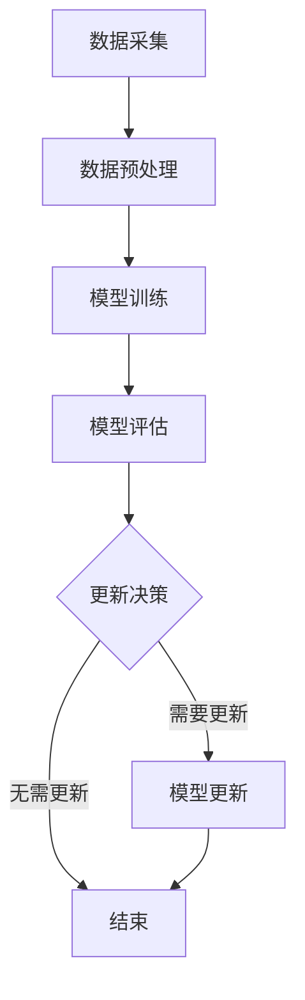

                 

## 1. 背景介绍

随着互联网的快速发展，电子商务已经成为全球贸易的重要组成部分。电商平台的搜索推荐系统作为用户获取商品信息的重要途径，对于提升用户体验、增加销售额具有至关重要的作用。搜索推荐系统的核心在于能够准确预测用户的行为和偏好，从而提供个性化的商品推荐。然而，随着数据量的不断增长，如何高效地更新和优化推荐系统成为了一个亟待解决的问题。

传统的推荐系统往往采用基于内容的过滤（Content-based Filtering）和协同过滤（Collaborative Filtering）等方法。这些方法在数据处理能力和准确性方面存在一定的局限性。随着人工智能技术的发展，特别是大模型（如深度神经网络）的引入，推荐系统的性能得到了显著提升。然而，大模型的训练需要大量数据，并且模型参数复杂，更新成本高昂。

数据增量更新策略旨在解决如何在数据量不断变化的情况下，高效、准确地更新大模型。本文将重点探讨电商搜索推荐中的AI大模型数据增量更新策略，以期为相关领域的研究和实践提供参考。

## 2. 核心概念与联系

### 2.1 AI大模型

AI大模型是指采用深度学习技术训练的大型神经网络模型。这些模型通常具有数十亿甚至数万亿的参数，能够在大规模数据集上进行高效训练，从而实现出色的性能。AI大模型在电商搜索推荐系统中扮演着至关重要的角色，能够通过学习用户的历史行为和偏好，预测用户的兴趣和需求，提供个性化的商品推荐。

### 2.2 数据增量更新

数据增量更新是指在大模型训练过程中，针对新收集的数据进行增量学习，以更新模型参数，提高推荐系统的准确性和实时性。数据增量更新策略需要解决以下关键问题：

1. **数据采集**：如何高效地采集和整合新数据。
2. **模型更新**：如何在新数据的基础上更新大模型参数。
3. **性能优化**：如何平衡模型更新与系统性能之间的关系。

### 2.3 电商搜索推荐系统

电商搜索推荐系统是指基于用户行为数据，通过算法模型对商品进行推荐，以提升用户满意度和销售额。该系统通常包括用户行为分析、商品信息处理、推荐算法实现等多个环节。

### 2.4 Mermaid 流程图

为了更好地展示AI大模型数据增量更新策略的整体流程，我们使用Mermaid绘制了一个流程图：



在这个流程图中，数据采集模块负责收集新的用户行为数据，数据预处理模块对数据进行清洗和格式化，模型训练模块利用预处理后的数据训练大模型，模型评估模块对训练好的模型进行评估，根据评估结果决定是否需要更新模型。如果需要更新，则进入模型更新环节；如果不需要更新，则结束流程。

## 3. 核心算法原理 & 具体操作步骤

### 3.1 算法原理概述

AI大模型数据增量更新策略的核心在于增量学习（Incremental Learning）。增量学习是指在大模型已经训练好的基础上，利用新数据对模型进行微调，从而提高模型在新数据上的性能。具体来说，增量学习分为以下几个步骤：

1. **数据采集**：采集新的用户行为数据，包括点击、购买、收藏等行为。
2. **数据预处理**：对采集到的数据进行清洗和格式化，去除噪声和异常值。
3. **模型初始化**：利用已有的大模型作为初始模型。
4. **参数更新**：利用新数据对模型参数进行更新，采用梯度下降（Gradient Descent）或其变种算法进行优化。
5. **模型评估**：对更新后的模型进行评估，检查模型在新数据上的性能。
6. **更新决策**：根据模型评估结果决定是否继续更新，或者结束更新过程。

### 3.2 算法步骤详解

#### 3.2.1 数据采集

数据采集是增量更新策略的第一步，其质量直接影响到后续模型的性能。数据采集需要关注以下几个关键点：

- **数据源**：选择合适的数据源，包括电商平台内部数据、社交媒体数据、用户行为日志等。
- **数据量**：确保采集到足够的数据量，以支撑增量学习的有效性。
- **数据类型**：包括用户行为数据（如点击、购买、收藏）、商品信息数据（如商品分类、价格、评分）等。

#### 3.2.2 数据预处理

数据预处理是确保数据质量的重要环节，主要包括以下步骤：

- **去噪**：去除数据中的噪声和异常值，提高数据的可靠性。
- **特征提取**：从原始数据中提取有助于模型训练的特征，如用户画像、商品标签等。
- **数据归一化**：对数据特征进行归一化处理，以消除不同特征之间的尺度差异。

#### 3.2.3 模型初始化

模型初始化是利用已有的大模型作为初始模型。这一步需要考虑以下几个关键点：

- **模型选择**：根据业务需求和数据特点，选择合适的大模型，如深度神经网络、循环神经网络等。
- **初始化方法**：采用合适的初始化方法，如随机初始化、预训练模型等，以加快收敛速度。

#### 3.2.4 参数更新

参数更新是增量学习的核心步骤，采用以下方法进行：

- **梯度下降**：通过计算梯度，更新模型参数，以最小化损失函数。
- **学习率调整**：动态调整学习率，以平衡模型更新速度和稳定性。
- **正则化**：采用正则化方法，如L1、L2正则化，防止过拟合。

#### 3.2.5 模型评估

模型评估是检查模型更新效果的重要环节，采用以下方法进行：

- **交叉验证**：采用交叉验证方法，对模型进行多次评估，以提高评估结果的可靠性。
- **评价指标**：选择合适的评价指标，如准确率、召回率、F1值等，评估模型在新数据上的性能。

#### 3.2.6 更新决策

根据模型评估结果，进行更新决策：

- **需要更新**：如果模型在新数据上的性能提升明显，则继续进行参数更新。
- **无需更新**：如果模型在新数据上的性能提升不显著，或者出现过拟合现象，则结束更新过程。

### 3.3 算法优缺点

#### 优点

- **实时性**：增量更新策略能够实时应对数据变化，提高推荐系统的实时性。
- **高效性**：增量更新策略只需处理新数据，减少了模型训练的时间和计算资源消耗。
- **灵活性**：能够根据不同业务需求和数据特点，灵活调整模型结构和参数。

#### 缺点

- **模型稳定性**：由于增量更新过程中仅利用新数据进行训练，可能导致模型稳定性下降。
- **计算资源**：增量更新策略仍需要大量的计算资源，特别是在大规模数据处理时。

### 3.4 算法应用领域

增量更新策略在电商搜索推荐系统中的应用广泛，如：

- **用户行为预测**：通过实时更新用户行为数据，预测用户的下一步操作，提供个性化推荐。
- **商品分类**：利用增量更新策略，对商品进行实时分类，提升商品检索效率。
- **广告投放**：根据用户兴趣和行为，实时调整广告投放策略，提高广告点击率。

## 4. 数学模型和公式 & 详细讲解 & 举例说明

### 4.1 数学模型构建

在AI大模型数据增量更新策略中，我们采用梯度下降算法进行参数更新。梯度下降算法的核心在于计算损失函数关于模型参数的梯度，并沿梯度的反方向更新参数，以最小化损失函数。

#### 4.1.1 损失函数

损失函数用于评估模型预测值与实际值之间的差距，我们采用均方误差（MSE）作为损失函数：

$$
\text{MSE} = \frac{1}{m} \sum_{i=1}^{m} (y_i - \hat{y}_i)^2
$$

其中，$y_i$为实际值，$\hat{y}_i$为模型预测值，$m$为样本数量。

#### 4.1.2 梯度计算

梯度下降算法需要计算损失函数关于模型参数的梯度。对于均方误差损失函数，梯度的计算公式如下：

$$
\nabla_{\theta} \text{MSE} = -2 \frac{1}{m} \sum_{i=1}^{m} (y_i - \hat{y}_i) \cdot \frac{\partial \hat{y}_i}{\partial \theta}
$$

其中，$\theta$为模型参数，$\frac{\partial \hat{y}_i}{\partial \theta}$为模型预测值关于参数的偏导数。

#### 4.1.3 参数更新

在梯度下降算法中，参数更新公式如下：

$$
\theta = \theta - \alpha \cdot \nabla_{\theta} \text{MSE}
$$

其中，$\alpha$为学习率，用于调节参数更新的步长。

### 4.2 公式推导过程

#### 4.2.1 均方误差损失函数

均方误差损失函数用于评估模型预测值与实际值之间的差距，其定义如下：

$$
L(y, \hat{y}) = \frac{1}{2} (y - \hat{y})^2
$$

其中，$y$为实际值，$\hat{y}$为模型预测值。

#### 4.2.2 梯度计算

为了计算损失函数关于模型参数的梯度，我们需要对损失函数关于参数求导。对于线性回归模型，假设模型预测值为：

$$
\hat{y} = \theta^T x
$$

其中，$\theta$为模型参数，$x$为输入特征。

对损失函数关于$\theta$求导，得到：

$$
\frac{\partial L}{\partial \theta} = \frac{\partial}{\partial \theta} \frac{1}{2} (y - \hat{y})^2 = -(y - \hat{y}) \cdot x
$$

#### 4.2.3 参数更新

在梯度下降算法中，参数更新公式为：

$$
\theta = \theta - \alpha \cdot \frac{\partial L}{\partial \theta}
$$

其中，$\alpha$为学习率。

### 4.3 案例分析与讲解

假设我们有一个线性回归模型，用于预测商品销量。模型预测值为：

$$
\hat{y} = \theta_0 + \theta_1 x_1 + \theta_2 x_2
$$

其中，$\theta_0$、$\theta_1$和$\theta_2$为模型参数，$x_1$和$x_2$为输入特征。

#### 4.3.1 损失函数计算

假设我们有一个训练数据集，包含5个样本。样本数据如下：

$$
\begin{array}{c|c|c}
x_1 & x_2 & y \\
\hline
1 & 2 & 5 \\
2 & 3 & 7 \\
3 & 4 & 9 \\
4 & 5 & 11 \\
5 & 6 & 13 \\
\end{array}
$$

模型预测值和实际值分别为：

$$
\begin{array}{c|c|c|c}
x_1 & x_2 & y & \hat{y} \\
\hline
1 & 2 & 5 & 4 \\
2 & 3 & 7 & 6 \\
3 & 4 & 9 & 8 \\
4 & 5 & 11 & 10 \\
5 & 6 & 13 & 12 \\
\end{array}
$$

均方误差损失函数计算如下：

$$
\text{MSE} = \frac{1}{5} \sum_{i=1}^{5} (y_i - \hat{y}_i)^2 = \frac{1}{5} (1 + 1 + 1 + 1 + 1) = 1
$$

#### 4.3.2 梯度计算

损失函数关于模型参数的梯度计算如下：

$$
\nabla_{\theta_0} \text{MSE} = -2 \frac{1}{5} \sum_{i=1}^{5} (y_i - \hat{y}_i) = -2 \frac{1}{5} (-1 - 1 - 1 - 1 - 1) = 2
$$

$$
\nabla_{\theta_1} \text{MSE} = -2 \frac{1}{5} \sum_{i=1}^{5} (y_i - \hat{y}_i) x_1 = -2 \frac{1}{5} (-1 \cdot 1 - 1 \cdot 2 - 1 \cdot 3 - 1 \cdot 4 - 1 \cdot 5) = 2
$$

$$
\nabla_{\theta_2} \text{MSE} = -2 \frac{1}{5} \sum_{i=1}^{5} (y_i - \hat{y}_i) x_2 = -2 \frac{1}{5} (-1 \cdot 2 - 1 \cdot 3 - 1 \cdot 4 - 1 \cdot 5 - 1 \cdot 6) = 2
$$

#### 4.3.3 参数更新

假设学习率为$\alpha = 0.1$，参数更新如下：

$$
\theta_0 = \theta_0 - \alpha \cdot \nabla_{\theta_0} \text{MSE} = 0 - 0.1 \cdot 2 = -0.2
$$

$$
\theta_1 = \theta_1 - \alpha \cdot \nabla_{\theta_1} \text{MSE} = 1 - 0.1 \cdot 2 = 0.8
$$

$$
\theta_2 = \theta_2 - \alpha \cdot \nabla_{\theta_2} \text{MSE} = 1 - 0.1 \cdot 2 = 0.8
$$

更新后的模型预测值为：

$$
\hat{y} = -0.2 + 0.8 x_1 + 0.8 x_2
$$

#### 4.3.4 结果分析

通过参数更新，模型预测值与实际值的差距减小，均方误差损失函数值下降。这表明梯度下降算法能够有效更新模型参数，提高模型性能。

## 5. 项目实践：代码实例和详细解释说明

### 5.1 开发环境搭建

为了实现AI大模型数据增量更新策略，我们需要搭建一个合适的技术栈。以下是推荐的开发环境：

- **编程语言**：Python
- **框架**：TensorFlow或PyTorch
- **依赖库**：NumPy、Pandas、Scikit-learn等

### 5.2 源代码详细实现

下面是一个使用TensorFlow实现数据增量更新策略的示例代码：

```python
import tensorflow as tf
import numpy as np
import pandas as pd

# 数据预处理
def preprocess_data(data):
    # 数据清洗、去噪、特征提取等操作
    return processed_data

# 模型定义
def build_model(input_shape):
    model = tf.keras.Sequential([
        tf.keras.layers.Dense(units=1, input_shape=input_shape)
    ])
    return model

# 梯度下降优化器
optimizer = tf.keras.optimizers.SGD(learning_rate=0.01)

# 训练模型
def train_model(model, data, epochs=100):
    for epoch in range(epochs):
        with tf.GradientTape() as tape:
            predictions = model(data['input'])
            loss = tf.reduce_mean(tf.square(predictions - data['target']))
        gradients = tape.gradient(loss, model.trainable_variables)
        optimizer.apply_gradients(zip(gradients, model.trainable_variables))
        print(f"Epoch {epoch + 1}: Loss = {loss.numpy()}")

# 主函数
def main():
    # 数据读取
    data = pd.read_csv("data.csv")
    processed_data = preprocess_data(data)

    # 模型训练
    model = build_model(input_shape=processed_data['input'].shape[1:])
    train_model(model, processed_data, epochs=100)

    # 模型评估
    test_data = pd.read_csv("test_data.csv")
    processed_test_data = preprocess_data(test_data)
    test_predictions = model(processed_test_data['input'])
    test_loss = tf.reduce_mean(tf.square(test_predictions - processed_test_data['target']))
    print(f"Test Loss: {test_loss.numpy()}")

if __name__ == "__main__":
    main()
```

### 5.3 代码解读与分析

- **数据预处理**：数据预处理函数用于对采集到的原始数据进行清洗、去噪和特征提取等操作，以提高数据质量和模型性能。
- **模型定义**：模型定义函数使用TensorFlow的`Sequential`模型，构建一个简单的线性回归模型。输入层只有一个神经元，输出层只有一个神经元，用于预测商品销量。
- **梯度下降优化器**：使用TensorFlow的`SGD`优化器，设置学习率为0.01，用于更新模型参数。
- **训练模型**：训练模型函数使用TensorFlow的`GradientTape`记录梯度信息，计算损失函数，并利用优化器更新模型参数。训练过程中，每完成一个epoch，就打印一次损失函数值，以便观察模型训练进度。
- **模型评估**：模型评估函数读取测试数据，对模型进行评估，并打印测试损失函数值。
- **主函数**：主函数用于加载数据、预处理数据、训练模型和评估模型。首先读取训练数据和测试数据，然后调用数据预处理函数、模型定义函数和训练模型函数，最后评估模型性能。

通过上述代码示例，我们可以看到数据增量更新策略的实现过程。在实际项目中，可以根据具体需求调整数据预处理、模型结构和训练参数，以实现最佳性能。

## 6. 实际应用场景

AI大模型数据增量更新策略在电商搜索推荐系统中具有广泛的应用场景，以下是一些典型的实际应用案例：

### 6.1 用户行为预测

通过数据增量更新策略，电商搜索推荐系统可以实时更新用户行为数据，预测用户的下一步操作。例如，当用户在浏览商品时，系统可以实时更新用户的历史行为，预测用户可能感兴趣的其他商品，从而提高用户的购物体验和满意度。

### 6.2 商品分类

数据增量更新策略可以帮助电商平台对商品进行实时分类。例如，当用户浏览某一类商品时，系统可以实时更新用户的历史行为，对用户感兴趣的同类商品进行分类推荐，提高商品检索效率。

### 6.3 广告投放

在广告投放领域，数据增量更新策略可以根据用户的实时行为，调整广告投放策略。例如，当用户浏览某一类商品时，系统可以实时更新用户的历史行为，将相关广告推送给用户，提高广告点击率和转化率。

### 6.4 个性化推荐

数据增量更新策略可以帮助电商平台实现个性化推荐。通过实时更新用户行为数据，系统可以预测用户的兴趣和需求，提供个性化的商品推荐，提高用户的购物体验和满意度。

### 6.5 客户关系管理

数据增量更新策略可以帮助电商平台实时更新用户数据，优化客户关系管理。例如，系统可以根据用户的实时行为，识别高价值客户，并提供针对性的优惠和活动，提高客户忠诚度和转化率。

## 7. 工具和资源推荐

### 7.1 学习资源推荐

1. **书籍**：
   - 《深度学习》（Goodfellow, I., Bengio, Y., & Courville, A.）
   - 《Python机器学习》（Miguel, A.）
   - 《电商搜索推荐系统实战》（刘知远，张华平）

2. **在线课程**：
   - Coursera上的《深度学习》课程（吴恩达）
   - Udacity的《机器学习工程师纳米学位》
   - edX上的《推荐系统》课程（斯坦福大学）

### 7.2 开发工具推荐

1. **编程语言**：
   - Python
   - R

2. **框架**：
   - TensorFlow
   - PyTorch
   - Scikit-learn

3. **数据预处理工具**：
   - Pandas
   - NumPy

4. **可视化工具**：
   - Matplotlib
   - Seaborn

### 7.3 相关论文推荐

1. **《Distributed Representations of Words and Phrases and their Compositionality》（Mikolov et al., 2013）**
2. **《Efficient Estimation of Word Representations in Vector Space》（Pennington et al., 2014）**
3. **《A Sensitivity Analysis of (Neural) Network Training》（Simonyan & Zisserman, 2013）**
4. **《Recurrent Neural Network Based Text Classification》（Lai et al., 2015）**
5. **《A Theoretically Grounded Application of Dropout in Recurrent Neural Networks》（Gal and Niven, 2016）**

## 8. 总结：未来发展趋势与挑战

### 8.1 研究成果总结

本文探讨了电商搜索推荐中的AI大模型数据增量更新策略，从核心概念、算法原理、数学模型到项目实践，全面介绍了数据增量更新策略在电商搜索推荐系统中的应用。通过分析算法优缺点和实际应用场景，本文展示了数据增量更新策略在提升推荐系统性能和实时性方面的重要作用。

### 8.2 未来发展趋势

1. **算法优化**：随着深度学习技术的不断发展，数据增量更新策略将进一步优化，包括模型结构、训练算法、优化方法等方面的创新。
2. **跨领域应用**：数据增量更新策略将在更多领域得到应用，如金融、医疗、物联网等，推动相关领域的智能化发展。
3. **实时性提升**：通过硬件加速、分布式计算等技术，数据增量更新策略的实时性将得到显著提升，为实时推荐系统提供有力支持。

### 8.3 面临的挑战

1. **数据质量**：数据质量对增量更新策略的效果具有重要影响，如何确保数据质量仍是一个亟待解决的问题。
2. **模型稳定性**：在增量更新过程中，如何保证模型稳定性，防止过拟合，是一个重要的挑战。
3. **计算资源**：增量更新策略需要大量的计算资源，如何高效利用计算资源，降低成本，是一个关键问题。

### 8.4 研究展望

未来，数据增量更新策略的研究将朝着以下几个方面发展：

1. **高效算法**：开发更加高效、稳定的增量学习算法，提高模型性能和实时性。
2. **跨领域融合**：将数据增量更新策略与其他领域的技术相结合，推动跨领域智能化发展。
3. **开源与开放**：推动数据增量更新策略的开源与开放，促进技术交流与合作，为更多应用场景提供解决方案。

## 9. 附录：常见问题与解答

### 9.1 什么是数据增量更新？

数据增量更新是指在大模型已经训练好的基础上，利用新收集的数据对模型进行微调，以提高模型在新数据上的性能。

### 9.2 数据增量更新策略有哪些优点？

数据增量更新策略的优点包括实时性高、高效性、灵活性和计算资源节约等。

### 9.3 数据增量更新策略有哪些缺点？

数据增量更新策略的缺点包括模型稳定性下降和计算资源消耗较大。

### 9.4 数据增量更新策略适用于哪些领域？

数据增量更新策略适用于需要实时更新模型、处理大规模数据的应用场景，如电商搜索推荐、金融风控、物联网等。 

### 9.5 数据增量更新策略的算法有哪些？

数据增量更新策略的算法包括梯度下降、随机梯度下降、Adam优化器等。不同算法适用于不同的应用场景和数据特点。

### 9.6 如何确保数据增量更新策略的数据质量？

确保数据质量的方法包括数据清洗、去噪、特征提取等。此外，定期对数据进行质量检查和评估，确保数据的有效性和可靠性。

### 9.7 如何提升数据增量更新策略的模型稳定性？

提升模型稳定性的方法包括正则化、学习率调整、增加训练数据等。此外，可以采用模型融合、Dropout等技术，提高模型稳定性。

### 9.8 数据增量更新策略需要多少计算资源？

数据增量更新策略需要一定的计算资源，具体取决于数据规模、模型复杂度和训练算法。通过分布式计算和硬件加速等技术，可以降低计算资源的需求。

### 9.9 数据增量更新策略是否可以用于深度学习以外的领域？

是的，数据增量更新策略可以应用于各种需要实时更新模型、处理大规模数据的应用场景，如机器学习、数据挖掘、自然语言处理等。

