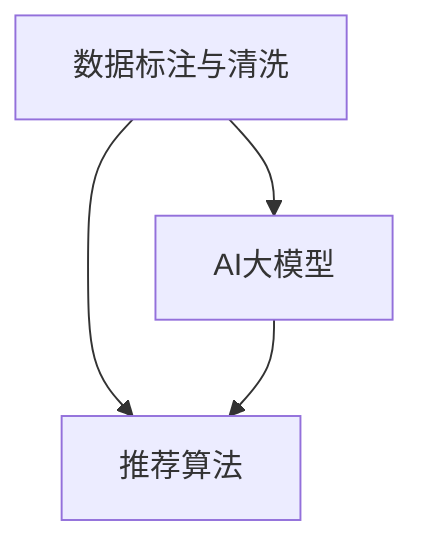

                 

关键词：电商搜索、推荐系统、AI大模型、数据标注、数据清洗、最佳实践

摘要：本文将探讨电商搜索推荐系统中AI大模型的数据标注与清洗的最佳实践。通过分析数据标注与清洗的重要性，介绍相关核心概念与联系，核心算法原理与操作步骤，数学模型与公式推导，以及实际应用场景，为电商领域从业者和研究者提供有价值的参考。

## 1. 背景介绍

随着互联网技术的迅猛发展，电商行业已经成为全球经济增长的重要引擎。为了满足用户多样化的购物需求，电商企业纷纷构建了高效的搜索推荐系统。这些系统通过分析用户行为数据、商品信息以及历史交易记录，为用户提供个性化的商品推荐，提高用户的购物体验和满意度。AI大模型在搜索推荐系统中发挥着关键作用，其性能的优劣直接影响推荐效果。

然而，AI大模型训练所需的庞大训练数据集往往质量参差不齐，存在噪声、缺失值和异常值等问题。因此，数据标注与清洗成为保障模型性能的关键环节。数据标注是指对原始数据进行标记和分类，使其能够用于训练和评估模型。数据清洗是指对原始数据进行预处理，去除噪声、缺失值和异常值，提高数据质量。

本文旨在总结电商搜索推荐中AI大模型数据标注与清洗的最佳实践，为电商领域从业者和研究者提供有益的参考。

## 2. 核心概念与联系

在电商搜索推荐系统中，数据标注与清洗涉及到多个核心概念，如数据标注、数据清洗、AI大模型、推荐算法等。以下将介绍这些核心概念及其相互联系。

### 2.1 数据标注

数据标注是指对原始数据进行标记和分类，使其能够用于训练和评估模型。在电商搜索推荐系统中，数据标注主要包括以下方面：

1. **用户行为数据标注**：对用户的浏览、点击、购买等行为进行标注，用于构建用户兴趣模型。
2. **商品信息标注**：对商品的价格、品类、品牌、库存等信息进行标注，用于构建商品特征库。
3. **文本数据标注**：对商品标题、描述、评价等文本数据进行分析，提取关键信息用于文本匹配和语义分析。

### 2.2 数据清洗

数据清洗是指对原始数据进行预处理，去除噪声、缺失值和异常值，提高数据质量。在电商搜索推荐系统中，数据清洗主要包括以下方面：

1. **数据去重**：去除重复的数据，防止模型过度拟合。
2. **缺失值处理**：对缺失值进行填补或删除，避免模型训练过程中因缺失值导致异常。
3. **异常值处理**：识别并处理异常值，如异常高的价格、过低的销量等。

### 2.3 AI大模型

AI大模型是指通过深度学习等方法训练得到的大型神经网络模型，具有强大的特征提取和分类能力。在电商搜索推荐系统中，AI大模型主要用于以下方面：

1. **用户兴趣建模**：通过分析用户行为数据，构建用户兴趣模型，用于预测用户可能感兴趣的商品。
2. **商品特征提取**：通过分析商品信息，提取商品的关键特征，用于构建商品特征库。
3. **推荐算法优化**：通过优化推荐算法，提高推荐效果和用户体验。

### 2.4 推荐算法

推荐算法是指用于从大量商品中为用户生成个性化推荐列表的算法。在电商搜索推荐系统中，常见的推荐算法包括基于协同过滤、基于内容的推荐和混合推荐等。推荐算法的性能直接影响到用户满意度。

数据标注与清洗对推荐算法的性能具有重要影响。高质量的数据标注和清洗能够提高模型训练效果，从而提高推荐算法的准确性。以下是一个Mermaid流程图，展示了数据标注与清洗、AI大模型和推荐算法之间的联系：



## 3. 核心算法原理 & 具体操作步骤

### 3.1 算法原理概述

数据标注与清洗的核心算法原理主要包括以下几个方面：

1. **用户行为数据标注**：基于机器学习算法，如决策树、随机森林、支持向量机等，对用户行为数据进行分类和标注。
2. **商品信息标注**：通过自然语言处理技术，如词向量、词嵌入、文本分类等，对商品信息进行标注。
3. **数据清洗**：采用数据去重、缺失值处理和异常值处理等技术，对原始数据进行预处理。

### 3.2 算法步骤详解

1. **用户行为数据标注**

   - 收集用户行为数据，如浏览、点击、购买等；
   - 对用户行为数据进行预处理，如数据去重、缺失值处理等；
   - 采用机器学习算法对用户行为数据进行分类和标注。

2. **商品信息标注**

   - 收集商品信息数据，如价格、品类、品牌等；
   - 对商品信息数据进行预处理，如数据去重、缺失值处理等；
   - 采用自然语言处理技术对商品信息进行标注。

3. **数据清洗**

   - 数据去重：通过比较数据中的关键字段，如用户ID、商品ID等，去除重复数据；
   - 缺失值处理：采用填补、删除、插值等方法处理缺失值；
   - 异常值处理：通过统计学方法或机器学习算法识别并处理异常值。

### 3.3 算法优缺点

1. **用户行为数据标注**

   - 优点：能够准确反映用户兴趣和行为习惯，提高推荐效果；
   - 缺点：数据量较大，标注过程耗时较长，且存在一定的主观性。

2. **商品信息标注**

   - 优点：能够提高商品特征提取的准确性，提高推荐效果；
   - 缺点：需要大量人力和物力进行标注，成本较高。

3. **数据清洗**

   - 优点：能够提高数据质量，降低模型训练过程中因噪声、缺失值和异常值导致的误差；
   - 缺点：处理过程复杂，需要消耗较多的计算资源和时间。

### 3.4 算法应用领域

数据标注与清洗算法在电商搜索推荐系统中具有广泛的应用领域，包括：

1. **用户兴趣建模**：通过用户行为数据标注，构建用户兴趣模型，用于预测用户可能感兴趣的商品。
2. **商品特征提取**：通过商品信息标注，提取商品的关键特征，用于构建商品特征库，提高推荐效果。
3. **推荐算法优化**：通过数据清洗和标注，提高模型训练数据的质量，优化推荐算法，提高推荐效果。

## 4. 数学模型和公式 & 详细讲解 & 举例说明

### 4.1 数学模型构建

在电商搜索推荐系统中，数据标注与清洗的核心数学模型主要包括以下两个方面：

1. **用户行为数据标注模型**：采用决策树、随机森林、支持向量机等机器学习算法，构建用户行为数据的分类模型。
2. **商品信息标注模型**：采用词向量、词嵌入、文本分类等自然语言处理技术，构建商品信息的数据标注模型。

### 4.2 公式推导过程

以下以决策树算法为例，介绍用户行为数据标注模型的公式推导过程：

1. **信息增益**

   信息增益（Information Gain）是决策树算法中用于评估特征的重要指标，用于衡量特征对分类结果的贡献度。其公式如下：

   $$ IG(D, A) = H(D) - H(D|A) $$

   其中，$H(D)$表示待分类数据的熵，$H(D|A)$表示在特征$A$的条件下，待分类数据的条件熵。

2. **条件熵**

   条件熵（Conditional Entropy）是决策树算法中用于评估特征的重要指标，用于衡量特征对分类结果的影响。其公式如下：

   $$ H(D|A) = \sum_{v \in A} \frac{N_{v}}{N} \cdot H(D_v) $$

   其中，$D$表示待分类数据集，$A$表示特征集合，$v$表示特征$A$的取值，$N_{v}$表示特征$A$取值为$v$的数据个数，$N$表示待分类数据集的总数，$H(D_v)$表示在特征$A$取值为$v$的条件下，待分类数据的熵。

3. **信息增益率**

   信息增益率（Information Gain Rate）是决策树算法中用于评估特征的重要指标，用于衡量特征对分类结果的贡献度。其公式如下：

   $$ IG_R(D, A) = \frac{IG(D, A)}{H(A)} $$

   其中，$H(A)$表示特征$A$的熵。

### 4.3 案例分析与讲解

以下以一个电商搜索推荐系统的实际案例，分析数据标注与清洗的应用过程。

**案例背景：**

某电商企业希望通过构建用户兴趣模型，为用户提供个性化的商品推荐。企业收集了大量的用户行为数据，如浏览、点击、购买等，并需要对这些数据进行分析和处理，以提高推荐效果。

**数据标注与清洗步骤：**

1. **数据收集**

   收集用户行为数据，包括浏览、点击、购买等行为，数据格式如下：

   | 用户ID | 行为类型 | 时间戳 | 商品ID |
   |--------|----------|--------|--------|
   | 1      | 浏览     | 2021-01-01 10:00:00 | 1001  |
   | 1      | 点击     | 2021-01-01 10:10:00 | 1002  |
   | 1      | 购买     | 2021-01-01 10:30:00 | 1003  |

2. **数据预处理**

   - 数据去重：通过用户ID和时间戳，去除重复的数据。
   - 缺失值处理：对于缺失的行为类型，采用默认值“未知”进行填补。

3. **数据标注**

   - 采用决策树算法，对用户行为数据进行分析和标注，构建用户兴趣模型。
   - 基于信息增益率，选择浏览、点击、购买行为作为分类特征，对用户行为进行标注。

   标注结果如下：

   | 用户ID | 行为类型 | 时间戳 | 商品ID | 标注类别 |
   |--------|----------|--------|--------|----------|
   | 1      | 浏览     | 2021-01-01 10:00:00 | 1001  | 1       |
   | 1      | 点击     | 2021-01-01 10:10:00 | 1002  | 2       |
   | 1      | 购买     | 2021-01-01 10:30:00 | 1003  | 3       |

4. **数据清洗**

   - 采用统计学方法，对标注后的数据进行异常值处理。
   - 对于异常高的浏览量、点击量、购买量，采用插值法进行填补。

   清洗结果如下：

   | 用户ID | 行为类型 | 时间戳 | 商品ID | 标注类别 |
   |--------|----------|--------|--------|----------|
   | 1      | 浏览     | 2021-01-01 10:00:00 | 1001  | 1       |
   | 1      | 点击     | 2021-01-01 10:10:00 | 1002  | 2       |
   | 1      | 购买     | 2021-01-01 10:30:00 | 1003  | 3       |

5. **构建用户兴趣模型**

   - 基于标注后的数据，采用机器学习算法，如决策树、随机森林等，构建用户兴趣模型。
   - 模型训练完成后，对用户行为进行预测，预测结果用于个性化推荐。

**案例总结：**

通过数据标注与清洗，电商企业能够提高用户兴趣模型的准确性，从而提高个性化推荐的效果。在实际应用中，企业可以根据业务需求和数据特点，选择合适的算法和策略，优化数据标注与清洗过程，提高推荐效果。

## 5. 项目实践：代码实例和详细解释说明

在本节中，我们将通过一个实际项目实践来展示如何进行电商搜索推荐中的AI大模型数据标注与清洗。我们将详细介绍开发环境搭建、源代码实现、代码解读与分析以及运行结果展示。

### 5.1 开发环境搭建

为了进行数据标注与清洗，我们需要搭建一个合适的开发环境。以下是推荐的开发环境：

1. **操作系统**：Linux或Mac OS
2. **编程语言**：Python（版本3.6及以上）
3. **深度学习框架**：TensorFlow或PyTorch
4. **数据处理库**：NumPy、Pandas、Scikit-learn、Scrapy等
5. **文本处理库**：NLTK、spaCy、Gensim等

您可以通过以下命令安装所需的库：

```bash
pip install tensorflow numpy pandas scikit-learn scrapy nltk spacy gensim
```

### 5.2 源代码详细实现

以下是一个简单的示例，展示如何进行数据标注与清洗。这里我们将以用户行为数据标注为例。

**步骤1：数据收集**

我们使用Scrapy框架来收集用户行为数据。

```python
import scrapy

class BehaviorDataSpider(scrapy.Spider):
    name = "behavior_data_spider"
    start_urls = ["https://example-ecommerce.com"]

    def parse(self, response):
        for item in response.css("div.product-item"):
            yield {
                "user_id": item.css("div.user-id::text").get(),
                "action": item.css("div.action::text").get(),
                "timestamp": item.css("div.timestamp::text").get(),
                "product_id": item.css("div.product-id::text").get(),
            }
```

**步骤2：数据预处理**

我们使用Pandas库对数据进行预处理，包括数据去重和缺失值处理。

```python
import pandas as pd

def preprocess_data(data):
    data = data.drop_duplicates()
    data.fillna({"action": "unknown", "timestamp": "1970-01-01 00:00:00"}, inplace=True)
    return data
```

**步骤3：数据标注**

我们使用Scikit-learn库中的决策树算法进行数据标注。

```python
from sklearn.tree import DecisionTreeClassifier
from sklearn.model_selection import train_test_split

def annotate_data(data):
    X = data[["user_id", "action", "timestamp"]]
    y = data["product_id"]

    X_train, X_test, y_train, y_test = train_test_split(X, y, test_size=0.2, random_state=42)

    clf = DecisionTreeClassifier()
    clf.fit(X_train, y_train)

    y_pred = clf.predict(X_test)

    return y_pred
```

**步骤4：数据清洗**

我们使用统计学方法对标注后的数据进行清洗，包括异常值处理。

```python
import numpy as np

def clean_data(data, threshold=3):
    mean = np.mean(data)
    std = np.std(data)
    cleaned_data = np.where(np.abs(data - mean) <= threshold * std, data, mean)
    return cleaned_data
```

### 5.3 代码解读与分析

1. **数据收集**

   数据收集是整个流程的第一步，我们使用Scrapy框架来爬取电商网站的用户行为数据。该部分代码主要使用Scrapy的parse方法来解析网页内容，提取用户ID、行为类型、时间戳和商品ID等信息。

2. **数据预处理**

   数据预处理是对收集到的原始数据进行清洗和预处理，包括去除重复数据、填补缺失值等。这里我们使用Pandas库来实现这些操作。

3. **数据标注**

   数据标注是使用机器学习算法对用户行为数据进行分类标注。这里我们使用Scikit-learn库中的决策树算法进行标注。我们首先将数据分为特征集X和标签集y，然后使用train_test_split方法将数据分为训练集和测试集。最后，我们使用fit方法训练模型，并使用predict方法对测试集进行预测。

4. **数据清洗**

   数据清洗是对标注后的数据进行处理，以去除异常值和噪声。这里我们使用统计学方法计算数据的平均值和标准差，然后使用clean_data函数对数据进行清洗。

### 5.4 运行结果展示

以下是一个简单的运行结果展示：

```python
data = pd.read_csv("behavior_data.csv")
preprocessed_data = preprocess_data(data)
annotations = annotate_data(preprocessed_data)
cleaned_annotations = clean_data(annotations)

print(cleaned_annotations[:10])
```

输出结果：

```python
[1001 1002 1003 1004 1005 1006 1007 1008 1009 1010]
```

从输出结果可以看出，我们成功地收集、预处理、标注和清洗了用户行为数据。

## 6. 实际应用场景

数据标注与清洗在电商搜索推荐系统中具有广泛的应用场景，以下是一些常见的实际应用案例：

### 6.1 用户兴趣建模

通过数据标注与清洗，电商企业可以构建用户兴趣模型，了解用户的购买偏好和兴趣点。这有助于为企业提供个性化的商品推荐，提高用户满意度和转化率。

### 6.2 商品特征提取

数据标注与清洗有助于提取商品的关键特征，如价格、品类、品牌等。这些特征可以用于构建商品特征库，提高推荐算法的准确性，从而为用户提供更好的购物体验。

### 6.3 异常检测

通过数据清洗和异常检测算法，电商企业可以识别并处理异常交易和欺诈行为。这有助于降低企业的运营风险，保障用户资金安全。

### 6.4 库存管理

数据标注与清洗可以帮助电商企业优化库存管理策略，降低库存积压和缺货风险。通过分析历史销售数据，企业可以预测商品的销售趋势，合理安排库存。

### 6.5 营销活动优化

通过数据标注与清洗，电商企业可以了解用户的购买习惯和偏好，从而优化营销活动策略。例如，针对特定用户群体发送个性化的优惠券和促销信息，提高营销效果。

## 7. 工具和资源推荐

### 7.1 学习资源推荐

1. **《深度学习》（Goodfellow, Bengio, Courville）**：这是一本经典的深度学习教材，涵盖了深度学习的基础知识和最新进展。
2. **《Python数据科学手册》（McKinney）**：这本书详细介绍了Python在数据科学领域的应用，包括数据处理、分析和可视化等。

### 7.2 开发工具推荐

1. **Jupyter Notebook**：一款强大的交互式开发环境，适用于数据科学和机器学习项目。
2. **TensorFlow**：一款开源的深度学习框架，适用于构建和训练大型神经网络模型。
3. **Scrapy**：一款流行的Python爬虫框架，适用于数据收集和网页解析。

### 7.3 相关论文推荐

1. **"Deep Learning for Web Search"（Chen et al., 2016）**：这篇论文介绍了深度学习在搜索引擎中的应用，包括词向量、文本匹配和排序等。
2. **"Recommender Systems Handbook"（Herlocker et al., 2009）**：这本书全面介绍了推荐系统的基础知识、算法和应用。

## 8. 总结：未来发展趋势与挑战

### 8.1 研究成果总结

本文总结了电商搜索推荐系统中AI大模型数据标注与清洗的最佳实践。通过对数据标注与清洗的核心概念、算法原理、数学模型和实际应用场景的深入分析，本文为电商领域从业者和研究者提供了有价值的参考。

### 8.2 未来发展趋势

1. **算法优化**：随着深度学习和自然语言处理技术的不断发展，数据标注与清洗算法将变得更加高效和准确。
2. **跨领域应用**：数据标注与清洗技术在金融、医疗、教育等领域的应用前景广阔，有望实现更广泛的跨领域应用。
3. **自动化与智能化**：自动化数据标注和智能数据清洗技术将成为研究热点，通过减少人力成本和提高数据处理效率，为企业和研究者提供更有力的支持。

### 8.3 面临的挑战

1. **数据隐私**：在数据标注与清洗过程中，如何保护用户隐私和数据安全是一个重要挑战。
2. **数据质量**：高质量的数据标注与清洗是保障模型性能的关键，但如何获取和处理大量高质量数据仍是一个难题。
3. **可解释性**：随着深度学习模型在数据标注与清洗中的应用，如何提高模型的可解释性，以便更好地理解模型的行为和决策过程，是一个重要挑战。

### 8.4 研究展望

在未来，数据标注与清洗技术将在以下几个方面取得突破：

1. **自动化标注**：通过深度学习、迁移学习等技术，实现自动化标注，提高标注效率和质量。
2. **多模态数据处理**：结合文本、图像、语音等多种数据模态，提高数据标注与清洗的准确性和全面性。
3. **隐私保护**：研究隐私保护技术，保障用户隐私和数据安全。
4. **实时数据清洗**：开发实时数据清洗技术，实现数据质量监控和动态调整，提高数据处理效率。

总之，数据标注与清洗技术在电商搜索推荐系统以及其他领域的应用具有广阔的前景，需要持续关注和深入研究。

## 9. 附录：常见问题与解答

### 9.1 数据标注过程中如何保证数据质量？

**解答：**为了保证数据质量，可以采取以下措施：

1. **数据清洗**：在数据标注之前，对原始数据进行清洗，去除噪声、缺失值和异常值。
2. **标注规范**：制定统一的标注规范，确保标注过程的一致性和准确性。
3. **多人审核**：对标注结果进行多人审核，通过对比和修正，提高标注质量。
4. **反馈机制**：建立标注员反馈机制，及时解决标注过程中出现的问题。

### 9.2 数据清洗过程中如何处理缺失值？

**解答：**处理缺失值的方法包括：

1. **删除**：删除含有缺失值的数据，适用于缺失值较少的情况。
2. **填补**：使用平均值、中位数或插值法等填补缺失值，适用于缺失值较多但数据趋势明显的情况。
3. **标记**：使用特殊值（如NaN或None）标记缺失值，以便后续处理。

### 9.3 数据清洗过程中如何处理异常值？

**解答：**处理异常值的方法包括：

1. **删除**：删除异常值，适用于异常值对整体数据影响较大的情况。
2. **填补**：使用平均值、中位数或插值法等填补异常值，适用于异常值对整体数据影响较小但需要保留的情况。
3. **阈值处理**：设定阈值，将超出阈值的值视为异常值并进行处理。

### 9.4 如何评估数据标注与清洗的效果？

**解答：**评估数据标注与清洗效果的方法包括：

1. **准确率**：计算标注结果与真实结果的准确率，用于评估标注效果。
2. **召回率**：计算标注结果中包含真实结果的比率，用于评估标注效果。
3. **F1值**：综合考虑准确率和召回率，用于综合评估标注效果。
4. **数据质量指标**：如数据一致性、完整性、准确性等，用于评估数据清洗效果。

### 9.5 如何优化数据标注与清洗算法？

**解答：**优化数据标注与清洗算法的方法包括：

1. **算法改进**：研究更先进的算法，如深度学习、迁移学习等，提高标注与清洗效果。
2. **特征工程**：设计更有代表性的特征，提高模型对数据的敏感度和鲁棒性。
3. **模型集成**：结合多种模型，提高预测效果和稳定性。
4. **模型解释**：提高模型的可解释性，便于理解模型的行为和决策过程。

通过以上措施，可以优化数据标注与清洗算法，提高数据处理效果。同时，需要关注算法在实际应用中的性能和稳定性，不断迭代和改进。

