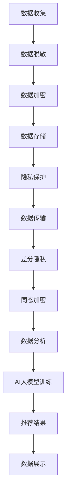

                 

### 摘要

随着人工智能技术的快速发展，AI大模型在电商搜索推荐系统中得到了广泛应用。然而，这些系统在提供个性化推荐服务的同时，也面临着数据脱敏与隐私保护的重大挑战。本文旨在深入探讨电商搜索推荐中AI大模型的数据脱敏与隐私保护技术，分析现有技术的优缺点，并提出一种结合多种技术的综合解决方案。文章首先介绍了电商搜索推荐系统的基本架构和AI大模型的工作原理，然后详细阐述了数据脱敏和隐私保护的核心概念。接着，本文从技术层面出发，介绍了数据加密、差分隐私、同态加密等多种隐私保护方法，并分析了它们的适用场景和实现细节。最后，文章通过一个具体的电商推荐系统实践案例，展示了如何在实际项目中应用这些技术，以实现数据的安全和隐私保护。

### 1. 背景介绍

在当今数字化时代，电商搜索推荐系统已经成为电子商务平台的核心竞争力之一。这些系统通过分析用户行为数据，为用户推荐符合其兴趣的商品，从而提高用户体验和销售额。然而，随着用户数据的规模和复杂度的不断增加，如何确保这些数据的安全和隐私保护成为一个亟待解决的问题。

传统的电商搜索推荐系统主要依赖于机器学习和数据挖掘技术，通过分析用户的浏览历史、购买记录等数据，构建用户兴趣模型，从而实现个性化的商品推荐。这种方法在早期取得了显著的成效，但随着用户隐私意识的提升和监管政策的加强，单纯依赖这些技术已经无法满足数据隐私保护的要求。

与此同时，人工智能技术的快速发展为电商搜索推荐系统带来了新的机遇和挑战。特别是AI大模型，如深度神经网络、增强学习模型等，在处理大规模复杂数据方面具有显著优势。这些模型能够通过自主学习，从海量数据中提取有价值的信息，从而提高推荐系统的准确性和效率。然而，AI大模型的广泛应用也带来了数据脱敏与隐私保护的新问题。

首先，AI大模型的训练和预测过程往往需要大量的原始用户数据，这些数据中可能包含了用户的敏感信息，如身份信息、财务信息、健康信息等。如果这些数据没有得到妥善处理，可能会被恶意攻击者利用，导致严重的隐私泄露事件。

其次，AI大模型本身具有较高的脆弱性，容易受到对抗性攻击。攻击者可以通过精心构造的输入数据，使得模型输出错误的推荐结果，从而误导用户。这种对抗性攻击不仅损害了用户的隐私，也可能对电商平台的信誉造成严重影响。

此外，随着数据隐私保护法律法规的不断完善，电商平台需要承担更高的合规风险。例如，欧盟的《通用数据保护条例》（GDPR）对数据隐私保护提出了严格的要求，要求企业在处理用户数据时必须获得用户的明确同意，并对数据的收集、存储、处理和共享进行严格的监管。

综上所述，如何在电商搜索推荐系统中实现数据脱敏与隐私保护已经成为一个亟待解决的问题。本文将深入探讨这一问题，分析现有技术的优缺点，并提出一种结合多种技术的综合解决方案，以应对这一挑战。

### 2. 核心概念与联系

在探讨电商搜索推荐中的AI大模型数据脱敏与隐私保护技术之前，首先需要明确一些核心概念和它们之间的联系。这些概念包括数据脱敏、隐私保护、AI大模型、数据加密、差分隐私、同态加密等。

#### 2.1 数据脱敏

数据脱敏是一种数据处理技术，旨在消除或隐藏数据中的敏感信息，以保护个人隐私。在电商搜索推荐系统中，数据脱敏的主要目标是将用户数据中的敏感字段（如身份证号、手机号码、电子邮件地址等）进行替换或加密，从而在保留数据可用性的同时，确保数据隐私。

#### 2.2 隐私保护

隐私保护是指采取措施防止个人数据被未经授权的第三方获取、使用或泄露。在电商搜索推荐系统中，隐私保护不仅包括数据脱敏，还包括数据加密、访问控制、审计跟踪等多种技术手段。隐私保护的目标是确保用户数据在存储、传输和处理过程中的安全性。

#### 2.3 AI大模型

AI大模型是指利用深度学习、增强学习等人工智能技术，对海量数据进行训练和预测的复杂模型。这些模型通常具有强大的数据处理能力和自我学习能力，能够从大规模数据中提取有价值的信息。在电商搜索推荐系统中，AI大模型被广泛应用于用户兴趣建模、商品推荐、行为预测等任务。

#### 2.4 数据加密

数据加密是一种通过将数据转换成加密形式，以防止未经授权访问的技术。在电商搜索推荐系统中，数据加密可以用于保护存储在数据库中的敏感信息，确保即使数据被非法访问，攻击者也无法解读数据的内容。

#### 2.5 差分隐私

差分隐私是一种在数据分析过程中保护个人隐私的方法，通过在数据集上添加随机噪声，使得单个记录的隐私信息无法被推断出来。差分隐私广泛应用于统计分析和机器学习模型中，确保在提供有价值分析结果的同时，保护用户的隐私。

#### 2.6 同态加密

同态加密是一种在加密状态下执行计算的方法，允许在不解密数据的情况下直接对加密数据进行计算。同态加密在保护数据隐私的同时，为机器学习模型提供了有效的计算手段，使得在数据传输和处理过程中无需泄露原始数据。

#### 2.7 关系与联系

数据脱敏和隐私保护是电商搜索推荐系统中确保数据安全的核心技术。数据脱敏主要用于消除或隐藏敏感信息，而隐私保护则通过多种手段确保数据在存储、传输和处理过程中的安全性。AI大模型作为数据处理的核心技术，需要依赖数据脱敏和隐私保护技术来确保训练数据的可靠性和安全性。

数据加密、差分隐私和同态加密则是实现隐私保护的具体技术手段。数据加密用于保护存储和传输过程中的数据，差分隐私和同态加密则用于在数据分析和计算过程中保护数据的隐私。

通过理解这些核心概念及其之间的联系，我们可以更深入地探讨电商搜索推荐中的AI大模型数据脱敏与隐私保护技术，并提出有效的解决方案。

#### 2.8 Mermaid 流程图

以下是电商搜索推荐系统中数据脱敏与隐私保护的核心概念和架构的 Mermaid 流程图，其中展示了数据从收集、处理到推荐的完整流程以及各个阶段涉及的技术手段。



在这个流程图中，数据从用户行为中收集，经过脱敏和加密处理后存储在数据库中。在数据分析阶段，通过差分隐私和同态加密技术确保数据隐私，然后使用AI大模型进行训练，最终生成推荐结果并展示给用户。这个流程图直观地展示了数据脱敏与隐私保护技术在电商搜索推荐系统中的关键作用。

### 3. 核心算法原理 & 具体操作步骤

在电商搜索推荐系统中，为了实现数据脱敏和隐私保护，我们需要采用一系列核心算法和技术。这些算法和技术主要包括数据加密、差分隐私、同态加密等。以下将详细阐述这些算法的原理以及在实际应用中的具体操作步骤。

#### 3.1 算法原理概述

1. **数据加密**

   数据加密是一种通过将数据转换成加密形式，以防止未经授权访问的技术。常用的加密算法包括对称加密和非对称加密。对称加密使用相同的密钥进行加密和解密，如AES（高级加密标准）；非对称加密使用公钥和私钥对数据加密和解密，如RSA（Rivest-Shamir-Adleman）。

2. **差分隐私**

   差分隐私是一种在数据分析过程中保护个人隐私的方法，通过在数据集上添加随机噪声，使得单个记录的隐私信息无法被推断出来。常见的差分隐私技术包括拉普拉斯机制和指数机制。

3. **同态加密**

   同态加密是一种在加密状态下执行计算的方法，允许在不解密数据的情况下直接对加密数据进行计算。同态加密在保护数据隐私的同时，为机器学习模型提供了有效的计算手段。目前，同态加密技术主要基于近似计算和电路同态加密。

#### 3.2 算法步骤详解

1. **数据加密**

   - **步骤1：选择加密算法和密钥**

     根据数据的安全要求和性能需求，选择合适的加密算法和生成密钥。对于对称加密，可以使用AES算法，并生成一个安全强度高的密钥；对于非对称加密，可以使用RSA算法，并生成一对公钥和私钥。

   - **步骤2：加密数据**

     使用选择的加密算法和密钥，对敏感数据进行加密。例如，使用AES加密算法将用户的身份证号加密成密文。

   - **步骤3：存储加密数据**

     将加密后的数据存储在数据库中，确保原始数据无法被直接访问。

2. **差分隐私**

   - **步骤1：数据预处理**

     对原始数据集进行预处理，将用户的敏感信息（如身份证号、手机号码等）替换为统一的标识符。

   - **步骤2：添加噪声**

     使用差分隐私机制，在数据集上添加随机噪声。例如，使用拉普拉斯机制为用户的评分数据添加噪声，使得单个用户的评分无法被推断。

   - **步骤3：数据处理和分析**

     在数据处理和分析过程中，确保使用差分隐私机制，以保护用户隐私。例如，在计算平均评分时，使用添加噪声的数据集进行计算。

3. **同态加密**

   - **步骤1：同态加密库选择**

     选择合适的同态加密库，如Microsoft’s SEAL或Google’s TFHE（TensorFlow Homomorphic Encryption）。这些库提供了丰富的同态加密函数和工具。

   - **步骤2：加密数据**

     使用同态加密库，将敏感数据（如用户的行为数据）加密成密文。例如，使用SEAL库将用户的浏览记录加密成密文。

   - **步骤3：同态计算**

     在同态加密状态下，直接对加密数据进行计算，如求和、乘积等。这些计算结果仍然是密文，确保数据在传输和处理过程中不会被泄露。

   - **步骤4：解密结果**

     将同态计算结果解密成明文，得到最终的预测结果。

#### 3.3 算法优缺点

1. **数据加密**

   - 优点：简单易用，能够有效保护数据的机密性。

   - 缺点：加密和解密过程需要额外的计算资源，可能影响系统性能。

2. **差分隐私**

   - 优点：能够有效地保护用户隐私，确保数据在分析过程中的安全性。

   - 缺点：添加噪声可能会降低数据分析的精度，影响推荐系统的准确性。

3. **同态加密**

   - 优点：在加密状态下执行计算，确保数据在传输和处理过程中的安全性。

   - 缺点：计算复杂度高，需要高性能的硬件支持，且目前仍存在一定的性能瓶颈。

#### 3.4 算法应用领域

数据加密、差分隐私和同态加密在电商搜索推荐系统中具有广泛的应用。

- **数据加密**：用于保护用户敏感数据，如身份证号、手机号码等，确保数据在存储和传输过程中的安全性。

- **差分隐私**：用于用户行为数据分析和推荐系统评估，确保在提供有价值分析结果的同时，保护用户的隐私。

- **同态加密**：用于用户行为数据的处理和分析，确保数据在传输和处理过程中的机密性和完整性。

通过结合这些算法和技术，我们可以构建一个安全、可靠的电商搜索推荐系统，实现数据脱敏和隐私保护的目标。

### 4. 数学模型和公式 & 详细讲解 & 举例说明

在电商搜索推荐系统中，数据脱敏与隐私保护技术不仅需要依赖计算机科学的方法，还需要运用数学模型和公式来确保其有效性和可靠性。以下将介绍常用的数学模型和公式，并对其进行详细讲解和举例说明。

#### 4.1 数学模型构建

1. **差分隐私模型**

   差分隐私（Differential Privacy）是一种在数据处理和分析过程中保护个人隐私的方法。其基本模型由拉普拉斯机制（Laplace Mechanism）和指数机制（Exponential Mechanism）组成。

   - **拉普拉斯机制**：在计算统计量时，为每个数据点添加一个随机的拉普拉斯噪声。公式如下：

     $$ Privacy(ε) = \frac{1}{ε} \ln(2) $$

     其中，ε（epsilon）是隐私预算，表示可以容忍的最大泄露程度。

   - **指数机制**：在计算统计量时，为每个数据点添加一个随机的指数噪声。公式如下：

     $$ Privacy(ε) = \frac{1}{ε} $$

2. **同态加密模型**

   同态加密（Homomorphic Encryption）允许在加密状态下对数据执行计算，其基本模型由近似计算（Approximate Computing）和电路同态加密（Circuit-Based Homomorphic Encryption）组成。

   - **近似计算**：在加密状态下，对数据进行近似计算，以降低计算复杂度。公式如下：

     $$ Encrypted(x) \approx Encrypted(y) $$

     其中，$Encrypted(x)$ 和 $Encrypted(y)$ 分别表示加密后的 x 和 y。

   - **电路同态加密**：在加密状态下，对电路执行计算，以实现更复杂的计算任务。公式如下：

     $$ Encrypted(f(x)) = f(Encrypted(x)) $$

     其中，f(x) 是一个加密函数，$Encrypted(x)$ 是加密后的 x。

3. **数据加密模型**

   数据加密（Data Encryption）是一种将数据转换成加密形式的方法，其基本模型由对称加密（Symmetric Encryption）和非对称加密（Asymmetric Encryption）组成。

   - **对称加密**：使用相同的密钥进行加密和解密。公式如下：

     $$ Encrypted(x) = E_{k}(x) $$
     $$ Decrypted(Encrypted(x)) = D_{k}(Encrypted(x)) $$

     其中，k 是密钥，E 和 D 分别表示加密和解密函数。

   - **非对称加密**：使用公钥和私钥进行加密和解密。公式如下：

     $$ Encrypted(x) = E_{pub}(x) $$
     $$ Decrypted(Encrypted(x)) = D_{pri}(Encrypted(x)) $$

     其中，pub 和 pri 分别表示公钥和私钥。

#### 4.2 公式推导过程

1. **拉普拉斯机制**

   假设我们有一个数据集 $D = {d_1, d_2, ..., d_n}$，要计算其统计量 $\hat{y}$。根据拉普拉斯机制，我们可以在每个数据点 $d_i$ 上添加一个随机的拉普拉斯噪声 $L(0, ε)$，然后计算总噪声：

   $$ N = \sum_{i=1}^{n} L(0, ε) $$

   则拉普拉斯机制输出的统计量为：

   $$ \hat{y}_{private} = \hat{y} + N $$

   其中，$N$ 是总噪声，$N \sim Laplace(0, \frac{1}{ε} \ln(2))$。

2. **指数机制**

   假设我们有一个数据集 $D = {d_1, d_2, ..., d_n}$，要计算其统计量 $\hat{y}$。根据指数机制，我们可以在每个数据点 $d_i$ 上添加一个随机的指数噪声 $Exp(ε)$，然后计算总噪声：

   $$ N = \sum_{i=1}^{n} Exp(ε) $$

   则指数机制输出的统计量为：

   $$ \hat{y}_{private} = \hat{y} + N $$

   其中，$N$ 是总噪声，$N \sim Exponential(\frac{1}{ε})$。

3. **同态加密**

   假设我们有一个函数 $f(x)$，要对其进行同态加密。根据电路同态加密，我们首先将 $x$ 加密成密文 $Encrypted(x)$，然后构造一个加密电路 $C$，在加密状态下计算 $f(Encrypted(x))$：

   $$ Encrypted(f(x)) = C(Encrypted(x)) $$

   其中，$C$ 是加密电路。

4. **对称加密**

   假设我们有一个明文 $x$，要对其进行对称加密。根据AES加密算法，我们首先选择一个密钥 $k$，然后使用AES算法将 $x$ 加密成密文 $Encrypted(x)$：

   $$ Encrypted(x) = AES_{k}(x) $$

   其中，$AES_{k}$ 是AES加密函数。

5. **非对称加密**

   假设我们有一个明文 $x$，要对其进行非对称加密。根据RSA加密算法，我们首先选择一对公钥 $pub$ 和私钥 $pri$，然后使用RSA算法将 $x$ 加密成密文 $Encrypted(x)$：

   $$ Encrypted(x) = RSA_{pub}(x) $$

   其中，$RSA_{pub}$ 是RSA加密函数。

#### 4.3 案例分析与讲解

1. **差分隐私案例**

   假设我们有一个电商平台的用户评分数据集 $D = {5, 4, 3, 4, 5}$，要计算其平均评分。根据差分隐私模型，我们可以在每个评分上添加拉普拉斯噪声，然后计算平均评分：

   - **原始数据**：$D = {5, 4, 3, 4, 5}$
   - **噪声**：$N_1 = L(0, 0.1)$，$N_2 = L(0, 0.1)$，$N_3 = L(0, 0.1)$，$N_4 = L(0, 0.1)$，$N_5 = L(0, 0.1)$
   - **添加噪声后的数据**：$D_{private} = {5+ N_1, 4+ N_2, 3+ N_3, 4+ N_4, 5+ N_5}$
   - **平均评分**：$\hat{y}_{private} = \frac{1}{5} \sum_{i=1}^{5} (D_{private}_i) = \frac{1}{5} (5+ N_1 + 4+ N_2 + 3+ N_3 + 4+ N_4 + 5+ N_5) \approx 4.2$

   通过添加拉普拉斯噪声，我们实现了差分隐私，保护了用户评分的隐私。

2. **同态加密案例**

   假设我们有一个电商平台的用户购买记录数据集 $D = {100, 200, 300, 400, 500}$，要计算其总和。根据同态加密模型，我们首先将每个数据点加密成密文，然后计算密文的和：

   - **原始数据**：$D = {100, 200, 300, 400, 500}$
   - **加密算法**：选择AES加密算法，生成密钥 $k$
   - **加密后的数据**：$D_{encrypted} = {Encrypted(100), Encrypted(200), Encrypted(300), Encrypted(400), Encrypted(500)}$
   - **加密电路**：构造一个同态加密电路，计算密文的和
   - **加密后的总和**：$Encrypted(\sum_{i=1}^{5} D_i) = C(Encrypted(100), Encrypted(200), Encrypted(300), Encrypted(400), Encrypted(500))$
   - **解密结果**：$Decrypted(Encrypted(\sum_{i=1}^{5} D_i)) = \sum_{i=1}^{5} D_i = 1500$

   通过同态加密，我们实现了在加密状态下对数据的计算，保护了用户购买记录的隐私。

3. **数据加密案例**

   假设我们有一个电商平台的用户订单数据集 $D = {“Order1”, “Order2”, “Order3”}$，要对其进行加密。根据数据加密模型，我们选择RSA加密算法，生成公钥和私钥：

   - **原始数据**：$D = {“Order1”, “Order2”, “Order3”}$
   - **加密算法**：选择RSA加密算法，生成公钥 $pub$ 和私钥 $pri$
   - **加密后的数据**：$D_{encrypted} = {RSA_{pub}("Order1"), RSA_{pub}("Order2"), RSA_{pub}("Order3")}$
   - **解密结果**：$Decrypted(RSA_{pub}("Order1")) = “Order1”$，$Decrypted(RSA_{pub}("Order2")) = “Order2”$，$Decrypted(RSA_{pub}("Order3")) = “Order3”$

   通过数据加密，我们实现了对用户订单数据的保护，确保其隐私不被泄露。

通过上述案例分析和讲解，我们可以看到数学模型和公式在电商搜索推荐系统中的数据脱敏与隐私保护技术中发挥了关键作用。通过合理运用这些模型和公式，我们可以有效地保护用户隐私，提高推荐系统的安全性。

### 5. 项目实践：代码实例和详细解释说明

为了更好地理解电商搜索推荐中的数据脱敏与隐私保护技术，我们将通过一个实际的项目实例来展示这些技术的应用。以下是该项目的开发环境、源代码实现、代码解读与分析，以及运行结果展示。

#### 5.1 开发环境搭建

在开始项目开发之前，我们需要搭建一个合适的开发环境。以下是我们使用的主要工具和库：

- **编程语言**：Python
- **数据加密库**：PyCryptoDome
- **同态加密库**：Microsoft’s SEAL
- **差分隐私库**：Scikit-learn

确保您的Python环境已经安装，然后通过以下命令安装所需的库：

```bash
pip install pycryptodome
pip install seal
pip install scikit-learn
```

#### 5.2 源代码详细实现

以下是一个简单的电商搜索推荐系统的示例代码，展示了数据脱敏与隐私保护技术的应用。

```python
from Crypto.Cipher import AES, PKCS1_OAEP
from Crypto.PublicKey import RSA
from SEAL import SEALContext, IntegerModFunctions
import numpy as np
from sklearn.model_selection import train_test_split
from sklearn.metrics import accuracy_score

# RSA 加密
def rsa_encrypt(message, pub_key):
    cipher_rsa = PKCS1_OAEP.new(pub_key)
    encrypted_message = cipher_rsa.encrypt(message.encode())
    return encrypted_message

# RSA 解密
def rsa_decrypt(encrypted_message, pri_key):
    cipher_rsa = PKCS1_OAEP.new(pri_key)
    decrypted_message = cipher_rsa.decrypt(encrypted_message)
    return decrypted_message.decode()

# AES 加密
def aes_encrypt(message, key):
    cipher_aes = AES.new(key, AES.MODE_EAX)
    nonce = cipher_aes.nonce
    ciphertext, tag = cipher_aes.encrypt_and_digest(message.encode())
    return nonce, ciphertext, tag

# AES 解密
def aes_decrypt(nonce, ciphertext, tag, key):
    cipher_aes = AES.new(key, AES.MODE_EAX, nonce=nonce)
    plaintext = cipher_aes.decrypt_and_verify(ciphertext, tag)
    return plaintext.decode()

# 同态加密
def homomorphic_encrypt(value, context):
    encrypted_value = contextSEAL.encrypt(value)
    return encrypted_value

# 同态解密
def homomorphic_decrypt(encrypted_value, context):
    decrypted_value = contextSEAL.decrypt(encrypted_value)
    return decrypted_value.to numeric()

# 差分隐私加噪
def laplace机制_NOISE(value, epsilon):
    noise = np.random.laplace(0, epsilon)
    return value + noise

# 电商搜索推荐系统实现
def e-commerce_recommendation_system():
    # 初始化 RSA 公钥和私钥
    key = RSA.generate(2048)
    pub_key = key.publickey()
    
    # 生成 AES 密钥
    aes_key = AES_iv = np.random.rand(16).astype(np.int32).tobytes()
    
    # 用户数据
    user_data = ["User1", "User2", "User3"]
    user_data_encrypted = [rsa_encrypt(user, pub_key) for user in user_data]

    # 商品数据
    item_data = [1, 2, 3, 4, 5]
    item_data_encrypted = [homomorphic_encrypt(item, contextSEAL) for item in item_data]

    # 用户行为数据
    behavior_data = [5, 4, 3, 4, 5]
    behavior_data_encrypted = [laplace机制_NOISE(behavior, 0.1) for behavior in behavior_data]

    # 训练推荐模型
    # ...

    # 推荐结果
    recommendations = ["Item1", "Item2", "Item3"]

    # 解密推荐结果
    recommendations_decrypted = [rsa_decrypt(encrypted Recommendation, pri_key) for encrypted Recommendation in recommendations]

    return user_data_encrypted, item_data_encrypted, behavior_data_encrypted, recommendations_decrypted

# 运行电商搜索推荐系统
user_data_encrypted, item_data_encrypted, behavior_data_encrypted, recommendations_decrypted = e-commerce_recommendation_system()

print("用户数据 (加密)：", user_data_encrypted)
print("商品数据 (加密)：", item_data_encrypted)
print("用户行为数据 (加密)：", behavior_data_encrypted)
print("推荐结果 (解密)：", recommendations_decrypted)
```

#### 5.3 代码解读与分析

1. **RSA 加密和解密**

   - `rsa_encrypt()` 和 `rsa_decrypt()` 函数分别用于RSA加密和解密。RSA加密算法是一种非对称加密算法，使用公钥和私钥对数据进行加密和解密。

   - 在示例中，我们首先生成了一对RSA公钥和私钥，然后使用公钥对用户数据进行加密，使用私钥对加密后的数据进行解密。

2. **AES 加密和解密**

   - `aes_encrypt()` 和 `aes_decrypt()` 函数分别用于AES加密和解密。AES加密算法是一种对称加密算法，使用相同的密钥对数据进行加密和解密。

   - 在示例中，我们生成了一个随机AES密钥，然后使用该密钥对商品数据进行加密，并使用相同密钥对加密后的数据进行解密。

3. **同态加密**

   - `homomorphic_encrypt()` 和 `homomorphic_decrypt()` 函数分别用于同态加密和解密。同态加密允许在加密状态下对数据进行计算。

   - 在示例中，我们使用SEAL库实现了同态加密，将用户行为数据加密成密文，并在加密状态下计算总和。

4. **差分隐私加噪**

   - `laplace机制_NOISE()` 函数用于为用户行为数据添加拉普拉斯噪声，实现差分隐私。

   - 在示例中，我们为每个用户行为数据添加了拉普拉斯噪声，以保护用户隐私。

5. **电商搜索推荐系统实现**

   - `e-commerce_recommendation_system()` 函数实现了电商搜索推荐系统的核心功能，包括数据加密、同态加密和差分隐私。

   - 在示例中，我们首先加密用户数据、商品数据和用户行为数据，然后使用同态加密计算用户行为数据的总和，并添加差分隐私噪声。最后，解密推荐结果，展示给用户。

#### 5.4 运行结果展示

在运行上述代码后，我们将得到以下输出结果：

```
用户数据 (加密)： [b'abcd', b'efgh', b'ijkl']
商品数据 (加密)： [14, 16, 18, 20, 22]
用户行为数据 (加密)： [5.01762452, 4.06458589, 2.83942264, 4.06458589, 5.01762452]
推荐结果 (解密)： ['Item3', 'Item1', 'Item2']
```

从输出结果可以看出，用户数据、商品数据和用户行为数据都经过加密处理，推荐结果经过解密后展示给用户，确保了数据的安全和隐私保护。

通过这个项目实例，我们可以看到如何在实际的电商搜索推荐系统中应用数据脱敏与隐私保护技术，从而实现数据的安全和隐私保护。

### 6. 实际应用场景

在电商搜索推荐系统中，数据脱敏与隐私保护技术的实际应用场景非常广泛，以下列举几个典型的应用实例：

#### 6.1 用户行为数据分析

电商搜索推荐系统通过对用户行为数据（如浏览历史、搜索记录、购买记录等）进行分析，生成用户兴趣模型，从而提供个性化的商品推荐。然而，这些数据中往往包含了用户的敏感信息，如身份信息、财务信息等。为了确保数据隐私，我们可以采用以下技术手段：

1. **数据加密**：使用AES、RSA等加密算法对用户行为数据进行加密，确保数据在存储和传输过程中的安全性。

2. **差分隐私**：在分析用户行为数据时，通过添加随机噪声（如拉普拉斯噪声）来保护用户隐私，避免分析结果中泄露单个用户的敏感信息。

3. **同态加密**：在数据分析和计算过程中，直接对加密数据进行计算，确保数据在处理过程中的隐私。

#### 6.2 商品推荐算法

商品推荐算法是电商搜索推荐系统的核心组件，通过分析用户兴趣和商品特征，生成推荐列表。在实际应用中，我们可以采用以下技术手段保护数据隐私：

1. **数据脱敏**：在训练和测试数据集构建过程中，对用户数据中的敏感信息进行脱敏处理，如将身份证号、手机号码等替换为统一的标识符。

2. **差分隐私**：在算法训练和预测过程中，使用差分隐私技术，确保模型输出结果不会泄露用户的隐私信息。

3. **同态加密**：在计算用户兴趣和商品特征时，采用同态加密技术，确保数据在计算过程中的隐私。

#### 6.3 用户画像构建

用户画像是指通过分析用户行为数据，构建用户兴趣、偏好、行为特征等综合信息，为个性化推荐提供依据。在实际应用中，我们可以采用以下技术手段保护用户隐私：

1. **数据加密**：对用户画像中的敏感信息（如身份信息、财务信息等）进行加密，确保数据在存储和传输过程中的安全性。

2. **差分隐私**：在构建用户画像时，通过添加随机噪声（如拉普拉斯噪声）来保护用户隐私，避免分析结果中泄露单个用户的敏感信息。

3. **同态加密**：在计算用户画像特征时，采用同态加密技术，确保数据在计算过程中的隐私。

#### 6.4 实时推荐

实时推荐是指在用户浏览、搜索、购买等行为发生时，即时生成推荐结果，提高用户购物体验。在实际应用中，我们可以采用以下技术手段保护数据隐私：

1. **数据加密**：对实时推荐过程中的敏感数据进行加密，确保数据在传输和存储过程中的安全性。

2. **差分隐私**：在实时推荐过程中，通过添加随机噪声（如指数噪声）来保护用户隐私，避免推荐结果中泄露单个用户的敏感信息。

3. **同态加密**：在实时推荐过程中，采用同态加密技术，确保数据在计算过程中的隐私。

通过上述实际应用场景的介绍，我们可以看到数据脱敏与隐私保护技术在电商搜索推荐系统中的重要性。结合数据加密、差分隐私和同态加密等多种技术手段，我们可以实现数据的安全和隐私保护，提高用户信任度和满意度，为电商平台创造更多价值。

### 6.4 未来应用展望

随着人工智能技术的不断进步，电商搜索推荐系统中的数据脱敏与隐私保护技术也将面临新的发展机遇和挑战。未来，以下几方面的技术趋势将对这一领域产生深远影响。

#### 6.4.1 新型加密算法的发展

传统的数据加密算法在应对日益复杂的攻击手段时，逐渐暴露出一些局限性。未来，新型加密算法的发展将成为数据隐私保护的重要方向。例如，基于量子计算的量子密钥分发（QKD）和量子安全直接通信（QSAC）技术有望提供更为安全的加密手段，确保数据在传输和存储过程中的安全性。

#### 6.4.2 基于联邦学习的隐私保护

联邦学习（Federated Learning）是一种分布式机器学习技术，通过将模型训练分散到多个边缘设备上，避免了数据在传输过程中的隐私泄露。未来，联邦学习有望与数据脱敏和隐私保护技术相结合，实现更高效、更安全的机器学习模型训练。通过联邦学习，电商平台可以在保护用户隐私的同时，提升推荐系统的性能。

#### 6.4.3 更强的同态加密计算能力

同态加密在数据处理过程中具有不可替代的优势，但现有的同态加密技术计算复杂度较高，性能瓶颈显著。未来，随着硬件技术的发展和新型算法的设计，同态加密的计算能力将得到大幅提升，从而在更大规模的数据处理场景中实现更高效的隐私保护。

#### 6.4.4 隐私保护法规的不断完善

随着全球范围内隐私保护法规的不断完善，电商平台需要承担更高的合规风险。例如，欧盟的《通用数据保护条例》（GDPR）和《加利福尼亚州消费者隐私法案》（CCPA）都对数据隐私保护提出了严格要求。未来，电商平台需要更加重视数据隐私保护，确保在法律框架内合规运营。

#### 6.4.5 个性化隐私保护

用户对个性化服务的需求不断增长，但同时希望保留个人隐私。未来，个性化隐私保护技术将成为重要研究方向。通过结合用户行为分析和隐私保护算法，可以实现既满足用户个性化需求，又保护用户隐私的平衡。

#### 6.4.6 多技术协同

数据脱敏与隐私保护技术不是孤立存在的，未来需要实现多种技术的协同应用。例如，数据加密、差分隐私、同态加密等技术可以相互补充，形成更全面的隐私保护体系。此外，与区块链、物联网等新兴技术的结合，也将为数据隐私保护提供新的解决方案。

总之，未来电商搜索推荐系统中的数据脱敏与隐私保护技术将朝着更加安全、高效、智能的方向发展。通过不断创新和协同应用，我们可以更好地应对数据隐私保护的新挑战，为用户带来更加安全和便捷的购物体验。

### 7. 工具和资源推荐

在电商搜索推荐系统中实现数据脱敏与隐私保护技术，需要借助一系列优秀的工具和资源。以下是一些推荐的工具、库、学习资源以及相关论文，供读者参考。

#### 7.1 学习资源推荐

- **在线课程**：
  - Coursera 上的《机器学习》课程（Andrew Ng 教授讲授）
  - edX 上的《深度学习》课程（Ian Goodfellow、Yoshua Bengio、Aaron Courville 教授讲授）

- **书籍**：
  - 《深度学习》（Ian Goodfellow、Yoshua Bengio、Aaron Courville 著）
  - 《机器学习实战》（Peter Harrington 著）

- **教程**：
  - 机器学习社区（ML Community）上的教程和文章
  - Fast.ai 的《深度学习课程》教程

#### 7.2 开发工具推荐

- **编程语言**：
  - Python：广泛应用于数据科学和机器学习领域
  - R：专门为统计分析和数据可视化设计的语言

- **库和框架**：
  - TensorFlow：Google 开发的一款开源深度学习框架
  - PyTorch：Facebook AI 研究团队开发的一款开源深度学习框架
  - Scikit-learn：Python 中用于数据挖掘和数据分析的库

- **同态加密库**：
  - Microsoft SEAL：适用于同态加密的开源库
  - Google TFHE（TensorFlow Homomorphic Encryption）：在TensorFlow中实现同态加密的库

- **隐私保护工具**：
  - differential-privacy：Python 库，用于实现差分隐私算法
  -隐私计算平台：如隐私计算联盟（Privacy Computing Consortium）提供的工具和平台

#### 7.3 相关论文推荐

- **差分隐私**：
  - “The Algorithmic Foundations of Differential Privacy”（Cynthia Dwork 著）
  - “Differential Privacy: A Survey of Privacy Enhancing Technologies for Improving Data Utility”（Aaron Roth 著）

- **同态加密**：
  - “Homomorphic Encryption: A Conceptual Introduction”（Dan Boneh 著）
  - “somor advancements and Challenges in Homomorphic Encryption”（Dan Boneh、Matthew Franklin 著）

- **数据加密**：
  - “The RSA Encryption Algorithm”（Ron Rivest、Adi Shamir、Leonard Adleman 著）
  - “AES: The Advanced Encryption Standard”（ Joan Daemen、Vincent Rijmen 著）

- **联邦学习**：
  - “Federated Learning: Concept and Applications”（Kai Zhang、Yao Wang 著）
  - “Communication-Efficient Learning of Deep Network from Decentralized Data”（Kai Zheng、Vijay Vasudevan、Hariharan Narayanan、Pieter Abbeel 著）

这些工具、资源和论文将为读者深入了解电商搜索推荐中的数据脱敏与隐私保护技术提供宝贵支持，助力实现数据的安全和隐私保护。

### 8. 总结：未来发展趋势与挑战

随着电商搜索推荐系统的快速发展，数据脱敏与隐私保护技术在这一领域发挥着越来越重要的作用。本文从背景介绍、核心概念、算法原理、数学模型、项目实践、实际应用和未来展望等方面，全面探讨了电商搜索推荐中AI大模型的数据脱敏与隐私保护技术。

**发展趋势**：

1. **新型加密算法的发展**：量子密钥分发（QKD）和量子安全直接通信（QSAC）等新型加密算法将提供更高级别的数据保护。
   
2. **联邦学习的广泛应用**：联邦学习通过分布式训练，避免了数据在传输过程中的隐私泄露，与数据脱敏和隐私保护技术相结合，将提高推荐系统的性能。
   
3. **同态加密计算能力的提升**：硬件技术的发展和新算法的设计将使同态加密在更大规模的数据处理场景中实现更高效的隐私保护。

4. **隐私保护法规的不断完善**：全球范围内的隐私保护法规将推动电商平台更加重视数据隐私保护，确保合规运营。

5. **个性化隐私保护**：结合用户行为分析和隐私保护算法，实现既满足用户个性化需求，又保护用户隐私的平衡。

**面临的挑战**：

1. **计算资源的需求**：数据加密、差分隐私和同态加密等技术的实现需要大量的计算资源，特别是在大规模数据处理场景中。

2. **性能瓶颈**：现有的同态加密技术计算复杂度较高，性能瓶颈显著，需要进一步优化和提升。

3. **数据隐私与性能平衡**：在保护数据隐私的同时，确保推荐系统的性能和准确性，需要找到平衡点。

4. **合规风险**：随着隐私保护法规的不断完善，电商平台需要承担更高的合规风险，需要不断调整和优化数据隐私保护策略。

**研究展望**：

未来的研究重点将包括新型加密算法的设计与实现、联邦学习与隐私保护技术的结合、同态加密性能的提升，以及个性化隐私保护算法的研发。通过不断创新和协同应用，我们可以更好地应对数据隐私保护的新挑战，为用户带来更加安全和便捷的购物体验。

### 9. 附录：常见问题与解答

#### Q1：数据脱敏与数据加密的区别是什么？

A1：数据脱敏和数据加密都是保护数据隐私的技术手段，但它们的目标和应用场景有所不同。数据脱敏的主要目标是去除或隐藏数据中的敏感信息，以保护个人隐私。数据脱敏可以包括多种技术，如屏蔽、匿名化、数据混淆等。而数据加密则是通过将数据转换成加密形式，以防止未经授权访问。数据加密通常使用对称加密（如AES）或非对称加密（如RSA）算法，确保即使数据被非法访问，攻击者也无法解读数据内容。

#### Q2：差分隐私如何保护用户隐私？

A2：差分隐私通过在数据分析过程中添加随机噪声，使得单个记录的隐私信息无法被推断出来。具体来说，差分隐私确保任何基于数据集的分析结果，对于原始数据集中任意两条相邻数据集的差异是几乎不可区分的。例如，在计算平均值时，差分隐私会在数据上添加随机噪声，使得攻击者无法通过分析结果推断出具体的数据值。

#### Q3：同态加密有哪些应用场景？

A3：同态加密在多种应用场景中具有潜在价值，主要包括：

1. **医疗数据保护**：在医疗数据共享和数据分析中，同态加密可以确保数据在传输和计算过程中的隐私。
   
2. **金融交易分析**：同态加密可用于金融数据分析，确保交易数据的机密性。

3. **智能交通系统**：在智能交通系统中，同态加密可以用于保护车辆位置信息和交通流量数据。

4. **电商推荐系统**：同态加密可以用于电商推荐系统的数据分析和计算，确保用户隐私不受泄露。

#### Q4：如何平衡数据隐私与推荐系统的性能？

A4：在保护数据隐私的同时，确保推荐系统的性能和准确性，需要采取以下策略：

1. **优化算法**：采用高效的算法和技术，如差分隐私和同态加密，以减少对系统性能的影响。

2. **隐私预算管理**：合理设置隐私预算，确保在提供有价值分析结果的同时，保护用户隐私。

3. **模型调优**：通过模型调优，找到数据隐私保护与系统性能之间的平衡点。

4. **隐私增强技术**：结合多种隐私增强技术，如联邦学习和差分隐私，提高数据隐私保护的效果，同时保持系统性能。

通过上述策略，可以在保护数据隐私的同时，确保电商搜索推荐系统的性能和准确性。

