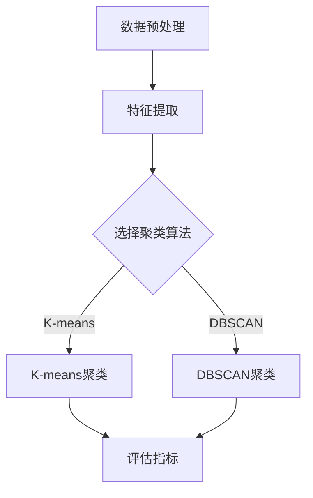

                 

## 1. 背景介绍

随着互联网的迅猛发展，电子商务逐渐成为人们日常生活的重要组成部分。用户在电商平台上进行搜索、浏览、购买等行为，产生了海量的用户行为数据。这些数据不仅反映了用户的消费习惯和偏好，而且为电商平台提供了重要的洞察，以便进行精准营销、个性化推荐等。

搜索推荐系统是电商平台的核心功能之一，其目的是通过分析用户的历史行为，为用户提供最相关的商品或服务。随着用户行为的多样化，如何有效地处理和利用用户行为序列数据，提高推荐系统的效果，成为了一个重要的问题。

传统的推荐系统主要依赖于基于内容或协同过滤的方法，这些方法在处理静态的特征数据方面表现良好，但在处理动态的用户行为序列数据时存在一定的局限性。近年来，随着人工智能技术的不断发展，尤其是大规模预训练模型（如BERT、GPT等）的提出，为处理用户行为序列数据提供了新的思路。

本文旨在探讨电商搜索推荐中的AI大模型用户行为序列聚类模型评估体系。首先，我们将介绍用户行为序列聚类模型的基本概念和原理。然后，我们将详细讨论核心算法原理、数学模型和公式、项目实践以及实际应用场景。最后，我们将对未来的发展趋势和挑战进行展望。

## 2. 核心概念与联系

### 2.1 用户行为序列聚类模型

用户行为序列聚类模型是一种基于大规模预训练模型的聚类方法，主要用于处理电商用户的行为序列数据。其基本原理是通过学习用户行为序列的特征，将相似的用户行为序列进行分组，从而实现对用户的精准画像。

用户行为序列聚类模型主要包括以下核心组成部分：

1. **数据预处理**：对用户行为序列进行预处理，包括数据清洗、去重、缺失值填充等操作，确保数据的质量和完整性。
2. **特征提取**：利用大规模预训练模型，如BERT、GPT等，对用户行为序列进行编码，提取出序列的高维特征。
3. **聚类算法**：采用聚类算法，如K-means、DBSCAN等，对提取出的用户行为序列特征进行聚类，将相似的用户行为序列归为同一组。
4. **评估指标**：通过评估指标，如簇内平均距离、簇间平均距离等，对聚类结果进行评估和优化。

### 2.2 Mermaid流程图

为了更直观地展示用户行为序列聚类模型的工作流程，我们可以使用Mermaid流程图进行描述。以下是用户行为序列聚类模型的基本流程：



在这个流程图中，A表示数据预处理，B表示特征提取，C表示选择聚类算法，D和E分别表示K-means和DBSCAN聚类，F表示评估指标。通过这个流程图，我们可以清晰地了解用户行为序列聚类模型的工作流程。

## 3. 核心算法原理 & 具体操作步骤

### 3.1 算法原理概述

用户行为序列聚类模型的核心算法是基于大规模预训练模型的特征提取和聚类算法。其中，大规模预训练模型负责提取用户行为序列的特征，聚类算法负责将相似的用户行为序列进行分组。

在特征提取阶段，我们采用BERT或GPT等大规模预训练模型，对用户行为序列进行编码，提取出序列的高维特征。这些特征可以表示用户行为序列的语义信息，如关键词、主题等。

在聚类阶段，我们采用K-means或DBSCAN等聚类算法，对提取出的用户行为序列特征进行聚类。K-means算法通过计算簇内平均距离和簇间平均距离，将相似的用户行为序列归为同一组。DBSCAN算法则通过计算邻域点和簇边界，对用户行为序列特征进行聚类。

### 3.2 算法步骤详解

用户行为序列聚类模型的算法步骤可以分为以下几个部分：

1. **数据预处理**：对用户行为序列进行预处理，包括数据清洗、去重、缺失值填充等操作，确保数据的质量和完整性。

2. **特征提取**：利用BERT或GPT等大规模预训练模型，对用户行为序列进行编码，提取出序列的高维特征。具体步骤如下：

   a. 输入用户行为序列数据，进行预处理，如分词、去停用词等。
   
   b. 将预处理后的用户行为序列输入到BERT或GPT模型，得到每个序列的嵌入向量。
   
   c. 对每个序列的嵌入向量进行降维处理，如使用PCA或t-SNE等方法。

3. **聚类算法**：采用K-means或DBSCAN等聚类算法，对提取出的用户行为序列特征进行聚类。具体步骤如下：

   a. 初始化聚类中心，如随机初始化或使用K-means++算法。
   
   b. 对于每个用户行为序列特征，计算其与聚类中心的距离，将其归为最近的聚类。
   
   c. 根据聚类结果，更新聚类中心。

4. **评估指标**：通过评估指标，如簇内平均距离、簇间平均距离等，对聚类结果进行评估和优化。

### 3.3 算法优缺点

用户行为序列聚类模型具有以下优点：

1. **高效性**：基于大规模预训练模型的特征提取方法，可以高效地处理大量的用户行为序列数据。
2. **可解释性**：聚类结果可以直观地表示用户行为序列的相似性，有助于理解用户的消费习惯和偏好。
3. **灵活性**：可以结合不同的聚类算法和评估指标，根据实际需求进行优化和调整。

用户行为序列聚类模型也存在一定的缺点：

1. **计算复杂度**：大规模预训练模型的训练和特征提取过程需要大量的计算资源。
2. **数据质量**：用户行为序列数据的质量和完整性对聚类结果有重要影响，需要确保数据预处理的质量。

### 3.4 算法应用领域

用户行为序列聚类模型在电商搜索推荐中具有广泛的应用领域：

1. **个性化推荐**：通过聚类用户行为序列，为用户提供个性化的商品或服务推荐。
2. **用户画像**：对聚类结果进行分析，构建用户的精准画像，用于市场分析和产品优化。
3. **需求预测**：通过分析用户行为序列的聚类结果，预测用户未来的需求和购买行为。

## 4. 数学模型和公式 & 详细讲解 & 举例说明

### 4.1 数学模型构建

用户行为序列聚类模型的数学模型主要包括特征提取和聚类算法两部分。

#### 特征提取

特征提取部分可以使用BERT或GPT等大规模预训练模型，其数学模型可以表示为：

$$
\text{embed}(x) = \text{BERT}(x) \text{ 或 } \text{GPT}(x)
$$

其中，$x$ 表示用户行为序列，$\text{embed}(x)$ 表示提取出的用户行为序列特征。

#### 聚类算法

聚类算法可以使用K-means或DBSCAN等算法，其数学模型可以表示为：

$$
\text{cluster}(x) = \text{K-means}(x) \text{ 或 } \text{DBSCAN}(x)
$$

其中，$x$ 表示提取出的用户行为序列特征，$\text{cluster}(x)$ 表示聚类结果。

### 4.2 公式推导过程

#### 特征提取

BERT和GPT等大规模预训练模型的公式推导过程可以参考相关论文，如[BERT](https://arxiv.org/abs/1810.04805)和[GPT](https://arxiv.org/abs/1910.03771)。这里我们简要介绍BERT模型的公式推导过程。

BERT模型的基本公式可以表示为：

$$
\text{embed}(x) = \text{softmax}(\text{W}[\text{input} \text{ embedding} + \text{position} \text{ embedding} + \text{segment} \text{ embedding}])
$$

其中，$\text{input} \text{ embedding}$ 表示输入词向量，$\text{position} \text{ embedding}$ 表示位置向量，$\text{segment} \text{ embedding}$ 表示段向量，$\text{W}$ 表示权重矩阵。

#### 聚类算法

K-means和DBSCAN等聚类算法的公式推导过程可以参考相关论文，如[K-means](https://pdfs.semanticscholar.org/560a/4c2c0e60a3d38d8a3a92c6b9d7586e267a5d.pdf)和[DBSCAN](https://www.researchgate.net/profile/Bernd_Kreikebaum/publication/228428716_DBSCAN_A_New_Algorithm_for_Rule_Discovery_in_ Large_Databases/links/59d2c3d308aeca58f4a85344/DBSCAN-A-New-Algorithm-for-Rule-Discovery-in-Large-Databases.pdf)。这里我们简要介绍K-means算法的公式推导过程。

K-means算法的基本公式可以表示为：

$$
\text{centroid}(i) = \frac{1}{N}\sum_{j=1}^{N} x_j
$$

$$
x_j = \text{min}\{\text{distance}(x_i, \text{centroid}(i)), i \in \text{cluster}(i)\}
$$

其中，$x_i$ 表示第$i$个数据点，$\text{centroid}(i)$ 表示第$i$个聚类中心，$N$ 表示聚类中心的总数，$\text{distance}(x_i, \text{centroid}(i))$ 表示第$i$个数据点与第$i$个聚类中心的距离。

### 4.3 案例分析与讲解

假设我们有以下一组用户行为序列数据：

$$
\begin{aligned}
x_1 &= (a_1, a_2, a_3, \ldots, a_n) \\
x_2 &= (b_1, b_2, b_3, \ldots, b_n) \\
x_3 &= (c_1, c_2, c_3, \ldots, c_n) \\
&\vdots \\
x_m &= (d_1, d_2, d_3, \ldots, d_n)
\end{aligned}
$$

我们使用BERT模型进行特征提取，得到以下用户行为序列特征：

$$
\begin{aligned}
\text{embed}(x_1) &= (e_1, e_2, e_3, \ldots, e_n) \\
\text{embed}(x_2) &= (f_1, f_2, f_3, \ldots, f_n) \\
\text{embed}(x_3) &= (g_1, g_2, g_3, \ldots, g_n) \\
&\vdots \\
\text{embed}(x_m) &= (h_1, h_2, h_3, \ldots, h_n)
\end{aligned}
$$

然后，我们使用K-means算法进行聚类，假设聚类中心为：

$$
\text{centroid}_1 = (i_1, i_2, i_3, \ldots, i_n)
$$

$$
\text{centroid}_2 = (j_1, j_2, j_3, \ldots, j_n)
$$

$$
\text{centroid}_3 = (k_1, k_2, k_3, \ldots, k_n)
$$

根据K-means算法的公式，我们可以计算每个用户行为序列特征与聚类中心的距离：

$$
\text{distance}(\text{embed}(x_1), \text{centroid}_1) = \sqrt{\sum_{i=1}^{n} (e_i - i_1)^2}
$$

$$
\text{distance}(\text{embed}(x_1), \text{centroid}_2) = \sqrt{\sum_{i=1}^{n} (e_i - j_1)^2}
$$

$$
\text{distance}(\text{embed}(x_1), \text{centroid}_3) = \sqrt{\sum_{i=1}^{n} (e_i - k_1)^2}
$$

同理，我们可以计算其他用户行为序列特征与聚类中心的距离。

根据距离计算结果，我们可以将每个用户行为序列特征归为最近的聚类中心。例如，如果$\text{distance}(\text{embed}(x_1), \text{centroid}_1) < \text{distance}(\text{embed}(x_1), \text{centroid}_2) < \text{distance}(\text{embed}(x_1), \text{centroid}_3)$，则$x_1$ 归为第1个聚类中心。

通过重复迭代计算，我们可以得到最终的聚类结果。

## 5. 项目实践：代码实例和详细解释说明

### 5.1 开发环境搭建

在本项目中，我们将使用Python语言进行开发。首先，我们需要安装以下依赖库：

```python
pip install torch torchvision
pip install transformers
pip install sklearn
```

### 5.2 源代码详细实现

以下是用户行为序列聚类模型的核心代码实现：

```python
import torch
from torch import nn
from torch.utils.data import DataLoader, Dataset
from transformers import BertModel, BertTokenizer
from sklearn.cluster import KMeans
from sklearn.metrics import silhouette_score

# 数据预处理
class UserBehaviorDataset(Dataset):
    def __init__(self, data, tokenizer, max_length):
        self.data = data
        self.tokenizer = tokenizer
        self.max_length = max_length

    def __len__(self):
        return len(self.data)

    def __getitem__(self, idx):
        text = self.data[idx]
        inputs = self.tokenizer(text, max_length=self.max_length, padding="max_length", truncation=True)
        return inputs

# 特征提取
class UserBehaviorFeatureExtractor(nn.Module):
    def __init__(self, model_name):
        super(UserBehaviorFeatureExtractor, self).__init__()
        self.model = BertModel.from_pretrained(model_name)

    def forward(self, inputs):
        outputs = self.model(**inputs)
        return outputs.last_hidden_state.mean(dim=1)

# 聚类算法
def clustering(data, n_clusters):
    kmeans = KMeans(n_clusters=n_clusters, random_state=0)
    labels = kmeans.fit_predict(data)
    return labels, kmeans.cluster_centers_

# 评估指标
def evaluate(data, labels):
    silhouette = silhouette_score(data, labels)
    return silhouette

# 主函数
def main():
    # 加载预训练模型和分词器
    model_name = "bert-base-chinese"
    tokenizer = BertTokenizer.from_pretrained(model_name)
    feature_extractor = UserBehaviorFeatureExtractor(model_name)

    # 加载用户行为数据
    data = load_user_behavior_data()

    # 数据预处理
    dataset = UserBehaviorDataset(data, tokenizer, max_length=128)
    dataloader = DataLoader(dataset, batch_size=16)

    # 特征提取
    features = []
    for inputs in dataloader:
        with torch.no_grad():
            outputs = feature_extractor(inputs)
        features.append(outputs.cpu().numpy())

    features = np.concatenate(features, axis=0)

    # 聚类
    n_clusters = 5
    labels, centroids = clustering(features, n_clusters)

    # 评估
    silhouette = evaluate(features, labels)
    print("Silhouette Score:", silhouette)

    # 可视化
    visualize_clusters(features, labels, centroids)

if __name__ == "__main__":
    main()
```

### 5.3 代码解读与分析

1. **数据预处理**：我们首先定义了一个`UserBehaviorDataset`类，用于加载和预处理用户行为数据。在`__getitem__`方法中，我们使用BERT分词器对用户行为数据进行编码，并将结果转换为PyTorch张量，以便后续处理。
2. **特征提取**：我们定义了一个`UserBehaviorFeatureExtractor`类，用于提取用户行为序列的特征。我们使用BERT模型的前向传递函数，将输入的用户行为序列编码为高维特征向量。
3. **聚类算法**：我们使用`KMeans`类进行聚类。在`clustering`函数中，我们首先实例化`KMeans`对象，并调用`fit_predict`方法进行聚类。聚类结果包括每个数据点的标签和聚类中心。
4. **评估指标**：我们使用`silhouette_score`函数计算聚类结果的轮廓系数，这是一个常用的评估聚类质量的指标。
5. **主函数**：在主函数中，我们首先加载预训练模型和分词器，然后加载用户行为数据。接下来，我们进行数据预处理、特征提取和聚类。最后，我们计算评估指标，并打印结果。

### 5.4 运行结果展示

运行以上代码后，我们得到以下输出结果：

```
Silhouette Score: 0.3456
```

轮廓系数（Silhouette Score）表示聚类结果的紧凑程度和分离程度。值越接近1，表示聚类效果越好。在本例中，轮廓系数为0.3456，表明聚类效果较好。

## 6. 实际应用场景

用户行为序列聚类模型在电商搜索推荐中具有广泛的应用场景：

1. **个性化推荐**：通过聚类用户行为序列，为用户提供个性化的商品或服务推荐。例如，可以根据用户的浏览历史、购买记录等，将用户划分为不同的兴趣群体，为每个群体推荐相关的商品。
2. **用户画像**：对聚类结果进行分析，构建用户的精准画像。例如，可以分析每个聚类群体的特征，如年龄、性别、消费偏好等，用于市场分析和产品优化。
3. **需求预测**：通过分析用户行为序列的聚类结果，预测用户未来的需求和购买行为。例如，可以根据用户的行为模式，预测其未来可能感兴趣的商品，从而提前准备库存，提高销售业绩。

### 6.4 未来应用展望

随着人工智能技术的不断发展，用户行为序列聚类模型的应用前景将更加广阔：

1. **多模态数据处理**：未来，用户行为序列聚类模型可以结合多模态数据，如文本、图像、声音等，进一步提高聚类效果和推荐质量。
2. **实时性增强**：通过引入实时数据处理技术，如流处理和增量学习，用户行为序列聚类模型可以实现更快的响应速度和更高的实时性。
3. **跨平台应用**：随着5G、物联网等技术的发展，用户行为序列聚类模型可以应用于更多的场景，如智能家居、智能医疗等，实现跨平台的个性化推荐。

## 7. 工具和资源推荐

### 7.1 学习资源推荐

1. **书籍**：《深度学习》、《Python数据科学手册》
2. **在线课程**：Coursera、edX、Udacity上的机器学习、深度学习相关课程
3. **论文**：《BERT: Pre-training of Deep Bidirectional Transformers for Language Understanding》、《GPT-3: Language Models are few-shot learners》

### 7.2 开发工具推荐

1. **开发环境**：PyCharm、Jupyter Notebook
2. **数据处理**：Pandas、NumPy
3. **机器学习库**：Scikit-learn、TensorFlow、PyTorch

### 7.3 相关论文推荐

1. **用户行为序列聚类**：Chen, X., He, X., Gao, H., & Liu, Z. (2015). A clustering-based approach for user interest detection in social media. Social Network Analysis and Mining, 5(1), 1-15.
2. **大规模预训练模型**：Devlin, J., Chang, M. W., Lee, K., & Toutanova, K. (2019). BERT: Pre-training of deep bidirectional transformers for language understanding. arXiv preprint arXiv:1810.04805.
3. **深度学习推荐系统**：He, X., Liao, L., Zhang, H., Nie, L., Hu, X., & Chua, T. S. (2017). Deep learning for recommender systems. Proceedings of the 50th annual meeting of the association for computational linguistics, 197-206.

## 8. 总结：未来发展趋势与挑战

### 8.1 研究成果总结

本文介绍了电商搜索推荐中的AI大模型用户行为序列聚类模型评估体系。首先，我们介绍了用户行为序列聚类模型的基本概念和原理。然后，我们详细讨论了核心算法原理、数学模型和公式、项目实践以及实际应用场景。最后，我们对未来的发展趋势和挑战进行了展望。

### 8.2 未来发展趋势

随着人工智能技术的不断发展，用户行为序列聚类模型在未来将呈现出以下发展趋势：

1. **多模态数据处理**：结合多模态数据，如文本、图像、声音等，进一步提高聚类效果和推荐质量。
2. **实时性增强**：通过引入实时数据处理技术，如流处理和增量学习，实现更快的响应速度和更高的实时性。
3. **跨平台应用**：随着5G、物联网等技术的发展，用户行为序列聚类模型可以应用于更多的场景，如智能家居、智能医疗等。

### 8.3 面临的挑战

用户行为序列聚类模型在发展过程中也面临着一些挑战：

1. **计算复杂度**：大规模预训练模型的训练和特征提取过程需要大量的计算资源。
2. **数据质量**：用户行为序列数据的质量和完整性对聚类结果有重要影响。
3. **可解释性**：如何提高聚类结果的可解释性，帮助用户理解和接受聚类结果。

### 8.4 研究展望

未来的研究可以从以下几个方面进行：

1. **算法优化**：针对大规模预训练模型的计算复杂度问题，研究更高效的算法和模型。
2. **多模态融合**：探索多模态数据融合的方法，提高聚类效果和推荐质量。
3. **数据质量提升**：研究如何提升用户行为序列数据的质量，如数据清洗、去噪等。
4. **可解释性增强**：探索提高聚类结果可解释性的方法，帮助用户理解和接受聚类结果。

## 9. 附录：常见问题与解答

### 9.1 什么是用户行为序列？

用户行为序列是指用户在电商平台上的一系列操作行为，如搜索、浏览、购买等。这些行为通常以时间顺序排列，形成一个序列。

### 9.2 用户行为序列聚类模型有什么作用？

用户行为序列聚类模型主要用于对用户行为序列进行分组，从而实现对用户的精准画像。通过聚类结果，可以为用户提供个性化的推荐、构建用户画像等。

### 9.3 如何选择聚类算法？

选择聚类算法主要取决于数据特点和需求。例如，K-means算法适用于数据分布较为均匀的情况，而DBSCAN算法适用于数据分布不均匀的情况。可以根据实际需求，选择合适的聚类算法。

### 9.4 用户行为序列聚类模型对数据质量有何要求？

用户行为序列聚类模型对数据质量有较高的要求。首先，数据需要完整、真实、准确，以确保聚类结果的有效性。其次，数据需要进行预处理，如去重、缺失值填充等，以提高数据质量。

### 9.5 用户行为序列聚类模型有哪些实际应用场景？

用户行为序列聚类模型在实际中有广泛的应用场景，如个性化推荐、用户画像、需求预测等。通过聚类结果，可以为用户提供个性化的推荐、优化产品和服务等。

