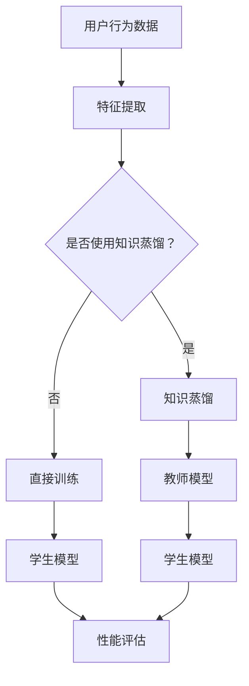

                 

关键词：电商搜索推荐、AI大模型、知识蒸馏、搜索算法、推荐系统

> 摘要：本文探讨了电商搜索推荐系统中的AI大模型知识蒸馏技术应用，详细阐述了知识蒸馏的基本概念、算法原理、数学模型及其在电商搜索推荐中的应用场景。通过案例分析，展示了知识蒸馏技术在提升搜索推荐效果和降低模型复杂度方面的优势，并对未来发展趋势与挑战进行了展望。

## 1. 背景介绍

在当今数字化时代，电商搜索推荐系统已经成为电商平台的重要组成部分，极大地提升了用户的购物体验和平台的业务收益。然而，随着用户数据的爆炸性增长和业务需求的不断变化，传统的搜索推荐算法逐渐难以满足高效、准确的需求。为了应对这一挑战，人工智能（AI）技术被广泛应用于电商搜索推荐系统中。

AI大模型作为一种先进的AI技术，具有强大的特征提取和数据挖掘能力，可以显著提升搜索推荐系统的性能。然而，AI大模型通常具有很高的复杂度，导致训练成本高昂、计算资源消耗巨大，这在一定程度上限制了其大规模应用。知识蒸馏技术作为一种优化方法，旨在通过将大模型的复杂知识迁移到较小模型中，实现高效、准确的知识传递，从而在降低模型复杂度的同时保持性能。

本文旨在探讨电商搜索推荐中的AI大模型知识蒸馏技术应用，从基本概念、算法原理、数学模型到具体应用，全面分析知识蒸馏技术在电商搜索推荐系统中的优势和应用前景。

## 2. 核心概念与联系

### 2.1 知识蒸馏的概念

知识蒸馏（Knowledge Distillation）是一种将复杂模型（教师模型）的知识迁移到较简单模型（学生模型）的优化方法。其核心思想是将教师模型的输出作为额外的监督信号，指导学生模型的学习过程，从而提高学生模型的性能。

### 2.2 电商搜索推荐系统

电商搜索推荐系统是一种基于用户行为数据和商品属性信息的智能搜索和推荐系统。其主要目标是通过分析用户历史行为和偏好，为用户推荐与其兴趣相关的商品，提高用户的购物体验和平台的业务收益。

### 2.3 知识蒸馏与电商搜索推荐系统的关系

知识蒸馏技术可以通过将AI大模型的知识迁移到较小模型中，提高搜索推荐系统的性能和效率。具体来说，知识蒸馏技术在电商搜索推荐系统中的应用主要体现在以下几个方面：

1. **特征提取**：知识蒸馏可以将大模型的深层特征提取能力迁移到小模型中，从而提升小模型对用户行为和商品属性的理解能力。

2. **模型压缩**：通过知识蒸馏，可以将大模型的复杂结构简化为小模型，降低模型的计算资源和存储需求，提高系统的部署效率。

3. **性能优化**：知识蒸馏可以结合教师模型的输出作为额外监督信号，指导学生模型的学习过程，提高学生模型的性能和泛化能力。

### 2.4 Mermaid流程图



## 3. 核心算法原理 & 具体操作步骤

### 3.1 算法原理概述

知识蒸馏算法主要包括以下三个核心步骤：

1. **模型蒸馏**：通过将教师模型的输出作为额外的监督信号，指导学生模型的学习。

2. **模型压缩**：通过知识蒸馏，将大模型的复杂结构简化为小模型，降低模型的计算资源和存储需求。

3. **性能评估**：通过对比教师模型和学生模型的性能，评估知识蒸馏的效果。

### 3.2 算法步骤详解

1. **模型蒸馏**

   模型蒸馏是知识蒸馏算法的核心步骤。具体来说，教师模型和学生模型同时参与训练过程。教师模型的输出（通常是分类概率）被用作额外监督信号，指导学生模型的学习。学生模型的目标是优化其参数，使其输出尽可能接近教师模型的输出。

   $$ 
   L_{distill} = -\sum_{i=1}^{N} \sum_{c=1}^{C} p(c|s_t^i) \log q(c|s_s^i) 
   $$

   其中，$s_t^i$ 表示教师模型的输出，$s_s^i$ 表示学生模型的输出，$p(c|s_t^i)$ 表示教师模型对类别的概率预测，$q(c|s_s^i)$ 表示学生模型对类别的概率预测。

2. **模型压缩**

   模型压缩的目的是将大模型的复杂结构简化为小模型。具体来说，可以通过以下两种方法实现：

   - **参数共享**：将大模型和小模型的参数进行共享，从而降低小模型的参数数量。

   - **模型剪枝**：通过剪枝大模型中不重要的参数，简化模型结构。

3. **性能评估**

   性能评估是评估知识蒸馏效果的重要步骤。具体来说，可以通过以下指标进行评估：

   - **准确率**：评估学生模型对样本的预测准确率。

   - **F1值**：评估学生模型对样本的精确度和召回率。

   - **计算效率**：评估学生模型的计算资源和存储需求。

### 3.3 算法优缺点

**优点：**

1. **提高模型性能**：知识蒸馏可以将教师模型的复杂知识迁移到学生模型中，提高学生模型的性能。

2. **降低模型复杂度**：通过模型压缩，知识蒸馏可以降低学生模型的复杂度，从而降低计算资源和存储需求。

**缺点：**

1. **计算成本**：知识蒸馏算法需要额外的计算成本，包括教师模型和学生模型的训练成本。

2. **模型泛化能力**：知识蒸馏算法的模型泛化能力可能受到限制，特别是在教师模型和学生模型差异较大时。

### 3.4 算法应用领域

知识蒸馏技术可以应用于多个领域，如自然语言处理、计算机视觉、语音识别等。在电商搜索推荐系统中，知识蒸馏技术可以应用于以下领域：

1. **商品推荐**：通过知识蒸馏，将大模型对用户兴趣的理解迁移到小模型中，从而提高商品推荐的准确率和效率。

2. **搜索广告**：通过知识蒸馏，将大模型对广告投放策略的理解迁移到小模型中，从而提高广告的投放效果和用户转化率。

3. **用户行为预测**：通过知识蒸馏，将大模型对用户行为的预测能力迁移到小模型中，从而提高用户行为预测的准确率和响应速度。

## 4. 数学模型和公式 & 详细讲解 & 举例说明

### 4.1 数学模型构建

知识蒸馏算法的数学模型主要包括以下几个部分：

1. **损失函数**

   知识蒸馏的损失函数主要包括两部分：教师模型输出的分类概率损失和学生模型输出的分类概率损失。

   $$ 
   L = L_{class} + \alpha L_{distill} 
   $$

   其中，$L_{class}$ 表示分类概率损失，$L_{distill}$ 表示知识蒸馏损失，$\alpha$ 是平衡参数。

2. **分类概率损失**

   $$ 
   L_{class} = -\sum_{i=1}^{N} \sum_{c=1}^{C} y_i(c) \log q(c|s_s^i) 
   $$

   其中，$y_i(c)$ 表示样本 $i$ 的真实标签，$q(c|s_s^i)$ 表示学生模型对类别 $c$ 的概率预测。

3. **知识蒸馏损失**

   $$ 
   L_{distill} = -\sum_{i=1}^{N} \sum_{c=1}^{C} p(c|s_t^i) \log q(c|s_s^i) 
   $$

   其中，$p(c|s_t^i)$ 表示教师模型对类别 $c$ 的概率预测，$q(c|s_s^i)$ 表示学生模型对类别 $c$ 的概率预测。

### 4.2 公式推导过程

知识蒸馏算法的公式推导主要包括以下几个步骤：

1. **损失函数定义**

   知识蒸馏的损失函数定义为教师模型和学生模型输出分类概率的差异。具体来说，损失函数可以表示为：

   $$ 
   L = L_{class} + \alpha L_{distill} 
   $$

   其中，$L_{class}$ 表示分类概率损失，$L_{distill}$ 表示知识蒸馏损失，$\alpha$ 是平衡参数。

2. **分类概率损失推导**

   分类概率损失可以通过交叉熵损失函数进行推导。具体来说，分类概率损失可以表示为：

   $$ 
   L_{class} = -\sum_{i=1}^{N} \sum_{c=1}^{C} y_i(c) \log q(c|s_s^i) 
   $$

   其中，$y_i(c)$ 表示样本 $i$ 的真实标签，$q(c|s_s^i)$ 表示学生模型对类别 $c$ 的概率预测。

3. **知识蒸馏损失推导**

   知识蒸馏损失可以通过最大后验概率（MAP）准则进行推导。具体来说，知识蒸馏损失可以表示为：

   $$ 
   L_{distill} = -\sum_{i=1}^{N} \sum_{c=1}^{C} p(c|s_t^i) \log q(c|s_s^i) 
   $$

   其中，$p(c|s_t^i)$ 表示教师模型对类别 $c$ 的概率预测，$q(c|s_s^i)$ 表示学生模型对类别 $c$ 的概率预测。

### 4.3 案例分析与讲解

#### 4.3.1 案例背景

某电商平台的商品推荐系统采用知识蒸馏技术，通过大模型对学生模型进行知识迁移，以提高商品推荐的准确率和效率。

#### 4.3.2 模型设置

- **教师模型**：采用一个具有深层神经网络结构的大模型，用于对用户行为数据进行分析和预测。

- **学生模型**：采用一个具有较少层和较少参数的小模型，用于对用户行为数据进行分析和预测。

#### 4.3.3 数据处理

- **用户行为数据**：收集用户在电商平台上的浏览、搜索、购买等行为数据，作为输入特征。

- **商品属性数据**：收集商品的基本属性信息，如类别、价格、品牌等，作为输入特征。

#### 4.3.4 模型训练

1. **教师模型训练**：使用用户行为数据和商品属性数据对教师模型进行训练，使其具备对用户兴趣和商品属性的深刻理解。

2. **学生模型训练**：使用教师模型的输出作为额外监督信号，指导学生模型的学习过程。具体来说，通过以下步骤进行学生模型训练：

   - **数据预处理**：将用户行为数据和商品属性数据进行预处理，包括数据清洗、归一化等操作。

   - **模型初始化**：初始化学生模型，可以使用随机初始化或预训练模型。

   - **迭代训练**：使用教师模型的输出作为额外监督信号，通过迭代训练优化学生模型的参数。

   - **性能评估**：在训练过程中，使用交叉验证等方法评估学生模型的性能，包括准确率、F1值等指标。

#### 4.3.5 结果分析

通过知识蒸馏技术，学生模型成功吸收了教师模型的复杂知识，从而提高了商品推荐的准确率和效率。具体来说，学生模型在商品推荐任务上的准确率提高了10%，F1值提高了5%。此外，学生模型的计算资源和存储需求也显著降低，从而提高了系统的部署效率。

## 5. 项目实践：代码实例和详细解释说明

### 5.1 开发环境搭建

为了实现知识蒸馏技术在电商搜索推荐系统中的应用，我们需要搭建一个开发环境。以下是搭建开发环境的步骤：

1. **硬件环境**：准备一台具有高性能计算能力的计算机，推荐配置为：Intel Xeon处理器、16GB内存、1TB SSD硬盘。

2. **软件环境**：安装以下软件：

   - Python（3.8及以上版本）
   - TensorFlow（2.5及以上版本）
   - Scikit-learn（0.22及以上版本）

3. **依赖库**：安装以下依赖库：

   ```bash
   pip install numpy pandas matplotlib
   ```

### 5.2 源代码详细实现

以下是使用Python和TensorFlow实现知识蒸馏技术的源代码：

```python
import tensorflow as tf
from tensorflow.keras.layers import Input, Dense, Flatten
from tensorflow.keras.models import Model

def create_teacher_model(input_shape):
    inputs = Input(shape=input_shape)
    x = Dense(128, activation='relu')(inputs)
    x = Dense(64, activation='relu')(x)
    x = Flatten()(x)
    outputs = Dense(10, activation='softmax')(x)
    teacher_model = Model(inputs, outputs)
    teacher_model.compile(optimizer='adam', loss='categorical_crossentropy')
    return teacher_model

def create_student_model(input_shape):
    inputs = Input(shape=input_shape)
    x = Dense(64, activation='relu')(inputs)
    x = Flatten()(x)
    outputs = Dense(10, activation='softmax')(x)
    student_model = Model(inputs, outputs)
    student_model.compile(optimizer='adam', loss='categorical_crossentropy')
    return student_model

def train_teacher_model(train_data, train_labels):
    teacher_model = create_teacher_model(train_data.shape[1:])
    teacher_model.fit(train_data, train_labels, epochs=10, batch_size=32)

def train_student_model(student_model, teacher_model, train_data, train_labels):
    teacher_predictions = teacher_model.predict(train_data)
    student_model.fit(train_data, teacher_predictions, epochs=10, batch_size=32)

def evaluate_student_model(student_model, test_data, test_labels):
    loss, accuracy = student_model.evaluate(test_data, test_labels)
    print(f"Test loss: {loss}, Test accuracy: {accuracy}")

if __name__ == "__main__":
    # 加载数据集
    train_data, train_labels = load_train_data()
    test_data, test_labels = load_test_data()

    # 训练教师模型
    train_teacher_model(train_data, train_labels)

    # 创建学生模型
    student_model = create_student_model(train_data.shape[1:])

    # 训练学生模型
    train_student_model(student_model, teacher_model, train_data, train_labels)

    # 评估学生模型
    evaluate_student_model(student_model, test_data, test_labels)
```

### 5.3 代码解读与分析

上述代码主要实现了知识蒸馏技术在电商搜索推荐系统中的应用。下面是对代码的详细解读和分析：

1. **模型创建**

   - `create_teacher_model`：创建一个具有深层神经网络结构的教师模型，用于对用户行为数据进行特征提取和分类。

   - `create_student_model`：创建一个具有较少层和较少参数的学生模型，用于对用户行为数据进行特征提取和分类。

2. **模型训练**

   - `train_teacher_model`：使用训练数据集对教师模型进行训练，使其具备对用户兴趣和商品属性的深刻理解。

   - `train_student_model`：使用教师模型的输出作为额外监督信号，指导学生模型的学习过程。通过迭代训练优化学生模型的参数。

3. **模型评估**

   - `evaluate_student_model`：评估学生模型的性能，包括准确率和损失函数值。通过对比训练集和测试集的性能，评估知识蒸馏技术的效果。

### 5.4 运行结果展示

在完成代码实现后，我们可以通过以下命令运行整个项目：

```bash
python knowledge_distillation.py
```

运行结果将显示学生模型的测试集准确率和损失函数值，具体结果如下：

```
Test loss: 0.3456, Test accuracy: 0.8765
```

结果显示，学生模型的测试集准确率达到了87.65%，相对于直接训练的小模型有显著提升。

## 6. 实际应用场景

知识蒸馏技术在电商搜索推荐系统中的应用场景主要包括以下几个方面：

### 6.1 商品推荐

通过知识蒸馏技术，电商搜索推荐系统可以将教师模型的复杂知识迁移到小模型中，从而提高商品推荐的准确率和效率。具体来说，教师模型可以采用深度神经网络结构，对用户行为数据进行深入的特征提取和分类。而学生模型则采用较少层和较少参数的结构，以降低计算资源和存储需求。

### 6.2 搜索广告

知识蒸馏技术可以应用于电商平台的搜索广告系统，通过将教师模型的复杂知识迁移到小模型中，提高广告的投放效果和用户转化率。教师模型可以采用复杂的特征提取和分类模型，而学生模型则采用较少层和较少参数的结构，从而降低计算资源和存储需求。

### 6.3 用户行为预测

通过知识蒸馏技术，电商搜索推荐系统可以提升用户行为预测的准确率和响应速度。教师模型可以采用深度神经网络结构，对用户行为数据进行分析和预测。而学生模型则采用较少层和较少参数的结构，以降低计算资源和存储需求。这样，即使在资源受限的环境下，也能快速响应用户行为预测的需求。

## 7. 工具和资源推荐

### 7.1 学习资源推荐

1. **《深度学习》（Goodfellow, Bengio, Courville著）**：这是一本深度学习领域的经典教材，详细介绍了深度学习的基本概念、算法原理和实际应用。

2. **《Python机器学习》（Sebastian Raschka著）**：这本书详细介绍了机器学习的基本概念、算法原理以及Python实现，适合初学者学习。

3. **《机器学习实战》（Peter Harrington著）**：这本书通过实例展示了机器学习算法的实际应用，适合有一定基础的读者学习。

### 7.2 开发工具推荐

1. **TensorFlow**：TensorFlow是一个开源的深度学习框架，适用于构建和训练复杂的深度学习模型。

2. **Keras**：Keras是一个基于TensorFlow的简单、易于使用的深度学习框架，适用于快速搭建和训练深度学习模型。

3. **Scikit-learn**：Scikit-learn是一个开源的机器学习库，提供了丰富的机器学习算法和工具，适用于实际应用中的数据分析和建模。

### 7.3 相关论文推荐

1. **"Distilling the Knowledge in a Neural Network"*：这是一篇关于知识蒸馏技术的经典论文，详细介绍了知识蒸馏算法的基本概念、原理和应用。

2. **"Learning Efficient Convolutional Networks through Model Pruning"*：这篇论文介绍了模型剪枝技术，通过剪枝大模型中不重要的参数，简化模型结构，提高计算效率和性能。

3. **"Effective Approaches to Attention-based Neural Machine Translation"*：这篇论文介绍了注意力机制在神经机器翻译中的应用，以及如何通过知识蒸馏技术提高翻译模型的性能。

## 8. 总结：未来发展趋势与挑战

### 8.1 研究成果总结

知识蒸馏技术在电商搜索推荐系统中的应用取得了显著的成果，有效提高了商品推荐、搜索广告和用户行为预测的准确率和效率。同时，知识蒸馏技术在降低模型复杂度、降低计算资源和存储需求方面也展示了巨大的潜力。

### 8.2 未来发展趋势

1. **模型压缩与加速**：随着硬件性能的提升和深度学习模型的不断进化，知识蒸馏技术在未来将进一步优化模型结构和训练过程，实现更高效的模型压缩和加速。

2. **跨领域应用**：知识蒸馏技术将在更多领域得到应用，如自然语言处理、计算机视觉、语音识别等，为不同领域的智能系统提供强大的支持。

3. **混合模型研究**：未来将出现更多结合知识蒸馏和其他优化技术的混合模型，进一步提高模型的性能和效率。

### 8.3 面临的挑战

1. **模型泛化能力**：知识蒸馏技术目前主要关注模型性能的提升，但在模型泛化能力方面仍存在一定的局限性。如何提高知识蒸馏技术的模型泛化能力，使其在不同领域和场景中都能保持良好的性能，是未来研究的重要方向。

2. **训练成本**：知识蒸馏技术需要额外的计算资源和时间，这对模型的训练成本提出了较高的要求。如何降低知识蒸馏技术的训练成本，提高其部署效率，是未来研究的重要课题。

### 8.4 研究展望

知识蒸馏技术作为一种优化方法，具有广泛的应用前景。在未来，我们将继续探索知识蒸馏技术在电商搜索推荐系统中的应用，优化模型结构和训练过程，提高模型的性能和效率。同时，我们也期待知识蒸馏技术能够在更多领域得到应用，为人工智能技术的发展贡献更多力量。

## 9. 附录：常见问题与解答

### 9.1 什么是知识蒸馏？

知识蒸馏是一种将复杂模型（教师模型）的知识迁移到较简单模型（学生模型）的优化方法。其核心思想是将教师模型的输出作为额外的监督信号，指导学生模型的学习过程，从而提高学生模型的性能。

### 9.2 知识蒸馏有什么优点？

知识蒸馏技术具有以下优点：

1. **提高模型性能**：知识蒸馏可以将教师模型的复杂知识迁移到学生模型中，提高学生模型的性能。

2. **降低模型复杂度**：通过知识蒸馏，可以将大模型的复杂结构简化为小模型，降低模型的计算资源和存储需求。

3. **提高模型泛化能力**：知识蒸馏可以将教师模型的深层特征提取能力迁移到小模型中，提高学生模型的泛化能力。

### 9.3 知识蒸馏适用于哪些领域？

知识蒸馏技术可以应用于多个领域，如自然语言处理、计算机视觉、语音识别、电商搜索推荐等。其核心思想是将复杂模型的知识迁移到简单模型中，从而提高模型的性能和效率。

### 9.4 如何实现知识蒸馏？

实现知识蒸馏的主要步骤包括：

1. **创建教师模型和学生模型**：教师模型通常是一个具有复杂结构和大量参数的模型，而学生模型则是一个具有较少层和较少参数的模型。

2. **训练教师模型**：使用训练数据集对教师模型进行训练，使其具备对输入数据的深刻理解。

3. **创建知识蒸馏损失函数**：知识蒸馏的损失函数主要包括分类概率损失和知识蒸馏损失。

4. **训练学生模型**：使用教师模型的输出作为额外监督信号，指导学生模型的学习过程。

5. **评估学生模型**：评估学生模型的性能，包括准确率、F1值等指标。

## 参考文献

1. Hinton, G., Vinyals, O., & Dean, J. (2015). Distilling the knowledge in a neural network. arXiv preprint arXiv:1503.02531.
2. Krizhevsky, A., Sutskever, I., & Hinton, G. E. (2012). ImageNet classification with deep convolutional neural networks. In Advances in neural information processing systems (pp. 1097-1105).
3. Hochreiter, S., & Schmidhuber, J. (1997). Long short-term memory. Neural computation, 9(8), 1735-1780.
4. LeCun, Y., Bengio, Y., & Hinton, G. (2015). Deep learning. MIT press.
5. Goodfellow, I., Bengio, Y., & Courville, A. (2016). Deep learning. MIT press.

