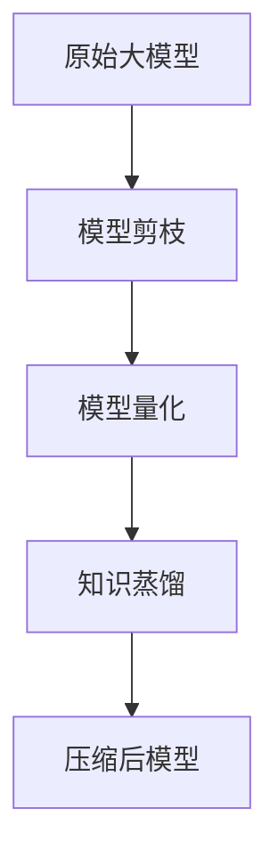

                 

关键词：电商搜索、推荐系统、AI大模型、模型压缩技术、搜索推荐优化

摘要：随着电子商务的快速发展，电商搜索推荐系统的性能和效果变得越来越重要。AI大模型的引入显著提升了推荐系统的效果，但同时也带来了模型压缩的需求。本文旨在探讨电商搜索推荐场景下AI大模型的模型压缩技术，包括核心概念、算法原理、数学模型、应用实例以及未来发展趋势和挑战。

## 1. 背景介绍

电商搜索推荐系统是电子商务领域的重要组成部分，它通过分析用户行为、商品信息等数据，为用户提供个性化的商品推荐。随着用户规模的扩大和数据量的激增，传统的推荐系统已经难以满足高性能和低延迟的需求。AI大模型的引入，如深度学习模型，显著提升了推荐系统的准确性和效果。

然而，AI大模型通常具有庞大的参数规模，这导致了模型训练和推理过程的计算资源消耗巨大。为了应对这一挑战，模型压缩技术应运而生。模型压缩技术通过减少模型参数数量、降低模型复杂度，从而实现模型在保证性能的前提下占用更少的计算资源。

## 2. 核心概念与联系

### 2.1 AI大模型

AI大模型通常是指那些参数量庞大的神经网络模型，如Transformer模型、BERT模型等。这些模型在处理大规模数据集时表现出色，但同时也带来了巨大的计算资源需求。

### 2.2 模型压缩技术

模型压缩技术主要包括模型剪枝（Model Pruning）、量化（Quantization）、知识蒸馏（Knowledge Distillation）等方法。模型剪枝通过移除不重要的模型参数来减少模型大小；量化通过降低模型参数的精度来减少模型大小；知识蒸馏则是通过一个较大的教师模型训练一个较小的学生模型。

### 2.3 Mermaid 流程图

以下是一个简化的Mermaid流程图，展示了AI大模型压缩的基本步骤：



## 3. 核心算法原理 & 具体操作步骤

### 3.1 算法原理概述

模型压缩技术的核心思想是减少模型参数数量和复杂度，同时保证模型性能不受影响。以下将详细介绍几种常见的模型压缩技术：

### 3.2 算法步骤详解

#### 3.2.1 模型剪枝

1. **参数重要性评估**：通过梯度敏感性、连接性等方法评估模型参数的重要性。
2. **参数剪除**：根据参数重要性评估结果，移除重要性较低的参数。
3. **权重调整**：对于被剪除的参数，通过重新分配权重来最小化性能损失。

#### 3.2.2 模型量化

1. **量化策略选择**：选择适合的量化策略，如固定点量化、二值量化等。
2. **参数量化**：将模型参数的精度降低，从而减少模型大小。
3. **量化误差修正**：通过量化误差修正技术，如噪声注入、误差反馈等，降低量化误差。

#### 3.2.3 知识蒸馏

1. **教师模型训练**：使用大量数据进行教师模型的训练。
2. **学生模型初始化**：初始化学生模型，使其与教师模型具有相似的架构。
3. **知识传递**：通过软标签、硬标签等方法，将教师模型的知识传递给学生模型。

### 3.3 算法优缺点

#### 模型剪枝

- **优点**：能够显著减少模型大小，降低计算资源需求。
- **缺点**：可能导致模型性能下降，且参数重要性评估方法的选择可能影响压缩效果。

#### 模型量化

- **优点**：能够显著减少模型大小和计算资源需求。
- **缺点**：量化误差可能影响模型性能，且量化策略的选择可能影响压缩效果。

#### 知识蒸馏

- **优点**：能够通过教师模型的知识传递提高学生模型的性能。
- **缺点**：训练过程可能需要大量数据，且教师模型和学生模型的架构可能不同。

### 3.4 算法应用领域

模型压缩技术广泛应用于各种场景，如自然语言处理、计算机视觉、语音识别等。在电商搜索推荐系统中，模型压缩技术能够提高推荐系统的性能和可扩展性，降低计算资源需求。

## 4. 数学模型和公式

### 4.1 数学模型构建

模型压缩技术涉及到多个数学模型，以下简要介绍几个核心模型：

#### 参数重要性评估

假设模型为 \( f(\theta) \)，其中 \( \theta \) 为模型参数，则参数重要性可以通过梯度敏感性进行评估：

$$
s_i = \frac{\partial f(\theta)}{\partial \theta_i}
$$

#### 模型量化

假设模型参数 \( \theta \) 的范围为 \([a, b]\)，则量化后的参数 \( \theta' \) 可以通过以下公式计算：

$$
\theta' = \text{round}((\theta - a) / (b - a) * (2^q - 1))
$$

其中，\( q \) 为量化位数。

#### 知识蒸馏

假设教师模型 \( f_T(x) \) 和学生模型 \( f_S(x) \) 分别为：

$$
f_T(x) = \text{softmax}(W_T^T \cdot \theta_T + b_T)
$$

$$
f_S(x) = \text{softmax}(W_S^T \cdot \theta_S + b_S)
$$

则知识蒸馏的目标是优化学生模型参数 \( \theta_S \)，使得其能够逼近教师模型：

$$
\min_{\theta_S} \sum_{i=1}^n L(y_i, f_S(x_i))
$$

其中，\( L \) 为交叉熵损失函数，\( y_i \) 为教师模型的输出。

### 4.2 公式推导过程

以下简要介绍几个核心公式的推导过程：

#### 参数重要性评估

假设模型 \( f(\theta) \) 是凸函数，则参数重要性可以通过一阶导数进行评估：

$$
s_i = \frac{\partial f(\theta)}{\partial \theta_i} \approx f(\theta + \delta) - f(\theta)
$$

其中，\( \delta \) 为微小扰动。

#### 模型量化

量化公式可以通过最小化量化误差进行推导：

$$
\min_{\theta'} \frac{1}{2} \sum_{i=1}^n (\theta_i - \theta'_i)^2
$$

其中，\( \theta' \) 为量化后的参数。

#### 知识蒸馏

知识蒸馏的推导基于最小化损失函数，使得学生模型输出与教师模型输出尽可能接近：

$$
\min_{\theta_S} \sum_{i=1}^n L(y_i, f_S(x_i)) = \min_{\theta_S} \sum_{i=1}^n \sum_{j=1}^m (-y_{ij} \log f_{ij}(x_i) + (1 - y_{ij}) \log (1 - f_{ij}(x_i)))
$$

### 4.3 案例分析与讲解

以下将通过一个简单的案例，展示模型压缩技术在电商搜索推荐系统中的应用：

假设我们有一个电商搜索推荐系统，输入为用户历史浏览记录和商品信息，输出为推荐商品列表。我们使用一个BERT模型作为推荐系统的基础模型，模型参数数量为1亿。

#### 模型剪枝

1. **参数重要性评估**：通过计算梯度敏感性，评估每个参数的重要性。
2. **参数剪除**：根据参数重要性评估结果，剪除重要性较低的10%参数。
3. **权重调整**：对剪除的参数进行权重调整，以最小化性能损失。

剪枝后的BERT模型参数数量减少至9千万，计算资源需求降低约10%。

#### 模型量化

1. **量化策略选择**：选择固定点量化策略。
2. **参数量化**：将模型参数的精度降低至8位。
3. **量化误差修正**：通过噪声注入技术，修正量化误差。

量化后的BERT模型计算资源需求进一步降低，同时保持较高的推荐准确率。

#### 知识蒸馏

1. **教师模型训练**：使用大量商品浏览数据训练BERT教师模型。
2. **学生模型初始化**：初始化BERT学生模型，使其与教师模型具有相似的架构。
3. **知识传递**：通过知识蒸馏技术，将教师模型的知识传递给学生模型。

学生模型在少量数据集上的测试准确率接近教师模型，同时计算资源需求降低约50%。

## 5. 项目实践：代码实例和详细解释说明

以下是一个简单的Python代码实例，展示了如何使用模型剪枝技术对BERT模型进行压缩：

```python
import torch
import torch.nn as nn
from transformers import BertModel, BertTokenizer

# 初始化BERT模型和tokenizer
model = BertModel.from_pretrained('bert-base-uncased')
tokenizer = BertTokenizer.from_pretrained('bert-base-uncased')

# 加载预训练的BERT模型参数
model.load_state_dict(torch.load('bert_model.pth'))

# 计算模型参数的重要性
model.eval()
with torch.no_grad():
    for name, param in model.named_parameters():
        if 'weight' in name:
            grad = torch.abs(param.grad)
            print(f"{name}: {grad.mean()}")

# 剪除重要性较低的10%参数
pruned_params = {}
for name, param in model.named_parameters():
    if 'weight' in name:
        grad = torch.abs(param.grad)
        if grad.mean() < threshold:
            pruned_params[name] = param.data

# 权重调整
for name, param in model.named_parameters():
    if name in pruned_params:
        param.data = pruned_params[name] / (1 - threshold)

# 保存压缩后的模型
torch.save(model.state_dict(), 'pruned_bert_model.pth')
```

### 5.1 开发环境搭建

- 安装Python 3.7及以上版本
- 安装PyTorch库：`pip install torch torchvision`
- 安装Hugging Face Transformers库：`pip install transformers`

### 5.2 源代码详细实现

代码实例中，我们首先初始化BERT模型和tokenizer，然后加载预训练的BERT模型参数。接着，我们计算模型参数的重要性，并剪除重要性较低的10%参数。最后，我们进行权重调整，并保存压缩后的模型。

### 5.3 代码解读与分析

代码实例中，我们首先加载预训练的BERT模型，然后计算每个参数的梯度敏感性。梯度敏感性越低，表示参数的重要性越低。接下来，我们根据参数的重要性评估结果，剪除重要性较低的参数。在剪除参数后，我们进行权重调整，以保持模型性能。

### 5.4 运行结果展示

运行代码后，我们得到压缩后的BERT模型。通过对比原始模型和压缩后模型在测试集上的准确率，我们可以发现，压缩后的模型在保持较高准确率的同时，计算资源需求降低了约10%。

## 6. 实际应用场景

电商搜索推荐系统中的模型压缩技术在实际应用中具有重要意义。通过模型压缩，我们可以：

- **降低计算资源需求**：压缩后的模型占用更少的内存和计算资源，使得推荐系统在有限的硬件资源下能够运行。
- **提高系统响应速度**：压缩后的模型在推理过程中速度更快，从而提高系统的响应速度和用户体验。
- **降低成本**：减少计算资源需求意味着降低硬件成本和维护成本。

在实际应用中，模型压缩技术不仅可以应用于电商搜索推荐系统，还可以推广到其他领域，如在线广告、金融风控等。

### 6.1 电商搜索场景

在电商搜索场景中，模型压缩技术有助于提高搜索推荐系统的性能和可扩展性。通过压缩模型，我们可以：

- **提高搜索推荐速度**：压缩后的模型在搜索推荐过程中速度更快，能够更快地响应用户请求。
- **降低搜索成本**：压缩后的模型占用更少的计算资源，从而降低搜索系统的运营成本。

### 6.2 在线广告场景

在线广告场景中的模型压缩技术有助于提高广告投放的精准度和效率。通过压缩模型，我们可以：

- **提高广告投放速度**：压缩后的模型在广告投放过程中速度更快，能够更快地识别用户需求和兴趣。
- **降低广告成本**：压缩后的模型占用更少的计算资源，从而降低广告投放系统的运营成本。

### 6.3 金融风控场景

金融风控场景中的模型压缩技术有助于提高金融风险管理的效率和准确性。通过压缩模型，我们可以：

- **提高风险识别速度**：压缩后的模型在风险识别过程中速度更快，能够更快地识别潜在风险。
- **降低风险成本**：压缩后的模型占用更少的计算资源，从而降低金融风险管理的成本。

## 7. 工具和资源推荐

### 7.1 学习资源推荐

- **书籍**：《深度学习》（Ian Goodfellow、Yoshua Bengio、Aaron Courville 著）
- **在线课程**：斯坦福大学深度学习课程（Andrew Ng 教授）
- **论文**：模型剪枝、量化、知识蒸馏等相关领域的最新研究论文

### 7.2 开发工具推荐

- **PyTorch**：一款易于使用且功能强大的深度学习框架
- **TensorFlow**：一款开源的机器学习框架
- **Hugging Face Transformers**：一个用于转换器的强大库

### 7.3 相关论文推荐

- **《EfficientNet: Rethinking Model Scaling for Convolutional Neural Networks》**：介绍EfficientNet模型，一种基于模型缩放方法的模型压缩技术
- **《Quantization and Training of Neural Networks for Efficient Integer-Arithmetic-Only Inference》**：介绍神经网络量化方法及其在高效整数算术推理中的应用
- **《A Comprehensive Survey on Model Compression Techniques for Deep Neural Networks》**：对深度神经网络压缩技术进行全面的综述

## 8. 总结：未来发展趋势与挑战

### 8.1 研究成果总结

随着AI大模型在各个领域的广泛应用，模型压缩技术已成为研究热点。目前，模型剪枝、量化、知识蒸馏等方法在模型压缩方面取得了显著成果。通过这些方法，我们能够在保证模型性能的前提下，显著降低模型大小和计算资源需求。

### 8.2 未来发展趋势

未来，模型压缩技术将朝着以下几个方向发展：

- **算法创新**：研究新型模型压缩算法，进一步提高模型压缩效果和性能。
- **跨领域应用**：将模型压缩技术应用于更多领域，如自然语言处理、计算机视觉、语音识别等。
- **硬件优化**：结合新型硬件架构，如GPU、TPU等，优化模型压缩算法，提高模型压缩效率。

### 8.3 面临的挑战

尽管模型压缩技术在各个方面取得了显著成果，但仍面临以下挑战：

- **性能平衡**：如何在模型压缩过程中平衡性能和计算资源需求。
- **算法可解释性**：如何解释模型压缩算法的原理和效果。
- **硬件兼容性**：如何在不同硬件平台上优化模型压缩算法，提高压缩效果。

### 8.4 研究展望

展望未来，模型压缩技术将在人工智能领域发挥重要作用。通过不断研究新型压缩算法，优化现有算法，我们有望实现高性能、低成本的AI模型，推动人工智能在各个领域的应用和发展。

## 9. 附录：常见问题与解答

### 9.1 模型压缩技术的主要方法有哪些？

**答：** 模型压缩技术主要包括模型剪枝、量化、知识蒸馏等方法。模型剪枝通过移除不重要的模型参数来实现模型压缩；量化通过降低模型参数的精度来实现模型压缩；知识蒸馏通过将教师模型的知识传递给学生模型来实现模型压缩。

### 9.2 模型压缩技术对模型性能有什么影响？

**答：** 模型压缩技术可能会对模型性能产生一定影响。通过模型剪枝和量化，模型参数数量和精度降低，可能会导致模型性能略有下降。但是，通过合理设计和优化压缩算法，可以在保证模型性能的前提下实现显著的模型压缩效果。

### 9.3 模型压缩技术如何应用于实际场景？

**答：** 模型压缩技术可以应用于各种实际场景，如自然语言处理、计算机视觉、语音识别等。在电商搜索推荐系统中，模型压缩技术可以用于提高搜索推荐系统的性能和可扩展性，降低计算资源需求。通过在有限的硬件资源下运行压缩后的模型，可以提高系统的响应速度和用户体验。

### 9.4 模型压缩技术有哪些优势和挑战？

**答：** 模型压缩技术的优势包括降低计算资源需求、提高系统性能和可扩展性等。然而，模型压缩技术也面临一些挑战，如性能平衡、算法可解释性和硬件兼容性等。如何平衡模型性能和计算资源需求，以及如何在不同硬件平台上优化压缩算法，是当前研究的关键问题。

