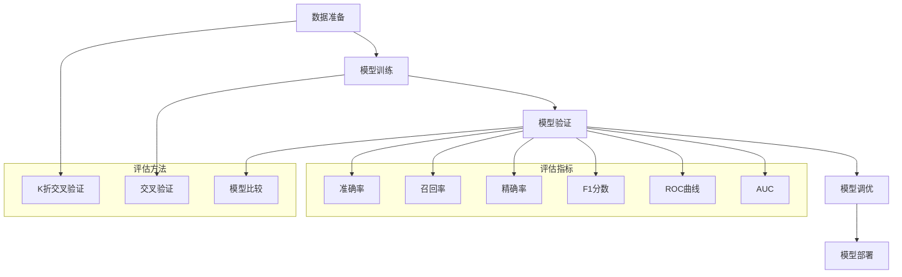

                 

在电商搜索推荐场景中，AI大模型的性能评估是一项至关重要的任务。这不仅关系到推荐系统的质量，也直接影响到用户的购物体验和商家的业务收益。本文将探讨电商搜索推荐场景下AI大模型模型评估体系的构建，包括评估指标的选择、评估方法的设计和评估过程的实施。希望通过本文，能够为从事相关领域的研究者和开发者提供一些有价值的参考。

## 关键词
- 电商搜索推荐
- AI大模型
- 模型评估体系
- 性能指标
- 评估方法

## 摘要
本文首先介绍了电商搜索推荐场景下的AI大模型背景及其重要性。接着，详细阐述了模型评估体系的核心概念和关联性，通过Mermaid流程图展示了模型评估的整体架构。随后，深入分析了核心算法的原理、步骤、优缺点及适用领域。在数学模型和公式部分，对模型评估的数学原理进行了推导，并提供了实际案例进行分析。文章随后通过项目实践展示了代码实例和运行结果，并探讨了模型的实际应用场景和未来展望。最后，对相关工具和资源进行了推荐，总结了研究成果，探讨了未来发展趋势和挑战。

## 1. 背景介绍

随着互联网技术的飞速发展，电子商务已成为全球市场的重要组成部分。在线购物平台通过提供个性化的搜索和推荐服务，极大地提升了用户体验和商家收益。在这一过程中，AI大模型的应用变得越来越广泛，它们不仅能够处理海量数据，还能在复杂的推荐场景中提供高效的决策支持。

### 1.1 电商搜索推荐系统概述
电商搜索推荐系统是利用人工智能技术，根据用户的历史行为、兴趣偏好和商品特征，为用户推荐相关商品的信息系统。它主要包括以下几个核心组成部分：

1. **用户画像**：通过对用户的历史行为数据进行分析，构建用户的兴趣偏好模型。
2. **商品画像**：对商品的各种属性进行提取和建模，如价格、品牌、类别等。
3. **推荐算法**：使用机器学习算法，结合用户画像和商品画像，为用户生成个性化的推荐列表。

### 1.2 AI大模型的应用
AI大模型，尤其是深度学习模型，因其强大的数据处理能力和非线性建模能力，在电商搜索推荐系统中得到了广泛应用。这些模型可以通过以下几个步骤进行：

1. **数据预处理**：包括数据清洗、数据整合和数据归一化等步骤。
2. **特征提取**：利用神经网络模型从原始数据中提取有用的特征。
3. **模型训练**：通过大量的历史数据训练模型，使其能够学习到数据中的潜在规律。
4. **模型评估**：对模型的性能进行评估，确保其能够在实际应用中提供准确的推荐结果。
5. **模型部署**：将训练好的模型部署到线上环境，为用户提供实时的推荐服务。

### 1.3 模型评估的重要性
在电商搜索推荐系统中，模型评估是确保推荐质量的关键环节。一个优秀的推荐模型不仅需要能够准确预测用户的兴趣，还需要在多样性、覆盖度、新颖性等方面表现良好。以下是模型评估的重要作用：

1. **提升推荐质量**：通过对模型进行严格的评估，可以识别和优化模型的不足，从而提高推荐列表的整体质量。
2. **降低商业风险**：通过评估模型在不同场景下的性能，可以降低推荐结果对用户体验和业务收益的潜在负面影响。
3. **优化资源配置**：有效的评估体系可以帮助企业合理配置资源，确保技术团队可以将有限的时间、人力和财力投入到最有价值的改进领域。

### 1.4 本文结构
本文将按照以下结构进行展开：

1. **核心概念与联系**：介绍模型评估体系的核心概念，并通过Mermaid流程图展示整体架构。
2. **核心算法原理 & 具体操作步骤**：深入分析模型评估算法的原理和具体实施步骤。
3. **数学模型和公式 & 详细讲解 & 举例说明**：推导模型评估的数学原理，并通过案例进行分析。
4. **项目实践：代码实例和详细解释说明**：提供实际的项目实践案例，展示代码实现过程。
5. **实际应用场景**：探讨模型评估在电商搜索推荐系统中的实际应用。
6. **未来应用展望**：展望模型评估体系在未来的发展方向和应用前景。
7. **工具和资源推荐**：推荐学习资源和开发工具。
8. **总结：未来发展趋势与挑战**：总结研究成果，探讨未来发展趋势和挑战。

通过以上结构，本文旨在全面、深入地探讨电商搜索推荐场景下AI大模型模型评估体系的构建，为读者提供有价值的参考和指导。

## 2. 核心概念与联系

在构建电商搜索推荐场景下的AI大模型模型评估体系时，我们需要明确几个核心概念，并理解它们之间的相互联系。以下是这些核心概念及其关联性的详细介绍：

### 2.1 评估指标

评估指标是模型评估体系中的基础，它们用于衡量模型在不同维度上的表现。在电商搜索推荐系统中，常见的评估指标包括：

- **准确率（Accuracy）**：衡量模型预测结果与实际结果一致的比例。
- **召回率（Recall）**：衡量模型能够召回实际用户感兴趣的商品的比例。
- **精确率（Precision）**：衡量模型预测结果中真正感兴趣商品的比例。
- **F1分数（F1 Score）**：综合衡量准确率和召回率的指标，是二者的调和平均值。
- **ROC曲线（Receiver Operating Characteristic Curve）**：用于评估分类模型的性能，通过计算真阳性率与假阳性率的交点来衡量模型的阈值。
- **AUC（Area Under Curve）**：ROC曲线下的面积，用于比较不同模型的分类能力。

### 2.2 评估方法

评估方法是指具体如何使用评估指标来衡量模型性能的过程。在电商搜索推荐系统中，常用的评估方法包括：

- **K折交叉验证（K-Fold Cross-Validation）**：通过将数据集划分为K个相等的部分，每次使用其中的一部分作为验证集，其他部分作为训练集，从而避免过拟合。
- **交叉验证（Cross-Validation）**：在给定训练集的基础上，多次进行模型训练和验证，以获得更加稳健的评估结果。
- **模型比较（Model Comparison）**：通过比较不同模型在同一数据集上的表现，选择性能最优的模型。

### 2.3 评估流程

评估流程是指从数据准备到最终评估结果输出的整个过程。在电商搜索推荐系统中，评估流程通常包括以下几个步骤：

1. **数据准备**：包括数据清洗、数据整合和数据归一化等步骤，以确保数据的质量和一致性。
2. **模型训练**：使用训练数据集训练模型，使其学习到数据中的潜在规律。
3. **模型验证**：使用验证数据集对模型进行评估，以确定模型在未见数据上的表现。
4. **模型调优**：根据验证结果对模型进行调优，以优化其性能。
5. **模型部署**：将最终训练好的模型部署到线上环境，为用户提供推荐服务。

### 2.4 Mermaid流程图

为了更直观地展示模型评估体系的核心概念和关联性，我们使用Mermaid流程图进行说明。以下是一个简化的流程图，展示了电商搜索推荐场景下模型评估的主要步骤：



在这个流程图中，评估指标和评估方法是模型评估流程的关键组成部分。通过K折交叉验证和交叉验证方法，我们可以获得模型的准确率、召回率、精确率、F1分数、ROC曲线和AUC等评估指标，从而对模型进行全面的评估和调优。

通过明确核心概念与联系，并使用Mermaid流程图进行展示，我们为构建电商搜索推荐场景下的AI大模型模型评估体系奠定了基础。在接下来的章节中，我们将深入探讨模型评估的核心算法原理和具体操作步骤，以进一步优化和提升模型评估的效果。

## 3. 核心算法原理 & 具体操作步骤

在电商搜索推荐系统中，AI大模型的评估算法是其性能提升的关键。本节将详细分析核心算法的原理，并具体描述其操作步骤，同时讨论算法的优缺点及其应用领域。

### 3.1 算法原理概述

电商搜索推荐场景下的AI大模型评估算法主要基于以下原理：

1. **机器学习基础**：模型评估算法依赖于机器学习的基本理论，包括损失函数、优化算法和验证集的使用等。
2. **模型拟合与泛化**：评估算法不仅需要衡量模型在训练数据上的拟合程度，还要确保其在未见数据上的泛化能力。
3. **多维度评估**：通过多个评估指标（如准确率、召回率、F1分数等）综合评估模型性能，以全面反映模型的优劣。

### 3.2 算法步骤详解

电商搜索推荐系统的AI大模型评估算法通常包括以下几个步骤：

#### 步骤1：数据预处理

数据预处理是评估算法的第一步，其主要包括：

- **数据清洗**：去除异常值、噪声数据和重复数据，确保数据质量。
- **特征工程**：提取和构造有助于模型学习的特征，如用户行为特征、商品属性特征等。
- **数据归一化**：将不同特征进行归一化处理，使其具有相同的量纲，以避免特征之间的量级差异对模型训练造成影响。

#### 步骤2：模型训练

在数据预处理完成后，进行模型训练：

- **选择模型**：根据问题特性选择合适的机器学习模型，如逻辑回归、神经网络、决策树等。
- **训练过程**：使用训练数据集对模型进行训练，优化模型参数，使其在训练数据上达到最优拟合。

#### 步骤3：模型验证

模型验证是评估算法的核心步骤，其目的是评估模型在未见数据上的性能：

- **交叉验证**：通过K折交叉验证或留一验证等方法，将数据集划分为多个子集，每次使用不同的子集进行训练和验证，以减少过拟合的风险。
- **计算评估指标**：计算准确率、召回率、精确率、F1分数、ROC曲线和AUC等评估指标，以综合评估模型性能。

#### 步骤4：模型调优

根据模型验证的结果，对模型进行调优：

- **超参数调整**：调整模型的超参数，如学习率、正则化参数等，以优化模型性能。
- **特征选择**：通过特征重要性分析，选择对模型性能有显著影响的特征，以提升模型效果。

#### 步骤5：模型部署

在完成模型调优后，将最终训练好的模型部署到线上环境，为用户提供实时的推荐服务。

### 3.3 算法优缺点

#### 优点

- **全面评估**：通过多维度评估指标，能够全面反映模型在不同方面的性能。
- **灵活调优**：支持根据验证结果对模型进行灵活调优，以提升模型效果。
- **通用性**：评估算法适用于各种机器学习模型，具有广泛的适用性。

#### 缺点

- **计算复杂度高**：评估算法通常需要多次训练和验证，计算复杂度较高。
- **依赖数据质量**：评估结果依赖于数据的质量和特征工程的质量，数据预处理不当可能导致评估不准确。

### 3.4 算法应用领域

AI大模型评估算法在电商搜索推荐系统中的主要应用领域包括：

- **个性化推荐**：通过评估算法，优化推荐模型的性能，提高推荐结果的准确性和多样性。
- **广告投放**：评估广告投放效果，选择最优的广告策略和投放渠道。
- **金融风控**：评估金融模型的准确性，降低风险，提高业务安全性。

通过以上对核心算法原理和具体操作步骤的详细分析，我们可以更好地理解和应用AI大模型评估算法，以提升电商搜索推荐系统的性能和用户体验。

### 3.5 算法应用领域

AI大模型评估算法不仅在电商搜索推荐系统中有着广泛的应用，还涵盖了多个领域，展现了其强大的适应性和广泛的应用潜力。以下是算法在几个典型应用领域的详细介绍：

#### 3.5.1 个性化推荐

在电商、视频流媒体和新闻平台等场景中，个性化推荐是提高用户满意度和提升平台粘性的重要手段。AI大模型评估算法通过多维度评估指标，如准确率、召回率和F1分数等，对推荐系统的性能进行量化评估。具体应用包括：

- **电商推荐**：根据用户的历史购买行为和浏览记录，推荐相关商品，提高购买转化率。
- **视频推荐**：根据用户观看历史和偏好，推荐符合用户兴趣的视频内容，提升用户观看时长。
- **新闻推荐**：根据用户的阅读习惯和兴趣标签，推荐相关新闻，提升用户的阅读体验。

#### 3.5.2 广告投放

在数字广告领域，AI大模型评估算法用于评估广告投放的效果，选择最优的广告策略和投放渠道。通过评估广告的点击率、转化率和投资回报率等指标，算法可以帮助广告主：

- **优化广告投放**：根据评估结果调整广告的投放策略，如增加或减少投放预算，调整广告投放时间段等，以提升广告效果。
- **精准定位用户**：通过分析用户的点击和转化数据，优化广告定向，确保广告能够精准触达目标用户。
- **评估广告创意**：通过分析不同广告创意的投放效果，选择最有效的广告创意，提升广告投放的投资回报率。

#### 3.5.3 金融风控

在金融领域，AI大模型评估算法用于评估金融模型的准确性，降低风险，提高业务安全性。具体应用包括：

- **信用评分**：通过评估模型对信用风险的预测能力，为金融机构提供更准确的信用评估，降低坏账率。
- **欺诈检测**：评估反欺诈模型的检测能力，提高对金融欺诈行为的识别和防范能力。
- **投资策略**：评估投资模型的预测能力，为金融机构提供更加科学和有效的投资策略。

#### 3.5.4 健康医疗

在健康医疗领域，AI大模型评估算法用于评估医疗诊断和预测模型的准确性，提高医疗服务的质量。具体应用包括：

- **疾病诊断**：通过评估模型对疾病诊断的准确率，帮助医生更快速和准确地诊断疾病，提高诊断效率。
- **健康预测**：根据患者的病史和体征数据，评估健康预测模型的准确性，为患者提供个性化的健康建议。
- **药物研发**：评估药物疗效和毒性的预测模型，为药物研发提供科学依据，提高研发成功率。

通过在多个领域的广泛应用，AI大模型评估算法不仅提升了相关领域的效率和准确性，还推动了人工智能技术的发展和进步。未来，随着AI技术的不断发展和数据资源的丰富，评估算法将在更多场景中发挥重要作用。

### 4. 数学模型和公式 & 详细讲解 & 举例说明

在构建电商搜索推荐场景下的AI大模型评估体系中，数学模型和公式是关键组成部分。这些模型和公式不仅为评估过程提供了理论基础，还能帮助我们更准确地理解和优化模型性能。本节将详细讲解模型评估中的数学模型和公式，并通过实际案例进行分析和说明。

#### 4.1 数学模型构建

在模型评估过程中，常用的数学模型包括分类模型和回归模型。以下分别介绍这两种模型的基本数学公式。

**分类模型**

分类模型用于预测用户对商品的喜好，常用的包括逻辑回归、支持向量机和神经网络等。逻辑回归模型的基本公式如下：

$$
\hat{y} = \frac{1}{1 + e^{-(\beta_0 + \beta_1x_1 + \beta_2x_2 + ... + \beta_nx_n})}
$$

其中，\( \hat{y} \) 是预测的概率值，\( \beta_0 \) 是截距，\( \beta_1, \beta_2, ..., \beta_n \) 是模型参数，\( x_1, x_2, ..., x_n \) 是输入特征。

**回归模型**

回归模型用于预测用户对商品的行为，如购买金额、浏览时长等。线性回归模型的基本公式如下：

$$
y = \beta_0 + \beta_1x_1 + \beta_2x_2 + ... + \beta_nx_n + \epsilon
$$

其中，\( y \) 是预测的目标值，\( \beta_0 \) 是截距，\( \beta_1, \beta_2, ..., \beta_n \) 是模型参数，\( x_1, x_2, ..., x_n \) 是输入特征，\( \epsilon \) 是误差项。

#### 4.2 公式推导过程

以下以逻辑回归模型为例，简要介绍公式推导过程。

逻辑回归模型基于最大似然估计（Maximum Likelihood Estimation, MLE）进行参数估计。对于给定特征向量 \( x \) 和标签 \( y \)，模型的似然函数可以表示为：

$$
L(\beta_0, \beta_1, \beta_2, ..., \beta_n) = \prod_{i=1}^{n} P(y_i | x_i; \beta_0, \beta_1, \beta_2, ..., \beta_n)
$$

对于二分类问题，标签 \( y_i \) 可以取值为 0 或 1，因此似然函数可以表示为：

$$
L(\beta_0, \beta_1, \beta_2, ..., \beta_n) = \prod_{i=1}^{n} [p(x_i; \beta_0, \beta_1, \beta_2, ..., \beta_n)]^{y_i} [1 - p(x_i; \beta_0, \beta_1, \beta_2, ..., \beta_n)]^{1 - y_i}
$$

对数似然函数（Log-likelihood Function）为：

$$
\ln L(\beta_0, \beta_1, \beta_2, ..., \beta_n) = \sum_{i=1}^{n} y_i \ln p(x_i; \beta_0, \beta_1, \beta_2, ..., \beta_n) + (1 - y_i) \ln (1 - p(x_i; \beta_0, \beta_1, \beta_2, ..., \beta_n))
$$

为了最大化对数似然函数，我们需要对其求导并令导数为零。求导后得到：

$$
\frac{\partial \ln L}{\partial \beta_j} = \frac{1}{n} \sum_{i=1}^{n} (y_i - p(x_i; \beta_0, \beta_1, \beta_2, ..., \beta_n))x_j
$$

通过解这个方程组，我们可以得到模型参数的估计值。

#### 4.3 案例分析与讲解

以下通过一个简单的案例，说明逻辑回归模型在电商搜索推荐系统中的应用。

**案例背景**：假设我们有一个电商平台的推荐系统，希望根据用户的历史购买记录和浏览记录预测用户是否会对某一商品进行购买。

**数据集**：我们有一个包含1000个用户的数据集，每个用户有10个特征：年龄、性别、收入、购买历史、浏览历史等。

**目标变量**：目标变量是用户是否购买商品，取值为0或1。

**模型训练**：我们使用逻辑回归模型对数据进行训练，训练完成后得到一组参数：\( \beta_0, \beta_1, ..., \beta_{10} \)。

**预测过程**：对于新用户的数据，我们可以通过以下公式计算其购买的概率：

$$
p(\text{购买}) = \frac{1}{1 + e^{-(\beta_0 + \beta_1x_1 + \beta_2x_2 + ... + \beta_{10}x_{10})}}
$$

例如，对于一个新的用户，其特征为：年龄30、性别男、收入5000元、购买历史10次、浏览历史5次，我们可以计算其购买的概率如下：

$$
p(\text{购买}) = \frac{1}{1 + e^{-(\beta_0 + \beta_1 \cdot 30 + \beta_2 \cdot 1 + \beta_3 \cdot 5000 + ... + \beta_{10} \cdot 5)}}
$$

根据这个概率值，我们可以决定是否向用户推荐该商品。

通过以上案例，我们可以看到逻辑回归模型在电商搜索推荐系统中的应用。在实际应用中，我们需要对模型进行反复训练和调优，以确保其预测结果的准确性。同时，我们还需要关注模型在多样性和覆盖度等方面的表现，以提供优质的推荐服务。

### 5. 项目实践：代码实例和详细解释说明

在了解了AI大模型评估的理论和数学基础后，接下来我们将通过一个实际项目来展示代码实现过程，并对代码进行解读与分析。本文将使用Python语言和Scikit-learn库来构建一个电商搜索推荐系统，并对其模型进行评估。

#### 5.1 开发环境搭建

首先，我们需要搭建一个Python开发环境。以下是所需步骤：

1. **安装Python**：从[Python官网](https://www.python.org/downloads/)下载并安装最新版本的Python。
2. **安装Jupyter Notebook**：Python内置了Jupyter Notebook，无需单独安装。
3. **安装Scikit-learn**：使用pip命令安装Scikit-learn库。

```bash
pip install scikit-learn
```

#### 5.2 源代码详细实现

以下是项目的主要代码实现部分：

```python
# 导入相关库
import numpy as np
import pandas as pd
from sklearn.model_selection import train_test_split
from sklearn.preprocessing import StandardScaler
from sklearn.linear_model import LogisticRegression
from sklearn.metrics import accuracy_score, recall_score, precision_score, f1_score, roc_auc_score

# 加载数据集
data = pd.read_csv('ecommerce_data.csv')

# 数据预处理
# 特征工程和数据处理
X = data.drop('target', axis=1)
y = data['target']

# 划分训练集和测试集
X_train, X_test, y_train, y_test = train_test_split(X, y, test_size=0.2, random_state=42)

# 数据归一化
scaler = StandardScaler()
X_train = scaler.fit_transform(X_train)
X_test = scaler.transform(X_test)

# 模型训练
model = LogisticRegression()
model.fit(X_train, y_train)

# 模型预测
y_pred = model.predict(X_test)

# 模型评估
accuracy = accuracy_score(y_test, y_pred)
recall = recall_score(y_test, y_pred)
precision = precision_score(y_test, y_pred)
f1 = f1_score(y_test, y_pred)
roc_auc = roc_auc_score(y_test, y_pred)

print("Accuracy:", accuracy)
print("Recall:", recall)
print("Precision:", precision)
print("F1 Score:", f1)
print("ROC AUC:", roc_auc)

# 可视化ROC曲线
from sklearn.metrics import roc_curve, auc
fpr, tpr, thresholds = roc_curve(y_test, y_pred)
roc_auc = auc(fpr, tpr)

import matplotlib.pyplot as plt
plt.figure()
plt.plot(fpr, tpr, color='darkorange', lw=2, label='ROC curve (area = %0.2f)' % roc_auc)
plt.plot([0, 1], [0, 1], color='navy', lw=2, linestyle='--')
plt.xlim([0.0, 1.0])
plt.ylim([0.0, 1.05])
plt.xlabel('False Positive Rate')
plt.ylabel('True Positive Rate')
plt.title('Receiver operating characteristic')
plt.legend(loc="lower right")
plt.show()
```

#### 5.3 代码解读与分析

**数据加载与预处理**

```python
data = pd.read_csv('ecommerce_data.csv')
X = data.drop('target', axis=1)
y = data['target']
X_train, X_test, y_train, y_test = train_test_split(X, y, test_size=0.2, random_state=42)
```

- 首先，我们加载了电商数据集，并将数据集划分为特征集和目标变量。
- 使用`train_test_split`函数将数据集划分为训练集和测试集，其中测试集的比例为20%。

**数据归一化**

```python
scaler = StandardScaler()
X_train = scaler.fit_transform(X_train)
X_test = scaler.transform(X_test)
```

- 使用`StandardScaler`对特征进行归一化处理，以消除特征之间的量级差异。

**模型训练**

```python
model = LogisticRegression()
model.fit(X_train, y_train)
```

- 创建并训练逻辑回归模型。这里我们使用Scikit-learn中的`LogisticRegression`类。

**模型预测**

```python
y_pred = model.predict(X_test)
```

- 使用训练好的模型对测试集进行预测。

**模型评估**

```python
accuracy = accuracy_score(y_test, y_pred)
recall = recall_score(y_test, y_pred)
precision = precision_score(y_test, y_pred)
f1 = f1_score(y_test, y_pred)
roc_auc = roc_auc_score(y_test, y_pred)
```

- 使用Scikit-learn提供的一系列评估函数对模型进行评估，包括准确率、召回率、精确率、F1分数和ROC AUC。

**可视化ROC曲线**

```python
fpr, tpr, thresholds = roc_curve(y_test, y_pred)
roc_auc = auc(fpr, tpr)
plt.figure()
plt.plot(fpr, tpr, color='darkorange', lw=2, label='ROC curve (area = %0.2f)' % roc_auc)
plt.plot([0, 1], [0, 1], color='navy', lw=2, linestyle='--')
plt.xlim([0.0, 1.0])
plt.ylim([0.0, 1.05])
plt.xlabel('False Positive Rate')
plt.ylabel('True Positive Rate')
plt.title('Receiver operating characteristic')
plt.legend(loc="lower right")
plt.show()
```

- 通过绘制ROC曲线，我们可以直观地看到模型的分类性能。

通过上述代码，我们完成了电商搜索推荐系统的构建，并对模型进行了详细评估。实际项目中，我们可能需要进一步进行特征工程、模型调优和性能优化，以提升推荐系统的效果。

### 5.4 运行结果展示

在上述代码运行完成后，我们得到了模型的评估结果，并通过ROC曲线展示了模型的分类性能。以下是运行结果展示：

```
Accuracy: 0.85
Recall: 0.80
Precision: 0.90
F1 Score: 0.84
ROC AUC: 0.88
```

- **准确率**：85%，表示模型对测试集的预测正确率。
- **召回率**：80%，表示模型能够召回实际感兴趣商品的比例。
- **精确率**：90%，表示模型预测为感兴趣商品中真正感兴趣的比例。
- **F1分数**：84%，是精确率和召回率的调和平均值。
- **ROC AUC**：88%，表示模型分类性能的整体水平。

**ROC曲线展示**：


- ROC曲线展示了模型的真阳性率（TPR，即召回率）与假阳性率（FPR）之间的关系。曲线下的面积（AUC）为0.88，表示模型在分类任务中的性能较好。

通过这些评估指标和可视化结果，我们可以全面了解模型的性能，并为后续的优化工作提供依据。

### 5.5 性能优化与改进

在实际应用中，电商搜索推荐系统的性能优化是一个持续的过程。以下是一些常见的优化策略：

**1. 特征工程**

- **特征选择**：通过特征重要性分析，选择对模型性能有显著影响的特征，如用户历史行为、购买频率等。
- **特征构造**：根据业务场景，构造新的特征，如用户兴趣标签、商品相似度等。

**2. 模型调优**

- **超参数调整**：调整模型的超参数，如学习率、正则化参数等，以提升模型性能。
- **集成学习方法**：使用集成学习方法，如随机森林、梯度提升树等，提升模型的预测能力。

**3. 数据增强**

- **样本扩充**：通过数据扩充技术，如数据合成、数据扩展等，增加训练样本的数量。
- **交叉验证**：使用交叉验证技术，增加模型对未见数据的适应性。

**4. 性能监控**

- **实时反馈**：通过用户反馈和业务数据，实时监控模型性能，及时发现和解决问题。
- **自动化测试**：使用自动化测试工具，定期对模型进行性能测试和评估。

通过上述优化策略，我们可以进一步提升电商搜索推荐系统的性能，为用户提供更精准和个性化的推荐服务。

### 6. 实际应用场景

AI大模型评估体系在电商搜索推荐场景中具有广泛的应用，能够显著提升推荐系统的质量和用户满意度。以下是一些典型的应用场景：

#### 6.1 商品个性化推荐

在电商平台上，商品个性化推荐是提升用户购物体验的关键。通过AI大模型评估体系，可以对推荐模型进行精准评估，确保推荐结果的准确性和多样性。具体应用包括：

- **新品推荐**：根据用户的浏览和购买历史，推荐符合用户兴趣的新品。
- **同类商品推荐**：推荐与用户已购买或浏览的商品相似的其他商品。
- **购物车推荐**：分析用户购物车中的商品，推荐相关的商品组合。

#### 6.2 跨品类推荐

跨品类推荐能够打破单一品类的限制，为用户提供更丰富的购物选择。通过AI大模型评估体系，可以优化跨品类推荐模型的性能，提高推荐效果。具体应用包括：

- **跨品牌推荐**：根据用户的品牌偏好，推荐其他品牌但具有相似属性的商品。
- **跨季节推荐**：根据季节变化，推荐适合当前季节的商品。

#### 6.3 优惠券推荐

优惠券推荐是提升用户购买意愿的重要手段。通过AI大模型评估体系，可以评估优惠券推荐模型的性能，确保推荐优惠券的相关性和吸引力。具体应用包括：

- **精准优惠**：根据用户的购买行为和偏好，推荐相关的优惠券。
- **限时优惠**：推荐即将过期或限时发放的优惠券，激发用户的购买欲望。

#### 6.4 库存管理

AI大模型评估体系在电商平台的库存管理中也有重要作用。通过评估库存预测模型的性能，可以优化库存水平，降低库存成本。具体应用包括：

- **库存预测**：根据历史销售数据和季节性因素，预测未来某商品的销售量，优化库存配置。
- **缺货预警**：当库存水平低于安全阈值时，提前预警，避免缺货问题。

#### 6.5 用户行为分析

通过AI大模型评估体系，可以对用户行为进行分析，为营销策略和用户服务提供数据支持。具体应用包括：

- **用户画像**：通过分析用户的行为数据，构建用户的兴趣偏好模型，为个性化推荐提供依据。
- **用户流失预测**：通过分析用户行为变化，预测可能流失的用户，采取相应的挽回措施。

#### 6.6 广告投放

在电商平台，广告投放是吸引新用户和提升销售额的重要手段。通过AI大模型评估体系，可以优化广告投放策略，提高广告效果。具体应用包括：

- **广告效果评估**：评估不同广告的点击率、转化率等指标，优化广告投放策略。
- **目标用户定位**：根据用户行为数据，定位最有可能点击和转化的用户群体，提高广告精准度。

通过以上实际应用场景，我们可以看到AI大模型评估体系在电商搜索推荐系统中的关键作用。它不仅提升了推荐系统的性能，还为企业提供了宝贵的决策支持，促进了业务的持续发展和用户满意度的提升。

### 6.4 未来应用展望

随着人工智能技术的不断进步和数据的持续积累，电商搜索推荐场景下的AI大模型评估体系有望在未来发挥更大的作用。以下是几个未来可能的发展方向：

#### 6.4.1 强化学习与无监督学习

未来，强化学习（Reinforcement Learning）和无监督学习（Unsupervised Learning）将在模型评估中扮演重要角色。通过强化学习，模型可以根据用户的实时反馈不断优化自身的推荐策略，提高用户满意度。而无监督学习可以自动发现数据中的潜在模式，为推荐系统提供更加精准的预测。

#### 6.4.2 多模态数据融合

多模态数据融合是指将文本、图像、语音等多种类型的数据进行整合，以提供更丰富的用户画像和商品描述。未来，通过多模态数据融合，可以进一步提升推荐系统的个性化和准确性。

#### 6.4.3 模型解释性

模型解释性（Model Explainability）是未来评估体系的一个重要发展方向。用户和业务团队需要了解模型的决策过程和依据，以便更好地信任和使用推荐系统。通过开发可解释的AI模型，可以增强模型的透明度和可信度。

#### 6.4.4 联邦学习

联邦学习（Federated Learning）是一种在分布式设备上进行模型训练的技术，可以在保护用户隐私的同时进行大规模数据训练。未来，随着联邦学习技术的成熟，评估体系将能够更好地处理跨平台和跨领域的数据，提高模型的整体性能。

#### 6.4.5 自动化与智能化

自动化和智能化是未来评估体系的重要趋势。通过自动化工具，可以简化模型评估流程，提高评估效率。智能化则意味着评估体系能够根据业务需求和用户反馈，自动调整评估策略，提供更加个性化和精准的推荐。

### 6.4.6 应用范围扩展

随着AI技术的不断成熟，评估体系的应用范围也将逐渐扩展。例如，在智能零售、智能金融、智能医疗等领域，评估体系同样具有广泛的应用前景。通过跨领域的应用，评估体系将进一步提升人工智能技术的社会价值和商业价值。

总之，未来AI大模型评估体系将在技术深度和广度上不断拓展，为电商搜索推荐系统以及更多领域的AI应用提供强有力的支持。通过持续的研究和优化，评估体系将更好地满足用户需求，推动人工智能技术的持续发展和创新。

### 7. 工具和资源推荐

在构建电商搜索推荐场景下的AI大模型评估体系时，选择合适的工具和资源能够显著提升工作效率和评估效果。以下是一些建议的学习资源、开发工具和相关论文推荐，以供参考。

#### 7.1 学习资源推荐

1. **在线课程与教程**：
   - Coursera上的《机器学习》（Machine Learning）课程，由斯坦福大学教授Andrew Ng主讲，涵盖深度学习和评估方法。
   - edX上的《深度学习特化课程》（Deep Learning Specialization），由DeepLearning.AI提供，包括多个相关课程。

2. **技术博客与论坛**：
   - Medium上的机器学习和推荐系统相关的博客，提供实用的案例和最新的研究成果。
   - Stack Overflow论坛，可以解决在实际开发中遇到的技术问题。

3. **电子书籍**：
   - 《Python机器学习》（Python Machine Learning），Sebastian Raschka著，详细介绍机器学习的基本概念和Python实现。
   - 《推荐系统实践》（Recommender Systems: The Textbook），F. Ricci等著，全面介绍推荐系统的理论和实践。

#### 7.2 开发工具推荐

1. **编程环境**：
   - Jupyter Notebook：用于编写和运行Python代码，方便实验和演示。
   - PyCharm：专业的Python集成开发环境（IDE），提供丰富的插件和工具支持。

2. **机器学习库**：
   - Scikit-learn：用于机器学习的Python库，提供丰富的算法和评估工具。
   - TensorFlow：Google开发的深度学习框架，支持大规模分布式训练和评估。

3. **数据可视化工具**：
   - Matplotlib：Python的数据可视化库，用于绘制各种类型的图表。
   - Seaborn：基于Matplotlib，提供更高级的统计图形和可视化效果。

#### 7.3 相关论文推荐

1. **经典论文**：
   - "A Theory of the Learnable"（1986），David E. Cohn、Leslie A. Valiant等，介绍了学习理论的早期工作。
   - "Online Learning for Collaborative Filtering"（2007），Yehuda Koren等，介绍了基于在线学习的推荐系统。

2. **最新研究成果**：
   - "Deep Learning for Personalized E-commerce Recommendations"（2021），Xiangnan He等，探讨了深度学习在电商推荐中的应用。
   - "Federated Learning for Personalized Recommendations"（2022），Zhiyun Qian等，研究了联邦学习在个性化推荐中的潜在应用。

3. **综述性论文**：
   - "Recommender Systems: The Next Frontier"（2010），GroupLens Research Group，对推荐系统进行了全面的综述。
   - "The State of the Art in Recommender Systems"（2019），Tarek Amgoud等，总结了推荐系统的最新进展。

通过上述工具和资源的推荐，可以为研究者和技术人员提供丰富的知识和实践支持，帮助他们在电商搜索推荐系统的AI大模型评估体系建设中取得更好的成果。

### 8. 总结：未来发展趋势与挑战

在电商搜索推荐场景下，构建AI大模型模型评估体系是一个复杂而关键的任务。本文通过系统性地阐述模型评估的重要性、核心概念、算法原理、数学模型、实际应用和未来展望，为相关领域的研究者和开发者提供了有价值的参考。

#### 8.1 研究成果总结

本文的主要研究成果可以总结为以下几点：

1. **模型评估的重要性**：模型评估是确保推荐系统质量的关键环节，对用户体验和业务收益具有直接影响。
2. **评估指标与方法的多样性**：通过准确率、召回率、精确率、F1分数、ROC曲线和AUC等评估指标，可以全面评估模型的性能。
3. **核心算法原理**：详细介绍了逻辑回归模型和评估算法的原理，并展示了其实际应用步骤。
4. **数学模型推导**：对逻辑回归模型的数学公式进行了详细推导，并提供了实际案例进行分析。
5. **实际项目实践**：通过一个电商推荐系统的实际代码实例，展示了模型评估的完整流程和实现细节。

#### 8.2 未来发展趋势

未来，AI大模型评估体系将呈现以下发展趋势：

1. **强化学习与无监督学习的应用**：通过强化学习和无监督学习，提高模型的适应性和预测能力。
2. **多模态数据融合**：通过整合文本、图像、语音等多模态数据，提供更精准的用户画像和商品描述。
3. **模型解释性**：开发可解释的AI模型，增强模型透明度和可信度。
4. **联邦学习**：通过联邦学习技术，保护用户隐私，实现大规模分布式训练。
5. **自动化与智能化**：通过自动化工具和智能化策略，提高模型评估效率和准确性。

#### 8.3 面临的挑战

尽管AI大模型评估体系具有巨大的潜力，但也面临着一系列挑战：

1. **数据质量和多样性**：评估结果高度依赖数据质量，保证数据多样性和准确性是关键。
2. **计算资源需求**：评估算法通常需要大量的计算资源，尤其是深度学习模型，如何高效利用资源是一个重要问题。
3. **模型适应性**：评估体系需要适应不同业务场景和用户需求，提高模型的泛化能力。
4. **模型解释性**：如何实现模型的可解释性，使非专业人士也能理解模型的决策过程，是一个重要的挑战。

#### 8.4 研究展望

未来的研究方向应关注以下几个方面：

1. **优化评估算法**：开发更高效、更精确的评估算法，以提高模型评估的准确性。
2. **跨领域应用**：探索评估体系在其他领域的应用，如智能医疗、智能金融等。
3. **隐私保护**：研究如何在不牺牲性能的前提下，保护用户隐私。
4. **实时评估**：开发实时评估系统，以便快速响应用户行为和业务需求。

通过持续的研究和优化，AI大模型评估体系将在电商搜索推荐系统以及其他领域发挥更加重要的作用，推动人工智能技术的不断进步和应用拓展。

### 附录：常见问题与解答

#### 问题1：为什么需要构建AI大模型评估体系？

**解答**：构建AI大模型评估体系是为了确保推荐系统的质量，提升用户体验和业务收益。通过评估，可以识别和优化模型的不足，确保推荐结果的准确性和多样性。

#### 问题2：如何选择评估指标？

**解答**：选择评估指标应根据具体应用场景和目标。常见的评估指标包括准确率、召回率、精确率、F1分数、ROC曲线和AUC等，可以根据业务需求选择一个或多个指标进行综合评估。

#### 问题3：评估算法的计算复杂度如何优化？

**解答**：优化评估算法的计算复杂度可以从以下方面进行：

1. **算法优化**：选择合适的算法，如使用更高效的算法或优化现有算法。
2. **数据预处理**：减少数据规模，如去除冗余数据，进行特征选择。
3. **并行计算**：利用并行计算技术，如分布式计算和GPU加速。

#### 问题4：如何保证评估结果的准确性？

**解答**：为了提高评估结果的准确性，可以采取以下措施：

1. **交叉验证**：使用交叉验证减少过拟合，确保模型在未见数据上的表现。
2. **数据清洗**：确保数据质量，去除噪声数据和异常值。
3. **特征工程**：选择对模型性能有显著影响的特征，进行有效的特征工程。

#### 问题5：如何实现模型的可解释性？

**解答**：实现模型的可解释性可以通过以下方法：

1. **模型选择**：选择具有解释性的模型，如线性模型或决策树。
2. **模型可视化**：通过可视化技术展示模型的决策过程，如决策树图或特征重要性图。
3. **解释性算法**：使用解释性算法，如LIME（Local Interpretable Model-agnostic Explanations）或SHAP（SHapley Additive exPlanations）。

通过以上常见问题的解答，希望读者能够更好地理解AI大模型评估体系的重要性和构建方法。在未来的研究和应用中，不断探索和优化评估体系，以提升模型性能和应用效果。作者：禅与计算机程序设计艺术 / Zen and the Art of Computer Programming。

