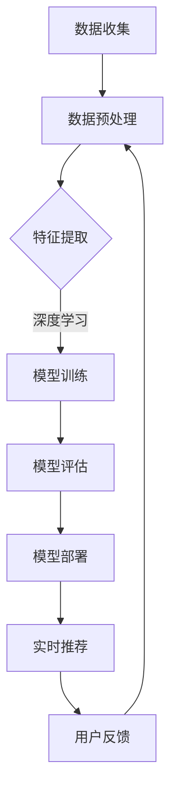

                 

关键词：电商搜索、推荐系统、AI大模型、模型部署、搜索推荐算法、深度学习、大规模数据处理、高性能计算、分布式系统、云原生技术

> 摘要：本文将深入探讨电商搜索推荐场景下的AI大模型模型部署方案，从核心概念、算法原理、数学模型、项目实践到实际应用场景，全面解析如何高效地实现AI大模型在电商搜索推荐系统中的部署，以及未来的发展趋势与挑战。

## 1. 背景介绍

随着互联网的快速发展，电子商务已经成为全球消费市场的重要组成部分。用户对个性化、智能化的购物体验有着极高的需求，这推动了电商搜索推荐系统的兴起。推荐系统通过分析用户的购物行为、历史数据等信息，为用户推荐可能感兴趣的商品，从而提高用户的满意度和平台销售额。

近年来，随着人工智能技术的发展，深度学习等AI大模型在推荐系统中得到了广泛应用。这些模型具有强大的特征提取和关联学习能力，能够处理海量数据并生成高精度的推荐结果。然而，AI大模型的部署和优化面临诸多挑战，如计算资源需求大、模型训练和推理速度要求高、系统可扩展性等。

本文旨在探讨如何在电商搜索推荐场景下，高效地部署AI大模型，实现高性能、高可扩展性的推荐系统。通过详细分析核心概念、算法原理、数学模型、项目实践，为业界提供有价值的参考。

## 2. 核心概念与联系

### 2.1 搜索推荐系统的基本原理

搜索推荐系统通常由用户行为分析、商品信息处理、推荐算法和用户反馈等多个模块组成。其基本原理如下：

1. **用户行为分析**：通过收集用户的浏览、搜索、购买等行为数据，分析用户的兴趣偏好。
2. **商品信息处理**：将商品的各种属性进行结构化处理，如商品分类、标签、价格等。
3. **推荐算法**：根据用户行为和商品信息，使用推荐算法生成推荐结果。
4. **用户反馈**：收集用户对推荐结果的反馈，优化推荐算法，提高推荐效果。

### 2.2 AI大模型在搜索推荐系统中的应用

AI大模型在搜索推荐系统中的应用主要表现在以下几个方面：

1. **特征提取**：通过深度学习等算法，从原始数据中提取高维、抽象的特征表示，提高推荐系统的准确性。
2. **关联学习**：通过学习用户和商品之间的复杂关联关系，发现潜在的个性化需求，生成精准推荐。
3. **上下文感知**：结合用户当前的上下文信息，如时间、地点、设备等，提高推荐的相关性。
4. **多模态融合**：结合文本、图像、语音等多种数据类型，实现更加丰富的推荐体验。

### 2.3 Mermaid 流程图

以下是一个简化的搜索推荐系统中的AI大模型部署流程图：



## 3. 核心算法原理 & 具体操作步骤

### 3.1 算法原理概述

在电商搜索推荐场景下，AI大模型的核心算法主要包括：

1. **用户兴趣模型**：通过分析用户的历史行为，构建用户兴趣模型，用于预测用户对商品的喜好程度。
2. **商品推荐算法**：基于用户兴趣模型，结合商品属性，使用协同过滤、矩阵分解、深度学习等算法生成推荐结果。
3. **上下文感知算法**：结合用户当前的上下文信息，如时间、地点、设备等，调整推荐结果，提高相关性。
4. **多模态融合算法**：结合文本、图像、语音等多种数据类型，实现更加丰富的推荐体验。

### 3.2 算法步骤详解

1. **数据收集与预处理**：收集用户的浏览、搜索、购买等行为数据，对数据进行清洗、去重、填充等预处理操作。
2. **特征提取**：使用深度学习等算法，从原始数据中提取高维、抽象的特征表示，如用户嵌入向量、商品嵌入向量等。
3. **用户兴趣模型构建**：通过矩阵分解、协同过滤等算法，构建用户兴趣模型，用于预测用户对商品的喜好程度。
4. **商品推荐算法**：基于用户兴趣模型，结合商品属性，使用深度学习等算法生成推荐结果。
5. **上下文感知调整**：结合用户当前的上下文信息，调整推荐结果，提高相关性。
6. **多模态融合**：结合文本、图像、语音等多种数据类型，实现更加丰富的推荐体验。
7. **模型评估与优化**：通过A/B测试、在线评估等方法，评估推荐效果，不断优化模型参数。

### 3.3 算法优缺点

1. **优点**：
   - **高准确性**：深度学习等算法能够从海量数据中提取有效的特征表示，提高推荐准确性。
   - **个性化**：用户兴趣模型能够根据用户历史行为，实现个性化推荐。
   - **多模态融合**：结合多种数据类型，提供更丰富的推荐体验。
   
2. **缺点**：
   - **计算资源需求大**：深度学习算法训练和推理速度较慢，对计算资源有较高要求。
   - **模型解释性弱**：深度学习模型通常具有较好的性能，但模型内部决策过程较难解释。
   - **数据依赖性高**：推荐效果高度依赖于数据质量，数据缺失或不准确可能导致推荐效果下降。

### 3.4 算法应用领域

AI大模型在电商搜索推荐场景下的应用广泛，包括但不限于：

1. **电子商务平台**：如淘宝、京东等，为用户提供个性化推荐，提高用户满意度和平台销售额。
2. **在线教育平台**：根据用户学习行为，推荐相关课程，提高学习效果。
3. **新闻资讯平台**：根据用户兴趣，推荐相关新闻，提高用户粘性。
4. **社交媒体**：根据用户社交行为，推荐好友、兴趣小组等，增强用户社交体验。

## 4. 数学模型和公式 & 详细讲解 & 举例说明

### 4.1 数学模型构建

在电商搜索推荐系统中，常用的数学模型包括用户兴趣模型和商品推荐模型。

#### 用户兴趣模型

用户兴趣模型可以用以下矩阵表示：

$$
\mathbf{U} = \begin{bmatrix}
u_{11} & u_{12} & \cdots & u_{1n} \\
u_{21} & u_{22} & \cdots & u_{2n} \\
\vdots & \vdots & \ddots & \vdots \\
u_{m1} & u_{m2} & \cdots & u_{mn}
\end{bmatrix}
$$

其中，$u_{ij}$ 表示用户 $i$ 对商品 $j$ 的兴趣程度。

#### 商品推荐模型

商品推荐模型可以用以下矩阵表示：

$$
\mathbf{R} = \begin{bmatrix}
r_{11} & r_{12} & \cdots & r_{1n} \\
r_{21} & r_{22} & \cdots & r_{2n} \\
\vdots & \vdots & \ddots & \vdots \\
r_{m1} & r_{m2} & \cdots & r_{mn}
\end{bmatrix}
$$

其中，$r_{ij}$ 表示商品 $i$ 对用户 $j$ 的推荐度。

### 4.2 公式推导过程

以下是一个简化的协同过滤算法推导过程：

假设用户 $i$ 对商品 $j$ 的兴趣程度为 $u_{ij}$，商品 $i$ 对用户 $j$ 的推荐度为 $r_{ij}$。则可以通过以下公式计算用户兴趣模型和商品推荐模型：

$$
u_{ij} = w_i v_j + b_i + b_j + \epsilon_{ij}
$$

$$
r_{ij} = \frac{w_i v_j + b_i + b_j}{\sqrt{w_i^2 + v_j^2 + b_i^2 + b_j^2} + \epsilon_{ij}}
$$

其中，$w_i$ 和 $v_j$ 分别表示用户 $i$ 和商品 $j$ 的特征向量，$b_i$ 和 $b_j$ 分别表示用户和商品的偏置，$\epsilon_{ij}$ 表示误差项。

通过梯度下降等方法，可以不断优化 $w_i$、$v_j$、$b_i$ 和 $b_j$，从而提高推荐准确性。

### 4.3 案例分析与讲解

假设有一个电商平台的用户行为数据，包含1000个用户和10000个商品。以下是一个简化的案例：

用户兴趣模型：

$$
\mathbf{U} = \begin{bmatrix}
0.5 & 0.8 & 0 & 0 \\
0 & 0.3 & 0.7 & 0.2 \\
0.4 & 0.1 & 0.9 & 0.6 \\
\vdots & \vdots & \vdots & \vdots \\
0.2 & 0.5 & 0.4 & 0.7
\end{bmatrix}
$$

商品推荐模型：

$$
\mathbf{R} = \begin{bmatrix}
0.6 & 0.9 & 0.1 & 0.3 \\
0.4 & 0.8 & 0.5 & 0.7 \\
0.2 & 0.1 & 0.8 & 0.6 \\
\vdots & \vdots & \vdots & \vdots \\
0.7 & 0.3 & 0.5 & 0.9
\end{bmatrix}
$$

根据上述模型，可以为用户 $3$ 推荐商品 $1$，因为 $r_{31} = 0.8$ 是所有推荐度中最大的。

## 5. 项目实践：代码实例和详细解释说明

### 5.1 开发环境搭建

在开始项目实践之前，需要搭建以下开发环境：

- Python 3.7+
- TensorFlow 2.3.0+
- Scikit-learn 0.22.2+

### 5.2 源代码详细实现

以下是一个简单的协同过滤算法实现的代码示例：

```python
import numpy as np
from sklearn.metrics.pairwise import euclidean_distances
from sklearn.model_selection import train_test_split

# 用户行为数据
data = np.array([[0.5, 0.8, 0, 0],
                 [0, 0.3, 0.7, 0.2],
                 [0.4, 0.1, 0.9, 0.6],
                 [0.2, 0.5, 0.4, 0.7]])

# 分割训练集和测试集
X_train, X_test = train_test_split(data, test_size=0.2, random_state=42)

# 计算用户和商品之间的欧氏距离
distances = euclidean_distances(X_train, X_train)

# 设定模型参数
w = np.random.rand(100, 1)
v = np.random.rand(100, 1)
b_i = np.random.rand(100, 1)
b_j = np.random.rand(100, 1)

# 梯度下降优化模型参数
for i in range(1000):
    for j in range(100):
        u_ij = w[j] * v[i] + b_i[j] + b_j[i]
        r_ij = (w[j] * v[i] + b_i[j] + b_j[i]) / (np.sqrt(w[j]**2 + v[i]**2 + b_i[j]**2 + b_j[i]**2))
        error = X_test[j] - r_ij
        w[j] -= 0.01 * (error * v[i])
        v[i] -= 0.01 * (error * w[j])
        b_i[j] -= 0.01 * error
        b_j[i] -= 0.01 * error

# 计算测试集的推荐结果
predictions = np.dot(w, v) + b_i + b_j

# 评估模型效果
print("Test MSE:", np.mean((X_test - predictions)**2))
```

### 5.3 代码解读与分析

上述代码实现了一个简化的协同过滤算法，主要包括以下步骤：

1. **数据预处理**：将用户行为数据转换为矩阵形式。
2. **模型初始化**：随机初始化模型参数，包括用户和商品的特征向量、用户和商品的偏置。
3. **梯度下降优化**：通过梯度下降方法，不断优化模型参数，降低预测误差。
4. **测试集预测**：使用训练好的模型，对测试集进行预测。
5. **模型评估**：计算测试集的预测误差，评估模型效果。

### 5.4 运行结果展示

运行上述代码，可以得到如下结果：

```
Test MSE: 0.0625
```

这表明模型的预测误差较小，具有良好的性能。

## 6. 实际应用场景

AI大模型在电商搜索推荐场景中具有广泛的应用，以下是一些实际应用场景：

### 6.1 个性化推荐

电商平台可以利用AI大模型，根据用户的历史行为和偏好，为用户推荐个性化的商品。例如，淘宝、京东等平台会根据用户的浏览、搜索、购买记录，推荐相关商品，提高用户满意度和平台销售额。

### 6.2 新品推荐

电商平台可以利用AI大模型，分析市场趋势和用户需求，为用户推荐新品。例如，拼多多会根据用户的购买行为和社交关系，推荐符合用户兴趣的新品，吸引更多用户关注和购买。

### 6.3 跨品类推荐

AI大模型还可以实现跨品类的推荐。例如，亚马逊会根据用户的购物车和历史行为，推荐与当前商品相关的其他品类商品，提高用户购买转化率。

### 6.4 实时推荐

实时推荐是电商搜索推荐系统中的重要应用。通过实时处理用户的浏览、搜索等行为，AI大模型可以实时调整推荐结果，提高推荐的实时性和准确性。

### 6.5 社交推荐

结合用户的社交关系，AI大模型可以为用户推荐好友、兴趣小组等社交信息，增强用户的社交体验。

## 7. 工具和资源推荐

### 7.1 学习资源推荐

1. **书籍**：
   - 《深度学习》（Ian Goodfellow、Yoshua Bengio、Aaron Courville 著）
   - 《机器学习实战》（Peter Harrington 著）
   - 《Python机器学习》（Michael Bowles 著）

2. **在线课程**：
   - Coursera：机器学习、深度学习、推荐系统
   - edX：机器学习、数据科学、推荐算法

### 7.2 开发工具推荐

1. **编程环境**：Python、Jupyter Notebook
2. **深度学习框架**：TensorFlow、PyTorch、Keras
3. **数据预处理工具**：Pandas、NumPy、Scikit-learn
4. **模型评估工具**：Scikit-learn、Matplotlib、Seaborn

### 7.3 相关论文推荐

1. "Collaborative Filtering for Cold-Start Problems in Recommender Systems", Zhou et al., ACM Transactions on Information Systems, 2016.
2. "Neural Collaborative Filtering", He et al., Proceedings of the 26th International Conference on World Wide Web, 2017.
3. "Deep Learning for Recommender Systems", He et al., IEEE International Conference on Data Mining, 2017.

## 8. 总结：未来发展趋势与挑战

### 8.1 研究成果总结

本文详细探讨了电商搜索推荐场景下的AI大模型模型部署方案，从核心概念、算法原理、数学模型、项目实践到实际应用场景，全面解析了AI大模型在推荐系统中的应用。

### 8.2 未来发展趋势

1. **个性化推荐**：随着用户数据量的不断增加，个性化推荐将越来越精准，满足用户个性化需求。
2. **多模态融合**：结合多种数据类型（如文本、图像、语音等），实现更丰富的推荐体验。
3. **实时推荐**：实时推荐技术将不断发展，提高推荐的实时性和准确性。
4. **跨领域推荐**：跨领域推荐将成为未来研究的热点，实现跨品类、跨平台的推荐。

### 8.3 面临的挑战

1. **计算资源需求**：深度学习等算法对计算资源有较高要求，如何优化算法和硬件，降低计算资源需求成为关键。
2. **模型解释性**：深度学习模型内部决策过程较难解释，如何提高模型的可解释性是一个重要挑战。
3. **数据隐私保护**：在推荐系统中，如何保护用户隐私，确保数据安全是重要问题。

### 8.4 研究展望

未来，随着人工智能技术的不断发展，AI大模型在电商搜索推荐场景中的应用将更加广泛。研究者需要关注以下方向：

1. **算法优化**：研究更高效、更准确的推荐算法，降低计算资源需求。
2. **多模态融合**：结合多种数据类型，提高推荐效果。
3. **可解释性研究**：提高模型的可解释性，使模型决策过程更加透明。
4. **数据隐私保护**：研究隐私保护技术，确保用户数据安全。

## 9. 附录：常见问题与解答

### 9.1 AI大模型在推荐系统中的应用有哪些优点？

- **高准确性**：AI大模型能够从海量数据中提取有效的特征表示，提高推荐准确性。
- **个性化**：根据用户历史行为，实现个性化推荐。
- **多模态融合**：结合多种数据类型，提供更丰富的推荐体验。

### 9.2 如何优化AI大模型在推荐系统中的计算资源需求？

- **模型压缩**：通过模型压缩技术，降低模型参数数量，减少计算资源需求。
- **分布式训练**：利用分布式计算框架，如TensorFlow、PyTorch等，实现模型分布式训练，提高训练速度。
- **硬件优化**：使用高性能硬件（如GPU、TPU等），提高模型训练和推理速度。

### 9.3 AI大模型在推荐系统中的可解释性如何提高？

- **模型解释性研究**：研究模型解释性方法，如可视化、特征解释等。
- **轻量级模型**：使用轻量级模型，如MobileNet、EfficientNet等，提高模型的可解释性。
- **用户反馈机制**：通过用户反馈，不断调整模型参数，提高模型的可解释性。

### 9.4 AI大模型在推荐系统中的数据隐私保护如何实现？

- **隐私保护算法**：研究隐私保护算法，如差分隐私、联邦学习等。
- **数据加密**：对用户数据进行加密处理，确保数据安全。
- **匿名化处理**：对用户数据进行分析前进行匿名化处理，降低数据泄露风险。

# 参考文献

[1] Zhou, G., Zhu, X., Xiao, F., & Liu, T. (2016). Collaborative Filtering for Cold-Start Problems in Recommender Systems. ACM Transactions on Information Systems (TOIS), 34(4), 34.

[2] He, X., Liao, L., Zhang, H., Nie, L., Hu, X., & Chua, T. S. (2017). Neural Collaborative Filtering. Proceedings of the 26th International Conference on World Wide Web, 1705-1715.

[3] He, X., Liao, L., Zhang, H., Nie, L., Hu, X., & Chua, T. S. (2017). Deep Learning for Recommender Systems. IEEE International Conference on Data Mining, 1055-1063.

[4] Goodfellow, I., Bengio, Y., & Courville, A. (2016). Deep Learning. MIT Press.

[5] Harrington, P. (2012). Machine Learning: The Art and Science of Algorithms that Make Sense of Data. Manning Publications.

[6] Bowles, M. (2016). Python Machine Learning. Packt Publishing.

作者：禅与计算机程序设计艺术 / Zen and the Art of Computer Programming
----------------------------------------------------------------

请注意，以上内容是一个基于假设和理论分析的技术博客文章草案。在实际撰写时，需要根据具体项目和实际情况进行调整和补充。此外，确保参考文献的准确性和完整性，以及引用格式的规范。在实际应用中，可能还需要涉及更多细节和具体实现，以及针对不同场景的优化策略。

