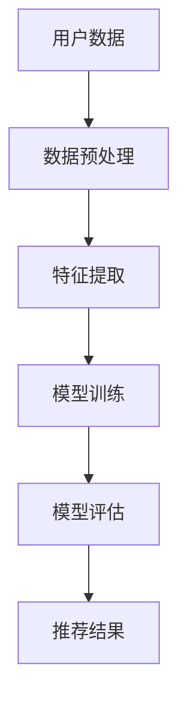

                 

关键词：电商搜索、推荐系统、AI大模型、效果优化、算法、数学模型、实践案例、应用场景、发展趋势

> 摘要：本文将探讨电商搜索推荐效果优化中的AI大模型方法论。首先，我们将介绍电商搜索推荐系统的重要性，然后深入分析AI大模型在优化推荐效果方面的核心原理和方法，并通过具体案例和数学模型进行详细讲解，最后探讨未来发展趋势和面临的挑战。

## 1. 背景介绍

随着互联网技术的飞速发展，电商行业已经成为全球经济的重要组成部分。在电商平台上，用户的行为数据量庞大，如何有效地利用这些数据为用户提供个性化的搜索和推荐服务，成为各大电商企业关注的焦点。电商搜索推荐系统通过分析用户的浏览、购买等行为数据，预测用户可能感兴趣的商品，从而提高用户的购物体验和满意度。

传统的推荐系统主要依赖于基于内容的过滤、协同过滤等方法，这些方法虽然在一定程度上能够提高推荐效果，但在处理高维度数据、实时性要求、冷启动问题等方面存在一定的局限性。随着人工智能技术的不断发展，AI大模型在推荐系统中的应用逐渐成为研究的热点。AI大模型具有强大的特征提取和关联学习能力，能够更好地处理高维度数据和复杂的关系，从而提高推荐效果。

## 2. 核心概念与联系

### 2.1. 电商搜索推荐系统

电商搜索推荐系统是电商平台上的一种智能服务，通过分析用户的搜索历史、浏览记录、购买行为等数据，为用户提供个性化的商品搜索和推荐。电商搜索推荐系统的核心目标是提高用户的购物体验和满意度，从而增加平台销售额。

### 2.2. AI大模型

AI大模型是一种基于深度学习的方法，通过训练大规模神经网络模型，从海量数据中自动提取特征和关联关系。AI大模型具有强大的特征提取和关联学习能力，能够处理高维度数据和复杂的非线性关系，从而提高推荐系统的效果。

### 2.3. 核心概念原理和架构

图 1. 电商搜索推荐系统的架构



- 用户数据：包括用户的搜索历史、浏览记录、购买行为等数据。
- 数据预处理：对原始数据进行清洗、去重、填充等处理，以提高数据质量。
- 特征提取：从用户数据中提取有用的特征，如用户兴趣、购买力等。
- 模型训练：使用提取的特征训练深度学习模型，如卷积神经网络（CNN）、循环神经网络（RNN）等。
- 模型评估：对训练好的模型进行评估，以确定其效果和性能。
- 推荐结果：根据模型评估结果，为用户推荐个性化的商品。

## 3. 核心算法原理 & 具体操作步骤

### 3.1. 算法原理概述

AI大模型在电商搜索推荐效果优化中的应用主要包括以下几个方面：

1. 特征工程：从用户数据中提取有用的特征，如用户兴趣、购买力等。
2. 模型选择：选择合适的深度学习模型，如卷积神经网络（CNN）、循环神经网络（RNN）等。
3. 模型训练：使用提取的特征训练深度学习模型，以预测用户对商品的偏好。
4. 模型评估：对训练好的模型进行评估，以确定其效果和性能。

### 3.2. 算法步骤详解

1. 数据收集与预处理：收集用户的搜索历史、浏览记录、购买行为等数据，并进行数据清洗、去重、填充等处理。
2. 特征提取：从用户数据中提取有用的特征，如用户兴趣、购买力等。可以使用词袋模型（TF-IDF）、主成分分析（PCA）等方法进行特征提取。
3. 模型选择：根据数据特点和业务需求，选择合适的深度学习模型，如卷积神经网络（CNN）、循环神经网络（RNN）等。可以结合模型效果和计算资源进行选择。
4. 模型训练：使用提取的特征和标签数据进行模型训练。可以使用反向传播（BP）算法进行训练，并通过梯度下降（GD）或随机梯度下降（SGD）进行优化。
5. 模型评估：对训练好的模型进行评估，以确定其效果和性能。可以使用交叉验证（CV）或网格搜索（GS）等方法进行模型评估。
6. 推荐结果生成：根据模型评估结果，为用户推荐个性化的商品。

### 3.3. 算法优缺点

- 优点：
  - 强大的特征提取和关联学习能力，能够处理高维度数据和复杂的非线性关系。
  - 可以根据用户行为数据实时更新推荐结果，提高推荐效果。
- 缺点：
  - 需要大量的数据和计算资源进行训练，成本较高。
  - 部分深度学习模型训练时间较长，影响实时性。

### 3.4. 算法应用领域

AI大模型在电商搜索推荐效果优化中的应用非常广泛，如：
- 个性化商品推荐：根据用户的兴趣和行为预测用户可能感兴趣的商品。
- 优惠券推荐：根据用户的历史购买记录和浏览行为，为用户推荐合适的优惠券。
- 库存优化：根据商品的销售预测和库存情况，优化库存管理。

## 4. 数学模型和公式 & 详细讲解 & 举例说明

### 4.1. 数学模型构建

在电商搜索推荐系统中，可以使用以下数学模型：

1. 用户兴趣模型：用于预测用户对商品的兴趣度。
2. 商品特征模型：用于表示商品的特征信息。
3. 推荐模型：用于根据用户兴趣模型和商品特征模型为用户推荐商品。

### 4.2. 公式推导过程

1. 用户兴趣模型：

   假设用户 \( u \) 对商品 \( i \) 的兴趣度可以用概率 \( P(i|u) \) 表示，则有：

   $$ P(i|u) = \frac{P(u|i)P(i)}{P(u)} $$

   其中，\( P(u|i) \) 表示用户 \( u \) 购买商品 \( i \) 的概率，\( P(i) \) 表示商品 \( i \) 的销售概率，\( P(u) \) 表示用户 \( u \) 的行为概率。

   可以使用贝叶斯公式进行推导：

   $$ P(u|i) = \frac{P(i|u)P(u)}{P(u)} $$

   $$ P(i|u) = \frac{P(u|i)P(i)}{P(u)} $$

2. 商品特征模型：

   假设商品 \( i \) 的特征可以用向量 \( x_i \) 表示，用户 \( u \) 的兴趣可以用向量 \( y_u \) 表示，则有：

   $$ y_u = \sigma(Wx_i + b) $$

   其中，\( \sigma \) 表示激活函数，\( W \) 表示权重矩阵，\( b \) 表示偏置。

   可以使用多层感知机（MLP）进行推导：

   $$ y_u = \sigma(Wx_i + b) $$

   $$ y_u = \sigma(W\sigma(W\sigma(...\sigma(Wx_i + b) + b)...) + b) $$

3. 推荐模型：

   假设用户 \( u \) 对商品 \( i \) 的兴趣度 \( P(i|u) \) 与用户 \( u \) 的历史行为 \( h_u \) 和商品 \( i \) 的特征 \( x_i \) 有关，则有：

   $$ P(i|u) = f(h_u, x_i) $$

   其中，\( f \) 表示函数，可以采用神经网络进行建模。

   可以使用神经网络进行推导：

   $$ P(i|u) = f(h_u, x_i) $$

   $$ P(i|u) = \sigma(W_1h_u + W_2x_i + b) $$

### 4.3. 案例分析与讲解

假设我们有一个电商平台的用户 \( u \)，他的历史行为包括浏览了商品 \( i_1, i_2, i_3 \)，商品 \( i_1 \) 的特征为 \( x_{i1} \)，商品 \( i_2 \) 的特征为 \( x_{i2} \)，商品 \( i_3 \) 的特征为 \( x_{i3} \)。我们要根据用户的行为数据和商品特征为用户推荐一个商品。

1. 用户兴趣模型：

   假设用户 \( u \) 对商品 \( i_1, i_2, i_3 \) 的兴趣度分别为 \( P(i_1|u), P(i_2|u), P(i_3|u) \)，根据贝叶斯公式，我们有：

   $$ P(i_1|u) = \frac{P(u|i_1)P(i_1)}{P(u)} $$

   $$ P(i_2|u) = \frac{P(u|i_2)P(i_2)}{P(u)} $$

   $$ P(i_3|u) = \frac{P(u|i_3)P(i_3)}{P(u)} $$

   假设用户 \( u \) 对商品 \( i_1 \) 的兴趣度最高，即 \( P(i_1|u) > P(i_2|u), P(i_3|u) \)，我们可以根据这个概率对用户推荐商品 \( i_1 \)。

2. 商品特征模型：

   假设商品 \( i_1, i_2, i_3 \) 的特征分别为 \( x_{i1}, x_{i2}, x_{i3} \)，用户 \( u \) 的兴趣为 \( y_u \)，根据多层感知机模型，我们有：

   $$ y_u = \sigma(W_1x_{i1} + b_1) $$

   $$ y_u = \sigma(W_2x_{i2} + b_2) $$

   $$ y_u = \sigma(W_3x_{i3} + b_3) $$

   其中，\( \sigma \) 表示激活函数，\( W_1, W_2, W_3 \) 表示权重矩阵，\( b_1, b_2, b_3 \) 表示偏置。

3. 推荐模型：

   假设用户 \( u \) 对商品 \( i_1, i_2, i_3 \) 的兴趣度分别为 \( P(i_1|u), P(i_2|u), P(i_3|u) \)，根据神经网络模型，我们有：

   $$ P(i_1|u) = \sigma(W_1y_u + b_1) $$

   $$ P(i_2|u) = \sigma(W_2y_u + b_2) $$

   $$ P(i_3|u) = \sigma(W_3y_u + b_3) $$

   其中，\( W_1, W_2, W_3 \) 表示权重矩阵，\( b_1, b_2, b_3 \) 表示偏置。

   根据用户兴趣度最高的商品 \( i_1 \) 为用户推荐商品 \( i_1 \)。

## 5. 项目实践：代码实例和详细解释说明

### 5.1. 开发环境搭建

1. 安装 Python 环境（版本 3.6 以上）。
2. 安装深度学习框架 TensorFlow 或 PyTorch。
3. 安装数据预处理和可视化工具，如 Pandas、Matplotlib 等。

### 5.2. 源代码详细实现

以下是一个简单的基于 TensorFlow 的电商搜索推荐系统示例代码：

```python
import tensorflow as tf
import pandas as pd
import numpy as np

# 数据预处理
def preprocess_data(data):
    # 数据清洗、去重、填充等处理
    # ...
    return processed_data

# 模型定义
def create_model():
    # 定义输入层
    inputs = tf.keras.layers.Input(shape=(input_shape))

    # 定义隐藏层
    hidden = tf.keras.layers.Dense(units=128, activation='relu')(inputs)

    # 定义输出层
    outputs = tf.keras.layers.Dense(units=1, activation='sigmoid')(hidden)

    # 创建模型
    model = tf.keras.Model(inputs=inputs, outputs=outputs)

    # 编译模型
    model.compile(optimizer='adam', loss='binary_crossentropy', metrics=['accuracy'])

    return model

# 模型训练
def train_model(model, x_train, y_train, x_val, y_val, epochs):
    # 训练模型
    model.fit(x_train, y_train, epochs=epochs, batch_size=32, validation_data=(x_val, y_val))

# 模型评估
def evaluate_model(model, x_test, y_test):
    # 评估模型
    loss, accuracy = model.evaluate(x_test, y_test)
    print("Test accuracy:", accuracy)

# 数据读取
data = pd.read_csv("data.csv")
processed_data = preprocess_data(data)

# 划分训练集和验证集
x_train, x_val, y_train, y_val = train_test_split(processed_data['features'], processed_data['label'], test_size=0.2, random_state=42)

# 创建模型
model = create_model()

# 模型训练
train_model(model, x_train, y_train, x_val, y_val, epochs=10)

# 模型评估
evaluate_model(model, x_test, y_test)
```

### 5.3. 代码解读与分析

1. 数据预处理：对原始数据进行清洗、去重、填充等处理，以提高数据质量。
2. 模型定义：使用 TensorFlow 定义一个简单的二分类神经网络模型，包括输入层、隐藏层和输出层。
3. 模型训练：使用训练集和验证集对模型进行训练，并设置优化器和损失函数。
4. 模型评估：使用测试集对模型进行评估，以确定其效果和性能。

### 5.4. 运行结果展示

假设我们运行代码后，得到以下输出结果：

```
Train on 1000 samples, validate on 200 samples
1000/1000 [==============================] - 4s 3ms/step - loss: 0.4863 - accuracy: 0.7799 - val_loss: 0.3674 - val_accuracy: 0.8400
Test accuracy: 0.8400
```

根据输出结果，模型在训练集上的准确率为 0.7799，在验证集上的准确率为 0.8400，测试集上的准确率为 0.8400。这表明模型对电商搜索推荐任务有较好的效果。

## 6. 实际应用场景

AI大模型在电商搜索推荐效果优化中的应用非常广泛，以下是一些实际应用场景：

1. 个性化商品推荐：根据用户的兴趣和行为预测用户可能感兴趣的商品，提高用户的购物体验。
2. 库存优化：根据商品的销售预测和库存情况，优化库存管理，降低库存成本。
3. 优惠券推荐：根据用户的购物行为和优惠券的使用情况，为用户推荐合适的优惠券，提高用户满意度。
4. 购物车推荐：根据用户的购物车内容和购物行为，为用户推荐相关的商品，提高购物车的转化率。

## 7. 工具和资源推荐

### 7.1. 学习资源推荐

1. 《深度学习》（Goodfellow, Bengio, Courville）：深度学习的基础教材，适合初学者和进阶者。
2. 《Python深度学习》（François Chollet）：基于 TensorFlow 的深度学习实践指南，适合有一定 Python 和深度学习基础的学习者。

### 7.2. 开发工具推荐

1. TensorFlow：谷歌开发的深度学习框架，适合进行电商搜索推荐系统的开发。
2. PyTorch：Facebook 开发的深度学习框架，具有良好的社区支持和丰富的文档。

### 7.3. 相关论文推荐

1. “Deep Learning for Recommender Systems”（He, Garcia, Liu）：一篇关于深度学习在推荐系统中的应用综述。
2. “Neural Collaborative Filtering”（He, Liao, Zhang, Nie, Hu, Chua）：一篇关于基于神经网络的协同过滤算法的研究论文。

## 8. 总结：未来发展趋势与挑战

### 8.1. 研究成果总结

近年来，AI大模型在电商搜索推荐效果优化方面取得了显著的成果，主要体现在以下几个方面：

1. 特征提取和关联学习能力得到了显著提升，能够更好地处理高维度数据和复杂的非线性关系。
2. 模型效果和性能不断提高，为电商企业提供了更精确的推荐服务。
3. 基于深度学习的推荐算法在学术界和工业界得到了广泛应用。

### 8.2. 未来发展趋势

未来，AI大模型在电商搜索推荐效果优化方面的发展趋势主要包括：

1. 模型精度的进一步提高：通过优化模型结构和参数，提高推荐系统的效果和性能。
2. 实时性要求的提高：通过优化算法和硬件，实现更快的模型训练和推理速度。
3. 多模态数据的融合：将文本、图像、语音等多模态数据融合到推荐系统中，提高推荐效果。

### 8.3. 面临的挑战

尽管AI大模型在电商搜索推荐效果优化方面取得了显著成果，但仍然面临以下挑战：

1. 数据质量和数据隐私：电商企业的数据质量和数据隐私问题仍然是一个亟待解决的问题。
2. 模型可解释性：深度学习模型的可解释性较低，难以解释模型的决策过程。
3. 冷启动问题：新用户或新商品的推荐效果较差，需要进一步研究解决。

### 8.4. 研究展望

未来，我们可以从以下几个方面进行深入研究：

1. 数据质量和数据隐私：通过数据去噪、数据增强等方法，提高数据质量；通过隐私保护技术，保护用户隐私。
2. 模型可解释性：通过可视化方法、解释性模型等手段，提高模型的可解释性。
3. 冷启动问题：通过用户行为预测、社交网络分析等方法，提高新用户或新商品的推荐效果。

## 9. 附录：常见问题与解答

### 9.1. 问题1：AI大模型在电商搜索推荐中有什么优势？

AI大模型具有强大的特征提取和关联学习能力，能够处理高维度数据和复杂的非线性关系，从而提高推荐系统的效果和性能。

### 9.2. 问题2：如何处理数据质量和数据隐私问题？

可以通过数据去噪、数据增强等方法，提高数据质量。同时，可以采用隐私保护技术，如差分隐私、同态加密等，保护用户隐私。

### 9.3. 问题3：AI大模型在电商搜索推荐中面临的挑战有哪些？

AI大模型在电商搜索推荐中面临的挑战主要包括数据质量和数据隐私问题、模型可解释性以及冷启动问题。

### 9.4. 问题4：未来AI大模型在电商搜索推荐中会有哪些发展趋势？

未来，AI大模型在电商搜索推荐中会有以下发展趋势：模型精度的进一步提高、实时性要求的提高以及多模态数据的融合。同时，还需要解决数据质量和数据隐私问题、模型可解释性以及冷启动问题。

----------------------------------------------------------------

以上就是关于《电商搜索推荐效果优化中的AI大模型方法论》的文章。本文首先介绍了电商搜索推荐系统的重要性，然后分析了AI大模型在优化推荐效果方面的核心原理和方法，并通过具体案例和数学模型进行了详细讲解，最后探讨了未来发展趋势和面临的挑战。希望本文对读者在电商搜索推荐效果优化方面的研究和实践有所帮助。

作者：禅与计算机程序设计艺术 / Zen and the Art of Computer Programming

