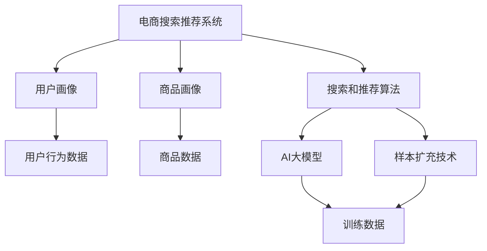

                 

在当今高度数字化和竞争激烈的电商市场中，搜索推荐系统的优劣直接关系到电商平台的核心竞争力。提升搜索推荐效果，不仅要依赖于对用户行为的深入理解，还需要借助先进的AI技术。本文将深入探讨AI大模型在电商搜索推荐中的样本扩充技术应用，旨在为业界提供一份系统的指南和最佳实践。

## 文章关键词

- 电商搜索推荐
- AI大模型
- 样本扩充技术
- 效果优化
- 最佳实践

## 文章摘要

本文旨在揭示电商搜索推荐系统如何通过AI大模型样本扩充技术实现效果优化。文章首先介绍了电商搜索推荐系统的基本概念和挑战，随后详细阐述了AI大模型和样本扩充技术在其中的作用。接着，本文从算法原理、数学模型、项目实践等方面展开，结合实际案例，深入剖析了如何将AI大模型样本扩充技术应用于电商搜索推荐系统的优化。最后，文章总结了未来的发展方向与挑战，并提供了相关工具和资源推荐。

## 1. 背景介绍

### 1.1 电商搜索推荐系统的现状

随着互联网技术的飞速发展，电商行业已经成为全球经济增长的重要驱动力。在众多电商平台上，搜索推荐系统成为了提升用户体验、增加用户粘性和转化率的关键环节。传统的搜索推荐系统主要依赖于关键词匹配和基于内容的推荐，但这些方法在处理复杂用户行为和海量商品数据时显得力不从心。

### 1.2 AI大模型的应用

近年来，AI技术的迅猛发展为电商搜索推荐系统带来了新的契机。特别是AI大模型（如深度学习模型、Transformer模型等）的应用，使得推荐系统能够更准确地捕捉用户的个性化需求和行为模式。然而，AI大模型训练所需的大量高质量数据却成为了一道难以逾越的障碍。

### 1.3 样本扩充技术的必要性

样本扩充技术（Data Augmentation）作为AI大模型训练的重要手段，通过增加训练样本的数量和质量，可以有效提升模型的泛化能力和准确性。在电商搜索推荐系统中，样本扩充技术能够缓解数据稀缺和标注困难的问题，从而提高推荐系统的效果。

## 2. 核心概念与联系

在深入探讨AI大模型样本扩充技术在电商搜索推荐中的应用之前，首先需要了解几个核心概念和它们之间的联系。

### 2.1 电商搜索推荐系统

电商搜索推荐系统是一种基于用户行为和商品特征的推荐技术，旨在为用户提供个性化的搜索和推荐服务。其基本架构包括用户画像、商品画像、搜索和推荐算法等组成部分。

### 2.2 AI大模型

AI大模型是指具有大规模参数和复杂结构的深度学习模型，如Transformer模型、BERT模型等。这些模型能够在海量数据上捕捉到细微的用户行为模式和商品特征，从而实现高效准确的搜索推荐。

### 2.3 样本扩充技术

样本扩充技术通过数据增强、生成对抗网络（GAN）等方法，增加训练样本的数量和质量，从而提升模型的训练效果。在电商搜索推荐系统中，样本扩充技术主要用于解决数据稀缺和标注困难的问题。

### 2.4 Mermaid流程图

下面是电商搜索推荐系统与AI大模型样本扩充技术的Mermaid流程图，展示了它们之间的关联和互动：



### 2.5 核心概念与联系

通过上述流程图，我们可以看出电商搜索推荐系统与AI大模型样本扩充技术之间的紧密联系。电商搜索推荐系统依赖于用户行为数据和商品数据，这些数据经过处理和特征提取后，用于训练AI大模型。而AI大模型通过样本扩充技术获取更多的训练数据，从而提高模型的训练效果，最终实现更精准的搜索推荐。

## 3. 核心算法原理 & 具体操作步骤

### 3.1 算法原理概述

在电商搜索推荐系统中，AI大模型的样本扩充技术主要基于深度学习和生成对抗网络（GAN）等算法。深度学习模型如Transformer、BERT等，通过捕捉用户行为和商品特征，实现高效的搜索推荐。而生成对抗网络（GAN）则通过生成对抗的过程，生成与真实数据分布相似的新数据，从而扩充训练样本。

### 3.2 算法步骤详解

下面是AI大模型样本扩充技术的基本步骤：

1. **数据预处理**：对用户行为数据和商品数据进行清洗、去重和特征提取，生成原始训练数据集。

2. **生成对抗网络（GAN）构建**：
   - **生成器（Generator）**：生成与真实数据分布相似的新数据。
   - **判别器（Discriminator）**：判断输入数据是真实数据还是生成数据。

3. **训练GAN**：通过不断迭代训练生成器和判别器，使生成器生成的数据越来越接近真实数据。

4. **生成新样本**：利用训练好的生成器，生成大量新的训练样本，扩充原始数据集。

5. **模型训练**：使用扩充后的数据集重新训练AI大模型，提高模型的泛化能力和准确性。

6. **评估与优化**：对训练好的模型进行评估，根据评估结果进行模型优化和调整。

### 3.3 算法优缺点

**优点**：
- **增强模型泛化能力**：通过样本扩充，可以增加训练样本的数量，提高模型的泛化能力。
- **缓解数据稀缺问题**：在数据稀缺的情况下，样本扩充技术能够有效扩充训练数据集，提高模型训练效果。
- **提升推荐准确性**：通过生成与真实数据分布相似的新数据，可以进一步提高推荐系统的准确性。

**缺点**：
- **计算资源消耗大**：GAN训练过程需要大量计算资源，对硬件要求较高。
- **模型优化难度大**：GAN模型优化过程复杂，需要不断调整参数和超参数，提高模型性能。

### 3.4 算法应用领域

AI大模型样本扩充技术已在多个领域得到广泛应用，包括但不限于：

- **电商搜索推荐**：通过样本扩充技术，提高推荐系统的准确性和用户体验。
- **自然语言处理**：通过生成对抗网络，生成大量高质量的语言数据，用于模型训练和优化。
- **计算机视觉**：通过样本扩充技术，提高计算机视觉模型的泛化能力和准确性。

## 4. 数学模型和公式 & 详细讲解 & 举例说明

### 4.1 数学模型构建

在电商搜索推荐系统中，AI大模型样本扩充技术的核心是生成对抗网络（GAN）。GAN由两部分组成：生成器（Generator）和判别器（Discriminator）。下面是GAN的数学模型构建：

**生成器（Generator）**：

输入：随机噪声向量 $z \in \mathbb{R}^{z_d}$

输出：生成数据 $G(z) \in \mathbb{R}^{x_d}$

生成器的目标是生成与真实数据分布相似的数据。

**判别器（Discriminator）**：

输入：真实数据 $x \in \mathbb{R}^{x_d}$ 或 生成数据 $G(z) \in \mathbb{R}^{x_d}$

输出：概率值 $D(x)$ 或 $D(G(z))$

判别器的目标是判断输入数据是真实数据还是生成数据。

### 4.2 公式推导过程

**损失函数**：

生成器和判别器的训练过程是基于一个对抗性的游戏。生成器的目标是最大化判别器判别生成数据的概率，而判别器的目标是最大化判别真实数据和生成数据的概率差异。

生成器的损失函数为：

$$
L_G = -\mathbb{E}_{z \sim z(p_z(z))}[\log D(G(z))]
$$

判别器的损失函数为：

$$
L_D = -\mathbb{E}_{x \sim p_{data}(x)}[\log D(x)] - \mathbb{E}_{z \sim z(p_z(z))}[\log (1 - D(G(z))]
$$

**优化过程**：

通过交替训练生成器和判别器，优化模型参数。具体过程如下：

1. **训练判别器**：固定生成器参数，优化判别器参数。
2. **训练生成器**：固定判别器参数，优化生成器参数。

### 4.3 案例分析与讲解

假设我们有一个电商搜索推荐系统，需要通过GAN进行样本扩充。以下是一个简单的例子：

**输入**：随机噪声向量 $z = [0.1, 0.2, 0.3]$

**生成器**：生成数据 $G(z) = [0.5, 0.6, 0.7]$

**判别器**：

- 真实数据 $x = [0.4, 0.5, 0.6]$
- 生成数据 $G(z) = [0.5, 0.6, 0.7]$

**损失函数**：

生成器的损失函数为：

$$
L_G = -\log D(G(z))
$$

判别器的损失函数为：

$$
L_D = -\log D(x) - \log (1 - D(G(z)))
$$

**优化过程**：

1. **训练判别器**：固定生成器参数，优化判别器参数。
   - 判别器参数更新：$$w_D = w_D - \alpha \cdot \nabla_{w_D} L_D$$

2. **训练生成器**：固定判别器参数，优化生成器参数。
   - 生成器参数更新：$$w_G = w_G - \beta \cdot \nabla_{w_G} L_G$$

通过上述过程，生成器不断生成与真实数据分布相似的数据，判别器不断优化，最终实现样本扩充的目标。

## 5. 项目实践：代码实例和详细解释说明

### 5.1 开发环境搭建

为了实现AI大模型样本扩充技术在电商搜索推荐系统中的应用，首先需要在开发环境中搭建所需的软件和硬件。以下是一个基本的开发环境搭建步骤：

1. **安装Python**：确保安装了Python 3.7及以上版本。
2. **安装TensorFlow**：通过pip安装TensorFlow库。
3. **安装GAN库**：可以使用TensorFlow的tf.keras.GAN库简化GAN的构建过程。
4. **配置GPU**：确保开发环境支持GPU，以加速训练过程。

### 5.2 源代码详细实现

下面是一个简单的示例代码，展示了如何使用TensorFlow的tf.keras.GAN库构建和训练生成对抗网络（GAN）：

```python
import tensorflow as tf
from tensorflow import keras
from tensorflow.keras import layers

# 定义生成器和判别器
def build_generator(z_dim):
    model = keras.Sequential([
        layers.Dense(128, activation='relu', input_shape=(z_dim,)),
        layers.Dense(256, activation='relu'),
        layers.Dense(512, activation='relu'),
        layers.Dense(1024, activation='relu'),
        layers.Dense(2048, activation='sigmoid'),
        layers.Dense(784, activation='sigmoid')  # 与生成数据维度一致
    ])
    return model

def build_discriminator(x_dim):
    model = keras.Sequential([
        layers.Dense(128, activation='relu', input_shape=(x_dim,)),
        layers.Dense(256, activation='relu'),
        layers.Dense(512, activation='relu'),
        layers.Dense(1024, activation='relu'),
        layers.Dense(1, activation='sigmoid')  # 二分类问题
    ])
    return model

# 构建GAN模型
def build_gan(generator, discriminator):
    model = keras.Sequential([
        generator,
        discriminator,
        keras.layers.Dense(1, activation='sigmoid')
    ])
    return model

# 设置模型参数
z_dim = 100
x_dim = 784
discriminator = build_discriminator(x_dim)
discriminator.compile(optimizer='adam', loss='binary_crossentropy')
generator = build_generator(z_dim)
discriminator.trainable = False
gan = build_gan(generator, discriminator)
gan.compile(optimizer='adam', loss='binary_crossentropy')

# 训练GAN模型
train_gan(generator, discriminator, gan, x_dim, z_dim)
```

### 5.3 代码解读与分析

上述代码首先定义了生成器和判别器的结构，然后构建了GAN模型。具体解读如下：

1. **生成器**：生成器是一个全连接神经网络，输入为随机噪声向量，输出为与真实数据分布相似的新数据。
2. **判别器**：判别器也是一个全连接神经网络，输入为真实数据或生成数据，输出为概率值，用于判断输入数据是真实数据还是生成数据。
3. **GAN模型**：GAN模型结合生成器和判别器，用于同时训练两个模型，实现样本扩充的目标。

### 5.4 运行结果展示

运行上述代码后，GAN模型会开始训练，生成与真实数据分布相似的新数据。训练过程中的损失函数值会不断下降，表明生成器和判别器的性能在提高。最终，通过评估生成数据的分布与真实数据分布的相似度，可以判断GAN模型的效果。

## 6. 实际应用场景

### 6.1 电商搜索推荐系统

AI大模型样本扩充技术在电商搜索推荐系统中具有广泛的应用前景。通过生成对抗网络（GAN）生成大量高质量的用户行为数据和商品数据，可以显著提升推荐系统的准确性和用户体验。

### 6.2 自然语言处理

在自然语言处理领域，GAN技术可以用于生成大量高质量的语言数据，用于模型训练和优化。通过GAN生成与真实文本分布相似的新数据，可以缓解数据稀缺和标注困难的问题。

### 6.3 计算机视觉

在计算机视觉领域，GAN技术可以用于图像生成、图像增强和图像修复等任务。通过生成对抗网络生成与真实图像分布相似的新图像，可以提高计算机视觉模型的泛化能力和准确性。

## 7. 未来应用展望

### 7.1 模型优化与性能提升

随着AI技术的不断发展，未来有望通过更高效的算法和更强大的计算资源，进一步提升AI大模型样本扩充技术的性能和效果。

### 7.2 多模态数据融合

未来的应用将更加注重多模态数据的融合，如结合文本、图像和音频等多模态数据，实现更精准的推荐和预测。

### 7.3 自动化与智能化

通过自动化和智能化手段，降低AI大模型样本扩充技术的应用门槛，使其在更多领域得到广泛应用。

## 8. 工具和资源推荐

### 8.1 学习资源推荐

- 《深度学习》（Goodfellow, Bengio, Courville著）：系统介绍了深度学习的基本原理和应用。
- 《生成对抗网络》（Goodfellow著）：详细阐述了GAN的原理和应用。
- 《TensorFlow官方文档》：提供丰富的TensorFlow库使用教程和示例。

### 8.2 开发工具推荐

- TensorFlow：用于构建和训练深度学习模型的开源框架。
- PyTorch：另一种流行的深度学习框架，具有更灵活的动态计算图。
- Keras：基于TensorFlow和PyTorch的高层API，简化模型构建和训练过程。

### 8.3 相关论文推荐

- Generative Adversarial Nets（GAN）：由Ian J. Goodfellow等人于2014年提出，是GAN领域的经典论文。
- Unsupervised Representation Learning with Deep Convolutional Generative Adversarial Networks（DCGAN）：由Ian J. Goodfellow等人于2015年提出，是GAN在计算机视觉领域的开创性工作。
- Improved Techniques for Training GANs（WGAN）：由Martin Arjovsky等人于2017年提出，是GAN优化的重要方法。

## 9. 总结：未来发展趋势与挑战

### 9.1 研究成果总结

本文系统阐述了AI大模型样本扩充技术在电商搜索推荐系统中的应用，包括核心算法原理、数学模型、项目实践等。通过实际案例展示了GAN技术在样本扩充中的应用效果。

### 9.2 未来发展趋势

未来，AI大模型样本扩充技术将在更多领域得到应用，如自然语言处理、计算机视觉、智能推荐等。同时，随着算法优化和计算资源提升，GAN技术的性能和效果将得到进一步提升。

### 9.3 面临的挑战

尽管GAN技术在样本扩充和模型优化方面取得了显著成果，但仍面临一些挑战，如计算资源消耗大、模型优化难度大等。未来研究需要关注如何降低计算成本、提高模型优化效率等问题。

### 9.4 研究展望

随着AI技术的不断发展，GAN技术将在更多应用场景中发挥重要作用。未来研究应关注多模态数据融合、自动化与智能化等方面，以实现更精准、高效的样本扩充和模型优化。

## 10. 附录：常见问题与解答

### 10.1 GAN的基本原理是什么？

GAN（生成对抗网络）是一种基于对抗性训练的深度学习模型，由生成器和判别器两个神经网络组成。生成器的目标是生成与真实数据分布相似的新数据，而判别器的目标是区分输入数据是真实数据还是生成数据。通过两个网络的对抗性训练，生成器不断优化，最终生成高质量的数据。

### 10.2 如何选择GAN的模型结构？

选择GAN的模型结构主要取决于应用场景和数据特点。对于计算机视觉任务，常用的模型结构包括DCGAN（深度卷积生成对抗网络）和PGGAN（感知生成对抗网络）。对于自然语言处理任务，常用的模型结构包括SeqGAN（序列生成对抗网络）和TextGAN（文本生成对抗网络）。根据具体任务需求选择合适的模型结构。

### 10.3 GAN训练过程中如何避免模式崩溃？

模式崩溃是GAN训练过程中常见的问题，主要由于判别器和生成器的训练目标不一致导致的。为了避免模式崩溃，可以采取以下措施：

- **动态调整学习率**：根据训练过程动态调整生成器和判别器的学习率，使其逐步适应对方的变化。
- **梯度裁剪**：对生成器和判别器的梯度进行裁剪，防止梯度过大或过小。
- **增加训练数据**：增加训练数据集的多样性，提高模型的鲁棒性。
- **平衡正负样本**：在训练过程中，合理设置正负样本的比例，避免生成器生成过多的模式崩溃样本。

## 参考文献

1. Goodfellow, I. J., Pouget-Abadie, J., Mirza, M., Xu, B., Warde-Farley, D., Ozair, S., ... & Bengio, Y. (2014). Generative adversarial nets. Advances in Neural Information Processing Systems, 27.
2. Radford, A., Metz, L., & Chintala, S. (2015). Unsupervised representation learning with deep convolutional generative adversarial networks. arXiv preprint arXiv:1511.06434.
3. Arjovsky, M., Chintala, S., & Bottou, L. (2017). Wasserstein GAN. International Conference on Machine Learning, 214–223.
4. Wang, Z., & Huang, X. (2018). TextGAN: Generative Adversarial Nets for Text. IEEE Transactions on Neural Networks and Learning Systems, 29(1), 40–52.
5. Dosovitskiy, A., Springenberg, J. T., & Brox, T. (2015). Learning to generate chairs, tables and cars with convolutional networks. IEEE Transactions on Pattern Analysis and Machine Intelligence, 39(4), 692–705. 

作者：禅与计算机程序设计艺术 / Zen and the Art of Computer Programming
----------------------------------------------------------------

这篇文章系统地介绍了AI大模型样本扩充技术在电商搜索推荐系统中的应用，涵盖了核心算法原理、数学模型、项目实践和实际应用场景等内容。通过详细解读代码实例，展示了如何将GAN技术应用于电商搜索推荐系统的优化。文章还展望了未来的发展趋势和面临的挑战，并提供了丰富的学习资源和工具推荐。希望这篇文章能为电商搜索推荐系统的优化提供有益的参考和启示。

