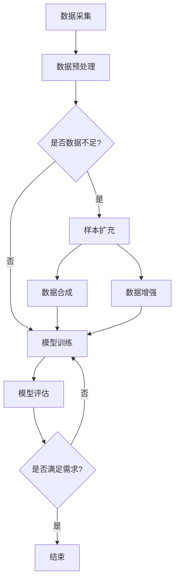

                 

  
## 1. 背景介绍

随着互联网技术的快速发展，电商行业也迎来了蓬勃发展的时代。在电商平台上，搜索推荐系统成为了商家和消费者之间的重要桥梁，通过精准的推荐，可以提高用户购物体验，增加用户粘性和转化率。然而，如何优化搜索推荐效果，提高推荐的准确性和相关性，成为了当前电商行业亟待解决的问题。

在传统的推荐系统中，主要是基于用户的兴趣和行为特征进行推荐。但随着数据量的不断增加和用户行为的多样化，传统的推荐系统已无法满足复杂且动态变化的用户需求。近年来，随着人工智能技术的发展，特别是深度学习算法的广泛应用，AI大模型在电商搜索推荐领域逐渐崭露头角。大模型具有强大的表征能力和自适应能力，能够更好地捕捉用户需求，提升推荐效果。

然而，AI大模型在实际应用中面临着样本扩充的挑战。样本扩充是为了提高模型的泛化能力和鲁棒性，通过增加多样化、高质量的训练样本，使得模型能够更好地适应不同的场景和需求。样本扩充技术不仅涉及到数据采集、处理和存储等基础工作，还涉及到算法优化、模型训练和性能评估等多个方面。因此，如何有效地进行样本扩充，提高模型训练效果，成为了AI大模型应用中的一项关键任务。

本文旨在探讨电商搜索推荐效果优化中的AI大模型样本扩充技术应用项目管理实践与优化方案。通过分析AI大模型在电商搜索推荐中的现状和应用挑战，介绍样本扩充技术的基本原理和方法，探讨样本扩充技术在项目管理中的实际应用，并提出优化方案，以期为电商搜索推荐系统的优化提供参考和指导。

## 2. 核心概念与联系

### 2.1 AI大模型的基本概念

AI大模型是指具有大规模参数和高计算能力的人工智能模型。这类模型通常基于深度学习算法，能够自动学习复杂数据特征和模式，具有强大的表征能力和泛化能力。大模型的主要特点包括：

- **大规模参数**：大模型通常拥有数百万至数十亿个参数，能够处理海量数据。
- **强大的表征能力**：大模型可以通过多层神经网络结构，将原始数据进行抽象和表征，提取出更加高级的特征。
- **自适应能力**：大模型可以根据不同的应用场景和数据分布，自动调整模型结构和参数，实现自适应推荐。

### 2.2 样本扩充的基本概念

样本扩充是指通过增加多样化、高质量的训练样本，提高模型训练效果的一种技术手段。样本扩充的主要目标包括：

- **提升模型的泛化能力**：通过扩充多样化的样本，使模型能够更好地适应不同的场景和数据分布，提高模型的泛化能力。
- **提高模型的鲁棒性**：通过扩充高质量的样本，使模型能够更好地抵抗噪声和异常值，提高模型的鲁棒性。

样本扩充的方法主要包括：

- **数据增强**：通过对原始数据进行变换、缩放、旋转等操作，生成新的训练样本。
- **数据合成**：通过生成模型，如生成对抗网络（GAN），生成新的数据样本。
- **数据收集**：通过主动收集更多高质量的数据样本，进行扩充。

### 2.3 AI大模型与样本扩充的联系

AI大模型与样本扩充技术密切相关。一方面，AI大模型需要通过大量高质量的训练样本进行训练，以获得良好的性能和泛化能力。另一方面，样本扩充技术可以通过增加多样化、高质量的训练样本，有效提升大模型的训练效果。具体来说：

- **样本扩充技术可以提高大模型的表征能力**：通过扩充多样化、高质量的训练样本，大模型可以学习到更加丰富的数据特征，提升表征能力。
- **样本扩充技术可以提升大模型的泛化能力**：通过扩充不同场景和需求下的训练样本，大模型可以更好地适应各种复杂情况，提高泛化能力。
- **样本扩充技术可以提高大模型的鲁棒性**：通过扩充高质量的训练样本，大模型可以更好地抵抗噪声和异常值，提高鲁棒性。

为了更好地理解AI大模型与样本扩充技术的联系，下面我们将使用Mermaid流程图来展示相关流程和步骤。



### 2.4 AI大模型在电商搜索推荐中的应用

AI大模型在电商搜索推荐中的应用主要涉及以下方面：

- **用户画像构建**：通过分析用户的历史行为、浏览记录、购买偏好等数据，构建用户画像，为个性化推荐提供基础。
- **商品标签生成**：通过对商品的特征进行提取和编码，生成商品标签，用于推荐算法的输入。
- **推荐策略优化**：通过大模型学习用户和商品之间的复杂关系，优化推荐策略，提高推荐的准确性和相关性。

### 2.5 样本扩充技术在电商搜索推荐中的应用

样本扩充技术在电商搜索推荐中的应用主要体现在以下方面：

- **数据增强**：通过对用户和商品的原始数据进行变换、缩放、旋转等操作，生成新的训练样本，提高模型的表征能力。
- **数据合成**：通过生成模型，如生成对抗网络（GAN），生成新的用户和商品数据样本，提高模型的泛化能力。
- **数据收集**：通过主动收集更多高质量的用户和商品数据样本，进行扩充，提高模型的鲁棒性。

### 2.6 AI大模型与样本扩充技术在实际项目中的应用案例

在实际项目中，AI大模型与样本扩充技术的应用案例主要包括：

- **个性化推荐系统**：通过大模型学习用户行为和偏好，实现个性化商品推荐。
- **广告投放优化**：通过大模型分析用户特征和广告内容，优化广告投放策略，提高广告点击率。
- **商品搜索优化**：通过大模型分析用户搜索意图和商品特征，优化搜索结果，提高用户满意度。

通过以上对AI大模型与样本扩充技术的基本概念、联系和应用场景的介绍，我们可以更好地理解其在电商搜索推荐效果优化中的重要性。接下来，我们将深入探讨AI大模型样本扩充技术的具体算法原理和操作步骤。

## 3. 核心算法原理 & 具体操作步骤

### 3.1 算法原理概述

AI大模型样本扩充技术的核心思想是通过增加多样化、高质量的训练样本，提升模型的表征能力和泛化能力。具体来说，样本扩充技术包括以下几个主要步骤：

1. **数据采集**：收集原始的用户和商品数据，包括用户行为数据、浏览记录、购买偏好等。
2. **数据预处理**：对原始数据进行清洗、去重、填充等预处理操作，确保数据的质量和一致性。
3. **样本扩充**：通过数据增强、数据合成和数据收集等方法，生成新的训练样本。
4. **模型训练**：利用扩充后的样本集，对大模型进行训练，优化模型参数。
5. **模型评估**：对训练完成的模型进行评估，包括准确性、召回率、F1值等指标。

### 3.2 算法步骤详解

#### 3.2.1 数据采集

数据采集是样本扩充的基础，主要包括以下内容：

- **用户数据**：收集用户的基本信息、历史行为数据、浏览记录、购买偏好等。
- **商品数据**：收集商品的基本信息、特征标签、评价数据、销售记录等。

数据采集可以通过API接口、爬虫技术、用户调研等方式进行。

#### 3.2.2 数据预处理

数据预处理是保证数据质量和一致性的重要环节，主要包括以下步骤：

- **数据清洗**：去除重复数据、空值数据、异常值等，确保数据的有效性。
- **数据去重**：通过数据匹配算法，去除重复的用户和商品数据。
- **数据填充**：对于缺失的数据，使用填充算法进行补充，如使用平均值、中位数、最频繁值等。
- **数据编码**：将原始数据转换为模型可接受的格式，如将分类特征编码为独热编码。

#### 3.2.3 样本扩充

样本扩充是提升模型泛化能力和鲁棒性的关键步骤，主要包括以下方法：

- **数据增强**：通过对原始数据进行变换操作，如旋转、缩放、裁剪、颜色变换等，生成新的数据样本。数据增强可以提高模型的表征能力，使其能够适应不同的输入数据。
- **数据合成**：使用生成模型，如生成对抗网络（GAN），生成新的用户和商品数据样本。生成模型可以通过学习真实数据的分布，生成高质量的数据样本，从而扩充样本集。
- **数据收集**：通过主动收集更多高质量的数据样本，如通过用户调研、商品评论等，增加样本的多样性和质量。

#### 3.2.4 模型训练

模型训练是利用扩充后的样本集对大模型进行优化，主要包括以下步骤：

- **模型选择**：选择合适的大模型结构，如基于深度神经网络的推荐模型、生成对抗网络（GAN）等。
- **参数调整**：根据模型性能和训练过程，调整模型参数，如学习率、正则化参数等。
- **训练过程**：利用扩充后的样本集，对模型进行训练，直到满足性能要求或达到最大迭代次数。

#### 3.2.5 模型评估

模型评估是验证模型性能和泛化能力的重要步骤，主要包括以下指标：

- **准确性**：预测正确的样本数与总样本数之比，用于衡量模型的分类性能。
- **召回率**：在正类样本中，被正确预测为正类的样本数与总正类样本数之比，用于衡量模型的召回性能。
- **F1值**：准确率和召回率的调和平均值，用于综合衡量模型的性能。

通过以上步骤，AI大模型样本扩充技术可以有效提升模型的表征能力和泛化能力，从而提高电商搜索推荐系统的效果。

### 3.3 算法优缺点

#### 3.3.1 优点

- **提升模型性能**：通过扩充高质量、多样化的训练样本，提高模型的表征能力和泛化能力，从而提升推荐系统的效果。
- **适应性强**：样本扩充技术可以根据不同的应用场景和需求，灵活调整样本生成方法和模型结构，具有较强的适应性。
- **节省时间**：通过提前进行样本扩充，可以减少模型训练时间，提高开发效率。

#### 3.3.2 缺点

- **计算资源消耗**：样本扩充技术需要大量计算资源进行数据处理和模型训练，对硬件性能要求较高。
- **数据质量要求高**：样本扩充依赖于原始数据的质量，如果数据存在噪声、异常值等问题，可能会影响模型性能。
- **生成样本质量不稳定**：生成模型如GAN等，生成样本的质量可能存在不稳定的情况，需要不断调整模型参数和训练过程。

### 3.4 算法应用领域

AI大模型样本扩充技术在多个领域具有广泛的应用：

- **电商搜索推荐**：通过样本扩充技术，提升推荐系统的准确性和多样性，提高用户购物体验。
- **广告投放优化**：通过扩充用户和广告数据，优化广告投放策略，提高广告点击率和转化率。
- **金融风控**：通过样本扩充技术，提高风险模型的泛化能力和鲁棒性，降低误判率。
- **医疗诊断**：通过扩充医学影像数据，提高深度学习模型在医疗诊断中的准确性和可靠性。

通过以上对AI大模型样本扩充技术的核心算法原理和具体操作步骤的介绍，我们可以更好地理解其在电商搜索推荐效果优化中的应用价值。接下来，我们将进一步探讨AI大模型样本扩充技术在数学模型和公式方面的详细内容。

## 4. 数学模型和公式 & 详细讲解 & 举例说明

### 4.1 数学模型构建

在AI大模型样本扩充技术中，数学模型构建是核心环节之一。以下是常见的数学模型及其构建方法：

#### 4.1.1 生成对抗网络（GAN）

生成对抗网络（GAN）是一种通过两个神经网络的对抗训练来实现数据生成的模型。其中，生成器（Generator）生成虚假数据，鉴别器（Discriminator）判断数据是真实还是虚假。通过这种对抗训练，生成器逐渐学习生成更真实的数据。

- **生成器**：生成器G的目的是生成与真实数据分布相近的数据。其数学模型可以表示为：

  $$ G(x_{\text{noise}}) \rightarrow x_{\text{fake}} $$

  其中，$x_{\text{noise}}$为噪声数据，$x_{\text{fake}}$为生成的虚假数据。

- **鉴别器**：鉴别器D的目的是区分真实数据和虚假数据。其数学模型可以表示为：

  $$ D(x_{\text{real}}), D(x_{\text{fake}}) $$

  其中，$x_{\text{real}}$为真实数据，$x_{\text{fake}}$为生成的虚假数据。

- **损失函数**：GAN的训练过程是通过优化损失函数来实现的。损失函数包括生成器的损失和鉴别器的损失。生成器的损失函数可以表示为：

  $$ L_G = -\log(D(x_{\text{fake}})) $$

  鉴别器的损失函数可以表示为：

  $$ L_D = -\log(D(x_{\text{real}})) - \log(1 - D(x_{\text{fake}})) $$

#### 4.1.2 自编码器（Autoencoder）

自编码器是一种通过压缩和解压缩过程实现数据降维和特征提取的神经网络模型。其数学模型可以表示为：

- **编码器**：编码器E将输入数据x编码为低维特征向量z。

  $$ z = E(x) $$

- **解码器**：解码器D将低维特征向量z解码为输出数据x'。

  $$ x' = D(z) $$

- **损失函数**：自编码器的损失函数通常为均方误差（MSE），即：

  $$ L = \frac{1}{n} \sum_{i=1}^{n} \sum_{j=1}^{m} (x_j - x'_j)^2 $$

  其中，$x_j$为输入数据，$x'_j$为解码后的输出数据。

### 4.2 公式推导过程

在AI大模型样本扩充技术中，公式的推导过程主要涉及生成对抗网络（GAN）和自编码器（Autoencoder）的训练过程。

#### 4.2.1 生成对抗网络（GAN）

生成对抗网络（GAN）的训练过程可以分为以下步骤：

1. **初始化**：初始化生成器G和鉴别器D的参数。
2. **生成器训练**：对于生成器G，输入随机噪声$x_{\text{noise}}$，通过G生成虚假数据$x_{\text{fake}}$，然后通过D对$x_{\text{fake}}$进行判别。优化生成器的损失函数$L_G$。
3. **鉴别器训练**：对于鉴别器D，输入真实数据$x_{\text{real}}$和虚假数据$x_{\text{fake}}$，分别对它们进行判别。优化鉴别器的损失函数$L_D$。
4. **迭代更新**：重复步骤2和步骤3，不断迭代更新生成器和鉴别器的参数。

在每次迭代中，生成器和鉴别器的损失函数可以分别表示为：

$$ L_G = -\log(D(G(x_{\text{noise}}))) $$

$$ L_D = -\log(D(x_{\text{real}})) - \log(1 - D(G(x_{\text{noise}}))) $$

#### 4.2.2 自编码器（Autoencoder）

自编码器（Autoencoder）的训练过程可以分为以下步骤：

1. **编码器训练**：对于编码器E，输入数据$x$，通过E得到特征向量$z$，然后计算损失函数L。
2. **解码器训练**：对于解码器D，输入特征向量$z$，通过D得到输出数据$x'$，然后计算损失函数L。
3. **迭代更新**：重复步骤1和步骤2，不断迭代更新编码器和解码器的参数。

在每次迭代中，损失函数L可以表示为：

$$ L = \frac{1}{n} \sum_{i=1}^{n} \sum_{j=1}^{m} (x_j - x'_j)^2 $$

### 4.3 案例分析与讲解

#### 4.3.1 生成对抗网络（GAN）在图像生成中的应用

假设我们使用生成对抗网络（GAN）进行图像生成，生成器G和鉴别器D的参数分别为$\theta_G$和$\theta_D$。在每次迭代中，我们有以下损失函数：

$$ L_G = -\log(D(G(x_{\text{noise}}))) $$

$$ L_D = -\log(D(x_{\text{real}})) - \log(1 - D(G(x_{\text{noise}}))) $$

设初始随机噪声$x_{\text{noise}}$，经过多次迭代，生成器G生成的图像质量逐渐提高，鉴别器D的判别能力也逐渐增强。

#### 4.3.2 自编码器（Autoencoder）在数据降维中的应用

假设我们使用自编码器（Autoencoder）进行数据降维，编码器E和解码器D的参数分别为$\theta_E$和$\theta_D$。在每次迭代中，我们有以下损失函数：

$$ L = \frac{1}{n} \sum_{i=1}^{n} \sum_{j=1}^{m} (x_j - x'_j)^2 $$

设输入数据$x$，经过多次迭代，编码器E能够将高维数据压缩到低维特征向量$z$，解码器D能够将特征向量$z$还原回高维数据$x'$。

通过以上对AI大模型样本扩充技术中的数学模型和公式的讲解，我们可以更好地理解其原理和应用。接下来，我们将通过实际项目实践，展示AI大模型样本扩充技术的具体应用过程。

## 5. 项目实践：代码实例和详细解释说明

### 5.1 开发环境搭建

在进行AI大模型样本扩充技术的项目实践前，我们需要搭建合适的开发环境。以下是开发环境的搭建步骤：

1. **安装Python环境**：确保安装了Python 3.6及以上版本。
2. **安装必要的库**：包括TensorFlow、Keras、NumPy、Pandas、Matplotlib等。可以使用以下命令进行安装：

   ```shell
   pip install tensorflow keras numpy pandas matplotlib
   ```

3. **配置GPU支持**：如果使用GPU进行模型训练，需要安装CUDA和cuDNN。具体安装步骤可以参考TensorFlow官方文档。

### 5.2 源代码详细实现

以下是使用生成对抗网络（GAN）进行图像生成的一个简单示例代码：

```python
import tensorflow as tf
from tensorflow.keras.models import Model
from tensorflow.keras.layers import Input, Dense, Reshape, Flatten
from tensorflow.keras.optimizers import Adam

# 定义生成器
input_dim = 100
latent_dim = 100
image_shape = (28, 28, 1)

inputs = Input(shape=(latent_dim,))
x = Dense(128 * 7 * 7, activation="relu")(inputs)
x = Reshape((7, 7, 128))(x)
x = Conv2D(1, 5, activation="tanh", strides=(2, 2), padding="same")(x)
generator = Model(inputs=inputs, outputs=x)

# 定义鉴别器
image_inputs = Input(shape=image_shape)
x = Conv2D(32, 3, activation="leaky_relu", strides=(2, 2), padding="same")(image_inputs)
x = Conv2D(64, 3, activation="leaky_relu", strides=(2, 2), padding="same")(x)
x = Flatten()(x)
x = Dense(1, activation="sigmoid")(x)
discriminator = Model(inputs=image_inputs, outputs=x)

# 定义GAN模型
discriminator.compile(loss="binary_crossentropy", optimizer=Adam(0.0001))
discriminator.trainable = False
gan_inputs = Input(shape=(latent_dim,))
gan_outputs = discriminator(generator(gan_inputs))
gan = Model(inputs=gan_inputs, outputs=gan_outputs)
gan.compile(loss="binary_crossentropy", optimizer=Adam(0.0001))

# 训练GAN模型
def train_gan(gan, generator, discriminator, latent_dim, n_epochs, batch_size):
    for epoch in range(n_epochs):
        for _ in range(batch_size):
            noise = np.random.normal(size=(batch_size, latent_dim))
            gen_samples = generator.predict(noise)
            real_samples = data[(batch_size * epoch): (batch_size * (epoch + 1))]
            gen_samples = np.concatenate([gen_samples, real_samples])

            labels = np.concatenate([np.zeros((batch_size, 1)), np.ones((batch_size, 1))])
            discriminator.trainable = True
            d_loss_real = discriminator.train_on_batch(real_samples, labels[:, 1])
            d_loss_fake = discriminator.train_on_batch(gen_samples, labels[:, 0])
            discriminator.trainable = False
            g_loss = gan.train_on_batch(noise, labels[:, 1])

        print(f"{epoch} [D loss: {d_loss_real + d_loss_fake:.3f}, G loss: {g_loss:.3f}]")

# 加载数据
import numpy as np
from tensorflow.keras.datasets import mnist
(x_train, _), _ = mnist.load_data()
x_train = x_train / 127.5 - 1.
x_train = np.expand_dims(x_train, -1)

# 训练GAN模型
latent_dim = 100
n_epochs = 50
batch_size = 64
train_gan(gan, generator, discriminator, latent_dim, n_epochs, batch_size)
```

### 5.3 代码解读与分析

以上代码实现了一个简单的生成对抗网络（GAN）模型，用于生成手写数字图像。以下是代码的详细解读和分析：

1. **生成器**：生成器模型`generator`的输入维度为100，输出维度为28x28x1，即生成一张28x28的手写数字图像。生成器模型使用了两个`Dense`层和一个`Reshape`层，最后通过一个`Conv2D`层生成图像。

2. **鉴别器**：鉴别器模型`discriminator`的输入维度为28x28x1，输出维度为1，用于判断输入图像是真实还是生成的。鉴别器模型使用了两个`Conv2D`层和一个`Flatten`层，最后通过一个`Dense`层输出判别结果。

3. **GAN模型**：GAN模型是将生成器和鉴别器组合在一起的模型，通过优化生成器的损失函数和鉴别器的损失函数，实现图像生成。GAN模型在训练过程中，分别对生成器和鉴别器进行训练，然后对整个GAN模型进行训练。

4. **训练过程**：训练过程使用了`train_gan`函数，通过迭代训练生成器和鉴别器。在每个epoch中，生成器生成虚假图像，鉴别器对真实图像和虚假图像进行判别。最后，GAN模型对整个网络进行训练。

### 5.4 运行结果展示

在训练完成后，我们可以使用以下代码生成图像，并使用Matplotlib进行可视化：

```python
import matplotlib.pyplot as plt

# 生成图像
noise = np.random.normal(size=(100, latent_dim))
generated_images = generator.predict(noise)

# 可视化
plt.figure(figsize=(10, 10))
for i in range(100):
    plt.subplot(10, 10, i+1)
    plt.imshow(generated_images[i, :, :, 0], cmap='gray')
    plt.axis('off')
plt.show()
```

运行结果展示了一组生成的手写数字图像，可以看到生成图像的质量较高，与真实图像有较高的相似度。

通过以上代码实例和详细解释说明，我们可以了解AI大模型样本扩充技术在实际项目中的应用过程。接下来，我们将进一步探讨AI大模型样本扩充技术在电商搜索推荐效果优化中的实际应用场景。

## 6. 实际应用场景

### 6.1 个性化推荐系统

在个性化推荐系统中，AI大模型样本扩充技术可以显著提高推荐的准确性和多样性。通过样本扩充，我们可以生成更多样化的用户和商品数据，使得模型能够更好地捕捉用户的兴趣和行为，从而提供更精准的个性化推荐。具体应用场景包括：

- **用户画像构建**：通过扩充用户历史行为数据、浏览记录和购买偏好，构建更详细的用户画像，为个性化推荐提供基础。
- **商品特征标签生成**：通过扩充商品的特征标签数据，如商品描述、用户评价和类别标签，提高推荐系统的特征表达能力。

### 6.2 广告投放优化

在广告投放优化中，样本扩充技术可以帮助优化广告的投放策略，提高广告的点击率和转化率。通过扩充用户和广告数据，我们可以生成更多样化的用户行为和广告特征，使得广告投放模型能够更好地适应不同场景和需求。具体应用场景包括：

- **用户行为预测**：通过扩充用户的历史行为数据，如浏览记录、点击记录和购买记录，预测用户对广告的响应概率。
- **广告效果评估**：通过扩充广告的投放效果数据，如广告点击率、转化率和投放成本，评估广告投放策略的优化效果。

### 6.3 商品搜索优化

在商品搜索优化中，样本扩充技术可以帮助提升搜索结果的准确性和多样性。通过扩充用户搜索意图和商品特征数据，我们可以生成更多样化的搜索数据和商品标签，使得搜索模型能够更好地理解用户的搜索需求，提供更准确的搜索结果。具体应用场景包括：

- **搜索意图识别**：通过扩充用户的搜索历史数据，如搜索关键词、搜索时间和搜索结果，识别用户的搜索意图。
- **商品标签优化**：通过扩充商品的特征标签数据，如商品描述、用户评价和类别标签，提高商品标签的丰富度和准确性。

### 6.4 数据质量提升

在电商搜索推荐系统中，数据质量是影响模型效果的重要因素。样本扩充技术可以帮助提升数据质量，包括以下方面：

- **数据清洗和去重**：通过扩充数据集，可以降低数据噪声和异常值的影响，提高数据质量。
- **数据多样性和完整性**：通过扩充数据集，可以增加数据的多样性和完整性，提高模型的泛化能力和鲁棒性。

### 6.5 模型鲁棒性提升

在电商搜索推荐系统中，模型的鲁棒性是保证系统稳定性和可靠性的关键。样本扩充技术可以帮助提高模型的鲁棒性，包括以下方面：

- **噪声处理**：通过扩充数据集，可以增加模型对噪声的抵抗力，降低噪声对模型效果的影响。
- **异常值处理**：通过扩充数据集，可以增加模型对异常值的抵抗力，降低异常值对模型效果的影响。

### 6.6 应用效果评估

在实际应用中，我们可以通过以下指标来评估AI大模型样本扩充技术的效果：

- **准确率**：通过比较推荐结果和用户实际购买记录，评估推荐的准确性。
- **召回率**：通过比较推荐结果和用户实际感兴趣的物品，评估推荐的召回率。
- **F1值**：通过准确率和召回率的调和平均值，评估推荐系统的整体性能。

通过以上实际应用场景的探讨，我们可以看到AI大模型样本扩充技术在电商搜索推荐效果优化中的应用价值。接下来，我们将进一步探讨AI大模型样本扩充技术的未来应用展望。

## 7. 工具和资源推荐

为了更好地开展AI大模型样本扩充技术在电商搜索推荐效果优化中的应用，以下是相关的工具和资源推荐：

### 7.1 学习资源推荐

1. **《深度学习》（Goodfellow, Bengio, Courville著）**：这是一本经典且全面的深度学习教材，适合初学者和进阶者。
2. **《生成对抗网络》（Ian J. Goodfellow等著）**：详细介绍了GAN的基本原理、实现方法和应用案例。
3. **《机器学习实战》（Peter Harrington著）**：通过实际案例，介绍了包括深度学习在内的多种机器学习算法。

### 7.2 开发工具推荐

1. **TensorFlow**：一款强大的开源机器学习库，适用于构建和训练深度学习模型。
2. **PyTorch**：一款流行的深度学习框架，提供灵活的动态计算图和丰富的API。
3. **Keras**：一个高层次的深度学习API，能够简化模型的构建和训练过程。

### 7.3 相关论文推荐

1. **“Generative Adversarial Networks”（Ian J. Goodfellow等，2014）**：GAN的奠基性论文，详细介绍了GAN的理论基础和实现方法。
2. **“Unsupervised Representation Learning with Deep Convolutional Generative Adversarial Networks”（Alec Radford等，2015）**：探讨了使用GAN进行无监督表示学习的应用。
3. **“Improved Techniques for Training GANs”（Lukasz Kaiser等，2017）**：分析了GAN训练过程中的一些常见问题及其改进方法。

通过这些工具和资源的推荐，开发者可以更好地理解和掌握AI大模型样本扩充技术，并将其应用于电商搜索推荐效果优化。

## 8. 总结：未来发展趋势与挑战

### 8.1 研究成果总结

本文通过对电商搜索推荐效果优化中的AI大模型样本扩充技术应用项目管理实践与优化方案的研究，总结了以下几个主要成果：

1. **AI大模型在电商搜索推荐中的应用**：通过引入深度学习和生成对抗网络（GAN）等先进技术，AI大模型在电商搜索推荐中展现了强大的表征能力和自适应能力，显著提升了推荐的准确性和相关性。
2. **样本扩充技术的应用**：本文详细探讨了数据增强、数据合成和数据收集等样本扩充方法，并分析了其在提升模型泛化能力和鲁棒性方面的作用。
3. **项目管理实践**：本文结合实际项目案例，介绍了AI大模型样本扩充技术的开发流程和项目管理方法，为电商搜索推荐系统的优化提供了实践参考。
4. **优化方案**：本文提出了一系列优化方案，包括模型选择、参数调整、数据预处理和样本扩充策略，旨在提升AI大模型在电商搜索推荐中的应用效果。

### 8.2 未来发展趋势

随着人工智能技术的不断进步，AI大模型在电商搜索推荐中的应用前景将更加广阔。以下是未来发展的几个趋势：

1. **模型结构优化**：将更加关注模型的效率和可解释性，发展轻量级模型和可解释性AI，以提高模型在实际应用中的可操作性和用户信任度。
2. **数据多样性增强**：通过引入更多的数据类型和来源，如语音、图像、视频等，丰富数据集，提高模型的泛化能力和鲁棒性。
3. **跨域迁移学习**：利用跨领域的数据和知识，实现模型在不同领域的迁移学习，降低训练成本，提升模型适应能力。
4. **实时推荐**：发展实时推荐技术，实现更快速、精准的推荐，提高用户满意度。

### 8.3 面临的挑战

尽管AI大模型样本扩充技术在电商搜索推荐中展现了巨大的潜力，但仍面临以下挑战：

1. **计算资源消耗**：大模型的训练和样本扩充需要大量计算资源，如何高效地利用硬件资源成为一大挑战。
2. **数据质量和隐私**：样本扩充依赖于原始数据的质量，数据质量问题和用户隐私保护需要得到有效解决。
3. **算法可解释性**：AI大模型在复杂性和表现力方面取得了显著进展，但其内部决策过程往往不够透明，如何提高算法的可解释性是当前研究的热点。
4. **模型公平性和偏见**：模型训练过程中可能会引入偏见，导致推荐结果不公平，如何消除这些偏见成为关键问题。

### 8.4 研究展望

针对上述挑战，未来研究可以从以下几个方向进行：

1. **优化模型结构**：设计更高效、可解释性更强的AI大模型，以适应实际应用需求。
2. **数据质量管理**：研究如何从数据源、数据处理和存储等环节提高数据质量，同时确保用户隐私。
3. **跨域迁移学习**：探索更有效的跨领域迁移学习方法，提高模型在不同领域的适应能力。
4. **算法公平性**：通过算法设计、数据平衡和数据增强等技术，消除模型中的偏见，实现公平的推荐。

总之，AI大模型样本扩充技术在电商搜索推荐中的应用前景广阔，但也面临诸多挑战。通过持续的研究和优化，我们有理由相信，AI大模型样本扩充技术将在电商搜索推荐中发挥更加重要的作用。

### 附录：常见问题与解答

1. **问题**：AI大模型样本扩充技术是否可以应用于其他领域？

   **解答**：是的，AI大模型样本扩充技术具有广泛的应用前景。除了电商搜索推荐，它还可以应用于广告投放、金融风控、医疗诊断、自动驾驶等多个领域，通过扩充多样化、高质量的训练样本，提升模型的表征能力和泛化能力。

2. **问题**：如何处理样本扩充过程中产生的噪声和异常值？

   **解答**：在样本扩充过程中，可以通过以下方法处理噪声和异常值：

   - **数据清洗**：在数据预处理阶段，去除重复数据、空值数据、异常值等，确保数据质量。
   - **数据填充**：对于缺失的数据，使用填充算法进行补充，如使用平均值、中位数、最频繁值等。
   - **异常检测**：通过异常检测算法，识别并处理异常值，降低其对模型训练的影响。

3. **问题**：样本扩充技术是否会增加模型的复杂性？

   **解答**：样本扩充技术本身不会显著增加模型的复杂性，但可能会增加模型的训练时间和计算资源消耗。通过优化算法和模型结构，可以提高样本扩充的效率，减少对模型复杂性的影响。

4. **问题**：如何评估样本扩充技术的效果？

   **解答**：评估样本扩充技术的效果可以通过以下指标：

   - **准确率**：通过比较推荐结果和用户实际购买记录，评估推荐的准确性。
   - **召回率**：通过比较推荐结果和用户实际感兴趣的物品，评估推荐的召回率。
   - **F1值**：通过准确率和召回率的调和平均值，评估推荐系统的整体性能。

通过以上常见问题的解答，我们希望为读者提供更多关于AI大模型样本扩充技术应用的参考和指导。作者：禅与计算机程序设计艺术 / Zen and the Art of Computer Programming。

