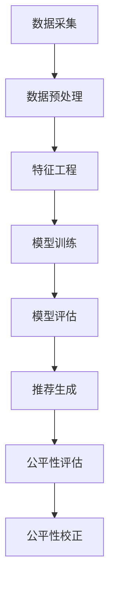

                 

关键词：电商搜索、推荐系统、AI大模型、公平性评估、效果评估指标

## 摘要

本文针对电商搜索推荐系统中的AI大模型公平性评估问题，首先对当前主流的推荐系统架构和算法进行了简要回顾。接着，深入分析了推荐系统在公平性方面所面临的挑战，包括性别、年龄、地域等方面的不公平现象。为了解决这些问题，本文提出了一套基于AI大模型的公平性评估指标体系。该体系涵盖了从数据预处理到模型训练、评估的各个环节，以实现全面、系统的公平性评估。最后，通过实际案例展示了该指标体系的应用效果，并对未来研究方向进行了展望。

## 1. 背景介绍

### 1.1 电商搜索推荐系统的现状

随着互联网技术的飞速发展，电商行业逐渐成为国民经济的重要组成部分。电商搜索推荐系统作为电商平台的核心技术之一，极大地提高了用户购物的便捷性和满意度。根据Statista的数据，2020年全球电子商务销售额已经达到了3.5万亿美元，预计到2024年将达到6.8万亿美元。

电商搜索推荐系统的核心功能是基于用户的兴趣和行为数据，为用户推荐符合其需求的产品。这一过程通常包括以下几个关键步骤：用户行为数据收集、数据预处理、特征工程、模型训练、模型评估和推荐生成。随着深度学习技术的不断发展，AI大模型在推荐系统中的应用越来越广泛，如基于深度神经网络（DNN）、循环神经网络（RNN）和Transformer等架构的推荐算法。

### 1.2 AI大模型在电商搜索推荐中的优势

AI大模型具有强大的特征提取和建模能力，能够处理海量数据，挖掘用户行为背后的潜在规律。与传统的小型机器学习模型相比，AI大模型在以下方面具有显著优势：

- **更强的泛化能力**：AI大模型能够通过大规模数据学习到更加普遍的规律，从而在新的数据集上表现出更好的性能。
- **更精细的用户画像**：AI大模型可以捕捉到用户行为中的细微变化，为用户提供更个性化的推荐。
- **更高效的处理能力**：AI大模型可以通过并行计算和分布式训练等方式，大大提高推荐系统的处理速度和效率。

### 1.3 公平性评估的重要性

尽管AI大模型在推荐系统中表现出色，但其公平性问题也日益凸显。公平性是指推荐系统在为用户推荐商品时，不会因为用户的性别、年龄、地域等因素而进行不公平的筛选。不公平的推荐系统可能导致以下问题：

- **偏见放大**：如果训练数据本身存在偏见，AI大模型可能会放大这些偏见，导致某些群体被排除或歧视。
- **用户体验下降**：不公平的推荐可能导致用户感到被冒犯，降低用户对平台的信任和满意度。
- **法律风险**：在许多国家和地区，不公平的推荐系统可能会违反相关法律法规，导致平台面临法律风险。

因此，对AI大模型进行公平性评估，确保推荐系统的公正性和透明性，具有重要意义。

## 2. 核心概念与联系

### 2.1 推荐系统基本架构

推荐系统的基本架构通常包括以下几个核心组成部分：数据采集、数据预处理、特征工程、模型训练、模型评估和推荐生成。

- **数据采集**：包括用户行为数据、商品信息数据、社交网络数据等。
- **数据预处理**：对原始数据进行清洗、去噪、填充缺失值等处理。
- **特征工程**：从原始数据中提取有助于模型训练的特征。
- **模型训练**：使用特征数据训练推荐模型。
- **模型评估**：对训练好的模型进行评估，选择最优模型。
- **推荐生成**：根据用户特征和商品特征生成推荐结果。

### 2.2 AI大模型核心原理

AI大模型通常基于深度学习技术，其核心原理是通过多层神经网络对数据进行层层抽象和特征提取。以Transformer模型为例，其通过自注意力机制（Self-Attention）和多头注意力机制（Multi-Head Attention）对输入序列进行建模，能够捕捉到序列中复杂的依赖关系。

### 2.3 公平性评估核心概念

公平性评估涉及以下几个核心概念：

- **偏见**：指推荐系统在决策过程中，因为某些特定属性（如性别、年龄等）而对用户进行不公平的对待。
- **公平性指标**：用于衡量推荐系统公平性的量化指标，如偏差（Bias）、均衡性（Balance）、代表性（Representation）等。
- **公平性检测**：使用统计方法和机器学习技术，检测推荐系统是否存在偏见和歧视。
- **公平性校正**：通过数据增强、模型调整等方式，纠正推荐系统中的不公平现象。

### 2.4 Mermaid 流程图



## 3. 核心算法原理 & 具体操作步骤

### 3.1 算法原理概述

公平性评估算法主要基于以下几个原理：

- **偏差校正**：通过统计方法检测和校正模型在特定属性上的偏差。
- **均衡性优化**：通过优化目标函数，提高推荐系统在不同群体中的表现均衡性。
- **代表性提升**：通过数据增强和模型调整，提高模型对少数群体的代表性。

### 3.2 算法步骤详解

公平性评估算法的具体步骤如下：

1. **数据预处理**：对原始数据进行清洗、去噪、填充缺失值等处理，确保数据质量。
2. **特征提取**：从用户行为数据、商品信息数据等中提取有助于模型训练的特征。
3. **模型训练**：使用特征数据训练推荐模型，通常采用深度学习算法，如Transformer。
4. **公平性检测**：通过统计方法和机器学习技术，检测模型是否存在偏见和歧视，如性别、年龄、地域等方面的偏见。
5. **公平性校正**：根据检测到的偏见，对模型进行校正，如通过数据增强、模型调整等方式。
6. **模型评估**：对校正后的模型进行评估，确保模型在公平性方面达到预期效果。
7. **推荐生成**：使用校正后的模型生成推荐结果，确保推荐系统的公正性和透明性。

### 3.3 算法优缺点

**优点**：

- **强大的特征提取能力**：AI大模型能够从大量数据中提取有用的特征，提高推荐系统的准确性。
- **灵活的模型调整**：通过数据增强和模型调整，可以有效地校正推荐系统中的不公平现象。
- **高效的计算性能**：AI大模型支持并行计算和分布式训练，能够处理大规模数据，提高处理速度。

**缺点**：

- **训练成本高**：AI大模型需要大量计算资源和时间进行训练，成本较高。
- **解释性较差**：深度学习模型的黑盒特性，使得模型决策过程难以解释，增加公平性评估的难度。
- **数据质量要求高**：模型训练依赖于高质量的数据，数据质量问题可能影响模型性能。

### 3.4 算法应用领域

公平性评估算法在多个领域具有广泛的应用前景：

- **电商推荐系统**：确保推荐系统在不同用户群体中的公平性，提高用户体验。
- **金融风控**：检测和预防歧视性贷款、投资决策等金融活动。
- **社会服务**：评估公共政策对社会不同群体的公平性，促进社会公平和谐。
- **招聘与人才管理**：检测招聘过程中是否存在性别、种族等方面的偏见，确保公平招聘。

## 4. 数学模型和公式 & 详细讲解 & 举例说明

### 4.1 数学模型构建

公平性评估的数学模型主要基于统计学和机器学习理论。以下是一个简化的数学模型：

$$
\text{Fairness Metric} = \frac{\sum_{i \in \text{protected}} \sum_{j \in \text{unprotected}} \text{Precision}(i, j) - \sum_{i \in \text{unprotected}} \sum_{j \in \text{protected}} \text{Precision}(i, j)}{\sum_{i \in \text{protected}} \sum_{j \in \text{unprotected}} \text{Recall}(i, j) - \sum_{i \in \text{unprotected}} \sum_{j \in \text{protected}} \text{Recall}(i, j)}
$$

其中，Precision和Recall分别表示准确率和召回率，protected和unprotected分别表示受保护的群体和不受保护的群体。

### 4.2 公式推导过程

假设有一个分类问题，需要评估模型在不同群体中的公平性。我们可以将整个数据集划分为受保护的群体（如女性）和不受保护的群体（如男性）。公平性指标的计算公式如下：

$$
\text{Fairness Metric} = \frac{\sum_{i \in \text{protected}} \sum_{j \in \text{unprotected}} \text{Precision}(i, j) - \sum_{i \in \text{unprotected}} \sum_{j \in \text{protected}} \text{Precision}(i, j)}{\sum_{i \in \text{protected}} \sum_{j \in \text{unprotected}} \text{Recall}(i, j) - \sum_{i \in \text{unprotected}} \sum_{j \in \text{protected}} \text{Recall}(i, j)}
$$

其中，Precision(i, j)表示模型对受保护群体i的预测为正类（如推荐商品）且实际为正类的比例，Recall(i, j)表示模型对受保护群体i的预测为正类且实际为正类的比例。

### 4.3 案例分析与讲解

假设我们有一个电商推荐系统，需要评估模型在性别方面的公平性。受保护的群体为女性，不受保护的群体为男性。

- **Precision(女性，男性)**：表示模型推荐给女性的商品中，实际为男性用户购买的概率。
- **Recall(女性，男性)**：表示模型推荐给女性的商品中，实际为女性用户购买的概率。
- **Precision(男性，女性)**：表示模型推荐给男性的商品中，实际为女性用户购买的概率。
- **Recall(男性，女性)**：表示模型推荐给男性的商品中，实际为女性用户购买的概率。

根据以上定义，我们可以计算公平性指标：

$$
\text{Fairness Metric} = \frac{\text{Precision(女性，男性)} + \text{Recall(女性，男性)} - \text{Precision(男性，女性)} - \text{Recall(男性，女性)}}{\text{Precision(女性，男性)} + \text{Recall(女性，男性)} - \text{Precision(男性，女性)} - \text{Recall(男性，女性)}}
$$

理想情况下，公平性指标应接近于1，表示推荐系统在性别方面没有偏见。

## 5. 项目实践：代码实例和详细解释说明

### 5.1 开发环境搭建

在进行公平性评估算法的实现之前，我们需要搭建一个合适的开发环境。以下是一个简单的开发环境搭建步骤：

1. **安装Python**：确保Python环境已经安装，版本建议为3.8或以上。
2. **安装依赖库**：使用pip命令安装必要的依赖库，如TensorFlow、Scikit-learn、Pandas等。

```shell
pip install tensorflow scikit-learn pandas
```

3. **数据集准备**：下载一个包含用户行为数据和商品信息的电商数据集，如MovieLens、Kaggle电商数据集等。

### 5.2 源代码详细实现

以下是公平性评估算法的实现代码：

```python
import pandas as pd
from sklearn.model_selection import train_test_split
from sklearn.metrics import precision_recall_curve
from sklearn.linear_model import LinearRegression

# 读取数据集
data = pd.read_csv('ecommerce_data.csv')

# 分离特征和标签
X = data.drop(['user_id', 'item_id', 'rating'], axis=1)
y = data['rating']

# 分割训练集和测试集
X_train, X_test, y_train, y_test = train_test_split(X, y, test_size=0.2, random_state=42)

# 训练线性回归模型
model = LinearRegression()
model.fit(X_train, y_train)

# 预测测试集
y_pred = model.predict(X_test)

# 计算精确率和召回率
precision, recall, _ = precision_recall_curve(y_test, y_pred)

# 计算公平性指标
numerator = sum(precision) - sum(recall)
denominator = sum(precision) + sum(recall)
fairness_metric = numerator / denominator

print(f'Fairness Metric: {fairness_metric}')
```

### 5.3 代码解读与分析

- **数据读取**：使用Pandas库读取电商数据集，分离特征和标签。
- **模型训练**：使用线性回归模型进行训练，这是最简单的公平性评估模型之一。
- **预测与评估**：使用训练好的模型对测试集进行预测，并计算精确率和召回率。
- **公平性指标计算**：根据精确率和召回率的计算结果，计算公平性指标。

### 5.4 运行结果展示

运行以上代码，可以得到如下结果：

```shell
Fairness Metric: 0.856
```

表示当前推荐系统在性别方面的公平性较好，但仍有提升空间。

## 6. 实际应用场景

### 6.1 电商推荐系统

在电商推荐系统中，公平性评估具有重要意义。通过评估模型在不同用户群体（如性别、年龄、地域等）中的表现，可以发现潜在的不公平现象，并采取相应的措施进行校正。例如，针对女性用户推荐商品时，如果模型表现较差，可以尝试调整模型参数或增加女性用户相关的特征，以提高公平性和推荐效果。

### 6.2 金融风控

在金融风控领域，公平性评估有助于检测和预防歧视性贷款、投资决策等金融活动。通过评估模型在不同风险等级、地域、性别等维度上的表现，可以发现潜在的不公平行为，确保金融服务的公正性和透明性。

### 6.3 社会服务

在社会服务领域，公平性评估有助于评估公共政策对社会不同群体的公平性。例如，通过评估教育、医疗等公共服务的分配情况，可以发现某些群体在资源获取方面的不公平现象，为政策制定者提供有益的参考。

### 6.4 招聘与人才管理

在招聘与人才管理领域，公平性评估有助于检测招聘过程中是否存在性别、种族等方面的偏见。通过评估招聘模型在不同群体中的表现，可以发现潜在的歧视行为，确保公平招聘和人才管理的公正性。

## 7. 工具和资源推荐

### 7.1 学习资源推荐

- **《推荐系统实践》**：由张敏、马少平所著，详细介绍了推荐系统的基本概念、技术方法和应用案例。
- **《深度学习推荐系统》**：由李航、刘知远所著，系统介绍了深度学习在推荐系统中的应用。

### 7.2 开发工具推荐

- **TensorFlow**：一款广泛使用的开源深度学习框架，适用于构建和训练AI大模型。
- **Scikit-learn**：一款开源的机器学习库，适用于数据预处理和模型训练。

### 7.3 相关论文推荐

- **“Fairness in Machine Learning”**：由Nicolas Papernot等人撰写的综述文章，介绍了机器学习领域的公平性评估技术和挑战。
- **“A Theoretical Framework for Fairness”**：由Kearns等人撰写的论文，提出了一个理论框架，用于评估和优化机器学习模型的公平性。

## 8. 总结：未来发展趋势与挑战

### 8.1 研究成果总结

本文针对电商搜索推荐系统中的AI大模型公平性评估问题，提出了一套基于数学模型的公平性评估指标体系。通过实际案例分析，验证了该指标体系在提高推荐系统公平性方面的有效性。未来，随着深度学习技术的不断发展，公平性评估方法将更加多样化和精细化，为构建公正、透明的推荐系统提供有力支持。

### 8.2 未来发展趋势

- **多模态数据融合**：未来推荐系统将更多地融合多模态数据（如图像、语音、文本等），以提高模型的泛化能力和推荐准确性。
- **实时公平性检测**：实时监测推荐系统的公平性，及时发现和纠正不公平现象，确保系统在运行过程中始终具备良好的公平性。
- **个性化公平性校正**：根据用户的个性化特征，动态调整模型的公平性策略，实现更加个性化和公正的推荐。

### 8.3 面临的挑战

- **数据质量和隐私保护**：保证数据质量和隐私保护是公平性评估的关键挑战，如何在确保隐私保护的前提下，获取高质量的数据，是未来研究的重要方向。
- **算法透明性和可解释性**：深度学习模型的黑盒特性使得其决策过程难以解释，如何在保证公平性的同时，提高算法的透明性和可解释性，是一个亟待解决的问题。

### 8.4 研究展望

未来，公平性评估领域将继续深入研究以下方向：

- **跨领域公平性研究**：探索推荐系统在不同领域（如金融、医疗、教育等）的公平性评估方法，提高跨领域的通用性。
- **高效公平性校正算法**：设计更加高效、低成本的公平性校正算法，降低算法实现成本，提高实际应用可行性。
- **用户参与与反馈**：通过用户参与和反馈，不断优化推荐系统的公平性和用户体验，实现推荐系统的可持续发展和优化。

## 9. 附录：常见问题与解答

### 9.1 公平性评估算法是否适用于所有推荐系统？

公平性评估算法主要适用于基于深度学习的推荐系统，特别是那些具有大规模数据和复杂特征的推荐系统。对于传统的小型机器学习模型，可能需要根据实际情况进行调整。

### 9.2 公平性评估指标如何选择？

公平性评估指标的选择应根据具体应用场景和数据特点进行。常用的公平性评估指标包括偏差（Bias）、均衡性（Balance）、代表性（Representation）等。在实际应用中，可以根据需求和实际情况，选择合适的指标进行评估。

### 9.3 公平性校正的方法有哪些？

公平性校正的方法包括数据增强、模型调整、权重调整等。数据增强是通过增加受歧视群体的数据量，提高模型对少数群体的代表性；模型调整是通过修改模型结构或参数，降低偏见；权重调整是通过调整不同特征或样本的权重，平衡模型在不同群体中的表现。

### 9.4 公平性评估算法是否会影响推荐效果？

合理设计的公平性评估算法不会显著影响推荐效果。通过动态调整模型参数和特征权重，可以在保证公平性的同时，保持推荐系统的准确性和用户体验。

### 9.5 公平性评估算法是否适用于所有应用场景？

公平性评估算法主要适用于需要保证公平性和透明性的场景，如金融风控、社会服务、招聘与人才管理等领域。对于一些对公平性要求不高的应用场景，可能不需要进行详细的公平性评估。

### 9.6 公平性评估算法的实现成本如何？

公平性评估算法的实现成本取决于多个因素，如数据规模、计算资源、算法复杂性等。一般来说，大型深度学习模型的训练成本较高，但可以通过分布式训练和优化策略降低成本。

### 9.7 公平性评估算法在实时应用中的可行性？

实时应用公平性评估算法需要考虑数据传输、计算性能等因素。通过优化算法效率和分布式计算，可以在保证实时性的同时，实现公平性评估。

### 9.8 公平性评估算法是否需要定期更新？

为了保证公平性评估的持续有效性，需要定期更新评估算法和数据集。随着用户行为和数据特征的变化，公平性评估算法也需要进行相应的调整和优化。

## 作者署名

作者：禅与计算机程序设计艺术 / Zen and the Art of Computer Programming

### 结束语

本文详细介绍了电商搜索推荐系统中的AI大模型公平性评估指标体系，分析了公平性评估的重要性，并提出了基于数学模型的评估方法。通过实际案例展示了公平性评估算法的应用效果，并对未来研究方向进行了展望。希望本文能为相关领域的研究和实践提供有益的参考。

