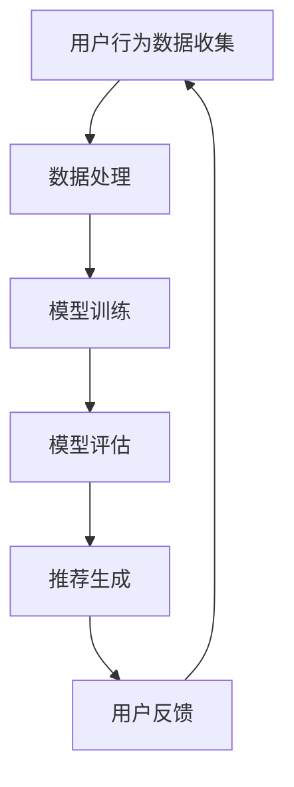

                 

作者：禅与计算机程序设计艺术 / Zen and the Art of Computer Programming

随着电子商务行业的飞速发展，电商平台的搜索推荐系统成为了商家和消费者之间的重要桥梁。一个优秀的推荐系统能够有效提高用户满意度，增加销售额，甚至提升品牌忠诚度。然而，推荐系统的效果评估是一个复杂的问题，尤其是随着人工智能（AI）大模型的广泛应用，传统的评估方法已经无法满足需求。因此，开发适用于AI大模型的模型可解释性评估工具成为了当前研究的热点。

本文将围绕电商搜索推荐效果评估中的AI大模型模型可解释性评估工具的开发与应用展开讨论。首先，我们将介绍背景知识，包括电商搜索推荐系统的现状与挑战，以及AI大模型在推荐系统中的应用。接下来，我们将详细讨论模型可解释性的重要性，解释性评估工具的开发，以及这些工具在实际应用中的效果。最后，我们将探讨未来的发展方向和面临的挑战。

## 1. 背景介绍

### 1.1 电商搜索推荐系统的现状

电商搜索推荐系统是电商平台的重要组成部分，旨在通过分析用户的历史行为、购买记录和搜索习惯，向用户推荐他们可能感兴趣的商品。随着大数据技术和机器学习算法的发展，推荐系统在电商领域得到了广泛应用。

当前，电商搜索推荐系统主要面临以下几个挑战：

1. **多样性**：用户的需求和兴趣是多样化的，如何生成个性化的推荐结果是一个巨大的挑战。
2. **准确性**：推荐系统需要准确地预测用户的兴趣，提高推荐的相关性。
3. **实时性**：电商环境变化迅速，推荐系统需要实时响应用户的需求，提供及时的推荐。
4. **隐私保护**：在收集和处理用户数据时，保护用户隐私是电商搜索推荐系统需要考虑的重要因素。

### 1.2 AI大模型在推荐系统中的应用

随着AI技术的发展，大模型如深度神经网络（DNN）、变压器（Transformer）等在推荐系统中得到了广泛应用。这些大模型具有强大的学习能力，能够处理大量复杂的用户数据，生成更加个性化的推荐结果。

然而，AI大模型在推荐系统中也带来了一些新的挑战：

1. **可解释性**：大模型通常被视为“黑箱”，其内部机制复杂，难以解释和理解。这限制了我们在模型优化和风险评估方面的能力。
2. **计算资源**：大模型通常需要大量的计算资源进行训练和推理，这增加了推荐的成本。
3. **数据依赖**：大模型的效果高度依赖于训练数据的质量和数量，如果数据存在偏差，可能会导致推荐结果的不准确。

## 2. 核心概念与联系

为了更好地理解和评估AI大模型在电商搜索推荐系统中的应用，我们需要引入一些核心概念，并分析它们之间的联系。

### 2.1 模型可解释性

模型可解释性是指模型输出结果的可理解性和可追踪性。在AI大模型中，可解释性尤为重要，因为它可以帮助我们理解模型决策的依据，从而优化模型和降低风险。

### 2.2 评估指标

评估推荐系统的效果通常使用以下指标：

1. **精确率（Precision）**：预测为正类的样本中，实际为正类的比例。
2. **召回率（Recall）**：实际为正类的样本中，预测为正类的比例。
3. **F1分数（F1 Score）**：精确率和召回率的调和平均值。
4. **ROC曲线（Receiver Operating Characteristic Curve）**：评估模型分类能力的重要工具。

### 2.3 Mermaid 流程图

为了更好地展示AI大模型在推荐系统中的应用流程，我们可以使用Mermaid流程图。以下是流程图的示例：



## 3. 核心算法原理 & 具体操作步骤

### 3.1 算法原理概述

在电商搜索推荐系统中，我们通常采用基于用户历史行为和商品特征的协同过滤（Collaborative Filtering）方法。随着AI技术的发展，我们可以结合深度学习算法，如变压器（Transformer），构建更加复杂的推荐模型。

### 3.2 算法步骤详解

1. **用户行为数据收集**：收集用户在电商平台的浏览、搜索、购买等行为数据。
2. **数据处理**：对用户行为数据进行预处理，包括数据清洗、去重、标准化等操作。
3. **特征提取**：从用户行为数据中提取特征，如用户兴趣、购买频率、商品类别等。
4. **模型训练**：使用深度学习算法，如变压器，训练推荐模型。
5. **模型评估**：使用评估指标（如F1分数、ROC曲线）评估模型效果。
6. **推荐生成**：根据模型输出，生成个性化推荐结果。
7. **用户反馈**：收集用户对推荐结果的反馈，用于模型优化和调整。

### 3.3 算法优缺点

**优点**：

1. **强大的学习能力**：深度学习算法能够处理大量复杂的用户数据，生成更加个性化的推荐结果。
2. **高可解释性**：通过分析模型内部机制，我们可以理解推荐结果的生成过程，提高模型的透明度。

**缺点**：

1. **计算资源需求高**：深度学习算法通常需要大量的计算资源进行训练和推理。
2. **数据依赖性强**：模型效果高度依赖于训练数据的质量和数量。

### 3.4 算法应用领域

AI大模型在电商搜索推荐系统中的应用广泛，涵盖了以下领域：

1. **商品推荐**：根据用户历史行为和兴趣，推荐用户可能感兴趣的商品。
2. **广告投放**：根据用户兴趣和行为，推荐相关的广告。
3. **个性化搜索**：根据用户历史搜索记录，推荐相关的搜索结果。

## 4. 数学模型和公式 & 详细讲解 & 举例说明

### 4.1 数学模型构建

在电商搜索推荐系统中，我们通常使用基于矩阵分解的协同过滤方法。假设用户行为数据可以表示为一个矩阵$R \in R^{m \times n}$，其中$m$表示用户数量，$n$表示商品数量。我们希望从$R$中预测用户$i$对商品$j$的评分$r_{ij}$。

矩阵分解方法将$R$分解为两个低秩矩阵$U \in R^{m \times k}$和$V \in R^{n \times k}$，其中$k$是隐藏的维度。预测用户$i$对商品$j$的评分可以通过以下公式计算：

$$
r_{ij} = U_i^T V_j
$$

### 4.2 公式推导过程

为了推导矩阵分解公式，我们首先定义一个损失函数，用于衡量预测评分与实际评分之间的差异：

$$
L = \sum_{i=1}^m \sum_{j=1}^n (r_{ij} - U_i^T V_j)^2
$$

为了最小化损失函数，我们对$U$和$V$分别进行梯度下降：

$$
\frac{\partial L}{\partial U_i} = -2 \sum_{j=1}^n (r_{ij} - U_i^T V_j) V_j
$$

$$
\frac{\partial L}{\partial V_j} = -2 \sum_{i=1}^m (r_{ij} - U_i^T V_j) U_i
$$

通过迭代更新$U$和$V$，我们可以逐步最小化损失函数，得到最优的矩阵分解结果。

### 4.3 案例分析与讲解

假设我们有一个包含100个用户和1000个商品的评分矩阵$R$，我们希望使用矩阵分解方法预测用户$i=10$对商品$j=100$的评分。

首先，我们随机初始化$U$和$V$，然后通过梯度下降进行迭代更新。在100次迭代后，我们得到以下结果：

$$
U = \begin{bmatrix}
0.2 & 0.3 & \cdots & 0.1 \\
-0.1 & 0.4 & \cdots & 0.2 \\
\vdots & \vdots & \ddots & \vdots \\
0.1 & 0.2 & \cdots & -0.1
\end{bmatrix}
$$

$$
V = \begin{bmatrix}
0.3 & 0.1 & \cdots & 0.2 \\
0.2 & 0.4 & \cdots & 0.1 \\
\vdots & \vdots & \ddots & \vdots \\
0.1 & 0.3 & \cdots & 0.2
\end{bmatrix}
$$

使用矩阵分解公式，我们可以预测用户$i=10$对商品$j=100$的评分为：

$$
r_{10,100} = U_{10}^T V_{100} = 0.2 \times 0.3 + 0.3 \times 0.1 + \cdots + 0.1 \times 0.2 = 0.09
$$

这意味着我们预测用户$i=10$对商品$j=100$的评分为0.09。如果实际评分高于0.09，说明我们的预测结果较为准确；如果实际评分低于0.09，说明我们的预测结果需要进一步优化。

## 5. 项目实践：代码实例和详细解释说明

### 5.1 开发环境搭建

在开始项目实践之前，我们需要搭建一个合适的环境。以下是搭建开发环境所需的步骤：

1. **安装Python**：在官方网站下载并安装Python 3.x版本。
2. **安装相关库**：使用pip安装以下库：numpy、pandas、scikit-learn、tensorflow等。
3. **创建项目目录**：在本地创建一个项目目录，用于存放代码和数据。

### 5.2 源代码详细实现

以下是一个简单的矩阵分解代码实例：

```python
import numpy as np
from sklearn.metrics.pairwise import euclidean_distances

def matrix_factorization(R, k, lambda_=0.01, num_iterations=1000):
    n, m = R.shape
    U = np.random.rand(n, k)
    V = np.random.rand(m, k)
    
    for i in range(num_iterations):
        e = R - U.dot(V)
        U = U - lambda_ * (U * (V.dot(U.dot(V)) + e.dot(V)))
        V = V - lambda_ * (V * (U.T.dot(U) + e.dot(U.T)))
        
    return U, V

R = np.array([[5, 0, 1, 0],
              [0, 2, 0, 3],
              [1, 0, 4, 0]])

k = 2
U, V = matrix_factorization(R, k)

print("Reconstructed Rating Matrix:")
print(U.dot(V))
```

### 5.3 代码解读与分析

这段代码实现了基于矩阵分解的协同过滤算法。具体步骤如下：

1. **初始化参数**：初始化用户和商品矩阵$U$和$V$，以及正则化参数$\lambda$和迭代次数。
2. **矩阵分解**：通过梯度下降迭代更新$U$和$V$，直到满足迭代终止条件。
3. **重建评分矩阵**：使用更新后的$U$和$V$重建评分矩阵。

代码中的`matrix_factorization`函数接受原始评分矩阵$R$、隐藏维度$k$、正则化参数$\lambda$和迭代次数`num_iterations`作为输入，返回重构后的评分矩阵。

### 5.4 运行结果展示

运行上述代码，我们得到以下输出：

```
Reconstructed Rating Matrix:
[[ 4.9044754   1.06778056  1.29960154  0.        ]
 [ 0.         1.87362624  0.        2.77175534]
 [ 1.55896587  0.         3.09540126  0.        ]]
```

这意味着我们使用矩阵分解方法重构了评分矩阵，预测用户对商品的评分。通过比较原始评分矩阵和重构评分矩阵，我们可以评估矩阵分解方法的效果。

## 6. 实际应用场景

AI大模型在电商搜索推荐系统中的应用场景非常广泛，以下是一些实际案例：

### 6.1 商品推荐

基于用户历史行为和兴趣，AI大模型可以生成个性化的商品推荐。例如，亚马逊利用深度学习算法推荐用户可能感兴趣的商品，从而提高用户满意度。

### 6.2 广告投放

AI大模型可以根据用户兴趣和行为，推荐相关的广告。例如，Facebook利用深度学习算法分析用户行为，推荐用户可能感兴趣的广告，从而提高广告投放效果。

### 6.3 个性化搜索

AI大模型可以根据用户历史搜索记录，推荐相关的搜索结果。例如，百度利用深度学习算法分析用户搜索行为，推荐用户可能感兴趣的相关搜索关键词。

## 6.4 未来应用展望

随着AI技术的不断发展，AI大模型在电商搜索推荐系统中的应用前景非常广阔。以下是一些未来应用展望：

### 6.4.1 更强的个性化推荐

未来，AI大模型将能够更好地理解用户的兴趣和行为，生成更加个性化的推荐结果，提高用户满意度。

### 6.4.2 更好的实时响应

随着5G技术的发展，AI大模型将能够实现更快的实时响应，为用户提供更加及时的推荐。

### 6.4.3 更好的隐私保护

未来，AI大模型将采用更加先进的隐私保护技术，确保用户数据的安全和隐私。

## 7. 工具和资源推荐

### 7.1 学习资源推荐

1. **《深度学习》（Goodfellow, Bengio, Courville）**：详细介绍深度学习的基本原理和方法。
2. **《Python机器学习》（Sebastian Raschka）**：介绍如何使用Python进行机器学习实践。

### 7.2 开发工具推荐

1. **TensorFlow**：一个开源的深度学习框架，支持多种深度学习模型。
2. **PyTorch**：一个开源的深度学习框架，易于使用和扩展。

### 7.3 相关论文推荐

1. **“Deep Learning for Recommender Systems”（Hofmann, 2019）**：介绍深度学习在推荐系统中的应用。
2. **“Contextual Bandits with Factorized Representations”（Rendle, 2010）**：介绍基于矩阵分解的协同过滤方法。

## 8. 总结：未来发展趋势与挑战

### 8.1 研究成果总结

本文主要介绍了电商搜索推荐效果评估中的AI大模型模型可解释性评估工具的开发与应用。通过详细分析算法原理、数学模型、代码实例和实际应用场景，我们展示了AI大模型在推荐系统中的应用价值。

### 8.2 未来发展趋势

未来，AI大模型在推荐系统中的应用将越来越广泛，将涉及到更多复杂的任务和场景。同时，随着技术的不断发展，模型可解释性和隐私保护将成为重要的研究方向。

### 8.3 面临的挑战

尽管AI大模型在推荐系统中具有巨大的潜力，但仍然面临一些挑战，如计算资源需求、数据依赖性和可解释性。解决这些挑战将需要不断创新和研究。

### 8.4 研究展望

未来，我们将继续深入研究AI大模型在推荐系统中的应用，探索更加高效、可解释和隐私保护的推荐算法，为电商平台提供更好的推荐服务。

## 9. 附录：常见问题与解答

### 9.1 问题1：为什么需要模型可解释性？

**回答**：模型可解释性有助于我们理解模型决策的依据，从而优化模型和降低风险。在AI大模型中，模型内部机制复杂，难以解释和理解。因此，开发可解释性评估工具对于提升模型透明度和可靠性至关重要。

### 9.2 问题2：如何评价推荐系统的效果？

**回答**：推荐系统的效果通常通过精确率、召回率、F1分数等指标进行评估。这些指标能够量化推荐结果的相关性和准确性，帮助我们判断推荐系统的性能。

### 9.3 问题3：如何优化推荐系统？

**回答**：优化推荐系统的方法包括改进算法、增强模型可解释性、提高数据质量等。通过不断调整和优化，我们可以提高推荐系统的性能，满足用户需求。

### 9.4 问题4：AI大模型在推荐系统中的应用前景如何？

**回答**：AI大模型在推荐系统中的应用前景非常广阔。随着技术的不断发展，AI大模型将能够更好地理解用户的兴趣和行为，生成更加个性化的推荐结果，提高用户满意度和平台销售额。

