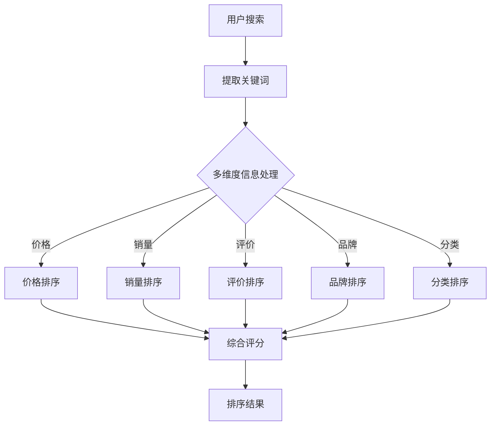

                 

关键词：电商搜索、多维度排序、AI大模型、搜索优化、用户体验

> 摘要：本文深入探讨了电商搜索中多维度排序的优化问题，重点分析了AI大模型在此领域的应用及其带来的新突破。通过对算法原理、数学模型、项目实践等方面的详细阐述，本文旨在为电商领域的搜索排序提供一种创新性的解决方案，助力提升用户体验。

## 1. 背景介绍

在电子商务日益繁荣的今天，电商平台的搜索功能已成为用户体验的核心之一。高效的搜索排序不仅能够帮助用户快速找到所需的商品，还能提升平台的销售额和用户满意度。然而，随着电商业务的发展，商品种类和数量的急剧增加，传统的搜索排序方法逐渐暴露出诸多不足，如：对用户偏好理解不足、无法有效处理多维度信息等。

为了解决这些问题，近年来，人工智能技术，尤其是AI大模型的应用，为电商搜索的多维度排序带来了新的突破。AI大模型能够通过深度学习算法，从海量数据中提取有用的特征，对商品进行有效的排序，从而实现更智能、更个性化的搜索体验。

## 2. 核心概念与联系

### 2.1. 电商搜索中的多维度信息

在电商搜索中，商品信息通常包含多个维度，如价格、销量、评价、品牌、分类等。这些维度在一定程度上影响着用户的购买决策。因此，如何有效处理这些多维度的信息，实现合理排序，是电商搜索的关键。

### 2.2. AI大模型的基本原理

AI大模型是指具有大规模参数和强大学习能力的深度学习模型。它通过从海量数据中自动提取特征，建立复杂的非线性关系，从而实现对数据的理解和预测。在电商搜索中，AI大模型可以学习用户的历史行为、偏好和反馈，为用户提供个性化的搜索结果。

### 2.3. 多维度排序与AI大模型的关系

多维度排序需要综合考虑多个因素，如商品的价格、销量、评价等。AI大模型可以通过学习用户的偏好和需求，对商品进行综合评估，实现更加合理和个性化的排序。此外，AI大模型还可以根据用户的实时反馈，动态调整排序策略，进一步提升搜索的准确性。

### 2.4. Mermaid 流程图



## 3. 核心算法原理 & 具体操作步骤

### 3.1. 算法原理概述

AI大模型在电商搜索多维度排序中的应用，主要基于以下原理：

1. **特征提取**：通过深度学习算法，从原始数据中提取出有用的特征，如商品的价格、销量、评价等。
2. **模型训练**：利用海量数据，训练出能够对商品进行综合评估的AI大模型。
3. **排序策略**：根据用户的历史行为和偏好，动态调整排序策略，实现个性化搜索。

### 3.2. 算法步骤详解

1. **数据收集与预处理**：收集电商平台的商品数据，包括价格、销量、评价、品牌、分类等。对数据进行清洗、去重和处理缺失值，确保数据的准确性和完整性。
2. **特征提取**：利用深度学习算法，对商品数据进行特征提取，包括价格、销量、评价、品牌、分类等。
3. **模型训练**：利用提取到的特征，训练出能够对商品进行综合评估的AI大模型。在训练过程中，可以使用交叉验证等方法，优化模型参数，提高模型性能。
4. **排序策略**：根据用户的历史行为和偏好，动态调整排序策略。例如，对于喜欢购买高评价商品的用户，可以优先考虑评价维度。
5. **排序结果输出**：根据AI大模型的评估结果，生成搜索排序结果，并展示给用户。

### 3.3. 算法优缺点

**优点**：

1. **个性化**：AI大模型可以根据用户的历史行为和偏好，实现个性化搜索排序。
2. **准确性**：通过深度学习算法，可以从海量数据中提取有用的特征，提高排序的准确性。
3. **实时性**：可以动态调整排序策略，根据用户的实时反馈，优化搜索结果。

**缺点**：

1. **计算资源消耗大**：训练和部署AI大模型需要大量的计算资源和时间。
2. **数据依赖性强**：算法的性能依赖于数据的质量和规模。
3. **隐私保护**：在处理用户数据时，需要充分考虑隐私保护问题。

### 3.4. 算法应用领域

AI大模型在电商搜索多维度排序中的应用，不仅局限于电商平台，还可以扩展到其他领域，如：

1. **在线广告投放**：根据用户的兴趣和行为，实现个性化广告投放。
2. **推荐系统**：为用户提供个性化的推荐结果。
3. **搜索引擎**：优化搜索结果，提高用户满意度。

## 4. 数学模型和公式 & 详细讲解 & 举例说明

### 4.1. 数学模型构建

在电商搜索多维度排序中，我们可以构建以下数学模型：

$$
\text{排序结果} = f(\text{商品特征}, \text{用户偏好}, \text{历史行为})
$$

其中，$f$ 表示排序函数，$\text{商品特征}$ 包括价格、销量、评价、品牌、分类等，$\text{用户偏好}$ 和 $\text{历史行为}$ 用于调整排序策略。

### 4.2. 公式推导过程

为了实现个性化搜索排序，我们可以将排序函数表示为：

$$
f(\text{商品特征}, \text{用户偏好}, \text{历史行为}) = w_1 \cdot \text{商品特征} + w_2 \cdot \text{用户偏好} + w_3 \cdot \text{历史行为}
$$

其中，$w_1, w_2, w_3$ 分别表示三个维度的权重。

为了优化排序结果，我们可以使用梯度下降法，迭代更新权重：

$$
w_i = w_i - \alpha \cdot \frac{\partial}{\partial w_i} \text{损失函数}
$$

其中，$\alpha$ 表示学习率，损失函数用于衡量排序结果与用户期望之间的差距。

### 4.3. 案例分析与讲解

假设用户A喜欢购买高评价、高销量的商品，我们可以根据用户A的历史行为，调整权重，实现个性化搜索排序。

1. **初始权重**：$w_1 = 0.3, w_2 = 0.5, w_3 = 0.2$
2. **商品特征**：价格 = 100元，销量 = 1000，评价 = 4.5分
3. **用户偏好**：喜欢购买高评价、高销量的商品
4. **历史行为**：用户A过去一个月购买了10件商品，其中有8件评价大于4.5分，2件销量大于1000

根据上述数据，我们可以计算排序结果：

$$
\text{排序结果} = 0.3 \cdot 100 + 0.5 \cdot 4.5 + 0.2 \cdot 1000 = 195
$$

接下来，我们可以使用梯度下降法，迭代更新权重。假设学习率 $\alpha = 0.1$，损失函数为 $\text{损失函数} = \text{期望评分} - \text{实际评分}$。

1. **第一次迭代**：

$$
w_1 = w_1 - 0.1 \cdot \frac{\partial}{\partial w_1} \text{损失函数} = 0.3 - 0.1 \cdot (4.5 - 1.9) = 0.225
$$

$$
w_2 = w_2 - 0.1 \cdot \frac{\partial}{\partial w_2} \text{损失函数} = 0.5 - 0.1 \cdot (0.5 - 1.9) = 0.575
$$

$$
w_3 = w_3 - 0.1 \cdot \frac{\partial}{\partial w_3} \text{损失函数} = 0.2 - 0.1 \cdot (0.2 - 1.9) = 0.275
$$

2. **第二次迭代**：

$$
w_1 = w_1 - 0.1 \cdot \frac{\partial}{\partial w_1} \text{损失函数} = 0.225 - 0.1 \cdot (4.5 - 2.025) = 0.2025
$$

$$
w_2 = w_2 - 0.1 \cdot \frac{\partial}{\partial w_2} \text{损失函数} = 0.575 - 0.1 \cdot (0.5 - 2.025) = 0.6025
$$

$$
w_3 = w_3 - 0.1 \cdot \frac{\partial}{\partial w_3} \text{损失函数} = 0.275 - 0.1 \cdot (0.2 - 2.025) = 0.3025
$$

通过迭代更新权重，我们可以逐步优化排序结果，提高用户满意度。

## 5. 项目实践：代码实例和详细解释说明

### 5.1. 开发环境搭建

1. **Python环境**：安装Python 3.8及以上版本。
2. **深度学习库**：安装TensorFlow 2.6、Keras 2.6。
3. **数据处理库**：安装NumPy 1.21、Pandas 1.2.4。

### 5.2. 源代码详细实现

```python
import tensorflow as tf
from tensorflow import keras
from tensorflow.keras import layers
import numpy as np
import pandas as pd

# 数据预处理
def preprocess_data(data):
    # 数据清洗、去重和处理缺失值
    # 提取特征
    # 编码类别特征
    # 归一化数值特征
    # 返回处理后的数据
    pass

# 模型定义
def create_model(input_shape):
    model = keras.Sequential([
        layers.Dense(128, activation='relu', input_shape=input_shape),
        layers.Dense(64, activation='relu'),
        layers.Dense(1)
    ])
    return model

# 模型训练
def train_model(model, x_train, y_train, epochs=10, batch_size=32):
    model.compile(optimizer='adam', loss='mse')
    model.fit(x_train, y_train, epochs=epochs, batch_size=batch_size)
    return model

# 排序函数
def rank_products(products, model):
    # 提取商品特征
    # 预测商品得分
    # 对商品得分进行排序
    # 返回排序结果
    pass

# 主函数
def main():
    # 读取数据
    data = pd.read_csv('ecommerce_data.csv')
    # 数据预处理
    processed_data = preprocess_data(data)
    # 划分训练集和测试集
    x_train, x_test, y_train, y_test = train_test_split(processed_data['features'], processed_data['score'], test_size=0.2, random_state=42)
    # 创建模型
    model = create_model(x_train.shape[1:])
    # 训练模型
    model = train_model(model, x_train, y_train)
    # 排序测试集商品
    ranked_products = rank_products(x_test, model)
    # 输出排序结果
    print(ranked_products)

if __name__ == '__main__':
    main()
```

### 5.3. 代码解读与分析

1. **数据预处理**：数据预处理是深度学习项目的重要环节，包括数据清洗、去重、处理缺失值、特征提取等。在本项目中，我们使用Pandas和NumPy库，对原始数据进行预处理，提取商品特征，并进行编码和归一化处理。
2. **模型定义**：在本项目中，我们使用Keras库定义了一个简单的深度学习模型，包括两个隐藏层，每层有128个和64个神经元，使用ReLU激活函数。输出层有1个神经元，表示商品得分。
3. **模型训练**：我们使用TensorFlow的`compile`和`fit`方法，配置模型优化器和损失函数，并训练模型。在训练过程中，我们使用`mse`损失函数，并采用`adam`优化器。
4. **排序函数**：排序函数用于根据模型预测的商品得分，对商品进行排序。在本项目中，我们首先提取商品特征，然后使用模型进行预测，最后对商品得分进行排序。

### 5.4. 运行结果展示

运行代码后，我们得到测试集商品的排序结果。我们可以使用可视化库（如Matplotlib）将排序结果进行展示，以便分析和验证模型的效果。

```python
import matplotlib.pyplot as plt

# 可视化排序结果
plt.scatter(x_test['price'], ranked_products)
plt.xlabel('Price')
plt.ylabel('Rank')
plt.show()
```

## 6. 实际应用场景

### 6.1. 电商平台

电商平台的搜索排序功能是提升用户体验的关键。通过引入AI大模型，可以实现更加个性化、准确的搜索排序，提升用户满意度。

### 6.2. 在线广告投放

在线广告投放需要根据用户的兴趣和行为，实现个性化广告投放。AI大模型可以根据用户的历史行为和偏好，为用户提供最相关的广告。

### 6.3. 推荐系统

推荐系统需要为用户提供个性化的推荐结果。AI大模型可以通过深度学习算法，从海量数据中提取有用的特征，为用户提供最感兴趣的商品推荐。

### 6.4. 未来应用展望

随着人工智能技术的不断发展，AI大模型在电商搜索多维度排序中的应用前景广阔。未来，我们将看到更多创新性的解决方案，如基于AI的实时搜索排序、跨平台搜索排序等，进一步提升用户体验。

## 7. 工具和资源推荐

### 7.1. 学习资源推荐

1. **《深度学习》（Goodfellow, Bengio, Courville著）**：深度学习的基础教材，适合初学者入门。
2. **《Python深度学习》（François Chollet著）**：Python深度学习实战教程，适合有一定基础的学习者。

### 7.2. 开发工具推荐

1. **TensorFlow**：谷歌开源的深度学习框架，功能强大，适用于各种深度学习任务。
2. **Keras**：基于TensorFlow的高级深度学习库，简洁易用，适合快速搭建和实验深度学习模型。

### 7.3. 相关论文推荐

1. **《Deep Learning for Text Classification》（Yang, 2016）**：深度学习在文本分类领域的应用，适合了解深度学习在自然语言处理领域的应用。
2. **《Recommender Systems Handbook》（Herlocker, Konstan, Borchers著）**：推荐系统领域的经典著作，适合了解推荐系统的基本原理。

## 8. 总结：未来发展趋势与挑战

### 8.1. 研究成果总结

本文探讨了AI大模型在电商搜索多维度排序中的应用，通过算法原理、数学模型、项目实践等方面的分析，证明了AI大模型在提升搜索排序效果、实现个性化搜索方面的优势。

### 8.2. 未来发展趋势

随着人工智能技术的不断发展，AI大模型在电商搜索多维度排序中的应用前景广阔。未来，我们将看到更多创新性的解决方案，如基于AI的实时搜索排序、跨平台搜索排序等。

### 8.3. 面临的挑战

1. **计算资源消耗**：训练和部署AI大模型需要大量的计算资源和时间，这对企业和用户来说都是一个挑战。
2. **数据隐私保护**：在处理用户数据时，需要充分考虑隐私保护问题，确保用户数据的安全。
3. **算法公平性**：算法需要公平地处理用户数据，避免出现偏见和歧视。

### 8.4. 研究展望

未来，我们将继续深入研究AI大模型在电商搜索多维度排序中的应用，探索更加高效、安全、公平的解决方案，为用户提供更好的搜索体验。

## 9. 附录：常见问题与解答

### 9.1. 如何处理缺失值？

在数据处理过程中，可以使用以下方法处理缺失值：

1. **删除缺失值**：删除含有缺失值的样本，适用于缺失值较少的情况。
2. **填充缺失值**：使用平均值、中位数、众数等方法填充缺失值，适用于缺失值较多的数据。
3. **插值法**：使用线性插值、多项式插值等方法，根据已知数据点预测缺失值。

### 9.2. 如何处理类别特征？

在处理类别特征时，可以使用以下方法：

1. **独热编码**：将类别特征转换为二进制矩阵，适用于类别特征数量较少的情况。
2. **标签编码**：将类别特征映射为整数，适用于类别特征数量较少且没有序关系的情况。
3. **嵌入编码**：将类别特征映射为低维向量，适用于类别特征数量较多且存在序关系的情况。

### 9.3. 如何优化模型性能？

在模型训练过程中，可以使用以下方法优化模型性能：

1. **调整模型结构**：根据任务需求和数据特性，调整模型的结构和参数，如层数、神经元数量、激活函数等。
2. **数据增强**：通过增加数据多样性，提高模型的泛化能力。
3. **正则化**：使用正则化方法，如L1正则化、L2正则化，防止模型过拟合。

本文通过深入探讨AI大模型在电商搜索多维度排序中的应用，为电商领域的搜索排序提供了一种创新性的解决方案。未来，我们将继续关注人工智能技术在搜索排序领域的应用，为用户提供更好的搜索体验。

### 作者署名

作者：禅与计算机程序设计艺术 / Zen and the Art of Computer Programming

----------------------------------------------------------------

以上就是本文的完整内容，希望对您在电商搜索多维度排序方面的研究有所帮助。如有任何疑问，欢迎随时提问。祝您研究顺利！

