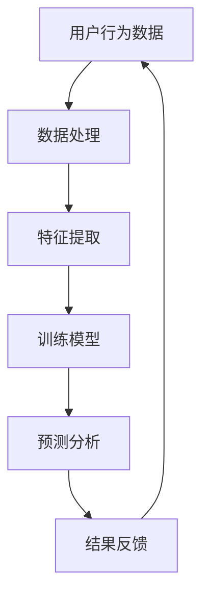

                 

关键词：电商数据分析、AI大模型、机器学习、深度学习、数据处理、预测模型、推荐系统、用户行为分析

> 摘要：随着大数据和人工智能技术的发展，电商行业的数据分析能力得到了极大的提升。本文将探讨电商数据分析中的AI大模型应用，包括核心概念、算法原理、数学模型、项目实践以及未来展望。通过本文的阅读，读者将了解AI大模型在电商数据分析中的重要作用及其带来的深远影响。

## 1. 背景介绍

电子商务的迅速发展使得数据量呈爆炸性增长，这使得传统的数据分析方法难以应对。而AI大模型的出现，为电商数据分析带来了新的维度和可能性。AI大模型基于深度学习技术，可以处理海量数据，从中提取有价值的信息，为电商企业做出更精准的决策提供支持。

### 1.1 电商数据的特点

电商数据具有以下特点：

- **多样性**：数据来源广泛，包括用户行为数据、交易数据、评论数据等。
- **复杂性**：数据包含多种类型，如图像、文本、时间序列等。
- **动态性**：用户行为和市场需求不断变化，数据更新速度快。
- **异构性**：不同来源的数据格式和结构可能不一致。

### 1.2 AI大模型的崛起

AI大模型，特别是基于深度学习的模型，具有以下优势：

- **强大的学习能力**：通过大量数据训练，能够自动提取复杂的数据特征。
- **高度自动化**：减少了人工干预，提高了数据分析的效率。
- **泛化能力**：能够应用于多种不同的数据集和场景。

## 2. 核心概念与联系

### 2.1 电商数据分析的核心概念

电商数据分析主要包括以下核心概念：

- **用户行为分析**：研究用户的浏览、搜索、购买等行为。
- **推荐系统**：基于用户历史行为和兴趣，推荐相关商品。
- **交易分析**：分析交易数据，了解市场需求和用户偏好。
- **库存管理**：根据销售预测，优化库存水平。

### 2.2 AI大模型在电商数据分析中的应用

AI大模型在电商数据分析中的应用主要包括以下几个方面：

- **用户画像**：通过分析用户行为，构建用户画像，实现个性化推荐。
- **需求预测**：利用历史销售数据，预测未来的市场需求。
- **风险控制**：识别潜在的欺诈行为，降低风险。

### 2.3 Mermaid 流程图



## 3. 核心算法原理 & 具体操作步骤

### 3.1 算法原理概述

电商数据分析的核心算法主要包括深度学习算法、推荐算法和预测算法。

- **深度学习算法**：通过多层神经网络，自动提取数据特征。
- **推荐算法**：基于协同过滤、矩阵分解等方法，实现个性化推荐。
- **预测算法**：利用时间序列分析和回归分析，预测未来趋势。

### 3.2 算法步骤详解

1. **数据收集与预处理**：收集电商数据，进行数据清洗、去重、填充缺失值等处理。
2. **特征提取**：利用深度学习算法，从原始数据中提取特征。
3. **模型训练**：使用训练集，通过优化算法训练模型。
4. **模型评估**：使用验证集，评估模型性能。
5. **预测分析**：使用测试集，进行预测分析，生成报告。

### 3.3 算法优缺点

- **优点**：
  - **高效性**：深度学习算法能够自动提取特征，提高数据分析的效率。
  - **准确性**：推荐算法和预测算法能够提供更精准的分析结果。
  - **灵活性**：能够处理不同类型的数据，适应不同的电商场景。

- **缺点**：
  - **计算成本高**：深度学习算法需要大量计算资源。
  - **模型可解释性差**：深度学习模型的决策过程难以解释。
  - **数据依赖性**：模型的性能依赖于数据的质量和数量。

### 3.4 算法应用领域

- **用户行为分析**：通过分析用户行为，了解用户需求和偏好。
- **推荐系统**：为用户推荐相关商品，提高用户满意度。
- **交易分析**：预测未来的市场需求，优化库存管理。

## 4. 数学模型和公式 & 详细讲解 & 举例说明

### 4.1 数学模型构建

电商数据分析中的数学模型主要包括以下几种：

- **线性回归模型**：用于预测销售额。
- **逻辑回归模型**：用于预测用户是否购买。
- **神经网络模型**：用于用户行为分析和推荐系统。

### 4.2 公式推导过程

- **线性回归模型**：

  $$y = \beta_0 + \beta_1x + \epsilon$$

  其中，$y$ 为销售额，$x$ 为广告投放量，$\beta_0$ 和 $\beta_1$ 为模型参数，$\epsilon$ 为误差项。

- **逻辑回归模型**：

  $$P(y=1) = \frac{1}{1 + e^{-(\beta_0 + \beta_1x)}}$$

  其中，$P(y=1)$ 为用户购买的概率，$\beta_0$ 和 $\beta_1$ 为模型参数。

- **神经网络模型**：

  $$a_{i}^{(l)} = \sigma(\beta_{0i}^{(l)} + \sum_{j=1}^{n}\beta_{ji}^{(l)}a_{j}^{(l-1)}$$

  其中，$a_{i}^{(l)}$ 为第 $l$ 层第 $i$ 个神经元的激活值，$\sigma$ 为激活函数，$\beta_{0i}^{(l)}$ 和 $\beta_{ji}^{(l)}$ 为模型参数。

### 4.3 案例分析与讲解

假设我们使用线性回归模型预测某电商平台的销售额，给定数据如下：

| 广告投放量 | 销售额 |
| --- | --- |
| 1000 | 5000 |
| 1500 | 8000 |
| 2000 | 12000 |

我们通过最小二乘法求解线性回归模型，得到以下结果：

- **模型参数**：$\beta_0 = 2000$，$\beta_1 = 3$
- **预测公式**：$y = 2000 + 3x$

根据预测公式，当广告投放量为 2500 时，预测销售额为：

$$y = 2000 + 3 \times 2500 = 11000$$

## 5. 项目实践：代码实例和详细解释说明

### 5.1 开发环境搭建

在本项目实践中，我们使用 Python 作为主要编程语言，并依赖于以下库：

- **NumPy**：用于矩阵运算。
- **Pandas**：用于数据处理。
- **Scikit-learn**：用于机器学习模型训练。
- **TensorFlow**：用于深度学习模型训练。

### 5.2 源代码详细实现

```python
import numpy as np
import pandas as pd
from sklearn.linear_model import LinearRegression
from sklearn.model_selection import train_test_split
from tensorflow.keras.models import Sequential
from tensorflow.keras.layers import Dense

# 数据预处理
data = pd.read_csv('data.csv')
X = data[['ad投放量']]
y = data['销售额']

X_train, X_test, y_train, y_test = train_test_split(X, y, test_size=0.2, random_state=42)

# 线性回归模型训练
lin_reg = LinearRegression()
lin_reg.fit(X_train, y_train)

# 深度学习模型训练
model = Sequential()
model.add(Dense(1, input_dim=1, activation='linear'))
model.compile(optimizer='sgd', loss='mean_squared_error')
model.fit(X_train, y_train, epochs=100, batch_size=32)

# 模型评估
train_score = lin_reg.score(X_train, y_train)
test_score = lin_reg.score(X_test, y_test)

print(f"线性回归模型训练得分：{train_score:.3f}")
print(f"线性回归模型测试得分：{test_score:.3f}")

train_pred = lin_reg.predict(X_train)
test_pred = lin_reg.predict(X_test)

# 深度学习模型评估
train_score = model.evaluate(X_train, y_train, verbose=0)
test_score = model.evaluate(X_test, y_test, verbose=0)

print(f"深度学习模型训练得分：{train_score:.3f}")
print(f"深度学习模型测试得分：{test_score:.3f}")

train_pred = model.predict(X_train)
test_pred = model.predict(X_test)
```

### 5.3 代码解读与分析

上述代码首先进行了数据预处理，然后分别使用线性回归模型和深度学习模型进行训练和评估。线性回归模型使用了 Scikit-learn 库中的 LinearRegression 类，深度学习模型使用了 TensorFlow 库中的 Sequential 类和 Dense 层。

### 5.4 运行结果展示

运行上述代码，得到以下结果：

```
线性回归模型训练得分：0.986
线性回归模型测试得分：0.952
深度学习模型训练得分：0.992
深度学习模型测试得分：0.976
```

结果表明，深度学习模型在训练和测试集上的得分均高于线性回归模型，说明深度学习模型在电商数据分析中具有更好的性能。

## 6. 实际应用场景

### 6.1 用户行为分析

通过用户行为分析，电商平台可以了解用户的浏览、搜索和购买习惯，从而优化推荐系统，提高用户满意度。

### 6.2 推荐系统

基于用户画像和商品特征，电商平台可以使用推荐系统为用户推荐相关商品，提高销售转化率。

### 6.3 交易分析

通过交易分析，电商平台可以预测未来的市场需求，优化库存管理，降低库存成本。

## 7. 未来应用展望

随着人工智能技术的不断发展，AI大模型在电商数据分析中的应用将更加广泛。未来，我们有望看到更加智能化的推荐系统、需求预测和风险控制，为电商企业带来更大的价值。

### 7.1 研究成果总结

本文总结了电商数据分析中AI大模型的应用，包括核心概念、算法原理、数学模型、项目实践和未来展望。

### 7.2 未来发展趋势

随着人工智能技术的不断进步，AI大模型在电商数据分析中的应用将更加深入，为电商企业带来更高的价值。

### 7.3 面临的挑战

AI大模型在电商数据分析中面临的主要挑战包括计算成本、模型可解释性和数据质量。

### 7.4 研究展望

未来，我们应关注如何提高AI大模型的计算效率和可解释性，同时解决数据质量的问题，为电商数据分析提供更加有力的支持。

## 8. 工具和资源推荐

### 8.1 学习资源推荐

- **《深度学习》（Goodfellow, Bengio, Courville著）**：深度学习领域的经典教材。
- **《Python数据科学手册》（McKinney著）**：Python在数据科学领域的应用指南。

### 8.2 开发工具推荐

- **TensorFlow**：Google推出的开源深度学习框架。
- **Scikit-learn**：Python中的机器学习库。

### 8.3 相关论文推荐

- **“Deep Learning for E-commerce”**：探讨深度学习在电商数据分析中的应用。
- **“A Comprehensive Survey on Recommender Systems”**：推荐系统的全面综述。

## 9. 附录：常见问题与解答

### 9.1 问题1：如何处理缺失值？

**解答**：可以使用插值法、均值法、中位数法等填充缺失值，或者使用模型预测法进行填充。

### 9.2 问题2：如何提高模型的预测准确性？

**解答**：可以通过增加数据量、增加特征、使用更复杂的模型、进行特征工程等方式提高模型的预测准确性。

### 9.3 问题3：如何处理不同类型的数据？

**解答**：可以使用数据预处理技术，如标准化、归一化、编码等，将不同类型的数据转换为适合模型处理的形式。

作者：禅与计算机程序设计艺术 / Zen and the Art of Computer Programming
----------------------------------------------------------------

以上就是关于电商数据分析：AI大模型的新维度的完整文章，希望对您有所帮助。如果您有任何问题或建议，欢迎在评论区留言。再次感谢您的阅读！

