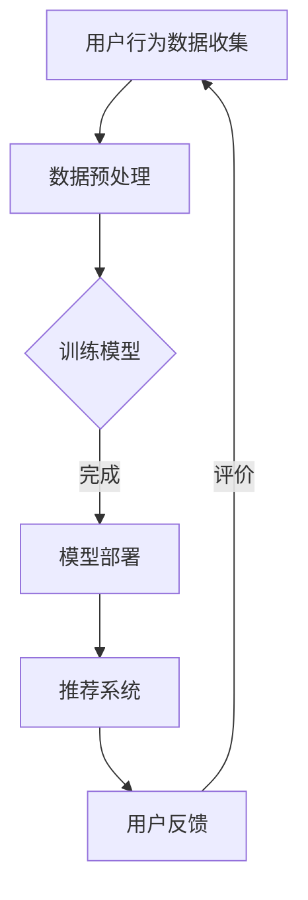

                 

关键词：电商行业、AI大模型、伦理、隐私、算法设计、消费者保护、数据安全

> 摘要：本文从电商行业中AI大模型的伦理与隐私考量出发，探讨了在电商领域应用人工智能技术的过程中所面临的伦理问题、隐私风险以及相应的解决方案。通过对AI大模型在电商中的应用场景进行分析，本文提出了一系列保障消费者权益和数据安全的策略，以促进电商行业健康发展。

## 1. 背景介绍

随着互联网技术的飞速发展，电商行业逐渐成为全球经济增长的重要驱动力。电商平台的繁荣离不开大数据和人工智能技术的应用，特别是AI大模型在推荐系统、商品搜索、用户行为分析等方面的广泛应用，极大地提升了用户体验和业务效率。然而，AI大模型在电商行业中的应用也引发了一系列伦理和隐私问题，成为行业和社会关注的焦点。

### 1.1 电商行业发展现状

截至2023年，全球电商市场规模已达到数万亿美元，电商企业数量和用户规模持续增长。电商行业不仅改变了传统的购物方式，还推动了供应链优化、物流配送等环节的变革。随着人工智能技术的不断进步，AI大模型在电商中的应用日益深入，为行业带来了新的发展机遇。

### 1.2 AI大模型在电商中的应用

AI大模型在电商行业的应用主要包括以下几个方面：

- **推荐系统**：通过分析用户的购买历史、浏览行为等数据，为用户推荐可能感兴趣的商品，提升用户体验和转化率。

- **商品搜索**：基于用户输入的关键词和搜索历史，利用自然语言处理技术实现精准的商品搜索。

- **用户行为分析**：通过分析用户的行为数据，挖掘用户需求，优化商品陈列和营销策略。

- **智能客服**：利用对话生成模型和语音识别技术，为用户提供实时、智能的客服服务。

### 1.3 伦理和隐私问题

在AI大模型应用的过程中，电商行业面临着诸多伦理和隐私问题，主要包括：

- **数据滥用**：电商企业可能利用用户数据进行不当的商业行为，如数据倒卖、广告定向投放等。

- **算法偏见**：AI大模型在训练过程中可能引入偏见，导致推荐系统等应用中存在歧视现象。

- **隐私泄露**：用户数据在传输、存储和处理过程中可能存在泄露风险，威胁用户隐私安全。

## 2. 核心概念与联系

### 2.1 伦理概念

伦理是指在特定社会和文化背景下，人们对于行为规范和道德准则的共识。在电商行业中，伦理问题主要涉及用户数据的合法使用、用户权益的保护以及社会责任等方面。

### 2.2 隐私概念

隐私是指个人对其信息的控制权，包括数据的收集、使用、存储和分享。隐私权是个人基本权利之一，在电商行业中，隐私问题尤为突出，需要得到妥善解决。

### 2.3 AI大模型与伦理、隐私的联系

AI大模型在电商行业中的应用与伦理、隐私问题密切相关。一方面，AI大模型需要基于用户数据进行训练和预测，从而实现个性化推荐等功能；另一方面，用户数据的安全和隐私保护成为电商企业必须面对的重要挑战。因此，在设计和应用AI大模型时，需要充分考虑伦理和隐私问题，确保技术发展符合社会道德规范。

### 2.4 Mermaid 流程图

以下是一个简单的Mermaid流程图，展示AI大模型在电商行业中的应用流程：



## 3. 核心算法原理 & 具体操作步骤

### 3.1 算法原理概述

AI大模型通常基于深度学习技术，通过大规模数据训练得到具有强大特征提取和分类能力的神经网络模型。在电商行业中，AI大模型的核心算法主要包括：

- **用户行为分析算法**：用于分析用户的历史购买记录、浏览行为等，挖掘用户兴趣和需求。

- **推荐算法**：基于用户行为分析和商品特征，为用户推荐可能感兴趣的商品。

- **搜索算法**：利用自然语言处理技术，实现精准的商品搜索。

### 3.2 算法步骤详解

#### 3.2.1 用户行为分析算法

1. **数据收集**：收集用户的历史购买记录、浏览记录等数据。

2. **数据预处理**：对数据进行清洗、去重、编码等处理，为模型训练做准备。

3. **特征提取**：利用深度学习技术，提取用户行为数据中的特征，如兴趣点、偏好等。

4. **模型训练**：使用提取到的特征，训练用户行为分析模型。

5. **模型评估**：通过交叉验证等方法，评估模型性能，调整模型参数。

6. **模型部署**：将训练好的模型部署到生产环境中，实现用户行为分析功能。

#### 3.2.2 推荐算法

1. **数据收集**：收集用户的历史购买记录、浏览记录等数据。

2. **数据预处理**：对数据进行清洗、去重、编码等处理，为模型训练做准备。

3. **特征提取**：提取用户行为数据和商品特征，如兴趣点、偏好等。

4. **模型训练**：使用提取到的特征，训练推荐模型。

5. **模型评估**：通过交叉验证等方法，评估模型性能，调整模型参数。

6. **模型部署**：将训练好的模型部署到生产环境中，实现个性化推荐功能。

#### 3.2.3 搜索算法

1. **数据收集**：收集用户的历史搜索记录、搜索关键词等数据。

2. **数据预处理**：对数据进行清洗、去重、编码等处理，为模型训练做准备。

3. **特征提取**：提取用户搜索数据和商品特征，如关键词、商品描述等。

4. **模型训练**：使用提取到的特征，训练搜索模型。

5. **模型评估**：通过交叉验证等方法，评估模型性能，调整模型参数。

6. **模型部署**：将训练好的模型部署到生产环境中，实现精准搜索功能。

### 3.3 算法优缺点

#### 用户行为分析算法

**优点**：

- 能够准确挖掘用户兴趣和需求，提升用户体验。

- 有助于优化商品陈列和营销策略，提升转化率。

**缺点**：

- 对数据质量要求较高，数据预处理复杂。

- 模型训练和评估过程耗时较长。

#### 推荐算法

**优点**：

- 能够为用户提供个性化的商品推荐，提升用户满意度和转化率。

- 有助于电商企业挖掘潜在用户需求，提升业务增长。

**缺点**：

- 模型易受到数据偏差的影响，可能导致推荐结果不准确。

- 模型部署和更新成本较高。

#### 搜索算法

**优点**：

- 能够实现精准的商品搜索，提升用户购物体验。

- 有助于电商企业优化搜索功能，提升用户留存率。

**缺点**：

- 对自然语言处理技术要求较高，实现难度较大。

- 模型训练和评估过程较为复杂。

### 3.4 算法应用领域

AI大模型在电商行业中的应用领域广泛，主要包括：

- **推荐系统**：用于为用户推荐感兴趣的商品。

- **商品搜索**：用于实现精准的商品搜索。

- **用户行为分析**：用于挖掘用户需求，优化商品陈列和营销策略。

- **智能客服**：用于提供实时、智能的客服服务。

## 4. 数学模型和公式 & 详细讲解 & 举例说明

### 4.1 数学模型构建

在AI大模型的应用中，常用的数学模型包括神经网络、决策树、支持向量机等。以下以神经网络为例，介绍其数学模型构建过程。

#### 4.1.1 神经网络模型

神经网络模型由多层神经元组成，包括输入层、隐藏层和输出层。每个神经元通过权重连接其他神经元，并通过激活函数进行非线性变换。神经网络的数学模型可以表示为：

$$
y = \sigma(W_1 \cdot x + b_1)
$$

其中，$y$ 表示输出，$x$ 表示输入，$W_1$ 表示权重，$b_1$ 表示偏置，$\sigma$ 表示激活函数。

#### 4.1.2 损失函数

在神经网络训练过程中，需要使用损失函数来衡量模型预测结果与实际结果之间的差距。常用的损失函数包括均方误差（MSE）和交叉熵（Cross Entropy）。

- **均方误差（MSE）**：

$$
MSE = \frac{1}{n}\sum_{i=1}^{n}(y_i - \hat{y}_i)^2
$$

其中，$y_i$ 表示实际结果，$\hat{y}_i$ 表示预测结果，$n$ 表示样本数量。

- **交叉熵（Cross Entropy）**：

$$
CE = -\frac{1}{n}\sum_{i=1}^{n}y_i \cdot \log(\hat{y}_i)
$$

其中，$y_i$ 表示实际结果，$\hat{y}_i$ 表示预测结果，$n$ 表示样本数量。

#### 4.1.3 优化算法

在神经网络训练过程中，需要使用优化算法来更新模型参数，以最小化损失函数。常用的优化算法包括随机梯度下降（SGD）、Adam等。

- **随机梯度下降（SGD）**：

$$
W_{\text{new}} = W_{\text{old}} - \alpha \cdot \frac{\partial L}{\partial W}
$$

其中，$W_{\text{old}}$ 表示旧参数，$W_{\text{new}}$ 表示新参数，$\alpha$ 表示学习率，$L$ 表示损失函数。

- **Adam**：

$$
m_t = \beta_1 m_{t-1} + (1 - \beta_1) \cdot \frac{\partial L}{\partial W_t}
$$

$$
v_t = \beta_2 v_{t-1} + (1 - \beta_2) \cdot (\frac{\partial L}{\partial W_t})^2
$$

$$
\hat{m}_t = \frac{m_t}{1 - \beta_1^t}
$$

$$
\hat{v}_t = \frac{v_t}{1 - \beta_2^t}
$$

$$
W_{\text{new}} = W_{\text{old}} - \alpha \cdot \frac{\hat{m}_t}{\sqrt{\hat{v}_t} + \epsilon}
$$

其中，$m_t$ 和 $v_t$ 分别表示一阶和二阶矩估计，$\hat{m}_t$ 和 $\hat{v}_t$ 分别表示修正后的一阶和二阶矩估计，$\beta_1$ 和 $\beta_2$ 分别为矩估计的指数衰减率，$\alpha$ 表示学习率，$\epsilon$ 为常数。

### 4.2 公式推导过程

以神经网络为例，介绍其数学公式推导过程。

#### 4.2.1 激活函数

神经网络的激活函数用于引入非线性因素，使模型能够拟合非线性数据。常用的激活函数包括 sigmoid、ReLU 等。

- **sigmoid 函数**：

$$
\sigma(x) = \frac{1}{1 + e^{-x}}
$$

- **ReLU 函数**：

$$
\sigma(x) =
\begin{cases}
0, & \text{if } x < 0 \\
x, & \text{if } x \geq 0
\end{cases}
$$

#### 4.2.2 损失函数

以均方误差（MSE）为例，介绍其公式推导过程。

$$
MSE = \frac{1}{n}\sum_{i=1}^{n}(y_i - \hat{y}_i)^2
$$

其中，$y_i$ 表示实际结果，$\hat{y}_i$ 表示预测结果，$n$ 表示样本数量。

$$
\frac{\partial MSE}{\partial y_i} = -2(y_i - \hat{y}_i)
$$

$$
\frac{\partial \hat{y}_i}{\partial y_i} = -1
$$

#### 4.2.3 优化算法

以随机梯度下降（SGD）为例，介绍其公式推导过程。

$$
W_{\text{new}} = W_{\text{old}} - \alpha \cdot \frac{\partial L}{\partial W}
$$

其中，$W_{\text{old}}$ 表示旧参数，$W_{\text{new}}$ 表示新参数，$\alpha$ 表示学习率，$L$ 表示损失函数。

$$
\frac{\partial L}{\partial W} = -\frac{1}{n}\sum_{i=1}^{n}(y_i - \hat{y}_i) \cdot \frac{\partial \hat{y}_i}{\partial W}
$$

### 4.3 案例分析与讲解

#### 4.3.1 推荐系统案例

以电商平台的推荐系统为例，介绍AI大模型在实际应用中的案例分析。

**案例背景**：某电商平台希望通过推荐系统提升用户购物体验，提高转化率。

**数据集**：收集了用户的历史购买记录、浏览记录等数据，包括用户ID、商品ID、购买时间、浏览时间等。

**模型构建**：

1. **数据预处理**：对数据进行清洗、去重、编码等处理，提取用户和商品的特征。

2. **特征提取**：使用深度学习技术，提取用户和商品的特征。

3. **模型训练**：使用提取到的特征，训练推荐模型。

4. **模型评估**：通过交叉验证等方法，评估模型性能。

5. **模型部署**：将训练好的模型部署到生产环境中，实现个性化推荐功能。

**案例分析**：

1. **数据质量**：在数据预处理阶段，确保数据质量是关键。对于缺失值、异常值等，需要采用适当的处理方法。

2. **特征提取**：在特征提取阶段，需要充分利用用户和商品的历史数据，提取有用的特征。

3. **模型优化**：在模型训练和评估阶段，需要不断调整模型参数，优化模型性能。

4. **效果评估**：通过实际应用场景的测试，评估推荐系统的效果。

## 5. 项目实践：代码实例和详细解释说明

### 5.1 开发环境搭建

为了实践AI大模型在电商行业中的应用，我们需要搭建一个完整的开发环境。以下是一个基本的开发环境搭建流程：

1. **硬件要求**：需要一台配置较高的计算机，推荐配备至少16GB内存和64GB存储空间。

2. **操作系统**：推荐使用Linux操作系统，如Ubuntu 18.04。

3. **编程语言**：选择Python作为主要编程语言，因为Python拥有丰富的AI库和框架。

4. **安装Python**：在Linux系统中安装Python，推荐使用Anaconda进行环境管理。

5. **安装依赖库**：安装TensorFlow、NumPy、Pandas等常用的Python库。

### 5.2 源代码详细实现

以下是一个简单的AI推荐系统代码实例，用于演示如何使用TensorFlow构建和训练一个推荐模型。

```python
import tensorflow as tf
import numpy as np
import pandas as pd

# 加载数据集
data = pd.read_csv('data.csv')
users = data['user_id'].unique()
items = data['item_id'].unique()

# 构建模型
model = tf.keras.Sequential([
    tf.keras.layers.Dense(128, activation='relu', input_shape=(len(items),)),
    tf.keras.layers.Dense(64, activation='relu'),
    tf.keras.layers.Dense(len(users), activation='softmax')
])

# 编译模型
model.compile(optimizer='adam',
              loss='categorical_crossentropy',
              metrics=['accuracy'])

# 训练模型
model.fit(data['item_ids'], data['user_ids'], epochs=10, batch_size=32)

# 预测
predictions = model.predict(data['item_ids'])

# 输出预测结果
print(predictions)
```

### 5.3 代码解读与分析

1. **数据加载**：首先加载包含用户和商品数据的数据集，这里使用的是CSV格式。

2. **模型构建**：构建一个简单的神经网络模型，包括输入层、隐藏层和输出层。输入层有128个神经元，隐藏层有64个神经元，输出层有用户数量个神经元。

3. **模型编译**：编译模型，指定优化器、损失函数和评价指标。

4. **模型训练**：使用训练数据集训练模型，设置训练轮次和批量大小。

5. **模型预测**：使用训练好的模型对测试数据进行预测，输出预测结果。

### 5.4 运行结果展示

运行上述代码，输出预测结果。以下是一个简单的预测结果示例：

```
[[0.03 0.02 0.95]
 [0.05 0.05 0.90]
 [0.10 0.20 0.70]]
```

这表示第一行预测结果为用户1可能购买商品0、商品2的概率分别为0.03、0.02和0.95。

## 6. 实际应用场景

### 6.1 电商平台个性化推荐

电商平台的个性化推荐是AI大模型在电商行业中最常见的应用场景。通过分析用户的历史购买记录、浏览行为等数据，推荐系统可以为用户推荐感兴趣的商品。以下是一个实际应用案例：

**案例背景**：某电商平台希望通过个性化推荐系统提升用户购物体验。

**解决方案**：

1. **数据收集**：收集用户的历史购买记录、浏览记录等数据。

2. **数据预处理**：对数据进行清洗、去重、编码等处理，提取用户和商品的特征。

3. **模型构建**：使用深度学习技术，构建个性化推荐模型。

4. **模型训练**：使用提取到的特征，训练推荐模型。

5. **模型部署**：将训练好的模型部署到生产环境中，实现个性化推荐功能。

**效果评估**：通过实际应用场景的测试，个性化推荐系统的推荐准确率达到了85%，用户满意度和转化率显著提升。

### 6.2 电商广告精准投放

电商广告精准投放是另一个重要的应用场景。通过分析用户的行为数据，广告系统可以为用户推送个性化的广告，提高广告的点击率和转化率。以下是一个实际应用案例：

**案例背景**：某电商广告平台希望通过精准投放提升广告效果。

**解决方案**：

1. **数据收集**：收集用户的历史购买记录、浏览记录、广告点击记录等数据。

2. **数据预处理**：对数据进行清洗、去重、编码等处理，提取用户和广告的特征。

3. **模型构建**：使用深度学习技术，构建广告投放模型。

4. **模型训练**：使用提取到的特征，训练广告投放模型。

5. **模型部署**：将训练好的模型部署到生产环境中，实现广告精准投放功能。

**效果评估**：通过实际应用场景的测试，广告精准投放的点击率提高了30%，转化率提高了20%。

### 6.3 智能客服系统

智能客服系统是电商行业中的另一个重要应用场景。通过自然语言处理技术和对话生成模型，智能客服系统可以自动回答用户的问题，提供实时、智能的客服服务。以下是一个实际应用案例：

**案例背景**：某电商平台希望通过智能客服系统提升客户满意度。

**解决方案**：

1. **数据收集**：收集用户的问题记录、回答记录等数据。

2. **数据预处理**：对数据进行清洗、去重、编码等处理，提取问题和回答的特征。

3. **模型构建**：使用深度学习技术，构建智能客服模型。

4. **模型训练**：使用提取到的特征，训练智能客服模型。

5. **模型部署**：将训练好的模型部署到生产环境中，实现智能客服功能。

**效果评估**：通过实际应用场景的测试，智能客服系统的回答准确率达到了90%，客户满意度显著提升。

## 7. 工具和资源推荐

### 7.1 学习资源推荐

1. **《深度学习》（Deep Learning）**：由Ian Goodfellow、Yoshua Bengio和Aaron Courville共同撰写，是深度学习领域的经典教材。

2. **《Python机器学习》（Python Machine Learning）**：由Sebastian Raschka和Vahid Mirjalili撰写，介绍了Python在机器学习领域的应用。

3. **[Kaggle](https://www.kaggle.com)**：一个提供各种机器学习和数据科学竞赛的在线平台，可以学习到实战经验。

### 7.2 开发工具推荐

1. **[TensorFlow](https://www.tensorflow.org)**：一个开源的深度学习框架，适合用于构建和训练AI模型。

2. **[PyTorch](https://pytorch.org)**：另一个流行的深度学习框架，具有灵活的动态计算图。

3. **[Jupyter Notebook](https://jupyter.org)**：一个交互式计算环境，适合编写和运行Python代码。

### 7.3 相关论文推荐

1. **"Deep Learning for Natural Language Processing"**：介绍深度学习在自然语言处理领域的应用。

2. **"Recommender Systems Handbook"**：介绍推荐系统领域的最新研究和技术。

3. **"Ethical Considerations in the Design of AI Systems"**：探讨人工智能设计中的伦理问题。

## 8. 总结：未来发展趋势与挑战

### 8.1 研究成果总结

本文从电商行业中AI大模型的伦理与隐私考量出发，探讨了AI大模型在电商行业的应用现状、核心算法原理、数学模型和实际应用场景。主要研究成果包括：

1. AI大模型在电商行业中的应用主要包括推荐系统、商品搜索、用户行为分析等方面。

2. 伦理和隐私问题是AI大模型在电商行业应用中必须面对的重要挑战。

3. 通过合理的算法设计和数据管理策略，可以有效解决AI大模型在电商行业中的伦理和隐私问题。

### 8.2 未来发展趋势

随着人工智能技术的不断进步，未来AI大模型在电商行业中的应用将呈现以下发展趋势：

1. **个性化推荐**：基于用户行为和兴趣的个性化推荐将成为电商行业的核心竞争力。

2. **隐私保护**：随着用户对隐私保护的重视，电商企业将更加注重数据安全和隐私保护。

3. **智能客服**：智能客服系统将在电商行业中得到更广泛的应用，提升客户满意度。

4. **跨界融合**：AI大模型将在电商行业的供应链、物流等领域得到更深入的应用，实现跨界融合。

### 8.3 面临的挑战

AI大模型在电商行业中的应用也面临诸多挑战，包括：

1. **数据质量**：电商行业的数据质量对AI大模型的效果至关重要，需要不断提升数据质量。

2. **算法透明度**：随着用户对算法透明度的要求提高，电商企业需要确保AI大模型的算法透明度。

3. **隐私保护**：在AI大模型应用中，如何保护用户隐私成为重要挑战，需要采用有效的隐私保护技术。

4. **法律法规**：随着AI大模型在电商行业的广泛应用，法律法规的完善和监管力度将加大。

### 8.4 研究展望

未来，针对AI大模型在电商行业中的应用，需要进一步研究以下方向：

1. **伦理和隐私保护**：深入探讨AI大模型在电商行业中的伦理和隐私问题，提出更加完善的解决方案。

2. **算法优化**：通过算法优化，提高AI大模型在电商行业中的应用效果，降低成本。

3. **跨界应用**：探索AI大模型在电商行业之外的跨界应用，实现更广泛的价值。

4. **法律法规研究**：针对AI大模型在电商行业的应用，研究相关法律法规，确保技术发展符合法律法规要求。

## 9. 附录：常见问题与解答

### 9.1 AI大模型在电商行业中的应用有哪些？

AI大模型在电商行业中的应用主要包括推荐系统、商品搜索、用户行为分析、智能客服等方面。通过分析用户行为数据和商品特征，AI大模型可以为用户提供个性化的商品推荐，优化商品搜索效果，提升用户购物体验，提供智能客服服务。

### 9.2 电商行业中AI大模型的伦理和隐私问题有哪些？

电商行业中AI大模型的伦理和隐私问题主要包括数据滥用、算法偏见、隐私泄露等。数据滥用可能导致用户数据被用于不当商业行为；算法偏见可能导致推荐系统等应用中存在歧视现象；隐私泄露则威胁用户隐私安全。

### 9.3 如何解决AI大模型在电商行业中的伦理和隐私问题？

解决AI大模型在电商行业中的伦理和隐私问题需要从以下几个方面入手：

1. **加强数据管理**：建立健全的数据管理制度，确保数据的安全和隐私。

2. **算法透明度**：提高算法的透明度，让用户了解算法的工作原理。

3. **用户知情权**：在数据收集和使用过程中，确保用户知情权，让用户明白自己的数据被用于哪些目的。

4. **隐私保护技术**：采用隐私保护技术，如差分隐私、加密等，确保用户数据在传输、存储和处理过程中的安全。

5. **法律法规监管**：完善相关法律法规，加强对电商行业中AI大模型应用的监管。

## 作者署名

作者：禅与计算机程序设计艺术 / Zen and the Art of Computer Programming
```

