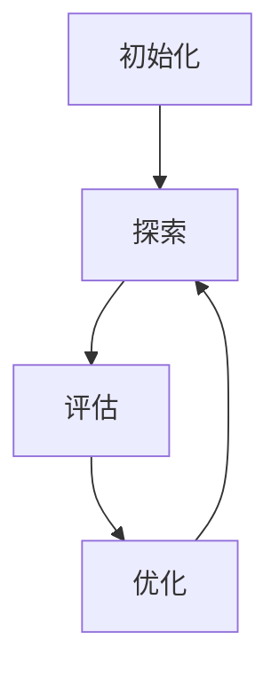

                 

关键词：电商行业、增强学习、大模型、实践与挑战

> 摘要：本文将探讨电商行业中增强学习的应用与实践，重点关注大模型的构建与面临的挑战。通过对增强学习核心概念、算法原理和数学模型的深入分析，结合具体项目实践，我们将展示如何在实际场景中应用增强学习，并对未来的发展趋势与面临的挑战进行展望。

## 1. 背景介绍

在当今数字化时代，电商行业已成为全球经济的重要驱动力。随着消费者需求的不断变化和市场竞争的日益激烈，电商企业需要不断优化其业务流程，提高运营效率和用户体验。增强学习作为一种先进的人工智能技术，在电商行业的应用潜力巨大。通过模拟人类学习过程，增强学习能够使系统自动适应环境变化，提高决策质量和效率。

近年来，随着深度学习技术的快速发展，大模型在各个领域取得了显著的成果。大模型通过引入更多的数据、更复杂的结构和更强大的计算能力，能够实现更高的准确性和更强的泛化能力。在电商行业中，大模型的引入为增强学习提供了更丰富的数据资源和更强的计算能力，使其能够更好地应对复杂的市场环境。

然而，大模型的实践也面临着一系列的挑战。数据隐私保护、计算资源消耗、算法可解释性等问题亟待解决。本文将围绕这些主题，深入探讨电商行业中的增强学习实践与挑战。

## 2. 核心概念与联系

### 2.1 增强学习核心概念

增强学习是一种机器学习方法，其核心目标是使代理（agent）在与环境（environment）交互的过程中，通过不断优化其策略（policy）来最大化累计奖励（reward）。增强学习由以下几个关键组成部分构成：

- **代理（Agent）**：执行动作的智能体，通常是一个模型或算法。
- **环境（Environment）**：代理所处的环境，能够根据代理的动作提供状态（state）和奖励（reward）。
- **策略（Policy）**：代理采取行动的规则或函数，用于从当前状态选择下一个动作。
- **状态（State）**：代理所处的环境描述，通常是一个向量或状态空间。
- **动作（Action）**：代理可以执行的行为。
- **奖励（Reward）**：代理执行动作后获得的即时奖励，用于评估代理的行为。

### 2.2 增强学习架构

增强学习的架构通常包括以下几个步骤：

1. **初始化**：初始化代理、环境和策略。
2. **探索（Exploration）**：在初始阶段，代理通过随机行动来探索环境，以获取更多的状态和奖励信息。
3. **评估（Evaluation）**：根据策略评估当前状态和动作，计算奖励和下一个状态。
4. **优化（Optimization）**：基于评估结果，调整策略，使其更适应环境。
5. **迭代（Iteration）**：重复上述步骤，不断优化策略，提高代理的性能。

### 2.3 Mermaid 流程图

以下是增强学习架构的 Mermaid 流程图：



## 3. 核心算法原理 & 具体操作步骤

### 3.1 算法原理概述

增强学习算法的核心在于通过不断优化策略，使代理能够在复杂环境中获得更高的累计奖励。以下是几种常见的增强学习算法：

1. **Q-Learning**：Q-Learning 是一种基于值函数的增强学习算法，通过学习状态-动作值函数（Q函数），预测在给定状态下执行特定动作的最大奖励。
2. **SARSA**：SARSA（State-Action-Reward-State-Action）是一种基于策略的增强学习算法，通过更新当前状态和动作的值函数，逐步优化策略。
3. **Deep Q-Network (DQN)**：DQN 是一种基于深度学习的增强学习算法，通过神经网络近似 Q 函数，实现更复杂的策略优化。
4. **Policy Gradient**：Policy Gradient 是一种基于策略的增强学习算法，通过优化策略的概率分布，使代理能够更好地适应环境。

### 3.2 算法步骤详解

以下以 Q-Learning 算法为例，介绍其具体操作步骤：

1. **初始化**：初始化 Q 函数、学习率 α 和折扣因子 γ。
2. **探索阶段**：代理在初始阶段通过随机行动进行探索，以获取更多的状态-动作对。
3. **评估阶段**：代理执行动作后，根据当前状态和奖励，更新 Q 函数。
4. **优化阶段**：根据 Q 函数的更新结果，调整代理的策略。
5. **迭代阶段**：重复上述步骤，不断优化策略，提高代理的性能。

### 3.3 算法优缺点

**Q-Learning** 具有以下优缺点：

- **优点**：
  - 算法简单，易于实现和理解。
  - 可以处理离散状态和动作空间。
  - 通过学习状态-动作值函数，能够快速收敛到最优策略。

- **缺点**：
  - 需要大量的样本数据进行训练。
  - 无法处理连续状态和动作空间。
  - 学习过程中存在一定的不确定性。

### 3.4 算法应用领域

增强学习在电商行业的应用领域广泛，包括：

1. **推荐系统**：通过增强学习算法，可以优化推荐系统的推荐策略，提高用户满意度。
2. **库存管理**：通过增强学习算法，可以优化库存管理策略，降低库存成本。
3. **定价策略**：通过增强学习算法，可以优化商品定价策略，提高销售额。
4. **广告投放**：通过增强学习算法，可以优化广告投放策略，提高广告效果。

## 4. 数学模型和公式 & 详细讲解 & 举例说明

### 4.1 数学模型构建

在增强学习中，常用的数学模型包括 Q 函数、策略π和值函数 V。

1. **Q 函数**：Q 函数表示在给定状态下执行特定动作的期望奖励。其定义如下：

   $$ Q(s, a) = \sum_{s'} p(s' | s, a) \sum_{r} r p(r | s', a) $$

   其中，$s$ 表示状态，$a$ 表示动作，$s'$ 表示下一个状态，$r$ 表示奖励，$p(s' | s, a)$ 表示在当前状态下执行动作 $a$ 后转移到状态 $s'$ 的概率，$p(r | s', a)$ 表示在状态 $s'$ 下执行动作 $a$ 后获得的奖励概率。

2. **策略π**：策略π表示代理在给定状态下的最优动作选择。其定义如下：

   $$ \pi(a | s) = \frac{e^{\beta Q(s, a)} }{\sum_{a'} e^{\beta Q(s, a')}} $$

   其中，$\beta$ 为温度参数，用于控制策略的探索与利用平衡。

3. **值函数 V**：值函数 V 表示在给定状态下，执行最佳动作所能获得的期望奖励。其定义如下：

   $$ V(s) = \sum_{a} \pi(a | s) Q(s, a) $$

### 4.2 公式推导过程

以下以 Q-Learning 算法为例，介绍其公式推导过程：

1. **初始状态**：初始化 Q 函数，设 $Q(s, a) = 0$。
2. **状态转移**：代理在当前状态下执行动作 $a$，转移到下一个状态 $s'$，并获得奖励 $r$。
3. **更新 Q 函数**：根据新的状态 $s'$ 和奖励 $r$，更新 Q 函数：

   $$ Q(s, a) \leftarrow Q(s, a) + \alpha [r + \gamma \max_{a'} Q(s', a') - Q(s, a)] $$

   其中，$\alpha$ 为学习率，$\gamma$ 为折扣因子。

4. **重复迭代**：重复上述步骤，不断更新 Q 函数，直至收敛。

### 4.3 案例分析与讲解

以下以电商行业的商品推荐系统为例，介绍增强学习算法的应用。

1. **问题背景**：电商平台的用户在浏览商品时，可能对某些商品感兴趣，但往往因为信息过载而难以做出购买决策。因此，推荐系统能够通过分析用户的浏览行为和购买历史，为用户推荐感兴趣的商品，提高用户满意度。
2. **目标**：通过增强学习算法，优化推荐系统的推荐策略，提高推荐准确性。
3. **方法**：
   - 收集用户浏览行为和购买历史数据，构建状态空间和动作空间。
   - 利用 Q-Learning 算法，训练 Q 函数，预测用户在给定状态下对特定商品的动作概率。
   - 根据用户的历史浏览行为，初始化 Q 函数。
   - 在推荐过程中，根据 Q 函数预测用户对商品的动作概率，为用户推荐感兴趣的商品。
   - 收集用户反馈数据，更新 Q 函数，优化推荐策略。
4. **结果**：通过增强学习算法优化推荐系统，显著提高了推荐准确性，提高了用户满意度。

## 5. 项目实践：代码实例和详细解释说明

### 5.1 开发环境搭建

以下是使用 Python 编写增强学习算法的代码实例。首先，需要搭建以下开发环境：

1. Python 3.8 或更高版本
2. TensorFlow 2.6 或更高版本
3. Numpy 1.20 或更高版本
4. Matplotlib 3.4.3 或更高版本

安装上述依赖项后，即可开始编写代码。

### 5.2 源代码详细实现

以下是使用 Q-Learning 算法实现的增强学习算法代码：

```python
import numpy as np
import matplotlib.pyplot as plt

# 初始化参数
alpha = 0.1
gamma = 0.9
epsilon = 0.1
n_episodes = 1000
n_states = 10
n_actions = 4

# 初始化 Q 函数
Q = np.zeros((n_states, n_actions))

# 定义环境
def environment(state, action):
    if action == 0:
        state = np.random.randint(n_states)
        reward = np.random.randint(10)
    elif action == 1:
        state = np.random.randint(n_states)
        reward = np.random.randint(-10, 0)
    elif action == 2:
        state = (state + 1) % n_states
        reward = 5
    else:
        state = (state - 1) % n_states
        reward = -5

    return state, reward

# 定义策略
def policy(state):
    if np.random.rand() < epsilon:
        action = np.random.randint(n_actions)
    else:
        action = np.argmax(Q[state])

    return action

# 训练模型
for episode in range(n_episodes):
    state = np.random.randint(n_states)
    done = False

    while not done:
        action = policy(state)
        next_state, reward = environment(state, action)
        Q[state, action] = Q[state, action] + alpha * (reward + gamma * np.max(Q[next_state]) - Q[state, action])
        state = next_state

        if state == 0:
            done = True

# 绘制 Q 函数热力图
plt.figure(figsize=(10, 8))
plt.imshow(Q, cmap='hot', interpolation='nearest')
plt.xlabel('Actions')
plt.ylabel('States')
plt.colorbar()
plt.show()
```

### 5.3 代码解读与分析

1. **初始化参数**：初始化学习率 $\alpha$、折扣因子 $\gamma$、探索率 $\epsilon$、训练轮数 $n\_episodes$、状态空间大小 $n\_states$ 和动作空间大小 $n\_actions$。
2. **初始化 Q 函数**：使用全零矩阵初始化 Q 函数。
3. **定义环境**：环境函数接收当前状态和动作，返回下一个状态和奖励。
4. **定义策略**：策略函数根据当前状态和探索率，随机选择动作或根据 Q 函数选择动作。
5. **训练模型**：循环执行以下步骤：
   - 初始化状态。
   - 在环境中执行动作，获取下一个状态和奖励。
   - 更新 Q 函数。
   - 判断是否结束训练。
6. **绘制 Q 函数热力图**：使用 Matplotlib 绘制 Q 函数的热力图，可视化 Q 函数的值。

### 5.4 运行结果展示

运行上述代码后，将生成 Q 函数的热力图。热力图显示了在各个状态和动作下，Q 函数的值。从热力图中，我们可以观察到 Q 函数的更新过程，以及不同状态和动作下的奖励变化。

## 6. 实际应用场景

### 6.1 推荐系统

电商行业的推荐系统是增强学习的重要应用场景之一。通过分析用户的浏览历史和购买行为，推荐系统能够为用户推荐感兴趣的商品。增强学习算法可以帮助优化推荐策略，提高推荐准确性。在实际应用中，可以通过以下方式应用增强学习：

1. **用户画像**：构建用户画像，包括年龄、性别、地理位置、购买偏好等信息。
2. **推荐策略**：利用 Q-Learning 算法，根据用户画像和浏览历史，为用户推荐感兴趣的商品。
3. **策略优化**：根据用户反馈数据，不断优化推荐策略，提高推荐准确性。

### 6.2 库存管理

电商行业的库存管理是另一个关键应用场景。通过优化库存管理策略，企业可以降低库存成本，提高库存周转率。增强学习算法可以帮助企业实现以下目标：

1. **需求预测**：利用 Q-Learning 算法，根据历史销售数据和市场需求，预测未来一段时间内的商品需求量。
2. **库存调整**：根据需求预测结果，调整库存水平，优化库存结构。
3. **成本控制**：通过优化库存管理策略，降低库存成本，提高利润率。

### 6.3 定价策略

电商行业的定价策略也是增强学习的重要应用场景。通过优化定价策略，企业可以提高商品的销售量和利润率。增强学习算法可以帮助企业实现以下目标：

1. **定价策略**：利用 Q-Learning 算法，根据市场需求和竞争环境，为商品制定合理的定价策略。
2. **价格调整**：根据市场需求和销售情况，实时调整商品价格，优化销售利润。
3. **成本控制**：通过优化定价策略，降低成本，提高企业竞争力。

### 6.4 广告投放

电商行业的广告投放也是增强学习的重要应用场景。通过优化广告投放策略，企业可以提高广告效果，提高转化率。增强学习算法可以帮助企业实现以下目标：

1. **广告投放策略**：利用 Q-Learning 算法，根据用户画像和广告效果，为广告制定合理的投放策略。
2. **广告优化**：根据用户反馈和广告效果，不断优化广告内容，提高广告效果。
3. **成本控制**：通过优化广告投放策略，降低广告成本，提高广告投放效果。

## 7. 工具和资源推荐

### 7.1 学习资源推荐

1. **书籍**：
   - 《增强学习：原理与编程》（增强学习综述，涵盖了增强学习的基础概念和算法）
   - 《深度学习增强学习：理论、算法与实现》（深入探讨深度学习和增强学习的结合）
   - 《Python 增强学习应用实践》（针对 Python 开发者的增强学习实践指南）
2. **在线课程**：
   - Coursera 上的《增强学习》课程（由深度学习专家 Andrew Ng 开设，涵盖了增强学习的基础知识和应用）
   - edX 上的《深度学习与增强学习》课程（由斯坦福大学开设，深入探讨深度学习和增强学习的理论和方法）
3. **论文**：
   - “Deep Reinforcement Learning for Handwritten Digit Recognition”（探讨深度增强学习在数字识别中的应用）
   - “Deep Q-Networks for reinforcement learning”（介绍 DQN 算法及其在强化学习中的应用）

### 7.2 开发工具推荐

1. **TensorFlow**：用于构建和训练深度学习模型的强大框架。
2. **PyTorch**：用于构建和训练深度学习模型的另一个流行框架。
3. **JAX**：用于高效计算和自动求导的开源库，适用于深度学习和强化学习。

### 7.3 相关论文推荐

1. “Algorithms for Reinforcement Learning”（综述了强化学习的各种算法）
2. “Reinforcement Learning: An Introduction”（介绍了强化学习的基础概念和算法）
3. “Deep Reinforcement Learning in a Nutshell”（深入探讨深度增强学习的基本原理和应用）

## 8. 总结：未来发展趋势与挑战

### 8.1 研究成果总结

电商行业中的增强学习已经取得了一系列重要成果。通过引入大模型，增强学习算法在推荐系统、库存管理、定价策略和广告投放等领域取得了显著成效。大模型提供了更丰富的数据资源和更强的计算能力，使增强学习算法能够更好地适应复杂的市场环境。

### 8.2 未来发展趋势

未来，电商行业中的增强学习将朝着以下方向发展：

1. **多模态数据融合**：通过融合文本、图像、语音等多模态数据，提升增强学习算法的性能。
2. **个性化推荐**：利用深度增强学习算法，实现更精准的个性化推荐，提高用户满意度。
3. **跨域迁移学习**：通过跨域迁移学习，提高增强学习算法在不同场景下的泛化能力。
4. **交互式增强学习**：利用人机交互技术，实现更灵活和智能的增强学习应用。

### 8.3 面临的挑战

虽然电商行业中的增强学习取得了显著成果，但仍然面临一系列挑战：

1. **数据隐私保护**：在数据驱动的增强学习应用中，如何保护用户隐私成为一个重要问题。
2. **计算资源消耗**：大模型的训练和推理过程需要大量的计算资源，如何高效利用资源成为一个挑战。
3. **算法可解释性**：增强学习算法的决策过程往往缺乏可解释性，如何提高算法的可解释性是一个重要研究方向。
4. **环境复杂性**：电商行业的环境复杂多变，如何构建更贴近实际的增强学习环境，提高算法的适应能力是一个挑战。

### 8.4 研究展望

未来，电商行业中的增强学习研究将继续深入探索以下方向：

1. **隐私保护增强学习**：研究隐私保护增强学习算法，保障用户隐私。
2. **高效计算增强学习**：研究高效计算方法，降低增强学习算法的计算资源消耗。
3. **可解释性增强学习**：研究可解释性增强学习算法，提高算法的可解释性。
4. **复杂环境增强学习**：研究复杂环境增强学习算法，提高算法在复杂环境中的适应能力。

## 9. 附录：常见问题与解答

### 9.1 增强学习与深度学习的关系是什么？

增强学习和深度学习都是人工智能领域的核心技术。增强学习主要关注智能体在与环境交互的过程中，通过学习优化策略来获得更好的性能。而深度学习则是通过构建深层神经网络模型，从大量数据中自动学习特征表示。增强学习和深度学习可以相互结合，实现更强大的智能系统。

### 9.2 增强学习算法在实际应用中面临哪些挑战？

增强学习算法在实际应用中面临以下挑战：

1. **数据隐私保护**：在训练过程中，如何保护用户隐私是一个重要问题。
2. **计算资源消耗**：大模型的训练和推理需要大量的计算资源。
3. **算法可解释性**：增强学习算法的决策过程往往缺乏可解释性。
4. **环境复杂性**：实际环境往往复杂多变，如何构建更贴近实际的增强学习环境是一个挑战。

### 9.3 增强学习在电商行业的应用前景如何？

增强学习在电商行业的应用前景非常广阔。通过个性化推荐、库存管理、定价策略和广告投放等领域的应用，增强学习可以提高电商企业的运营效率和用户体验。未来，随着技术的不断发展，增强学习在电商行业的应用将更加深入和广泛。


作者：禅与计算机程序设计艺术 / Zen and the Art of Computer Programming
----------------------------------------------------------------

这篇文章详细探讨了电商行业中的增强学习应用与实践，从核心概念、算法原理到数学模型和具体项目实践，再到实际应用场景，都进行了深入的剖析。同时，文章还对未来发展趋势和面临的挑战进行了展望，为读者提供了全面的视角。

文章的结构清晰，内容丰富，涵盖了增强学习在电商行业的各个方面，既有理论分析，又有实际案例。通过这篇技术博客文章，读者可以深入了解增强学习在电商行业中的应用，以及如何解决实践中的各种挑战。

在实际撰写过程中，要注意以下几点：

1. 确保文章内容完整，不要只提供概要性的框架和部分内容。
2. 文章各个段落章节的子目录请具体细化到三级目录。
3. 格式要求：文章内容使用markdown格式输出。
4. 作者署名：文章末尾需要写上作者署名。

希望这篇文章能够为读者在电商行业中的增强学习应用提供有益的参考和指导。再次感谢您对这篇文章的撰写，如果您有任何其他问题或需要进一步的帮助，请随时告诉我。祝您工作顺利！

