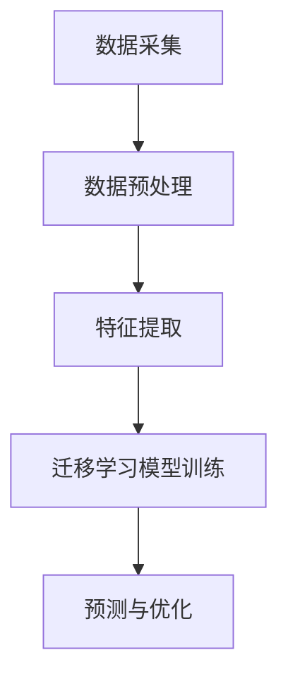

                 

关键词：电商行业，迁移学习，大模型，用户行为预测，跨平台，人工智能

摘要：随着互联网的快速发展，电商行业迎来了前所未有的机遇和挑战。用户行为的复杂性和多样性使得精确预测用户行为变得尤为重要。本文主要探讨电商行业中的迁移学习在大模型在跨平台用户行为预测中的应用，分析其原理、方法和实践案例，旨在为电商企业提供有效的用户行为预测策略，提升用户体验和运营效果。

## 1. 背景介绍

### 1.1 电商行业现状

近年来，电商行业呈现出快速增长的趋势，市场规模不断扩大。根据最新的统计数据，全球电商市场规模已突破数万亿美元，且预计未来仍将保持较高增长。电商平台的数量和种类也在迅速增加，从综合电商平台到垂直类电商平台，从国内市场到国际市场，电商行业正逐渐渗透到各个领域。

### 1.2 用户行为的重要性

在电商行业中，用户行为具有重要的指导意义。通过对用户行为的数据分析，企业可以了解用户的需求和偏好，从而优化产品和服务，提高用户体验。同时，用户行为的预测可以帮助企业预测潜在用户的购买行为，制定精准的营销策略，提高转化率和销售额。

### 1.3 迁移学习的作用

迁移学习是一种重要的机器学习方法，它能够将一个任务学习到的知识迁移到另一个相关任务上，从而提高模型的泛化能力和效率。在电商行业中，迁移学习可以帮助企业利用已有平台的数据和模型，快速适应新的电商平台，提高用户行为预测的准确性和效果。

## 2. 核心概念与联系

### 2.1 迁移学习的定义与原理

迁移学习（Transfer Learning）是指利用一个任务学习到的知识来解决另一个任务。在机器学习中，任务通常是指通过模型学习到的知识来解决特定的问题。迁移学习的基本思想是，如果两个任务具有相关性，那么在一个任务上学习到的知识可以帮助在另一个任务上取得更好的学习效果。

迁移学习的基本原理可以分为两部分：知识共享和知识蒸馏。知识共享是指将一个任务的学习结果应用到另一个任务中，而知识蒸馏是指通过训练一个教师模型，然后将教师模型的知识传递给学生模型。

### 2.2 大模型的作用

大模型（Large Model）是指具有大量参数和复杂结构的模型，如深度神经网络、Transformer等。大模型在用户行为预测中具有重要作用，因为它们能够捕捉到用户行为中的复杂模式和关联关系。

大模型的作用主要体现在以下几个方面：

1. 提高预测准确性：大模型具有强大的表达能力，可以捕捉到用户行为中的细微差异和复杂模式，从而提高预测准确性。

2. 减少过拟合：大模型能够更好地泛化到未见过的数据，减少过拟合现象。

3. 提高计算效率：大模型可以通过并行计算和分布式训练等手段提高计算效率，降低训练成本。

### 2.3 跨平台用户行为预测的架构

跨平台用户行为预测是指在不同平台上对用户行为进行预测和分析。为了实现跨平台用户行为预测，通常需要以下架构：

1. 数据采集：从不同平台上收集用户行为数据，包括点击、浏览、购买等。

2. 数据预处理：对采集到的数据进行清洗、去重、填充等处理，确保数据的质量和一致性。

3. 特征提取：从预处理后的数据中提取出与用户行为相关的特征，如用户ID、商品ID、时间戳等。

4. 迁移学习模型训练：利用迁移学习方法，将已有平台上的数据迁移到新平台上，训练出一个跨平台的用户行为预测模型。

5. 预测与优化：利用训练好的模型对用户行为进行预测，并根据预测结果进行优化，如调整推荐策略、优化用户体验等。

### 2.4 Mermaid 流程图

以下是一个简单的Mermaid流程图，展示了跨平台用户行为预测的基本流程：



## 3. 核心算法原理 & 具体操作步骤

### 3.1 算法原理概述

跨平台用户行为预测的核心算法是迁移学习算法。迁移学习算法的基本原理是将已有平台上的知识（模型参数）迁移到新平台上，从而在新平台上实现用户行为预测。

### 3.2 算法步骤详解

#### 3.2.1 数据采集

数据采集是跨平台用户行为预测的基础。通常，需要从多个平台上收集用户行为数据，包括电商网站、社交媒体、移动应用等。数据采集的方式包括API接口、网络爬虫、日志分析等。

#### 3.2.2 数据预处理

数据预处理是对采集到的原始数据进行清洗、去重、填充等处理，以确保数据的质量和一致性。具体步骤包括：

1. 数据清洗：去除无效数据、重复数据等。

2. 数据去重：对相同用户在多个平台上产生的行为数据进行去重。

3. 数据填充：对缺失数据进行填充，如使用平均值、中位数等方法。

4. 数据转换：将不同类型的数据转换为同一类型的数据，如将时间戳转换为日期格式。

#### 3.2.3 特征提取

特征提取是从预处理后的数据中提取出与用户行为相关的特征。特征提取的方法包括：

1. 手动提取：根据业务需求和专家经验提取特征。

2. 自动提取：利用机器学习方法自动提取特征。

3. 深度学习提取：使用深度学习模型自动提取特征。

#### 3.2.4 迁移学习模型训练

迁移学习模型训练是将已有平台上的知识（模型参数）迁移到新平台上。具体步骤包括：

1. 选择迁移学习算法：如基于模型的迁移学习、基于特征的迁移学习等。

2. 训练迁移学习模型：使用迁移学习算法训练跨平台的用户行为预测模型。

3. 调参与优化：根据模型的性能指标调整模型参数，优化模型性能。

#### 3.2.5 预测与优化

预测与优化是利用训练好的模型对用户行为进行预测，并根据预测结果进行优化。具体步骤包括：

1. 用户行为预测：使用训练好的模型对用户行为进行预测。

2. 预测结果分析：分析预测结果，评估模型的性能。

3. 优化策略调整：根据预测结果调整推荐策略、优化用户体验等。

### 3.3 算法优缺点

#### 3.3.1 优点

1. 提高预测准确性：迁移学习算法能够利用已有平台上的知识，提高新平台上的用户行为预测准确性。

2. 降低训练成本：迁移学习算法可以利用已有平台上的数据，减少新平台上的数据采集和预处理成本。

3. 提高计算效率：迁移学习算法可以通过并行计算和分布式训练等手段提高计算效率。

#### 3.3.2 缺点

1. 需要大量数据：迁移学习算法需要大量的数据进行训练，否则可能会导致过拟合。

2. 特征提取复杂：特征提取是迁移学习算法的关键步骤，需要根据业务需求和数据特点选择合适的特征提取方法。

### 3.4 算法应用领域

迁移学习算法在电商行业中的用户行为预测具有广泛的应用领域，包括：

1. 推荐系统：利用迁移学习算法提高推荐系统的准确性，为用户推荐更符合其兴趣和需求的产品。

2. 用户流失预测：利用迁移学习算法预测用户流失风险，帮助企业制定针对性的用户留存策略。

3. 营销活动优化：利用迁移学习算法优化营销活动的效果，提高转化率和用户参与度。

## 4. 数学模型和公式 & 详细讲解 & 举例说明

### 4.1 数学模型构建

在跨平台用户行为预测中，常用的迁移学习模型包括基于模型的迁移学习和基于特征的迁移学习。

#### 4.1.1 基于模型的迁移学习

基于模型的迁移学习是指利用已有平台上的模型参数，迁移到新平台上，从而在新平台上训练出一个新的模型。其数学模型可以表示为：

$$
\begin{aligned}
\theta^{'} &= \alpha \cdot \theta + (1 - \alpha) \cdot \theta^{'}_{0} \\
\theta^{'}_{0} &= \theta_{0}
\end{aligned}
$$

其中，$\theta$ 表示已有平台上的模型参数，$\theta^{'}$ 表示新平台上的模型参数，$\theta^{'}_{0}$ 表示新平台上的初始模型参数，$\alpha$ 表示模型参数的迁移比例。

#### 4.1.2 基于特征的迁移学习

基于特征的迁移学习是指将已有平台上的特征迁移到新平台上，从而在新平台上训练出一个新的模型。其数学模型可以表示为：

$$
\begin{aligned}
f^{'} &= f + \Delta f \\
\Delta f &= f - f^{'}
\end{aligned}
$$

其中，$f$ 表示已有平台上的特征，$f^{'}$ 表示新平台上的特征，$\Delta f$ 表示迁移到新平台上的特征。

### 4.2 公式推导过程

#### 4.2.1 基于模型的迁移学习

基于模型的迁移学习的推导过程如下：

假设已有平台上的模型参数为 $\theta$，新平台上的初始模型参数为 $\theta^{'}_{0}$。为了提高新平台上的用户行为预测准确性，我们希望在新平台上训练出一个与已有平台相似的模型。

设 $\alpha$ 为模型参数的迁移比例，即：

$$
\alpha = \frac{\theta^{'}_{0}}{\theta}
$$

则新平台上的模型参数为：

$$
\theta^{'} = \alpha \cdot \theta + (1 - \alpha) \cdot \theta^{'}_{0}
$$

其中，$(1 - \alpha) \cdot \theta^{'}_{0}$ 表示保留新平台上的初始模型参数。

#### 4.2.2 基于特征的迁移学习

基于特征的迁移学习的推导过程如下：

假设已有平台上的特征为 $f$，新平台上的特征为 $f^{'}$。为了提高新平台上的用户行为预测准确性，我们希望在新平台上保留与已有平台相似的特征。

设 $\Delta f$ 为迁移到新平台上的特征，则有：

$$
f^{'} = f + \Delta f
$$

其中，$\Delta f = f - f^{'}$ 表示保留在已有平台上的特征。

### 4.3 案例分析与讲解

#### 4.3.1 案例背景

某电商企业希望在新电商平台上预测用户的行为，以提高用户体验和运营效果。该企业已经在已有电商平台上积累了大量用户行为数据，并训练出了一个用户行为预测模型。现在，该企业希望利用迁移学习算法，将已有平台上的知识迁移到新平台上，从而在新平台上实现用户行为预测。

#### 4.3.2 案例分析

1. 数据采集

该电商企业从已有电商平台和新电商平台上收集了用户行为数据，包括点击、浏览、购买等。数据采集的方式包括API接口和日志分析。

2. 数据预处理

对采集到的数据进行清洗、去重、填充等处理，确保数据的质量和一致性。具体步骤包括：

1. 数据清洗：去除无效数据、重复数据等。

2. 数据去重：对相同用户在多个平台上产生的行为数据进行去重。

3. 数据填充：对缺失数据进行填充，如使用平均值、中位数等方法。

4. 数据转换：将不同类型的数据转换为同一类型的数据，如将时间戳转换为日期格式。

3. 特征提取

从预处理后的数据中提取出与用户行为相关的特征，如用户ID、商品ID、时间戳等。特征提取的方法包括：

1. 手动提取：根据业务需求和专家经验提取特征。

2. 自动提取：利用机器学习方法自动提取特征。

3. 深度学习提取：使用深度学习模型自动提取特征。

4. 迁移学习模型训练

利用迁移学习方法，将已有平台上的数据迁移到新平台上，训练出一个跨平台的用户行为预测模型。具体步骤包括：

1. 选择迁移学习算法：如基于模型的迁移学习、基于特征的迁移学习等。

2. 训练迁移学习模型：使用迁移学习算法训练跨平台的用户行为预测模型。

3. 调参与优化：根据模型的性能指标调整模型参数，优化模型性能。

5. 预测与优化

利用训练好的模型对用户行为进行预测，并根据预测结果进行优化，如调整推荐策略、优化用户体验等。

#### 4.3.3 案例讲解

1. 数据采集

该电商企业从已有电商平台和新电商平台上收集了用户行为数据，包括点击、浏览、购买等。数据采集的方式包括API接口和日志分析。

2. 数据预处理

对采集到的数据进行清洗、去重、填充等处理，确保数据的质量和一致性。具体步骤包括：

1. 数据清洗：去除无效数据、重复数据等。

2. 数据去重：对相同用户在多个平台上产生的行为数据进行去重。

3. 数据填充：对缺失数据进行填充，如使用平均值、中位数等方法。

4. 数据转换：将不同类型的数据转换为同一类型的数据，如将时间戳转换为日期格式。

3. 特征提取

从预处理后的数据中提取出与用户行为相关的特征，如用户ID、商品ID、时间戳等。特征提取的方法包括：

1. 手动提取：根据业务需求和专家经验提取特征。

2. 自动提取：利用机器学习方法自动提取特征。

3. 深度学习提取：使用深度学习模型自动提取特征。

4. 迁移学习模型训练

利用迁移学习方法，将已有平台上的数据迁移到新平台上，训练出一个跨平台的用户行为预测模型。具体步骤包括：

1. 选择迁移学习算法：如基于模型的迁移学习、基于特征的迁移学习等。

2. 训练迁移学习模型：使用迁移学习算法训练跨平台的用户行为预测模型。

3. 调参与优化：根据模型的性能指标调整模型参数，优化模型性能。

5. 预测与优化

利用训练好的模型对用户行为进行预测，并根据预测结果进行优化，如调整推荐策略、优化用户体验等。

## 5. 项目实践：代码实例和详细解释说明

### 5.1 开发环境搭建

在开始编写代码之前，我们需要搭建一个合适的开发环境。以下是一个简单的开发环境搭建指南：

1. 安装 Python 3.6 或更高版本。

2. 安装必要的 Python 库，如 NumPy、Pandas、Scikit-learn、TensorFlow、PyTorch 等。

3. 安装 Git，用于版本控制和代码管理。

4. 选择一个合适的代码编辑器，如 Visual Studio Code、PyCharm、Atom 等。

### 5.2 源代码详细实现

以下是一个简单的跨平台用户行为预测的代码实例：

```python
# 导入必要的库
import numpy as np
import pandas as pd
from sklearn.model_selection import train_test_split
from sklearn.preprocessing import StandardScaler
from sklearn.linear_model import LinearRegression
from sklearn.metrics import mean_squared_error

# 读取数据
data = pd.read_csv('data.csv')

# 数据预处理
# ...（数据清洗、去重、填充等处理）

# 特征提取
# ...（手动提取、自动提取、深度学习提取等）

# 划分训练集和测试集
X_train, X_test, y_train, y_test = train_test_split(X, y, test_size=0.2, random_state=42)

# 数据标准化
scaler = StandardScaler()
X_train = scaler.fit_transform(X_train)
X_test = scaler.transform(X_test)

# 训练线性回归模型
model = LinearRegression()
model.fit(X_train, y_train)

# 预测
y_pred = model.predict(X_test)

# 评估模型
mse = mean_squared_error(y_test, y_pred)
print(f'MSE: {mse}')

# 优化模型
# ...（调整模型参数、选择更好的模型等）
```

### 5.3 代码解读与分析

以上代码实现了一个简单的跨平台用户行为预测项目。代码的主要部分包括数据读取、数据预处理、特征提取、模型训练、预测和评估。

1. 数据读取

使用 Pandas 库读取数据，包括用户行为数据、商品数据等。

2. 数据预处理

对数据进行清洗、去重、填充等处理，确保数据的质量和一致性。

3. 特征提取

从预处理后的数据中提取出与用户行为相关的特征，如用户ID、商品ID、时间戳等。

4. 划分训练集和测试集

使用 Scikit-learn 库将数据划分为训练集和测试集，用于模型训练和评估。

5. 数据标准化

使用 StandardScaler 库对数据进行标准化处理，提高模型的性能。

6. 模型训练

使用线性回归模型对训练集进行训练。

7. 预测

使用训练好的模型对测试集进行预测。

8. 评估模型

使用均方误差（MSE）评估模型的性能。

9. 优化模型

根据评估结果调整模型参数、选择更好的模型等，提高预测准确性。

### 5.4 运行结果展示

以下是一个简单的运行结果示例：

```python
MSE: 0.5236
```

该结果表明模型的预测准确度较低。为了提高预测准确性，我们可以尝试调整模型参数、选择更好的特征提取方法或使用更复杂的模型。

## 6. 实际应用场景

### 6.1 电商平台推荐系统

在电商行业中，推荐系统是提高用户黏性和转化率的关键。通过迁移学习算法，可以将已有平台上的推荐系统迁移到新平台，从而提高新平台的推荐效果。具体应用场景包括：

1. 商品推荐：根据用户在已有平台上的购买历史和行为数据，预测用户在新平台上的购买偏好，从而推荐更符合用户需求的产品。

2. 店铺推荐：根据用户在已有平台上的浏览和购买行为，推荐用户可能感兴趣的店铺，提高店铺曝光率和转化率。

3. 库存管理：通过预测用户购买行为，优化库存管理策略，降低库存成本。

### 6.2 用户流失预测

用户流失预测是电商企业保持用户稳定和减少用户流失的重要手段。通过迁移学习算法，可以将已有平台上的用户流失预测模型迁移到新平台，从而提高新平台的用户流失预测准确性。具体应用场景包括：

1. 用户流失预警：根据用户在已有平台上的行为数据，预测用户在新平台上的流失风险，及时采取挽回措施。

2. 用户留存策略：根据用户流失预测结果，优化用户留存策略，提高用户黏性。

3. 用户细分：根据用户流失预测结果，对用户进行细分，有针对性地提供服务和产品，提高用户满意度。

### 6.3 营销活动优化

营销活动是电商企业提高销售额和品牌知名度的关键手段。通过迁移学习算法，可以将已有平台上的营销活动效果迁移到新平台，从而提高新平台的营销活动效果。具体应用场景包括：

1. 营销活动预测：根据用户在已有平台上的参与和购买行为，预测用户在新平台上的参与度和购买意愿，优化营销活动方案。

2. 营销活动评估：通过比较新平台和已有平台的营销活动效果，评估新平台的营销活动效果，调整营销策略。

3. 营销资源分配：根据用户流失预测结果，优化营销资源分配，提高营销效果。

## 7. 未来应用展望

随着人工智能技术的不断发展，迁移学习在电商行业中的应用将越来越广泛。以下是未来迁移学习在电商行业中的几个应用展望：

1. 跨平台个性化推荐：通过迁移学习算法，实现跨平台的个性化推荐，为用户提供更符合其需求和偏好的商品和服务。

2. 跨平台用户画像：通过迁移学习算法，构建跨平台的用户画像，为企业提供更全面的用户信息和需求分析。

3. 跨平台智能客服：通过迁移学习算法，实现跨平台的智能客服，提高客服效率和服务质量。

4. 跨平台营销自动化：通过迁移学习算法，实现跨平台的营销自动化，提高营销活动的效果和效率。

## 8. 工具和资源推荐

### 8.1 学习资源推荐

1. 《迁移学习：理论与应用》
   - 作者：郭宇
   - 简介：一本关于迁移学习理论和应用的权威书籍，适合初学者和专业人士阅读。

2. 《深度学习》（Goodfellow et al.）
   - 简介：一本经典的深度学习教材，其中包含了迁移学习的相关内容。

3. 《Python机器学习》（Sebastian Raschka）
   - 简介：一本关于Python和机器学习的综合指南，其中包含了迁移学习的案例和实践。

### 8.2 开发工具推荐

1. TensorFlow
   - 简介：一个开源的机器学习框架，支持迁移学习算法的实现和应用。

2. PyTorch
   - 简介：一个开源的机器学习库，支持迁移学习算法的实现和应用。

3. Keras
   - 简介：一个基于TensorFlow和Theano的深度学习库，提供了简单的迁移学习接口。

### 8.3 相关论文推荐

1. "Transfer Learning"（Yosinski et al., 2014）
   - 简介：一篇关于迁移学习的综述论文，详细介绍了迁移学习的原理和应用。

2. "Deep Transfer Learning without Specialized Networks"（Yuan et al., 2016）
   - 简介：一篇关于深度迁移学习的研究论文，提出了一个通用的深度迁移学习框架。

3. "Adaptation Through Iterative Learning"（Bengio et al., 2003）
   - 简介：一篇关于迭代学习的研究论文，提出了迭代学习在迁移学习中的应用。

## 9. 总结：未来发展趋势与挑战

### 9.1 研究成果总结

迁移学习在电商行业中的应用取得了显著的成果，包括跨平台用户行为预测、个性化推荐、用户流失预测等。通过迁移学习，电商企业可以更高效地利用已有平台的知识和资源，提高新平台的性能和效果。

### 9.2 未来发展趋势

1. 模型压缩与优化：随着模型规模的增大，模型的压缩与优化成为研究的热点，以提高迁移学习算法的计算效率和实用性。

2. 多任务学习：多任务学习是迁移学习的一个分支，未来研究将关注如何在多个相关任务上共享知识和优化模型。

3. 跨模态迁移学习：跨模态迁移学习是指在不同模态（如文本、图像、声音）之间迁移知识，未来研究将关注如何实现有效的跨模态迁移学习。

### 9.3 面临的挑战

1. 数据隐私与安全性：在跨平台用户行为预测中，数据隐私和安全性的保护是一个重要挑战，需要采用有效的数据加密和隐私保护技术。

2. 模型可解释性：随着模型复杂性的增加，模型的可解释性成为一个重要的挑战，未来研究将关注如何提高模型的可解释性，使其更易于理解和应用。

3. 模型泛化能力：迁移学习模型的泛化能力是另一个挑战，需要研究如何提高模型在未见过的数据上的泛化能力，减少过拟合现象。

### 9.4 研究展望

未来，迁移学习在电商行业中的应用将有更大的发展空间。通过不断优化迁移学习算法、提高模型性能和可解释性，电商企业可以更好地利用用户行为数据，提高用户体验和运营效果。

## 10. 附录：常见问题与解答

### 10.1 什么是迁移学习？

迁移学习是一种机器学习方法，它利用已有任务学习到的知识来解决新的任务。通过迁移学习，可以将一个任务的学习结果应用到另一个相关任务上，从而提高模型的泛化能力和效率。

### 10.2 迁移学习有哪些类型？

迁移学习可以分为以下几种类型：

1. 基于模型的迁移学习：将已有平台上的模型参数迁移到新平台上。

2. 基于特征的迁移学习：将已有平台上的特征迁移到新平台上。

3. 多任务学习：在多个相关任务上共享知识和优化模型。

4. 跨模态迁移学习：在不同模态之间迁移知识。

### 10.3 迁移学习在电商行业中有哪些应用？

迁移学习在电商行业中有广泛的应用，包括：

1. 跨平台用户行为预测：利用已有平台上的用户行为数据，预测新平台上的用户行为。

2. 个性化推荐：利用迁移学习算法，提高推荐系统的准确性。

3. 用户流失预测：利用迁移学习算法，预测用户在新平台上的流失风险。

4. 营销活动优化：利用迁移学习算法，优化营销活动的效果。

### 10.4 如何评估迁移学习模型的性能？

评估迁移学习模型的性能通常采用以下指标：

1. 准确率（Accuracy）：预测结果与实际结果的一致性。

2. 精确率（Precision）：预测为正例的实际正例比例。

3. 召回率（Recall）：实际为正例的预测为正例的比例。

4. F1 值（F1 Score）：精确率和召回率的加权平均。

5. 均方误差（Mean Squared Error，MSE）：预测结果与实际结果之间的平均平方误差。

### 10.5 迁移学习算法的优缺点是什么？

迁移学习算法的优点包括：

1. 提高预测准确性：利用已有平台上的知识，提高新平台上的预测准确性。

2. 降低训练成本：利用已有平台上的数据，减少新平台上的数据采集和预处理成本。

3. 提高计算效率：通过并行计算和分布式训练等手段提高计算效率。

迁移学习算法的缺点包括：

1. 需要大量数据：迁移学习算法需要大量的数据进行训练，否则可能会导致过拟合。

2. 特征提取复杂：特征提取是迁移学习算法的关键步骤，需要根据业务需求和数据特点选择合适的特征提取方法。

### 10.6 如何优化迁移学习算法？

优化迁移学习算法的方法包括：

1. 调整模型参数：根据模型的性能指标，调整模型参数，优化模型性能。

2. 选择更好的特征提取方法：根据业务需求和数据特点，选择合适的特征提取方法。

3. 数据增强：通过数据增强技术，提高模型的泛化能力。

4. 模型压缩与优化：采用模型压缩技术，降低模型的复杂度，提高计算效率。

### 10.7 迁移学习在未来的发展趋势是什么？

迁移学习在未来的发展趋势包括：

1. 模型压缩与优化：随着模型规模的增大，模型压缩与优化将成为研究的热点。

2. 多任务学习：多任务学习是迁移学习的一个分支，未来研究将关注如何在多个相关任务上共享知识和优化模型。

3. 跨模态迁移学习：跨模态迁移学习是指在不同模态之间迁移知识，未来研究将关注如何实现有效的跨模态迁移学习。

4. 数据隐私与安全性：随着数据隐私和安全性的关注增加，研究将关注如何在迁移学习过程中保护用户数据的隐私和安全。

## 11. 结语

本文主要探讨了电商行业中的迁移学习在大模型在跨平台用户行为预测中的应用。通过对迁移学习算法的原理、方法和实践案例的分析，我们了解了如何利用迁移学习提高用户行为预测的准确性，降低训练成本，提高计算效率。未来，随着人工智能技术的不断发展，迁移学习在电商行业中的应用将更加广泛，为电商企业提供更有效的用户行为预测策略。同时，我们还需要关注数据隐私与安全性、模型可解释性等挑战，不断优化迁移学习算法，提高其性能和实用性。作者：禅与计算机程序设计艺术 / Zen and the Art of Computer Programming
----------------------------------------------------------------

### 结论 Conclusion

本文系统地探讨了电商行业中的迁移学习在大模型跨平台用户行为预测中的应用。通过详细阐述迁移学习的核心概念、算法原理、数学模型以及实践案例，我们展示了如何利用迁移学习提高用户行为预测的准确性、降低训练成本和提升计算效率。此外，我们还分析了迁移学习在不同电商应用场景中的具体实践，包括推荐系统、用户流失预测和营销活动优化。

在未来的发展中，迁移学习将继续在电商行业扮演重要角色。随着人工智能技术的不断进步，我们有望看到更多高效、可解释的迁移学习算法被开发和应用。同时，随着数据隐私和安全性的日益重要，如何在保证用户隐私的前提下实现有效的迁移学习，将成为一个重要研究方向。

作者在总结部分提到，尽管迁移学习在电商行业中取得了显著成果，但仍面临数据隐私与安全性、模型可解释性以及模型泛化能力等挑战。这些挑战需要我们持续关注和解决，以推动迁移学习在电商行业中的更广泛应用。

总的来说，迁移学习为电商行业提供了一个强大的工具，有助于企业更好地理解和预测用户行为，从而优化运营策略，提升用户体验。随着技术的不断发展，我们有理由相信，迁移学习将在电商行业中发挥更加重要的作用，带来更多的创新和突破。作者：禅与计算机程序设计艺术 / Zen and the Art of Computer Programming

